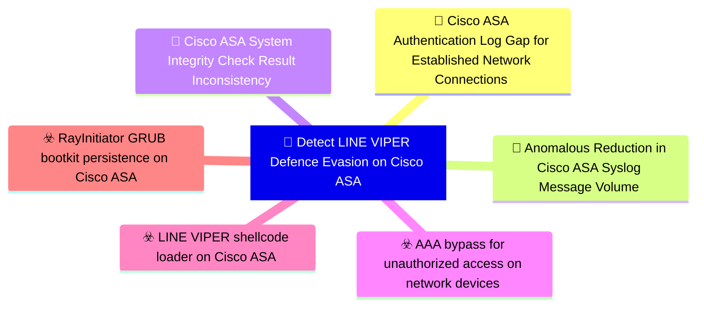

# 🎯 Detect LINE VIPER Defence Evasion on Cisco ASA

**🚩 Priority : `Critical`**

🚦 **TLP:CLEAR** ⚪ : Recipients can spread this to the world, there is no limit on disclosure.

🗡️ **ATT&CK Techniques** :  [T1562.001 : Impair Defenses: Disable or Modify Tools](https://attack.mitre.org/techniques/T1562/001 'Adversaries may modify andor disable security tools to avoid possible detection of their malwaretools and activities This may take many forms, such as'), [T1562 : Impair Defenses](https://attack.mitre.org/techniques/T1562 'Adversaries may maliciously modify components of a victim environment in order to hinder or disable defensive mechanisms This not only involves impair'), [T1556 : Modify Authentication Process](https://attack.mitre.org/techniques/T1556 'Adversaries may modify authentication mechanisms and processes to access user credentials or enable otherwise unwarranted access to accounts The authe'), [T1550 : Use Alternate Authentication Material](https://attack.mitre.org/techniques/T1550 'Adversaries may use alternate authentication material, such as password hashes, Kerberos tickets, and application access tokens, in order to move late'), [T1014 : Rootkit](https://attack.mitre.org/techniques/T1014 'Adversaries may use rootkits to hide the presence of programs, files, network connections, services, drivers, and other system components Rootkits are'), [T1040 : Network Sniffing](https://attack.mitre.org/techniques/T1040 'Adversaries may passively sniff network traffic to capture information about an environment, including authentication material passed over the network')

---

`🔑 UUID : 7c0f2788-690e-4d34-b9eb-5f76e7363ccc` **|** `🏷️ Version : 1` **|** `🗓️ Creation Date : 2026-06-18` **|** `🗓️ Last Modification : 2026-06-18` **|** `👩‍💻 Model author : None` **|** `👥 Contributors : None` **|** `Sharing Organisation : {'uuid': '56b0a0f0-b0bc-47d9-bb46-02f80ae2065a', 'name': 'EC DIGIT CSOC'}` **|** `🧱 Schema Identifier : dom::1.0`

## 💡 Objective

**🏷️ Type** : Threat - Alerts meant for detection cybersecurity threats, and which should eventually trigger Incident Response  

> This detection objective addresses the defence evasion and anti-
> forensic capabilities of the LINE VIPER implant on Cisco ASA devices,
> specifically the AAA authentication bypass, syslog message
> suppression, and system integrity check manipulation.
> 
> LINE VIPER operates as a memory-resident implant within the lina
> binary and hooks multiple subsystems to suppress evidence of its
> presence and operations. These capabilities collectively reduce the
> security telemetry available from a compromised ASA device, making
> detection through conventional log analysis unreliable.
> 
> Detection must therefore focus on identifying the ABSENCE of expected
> telemetry (authentication logs for established connections, expected
> syslog messages) as well as inconsistencies in Cisco ASA integrity
> check outputs compared to out-of-band verification.
> 
> This is a high-investment objective requiring collection of Cisco
> ASA syslog at high fidelity, establishment of behavioural baselines,
> and integration of out-of-band integrity verification processes.
> 

**🎼 Composition** : Independent - No composition performed, each signal can be treated as independent, unrelated alerts.

> The three signals in this objective address distinct defence
evasion mechanisms and can each be deployed independently.
Together they provide complementary coverage:

1. **AAA log gap** targets the authentication bypass by detecting
   the absence of expected authentication records for established
   network connections — a signal that is difficult to suppress
   without removing the connection telemetry entirely.

2. **Syslog suppression** targets the absence of expected ASA
   system messages, using statistical baselining to detect when
   the volume or pattern of syslog output diverges from the
   normal operational profile.

3. **Integrity check manipulation** targets LINE VIPER's patching
   of Cisco ASA system integrity checks, surfacing divergence
   between on-device integrity check results and out-of-band
   verification using trusted reference images.

Each signal can independently trigger investigation of a
potentially compromised ASA device. Correlation across signals
on the same device significantly increases confidence.

### 🌊 Related OpenTide Objects

**Threats**

| ☣️ Threat Vectors (3)                                                                                                                                                                                                                                                                                             |
|:------------------------------------------------------------------------------------------------------------------------------------------------------------------------------------------------------------------------------------------------------------------------------------------------------------------|
| [AAA bypass for unauthorized access on network devices](../Threat%20Vectors/☣️%20AAA%20bypass%20for%20unauthorized%20access%20on%20network%20devices 'LINE VIPER implements a critical capability to bypassAuthentication, Authorization, and Accounting AAA mechanisms oncompromised Cisco ASA devices 1 Th...') |
| [RayInitiator GRUB bootkit persistence on Cisco ASA](../Threat%20Vectors/☣️%20RayInitiator%20GRUB%20bootkit%20persistence%20on%20Cisco%20ASA 'RayInitiator is a sophisticated persistent multi-stage bootkit thatfacilitates the deployment of LINE VIPER malware to Cisco ASAAdaptive Security Appl...')         |
| [LINE VIPER shellcode loader on Cisco ASA](../Threat%20Vectors/☣️%20LINE%20VIPER%20shellcode%20loader%20on%20Cisco%20ASA 'LINE VIPER is a sophisticated user-mode shellcode loader withassociated modules that targets Cisco ASA Adaptive SecurityAppliance devices It represent...')                             |

**Rules**

| 📡 Detection Objective Signals (3)                                                                                                                                                                                                                                                                         | 🚨 Detection Rules    |
|:----------------------------------------------------------------------------------------------------------------------------------------------------------------------------------------------------------------------------------------------------------------------------------------------------------|:---------------------|
| [Cisco ASA Authentication Log Gap for Established Network Connections](#cisco-asa-authentication-log-gap-for-established-network-connections 'Detects the absence of expected Cisco ASA AAA authenticationsyslog events for network connections that are otherwise visiblein traffic logs, indicatin...') | ❌ No Detection Rules |
| [Anomalous Reduction in Cisco ASA Syslog Message Volume](#anomalous-reduction-in-cisco-asa-syslog-message-volume 'Detects statistical anomalies in Cisco ASA syslog output volumeor message type distribution that may indicate LINE VIPERssyslog suppression capability...')                             | ❌ No Detection Rules |
| [Cisco ASA System Integrity Check Result Inconsistency](#cisco-asa-system-integrity-check-result-inconsistency 'Detects divergence between Cisco ASA on-device system integritycheck results and out-of-band verification of device imageintegrity, indicating LINE VI...')                               | ❌ No Detection Rules |

## 📡 Signals

### Cisco ASA Authentication Log Gap for Established Network Connections

🪪 **UUID** : `0114324a-80a5-46cb-a75c-6f4a2301b7e5`

> Detects the absence of expected Cisco ASA AAA authentication
syslog events for network connections that are otherwise visible
in traffic logs, indicating LINE VIPER's AAA bypass capability
is suppressing authentication records [1].

LINE VIPER hooks AAA processing in lina to allow actor-
controlled devices to connect without generating authentication
logs. In normal operation, all connections requiring
authentication generate syslog events (e.g., `%ASA-6-113015`,
`%ASA-6-113005`, `%ASA-6-713228` for VPN authentication).

Detection approach (negative signal / log gap):
- Establish baseline of expected authentication syslog message
  types and volumes per Cisco ASA device
- Correlate established VPN sessions or management connections
  (visible in `%ASA-6-602303` ISAKMP or NetFlow) against
  corresponding authentication syslog events
- Alert when connections are established or sustained without
  corresponding AAA authentication success or failure events
- Monitor for sustained periods (>10 minutes) of network
  activity from an external IP to the ASA without any
  associated authentication log entries

This is a statistical/absence-based signal. Tuning requires
a well-established baseline. Note that some connections (e.g.,
pre-shared key VPNs configured without AAA) may legitimately
lack authentication logs — these must be documented and
excluded.

**🔎 Data Visibility**

- **Availability** : Partial
- **Requirements** : `- Cisco ASA syslog at minimum severity level 6 (informational)
  to a centralised SIEM
- NetFlow/IPFIX or connection logs to correlate traffic with
  authentication events
- Documented baseline of legitimate non-AAA connections
- SIEM correlation rules capable of absence/gap detection
  across multiple event types

Preferred log sources:
- Cisco ASA syslog forwarded to SIEM (all severity levels)
- NetFlow from upstream infrastructure
- Cisco Identity Services Engine (ISE) RADIUS/TACACS+ logs
  as supplementary authentication record source
`

_💾 Possible logsources_

_❌ No logsources mentioned_

**🧲 Related Entities**

| Name               | Category                                        | Description                                                                                                                                                                                      |
|:-------------------|:------------------------------------------------|:-------------------------------------------------------------------------------------------------------------------------------------------------------------------------------------------------|
| Authentication     | **Host Entities** : Host Related Entities       | Represents an authentication attempt, including the user, source IP, and success or failure status. Authentication events are critical for detecting brute force attacks or unauthorized access. |
| IP Address         | **Network Entities** : Network Related Entities | Represents an IPv4 or IPv6 address associated with a host or networkconnection.                                                                                                                  |
| Hostname           | **Host Entities** : Host Related Entities       | Represents the name of a host or device in the network.                                                                                                                                          |
| Network Connection | **Network Entities** : Network Related Entities | Represents a network connection, including source and destination IPs, ports, and protocols. This entity is critical for detecting suspicious or unauthorized communication between systems.     |

**⚠️ Detectors**

_❌ No detectors mentioned_

**🌐 Examples**

_❌ No examples mentioned_

### Anomalous Reduction in Cisco ASA Syslog Message Volume

🪪 **UUID** : `10482800-4d71-4246-93f4-6edfc4705b86`

> Detects statistical anomalies in Cisco ASA syslog output volume
or message type distribution that may indicate LINE VIPER's
syslog suppression capability is filtering specific message
categories to conceal malicious activity [1].

LINE VIPER suppresses specific syslog messages on the
compromised ASA device. This manifests as an unexpected drop
in the volume of particular syslog message types (e.g.,
authentication events, connection events, crypto events) while
the device continues to process traffic.

Detection criteria:
- Statistical baseline deviation: syslog message volume for
  specific facility/severity combinations drops below a defined
  threshold relative to observed traffic volume on the device
- Absence of expected recurring syslog message types during
  periods of known device activity (e.g., no `%ASA-6-302013`
  TCP connection events during periods with confirmed TCP flows)
- Sudden reduction in aggregate syslog event rate from an ASA
  device without a corresponding reduction in handled traffic
  or known maintenance window
- Disappearance of specific message IDs that were previously
  consistently present in the syslog stream

This signal requires a well-established baseline syslog profile
per device. Syslog gaps caused by network issues between the
ASA and syslog server must be distinguished from in-device
suppression through cross-validation with alternative telemetry.

**🔎 Data Visibility**

- **Availability** : Partial
- **Requirements** : `- Centralised syslog collection from all Cisco ASA devices
- Historical syslog baseline per device (minimum 4 weeks)
- Statistical analysis capability in SIEM (volume trending,
  anomaly scoring)
- Supplementary traffic telemetry (NetFlow, SNMP interface
  counters) for cross-validation of device activity levels

Preferred log sources:
- Cisco ASA syslog (all facility levels forwarded to SIEM)
- SNMP interface counter polling for traffic volume baseline
- NetFlow as independent traffic volume indicator
`

_💾 Possible logsources_

_❌ No logsources mentioned_

**🧲 Related Entities**

| Name     | Category                                  | Description                                                                                                                                                              |
|:---------|:------------------------------------------|:-------------------------------------------------------------------------------------------------------------------------------------------------------------------------|
| Hostname | **Host Entities** : Host Related Entities | Represents the name of a host or device in the network.                                                                                                                  |
| Software | **Host Entities** : Host Related Entities | Represents a software package, including its name, version, and installation source. Software packages are often analyzed to detect unauthorized or vulnerable software. |

**⚠️ Detectors**

_❌ No detectors mentioned_

**🌐 Examples**

_❌ No examples mentioned_

### Cisco ASA System Integrity Check Result Inconsistency

🪪 **UUID** : `9666e19f-f48d-4a0b-bb3e-0efbd69e8eac`

> Detects divergence between Cisco ASA on-device system integrity
check results and out-of-band verification of device image
integrity, indicating LINE VIPER has patched the integrity
checking mechanism to return falsely clean results [1].

LINE VIPER patches Cisco ASA system integrity checks within
the lina binary to return results indicating the device is
uncompromised, even when malicious modifications are present
in memory or on disk. This means the standard `show
version` or Cisco's ROMMON integrity verification may report
a clean state on a compromised device.

Detection approach:
- Collect Cisco ASA integrity check results via standard
  management interfaces (`show version`, `verify /sha-512
  <image>`, Cisco Trust Anchor Technologies where available)
- Independently verify image integrity by extracting the boot
  image hash via out-of-band access (ROMMON/console) or
  comparing against Cisco Software Checker hashes for the
  specific firmware version
- Alert on any discrepancy between on-device integrity check
  output and independently computed reference hashes
- Monitor for changes in integrity check output format or
  unexpectedly clean results following known indicators of
  compromise on the device

Given that LINE VIPER targets firmware versions 9.12(4)67
and 9.14(4)24, these specific versions warrant priority
integrity verification when detected in the environment.

**🔎 Data Visibility**

- **Availability** : Partial
- **Requirements** : `- Cisco ASA management access for `verify` and `show version`
  command execution
- Out-of-band console or ROMMON access capability for
  independent verification
- Reference hash library for targeted Cisco ASA firmware
  versions (from Cisco CCO/Software Checker)
- Scheduled integrity check process (automated preferred)

Preferred log sources:
- Cisco ASA management plane command output (collected via
  automated scripts or Cisco DNA Center)
- Cisco PSIRT advisories and Software Checker for reference
  hashes
- ROMMON console output for independent boot image hash
`

_💾 Possible logsources_

_❌ No logsources mentioned_

**🧲 Related Entities**

| Name      | Category                                  | Description                                                                                                                                                              |
|:----------|:------------------------------------------|:-------------------------------------------------------------------------------------------------------------------------------------------------------------------------|
| Hostname  | **Host Entities** : Host Related Entities | Represents the name of a host or device in the network.                                                                                                                  |
| Software  | **Host Entities** : Host Related Entities | Represents a software package, including its name, version, and installation source. Software packages are often analyzed to detect unauthorized or vulnerable software. |
| File Hash | **Host Entities** : Host Related Entities | Represents the hash of a file, used to uniquely identify its contents.                                                                                                   |

**⚠️ Detectors**

_❌ No detectors mentioned_

**🌐 Examples**

_❌ No examples mentioned_

## References

**🕊️ Publicly available resources**

- [_1_] https://www.ncsc.gov.uk/static-assets/documents/malware-analysis-reports/RayInitiator-LINE-VIPER/ncsc-mar-rayinitiator-line-viper.pdf

[1]: https://www.ncsc.gov.uk/static-assets/documents/malware-analysis-reports/RayInitiator-LINE-VIPER/ncsc-mar-rayinitiator-line-viper.pdf

