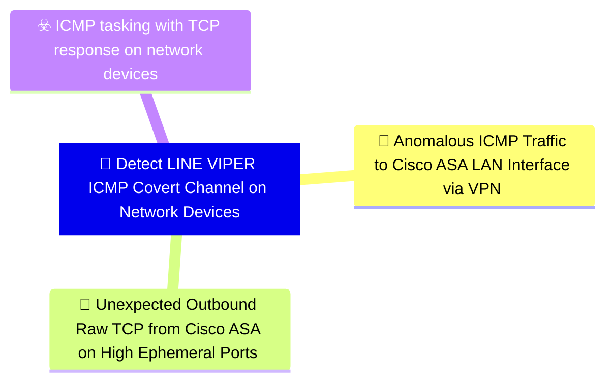

# 🎯 Detect LINE VIPER ICMP Covert Channel on Network Devices

**🚩 Priority : `High`**

🚦 **TLP:CLEAR** ⚪ : Recipients can spread this to the world, there is no limit on disclosure.

🗡️ **ATT&CK Techniques** :  [T1095 : Non-Application Layer Protocol](https://attack.mitre.org/techniques/T1095 'Adversaries may use an OSI non-application layer protocol for communication between host and C2 server or among infected hosts within a network The li'), [T1571 : Non-Standard Port](https://attack.mitre.org/techniques/T1571 'Adversaries may communicate using a protocol and port pairing that are typically not associated For example, HTTPS over port 8088Citation Symantec Elf'), [T1573.001 : Encrypted Channel: Symmetric Cryptography](https://attack.mitre.org/techniques/T1573/001 'Adversaries may employ a known symmetric encryption algorithm to conceal command and control traffic rather than relying on any inherent protections p'), [T1573.002 : Encrypted Channel: Asymmetric Cryptography](https://attack.mitre.org/techniques/T1573/002 'Adversaries may employ a known asymmetric encryption algorithm to conceal command and control traffic rather than relying on any inherent protections '), [T1480.001 : Execution Guardrails: Environmental Keying](https://attack.mitre.org/techniques/T1480/001 'Adversaries may environmentally key payloads or other features of malware to evade defenses and constraint execution to a specific target environment ')

---

`🔑 UUID : d8372ac1-2740-4cb2-b834-2e1622380b7b` **|** `🏷️ Version : 1` **|** `🗓️ Creation Date : 2026-06-18` **|** `🗓️ Last Modification : 2026-06-18` **|** `👩‍💻 Model author : None` **|** `👥 Contributors : None` **|** `Sharing Organisation : {'uuid': '56b0a0f0-b0bc-47d9-bb46-02f80ae2065a', 'name': 'EC DIGIT CSOC'}` **|** `🧱 Schema Identifier : dom::1.0`

## 💡 Objective

**🏷️ Type** : Threat - Alerts meant for detection cybersecurity threats, and which should eventually trigger Incident Response  

> This detection objective targets the secondary LINE VIPER command
> and control channel that uses crafted ICMP Echo Requests to deliver
> encrypted tasking commands to the compromised Cisco ASA device, with
> results returned over raw TCP connections using high-ephemeral ports.
> 
> The dual-protocol design — ICMP inbound, TCP outbound — is
> deliberately asymmetric to complicate correlation. The ICMP tasking
> channel is not sent to the WAN interface but is instead tunnelled
> through an established VPN session to a LAN interface, evading
> WAN-focused monitoring.
> 
> Detection relies on identifying statistically anomalous ICMP traffic
> reaching LAN interfaces of network devices (particularly Cisco ASA)
> via VPN tunnels, combined with correlation of unexpected outbound
> raw TCP connections from the same device on high-ephemeral ports in
> temporal proximity to the ICMP events.
> 

**🎼 Composition** : Sequence - Signals must be tracked across time, and correlated based on a succession of events. Particularly useful for weak signals, but which assembled over time with reinforcing signal provide a high fidelity detection - for example, anomalous logons.

> The two signals in this objective are most effective when
correlated as a temporal sequence: anomalous ICMP reaching the
ASA LAN interface should be followed shortly by an unexpected
outbound raw TCP connection from the ASA on a high-ephemeral port
to an attacker-controlled IP.

The sequence detection windows should be bounded (e.g., within
30-120 seconds) as LINE VIPER responds promptly to tasking. Each
signal independently provides value but both together provide
high-confidence detection of active ICMP C2 tasking:

1. **ICMP anomaly signal** fires on unusual ICMP traffic patterns
   to ASA LAN interfaces via VPN.
2. **Outbound TCP signal** fires on unexpected raw TCP connections
   from the ASA to non-standard ports on external IPs.

Correlating the same ASA device (Hostname/IP) across both signals
within the detection window confirms active C2 activity.

### 🌊 Related OpenTide Objects

**Threats**

| ☣️ Threat Vectors                                                                                                                                                                                                                                                                                         |
|:----------------------------------------------------------------------------------------------------------------------------------------------------------------------------------------------------------------------------------------------------------------------------------------------------------|
| [ICMP tasking with TCP response on network devices](../Threat%20Vectors/☣️%20ICMP%20tasking%20with%20TCP%20response%20on%20network%20devices 'LINE VIPER implements a sophisticated alternative command andcontrol mechanism that uses ICMP Internet Control Message Protocolfor receiving tasking c...') |

**Rules**

| 📡 Detection Objective Signals (2)                                                                                                                                                                                                                                                                     | 🚨 Detection Rules    |
|:------------------------------------------------------------------------------------------------------------------------------------------------------------------------------------------------------------------------------------------------------------------------------------------------------|:---------------------|
| [Anomalous ICMP Traffic to Cisco ASA LAN Interface via VPN](#anomalous-icmp-traffic-to-cisco-asa-lan-interface-via-vpn 'Detects unusual ICMP Echo Request traffic directed at the LANinterface of a Cisco ASA device originating from VPN-connectedclients, consistent with LI...')                   | ❌ No Detection Rules |
| [Unexpected Outbound Raw TCP from Cisco ASA on High Ephemeral Ports](#unexpected-outbound-raw-tcp-from-cisco-asa-on-high-ephemeral-ports 'Detects unexpected outbound TCP connections initiated from aCisco ASA device to external IP addresses using high-ephemeralsource andor destination por...') | ❌ No Detection Rules |

## 📡 Signals

### Anomalous ICMP Traffic to Cisco ASA LAN Interface via VPN

🪪 **UUID** : `baad1929-d23a-4a58-a269-e49244a22ea6`

> Detects unusual ICMP Echo Request traffic directed at the LAN
interface of a Cisco ASA device originating from VPN-connected
clients, consistent with LINE VIPER ICMP-based C2 tasking [1].

In observed LINE VIPER operations, ICMP tasking is not sent
to the WAN interface but tunnelled through an established VPN
session to reach the LAN interface. This is unusual as ICMP
traffic to network appliance interfaces from VPN clients is
uncommon in most environments.

Detection criteria:
- ICMP Echo Requests destined for the ASA's internal (LAN)
  interface IP addresses originating from VPN tunnel sources
- ICMP payloads exceeding typical ping sizes (>64 bytes)
  or containing high-entropy content inconsistent with standard
  ping tools
- ICMP Echo Requests from VPN client IPs not associated with
  legitimate network diagnostic activity (no prior session
  pattern, unusual time of day, single host sending repeated
  large ICMP packets)
- Absence of corresponding ICMP Echo Replies from the ASA
  (LINE VIPER may not respond via ICMP, only via raw TCP)

Tuning note: Establish a baseline of legitimate ICMP traffic
to ASA LAN interfaces from VPN clients — this is typically
near zero in production environments and thresholds should
be set accordingly.

**🔎 Data Visibility**

- **Availability** : Partial
- **Requirements** : `- Network flow logs or packet capture covering traffic to
  Cisco ASA LAN interface IPs
- VPN session logs to correlate source IPs with established
  VPN tunnel clients
- ICMP traffic logging with payload size visibility
- Firewall or network monitoring logs capturing intra-VPN
  traffic patterns

Preferred log sources:
- Cisco ASA syslog (ICMP inspection logs, VPN session logs)
- NetFlow/IPFIX from upstream router or switch
- Zeek conn.log and icmp.log
- NGFW with ICMP inspection and logging enabled
`

_💾 Possible logsources_

_❌ No logsources mentioned_

**🧲 Related Entities**

| Name               | Category                                        | Description                                                                                                                                                                                  |
|:-------------------|:------------------------------------------------|:---------------------------------------------------------------------------------------------------------------------------------------------------------------------------------------------|
| IP Address         | **Network Entities** : Network Related Entities | Represents an IPv4 or IPv6 address associated with a host or networkconnection.                                                                                                              |
| Protocol           | **Network Entities** : Network Related Entities | Represents a network protocol, such as HTTP, HTTPS, FTP, or SMB. Protocols are often analyzed to identify unusual or malicious activity.                                                     |
| Network Connection | **Network Entities** : Network Related Entities | Represents a network connection, including source and destination IPs, ports, and protocols. This entity is critical for detecting suspicious or unauthorized communication between systems. |
| Hostname           | **Host Entities** : Host Related Entities       | Represents the name of a host or device in the network.                                                                                                                                      |

**⚠️ Detectors**

_❌ No detectors mentioned_

**🌐 Examples**

_❌ No examples mentioned_

### Unexpected Outbound Raw TCP from Cisco ASA on High Ephemeral Ports

🪪 **UUID** : `4d828106-7e97-4830-8e49-2454a84a0621`

> Detects unexpected outbound TCP connections initiated from a
Cisco ASA device to external IP addresses using high-ephemeral
source and/or destination ports, consistent with LINE VIPER
returning ICMP tasking results over raw TCP [1].

LINE VIPER responds to ICMP tasking by initiating raw TCP
connections to the attacker's infrastructure using high-
ephemeral ports (typically >32768). This is anomalous behaviour
for a Cisco ASA, which should not be initiating arbitrary
outbound TCP connections on high ephemeral ports to external
hosts that are not part of established VPN, management, or
update sessions.

Detection criteria:
- Outbound TCP SYN packets from Cisco ASA management or internal
  interface IP to external IP addresses on ports >32768
- Connection attempts from the ASA itself (not from clients
  behind the ASA) that do not correspond to known management
  protocols (SSH, HTTPS/443, SNMP, NTP, etc.)
- Connections to external IPs not in an approved list of
  management, NTP, syslog, or update server destinations
- Short-lived TCP connections with small data transfer volumes
  (task results are likely compact) following anomalous inbound
  ICMP events

Key distinction: this signal monitors traffic originating FROM
the ASA device's own IP address, not from clients NAT'd through
the ASA. This requires flow visibility on the upstream router
or switch, not just firewall logs.

**🔎 Data Visibility**

- **Availability** : Partial
- **Requirements** : `- Network flow logs from the upstream router or switch
  showing connections originating from the ASA device IP
- Allowlist of legitimate outbound destinations and ports for
  the ASA device (management, NTP, syslog, etc.)
- NetFlow/IPFIX or equivalent flow telemetry

Preferred log sources:
- Cisco ASA syslog with connection logging enabled
- NetFlow/IPFIX from upstream infrastructure
- Zeek conn.log scoped to ASA device IPs as source
- NGFW inspection rules targeting ASA management IPs
`

_💾 Possible logsources_

_❌ No logsources mentioned_

**🧲 Related Entities**

| Name               | Category                                        | Description                                                                                                                                                                                  |
|:-------------------|:------------------------------------------------|:---------------------------------------------------------------------------------------------------------------------------------------------------------------------------------------------|
| IP Address         | **Network Entities** : Network Related Entities | Represents an IPv4 or IPv6 address associated with a host or networkconnection.                                                                                                              |
| Port               | **Network Entities** : Network Related Entities | Represents a network port, including source and destination ports. Ports are often used to detect unauthorized services or unusual traffic patterns.                                         |
| Network Connection | **Network Entities** : Network Related Entities | Represents a network connection, including source and destination IPs, ports, and protocols. This entity is critical for detecting suspicious or unauthorized communication between systems. |
| Hostname           | **Host Entities** : Host Related Entities       | Represents the name of a host or device in the network.                                                                                                                                      |

**⚠️ Detectors**

_❌ No detectors mentioned_

**🌐 Examples**

_❌ No examples mentioned_

## References

**🕊️ Publicly available resources**

- [_1_] https://www.ncsc.gov.uk/static-assets/documents/malware-analysis-reports/RayInitiator-LINE-VIPER/ncsc-mar-rayinitiator-line-viper.pdf

[1]: https://www.ncsc.gov.uk/static-assets/documents/malware-analysis-reports/RayInitiator-LINE-VIPER/ncsc-mar-rayinitiator-line-viper.pdf

