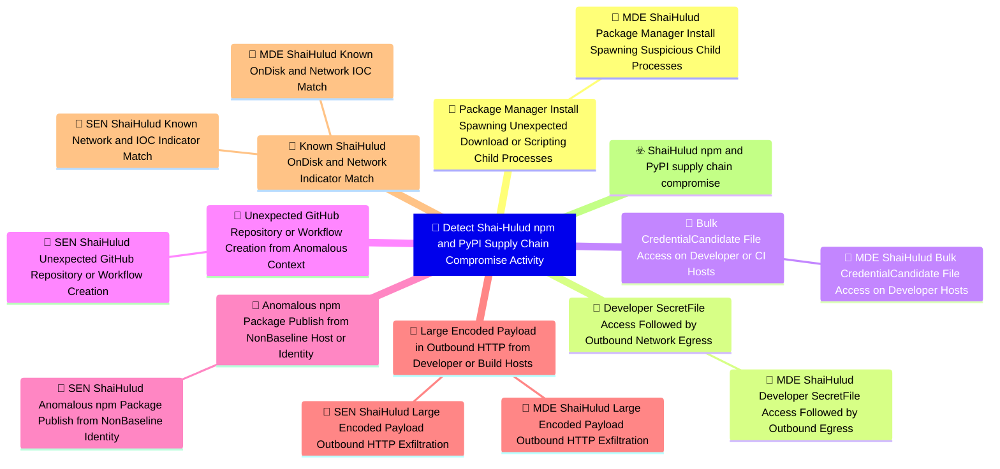

# 🎯 Detect Shai-Hulud npm and PyPI Supply Chain Compromise Activity

**🚩 Priority : `Critical`**

🚦 **TLP:CLEAR** ⚪ : Recipients can spread this to the world, there is no limit on disclosure.

🗡️ **ATT&CK Techniques** :  [T1195.001 : Supply Chain Compromise: Compromise Software Dependencies and Development Tools](https://attack.mitre.org/techniques/T1195/001 'Adversaries may manipulate software dependencies and development tools prior to receipt by a final consumer for the purpose of data or system compromi'), [T1195.002 : Supply Chain Compromise: Compromise Software Supply Chain](https://attack.mitre.org/techniques/T1195/002 'Adversaries may manipulate application software prior to receipt by a final consumer for the purpose of data or system compromise Supply chain comprom'), [T1546.016 : Event Triggered Execution: Installer Packages](https://attack.mitre.org/techniques/T1546/016 'Adversaries may establish persistence and elevate privileges by using an installer to trigger the execution of malicious content Installer packages ar'), [T1059.007 : Command and Scripting Interpreter: JavaScript](https://attack.mitre.org/techniques/T1059/007 'Adversaries may abuse various implementations of JavaScript for execution JavaScript JS is a platform-independent scripting language compiled just-in-'), [T1059.006 : Command and Scripting Interpreter: Python](https://attack.mitre.org/techniques/T1059/006 'Adversaries may abuse Python commands and scripts for execution Python is a very popular scriptingprogramming language, with capabilities to perform m'), [T1552.001 : Unsecured Credentials: Credentials In Files](https://attack.mitre.org/techniques/T1552/001 'Adversaries may search local file systems and remote file shares for files containing insecurely stored credentials These can be files created by user'), [T1550.001 : Use Alternate Authentication Material: Application Access Token](https://attack.mitre.org/techniques/T1550/001 'Adversaries may use stolen application access tokens to bypass the typical authentication process and access restricted accounts, information, or serv'), [T1567.002 : Exfiltration Over Web Service: Exfiltration to Cloud Storage](https://attack.mitre.org/techniques/T1567/002 'Adversaries may exfiltrate data to a cloud storage service rather than over their primary command and control channel Cloud storage services allow for'), [T1071.001 : Application Layer Protocol: Web Protocols](https://attack.mitre.org/techniques/T1071/001 'Adversaries may communicate using application layer protocols associated with web traffic to avoid detectionnetwork filtering by blending in with exis'), [T1078 : Valid Accounts](https://attack.mitre.org/techniques/T1078 'Adversaries may obtain and abuse credentials of existing accounts as a means of gaining Initial Access, Persistence, Privilege Escalation, or Defense '), [T1027 : Obfuscated Files or Information](https://attack.mitre.org/techniques/T1027 'Adversaries may attempt to make an executable or file difficult to discover or analyze by encrypting, encoding, or otherwise obfuscating its contents '), [T1547 : Boot or Logon Autostart Execution](https://attack.mitre.org/techniques/T1547 'Adversaries may configure system settings to automatically execute a program during system boot or logon to maintain persistence or gain higher-level '), [T1485 : Data Destruction](https://attack.mitre.org/techniques/T1485 'Adversaries may destroy data and files on specific systems or in large numbers on a network to interrupt availability to systems, services, and networ')

---

`🔑 UUID : fb62e879-9e91-4c5b-aaa7-999b2b1b3897` **|** `🏷️ Version : 1` **|** `🗓️ Creation Date : 2026-06-16` **|** `🗓️ Last Modification : 2026-06-16` **|** `👩‍💻 Model author : None` **|** `👥 Contributors : None` **|** `Sharing Organisation : {'uuid': '56b0a0f0-b0bc-47d9-bb46-02f80ae2065a', 'name': 'EC DIGIT CSOC'}` **|** `🧱 Schema Identifier : dom::1.0`

## 💡 Objective

**🏷️ Type** : Threat - Alerts meant for detection cybersecurity threats, and which should eventually trigger Incident Response  

> This Detection Objective addresses the May 2026 Shai-Hulud / mini
> Shai-Hulud supply-chain campaign affecting npm and PyPI packages
> including the `@tanstack/*`, `@uipath/*`, and `@mistralai/*`
> namespaces and PyPI packages `guardrails-ai` and `mistralai`.
> 
> Malicious package versions execute during install lifecycle hooks,
> harvest CI/CD, cloud, Vault, Kubernetes, and registry credentials,
> exfiltrate over redundant channels (`git-tanstack[.]com`, Session
> messenger, GitHub dead drops), and self-propagate by republishing
> trojanised versions of other packages the victim maintains.
> 
> Detection coverage spans three time horizons:
> 
> - **Retrospective**: lockfile / SBOM / registry metadata proving an
>   affected version was ever resolved, plus on-disk indicator files.
> - **Live response**: install-time process anomalies, bulk secret-file
>   access, outbound exfiltration, and `gh-token-monitor` persistence on
>   developer endpoints.
> - **Cloud / identity**: anomalous GitHub repository or workflow
>   creation, package publishes outside baseline CI identities, and
>   dead-drop repository markers in audit telemetry.
> 
> Critical priority reflects worm-like propagation, broad ecosystem
> reach (TanStack Router alone ~12M weekly downloads), and destructive
> token-revocation behaviour on compromised developer laptops.
> 

**🎼 Composition** : Combined - All signals triggered for any entity can be grouped in a single signal. This may be extremely useful to identify pan-environment compromises.

> Signals span inventory, endpoint behavioural detection, cloud audit
anomalies, and high-fidelity IOC matching. Combine per host,
repository, or CI runner entity so that multiple signals firing in
the same time window escalate to a single incident.

Operational guidance:

1. **Indicator signal** (Signal 7) and **inventory checks** against
   advisories give the fastest confirmation of exposure.
2. **Install-time child process anomaly** (Signal 1) confirms the
   lifecycle hook actually executed in a given environment.
3. **Secret-file access followed by egress** (Signal 2) and **bulk
   credential scanning** (Signal 3) confirm post-install stealer
   behaviour.
4. **GitHub repo / workflow creation** (Signal 4) and **anomalous
   publish context** (Signal 5) surface worm propagation in cloud
   audit logs even when endpoint telemetry is incomplete.
5. **Large encoded outbound HTTP** (Signal 6) provides network-
   level corroboration for exfiltration channels.

Treat any host that resolved a listed compromised version during
the exposure window as potentially compromised: rotate all
reachable credentials, remove persistence before token revocation,
and regenerate lockfiles from a clean baseline.

### 🌊 Related OpenTide Objects

**Threats**

| ☣️ Threat Vectors                                                                                                                                                                                                                                                                                   |
|:----------------------------------------------------------------------------------------------------------------------------------------------------------------------------------------------------------------------------------------------------------------------------------------------------|
| [Shai-Hulud npm and PyPI supply chain compromise](../Threat%20Vectors/☣️%20Shai-Hulud%20npm%20and%20PyPI%20supply%20chain%20compromise '## Executive SummaryOn 11 May 2026, a coordinated supply-chain campaign publicly trackedas Shai-Hulud  mini Shai-Hulud compromised packages across the...') |

**Rules**

| 📡 Detection Objective Signals (7)                                                                                                                                                                                                                                                                                                   | 🚨 Detection Rules (9)                                                                                                                                                                                                                                                                                                                                                                                                                                                                                                                                                                                                                                                          |
|:------------------------------------------------------------------------------------------------------------------------------------------------------------------------------------------------------------------------------------------------------------------------------------------------------------------------------------|:-------------------------------------------------------------------------------------------------------------------------------------------------------------------------------------------------------------------------------------------------------------------------------------------------------------------------------------------------------------------------------------------------------------------------------------------------------------------------------------------------------------------------------------------------------------------------------------------------------------------------------------------------------------------------------|
| [Anomalous npm Package Publish from Non-Baseline Host or Identity](#anomalous-npm-package-publish-from-non-baseline-host-or-identity 'Anomaly detection surfacing package publishes that deviate fromestablished maintainer workflow, provenance, or source identity including OIDC publishe...')                                   | [SEN Shai-Hulud Anomalous npm Package Publish from Non-Baseline Identity](../Detection%20Rules/🚨%20SEN%20Shai-Hulud%20Anomalous%20npm%20Package%20Publish%20from%20Non-Baseline%20Identity 'SENTINEL   DEVELOPMENT&#013;&#010;&#013;&#010;#### MDR Technical DetailsMicrosoft Sentinel scheduled analytic rule implementing DOM signal9f3abdc4-7c6...')                                                                                                                                                                                                                                                                                                                        |
| [Bulk Credential-Candidate File Access on Developer or CI Hosts](#bulk-credential-candidate-file-access-on-developer-or-ci-hosts 'Statistical  anomaly detection of a single process recursivelyor iteratively accessing many credential-candidate files withina short interval  indicat...')                                       | [MDE Shai-Hulud Bulk Credential-Candidate File Access on Developer Hosts](../Detection%20Rules/🚨%20MDE%20Shai-Hulud%20Bulk%20Credential-Candidate%20File%20Access%20on%20Developer%20Hosts 'DEFENDER_FOR_ENDPOINT   DEVELOPMENT&#013;&#010;&#013;&#010;#### MDR Technical DetailsMicrosoft Defender for Endpoint custom detection implementing DOM...')                                                                                                                                                                                                                                                                                                                        |
| [Developer Secret-File Access Followed by Outbound Network Egress](#developer-secret-file-access-followed-by-outbound-network-egress 'Behavioural correlation detecting a process that reads commondeveloper secret locations and initiates outbound networkconnections within a short windo...')                                   | [MDE Shai-Hulud Developer Secret-File Access Followed by Outbound Egress](../Detection%20Rules/🚨%20MDE%20Shai-Hulud%20Developer%20Secret-File%20Access%20Followed%20by%20Outbound%20Egress 'DEFENDER_FOR_ENDPOINT   DEVELOPMENT&#013;&#010;&#013;&#010;#### MDR Technical DetailsMicrosoft Defender for Endpoint custom detection implementing DOM...')                                                                                                                                                                                                                                                                                                                        |
| [Known Shai-Hulud On-Disk and Network Indicator Match](#known-shai-hulud-on-disk-and-network-indicator-match 'High-specificity artefact and IOC matching for publicly reportedShai-Hulud indicators  suitable for retrospective sweeps andlive IOC gatesDetection cr...')                                                           | [MDE Shai-Hulud Known On-Disk and Network IOC Match](../Detection%20Rules/🚨%20MDE%20Shai-Hulud%20Known%20On-Disk%20and%20Network%20IOC%20Match 'DEFENDER_FOR_ENDPOINT   DEVELOPMENT&#013;&#010;&#013;&#010;#### MDR Technical DetailsMicrosoft Defender for Endpoint custom detection implementing DOM...') [SEN Shai-Hulud Known Network and IOC Indicator Match](../Detection%20Rules/🚨%20SEN%20Shai-Hulud%20Known%20Network%20and%20IOC%20Indicator%20Match 'SENTINEL   DEVELOPMENT&#013;&#010;&#013;&#010;#### MDR Technical DetailsMicrosoft Sentinel scheduled analytic rule implementing DOM signal678d0786-dfd...')                                                 |
| [Large Encoded Payload in Outbound HTTP from Developer or Build Hosts](#large-encoded-payload-in-outbound-http-from-developer-or-build-hosts 'Pattern-matching detection for sizeable Base64 or otherwiseencoded HTTP request bodies leaving developer laptops or CIrunners shortly after package-ma...')                           | [MDE Shai-Hulud Large Encoded Payload Outbound HTTP Exfiltration](../Detection%20Rules/🚨%20MDE%20Shai-Hulud%20Large%20Encoded%20Payload%20Outbound%20HTTP%20Exfiltration 'DEFENDER_FOR_ENDPOINT   DEVELOPMENT&#013;&#010;&#013;&#010;#### MDR Technical DetailsMicrosoft Defender for Endpoint custom detection implementing DOM...') [SEN Shai-Hulud Large Encoded Payload Outbound HTTP Exfiltration](../Detection%20Rules/🚨%20SEN%20Shai-Hulud%20Large%20Encoded%20Payload%20Outbound%20HTTP%20Exfiltration 'SENTINEL   DEVELOPMENT&#013;&#010;&#013;&#010;#### MDR Technical DetailsMicrosoft Sentinel scheduled analytic rule implementing DOM signal21a527de-863...') |
| [Package Manager Install Spawning Unexpected Download or Scripting Child Processes](#package-manager-install-spawning-unexpected-download-or-scripting-child-processes 'Behavioural detection of npm, pnpm, yarn, pip, or Bun installprocesses spawning unexpected child processes consistent withShai-Hulud lifecycle-hook de...') | [MDE Shai-Hulud Package Manager Install Spawning Suspicious Child Processes](../Detection%20Rules/🚨%20MDE%20Shai-Hulud%20Package%20Manager%20Install%20Spawning%20Suspicious%20Child%20Processes 'DEFENDER_FOR_ENDPOINT   DEVELOPMENT&#013;&#010;&#013;&#010;#### MDR Technical DetailsMicrosoft Defender for Endpoint custom detection implementing DOM...')                                                                                                                                                                                                                                                                                                                  |
| [Unexpected GitHub Repository or Workflow Creation from Anomalous Context](#unexpected-github-repository-or-workflow-creation-from-anomalous-context 'Event-search detection in GitHub audit and cloud applicationlogs for worm propagation artefacts dead-drop repositories,workflow injection, and publish...')                   | [SEN Shai-Hulud Unexpected GitHub Repository or Workflow Creation](../Detection%20Rules/🚨%20SEN%20Shai-Hulud%20Unexpected%20GitHub%20Repository%20or%20Workflow%20Creation 'SENTINEL   DEVELOPMENT&#013;&#010;&#013;&#010;#### MDR Technical DetailsMicrosoft Sentinel scheduled analytic rule implementing DOM signal287114bd-7d5...')                                                                                                                                                                                                                                                                                                                                        |

## 📡 Signals

### Package Manager Install Spawning Unexpected Download or Scripting Child Processes

🪪 **UUID** : `a3f7d796-146c-44b0-8d22-7a08daa0d963`

> Behavioural detection of npm, pnpm, yarn, pip, or Bun install
processes spawning unexpected child processes consistent with
Shai-Hulud lifecycle-hook delivery (`preinstall`, `prepare`,
`postinstall`).

Detection criteria:

- Parent process is a package manager or Node runtime (`node`,
  `node.exe`, `npm`, `npm.cmd`, `pnpm`, `pnpm.cmd`, `yarn`,
  `yarn.cmd`, `npx`, `corepack`, `pip`, `pip3`, `python`,
  `python3`) with command line containing `install`, `ci`, `add`,
  or `update`.
- Child process within 120 seconds is one of:
    * `curl`, `wget`, `bash`, `sh`, `zsh` (download / pipe to
      shell patterns)
    * `bun`, `bun.exe` (UiPath wave downloads Bun runtime)
    * `python`, `python3` executing a remote `.pyz` (PyPI wave)
    * `powershell.exe` with hidden-window or bypass flags
- File-write from the install process tree creating
  `router_init.js`, `setup.mjs`, `router_runtime.js`, or
  `tanstack_runner.js` outside a transient cache directory.
- Command lines referencing orphan git dependency
  `github:tanstack/router#79ac49ee` or `git-tanstack`.

False positives: legitimate postinstall scripts (native module
compilation, `husky`, `esbuild` binary fetch). Tune with
allowlists for known-good packages and CI image baselines;
elevate when combined with secret-file access or IOC domains.

**🔎 Data Visibility**

- **Availability** : Partial
- **Requirements** : `- Process execution telemetry with parent-child relationships
  and full command lines
- File-create events attributable to initiating process
- Optional: EDR network module tied to process tree

Preferred log sources:
- Microsoft Defender for Endpoint `DeviceProcessEvents`,
  `DeviceFileEvents`
- Sysmon Event ID 1 and 11 (Windows)
- Linux auditd / macOS Endpoint Security framework
`

_💾 Possible logsources_

_❌ No logsources mentioned_

**🧲 Related Entities**

| Name         | Category                                  | Description                                                                                       |
|:-------------|:------------------------------------------|:--------------------------------------------------------------------------------------------------|
| Process      | **Host Entities** : Host Related Entities | Represents a running process on a host, including its attributes likeprocess ID and command line. |
| Command Line | **Host Entities** : Host Related Entities | Represents the command line arguments used to execute a process.                                  |
| File         | **Host Entities** : Host Related Entities | Represents a file on a system, including its name, path, and attributes.                          |
| Hostname     | **Host Entities** : Host Related Entities | Represents the name of a host or device in the network.                                           |

**⚠️ Detectors**

_❌ No detectors mentioned_

**🌐 Examples**

_❌ No examples mentioned_

### Developer Secret-File Access Followed by Outbound Network Egress

🪪 **UUID** : `365e23e8-0367-4adf-b18a-f1440cc66005`

> Behavioural correlation detecting a process that reads common
developer secret locations and initiates outbound network
connections within a short window — the core stealer pattern
reported across npm and PyPI variants.

Detection criteria:

- File-read or open events on paths matching (case-insensitive):
    * `.npmrc`, `.env`, `.env.local`, `.env.production`
    * `.git-credentials`, `.gitconfig` (credential helpers)
    * `id_rsa`, `id_ed25519`, `*.pem` under `~/.ssh/`
    * `.aws/credentials`, `.azure/`, `.config/gcloud/`
    * Kubernetes `serviceaccount` token paths
    * Vault token files / `~/.vault-token`
    * `~/.docker/config.json`
- Followed within 5 minutes by outbound TCP/HTTP from the same
  process or its descendants to:
    * `git-tanstack[.]com` or `83.142.209[.]194`
    * `*.getsession.org` (Session exfiltration channel)
    * `api.github.com` creating repositories (dead-drop path)
- Initiating process tree rooted in `node`, `npm`, `pnpm`,
  `python`, or `bun` during or shortly after package install.

False positives: legitimate CI secret injection, cloud SDK
tooling, and developer utilities (e.g. `gh auth login`). Scope to
developer laptops and build agents; require multiple secret paths
or IOC destination for higher fidelity.

**🔎 Data Visibility**

- **Availability** : Partial
- **Requirements** : `- File-access telemetry with process attribution
- Outbound network connections with initiating process context
- Time-synchronised correlation capability (SIEM or Advanced
  Hunting joins)

Preferred log sources:
- Defender `DeviceFileEvents` + `DeviceNetworkEvents`
- Sysmon Event ID 11 / 23 and Event ID 3
- EDR combined process-network correlation
`

_💾 Possible logsources_

_❌ No logsources mentioned_

**🧲 Related Entities**

| Name               | Category                                        | Description                                                                                                                                                                                  |
|:-------------------|:------------------------------------------------|:---------------------------------------------------------------------------------------------------------------------------------------------------------------------------------------------|
| Process            | **Host Entities** : Host Related Entities       | Represents a running process on a host, including its attributes likeprocess ID and command line.                                                                                            |
| File               | **Host Entities** : Host Related Entities       | Represents a file on a system, including its name, path, and attributes.                                                                                                                     |
| IP Address         | **Network Entities** : Network Related Entities | Represents an IPv4 or IPv6 address associated with a host or networkconnection.                                                                                                              |
| URL                | **Network Entities** : Network Related Entities | Represents a Uniform Resource Locator (URL), often used in web-basedattacks or phishing campaigns.                                                                                           |
| Network Connection | **Network Entities** : Network Related Entities | Represents a network connection, including source and destination IPs, ports, and protocols. This entity is critical for detecting suspicious or unauthorized communication between systems. |
| Hostname           | **Host Entities** : Host Related Entities       | Represents the name of a host or device in the network.                                                                                                                                      |

**⚠️ Detectors**

_❌ No detectors mentioned_

**🌐 Examples**

_❌ No examples mentioned_

### Bulk Credential-Candidate File Access on Developer or CI Hosts

🪪 **UUID** : `b49d0a94-ae13-49b3-8ad8-6c035fa3d681`

> Statistical / anomaly detection of a single process recursively
or iteratively accessing many credential-candidate files within
a short interval — indicative of automated secret harvesting
rather than normal development activity.

Detection criteria:

- One process (or tight process tree) touches ≥ 15 distinct
  file paths matching secret patterns within 10 minutes:
    * filenames `.npmrc`, `.env*`, `credentials`, `token`,
      `secrets`, `id_rsa`, `id_ed25519`, `config.json`
    * directories `.ssh`, `.aws`, `.azure`, `.kube`, `.vault`,
      `serviceaccount`
- Process ancestry includes package-manager or scripting runtime
  (`node`, `python`, `bun`) without an interactive user shell
  parent (TTY / explorer / Terminal).
- Optional enrichment: same host later exhibits outbound
  connections to Shai-Hulud IOC domains.

False positives: backup tools, DLP agents, secret scanners run
deliberately by security teams, and some IDE indexing. Exclude
known inventory / backup service accounts; lower threshold on
CI runners where breadth may be lower but paths more sensitive.

**🔎 Data Visibility**

- **Availability** : Partial
- **Requirements** : `- High-volume file-access telemetry with paths and hashes
- Process attribution and parent-chain context
- Aggregation / thresholding in SIEM or scheduled hunting

Preferred log sources:
- Defender `DeviceFileEvents`
- Sysmon Event ID 11 with path filters
- OSQuery file_events snapshots
`

_💾 Possible logsources_

_❌ No logsources mentioned_

**🧲 Related Entities**

| Name     | Category                                  | Description                                                                                       |
|:---------|:------------------------------------------|:--------------------------------------------------------------------------------------------------|
| Process  | **Host Entities** : Host Related Entities | Represents a running process on a host, including its attributes likeprocess ID and command line. |
| File     | **Host Entities** : Host Related Entities | Represents a file on a system, including its name, path, and attributes.                          |
| Hostname | **Host Entities** : Host Related Entities | Represents the name of a host or device in the network.                                           |

**⚠️ Detectors**

_❌ No detectors mentioned_

**🌐 Examples**

_❌ No examples mentioned_

### Unexpected GitHub Repository or Workflow Creation from Anomalous Context

🪪 **UUID** : `287114bd-7d58-422d-9711-f5516900b9ce`

> Event-search detection in GitHub audit and cloud application
logs for worm propagation artefacts: dead-drop repositories,
workflow injection, and publish activity inconsistent with
baseline maintainer behaviour.

Detection criteria:

- `repo.create` or equivalent where repository description
  contains `Shai-Hulud: Here We Go Again` or `PUSH UR T3MPRR`.
- New workflow files (`.github/workflows/*.yml`) committed or
  created by a service account / token not historically used for
  CI on that repository.
- npm package publish events (`package.publish`) from GitHub
  Actions OIDC identities outside the organisation's approved
  release workflows (compare `workflow` / `job` claims if
  present in audit metadata).
- Commit messages containing
  `IfYouRevokeThisTokenItWillWipeTheComputerOfTheOwner`.
- Burst of new repositories with Dune-themed names from a single
  actor shortly after CI compromise (dead-drop pattern).

False positives: legitimate open-source contributors creating
forks and workflows; hobby repositories with unusual names.
Correlate with endpoint install anomalies or IOC network traffic
on linked CI runners.

**🔎 Data Visibility**

- **Availability** : Partial
- **Requirements** : `- GitHub Enterprise audit log ingestion (GitHubAuditLog or
  equivalent connector table)
- Microsoft Sentinel `CloudAppEvents` / `OfficeActivity` for
  GitHub application activity
- Baseline of normal publish identities per critical repo

Preferred log sources:
- GitHub audit streaming to Sentinel
- `CloudAppEvents` where `Application == "GitHub"`
- npm registry audit / publish webhooks (if forwarded to SIEM)
`

_💾 Possible logsources_

_❌ No logsources mentioned_

**🧲 Related Entities**

| Name     | Category                                    | Description                                                                                                                                                              |
|:---------|:--------------------------------------------|:-------------------------------------------------------------------------------------------------------------------------------------------------------------------------|
| Account  | **Host Entities** : Host Related Entities   | Represents a user account entity, including local, domain, or cloud-basedaccounts.                                                                                       |
| User     | **Host Entities** : Host Related Entities   | Represents an individual user, including their identity and associatedattributes.                                                                                        |
| API Call | **Cloud Entities** : Cloud Related Entities | Represents an API call, including its endpoint, parameters, and response. API calls are often analyzed to detect unauthorized access or data exfiltration.               |
| Software | **Host Entities** : Host Related Entities   | Represents a software package, including its name, version, and installation source. Software packages are often analyzed to detect unauthorized or vulnerable software. |

**⚠️ Detectors**

_❌ No detectors mentioned_

**🌐 Examples**

_❌ No examples mentioned_

### Anomalous npm Package Publish from Non-Baseline Host or Identity

🪪 **UUID** : `9f3abdc4-7c6e-480e-b722-6d31ddd9b2d2`

> Anomaly detection surfacing package publishes that deviate from
established maintainer workflow, provenance, or source identity
— including OIDC publishes minted outside the expected GitHub
Actions job (TanStack pattern) and republication of packages the
victim maintains (worm propagation).

Detection criteria:

- New npm version published for a package on the organisation's
  critical list where:
    * publish authentication source differs from the prior N
      versions (CLI vs OIDC, different `workflow` claim)
    * version appears without a corresponding signed git tag /
      release asset in the linked repository
    * publish timestamp clusters with other unrelated packages
      sharing the same `_npmUser` or OIDC subject
    * manifest adds `optionalDependencies` git pointer to orphan
      commit or `preinstall` invoking `setup.mjs`
- Registry metadata diff alerts from OpenSSF Malicious Packages,
  Socket, StepSecurity, or Aikido feeds for known campaign
  versions.
- Sudden maintainer-scoped search activity on
  `registry.npmjs.org/-/v1/search?text=maintainer:` from CI
  egress IPs (precursor to worm spread).

False positives: emergency hotfix publishes, migration between
publish mechanisms, and monorepo bulk releases. Require manifest
fingerprint or feed enrichment for auto-escalation.

**🔎 Data Visibility**

- **Availability** : Partial
- **Requirements** : `- Continuous npm registry metadata monitoring for critical
  packages
- GitHub Actions / OIDC claim logging where available
- Integration with malicious-package intelligence feeds
- Historical publish provenance per package version

Preferred log sources:
- Custom registry-watcher pipelines
- GitHub Actions deployment logs
- Third-party supply-chain monitoring SaaS APIs
`

_💾 Possible logsources_

_❌ No logsources mentioned_

**🧲 Related Entities**

| Name     | Category                                    | Description                                                                                                                                                              |
|:---------|:--------------------------------------------|:-------------------------------------------------------------------------------------------------------------------------------------------------------------------------|
| Software | **Host Entities** : Host Related Entities   | Represents a software package, including its name, version, and installation source. Software packages are often analyzed to detect unauthorized or vulnerable software. |
| User     | **Host Entities** : Host Related Entities   | Represents an individual user, including their identity and associatedattributes.                                                                                        |
| Token    | **Host Entities** : Host Related Entities   | Represents an authentication or access token, such as OAuth tokens or API keys. Tokens are often analyzed to detect unauthorized access or misuse.                       |
| API Call | **Cloud Entities** : Cloud Related Entities | Represents an API call, including its endpoint, parameters, and response. API calls are often analyzed to detect unauthorized access or data exfiltration.               |

**⚠️ Detectors**

_❌ No detectors mentioned_

**🌐 Examples**

_❌ No examples mentioned_

### Large Encoded Payload in Outbound HTTP from Developer or Build Hosts

🪪 **UUID** : `21a527de-8635-4187-87d4-c9e5f5c1badc`

> Pattern-matching detection for sizeable Base64 or otherwise
encoded HTTP request bodies leaving developer laptops or CI
runners shortly after package-manager activity — consistent with
credential-blob exfiltration to `git-tanstack[.]com`, Session
file servers, or GitHub API dead drops.

Detection criteria:

- HTTP POST or PUT from processes in `node`, `python`, `bun`,
  or `curl` child trees where:
    * request body length exceeds 50 KB AND matches Base64 alphabet
      density (≥ 85% `[A-Za-z0-9+/=]`)
    * OR `Content-Type` is `application/json` with large opaque
      string fields
- Destination host in (`git-tanstack.com`, `filev2.getsession.org`,
  `api.github.com`) or IP `83.142.209.194`.
- Temporal proximity (≤ 30 min) to `npm install` / `pip install`
  on the same host.

False positives: legitimate telemetry uploads, crash dumps,
artefact uploads to internal registries. Tune minimum body size
and require IOC destination or co-occurring secret-file reads.

**🔎 Data Visibility**

- **Availability** : Partial
- **Requirements** : `- HTTP proxy or TLS-inspection logs with request body sampling
- EDR HTTP inspection (`DeviceNetworkEvents` with
  `HttpConnectionInspected`)
- NetFlow with byte counts for coarse pre-filtering

Preferred log sources:
- Corporate web proxy (Zscaler, Bluecoat) with body logging
- Defender `DeviceNetworkEvents` AdditionalFields user_agent /
  request metadata
- Zeek HTTP logs on build-network egress
`

_💾 Possible logsources_

_❌ No logsources mentioned_

**🧲 Related Entities**

| Name               | Category                                        | Description                                                                                                                                                                                  |
|:-------------------|:------------------------------------------------|:---------------------------------------------------------------------------------------------------------------------------------------------------------------------------------------------|
| URL                | **Network Entities** : Network Related Entities | Represents a Uniform Resource Locator (URL), often used in web-basedattacks or phishing campaigns.                                                                                           |
| IP Address         | **Network Entities** : Network Related Entities | Represents an IPv4 or IPv6 address associated with a host or networkconnection.                                                                                                              |
| Network Connection | **Network Entities** : Network Related Entities | Represents a network connection, including source and destination IPs, ports, and protocols. This entity is critical for detecting suspicious or unauthorized communication between systems. |
| Process            | **Host Entities** : Host Related Entities       | Represents a running process on a host, including its attributes likeprocess ID and command line.                                                                                            |
| Hostname           | **Host Entities** : Host Related Entities       | Represents the name of a host or device in the network.                                                                                                                                      |

**⚠️ Detectors**

_❌ No detectors mentioned_

**🌐 Examples**

_❌ No examples mentioned_

### Known Shai-Hulud On-Disk and Network Indicator Match

🪪 **UUID** : `678d0786-dfd7-40fb-ba90-3c368ed00342`

> High-specificity artefact and IOC matching for publicly reported
Shai-Hulud indicators — suitable for retrospective sweeps and
live IOC gates.

Detection criteria:

### File / hash indicators
- Presence of `router_init.js`, `setup.mjs`, `router_runtime.js`,
  `tanstack_runner.js` under `node_modules/`, package roots,
  `.claude/`, or `.vscode/` (persists after uninstall).
- SHA-256 matches for published samples (e.g. `router_init.js`
  `ab4fcadaec49c03278063dd269ea5eef82d24f2124a8e15d7b90f2fa8601266c`,
  `setup.mjs`
  `2ec78d556d696e208927cc503d48e4b5eb56b31abc2870c2ed2e98d6be27fc96`).
- Persistence files: `com.user.gh-token-monitor.plist`,
  `gh-token-monitor.service`, process name `gh-token-monitor`.

### Manifest / lockfile indicators
- Lockfiles resolving known-bad versions (e.g.
  `@tanstack/react-router@1.169.5`, `guardrails-ai@0.10.1`,
  `mistralai@2.4.6`) — consult Wiz advisory tables for full list.
- `optionalDependencies` entry
  `github:tanstack/router#79ac49eedf774dd4b0cfa308722bc463cfe5885c`.

### Network indicators
- DNS or HTTP to `git-tanstack[.]com`, `83.142.209[.]194`,
  `*.getsession.org`.
- Download of `git-tanstack[.]com/tmp/transformers.pyz`.

Treat any match on a build or developer host as strong evidence
of execution, not merely dependency declaration.

**🔎 Data Visibility**

- **Availability** : Partial
- **Requirements** : `- File inventory / hash telemetry on endpoints and CI runners
- Lockfile and SBOM scanning in source control and CI
- DNS and proxy logs for IOC domains
- Malicious-package feed integration for version-level matches

Preferred log sources:
- EDR file inventory and `DeviceFileEvents`
- Repository content scanning at PR time
- DNS server logs and web proxy URL filtering
- OpenSSF / vendor supply-chain feeds
`

_💾 Possible logsources_

_❌ No logsources mentioned_

**🧲 Related Entities**

| Name      | Category                                        | Description                                                                                                                                                              |
|:----------|:------------------------------------------------|:-------------------------------------------------------------------------------------------------------------------------------------------------------------------------|
| File      | **Host Entities** : Host Related Entities       | Represents a file on a system, including its name, path, and attributes.                                                                                                 |
| File Hash | **Host Entities** : Host Related Entities       | Represents the hash of a file, used to uniquely identify its contents.                                                                                                   |
| Software  | **Host Entities** : Host Related Entities       | Represents a software package, including its name, version, and installation source. Software packages are often analyzed to detect unauthorized or vulnerable software. |
| DNS Query | **Network Entities** : Network Related Entities | Represents a DNS query, including the requested domain and response. DNS queries are often analyzed to detect malicious domains or command-and-control (C2) activity.    |
| URL       | **Network Entities** : Network Related Entities | Represents a Uniform Resource Locator (URL), often used in web-basedattacks or phishing campaigns.                                                                       |
| Hostname  | **Host Entities** : Host Related Entities       | Represents the name of a host or device in the network.                                                                                                                  |

**⚠️ Detectors**

_❌ No detectors mentioned_

**🌐 Examples**

_❌ No examples mentioned_

## References

**🕊️ Publicly available resources**

- [_1_] https://www.wiz.io/blog/mini-shai-hulud-strikes-again-tanstack-more-npm-packages-compromised
- [_2_] https://www.aikido.dev/blog/mini-shai-hulud-is-back-tanstack-compromised
- [_3_] https://tanstack.com/blog/npm-supply-chain-compromise-postmortem
- [_4_] https://www.stepsecurity.io/blog/mini-shai-hulud-is-back-a-self-spreading-supply-chain-attack-hits-the-npm-ecosystem

[1]: https://www.wiz.io/blog/mini-shai-hulud-strikes-again-tanstack-more-npm-packages-compromised
[2]: https://www.aikido.dev/blog/mini-shai-hulud-is-back-tanstack-compromised
[3]: https://tanstack.com/blog/npm-supply-chain-compromise-postmortem
[4]: https://www.stepsecurity.io/blog/mini-shai-hulud-is-back-a-self-spreading-supply-chain-attack-hits-the-npm-ecosystem

