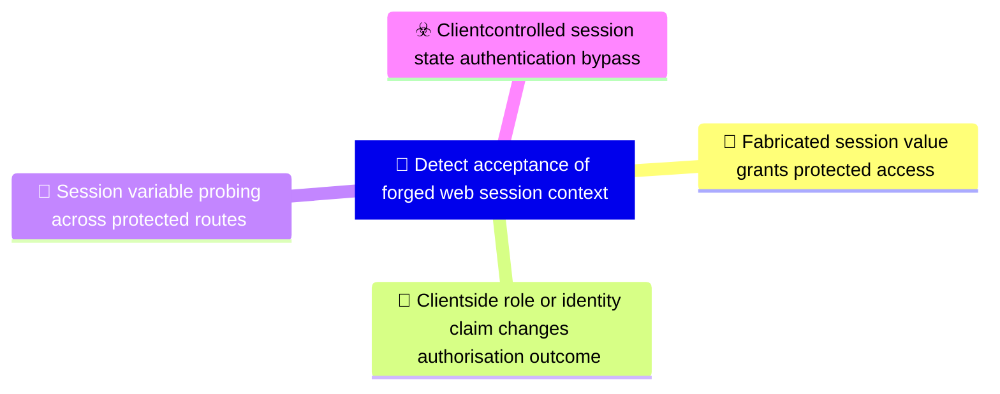

# 🎯 Detect acceptance of forged web session context

**🚩 Priority : `High`**

🚦 **TLP:CLEAR** ⚪ : Recipients can spread this to the world, there is no limit on disclosure.

🗡️ **ATT&CK Techniques** :  [T1190 : Exploit Public-Facing Application](https://attack.mitre.org/techniques/T1190 'Adversaries may attempt to exploit a weakness in an Internet-facing host or system to initially access a network The weakness in the system can be a s')

---

`🔑 UUID : d4c509d7-f9ab-452a-a91d-4da040095414` **|** `🏷️ Version : 3` **|** `🗓️ Creation Date : 2026-05-04` **|** `🗓️ Last Modification : 2026-05-04` **|** `👩‍💻 Model author : None` **|** `👥 Contributors : Hold Security Threat Research` **|** `Sharing Organisation : {'uuid': '56b0a0f0-b0bc-47d9-bb46-02f80ae2065a', 'name': 'EC DIGIT CSOC'}` **|** `🧱 Schema Identifier : dom::1.0`

## 💡 Objective

**🏷️ Type** : Threat - Alerts meant for detection cybersecurity threats, and which should eventually trigger Incident Response  

> Detect cases where an application accepts caller-supplied state as an authentication or privilege
> context. The detection capability focuses on evidence that fabricated cookies, headers, or request
> variables change the server-side decision from unauthenticated to authenticated or from lower to
> higher privilege. It intentionally abstracts away from the exact TVM wording and frames what SOC,
> application security, and continuous assurance controls need to observe.
> 

**🎼 Composition** : Combined - All signals triggered for any entity can be grouped in a single signal. This may be extremely useful to identify pan-environment compromises.

> Combine controlled validation findings with production telemetry. A single crafted-value success
can confirm exposure during testing, while production monitoring should focus on suspicious state
names, repeated state probing, and mismatches between claimed client attributes and server-side
principal resolution. Correlate by source IP, route, cookie/header name, session, claimed identity,
and resolved server-side account.

### 🌊 Related OpenTide Objects

**Threats**

| ☣️ Threat Vectors                                                                                                                                                                                                                                                                                           |
|:------------------------------------------------------------------------------------------------------------------------------------------------------------------------------------------------------------------------------------------------------------------------------------------------------------|
| [Client-controlled session state authentication bypass](../Threat%20Vectors/☣️%20Client-controlled%20session%20state%20authentication%20bypass 'An adversary bypasses authentication or authorisation by injecting or modifying client-controlledsession state in HTTP requests The application treats...') |

**Rules**

| 📡 Detection Objective Signals (3)                                                                                                                                                                                                                                                                 | 🚨 Detection Rules    |
|:--------------------------------------------------------------------------------------------------------------------------------------------------------------------------------------------------------------------------------------------------------------------------------------------------|:---------------------|
| [Session variable probing across protected routes](#session-variable-probing-across-protected-routes 'Alert on repeated attempts to discover accepted session variables by trying many cookie orheader names and simple values across protected routes Usefu...')                                 | ❌ No Detection Rules |
| [Fabricated session value grants protected access](#fabricated-session-value-grants-protected-access 'Alert when controlled validation shows a protected endpoint returning successful access after afabricated cookie, Authorization header, or request var...')                                 | ❌ No Detection Rules |
| [Client-side role or identity claim changes authorisation outcome](#client-side-role-or-identity-claim-changes-authorisation-outcome 'Alert when modifying a client-controlled identity, username, role, or feature flag changes theauthorisation decision for the same route and source con...') | ❌ No Detection Rules |

## 📡 Signals

### Fabricated session value grants protected access

🪪 **UUID** : `9ba566b6-bfed-4059-bdb1-50bb3cac3c29`

> Alert when controlled validation shows a protected endpoint returning successful access after a
fabricated cookie, Authorization header, or request variable is supplied. Required comparison
fields include request path, method, injected state name, response status, response size or body
fingerprint, and authentication outcome for both baseline and injected-state requests. Store
state values only as masked labels or approved test artefacts.
Triage by confirming there is no corresponding server-issued session, signed token, or login
event that legitimately explains the successful response.

**🔎 Data Visibility**

- **Availability** : Partial
- **Requirements** : `Requires an approved DAST, synthetic validation, or application security test harness capable
of replaying requests with and without selected cookies or headers. Production logs should
provide request path, response status, authentication outcome, and cookie/header names; raw
values should be masked or omitted unless explicitly approved.
`

_💾 Possible logsources_

_❌ No logsources mentioned_

**🧲 Related Entities**

| Name       | Category                                        | Description                                                                                                                                                          |
|:-----------|:------------------------------------------------|:---------------------------------------------------------------------------------------------------------------------------------------------------------------------|
| IP Address | **Network Entities** : Network Related Entities | Represents an IPv4 or IPv6 address associated with a host or networkconnection.                                                                                      |
| URL        | **Network Entities** : Network Related Entities | Represents a Uniform Resource Locator (URL), often used in web-basedattacks or phishing campaigns.                                                                   |
| Session    | **Network Entities** : Network Related Entities | Represents a user or system session, including session IDs and associated activities. Sessions are often analyzed to detect unauthorized access or unusual behavior. |
| API Call   | **Network Entities** : Network Related Entities | Represents an API call, including its endpoint, parameters, and response. API calls are often analyzed to detect unauthorized access or data exfiltration.           |

**⚠️ Detectors**

_❌ No detectors mentioned_

**🌐 Examples**

_❌ No examples mentioned_

### Client-side role or identity claim changes authorisation outcome

🪪 **UUID** : `9bfe87d7-c197-4893-b7e1-829ab6d1fcf5`

> Alert when modifying a client-controlled identity, username, role, or feature flag changes the
authorisation decision for the same route and source context. Required fields include claimed
client attribute name, resolved server-side principal, route, response status, access decision,
and timestamp. Tune by allow-listing expected signed token claims and focusing on unsigned
cookies, plain-text headers, or application variables that should never control privilege.
Triage by comparing the claimed client-side identity or role against the server-side resolved
principal and expected authorisation policy for the route.

**🔎 Data Visibility**

- **Availability** : Partial
- **Requirements** : `Requires application logs that expose both claimed client-side attributes and resolved
server-side identity/role, or controlled validation records that capture the same comparison.
Cookie and header values should be redacted; retain field names, decision changes, and
non-sensitive fingerprints.
`

_💾 Possible logsources_

_❌ No logsources mentioned_

**🧲 Related Entities**

| Name           | Category                                        | Description                                                                                                                                                                                      |
|:---------------|:------------------------------------------------|:-------------------------------------------------------------------------------------------------------------------------------------------------------------------------------------------------|
| Session        | **Network Entities** : Network Related Entities | Represents a user or system session, including session IDs and associated activities. Sessions are often analyzed to detect unauthorized access or unusual behavior.                             |
| Authentication | **Cloud Entities** : Cloud Related Entities     | Represents an authentication attempt, including the user, source IP, and success or failure status. Authentication events are critical for detecting brute force attacks or unauthorized access. |
| Account        | **Host Entities** : Host Related Entities       | Represents a user account entity, including local, domain, or cloud-basedaccounts.                                                                                                               |
| URL            | **Network Entities** : Network Related Entities | Represents a Uniform Resource Locator (URL), often used in web-basedattacks or phishing campaigns.                                                                                               |

**⚠️ Detectors**

_❌ No detectors mentioned_

**🌐 Examples**

_❌ No examples mentioned_

### Session variable probing across protected routes

🪪 **UUID** : `7ff9ea94-7bf4-4df5-83f1-7d3dc0174653`

> Alert on repeated attempts to discover accepted session variables by trying many cookie or
header names and simple values across protected routes. Useful fields include source IP, URL,
cookie/header names, response status, user-agent, and time window. Tune out legitimate browsers
by focusing on high counts of distinct state names, tooling user-agents, and repeated 401/403 to
200 response transitions without a corresponding login event.
As a starting point, investigate sources that try multiple authentication-like cookie or header
names across protected routes in a short window, especially when followed by successful access.

**🔎 Data Visibility**

- **Availability** : Partial
- **Requirements** : `Requires request header and cookie names, source IP, URL path, response status, user-agent,
and timestamps from WAF, proxy, API gateway, or application logs. Header values can be masked;
field names and response outcomes are sufficient for this signal.
`

_💾 Possible logsources_

_❌ No logsources mentioned_

**🧲 Related Entities**

| Name       | Category                                        | Description                                                                                                                                                          |
|:-----------|:------------------------------------------------|:---------------------------------------------------------------------------------------------------------------------------------------------------------------------|
| IP Address | **Network Entities** : Network Related Entities | Represents an IPv4 or IPv6 address associated with a host or networkconnection.                                                                                      |
| URL        | **Network Entities** : Network Related Entities | Represents a Uniform Resource Locator (URL), often used in web-basedattacks or phishing campaigns.                                                                   |
| Session    | **Network Entities** : Network Related Entities | Represents a user or system session, including session IDs and associated activities. Sessions are often analyzed to detect unauthorized access or unusual behavior. |
| API Call   | **Network Entities** : Network Related Entities | Represents an API call, including its endpoint, parameters, and response. API calls are often analyzed to detect unauthorized access or data exfiltration.           |

**⚠️ Detectors**

_❌ No detectors mentioned_

**🌐 Examples**

_❌ No examples mentioned_

## References

**🕊️ Publicly available resources**

- [_1_] https://owasp.org/Top10/A01_2021-Broken_Access_Control/
- [_2_] https://owasp.org/Top10/A07_2021-Identification_and_Authentication_Failures/
- [_3_] https://cwe.mitre.org/data/definitions/565.html

[1]: https://owasp.org/Top10/A01_2021-Broken_Access_Control/
[2]: https://owasp.org/Top10/A07_2021-Identification_and_Authentication_Failures/
[3]: https://cwe.mitre.org/data/definitions/565.html

