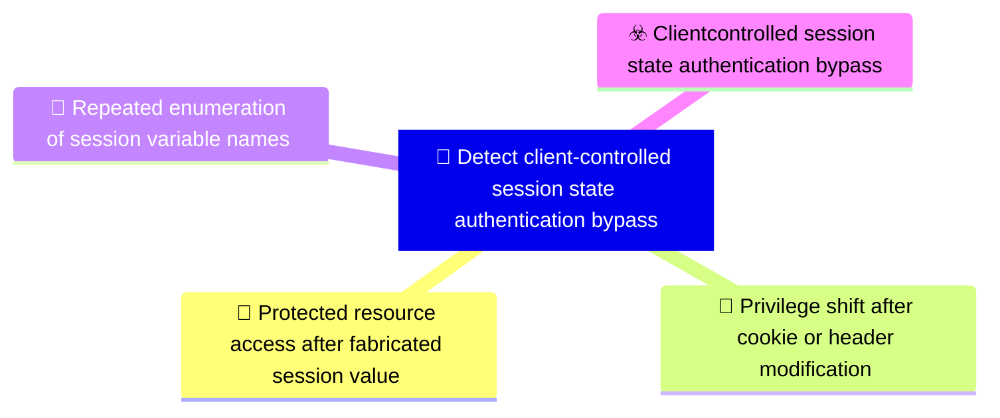

# 🎯 Detect client-controlled session state authentication bypass

**🚩 Priority : `High`**

🚦 **TLP:CLEAR** ⚪ : Recipients can spread this to the world, there is no limit on disclosure.

🗡️ **ATT&CK Techniques** :  [T1190 : Exploit Public-Facing Application](https://attack.mitre.org/techniques/T1190 'Adversaries may attempt to exploit a weakness in an Internet-facing host or system to initially access a network The weakness in the system can be a s')

---

`🔑 UUID : d4c509d7-f9ab-452a-a91d-4da040095414` **|** `🏷️ Version : 1` **|** `🗓️ Creation Date : 2026-05-04` **|** `🗓️ Last Modification : 2026-05-04` **|** `👩‍💻 Model author : None` **|** `👥 Contributors : None` **|** `Sharing Organisation : {'uuid': '56b0a0f0-b0bc-47d9-bb46-02f80ae2065a', 'name': 'EC DIGIT CSOC'}` **|** `🧱 Schema Identifier : dom::1.0`

## 💡 Objective

**🏷️ Type** : Threat - Alerts meant for detection cybersecurity threats, and which should eventually trigger Incident Response  

> Detect or continuously validate web applications that grant authentication or authorisation based on client-supplied
> cookies, Authorization headers, or request variables without verifying server-issued session state
> or token integrity. The objective focuses on differential request behaviour, privilege changes
> caused by modified values, and anomalous acceptance of fabricated session indicators.
> 

**🎼 Composition** : Combined - All signals triggered for any entity can be grouped in a single signal. This may be extremely useful to identify pan-environment compromises.

> Use a combined strategy. A single differential response may indicate exposure, but confidence is
highest when arbitrary state injection is correlated with access to protected content, privilege
changes, or repeated attempts across related endpoints. Entity grouping should use source IP,
session identifiers, request path, supplied cookie/header names, and claimed user or role values.

### 🌊 Related OpenTide Objects

**Threats**

| ☣️ Threat Vectors                                                                                                                                                                                                                                                                                           |
|:------------------------------------------------------------------------------------------------------------------------------------------------------------------------------------------------------------------------------------------------------------------------------------------------------------|
| [Client-controlled session state authentication bypass](../Threat%20Vectors/☣️%20Client-controlled%20session%20state%20authentication%20bypass 'An adversary bypasses authentication or authorisation by injecting or modifying client-controlledsession state in HTTP requests The application treats...') |

**Rules**

| 📡 Detection Objective Signals (3)                                                                                                                                                                                                                                                 | 🚨 Detection Rules    |
|:----------------------------------------------------------------------------------------------------------------------------------------------------------------------------------------------------------------------------------------------------------------------------------|:---------------------|
| [Repeated enumeration of session variable names](#repeated-enumeration-of-session-variable-names 'Detect repeated attempts from the same source to discover accepted session variables by tryingmany cookie or header names and simple values This inclu...')                     | ❌ No Detection Rules |
| [Protected resource access after fabricated session value](#protected-resource-access-after-fabricated-session-value 'Detect HTTP requests to protected endpoints where access is denied with no session state butsucceeds when the client supplies fabricated or generic st...') | ❌ No Detection Rules |
| [Privilege shift after cookie or header modification](#privilege-shift-after-cookie-or-header-modification 'Detect cases where changing a client-controlled identity, username, role, or feature flag valueresults in a higher-privilege response Examples include...')           | ❌ No Detection Rules |

## 📡 Signals

### Protected resource access after fabricated session value

🪪 **UUID** : `9ba566b6-bfed-4059-bdb1-50bb3cac3c29`

> Detect HTTP requests to protected endpoints where access is denied with no session state but
succeeds when the client supplies fabricated or generic state values such as Login=true,
AppUsername=Admin, role=admin, or Authorization: Bearer test. This signal requires comparing
response status, response body class, and returned content between baseline unauthenticated
requests and injected-state requests.

**🔎 Data Visibility**

- **Availability** : Partial
- **Requirements** : `Requires web, reverse proxy, WAF, API gateway, or application logs containing request path,
response status, response size or body category, source IP, cookies or header names, and
authentication outcome. Full header values may need controlled test capture rather than
production logging to avoid storing sensitive data. Cookie and header values should be
masked, redacted, or collected only during controlled validation unless explicitly approved
for sensitive telemetry handling.
`

_💾 Possible logsources_

_❌ No logsources mentioned_

**🧲 Related Entities**

| Name       | Category                                        | Description                                                                                                                                                          |
|:-----------|:------------------------------------------------|:---------------------------------------------------------------------------------------------------------------------------------------------------------------------|
| IP Address | **Network Entities** : Network Related Entities | Represents an IPv4 or IPv6 address associated with a host or networkconnection.                                                                                      |
| URL        | **Network Entities** : Network Related Entities | Represents a Uniform Resource Locator (URL), often used in web-basedattacks or phishing campaigns.                                                                   |
| Session    | **Network Entities** : Network Related Entities | Represents a user or system session, including session IDs and associated activities. Sessions are often analyzed to detect unauthorized access or unusual behavior. |
| API Call   | **Network Entities** : Network Related Entities | Represents an API call, including its endpoint, parameters, and response. API calls are often analyzed to detect unauthorized access or data exfiltration.           |

**⚠️ Detectors**

_❌ No detectors mentioned_

**🌐 Examples**

_❌ No examples mentioned_

### Privilege shift after cookie or header modification

🪪 **UUID** : `9bfe87d7-c197-4893-b7e1-829ab6d1fcf5`

> Detect cases where changing a client-controlled identity, username, role, or feature flag value
results in a higher-privilege response. Examples include AppUsername=UNKNOWN changing to
AppUsername=Admin, role=user changing to role=admin, or arbitrary bearer values receiving access
beyond the baseline. Compare authorisation decisions and response content for the same source,
endpoint, and request method across modified state values.

**🔎 Data Visibility**

- **Availability** : Partial
- **Requirements** : `Requires request metadata, response decisions, user or role context observed by the
application, and controlled testing evidence for modified cookies or headers. Application logs
should capture both the claimed client-side attribute and the resolved server-side principal
where feasible. Cookie and header values should be masked, redacted, or collected only during
controlled validation unless explicitly approved for sensitive telemetry handling.
`

_💾 Possible logsources_

_❌ No logsources mentioned_

**🧲 Related Entities**

| Name           | Category                                        | Description                                                                                                                                                                                      |
|:---------------|:------------------------------------------------|:-------------------------------------------------------------------------------------------------------------------------------------------------------------------------------------------------|
| Session        | **Network Entities** : Network Related Entities | Represents a user or system session, including session IDs and associated activities. Sessions are often analyzed to detect unauthorized access or unusual behavior.                             |
| Authentication | **Host Entities** : Host Related Entities       | Represents an authentication attempt, including the user, source IP, and success or failure status. Authentication events are critical for detecting brute force attacks or unauthorized access. |
| Account        | **Host Entities** : Host Related Entities       | Represents a user account entity, including local, domain, or cloud-basedaccounts.                                                                                                               |
| URL            | **Network Entities** : Network Related Entities | Represents a Uniform Resource Locator (URL), often used in web-basedattacks or phishing campaigns.                                                                                               |

**⚠️ Detectors**

_❌ No detectors mentioned_

**🌐 Examples**

_❌ No examples mentioned_

### Repeated enumeration of session variable names

🪪 **UUID** : `7ff9ea94-7bf4-4df5-83f1-7d3dc0174653`

> Detect repeated attempts from the same source to discover accepted session variables by trying
many cookie or header names and simple values. This includes logout-flow enumeration followed by
replay attempts using discovered variable names, repeated 401-to-200 transitions, or clusters of
requests using likely authentication words such as login, user, username, role, admin, token, or
bearer in cookie/header names.

**🔎 Data Visibility**

- **Availability** : Partial
- **Requirements** : `Requires request header and cookie names, source IP, request path, response status, and time
windows suitable for counting distinct attempted variable names. Header values can be masked;
names and response outcomes are the core detection fields.
`

_💾 Possible logsources_

_❌ No logsources mentioned_

**🧲 Related Entities**

| Name       | Category                                        | Description                                                                                                                                                          |
|:-----------|:------------------------------------------------|:---------------------------------------------------------------------------------------------------------------------------------------------------------------------|
| IP Address | **Network Entities** : Network Related Entities | Represents an IPv4 or IPv6 address associated with a host or networkconnection.                                                                                      |
| URL        | **Network Entities** : Network Related Entities | Represents a Uniform Resource Locator (URL), often used in web-basedattacks or phishing campaigns.                                                                   |
| Session    | **Network Entities** : Network Related Entities | Represents a user or system session, including session IDs and associated activities. Sessions are often analyzed to detect unauthorized access or unusual behavior. |
| API Call   | **Network Entities** : Network Related Entities | Represents an API call, including its endpoint, parameters, and response. API calls are often analyzed to detect unauthorized access or data exfiltration.           |

**⚠️ Detectors**

_❌ No detectors mentioned_

**🌐 Examples**

_❌ No examples mentioned_

## References

**🕊️ Publicly available resources**

- [_1_] https://owasp.org/Top10/A01_2021-Broken_Access_Control/
- [_2_] https://owasp.org/Top10/A07_2021-Identification_and_Authentication_Failures/
- [_3_] https://cwe.mitre.org/data/definitions/565.html

[1]: https://owasp.org/Top10/A01_2021-Broken_Access_Control/
[2]: https://owasp.org/Top10/A07_2021-Identification_and_Authentication_Failures/
[3]: https://cwe.mitre.org/data/definitions/565.html

