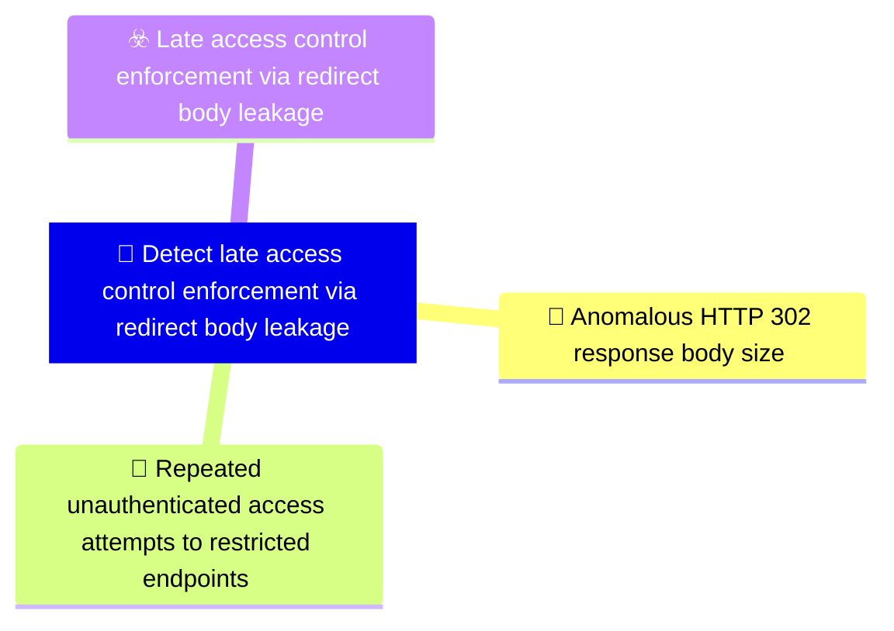

# 🎯 Detect late access control enforcement via redirect body leakage

**🚩 Priority : `High`**

🚦 **TLP:CLEAR** ⚪ : Recipients can spread this to the world, there is no limit on disclosure.

🗡️ **ATT&CK Techniques** :  [T1190 : Exploit Public-Facing Application](https://attack.mitre.org/techniques/T1190 'Adversaries may attempt to exploit a weakness in an Internet-facing host or system to initially access a network The weakness in the system can be a s')

---

`🔑 UUID : f8a95fcf-c5b0-4db0-bb8b-78e4edaa0544` **|** `🏷️ Version : 1` **|** `🗓️ Creation Date : 2026-03-30` **|** `🗓️ Last Modification : 2026-03-30` **|** `👩‍💻 Model author : None` **|** `👥 Contributors : None` **|** `Sharing Organisation : {'uuid': '56b0a0f0-b0bc-47d9-bb46-02f80ae2065a', 'name': 'EC DIGIT CSOC'}` **|** `🧱 Schema Identifier : dom::1.0`

## 💡 Objective

**🏷️ Type** : Threat - Alerts meant for detection cybersecurity threats, and which should eventually trigger Incident Response  

> Detect exploitation of a broken access control pattern where web application
> HTTP 302 redirect responses contain the full rendered protected page content
> in the response body. This detection objective targets the observable
> artefacts of late access control enforcement — specifically, redirect
> responses with anomalously large bodies and patterns of repeated
> unauthenticated access to restricted endpoints. The vulnerability enables an
> adversary to exfiltrate protected content without valid credentials by
> intercepting the response body of redirect responses using tools that do not
> follow HTTP redirects.
> 

**🎼 Composition** : Combined - All signals triggered for any entity can be grouped in a single signal. This may be extremely useful to identify pan-environment compromises.

> This detection objective combines two complementary signals. The first
signal detects the primary artefact (oversized 302 response bodies) through
pattern matching on web server or proxy logs. The second signal detects the
exploitation pattern (repeated unauthenticated requests yielding 302
responses) through frequency analysis. When both signals fire for the same
source IP and timeframe, confidence in active exploitation is high. Either
signal independently may indicate the vulnerability exists, but their
combination provides stronger evidence of active adversary exploitation.

### 🌊 Related OpenTide Objects

**Threats**

| ☣️ Threat Vectors                                                                                                                                                                                                                                                                                                         |
|:--------------------------------------------------------------------------------------------------------------------------------------------------------------------------------------------------------------------------------------------------------------------------------------------------------------------------|
| [Late access control enforcement via redirect body leakage](../Threat%20Vectors/☣️%20Late%20access%20control%20enforcement%20via%20redirect%20body%20leakage 'An adversary exploits a broken access control pattern in a web applicationwhere the server constructs and includes the full rendered page content inth...') |

**Rules**

| 📡 Detection Objective Signals (2)                                                                                                                                                                                                                                                                 | 🚨 Detection Rules    |
|:--------------------------------------------------------------------------------------------------------------------------------------------------------------------------------------------------------------------------------------------------------------------------------------------------|:---------------------|
| [Repeated unauthenticated access attempts to restricted endpoints](#repeated-unauthenticated-access-attempts-to-restricted-endpoints 'Detect patterns where a client identified by IP address or sessionrepeatedly sends requests to authenticated or role-restricted endpointsand consisten...') | ❌ No Detection Rules |
| [Anomalous HTTP 302 response body size](#anomalous-http-302-response-body-size 'Detect HTTP 302 redirect responses that contain unexpectedly largeresponse bodies Legitimate 302 redirects typically have minimal or nobody content us...')                                                       | ❌ No Detection Rules |

## 📡 Signals

### Anomalous HTTP 302 response body size

🪪 **UUID** : `f798884c-46ea-424c-9958-45f2c4f8110a`

> Detect HTTP 302 redirect responses that contain unexpectedly large
response bodies. Legitimate 302 redirects typically have minimal or no
body content (usually less than 500 bytes). A 302 response with a
substantial body (e.g. greater than 1 kB) may indicate that the server is
leaking protected page content in the redirect response. Monitor web
server access logs, reverse proxy logs, or WAF logs for 302 responses
where the Content-Length or response_body_bytes exceeds a defined
threshold. This signal targets the core observable artefact of the
vulnerability.

**🔎 Data Visibility**

- **Availability** : Partial
- **Requirements** : `Requires web server access logs (e.g. Apache, Nginx, IIS) or reverse
proxy/load balancer logs that record HTTP response status codes AND
response body sizes. WAF logs that capture response metadata are also
suitable. The logging infrastructure must record the Content-Length
header or actual response body size for redirect responses. Many default
logging configurations do not capture response body size for redirect
responses, so logging configuration may need adjustment.
`

_💾 Possible logsources_

_❌ No logsources mentioned_

**🧲 Related Entities**

| Name               | Category                                        | Description                                                                                                                                                                                  |
|:-------------------|:------------------------------------------------|:---------------------------------------------------------------------------------------------------------------------------------------------------------------------------------------------|
| Network Connection | **Network Entities** : Network Related Entities | Represents a network connection, including source and destination IPs, ports, and protocols. This entity is critical for detecting suspicious or unauthorized communication between systems. |
| URL                | **Network Entities** : Network Related Entities | Represents a Uniform Resource Locator (URL), often used in web-basedattacks or phishing campaigns.                                                                                           |

**⚠️ Detectors**

_❌ No detectors mentioned_

**🌐 Examples**

_❌ No examples mentioned_

### Repeated unauthenticated access attempts to restricted endpoints

🪪 **UUID** : `0770d2a4-9299-46d7-93f2-c3fff68aad26`

> Detect patterns where a client (identified by IP address or session)
repeatedly sends requests to authenticated or role-restricted endpoints
and consistently receives HTTP 302 redirect responses. This pattern
suggests automated exploitation of the redirect body leakage
vulnerability, where an adversary is systematically enumerating protected
endpoints to exfiltrate content from the response bodies. Legitimate
users receiving a 302 redirect would typically follow it and
authenticate; repeated 302 responses to the same client for different
protected endpoints within a short timeframe is anomalous.

**🔎 Data Visibility**

- **Availability** : Partial
- **Requirements** : `Requires web server access logs or WAF logs that capture the requesting
client IP address, requested URL path, and HTTP response status code.
Session-level correlation (via cookies or session identifiers) enhances
detection accuracy. Logs should be analysable in a SIEM or log
analytics platform capable of aggregating 302 responses per source IP
and counting distinct restricted URLs accessed within a time window.
`

_💾 Possible logsources_

_❌ No logsources mentioned_

**🧲 Related Entities**

| Name               | Category                                        | Description                                                                                                                                                                                  |
|:-------------------|:------------------------------------------------|:---------------------------------------------------------------------------------------------------------------------------------------------------------------------------------------------|
| IP Address         | **Network Entities** : Network Related Entities | Represents an IPv4 or IPv6 address associated with a host or networkconnection.                                                                                                              |
| URL                | **Network Entities** : Network Related Entities | Represents a Uniform Resource Locator (URL), often used in web-basedattacks or phishing campaigns.                                                                                           |
| Network Connection | **Network Entities** : Network Related Entities | Represents a network connection, including source and destination IPs, ports, and protocols. This entity is critical for detecting suspicious or unauthorized communication between systems. |

**⚠️ Detectors**

_❌ No detectors mentioned_

**🌐 Examples**

_❌ No examples mentioned_

## References

**🕊️ Publicly available resources**

- [_1_] https://owasp.org/Top10/A01_2021-Broken_Access_Control/
- [_2_] https://cwe.mitre.org/data/definitions/284.html

[1]: https://owasp.org/Top10/A01_2021-Broken_Access_Control/
[2]: https://cwe.mitre.org/data/definitions/284.html

