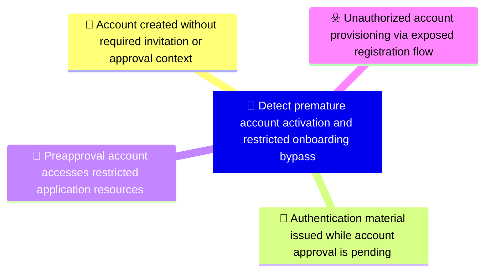

# 🎯 Detect premature account activation and restricted onboarding bypass

**🚩 Priority : `High`**

🚦 **TLP:CLEAR** ⚪ : Recipients can spread this to the world, there is no limit on disclosure.

🗡️ **ATT&CK Techniques** :  [T1190 : Exploit Public-Facing Application](https://attack.mitre.org/techniques/T1190 'Adversaries may attempt to exploit a weakness in an Internet-facing host or system to initially access a network The weakness in the system can be a s'), [T1136 : Create Account](https://attack.mitre.org/techniques/T1136 'Adversaries may create an account to maintain access to victim systemsCitation Symantec WastedLocker June 2020 With a sufficient level of access, crea')

---

`🔑 UUID : 3a73c153-abd7-40cd-86a5-4d57a42b9a44` **|** `🏷️ Version : 2` **|** `🗓️ Creation Date : 2026-05-04` **|** `🗓️ Last Modification : 2026-05-04` **|** `👩‍💻 Model author : None` **|** `👥 Contributors : None` **|** `Sharing Organisation : {'uuid': '56b0a0f0-b0bc-47d9-bb46-02f80ae2065a', 'name': 'EC DIGIT CSOC'}` **|** `🧱 Schema Identifier : dom::1.0`

## 💡 Objective

**🏷️ Type** : Threat - Alerts meant for detection cybersecurity threats, and which should eventually trigger Incident Response  

> Detect account lifecycle control failures where an identity becomes usable before the intended
> approval, invitation, or eligibility gate is complete. The capability is broader than a single
> registration endpoint: it correlates account creation, approval state, password reset, token
> issuance, and first resource access. This gives analysts a lifecycle view of onboarding bypass
> rather than a simple route-hit alert.
> 

**🎼 Composition** : Sequence - Signals must be tracked across time, and correlated based on a succession of events. Particularly useful for weak signals, but which assembled over time with reinforcing signal provide a high fidelity detection - for example, anomalous logons.

> Correlate account lifecycle events in order: registration attempt, account object creation,
approval or invitation state, password reset, login or token issuance, and first UI/API access.
The highest-confidence condition is a newly created account receiving reset capability, session
material, or protected resource access before its approval state permits authentication.

### 🌊 Related OpenTide Objects

**Threats**

| ☣️ Threat Vectors                                                                                                                                                                                                                                                                                                                   |
|:------------------------------------------------------------------------------------------------------------------------------------------------------------------------------------------------------------------------------------------------------------------------------------------------------------------------------------|
| [Unauthorized account provisioning via exposed registration flow](../Threat%20Vectors/☣️%20Unauthorized%20account%20provisioning%20via%20exposed%20registration%20flow 'An adversary provisions an unauthorised account through exposed registration or account lifecycleendpoints despite intended onboarding restrictions Th...') |

**Rules**

| 📡 Detection Objective Signals (3)                                                                                                                                                                                                                                                                 | 🚨 Detection Rules    |
|:--------------------------------------------------------------------------------------------------------------------------------------------------------------------------------------------------------------------------------------------------------------------------------------------------|:---------------------|
| [Account created without required invitation or approval context](#account-created-without-required-invitation-or-approval-context 'Alert when a registration endpoint creates an account without a valid invitation, approveddomain, reviewer approval, or expected onboarding source Req...')   | ❌ No Detection Rules |
| [Pre-approval account accesses restricted application resources](#pre-approval-account-accesses-restricted-application-resources 'Alert when a newly created account accesses UI pages or APIs before approval, invitationvalidation, or domain eligibility checks are complete Required...')     | ❌ No Detection Rules |
| [Authentication material issued while account approval is pending](#authentication-material-issued-while-account-approval-is-pending 'Alert when password reset, login, session creation, or token issuance succeeds for an accountwhose lifecycle state is pending, unapproved, unverified,...') | ❌ No Detection Rules |

## 📡 Signals

### Account created without required invitation or approval context

🪪 **UUID** : `7f6d1aae-c807-42fb-8734-4d3c6c4e9670`

> Alert when a registration endpoint creates an account without a valid invitation, approved
domain, reviewer approval, or expected onboarding source. Required fields include account ID,
registration path, source IP, tenant/environment, invitation or approval identifier, account
state, and initial role. Tune out legitimate self-service flows by comparing with a maintained
list of public registration routes and approved domains.
Triage by confirming the expected onboarding policy for the tenant or application module and
verifying whether an invitation, reviewer action, or domain eligibility check existed.

**🔎 Data Visibility**

- **Availability** : Partial
- **Requirements** : `Requires application audit logs for registration attempts, account-created events, approval
records, invitation records, source IP, request path, tenant or environment, and initial role.
API gateway or web logs help identify direct backend access when the UI is hidden.
`

_💾 Possible logsources_

_❌ No logsources mentioned_

**🧲 Related Entities**

| Name       | Category                                        | Description                                                                                                                                                |
|:-----------|:------------------------------------------------|:-----------------------------------------------------------------------------------------------------------------------------------------------------------|
| Account    | **Host Entities** : Host Related Entities       | Represents a user account entity, including local, domain, or cloud-basedaccounts.                                                                         |
| IP Address | **Network Entities** : Network Related Entities | Represents an IPv4 or IPv6 address associated with a host or networkconnection.                                                                            |
| URL        | **Network Entities** : Network Related Entities | Represents a Uniform Resource Locator (URL), often used in web-basedattacks or phishing campaigns.                                                         |
| API Call   | **Network Entities** : Network Related Entities | Represents an API call, including its endpoint, parameters, and response. API calls are often analyzed to detect unauthorized access or data exfiltration. |

**⚠️ Detectors**

_❌ No detectors mentioned_

**🌐 Examples**

_❌ No examples mentioned_

### Authentication material issued while account approval is pending

🪪 **UUID** : `d5906e6c-0f66-4dd6-8add-216a90b2b1f2`

> Alert when password reset, login, session creation, or token issuance succeeds for an account
whose lifecycle state is pending, unapproved, unverified, pending invitation validation, or
otherwise not allowed to authenticate. Required fields include account ID, lifecycle state at
decision time, reset outcome, token/session identifier, source IP, and timestamp. This is the
principal signal that a provisioned but unapproved account has become usable.
Triage by preserving the account lifecycle state at decision time and confirming whether the
password reset, login, or token service incorrectly ignored that state.

**🔎 Data Visibility**

- **Availability** : Partial
- **Requirements** : `Requires identity, application, and token service logs with account state at decision time,
reset request outcome, token issuance outcome, session creation, source IP, user identifier,
and timestamps. Correlation must preserve historical account state, not only current state.
`

_💾 Possible logsources_

_❌ No logsources mentioned_

**🧲 Related Entities**

| Name           | Category                                        | Description                                                                                                                                                                                      |
|:---------------|:------------------------------------------------|:-------------------------------------------------------------------------------------------------------------------------------------------------------------------------------------------------|
| Account        | **Host Entities** : Host Related Entities       | Represents a user account entity, including local, domain, or cloud-basedaccounts.                                                                                                               |
| Authentication | **Cloud Entities** : Cloud Related Entities     | Represents an authentication attempt, including the user, source IP, and success or failure status. Authentication events are critical for detecting brute force attacks or unauthorized access. |
| Token          | **Host Entities** : Host Related Entities       | Represents an authentication or access token, such as OAuth tokens or API keys. Tokens are often analyzed to detect unauthorized access or misuse.                                               |
| Session        | **Network Entities** : Network Related Entities | Represents a user or system session, including session IDs and associated activities. Sessions are often analyzed to detect unauthorized access or unusual behavior.                             |

**⚠️ Detectors**

_❌ No detectors mentioned_

**🌐 Examples**

_❌ No examples mentioned_

### Pre-approval account accesses restricted application resources

🪪 **UUID** : `958eeed6-43f6-43c8-8bb9-96397aab29a1`

> Alert when a newly created account accesses UI pages or APIs before approval, invitation
validation, or domain eligibility checks are complete. Required fields include account ID,
account creation time, approval state, request path, response status, role, source IP, and
first-access timestamp. Prioritise access to restricted modules, internal data, administrative
paths, or endpoints that should require an established trusted account.
Triage by comparing first-access time with approval and activation timestamps, then assessing
which data or functions were exposed before the account became eligible.

**🔎 Data Visibility**

- **Availability** : Partial
- **Requirements** : `Requires account lifecycle events, authentication events, web or API access logs, account
approval state, role assignment, request path, response status, and source IP. The detection
should compare first resource access with approval or activation timestamps.
`

_💾 Possible logsources_

_❌ No logsources mentioned_

**🧲 Related Entities**

| Name     | Category                                        | Description                                                                                                                                                          |
|:---------|:------------------------------------------------|:---------------------------------------------------------------------------------------------------------------------------------------------------------------------|
| Account  | **Host Entities** : Host Related Entities       | Represents a user account entity, including local, domain, or cloud-basedaccounts.                                                                                   |
| URL      | **Network Entities** : Network Related Entities | Represents a Uniform Resource Locator (URL), often used in web-basedattacks or phishing campaigns.                                                                   |
| API Call | **Network Entities** : Network Related Entities | Represents an API call, including its endpoint, parameters, and response. API calls are often analyzed to detect unauthorized access or data exfiltration.           |
| Session  | **Network Entities** : Network Related Entities | Represents a user or system session, including session IDs and associated activities. Sessions are often analyzed to detect unauthorized access or unusual behavior. |

**⚠️ Detectors**

_❌ No detectors mentioned_

**🌐 Examples**

_❌ No examples mentioned_

## References

**🕊️ Publicly available resources**

- [_1_] https://owasp.org/Top10/A01_2021-Broken_Access_Control/
- [_2_] https://owasp.org/Top10/A07_2021-Identification_and_Authentication_Failures/
- [_3_] https://cwe.mitre.org/data/definitions/306.html

[1]: https://owasp.org/Top10/A01_2021-Broken_Access_Control/
[2]: https://owasp.org/Top10/A07_2021-Identification_and_Authentication_Failures/
[3]: https://cwe.mitre.org/data/definitions/306.html

