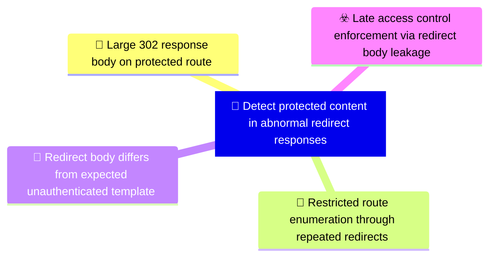

# 🎯 Detect protected content in abnormal redirect responses

**🚩 Priority : `High`**

🚦 **TLP:CLEAR** ⚪ : Recipients can spread this to the world, there is no limit on disclosure.

🗡️ **ATT&CK Techniques** :  [T1190 : Exploit Public-Facing Application](https://attack.mitre.org/techniques/T1190 'Adversaries may attempt to exploit a weakness in an Internet-facing host or system to initially access a network The weakness in the system can be a s')

---

`🔑 UUID : f8a95fcf-c5b0-4db0-bb8b-78e4edaa0544` **|** `🏷️ Version : 3` **|** `🗓️ Creation Date : 2026-03-30` **|** `🗓️ Last Modification : 2026-05-04` **|** `👩‍💻 Model author : None` **|** `👥 Contributors : Hold Security Threat Research` **|** `Sharing Organisation : {'uuid': '56b0a0f0-b0bc-47d9-bb46-02f80ae2065a', 'name': 'EC DIGIT CSOC'}` **|** `🧱 Schema Identifier : dom::1.0`

## 💡 Objective

**🏷️ Type** : Threat - Alerts meant for detection cybersecurity threats, and which should eventually trigger Incident Response  

> Identify access-control defects where redirect responses carry more content than a redirect
> should reasonably contain. This objective is not a one-to-one restatement of the upstream threat
> vector; it defines the detection capability around abnormal HTTP response semantics, protected
> route access patterns, and differential validation of unauthenticated requests. The capability is
> useful for reverse proxies, WAFs, API gateways, and synthetic validation jobs that can observe
> response status, size, headers, and route sensitivity.
> 

**🎼 Composition** : Combined - All signals triggered for any entity can be grouped in a single signal. This may be extremely useful to identify pan-environment compromises.

> Combine response-shape anomalies with request context. Oversized 302 responses are a strong
exposure indicator, but confidence increases when the same source repeatedly probes restricted
routes or when controlled validation confirms that body content differs materially from a normal
login redirect. Correlate on source IP, requested URL, route sensitivity, response status, body
byte count, and follow-up requests.

### 🌊 Related OpenTide Objects

**Threats**

| ☣️ Threat Vectors                                                                                                                                                                                                                                                                                                         |
|:--------------------------------------------------------------------------------------------------------------------------------------------------------------------------------------------------------------------------------------------------------------------------------------------------------------------------|
| [Late access control enforcement via redirect body leakage](../Threat%20Vectors/☣️%20Late%20access%20control%20enforcement%20via%20redirect%20body%20leakage 'An adversary exploits a broken access control pattern in a web applicationwhere the server constructs and includes the full rendered page content inth...') |

**Rules**

| 📡 Detection Objective Signals (3)                                                                                                                                                                                                                                                         | 🚨 Detection Rules    |
|:------------------------------------------------------------------------------------------------------------------------------------------------------------------------------------------------------------------------------------------------------------------------------------------|:---------------------|
| [Large 302 response body on protected route](#large-302-response-body-on-protected-route 'Alert when an HTTP 302 response from an authenticated or role-restricted route has an unusuallylarge response body Required fields include request pat...')                                     | ❌ No Detection Rules |
| [Redirect body differs from expected unauthenticated template](#redirect-body-differs-from-expected-unauthenticated-template 'Use controlled synthetic checks to compare unauthenticated requests to protected routes againsta known-safe redirect template Alert when the response ...') | ❌ No Detection Rules |
| [Restricted route enumeration through repeated redirects](#restricted-route-enumeration-through-repeated-redirects 'Alert when a source repeatedly requests distinct authenticated or role-restricted URLs andreceives 302 redirects without completing a normal authentic...')           | ❌ No Detection Rules |

## 📡 Signals

### Large 302 response body on protected route

🪪 **UUID** : `f798884c-46ea-424c-9958-45f2c4f8110a`

> Alert when an HTTP 302 response from an authenticated or role-restricted route has an unusually
large response body. Required fields include request path, response status, response body bytes
or Content-Length, source IP, user/session state if present, and route classification. Tune the
threshold against known login redirects and application-specific templates; a practical starting
point is to alert on 302 responses whose body size is above the normal redirect baseline for the
same application or route family.
Triage by confirming route sensitivity, comparing against normal redirect templates, and
capturing minimal request/response evidence for the application owner without storing protected
body content.

**🔎 Data Visibility**

- **Availability** : Partial
- **Requirements** : `Requires web server, reverse proxy, WAF, API gateway, or load balancer logs that record status
code and response body size. Route sensitivity metadata or a maintained list of protected URL
patterns improves fidelity. Response bodies should not be logged in production unless a
controlled validation process explicitly permits capture.
`

_💾 Possible logsources_

_❌ No logsources mentioned_

**🧲 Related Entities**

| Name               | Category                                        | Description                                                                                                                                                                                  |
|:-------------------|:------------------------------------------------|:---------------------------------------------------------------------------------------------------------------------------------------------------------------------------------------------|
| Network Connection | **Network Entities** : Network Related Entities | Represents a network connection, including source and destination IPs, ports, and protocols. This entity is critical for detecting suspicious or unauthorized communication between systems. |
| URL                | **Network Entities** : Network Related Entities | Represents a Uniform Resource Locator (URL), often used in web-basedattacks or phishing campaigns.                                                                                           |
| IP Address         | **Network Entities** : Network Related Entities | Represents an IPv4 or IPv6 address associated with a host or networkconnection.                                                                                                              |

**⚠️ Detectors**

_❌ No detectors mentioned_

**🌐 Examples**

_❌ No examples mentioned_

### Restricted route enumeration through repeated redirects

🪪 **UUID** : `0770d2a4-9299-46d7-93f2-c3fff68aad26`

> Alert when a source repeatedly requests distinct authenticated or role-restricted URLs and
receives 302 redirects without completing a normal authentication flow. Required fields include
source IP, request path, response status, user-agent, redirect Location, and timestamp. Tune out
normal unauthenticated browsing by requiring multiple distinct protected paths, no successful
login event for the same source/session, or abnormal tooling indicators.
As a non-normative starting point, investigate three or more distinct restricted routes from the
same source within a short window when no successful authentication event follows.

**🔎 Data Visibility**

- **Availability** : Partial
- **Requirements** : `Requires web, WAF, or proxy logs that include client IP, URL path, response status, user-agent,
and timestamp. Authentication events or session telemetry improve tuning by distinguishing
legitimate login redirects from automated probing.
`

_💾 Possible logsources_

_❌ No logsources mentioned_

**🧲 Related Entities**

| Name               | Category                                        | Description                                                                                                                                                                                  |
|:-------------------|:------------------------------------------------|:---------------------------------------------------------------------------------------------------------------------------------------------------------------------------------------------|
| IP Address         | **Network Entities** : Network Related Entities | Represents an IPv4 or IPv6 address associated with a host or networkconnection.                                                                                                              |
| URL                | **Network Entities** : Network Related Entities | Represents a Uniform Resource Locator (URL), often used in web-basedattacks or phishing campaigns.                                                                                           |
| Network Connection | **Network Entities** : Network Related Entities | Represents a network connection, including source and destination IPs, ports, and protocols. This entity is critical for detecting suspicious or unauthorized communication between systems. |

**⚠️ Detectors**

_❌ No detectors mentioned_

**🌐 Examples**

_❌ No examples mentioned_

### Redirect body differs from expected unauthenticated template

🪪 **UUID** : `077ee487-7694-4ed5-9a83-5ed36b4f31c5`

> Use controlled synthetic checks to compare unauthenticated requests to protected routes against
a known-safe redirect template. Alert when the response body contains route-specific strings,
tables, user data markers, internal navigation elements, or other protected-page artefacts
rather than the expected minimal redirect body. This is a continuous assurance signal rather
than a production log-only signal.
Triage by comparing the body fingerprint against the approved unauthenticated redirect template
and validating that any exposed markers map to protected application content.

**🔎 Data Visibility**

- **Availability** : Partial
- **Requirements** : `Requires an approved synthetic testing harness or DAST process that can issue unauthenticated
requests without following redirects and compare status, headers, body length, and selected
non-sensitive content fingerprints. Store only hashes, fingerprints, or minimal excerpts needed
to prove exposure.
`

_💾 Possible logsources_

_❌ No logsources mentioned_

**🧲 Related Entities**

| Name     | Category                                        | Description                                                                                                                                                          |
|:---------|:------------------------------------------------|:---------------------------------------------------------------------------------------------------------------------------------------------------------------------|
| URL      | **Network Entities** : Network Related Entities | Represents a Uniform Resource Locator (URL), often used in web-basedattacks or phishing campaigns.                                                                   |
| Session  | **Network Entities** : Network Related Entities | Represents a user or system session, including session IDs and associated activities. Sessions are often analyzed to detect unauthorized access or unusual behavior. |
| API Call | **Network Entities** : Network Related Entities | Represents an API call, including its endpoint, parameters, and response. API calls are often analyzed to detect unauthorized access or data exfiltration.           |

**⚠️ Detectors**

_❌ No detectors mentioned_

**🌐 Examples**

_❌ No examples mentioned_

## References

**🕊️ Publicly available resources**

- [_1_] https://owasp.org/Top10/A01_2021-Broken_Access_Control/
- [_2_] https://cwe.mitre.org/data/definitions/284.html

[1]: https://owasp.org/Top10/A01_2021-Broken_Access_Control/
[2]: https://cwe.mitre.org/data/definitions/284.html

