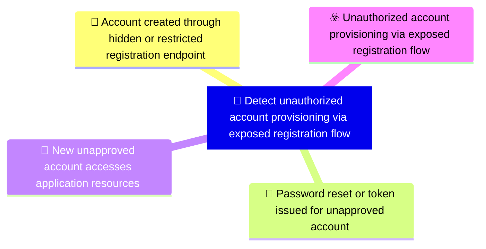

# 🎯 Detect unauthorized account provisioning via exposed registration flow

**🚩 Priority : `High`**

🚦 **TLP:CLEAR** ⚪ : Recipients can spread this to the world, there is no limit on disclosure.

🗡️ **ATT&CK Techniques** :  [T1190 : Exploit Public-Facing Application](https://attack.mitre.org/techniques/T1190 'Adversaries may attempt to exploit a weakness in an Internet-facing host or system to initially access a network The weakness in the system can be a s'), [T1136 : Create Account](https://attack.mitre.org/techniques/T1136 'Adversaries may create an account to maintain access to victim systemsCitation Symantec WastedLocker June 2020 With a sufficient level of access, crea')

---

`🔑 UUID : 3a73c153-abd7-40cd-86a5-4d57a42b9a44` **|** `🏷️ Version : 1` **|** `🗓️ Creation Date : 2026-05-04` **|** `🗓️ Last Modification : 2026-05-04` **|** `👩‍💻 Model author : None` **|** `👥 Contributors : None` **|** `Sharing Organisation : {'uuid': '56b0a0f0-b0bc-47d9-bb46-02f80ae2065a', 'name': 'EC DIGIT CSOC'}` **|** `🧱 Schema Identifier : dom::1.0`

## 💡 Objective

**🏷️ Type** : Threat - Alerts meant for detection cybersecurity threats, and which should eventually trigger Incident Response  

> Detect unauthorised account creation and premature activation through exposed registration,
> password reset, or token issuance workflows. The objective covers backend routes that remain
> reachable despite hidden registration UI, account records created before approval, and access
> granted to accounts that should still be pending approval or invitation validation.
> 

**🎼 Composition** : Sequence - Signals must be tracked across time, and correlated based on a succession of events. Particularly useful for weak signals, but which assembled over time with reinforcing signal provide a high fidelity detection - for example, anomalous logons.

> Correlate lifecycle events in sequence: registration request, account object creation, password
reset request, login or token issuance, and access to UI or API resources. A single exposed
registration endpoint is useful evidence, but the highest-confidence detection occurs when account
creation is followed by reset, session issuance, or successful resource access before approval.

### 🌊 Related OpenTide Objects

**Threats**

| ☣️ Threat Vectors                                                                                                                                                                                                                                                                                                                   |
|:------------------------------------------------------------------------------------------------------------------------------------------------------------------------------------------------------------------------------------------------------------------------------------------------------------------------------------|
| [Unauthorized account provisioning via exposed registration flow](../Threat%20Vectors/☣️%20Unauthorized%20account%20provisioning%20via%20exposed%20registration%20flow 'An adversary provisions an unauthorised account through exposed registration or account lifecycleendpoints despite intended onboarding restrictions Th...') |

**Rules**

| 📡 Detection Objective Signals (3)                                                                                                                                                                                                                                                                     | 🚨 Detection Rules    |
|:------------------------------------------------------------------------------------------------------------------------------------------------------------------------------------------------------------------------------------------------------------------------------------------------------|:---------------------|
| [Account created through hidden or restricted registration endpoint](#account-created-through-hidden-or-restricted-registration-endpoint 'Detect successful account creation through routes that should be disabled, invite-only, orapproval-gated, such as register, signup, apiregister, or de...') | ❌ No Detection Rules |
| [New unapproved account accesses application resources](#new-unapproved-account-accesses-application-resources 'Detect newly created accounts accessing UI pages or APIs before approval, invitation validation,or domain eligibility checks are complete Prioritise a...')                           | ❌ No Detection Rules |
| [Password reset or token issued for unapproved account](#password-reset-or-token-issued-for-unapproved-account 'Detect password reset, login, or token issuance for an account whose lifecycle state is pending,unapproved, unverified, pending invitation validation,...')                           | ❌ No Detection Rules |

## 📡 Signals

### Account created through hidden or restricted registration endpoint

🪪 **UUID** : `7f6d1aae-c807-42fb-8734-4d3c6c4e9670`

> Detect successful account creation through routes that should be disabled, invite-only, or
approval-gated, such as /register, /signup, /api/register, or deployment-specific equivalents.
Alert when an account is created without a matching invitation, approval record, authorised
domain, or expected onboarding source.

**🔎 Data Visibility**

- **Availability** : Partial
- **Requirements** : `Requires application audit logs for registration attempts, account-created events, approval
or invitation state, source IP, request path, tenant or environment, and initial account role.
API gateway or web logs are useful to identify direct access to hidden UI or backend routes.
`

_💾 Possible logsources_

_❌ No logsources mentioned_

**🧲 Related Entities**

| Name       | Category                                        | Description                                                                                                                                                |
|:-----------|:------------------------------------------------|:-----------------------------------------------------------------------------------------------------------------------------------------------------------|
| Account    | **Host Entities** : Host Related Entities       | Represents a user account entity, including local, domain, or cloud-basedaccounts.                                                                         |
| IP Address | **Network Entities** : Network Related Entities | Represents an IPv4 or IPv6 address associated with a host or networkconnection.                                                                            |
| URL        | **Network Entities** : Network Related Entities | Represents a Uniform Resource Locator (URL), often used in web-basedattacks or phishing campaigns.                                                         |
| API Call   | **Network Entities** : Network Related Entities | Represents an API call, including its endpoint, parameters, and response. API calls are often analyzed to detect unauthorized access or data exfiltration. |

**⚠️ Detectors**

_❌ No detectors mentioned_

**🌐 Examples**

_❌ No examples mentioned_

### Password reset or token issued for unapproved account

🪪 **UUID** : `d5906e6c-0f66-4dd6-8add-216a90b2b1f2`

> Detect password reset, login, or token issuance for an account whose lifecycle state is pending,
unapproved, unverified, pending invitation validation, or otherwise not allowed to authenticate. This
signal is the critical failure point where a provisioned but unapproved account becomes usable.

**🔎 Data Visibility**

- **Availability** : Partial
- **Requirements** : `Requires identity, application, and token service logs with account state, reset request
outcome, token issuance outcome, session creation, source IP, user identifier, and timestamps.
Correlation must preserve account state at the time of reset or token issuance.
`

_💾 Possible logsources_

_❌ No logsources mentioned_

**🧲 Related Entities**

| Name           | Category                                        | Description                                                                                                                                                                                      |
|:---------------|:------------------------------------------------|:-------------------------------------------------------------------------------------------------------------------------------------------------------------------------------------------------|
| Account        | **Host Entities** : Host Related Entities       | Represents a user account entity, including local, domain, or cloud-basedaccounts.                                                                                                               |
| Authentication | **Host Entities** : Host Related Entities       | Represents an authentication attempt, including the user, source IP, and success or failure status. Authentication events are critical for detecting brute force attacks or unauthorized access. |
| Token          | **Host Entities** : Host Related Entities       | Represents an authentication or access token, such as OAuth tokens or API keys. Tokens are often analyzed to detect unauthorized access or misuse.                                               |
| Session        | **Network Entities** : Network Related Entities | Represents a user or system session, including session IDs and associated activities. Sessions are often analyzed to detect unauthorized access or unusual behavior.                             |

**⚠️ Detectors**

_❌ No detectors mentioned_

**🌐 Examples**

_❌ No examples mentioned_

### New unapproved account accesses application resources

🪪 **UUID** : `958eeed6-43f6-43c8-8bb9-96397aab29a1`

> Detect newly created accounts accessing UI pages or APIs before approval, invitation validation,
or domain eligibility checks are complete. Prioritise access to restricted modules, internal
data, administrative paths, or endpoints that should require an established trusted account.

**🔎 Data Visibility**

- **Availability** : Partial
- **Requirements** : `Requires account lifecycle events, authentication events, web or API access logs, account
approval status, role assignment, request path, and source IP. The detection should correlate
first account creation time with subsequent access before approval or expected activation.
`

_💾 Possible logsources_

_❌ No logsources mentioned_

**🧲 Related Entities**

| Name     | Category                                        | Description                                                                                                                                                          |
|:---------|:------------------------------------------------|:---------------------------------------------------------------------------------------------------------------------------------------------------------------------|
| Account  | **Host Entities** : Host Related Entities       | Represents a user account entity, including local, domain, or cloud-basedaccounts.                                                                                   |
| URL      | **Network Entities** : Network Related Entities | Represents a Uniform Resource Locator (URL), often used in web-basedattacks or phishing campaigns.                                                                   |
| API Call | **Network Entities** : Network Related Entities | Represents an API call, including its endpoint, parameters, and response. API calls are often analyzed to detect unauthorized access or data exfiltration.           |
| Session  | **Network Entities** : Network Related Entities | Represents a user or system session, including session IDs and associated activities. Sessions are often analyzed to detect unauthorized access or unusual behavior. |

**⚠️ Detectors**

_❌ No detectors mentioned_

**🌐 Examples**

_❌ No examples mentioned_

## References

**🕊️ Publicly available resources**

- [_1_] https://owasp.org/Top10/A01_2021-Broken_Access_Control/
- [_2_] https://owasp.org/Top10/A07_2021-Identification_and_Authentication_Failures/
- [_3_] https://cwe.mitre.org/data/definitions/306.html

[1]: https://owasp.org/Top10/A01_2021-Broken_Access_Control/
[2]: https://owasp.org/Top10/A07_2021-Identification_and_Authentication_Failures/
[3]: https://cwe.mitre.org/data/definitions/306.html

