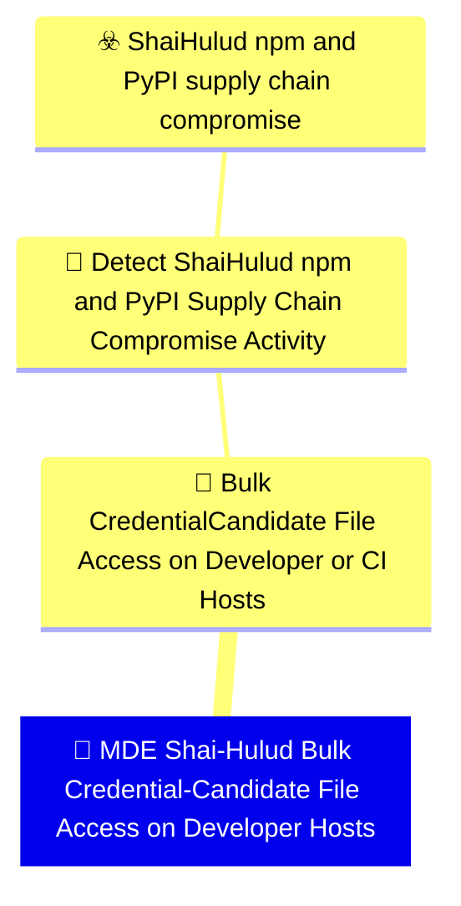

# 🚨 MDE Shai-Hulud Bulk Credential-Candidate File Access on Developer Hosts

🚦 **TLP:CLEAR** ⚪ : Recipients can spread this to the world, there is no limit on disclosure.


---

`🔑 UUID : c82cfa6b-066f-4ba3-ba07-d7eb642c8099` **|** `🏷️ Version : 1` **|** `🗓️ Creation Date : 2026-06-16` **|** `🗓️ Last Modification : 2026-06-22` **|** `Sharing Organisation : {'uuid': '56b0a0f0-b0bc-47d9-bb46-02f80ae2065a', 'name': 'EC DIGIT CSOC'}` **|** `🧱 Schema Identifier : mdr::2.1`

## 👁️‍🗨️ Description

> #### MDR Technical Details
> Microsoft Defender for Endpoint custom detection implementing DOM signal
> `b49d0a94-ae13-49b3-8ad8-6c035fa3d681` (Bulk Credential-Candidate File
> Access on Developer or CI Hosts). Aggregates `DeviceFileEvents` to flag
> a single process tree touching ≥ 15 distinct secret-pattern paths within
> a ten-minute window, filtered to non-interactive package-runtime parents.
> 
> #### Detection Criteria
> - Threshold: `PathThreshold = 15` distinct credential-candidate paths per
>   process per 10-minute bin (agreed with stakeholders for developer hosts).
> - Initiating runtime is node, python, or bun without interactive shell parent.
> - Frequency: 1 hour; severity Medium.
> 
> #### Exclusion Criteria
> - Backup, DLP, and deliberate secret-scanner service accounts should be
>   excluded via `InitiatingProcessFileName` allowlists per deployment.
> - IDE indexing may touch multiple config files — tune threshold upward on
>   developer workstations if noise persists.
> 

### 🕸️ Relations





| 📡 Detection Objective Signals                                                                                                                                                                                                                                                                                                                                                                                                                    | 🎯 Detection Objectives                                                                                                                                                                                                                                                                                                                          | ☣️ Threat Vectors                                                                                                                                                                                                                                                                                      | 🛡️ Detection Models    |
|:-------------------------------------------------------------------------------------------------------------------------------------------------------------------------------------------------------------------------------------------------------------------------------------------------------------------------------------------------------------------------------------------------------------------------------------------------|:------------------------------------------------------------------------------------------------------------------------------------------------------------------------------------------------------------------------------------------------------------------------------------------------------------------------------------------------|:-------------------------------------------------------------------------------------------------------------------------------------------------------------------------------------------------------------------------------------------------------------------------------------------------------|:-----------------------|
| [Detect Shai-Hulud npm and PyPI Supply Chain Compromise Activity::Bulk Credential-Candidate File Access on Developer or CI Hosts](Detect%20Shai-Hulud%20npm%20and%20PyPI%20Supply%20Chain%20Compromise%20Activity#bulk-credential-candidate-file-access-on-developer-or-ci-hosts.md 'Statistical  anomaly detection of a single process recursivelyor iteratively accessing many credential-candidate files withina short interval  indicat...') | [Detect Shai-Hulud npm and PyPI Supply Chain Compromise Activity](../Detection%20Objectives/🎯%20Detect%20Shai-Hulud%20npm%20and%20PyPI%20Supply%20Chain%20Compromise%20Activity.md 'This Detection Objective addresses the May 2026 Shai-Hulud  miniShai-Hulud supply-chain campaign affecting npm and PyPI packagesincluding the tanstack...') | [Shai-Hulud npm and PyPI supply chain compromise](../Threat%20Vectors/☣️%20Shai-Hulud%20npm%20and%20PyPI%20supply%20chain%20compromise.md '## Executive SummaryOn 11 May 2026, a coordinated supply-chain campaign publicly trackedas Shai-Hulud  mini Shai-Hulud compromised packages across the...') | ❌ No Detection Models  |

&nbsp;

## ⚠️ Response

| 🌡️ Alert Severity                                                                | ‍🚒 Alert Handling Team                                     | 👣 Playbook link                                 |
|:---------------------------------------------------------------------------------|:-----------------------------------------------------------|:------------------------------------------------|
| **Medium** : Moderate SLAs required, can be grouped into a larger investigation. | **No defined responders for alerts generated by this MDR** | No playbook was defined for this detection rule |

### 📋 Procedure

#### 🕵🏼‍♂️ Analysis

> 1. Review the sample paths list for breadth of secret stores accessed.
> 2. Confirm the initiating process is rooted in package-manager activity.
> 3. Hunt for outbound IOC connections on the same device.
> 4. Compare against known backup or security-scanning schedules.
> 

#### 🔎 Supporting Searches

<table>
<tr><th>Purpose</th>
<th>Target System</th>
<th>Query</th>
</tr><tr>

<td>Check for Shai-Hulud network IOC egress from the device
</td>
<td>Microsoft Defender for Endpoint</td>

<td>

```sql
DeviceNetworkEvents
| where DeviceId == "{{DeviceId}}"
| where RemoteUrl has_any ("git-tanstack", "getsession")
| project Timestamp, RemoteUrl, RemoteIP, InitiatingProcessFileName
```
</td>
</tr>

</table>

#### 🔐 Containment
> If bulk access coincides with IOC egress or install anomalies, isolate
> the host and rotate all developer credentials.
> 

&nbsp;

## 💽 Configurations


<details>
<summary>Microsoft Defender for Endpoint <b>DEVELOPMENT</b></summary>

>**Status** : `DEVELOPMENT` - _Under active technical implementation, going in exploratory rounds_
>**Strategy** : `PREVIEW` - _Deployment from Pull/Merge Requests_

| Parameter                     | System Config                                   | Description                                                                                                                                                                                                                                                                                                                                                                                                                                                                                                                                                                                                                                                                                         | Config                                                                                                                                                                     |
|:------------------------------|:------------------------------------------------|:----------------------------------------------------------------------------------------------------------------------------------------------------------------------------------------------------------------------------------------------------------------------------------------------------------------------------------------------------------------------------------------------------------------------------------------------------------------------------------------------------------------------------------------------------------------------------------------------------------------------------------------------------------------------------------------------------|:---------------------------------------------------------------------------------------------------------------------------------------------------------------------------|
| Schema identifier and version |                                                 | Identifier of the schema at its current version                                                                                                                                                                                                                                                                                                                                                                                                                                                                                                                                                                                                                                                     | `defender_for_endpoint::2.1`                                                                                                                                               |
| ⏲ Rule Schedule               | `schedule`                                      | Select the frequency by which the query will run and trigger alerts. If you set it to run less frequently, it will have a longer lookback duration.  Queries that run every 24 hours check the past 30 days. Queries that run every 12 hours check the past 48 hours. Queries that run every 3 hours check the past 12 hours. Queries that run every hour check the past 4 hours. Queries that run continuously check events as they are ingested into Microsoft Defender XDR.  NRT is supported for specific tables and columns. Please see the documentation for more details. https://learn.microsoft.com/en-us/defender-xdr/custom-detection-rules?view=o365-worldwide#continuous-nrt-frequency | `1H`                                                                                                                                                                       |
| 🎫 Alert Title                 | `detectionAction.alertTemplate.title`           | Name of the alert triggered by the custom detection rule. By default, the name of the MDR will be used, but this parameter allows to override it.                                                                                                                                                                                                                                                                                                                                                                                                                                                                                                                                                   | `Shai-Hulud bulk secret-file access on {{DeviceName}}`                                                                                                                     |
| Threat Category               | `detectionAction.alertTemplate.category`        | Threat Category assigned to the alert triggered by the detection rule.                                                                                                                                                                                                                                                                                                                                                                                                                                                                                                                                                                                                                              | `Credential Access`                                                                                                                                                        |
| ATT&CK Techniques             |                                                 | Relevant techniques to map this rule onto. The available techniques are category-dependent, at the moment we do not provide a structured support to validate those techniques. You may refer to the GUI - create a mock detection rule, input the desired category, and see which techniques are presented. You may then input the relevant Technique IDs.                                                                                                                                                                                                                                                                                                                                          | `T1552.001`, `T1005`                                                                                                                                                       |
| Alert Response Recommendation | `detectionAction.alertTemplate.recommendation`  | Recommended actions to respond to the threat related to the alert triggered by the custom detection rule.                                                                                                                                                                                                                                                                                                                                                                                                                                                                                                                                                                                           | `A non-interactive runtime accessed many credential-candidate files in a short window — consistent with automated secret harvesting after a compromised package install. ` |
| Device                        |                                                 | Represents a device that was identified in an alert triggered by a custom detection rule. Make sure that the column exists in the results of the query search.                                                                                                                                                                                                                                                                                                                                                                                                                                                                                                                                      | `DeviceName`                                                                                                                                                               |
| Device Group Selection        | `detectionAction.organizationalScope.scopeType` | Select to which device group this response action will be applied to. If set to All - will apply to all endpoints, if set to Specific will require to select the relevant device groups                                                                                                                                                                                                                                                                                                                                                                                                                                                                                                             | `All`                                                                                                                                                                      |

</details>
&nbsp; 


### 🔎 Queries


<details>
<summary>Expand to view Microsoft Defender for Endpoint <b>DEVELOPMENT</b> query</summary>

```sql
// Detection: Shai-Hulud bulk credential-candidate file access
// DOM signal: b49d0a94-ae13-49b3-8ad8-6c035fa3d681
// MITRE ATT&CK: T1552.001
// Platform: DEFENDER
let SecretPatterns = dynamic([
    ".npmrc", ".env", "credentials", "token", "secrets",
    "id_rsa", "id_ed25519", "config.json", ".ssh", ".aws",
    ".azure", ".kube", ".vault", "serviceaccount"
]);
let PathThreshold = 15;
let PackageRuntimes = dynamic([
    "node", "node.exe", "python", "python3", "python.exe", "bun", "bun.exe"
]);
let InteractiveParents = dynamic([
    "explorer.exe", "cmd.exe", "powershell.exe", "pwsh.exe",
    "WindowsTerminal.exe", "Terminal", "iTerm2", "bash", "zsh", "sh"
]);
DeviceFileEvents
| where ActionType in ("FileCreated", "FileModified") or ActionType has "Read"
| where FolderPath has_any (SecretPatterns) or FileName has_any (SecretPatterns)
| extend FullPath = strcat(FolderPath, "\\", FileName)
| summarize DistinctPaths = dcount(FullPath),
    SamplePaths = make_set(FullPath, 10)
    by DeviceId, InitiatingProcessId, InitiatingProcessFileName, bin(Timestamp, 10m)
| where DistinctPaths >= PathThreshold
| join kind=inner (
    DeviceProcessEvents
    | where InitiatingProcessFileName in~ (PackageRuntimes)
        or FileName in~ (PackageRuntimes)
    | where InitiatingProcessFileName !in~ (InteractiveParents)
    | distinct DeviceId, InitiatingProcessId
) on DeviceId, InitiatingProcessId
| join kind=inner (
    DeviceProcessEvents
    | summarize arg_max(Timestamp, *) by DeviceId, InitiatingProcessId
    | project DeviceId, InitiatingProcessId, ReportId, DeviceName,
        AccountName, AccountSid, Timestamp
) on DeviceId, InitiatingProcessId
| project Timestamp, DeviceId, ReportId, DeviceName, AccountName, AccountSid,
    InitiatingProcessFileName,
    InitiatingProcessCommandLine = strcat("distinct_paths=", tostring(DistinctPaths)),
    FileName = "", ProcessCommandLine = strcat_array(SamplePaths, ";"),
    DistinctPaths
```

</details>
&nbsp; 


### 🔗 References


**🕊️ Publicly available resources**

- [_1_] https://www.wiz.io/blog/mini-shai-hulud-strikes-again-tanstack-more-npm-packages-compromised
- [_2_] https://www.aikido.dev/blog/mini-shai-hulud-is-back-tanstack-compromised
- [_3_] https://tanstack.com/blog/npm-supply-chain-compromise-postmortem
- [_4_] https://www.stepsecurity.io/blog/mini-shai-hulud-is-back-a-self-spreading-supply-chain-attack-hits-the-npm-ecosystem

[1]: https://www.wiz.io/blog/mini-shai-hulud-strikes-again-tanstack-more-npm-packages-compromised
[2]: https://www.aikido.dev/blog/mini-shai-hulud-is-back-tanstack-compromised
[3]: https://tanstack.com/blog/npm-supply-chain-compromise-postmortem
[4]: https://www.stepsecurity.io/blog/mini-shai-hulud-is-back-a-self-spreading-supply-chain-attack-hits-the-npm-ecosystem

&nbsp;


