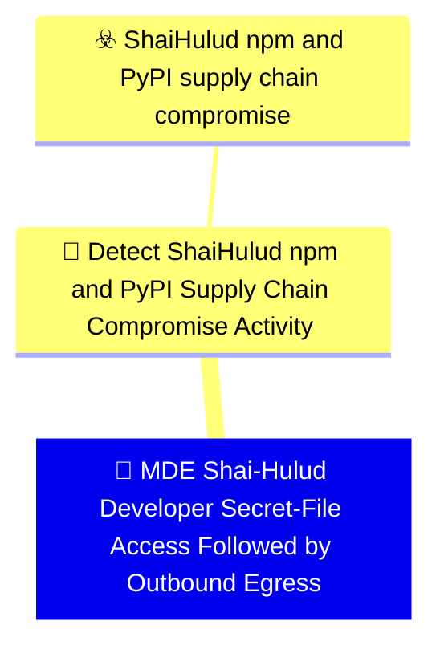

# 🚨 MDE Shai-Hulud Developer Secret-File Access Followed by Outbound Egress

🚦 **TLP:CLEAR** ⚪ : Recipients can spread this to the world, there is no limit on disclosure.

🗡️ **ATT&CK Techniques** :  [T1195.001 : Supply Chain Compromise: Compromise Software Dependencies and Development Tools](https://attack.mitre.org/techniques/T1195/001 'Adversaries may manipulate software dependencies and development tools prior to receipt by a final consumer for the purpose of data or system compromi'), [T1195.002 : Supply Chain Compromise: Compromise Software Supply Chain](https://attack.mitre.org/techniques/T1195/002 'Adversaries may manipulate application software prior to receipt by a final consumer for the purpose of data or system compromise Supply chain comprom'), [T1546.016 : Event Triggered Execution: Installer Packages](https://attack.mitre.org/techniques/T1546/016 'Adversaries may establish persistence and elevate privileges by using an installer to trigger the execution of malicious content Installer packages ar'), [T1059.007 : Command and Scripting Interpreter: JavaScript](https://attack.mitre.org/techniques/T1059/007 'Adversaries may abuse various implementations of JavaScript for execution JavaScript JS is a platform-independent scripting language compiled just-in-'), [T1059.006 : Command and Scripting Interpreter: Python](https://attack.mitre.org/techniques/T1059/006 'Adversaries may abuse Python commands and scripts for execution Python is a very popular scriptingprogramming language, with capabilities to perform m'), [T1552.001 : Unsecured Credentials: Credentials In Files](https://attack.mitre.org/techniques/T1552/001 'Adversaries may search local file systems and remote file shares for files containing insecurely stored credentials These can be files created by user'), [T1550.001 : Use Alternate Authentication Material: Application Access Token](https://attack.mitre.org/techniques/T1550/001 'Adversaries may use stolen application access tokens to bypass the typical authentication process and access restricted accounts, information, or serv'), [T1567.002 : Exfiltration Over Web Service: Exfiltration to Cloud Storage](https://attack.mitre.org/techniques/T1567/002 'Adversaries may exfiltrate data to a cloud storage service rather than over their primary command and control channel Cloud storage services allow for'), [T1071.001 : Application Layer Protocol: Web Protocols](https://attack.mitre.org/techniques/T1071/001 'Adversaries may communicate using application layer protocols associated with web traffic to avoid detectionnetwork filtering by blending in with exis'), [T1078 : Valid Accounts](https://attack.mitre.org/techniques/T1078 'Adversaries may obtain and abuse credentials of existing accounts as a means of gaining Initial Access, Persistence, Privilege Escalation, or Defense '), [T1027 : Obfuscated Files or Information](https://attack.mitre.org/techniques/T1027 'Adversaries may attempt to make an executable or file difficult to discover or analyze by encrypting, encoding, or otherwise obfuscating its contents '), [T1547 : Boot or Logon Autostart Execution](https://attack.mitre.org/techniques/T1547 'Adversaries may configure system settings to automatically execute a program during system boot or logon to maintain persistence or gain higher-level '), [T1485 : Data Destruction](https://attack.mitre.org/techniques/T1485 'Adversaries may destroy data and files on specific systems or in large numbers on a network to interrupt availability to systems, services, and networ')

---

`🔑 UUID : ecd096d2-7fc5-45e3-803f-82d13f940210` **|** `🏷️ Version : 1` **|** `🗓️ Creation Date : 2026-06-16` **|** `🗓️ Last Modification : 2026-06-16` **|** `Sharing Organisation : {'uuid': '56b0a0f0-b0bc-47d9-bb46-02f80ae2065a', 'name': 'EC DIGIT CSOC'}` **|** `🧱 Schema Identifier : mdr::2.1`

## 👁️‍🗨️ Description

> #### MDR Technical Details
> Microsoft Defender for Endpoint custom detection implementing DOM signal
> `365e23e8-0367-4adf-b18a-f1440cc66005` (Developer Secret-File Access
> Followed by Outbound Network Egress). Joins `DeviceFileEvents` secret-path
> reads with `DeviceNetworkEvents` outbound connections to Shai-Hulud IOC
> destinations within a five-minute correlation window.
> 
> #### Detection Criteria
> - File access on ≥ 2 distinct secret-marker paths (`.npmrc`, `.env`,
>   `.ssh`, cloud credential stores, Vault tokens, etc.).
> - Outbound connection within 5 minutes to `git-tanstack.com`,
>   `*.getsession.org`, or `83.142.209.194`.
> - Same initiating process ID on the device.
> - Frequency: 1 hour; severity High.
> 
> #### Exclusion Criteria
> - Legitimate `gh auth login` and cloud SDK tooling may access secret paths —
>   require IOC destination match (not secret access alone).
> - CI secret-injection agents should be excluded per deployment via
>   `InitiatingProcessFileName` allowlists.
> 

### 🕸️ Relations





| 🎯 Detection Objectives                                                                                                                                                                                                                                                                                                                          | ☣️ Threat Vectors                                                                                                                                                                                                                                                                                      | 🛡️ Detection Models    | 📡 Detection Objective Signals    |
|:------------------------------------------------------------------------------------------------------------------------------------------------------------------------------------------------------------------------------------------------------------------------------------------------------------------------------------------------|:-------------------------------------------------------------------------------------------------------------------------------------------------------------------------------------------------------------------------------------------------------------------------------------------------------|:-----------------------|:---------------------------------|
| [Detect Shai-Hulud npm and PyPI Supply Chain Compromise Activity](../Detection%20Objectives/🎯%20Detect%20Shai-Hulud%20npm%20and%20PyPI%20Supply%20Chain%20Compromise%20Activity.md 'This Detection Objective addresses the May 2026 Shai-Hulud  miniShai-Hulud supply-chain campaign affecting npm and PyPI packagesincluding the tanstack...') | [Shai-Hulud npm and PyPI supply chain compromise](../Threat%20Vectors/☣️%20Shai-Hulud%20npm%20and%20PyPI%20supply%20chain%20compromise.md '## Executive SummaryOn 11 May 2026, a coordinated supply-chain campaign publicly trackedas Shai-Hulud  mini Shai-Hulud compromised packages across the...') | ❌ No Detection Models  | ❌ No Detection Objective Signals |

&nbsp;

## ⚠️ Response

| 🌡️ Alert Severity                                                                     | ‍🚒 Alert Handling Team   | 👣 Playbook link                                 |
|:--------------------------------------------------------------------------------------|:-------------------------|:------------------------------------------------|
| **High** : Needs attention within tight SLAs alongside a comprehensive investigation. | **CSIRC** :              | No playbook was defined for this detection rule |

### 📋 Procedure

#### 🕵🏼‍♂️ Analysis

> 1. Review secret paths accessed and the egress destination.
> 2. Trace the initiating process tree back to package-manager activity.
> 3. Check for worm propagation (GitHub repo creation, npm publish).
> 4. Rotate credentials for all accessed secret stores.
> 

#### 🔎 Supporting Searches

<table>
<tr><th>Purpose</th>
<th>Target System</th>
<th>Query</th>
</tr><tr>

<td>Reconstruct process tree around the alert timestamp
</td>
<td>Microsoft Defender for Endpoint</td>

<td>

```sql
DeviceProcessEvents
| where DeviceId == "{{DeviceId}}"
| where Timestamp between (datetime("{{Timestamp}}") - 30m .. datetime("{{Timestamp}}") + 30m)
| project Timestamp, FileName, ProcessCommandLine, InitiatingProcessFileName
| order by Timestamp asc
```
</td>
</tr>

</table>

#### 🔐 Containment
> Isolate the host and block egress to campaign IOC domains. Rotate all
> credentials reachable from accessed secret paths before rejoining the network.
> 

&nbsp;

## 💽 Configurations


<details>
<summary>Microsoft Defender for Endpoint <b>DEVELOPMENT</b></summary>

>**Status** : `DEVELOPMENT` - _Under active technical implementation, going in exploratory rounds_
>**Strategy** : `PREVIEW` - _Deployment from Pull/Merge Requests_

| Parameter                     | System Config                                   | Description                                                                                                                                                                                                                                                                                                                                                                                                                                                                                                                                                                                                                                                                                         | Config                                                                                                                                                     |
|:------------------------------|:------------------------------------------------|:----------------------------------------------------------------------------------------------------------------------------------------------------------------------------------------------------------------------------------------------------------------------------------------------------------------------------------------------------------------------------------------------------------------------------------------------------------------------------------------------------------------------------------------------------------------------------------------------------------------------------------------------------------------------------------------------------|:-----------------------------------------------------------------------------------------------------------------------------------------------------------|
| Schema identifier and version |                                                 | Identifier of the schema at its current version                                                                                                                                                                                                                                                                                                                                                                                                                                                                                                                                                                                                                                                     | `defender_for_endpoint::2.1`                                                                                                                               |
| ⏲ Rule Schedule               | `schedule`                                      | Select the frequency by which the query will run and trigger alerts. If you set it to run less frequently, it will have a longer lookback duration.  Queries that run every 24 hours check the past 30 days. Queries that run every 12 hours check the past 48 hours. Queries that run every 3 hours check the past 12 hours. Queries that run every hour check the past 4 hours. Queries that run continuously check events as they are ingested into Microsoft Defender XDR.  NRT is supported for specific tables and columns. Please see the documentation for more details. https://learn.microsoft.com/en-us/defender-xdr/custom-detection-rules?view=o365-worldwide#continuous-nrt-frequency | `1H`                                                                                                                                                       |
| 🎫 Alert Title                 | `detectionAction.alertTemplate.title`           | Name of the alert triggered by the custom detection rule. By default, the name of the MDR will be used, but this parameter allows to override it.                                                                                                                                                                                                                                                                                                                                                                                                                                                                                                                                                   | `Shai-Hulud secret access and egress on {{DeviceName}}`                                                                                                    |
| Threat Category               | `detectionAction.alertTemplate.category`        | Threat Category assigned to the alert triggered by the detection rule.                                                                                                                                                                                                                                                                                                                                                                                                                                                                                                                                                                                                                              | `Credential Access`                                                                                                                                        |
| ATT&CK Techniques             |                                                 | Relevant techniques to map this rule onto. The available techniques are category-dependent, at the moment we do not provide a structured support to validate those techniques. You may refer to the GUI - create a mock detection rule, input the desired category, and see which techniques are presented. You may then input the relevant Technique IDs.                                                                                                                                                                                                                                                                                                                                          | `T1552.001`, `T1071.001`, `T1567.002`                                                                                                                      |
| Alert Response Recommendation | `detectionAction.alertTemplate.recommendation`  | Recommended actions to respond to the threat related to the alert triggered by the custom detection rule.                                                                                                                                                                                                                                                                                                                                                                                                                                                                                                                                                                                           | `A process read developer secret files and connected to a Shai-Hulud exfiltration destination within five minutes. Treat as confirmed stealer behaviour. ` |
| Device                        |                                                 | Represents a device that was identified in an alert triggered by a custom detection rule. Make sure that the column exists in the results of the query search.                                                                                                                                                                                                                                                                                                                                                                                                                                                                                                                                      | `DeviceName`                                                                                                                                               |
| Device Group Selection        | `detectionAction.organizationalScope.scopeType` | Select to which device group this response action will be applied to. If set to All - will apply to all endpoints, if set to Specific will require to select the relevant device groups                                                                                                                                                                                                                                                                                                                                                                                                                                                                                                             | `All`                                                                                                                                                      |

</details>
&nbsp; 


### 🔎 Queries


<details>
<summary>Expand to view Microsoft Defender for Endpoint <b>DEVELOPMENT</b> query</summary>

```sql
// Detection: Shai-Hulud secret-file access followed by outbound egress
// DOM signal: 365e23e8-0367-4adf-b18a-f1440cc66005
// MITRE ATT&CK: T1552.001, T1071.001
// Platform: DEFENDER
let SecretMarkers = dynamic([
    ".npmrc", ".env", ".git-credentials", "id_rsa", "id_ed25519",
    ".aws", "credentials", "serviceaccount", ".vault-token", ".docker"
]);
let IocDomains = dynamic([
    "git-tanstack.com", "getsession.org", "filev2.getsession.org",
    "seed1.getsession.org", "seed2.getsession.org", "seed3.getsession.org"
]);
let CorrelationWindow = 5m;
let SecretReads =
DeviceFileEvents
| where ActionType in ("FileCreated", "FileModified") or ActionType has "Read"
| where FolderPath has_any (SecretMarkers) or FileName has_any (SecretMarkers)
| summarize SecretReadTime = min(Timestamp),
    SecretPathCount = dcount(strcat(FolderPath, FileName)),
    SecretPaths = make_set(strcat(FolderPath, "\\", FileName), 10)
    by DeviceId, InitiatingProcessId, InitiatingProcessFileName;
let SecretEgress =
DeviceNetworkEvents
| where ActionType == "ConnectionSuccess"
| where RemoteUrl has_any (IocDomains) or RemoteIP == "83.142.209.194"
| project EgressTime = Timestamp, DeviceId, ReportId, DeviceName,
    InitiatingProcessId, InitiatingProcessFileName,
    RemoteUrl, RemoteIP, RemotePort, SentBytes;
SecretReads
| where SecretPathCount >= 2
| join kind=inner SecretEgress on DeviceId, InitiatingProcessId
| where EgressTime between (SecretReadTime .. (SecretReadTime + CorrelationWindow))
| project Timestamp = EgressTime, DeviceId, ReportId, DeviceName,
    AccountName = "", AccountSid = "",
    InitiatingProcessFileName, InitiatingProcessCommandLine = strcat_array(SecretPaths, ";"),
    FileName = RemoteUrl, ProcessCommandLine = strcat(RemoteIP, ":", tostring(RemotePort)),
    SentBytes, SecretPathCount
```

</details>
&nbsp; 


### 🔗 References


**🕊️ Publicly available resources**

- [_1_] https://www.wiz.io/blog/mini-shai-hulud-strikes-again-tanstack-more-npm-packages-compromised
- [_2_] https://www.aikido.dev/blog/mini-shai-hulud-is-back-tanstack-compromised
- [_3_] https://tanstack.com/blog/npm-supply-chain-compromise-postmortem
- [_4_] https://www.stepsecurity.io/blog/mini-shai-hulud-is-back-a-self-spreading-supply-chain-attack-hits-the-npm-ecosystem

[1]: https://www.wiz.io/blog/mini-shai-hulud-strikes-again-tanstack-more-npm-packages-compromised
[2]: https://www.aikido.dev/blog/mini-shai-hulud-is-back-tanstack-compromised
[3]: https://tanstack.com/blog/npm-supply-chain-compromise-postmortem
[4]: https://www.stepsecurity.io/blog/mini-shai-hulud-is-back-a-self-spreading-supply-chain-attack-hits-the-npm-ecosystem

&nbsp;


