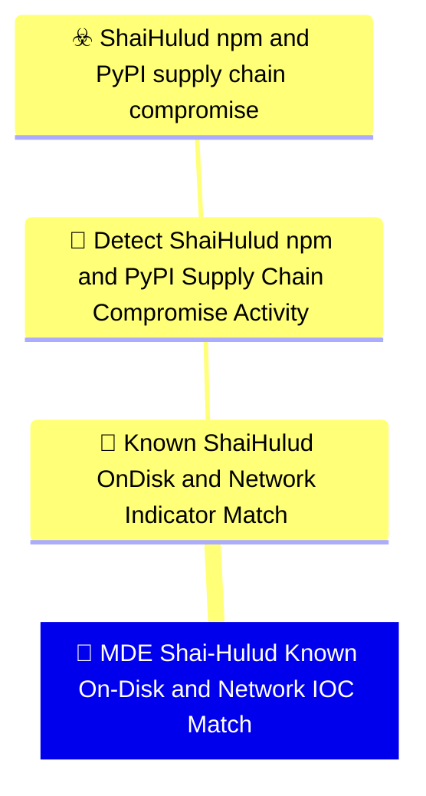

# 🚨 MDE Shai-Hulud Known On-Disk and Network IOC Match

🚦 **TLP:CLEAR** ⚪ : Recipients can spread this to the world, there is no limit on disclosure.


---

`🔑 UUID : 2fe6575d-513c-4588-999f-19c13d0fa4f9` **|** `🏷️ Version : 1` **|** `🗓️ Creation Date : 2026-06-16` **|** `🗓️ Last Modification : 2026-06-22` **|** `Sharing Organisation : {'uuid': '56b0a0f0-b0bc-47d9-bb46-02f80ae2065a', 'name': 'EC DIGIT CSOC'}` **|** `🧱 Schema Identifier : mdr::2.1`

## 👁️‍🗨️ Description

> #### MDR Technical Details
> Microsoft Defender for Endpoint custom detection implementing DOM signal
> `678d0786-dfd7-40fb-ba90-3c368ed00342` (Known Shai-Hulud On-Disk and
> Network Indicator Match). High-specificity artefact matching across
> `DeviceFileEvents` (campaign filenames, SHA-256 hashes, persistence
> artefacts) and `DeviceNetworkEvents` (IOC domains and exfil IP from
> package-runtime process trees).
> 
> #### Detection Criteria
> - File create/modify of `router_init.js`, `setup.mjs`, `gh-token-monitor`,
>   or published sample SHA-256 hashes.
> - OR network connection to `git-tanstack.com`, `*.getsession.org`, or
>   `83.142.209.194` from package-manager process trees.
> - Frequency: 1 hour; severity Critical.
> 
> #### Exclusion Criteria
> - None for hash and filename matches — treat as strong execution evidence.
> - Network-only matches from non-package processes should be reviewed in
>   context of full device activity.
> 

### 🕸️ Relations





| 📡 Detection Objective Signals                                                                                                                                                                                                                                                                                                                                                                                                | 🎯 Detection Objectives                                                                                                                                                                                                                                                                                                                          | ☣️ Threat Vectors                                                                                                                                                                                                                                                                                      | 🛡️ Detection Models    |
|:-----------------------------------------------------------------------------------------------------------------------------------------------------------------------------------------------------------------------------------------------------------------------------------------------------------------------------------------------------------------------------------------------------------------------------|:------------------------------------------------------------------------------------------------------------------------------------------------------------------------------------------------------------------------------------------------------------------------------------------------------------------------------------------------|:-------------------------------------------------------------------------------------------------------------------------------------------------------------------------------------------------------------------------------------------------------------------------------------------------------|:-----------------------|
| [Detect Shai-Hulud npm and PyPI Supply Chain Compromise Activity::Known Shai-Hulud On-Disk and Network Indicator Match](Detect%20Shai-Hulud%20npm%20and%20PyPI%20Supply%20Chain%20Compromise%20Activity#known-shai-hulud-on-disk-and-network-indicator-match.md 'High-specificity artefact and IOC matching for publicly reportedShai-Hulud indicators  suitable for retrospective sweeps andlive IOC gatesDetection cr...') | [Detect Shai-Hulud npm and PyPI Supply Chain Compromise Activity](../Detection%20Objectives/🎯%20Detect%20Shai-Hulud%20npm%20and%20PyPI%20Supply%20Chain%20Compromise%20Activity.md 'This Detection Objective addresses the May 2026 Shai-Hulud  miniShai-Hulud supply-chain campaign affecting npm and PyPI packagesincluding the tanstack...') | [Shai-Hulud npm and PyPI supply chain compromise](../Threat%20Vectors/☣️%20Shai-Hulud%20npm%20and%20PyPI%20supply%20chain%20compromise.md '## Executive SummaryOn 11 May 2026, a coordinated supply-chain campaign publicly trackedas Shai-Hulud  mini Shai-Hulud compromised packages across the...') | ❌ No Detection Models  |

&nbsp;

## ⚠️ Response

| 🌡️ Alert Severity                                                                     | ‍🚒 Alert Handling Team                                     | 👣 Playbook link                                 |
|:--------------------------------------------------------------------------------------|:-----------------------------------------------------------|:------------------------------------------------|
| **High** : Needs attention within tight SLAs alongside a comprehensive investigation. | **No defined responders for alerts generated by this MDR** | No playbook was defined for this detection rule |

### 📋 Procedure

#### 🕵🏼‍♂️ Analysis

> 1. Treat any on-disk IOC match as confirmed execution, not mere dependency
>    declaration.
> 2. Search for `gh-token-monitor` persistence before revoking GitHub tokens.
> 3. Sweep lockfiles for compromised package versions.
> 4. Rotate all reachable credentials.
> 

#### 🔎 Supporting Searches

<table>
<tr><th>Purpose</th>
<th>Target System</th>
<th>Query</th>
</tr><tr>

<td>Hunt persistence artefacts on the alerted device
</td>
<td>Microsoft Defender for Endpoint</td>

<td>

```sql
DeviceFileEvents
| where DeviceId == "{{DeviceId}}"
| where FileName has_any ("gh-token-monitor", "com.user.gh-token-monitor")
| project Timestamp, FolderPath, FileName, SHA256
```
</td>
</tr>

</table>

#### 🔐 Containment
> Isolate the endpoint immediately. Remove persistence, malicious packages,
> and IDE-resident copies under `.claude/` and `.vscode/` before token
> revocation.
> 

&nbsp;

## 💽 Configurations


<details>
<summary>Microsoft Defender for Endpoint <b>DEVELOPMENT</b></summary>

>**Status** : `DEVELOPMENT` - _Under active technical implementation, going in exploratory rounds_
>**Strategy** : `PREVIEW` - _Deployment from Pull/Merge Requests_

| Parameter                     | System Config                                   | Description                                                                                                                                                                                                                                                                                                                                                                                                                                                                                                                                                                                                                                                                                         | Config                                                                                                                          |
|:------------------------------|:------------------------------------------------|:----------------------------------------------------------------------------------------------------------------------------------------------------------------------------------------------------------------------------------------------------------------------------------------------------------------------------------------------------------------------------------------------------------------------------------------------------------------------------------------------------------------------------------------------------------------------------------------------------------------------------------------------------------------------------------------------------|:--------------------------------------------------------------------------------------------------------------------------------|
| Schema identifier and version |                                                 | Identifier of the schema at its current version                                                                                                                                                                                                                                                                                                                                                                                                                                                                                                                                                                                                                                                     | `defender_for_endpoint::2.1`                                                                                                    |
| ⏲ Rule Schedule               | `schedule`                                      | Select the frequency by which the query will run and trigger alerts. If you set it to run less frequently, it will have a longer lookback duration.  Queries that run every 24 hours check the past 30 days. Queries that run every 12 hours check the past 48 hours. Queries that run every 3 hours check the past 12 hours. Queries that run every hour check the past 4 hours. Queries that run continuously check events as they are ingested into Microsoft Defender XDR.  NRT is supported for specific tables and columns. Please see the documentation for more details. https://learn.microsoft.com/en-us/defender-xdr/custom-detection-rules?view=o365-worldwide#continuous-nrt-frequency | `1H`                                                                                                                            |
| 🎫 Alert Title                 | `detectionAction.alertTemplate.title`           | Name of the alert triggered by the custom detection rule. By default, the name of the MDR will be used, but this parameter allows to override it.                                                                                                                                                                                                                                                                                                                                                                                                                                                                                                                                                   | `Shai-Hulud IOC match on {{DeviceName}} — {{DetectionType}}`                                                                    |
| Threat Category               | `detectionAction.alertTemplate.category`        | Threat Category assigned to the alert triggered by the detection rule.                                                                                                                                                                                                                                                                                                                                                                                                                                                                                                                                                                                                                              | `Malware`                                                                                                                       |
| ATT&CK Techniques             |                                                 | Relevant techniques to map this rule onto. The available techniques are category-dependent, at the moment we do not provide a structured support to validate those techniques. You may refer to the GUI - create a mock detection rule, input the desired category, and see which techniques are presented. You may then input the relevant Technique IDs.                                                                                                                                                                                                                                                                                                                                          | `T1195.002`, `T1547`, `T1071.001`                                                                                               |
| Alert Response Recommendation | `detectionAction.alertTemplate.recommendation`  | Recommended actions to respond to the threat related to the alert triggered by the custom detection rule.                                                                                                                                                                                                                                                                                                                                                                                                                                                                                                                                                                                           | `Known Shai-Hulud file or network indicator detected. Assume the host is compromised and begin incident response immediately. ` |
| Device                        |                                                 | Represents a device that was identified in an alert triggered by a custom detection rule. Make sure that the column exists in the results of the query search.                                                                                                                                                                                                                                                                                                                                                                                                                                                                                                                                      | `DeviceName`                                                                                                                    |
| Device Group Selection        | `detectionAction.organizationalScope.scopeType` | Select to which device group this response action will be applied to. If set to All - will apply to all endpoints, if set to Specific will require to select the relevant device groups                                                                                                                                                                                                                                                                                                                                                                                                                                                                                                             | `All`                                                                                                                           |

</details>
&nbsp; 


### 🔎 Queries


<details>
<summary>Expand to view Microsoft Defender for Endpoint <b>DEVELOPMENT</b> query</summary>

```sql
// Detection: Shai-Hulud known on-disk and network IOC match
// DOM signal: 678d0786-dfd7-40fb-ba90-3c368ed00342
// MITRE ATT&CK: T1195.002, T1547
// Platform: DEFENDER
let PackageManagers = dynamic([
    "node", "node.exe", "npm", "npm.cmd", "pnpm", "pnpm.cmd",
    "yarn", "yarn.cmd", "npx", "corepack", "pip", "pip3",
    "python", "python3", "bun", "bun.exe"
]);
let IocDomains = dynamic([
    "git-tanstack.com", "getsession.org", "filev2.getsession.org",
    "seed1.getsession.org", "seed2.getsession.org", "seed3.getsession.org"
]);
let IocFiles = dynamic([
    "router_init.js", "setup.mjs", "router_runtime.js",
    "tanstack_runner.js", "gh-token-monitor",
    "com.user.gh-token-monitor.plist", "gh-token-monitor.service",
    "transformers.pyz"
]);
let IocHashes = dynamic([
    "ab4fcadaec49c03278063dd269ea5eef82d24f2124a8e15d7b90f2fa8601266c",
    "2ec78d556d696e208927cc503d48e4b5eb56b31abc2870c2ed2e98d6be27fc96",
    "2258284d65f63829bd67eaba01ef6f1ada2f593f9bbe41678b2df360bd90d3df"
]);
let FileMatch =
DeviceFileEvents
| where FileName in~ (IocFiles) or SHA256 in (IocHashes)
| project Timestamp, DeviceId, ReportId, DeviceName,
    AccountName = InitiatingProcessAccountName, AccountSid = "",
    InitiatingProcessFileName, InitiatingProcessCommandLine = FolderPath,
    FileName, ProcessCommandLine = SHA256,
    DetectionType = "file_ioc";
let NetworkMatch =
DeviceNetworkEvents
| where ActionType == "ConnectionSuccess"
| where RemoteUrl has_any (IocDomains) or RemoteIP == "83.142.209.194"
| where InitiatingProcessFileName in~ (PackageManagers)
    or InitiatingProcessCommandLine has_any (IocFiles)
| project Timestamp, DeviceId, ReportId, DeviceName,
    AccountName = InitiatingProcessAccountName, AccountSid = "",
    InitiatingProcessFileName, InitiatingProcessCommandLine,
    FileName = RemoteUrl, ProcessCommandLine = RemoteIP,
    DetectionType = "network_ioc";
union FileMatch, NetworkMatch
```

</details>
&nbsp; 


### 🔗 References


**🕊️ Publicly available resources**

- [_1_] https://www.wiz.io/blog/mini-shai-hulud-strikes-again-tanstack-more-npm-packages-compromised
- [_2_] https://www.aikido.dev/blog/mini-shai-hulud-is-back-tanstack-compromised
- [_3_] https://tanstack.com/blog/npm-supply-chain-compromise-postmortem
- [_4_] https://www.stepsecurity.io/blog/mini-shai-hulud-is-back-a-self-spreading-supply-chain-attack-hits-the-npm-ecosystem

[1]: https://www.wiz.io/blog/mini-shai-hulud-strikes-again-tanstack-more-npm-packages-compromised
[2]: https://www.aikido.dev/blog/mini-shai-hulud-is-back-tanstack-compromised
[3]: https://tanstack.com/blog/npm-supply-chain-compromise-postmortem
[4]: https://www.stepsecurity.io/blog/mini-shai-hulud-is-back-a-self-spreading-supply-chain-attack-hits-the-npm-ecosystem

&nbsp;


