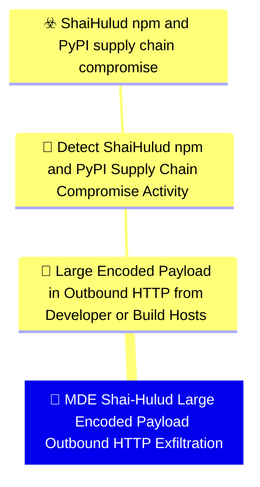

# 🚨 MDE Shai-Hulud Large Encoded Payload Outbound HTTP Exfiltration

🚦 **TLP:CLEAR** ⚪ : Recipients can spread this to the world, there is no limit on disclosure.


---

`🔑 UUID : 0924c742-8fdb-4ee2-95fe-91d2e5725a90` **|** `🏷️ Version : 1` **|** `🗓️ Creation Date : 2026-06-16` **|** `🗓️ Last Modification : 2026-06-22` **|** `Sharing Organisation : {'uuid': '56b0a0f0-b0bc-47d9-bb46-02f80ae2065a', 'name': 'EC DIGIT CSOC'}` **|** `🧱 Schema Identifier : mdr::2.1`

## 👁️‍🗨️ Description

> #### MDR Technical Details
> Microsoft Defender for Endpoint custom detection implementing DOM signal
> `21a527de-8635-4187-87d4-c9e5f5c1badc` (Large Encoded Payload in Outbound
> HTTP from Developer or Build Hosts). Flags high-volume outbound connections
> from package-runtime processes to Shai-Hulud exfiltration destinations in
> `DeviceNetworkEvents`, using `SentBytes` as a proxy for encoded credential
> blob uploads where HTTP body inspection is unavailable.
> 
> #### Detection Criteria
> - `SentBytes >= 50000` to IOC destinations (`git-tanstack.com`,
>   `filev2.getsession.org`, `api.github.com`, or `83.142.209.194`).
> - Initiating process is node, python, bun, curl, or npm family.
> - Frequency: 1 hour; severity Medium.
> 
> #### Exclusion Criteria
> - Legitimate artefact uploads to internal registries — exclude corporate
>   registry hostnames per deployment.
> - Crash-dump and telemetry uploads — require IOC destination match.
> 

### 🕸️ Relations





| 📡 Detection Objective Signals                                                                                                                                                                                                                                                                                                                                                                                                                                | 🎯 Detection Objectives                                                                                                                                                                                                                                                                                                                          | ☣️ Threat Vectors                                                                                                                                                                                                                                                                                      | 🛡️ Detection Models    |
|:-------------------------------------------------------------------------------------------------------------------------------------------------------------------------------------------------------------------------------------------------------------------------------------------------------------------------------------------------------------------------------------------------------------------------------------------------------------|:------------------------------------------------------------------------------------------------------------------------------------------------------------------------------------------------------------------------------------------------------------------------------------------------------------------------------------------------|:-------------------------------------------------------------------------------------------------------------------------------------------------------------------------------------------------------------------------------------------------------------------------------------------------------|:-----------------------|
| [Detect Shai-Hulud npm and PyPI Supply Chain Compromise Activity::Large Encoded Payload in Outbound HTTP from Developer or Build Hosts](Detect%20Shai-Hulud%20npm%20and%20PyPI%20Supply%20Chain%20Compromise%20Activity#large-encoded-payload-in-outbound-http-from-developer-or-build-hosts.md 'Pattern-matching detection for sizeable Base64 or otherwiseencoded HTTP request bodies leaving developer laptops or CIrunners shortly after package-ma...') | [Detect Shai-Hulud npm and PyPI Supply Chain Compromise Activity](../Detection%20Objectives/🎯%20Detect%20Shai-Hulud%20npm%20and%20PyPI%20Supply%20Chain%20Compromise%20Activity.md 'This Detection Objective addresses the May 2026 Shai-Hulud  miniShai-Hulud supply-chain campaign affecting npm and PyPI packagesincluding the tanstack...') | [Shai-Hulud npm and PyPI supply chain compromise](../Threat%20Vectors/☣️%20Shai-Hulud%20npm%20and%20PyPI%20supply%20chain%20compromise.md '## Executive SummaryOn 11 May 2026, a coordinated supply-chain campaign publicly trackedas Shai-Hulud  mini Shai-Hulud compromised packages across the...') | ❌ No Detection Models  |

&nbsp;

## ⚠️ Response

| 🌡️ Alert Severity                                                                | ‍🚒 Alert Handling Team                                     | 👣 Playbook link                                 |
|:---------------------------------------------------------------------------------|:-----------------------------------------------------------|:------------------------------------------------|
| **Medium** : Moderate SLAs required, can be grouped into a larger investigation. | **No defined responders for alerts generated by this MDR** | No playbook was defined for this detection rule |

### 📋 Procedure

#### 🕵🏼‍♂️ Analysis

> 1. Review bytes sent and destination host.
> 2. Correlate with recent package install activity on the device.
> 3. Check for preceding bulk secret-file access signals.
> 4. Inspect proxy logs if available for request body encoding patterns.
> 


#### 🔐 Containment
> Block egress to campaign IOC domains and rotate credentials if
> exfiltration coincides with secret-file access.
> 

&nbsp;

## 💽 Configurations


<details>
<summary>Microsoft Defender for Endpoint <b>DEVELOPMENT</b></summary>

>**Status** : `DEVELOPMENT` - _Under active technical implementation, going in exploratory rounds_
>**Strategy** : `PREVIEW` - _Deployment from Pull/Merge Requests_

| Parameter                     | System Config                                   | Description                                                                                                                                                                                                                                                                                                                                                                                                                                                                                                                                                                                                                                                                                         | Config                                                                                                                                |
|:------------------------------|:------------------------------------------------|:----------------------------------------------------------------------------------------------------------------------------------------------------------------------------------------------------------------------------------------------------------------------------------------------------------------------------------------------------------------------------------------------------------------------------------------------------------------------------------------------------------------------------------------------------------------------------------------------------------------------------------------------------------------------------------------------------|:--------------------------------------------------------------------------------------------------------------------------------------|
| Schema identifier and version |                                                 | Identifier of the schema at its current version                                                                                                                                                                                                                                                                                                                                                                                                                                                                                                                                                                                                                                                     | `defender_for_endpoint::2.1`                                                                                                          |
| ⏲ Rule Schedule               | `schedule`                                      | Select the frequency by which the query will run and trigger alerts. If you set it to run less frequently, it will have a longer lookback duration.  Queries that run every 24 hours check the past 30 days. Queries that run every 12 hours check the past 48 hours. Queries that run every 3 hours check the past 12 hours. Queries that run every hour check the past 4 hours. Queries that run continuously check events as they are ingested into Microsoft Defender XDR.  NRT is supported for specific tables and columns. Please see the documentation for more details. https://learn.microsoft.com/en-us/defender-xdr/custom-detection-rules?view=o365-worldwide#continuous-nrt-frequency | `1H`                                                                                                                                  |
| 🎫 Alert Title                 | `detectionAction.alertTemplate.title`           | Name of the alert triggered by the custom detection rule. By default, the name of the MDR will be used, but this parameter allows to override it.                                                                                                                                                                                                                                                                                                                                                                                                                                                                                                                                                   | `Shai-Hulud large outbound transfer to {{FileName}} from {{DeviceName}}`                                                              |
| Threat Category               | `detectionAction.alertTemplate.category`        | Threat Category assigned to the alert triggered by the detection rule.                                                                                                                                                                                                                                                                                                                                                                                                                                                                                                                                                                                                                              | `Exfiltration`                                                                                                                        |
| ATT&CK Techniques             |                                                 | Relevant techniques to map this rule onto. The available techniques are category-dependent, at the moment we do not provide a structured support to validate those techniques. You may refer to the GUI - create a mock detection rule, input the desired category, and see which techniques are presented. You may then input the relevant Technique IDs.                                                                                                                                                                                                                                                                                                                                          | `T1567.002`, `T1071.001`, `T1027`                                                                                                     |
| Alert Response Recommendation | `detectionAction.alertTemplate.recommendation`  | Recommended actions to respond to the threat related to the alert triggered by the custom detection rule.                                                                                                                                                                                                                                                                                                                                                                                                                                                                                                                                                                                           | `A package-runtime process sent a large payload to a Shai-Hulud exfiltration destination. Correlate with secret harvesting signals. ` |
| Device                        |                                                 | Represents a device that was identified in an alert triggered by a custom detection rule. Make sure that the column exists in the results of the query search.                                                                                                                                                                                                                                                                                                                                                                                                                                                                                                                                      | `DeviceName`                                                                                                                          |
| Device Group Selection        | `detectionAction.organizationalScope.scopeType` | Select to which device group this response action will be applied to. If set to All - will apply to all endpoints, if set to Specific will require to select the relevant device groups                                                                                                                                                                                                                                                                                                                                                                                                                                                                                                             | `All`                                                                                                                                 |

</details>
&nbsp; 


### 🔎 Queries


<details>
<summary>Expand to view Microsoft Defender for Endpoint <b>DEVELOPMENT</b> query</summary>

```sql
// Detection: Shai-Hulud large encoded outbound HTTP exfiltration
// DOM signal: 21a527de-8635-4187-87d4-c9e5f5c1badc
// MITRE ATT&CK: T1567.002, T1071.001
// Platform: DEFENDER
let IocDomains = dynamic([
    "git-tanstack.com", "filev2.getsession.org", "api.github.com"
]);
let ExfilIp = "83.142.209.194";
let MinSentBytes = 50000;
let PackageRuntimes = dynamic([
    "node", "node.exe", "npm", "npm.cmd", "pnpm", "python", "python3",
    "bun", "bun.exe", "curl", "curl.exe"
]);
DeviceNetworkEvents
| where ActionType == "ConnectionSuccess"
| where RemoteUrl has_any (IocDomains) or RemoteIP == ExfilIp
| where SentBytes >= MinSentBytes
| where InitiatingProcessFileName in~ (PackageRuntimes)
| project Timestamp, DeviceId, ReportId, DeviceName,
    AccountName = InitiatingProcessAccountName, AccountSid = "",
    InitiatingProcessFileName, InitiatingProcessCommandLine,
    FileName = RemoteUrl, ProcessCommandLine = RemoteIP,
    SentBytes, RemotePort
```

</details>
&nbsp; 


### 🔗 References


**🕊️ Publicly available resources**

- [_1_] https://www.wiz.io/blog/mini-shai-hulud-strikes-again-tanstack-more-npm-packages-compromised
- [_2_] https://www.aikido.dev/blog/mini-shai-hulud-is-back-tanstack-compromised
- [_3_] https://tanstack.com/blog/npm-supply-chain-compromise-postmortem
- [_4_] https://www.stepsecurity.io/blog/mini-shai-hulud-is-back-a-self-spreading-supply-chain-attack-hits-the-npm-ecosystem

[1]: https://www.wiz.io/blog/mini-shai-hulud-strikes-again-tanstack-more-npm-packages-compromised
[2]: https://www.aikido.dev/blog/mini-shai-hulud-is-back-tanstack-compromised
[3]: https://tanstack.com/blog/npm-supply-chain-compromise-postmortem
[4]: https://www.stepsecurity.io/blog/mini-shai-hulud-is-back-a-self-spreading-supply-chain-attack-hits-the-npm-ecosystem

&nbsp;


