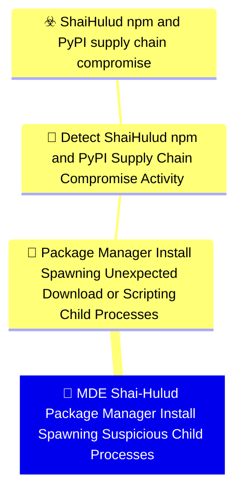

# 🚨 MDE Shai-Hulud Package Manager Install Spawning Suspicious Child Processes

🚦 **TLP:CLEAR** ⚪ : Recipients can spread this to the world, there is no limit on disclosure.


---

`🔑 UUID : bfae62bb-7ce1-46cd-a131-39803832fa9d` **|** `🏷️ Version : 1` **|** `🗓️ Creation Date : 2026-06-16` **|** `🗓️ Last Modification : 2026-06-22` **|** `Sharing Organisation : {'uuid': '56b0a0f0-b0bc-47d9-bb46-02f80ae2065a', 'name': 'EC DIGIT CSOC'}` **|** `🧱 Schema Identifier : mdr::2.1`

## 👁️‍🗨️ Description

> #### MDR Technical Details
> Microsoft Defender for Endpoint custom detection implementing DOM signal
> `a3f7d796-146c-44b0-8d22-7a08daa0d963` (Package Manager Install Spawning
> Unexpected Download or Scripting Child Processes). Correlates
> `DeviceProcessEvents` for package-manager install trees spawning download
> utilities, shells, Bun, or hidden-window PowerShell, and `DeviceFileEvents`
> for campaign artefact drops (`router_init.js`, `setup.mjs`, etc.).
> 
> #### Detection Criteria
> - Parent is npm, pnpm, yarn, pip, python, or node with install/ci/add/update
>   in the command line.
> - Child within the engine lookback is curl, wget, bash, sh, zsh, bun,
>   powershell (hidden/bypass flags), or cscript/wscript.
> - OR file create of known Shai-Hulud hook files outside npm cache paths.
> - Frequency: 1 hour; severity High.
> 
> #### Exclusion Criteria
> - Native module builds (`node-gyp`, `esbuild`) excluded by initiating process.
> - Files under npm cache / temp paths excluded for artefact drops.
> - Legitimate postinstall (husky, esbuild fetch) may fire — correlate with
>   secret-file access or IOC signals before escalation.
> 

### 🕸️ Relations





| 📡 Detection Objective Signals                                                                                                                                                                                                                                                                                                                                                                                                                                                          | 🎯 Detection Objectives                                                                                                                                                                                                                                                                                                                          | ☣️ Threat Vectors                                                                                                                                                                                                                                                                                      | 🛡️ Detection Models    |
|:---------------------------------------------------------------------------------------------------------------------------------------------------------------------------------------------------------------------------------------------------------------------------------------------------------------------------------------------------------------------------------------------------------------------------------------------------------------------------------------|:------------------------------------------------------------------------------------------------------------------------------------------------------------------------------------------------------------------------------------------------------------------------------------------------------------------------------------------------|:-------------------------------------------------------------------------------------------------------------------------------------------------------------------------------------------------------------------------------------------------------------------------------------------------------|:-----------------------|
| [Detect Shai-Hulud npm and PyPI Supply Chain Compromise Activity::Package Manager Install Spawning Unexpected Download or Scripting Child Processes](Detect%20Shai-Hulud%20npm%20and%20PyPI%20Supply%20Chain%20Compromise%20Activity#package-manager-install-spawning-unexpected-download-or-scripting-child-processes.md 'Behavioural detection of npm, pnpm, yarn, pip, or Bun installprocesses spawning unexpected child processes consistent withShai-Hulud lifecycle-hook de...') | [Detect Shai-Hulud npm and PyPI Supply Chain Compromise Activity](../Detection%20Objectives/🎯%20Detect%20Shai-Hulud%20npm%20and%20PyPI%20Supply%20Chain%20Compromise%20Activity.md 'This Detection Objective addresses the May 2026 Shai-Hulud  miniShai-Hulud supply-chain campaign affecting npm and PyPI packagesincluding the tanstack...') | [Shai-Hulud npm and PyPI supply chain compromise](../Threat%20Vectors/☣️%20Shai-Hulud%20npm%20and%20PyPI%20supply%20chain%20compromise.md '## Executive SummaryOn 11 May 2026, a coordinated supply-chain campaign publicly trackedas Shai-Hulud  mini Shai-Hulud compromised packages across the...') | ❌ No Detection Models  |

&nbsp;

## ⚠️ Response

| 🌡️ Alert Severity                                                                     | ‍🚒 Alert Handling Team                                     | 👣 Playbook link                                 |
|:--------------------------------------------------------------------------------------|:-----------------------------------------------------------|:------------------------------------------------|
| **High** : Needs attention within tight SLAs alongside a comprehensive investigation. | **No defined responders for alerts generated by this MDR** | No playbook was defined for this detection rule |

### 📋 Procedure

#### 🕵🏼‍♂️ Analysis

> 1. Confirm package manager parent command line references install, ci,
>    add, or update.
> 2. Inspect child process command line for remote fetch or pipe-to-shell.
> 3. Search the device for `router_init.js`, `setup.mjs`, and lockfile
>    entries for `@tanstack/*` compromised versions.
> 4. Correlate with other Shai-Hulud DOM signals on the same host.
> 

#### 🔎 Supporting Searches

<table>
<tr><th>Purpose</th>
<th>Target System</th>
<th>Query</th>
</tr><tr>

<td>Hunt related file and network IOC activity on the device
</td>
<td>Microsoft Defender for Endpoint</td>

<td>

```sql
let IocFiles = dynamic(["router_init.js", "setup.mjs", "gh-token-monitor"]);
union (
    DeviceFileEvents
    | where DeviceId == "{{DeviceId}}"
    | where FileName in~ (IocFiles)
), (
    DeviceNetworkEvents
    | where DeviceId == "{{DeviceId}}"
    | where RemoteUrl has "git-tanstack"
)
```
</td>
</tr>

</table>

#### 🔐 Containment
> Isolate the endpoint if install-time child spawning coincides with IOC
> file creation. Remove malicious packages and persistence before token
> revocation.
> 

&nbsp;

## 💽 Configurations


<details>
<summary>Microsoft Defender for Endpoint <b>DEVELOPMENT</b></summary>

>**Status** : `DEVELOPMENT` - _Under active technical implementation, going in exploratory rounds_
>**Strategy** : `PREVIEW` - _Deployment from Pull/Merge Requests_

| Parameter                     | System Config                                   | Description                                                                                                                                                                                                                                                                                                                                                                                                                                                                                                                                                                                                                                                                                         | Config                                                                                                                                                                                                   |
|:------------------------------|:------------------------------------------------|:----------------------------------------------------------------------------------------------------------------------------------------------------------------------------------------------------------------------------------------------------------------------------------------------------------------------------------------------------------------------------------------------------------------------------------------------------------------------------------------------------------------------------------------------------------------------------------------------------------------------------------------------------------------------------------------------------|:---------------------------------------------------------------------------------------------------------------------------------------------------------------------------------------------------------|
| Schema identifier and version |                                                 | Identifier of the schema at its current version                                                                                                                                                                                                                                                                                                                                                                                                                                                                                                                                                                                                                                                     | `defender_for_endpoint::2.1`                                                                                                                                                                             |
| ⏲ Rule Schedule               | `schedule`                                      | Select the frequency by which the query will run and trigger alerts. If you set it to run less frequently, it will have a longer lookback duration.  Queries that run every 24 hours check the past 30 days. Queries that run every 12 hours check the past 48 hours. Queries that run every 3 hours check the past 12 hours. Queries that run every hour check the past 4 hours. Queries that run continuously check events as they are ingested into Microsoft Defender XDR.  NRT is supported for specific tables and columns. Please see the documentation for more details. https://learn.microsoft.com/en-us/defender-xdr/custom-detection-rules?view=o365-worldwide#continuous-nrt-frequency | `1H`                                                                                                                                                                                                     |
| 🎫 Alert Title                 | `detectionAction.alertTemplate.title`           | Name of the alert triggered by the custom detection rule. By default, the name of the MDR will be used, but this parameter allows to override it.                                                                                                                                                                                                                                                                                                                                                                                                                                                                                                                                                   | `Shai-Hulud install hook spawned {{FileName}} on {{DeviceName}}`                                                                                                                                         |
| Threat Category               | `detectionAction.alertTemplate.category`        | Threat Category assigned to the alert triggered by the detection rule.                                                                                                                                                                                                                                                                                                                                                                                                                                                                                                                                                                                                                              | `Execution`                                                                                                                                                                                              |
| ATT&CK Techniques             |                                                 | Relevant techniques to map this rule onto. The available techniques are category-dependent, at the moment we do not provide a structured support to validate those techniques. You may refer to the GUI - create a mock detection rule, input the desired category, and see which techniques are presented. You may then input the relevant Technique IDs.                                                                                                                                                                                                                                                                                                                                          | `T1195.002`, `T1546.016`, `T1059.007`, `T1059.006`                                                                                                                                                       |
| Alert Response Recommendation | `detectionAction.alertTemplate.recommendation`  | Recommended actions to respond to the threat related to the alert triggered by the custom detection rule.                                                                                                                                                                                                                                                                                                                                                                                                                                                                                                                                                                                           | `Package installation spawned an unexpected child process consistent with Shai-Hulud lifecycle hooks. Treat the host as potentially compromised and inspect for stealer activity and worm propagation. ` |
| Device                        |                                                 | Represents a device that was identified in an alert triggered by a custom detection rule. Make sure that the column exists in the results of the query search.                                                                                                                                                                                                                                                                                                                                                                                                                                                                                                                                      | `DeviceName`                                                                                                                                                                                             |
| Device Group Selection        | `detectionAction.organizationalScope.scopeType` | Select to which device group this response action will be applied to. If set to All - will apply to all endpoints, if set to Specific will require to select the relevant device groups                                                                                                                                                                                                                                                                                                                                                                                                                                                                                                             | `All`                                                                                                                                                                                                    |

</details>
&nbsp; 


### 🔎 Queries


<details>
<summary>Expand to view Microsoft Defender for Endpoint <b>DEVELOPMENT</b> query</summary>

```sql
// Detection: Shai-Hulud package manager install child process anomaly
// DOM signal: a3f7d796-146c-44b0-8d22-7a08daa0d963
// MITRE ATT&CK: T1195.002, T1546.016
// Platform: DEFENDER
let PackageManagers = dynamic([
    "node", "node.exe", "npm", "npm.cmd", "pnpm", "pnpm.cmd",
    "yarn", "yarn.cmd", "npx", "corepack", "pip", "pip3",
    "python", "python3", "python.exe"
]);
let SuspiciousChildren = dynamic([
    "curl", "curl.exe", "wget", "wget.exe", "bash", "sh", "zsh",
    "bun", "bun.exe", "cscript.exe", "wscript.exe"
]);
let InstallVerbs = dynamic(["install", " ci", "add ", "update"]);
let MaliciousArtifacts = dynamic([
    "router_init.js", "setup.mjs", "router_runtime.js", "tanstack_runner.js"
]);
let ChildFromInstall =
DeviceProcessEvents
| where InitiatingProcessFileName in~ (PackageManagers)
    or FileName in~ (PackageManagers)
| where InitiatingProcessCommandLine has_any (InstallVerbs)
    or ProcessCommandLine has_any (InstallVerbs)
| where FileName in~ (SuspiciousChildren)
    or (FileName =~ "powershell.exe"
        and ProcessCommandLine has_any (
            "-w hidden", "-windowstyle hidden", "-ep bypass",
            "-executionpolicy bypass", "-EncodedCommand"))
| where not(InitiatingProcessFileName in~ ("node-gyp", "esbuild"))
| project Timestamp, DeviceId, ReportId, DeviceName, AccountName, AccountSid,
    InitiatingProcessFileName, InitiatingProcessCommandLine,
    FileName, ProcessCommandLine, DetectionPath = "child_process";
let ArtifactDrop =
DeviceFileEvents
| where ActionType == "FileCreated"
| where FileName in~ (MaliciousArtifacts)
| where not(FolderPath has_any ("\\npm\\cache\\", "/.npm/", "/tmp/npm-", "\\AppData\\Local\\npm-cache\\"))
| project Timestamp, DeviceId, ReportId, DeviceName,
    AccountName = InitiatingProcessAccountName, AccountSid = "",
    InitiatingProcessFileName, InitiatingProcessCommandLine = FolderPath,
    FileName, ProcessCommandLine = SHA256, DetectionPath = "artifact_drop";
union ChildFromInstall, ArtifactDrop
```

</details>
&nbsp; 


### 🔗 References


**🕊️ Publicly available resources**

- [_1_] https://www.wiz.io/blog/mini-shai-hulud-strikes-again-tanstack-more-npm-packages-compromised
- [_2_] https://www.aikido.dev/blog/mini-shai-hulud-is-back-tanstack-compromised
- [_3_] https://tanstack.com/blog/npm-supply-chain-compromise-postmortem
- [_4_] https://www.stepsecurity.io/blog/mini-shai-hulud-is-back-a-self-spreading-supply-chain-attack-hits-the-npm-ecosystem

[1]: https://www.wiz.io/blog/mini-shai-hulud-strikes-again-tanstack-more-npm-packages-compromised
[2]: https://www.aikido.dev/blog/mini-shai-hulud-is-back-tanstack-compromised
[3]: https://tanstack.com/blog/npm-supply-chain-compromise-postmortem
[4]: https://www.stepsecurity.io/blog/mini-shai-hulud-is-back-a-self-spreading-supply-chain-attack-hits-the-npm-ecosystem

&nbsp;


