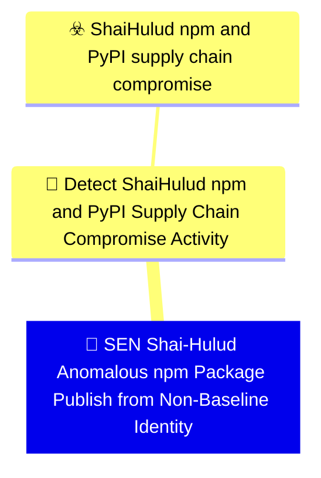

# 🚨 SEN Shai-Hulud Anomalous npm Package Publish from Non-Baseline Identity

🚦 **TLP:CLEAR** ⚪ : Recipients can spread this to the world, there is no limit on disclosure.

🗡️ **ATT&CK Techniques** :  [T1195.001 : Supply Chain Compromise: Compromise Software Dependencies and Development Tools](https://attack.mitre.org/techniques/T1195/001 'Adversaries may manipulate software dependencies and development tools prior to receipt by a final consumer for the purpose of data or system compromi'), [T1195.002 : Supply Chain Compromise: Compromise Software Supply Chain](https://attack.mitre.org/techniques/T1195/002 'Adversaries may manipulate application software prior to receipt by a final consumer for the purpose of data or system compromise Supply chain comprom'), [T1546.016 : Event Triggered Execution: Installer Packages](https://attack.mitre.org/techniques/T1546/016 'Adversaries may establish persistence and elevate privileges by using an installer to trigger the execution of malicious content Installer packages ar'), [T1059.007 : Command and Scripting Interpreter: JavaScript](https://attack.mitre.org/techniques/T1059/007 'Adversaries may abuse various implementations of JavaScript for execution JavaScript JS is a platform-independent scripting language compiled just-in-'), [T1059.006 : Command and Scripting Interpreter: Python](https://attack.mitre.org/techniques/T1059/006 'Adversaries may abuse Python commands and scripts for execution Python is a very popular scriptingprogramming language, with capabilities to perform m'), [T1552.001 : Unsecured Credentials: Credentials In Files](https://attack.mitre.org/techniques/T1552/001 'Adversaries may search local file systems and remote file shares for files containing insecurely stored credentials These can be files created by user'), [T1550.001 : Use Alternate Authentication Material: Application Access Token](https://attack.mitre.org/techniques/T1550/001 'Adversaries may use stolen application access tokens to bypass the typical authentication process and access restricted accounts, information, or serv'), [T1567.002 : Exfiltration Over Web Service: Exfiltration to Cloud Storage](https://attack.mitre.org/techniques/T1567/002 'Adversaries may exfiltrate data to a cloud storage service rather than over their primary command and control channel Cloud storage services allow for'), [T1071.001 : Application Layer Protocol: Web Protocols](https://attack.mitre.org/techniques/T1071/001 'Adversaries may communicate using application layer protocols associated with web traffic to avoid detectionnetwork filtering by blending in with exis'), [T1078 : Valid Accounts](https://attack.mitre.org/techniques/T1078 'Adversaries may obtain and abuse credentials of existing accounts as a means of gaining Initial Access, Persistence, Privilege Escalation, or Defense '), [T1027 : Obfuscated Files or Information](https://attack.mitre.org/techniques/T1027 'Adversaries may attempt to make an executable or file difficult to discover or analyze by encrypting, encoding, or otherwise obfuscating its contents '), [T1547 : Boot or Logon Autostart Execution](https://attack.mitre.org/techniques/T1547 'Adversaries may configure system settings to automatically execute a program during system boot or logon to maintain persistence or gain higher-level '), [T1485 : Data Destruction](https://attack.mitre.org/techniques/T1485 'Adversaries may destroy data and files on specific systems or in large numbers on a network to interrupt availability to systems, services, and networ')

---

`🔑 UUID : fae8ef2d-99e9-42f4-81ed-d40c515e8d3d` **|** `🏷️ Version : 1` **|** `🗓️ Creation Date : 2026-06-16` **|** `🗓️ Last Modification : 2026-06-16` **|** `Sharing Organisation : {'uuid': '56b0a0f0-b0bc-47d9-bb46-02f80ae2065a', 'name': 'EC DIGIT CSOC'}` **|** `🧱 Schema Identifier : mdr::2.1`

## 👁️‍🗨️ Description

> #### MDR Technical Details
> Microsoft Sentinel scheduled analytic rule implementing DOM signal
> `9f3abdc4-7c6e-480e-b722-6d31ddd9b2d2` (Anomalous npm Package Publish
> from Non-Baseline Host or Identity). Detects burst npm package publish
> activity from a single GitHub actor, publish events with campaign manifest
> markers in audit metadata, and supply-chain feed matches for known
> compromised versions via `ThreatIntelIndicators`.
> 
> #### Detection Criteria
> - Burst threshold: ≥ 3 package publish actions per actor per hour in
>   `GitHubAuditLog` (worm republication pattern).
> - OR audit/commit metadata references `preinstall`, `setup.mjs`,
>   `optionalDependencies`, or orphan TanStack git dependency.
> - OR `ThreatIntelIndicators` match on known Shai-Hulud package versions.
> - Frequency: 1 hour; severity Medium.
> 
> #### Exclusion Criteria
> - Monorepo bulk releases and emergency hotfix publishes — compare against
>   release calendar and require manifest markers for auto-escalation.
> - Maintain per-organisation critical-package publish baseline via watchlist
>   when registry-watcher pipelines are available.
> 

### 🕸️ Relations





| 🎯 Detection Objectives                                                                                                                                                                                                                                                                                                                          | ☣️ Threat Vectors                                                                                                                                                                                                                                                                                      | 🛡️ Detection Models    | 📡 Detection Objective Signals    |
|:------------------------------------------------------------------------------------------------------------------------------------------------------------------------------------------------------------------------------------------------------------------------------------------------------------------------------------------------|:-------------------------------------------------------------------------------------------------------------------------------------------------------------------------------------------------------------------------------------------------------------------------------------------------------|:-----------------------|:---------------------------------|
| [Detect Shai-Hulud npm and PyPI Supply Chain Compromise Activity](../Detection%20Objectives/🎯%20Detect%20Shai-Hulud%20npm%20and%20PyPI%20Supply%20Chain%20Compromise%20Activity.md 'This Detection Objective addresses the May 2026 Shai-Hulud  miniShai-Hulud supply-chain campaign affecting npm and PyPI packagesincluding the tanstack...') | [Shai-Hulud npm and PyPI supply chain compromise](../Threat%20Vectors/☣️%20Shai-Hulud%20npm%20and%20PyPI%20supply%20chain%20compromise.md '## Executive SummaryOn 11 May 2026, a coordinated supply-chain campaign publicly trackedas Shai-Hulud  mini Shai-Hulud compromised packages across the...') | ❌ No Detection Models  | ❌ No Detection Objective Signals |

&nbsp;

## ⚠️ Response

| 🌡️ Alert Severity                                                                | ‍🚒 Alert Handling Team   | 👣 Playbook link                                 |
|:---------------------------------------------------------------------------------|:-------------------------|:------------------------------------------------|
| **Medium** : Moderate SLAs required, can be grouped into a larger investigation. | **CSIRC** :              | No playbook was defined for this detection rule |

### 📋 Procedure

#### 🕵🏼‍♂️ Analysis

> 1. List packages published in the burst window.
> 2. Compare publish authentication source (CLI vs OIDC) to baseline.
> 3. Inspect manifest diffs for `preinstall` / `optionalDependencies` changes.
> 4. Cross-check versions against Wiz / OpenSSF malicious-package advisories.
> 

#### 🔎 Supporting Searches

<table>
<tr><th>Purpose</th>
<th>Target System</th>
<th>Query</th>
</tr><tr>

<td>Review all package publish actions for the actor
</td>
<td>Microsoft Sentinel</td>

<td>

```sql
GitHubAuditLog
| where TimeGenerated > ago(24h)
| where Actor == "{{Actor}}"
| where Action has "packages."
| project TimeGenerated, Action, Repository, Data
```
</td>
</tr>

</table>

#### 🔐 Containment
> Deprecate worm-republished package versions, revoke the publishing token,
> and audit all packages under the compromised maintainer scope.
> 

&nbsp;

## 💽 Configurations


<details>
<summary>Microsoft Sentinel <b>DEVELOPMENT</b></summary>

>**Status** : `DEVELOPMENT` - _Under active technical implementation, going in exploratory rounds_
>**Strategy** : `PREVIEW` - _Deployment from Pull/Merge Requests_

| Parameter                     | System Config                                         | Description                                                                                                                                                                                                                                                                       | Config                                                                                                                            |
|:------------------------------|:------------------------------------------------------|:----------------------------------------------------------------------------------------------------------------------------------------------------------------------------------------------------------------------------------------------------------------------------------|:----------------------------------------------------------------------------------------------------------------------------------|
| Schema identifier and version |                                                       | Identifier of the schema at its current version                                                                                                                                                                                                                                   | `sentinel::2.4`                                                                                                                   |
| 🧊 Entity Mappings             | `entityMappings`                                      | Entity mapping is an integral part of the configuration of scheduled query analytics rules. It enriches the rules' output (alerts and incidents) with essential information that serves as the building blocks of any investigative processes and remedial actions that follow.   | `{'entity': 'Account', 'mappings': [{'identifier': 'Name', 'column': 'Actor'}]}`                                                  |
| 🔫 _Missing_                   |                                                       | The operation against the threshold that triggers alert rule.  ⚠️ If you create a NRT rule, this value must be removed or commented out (NRT rules trigger an alert on the first match)                                                                                           | `GreaterThan`                                                                                                                     |
| ⚖️ Event threshold            | `triggerThreshold`                                    | If amount of events is higher than threshold (during the timeframe) the alert is triggered.   ⚠️ If you create a NRT rule, this value must be removed or commented out (NRT rules trigger an alert on the first match)                                                            | 0                                                                                                                                 |
| ⏱ Recurring Search Interval   | `queryFrequency`                                      | Time intervals at which the scheduled search should be ran at, from 5m to up to 14days. Format is X d|h|m. If you create a NRT rule, this value must be removed or commented out.                                                                                                 | `1h`                                                                                                                              |
| ⌛ Lookback Configuration      | `queryPeriod`                                         | Duration of logs to search in, up to 14 days. Format is X d|h|m. If you create a NRT rule, this value must be removed or commented out.                                                                                                                                           | `1h`                                                                                                                              |
| Create Incident               | `incidentConfiguration.createIncident`                | Create incidents from alerts triggered by this analytics rule                                                                                                                                                                                                                     | `True`                                                                                                                            |
| Alert Suppression             | `suppressionDuration`                                 | The duration to wait since last time this alert rule been triggered. Set to "false" to disable all suppression.                                                                                                                                                                   | `False`                                                                                                                           |
| 🎫 Alert Display Name Format   | `alertDetailsOverride.alertDisplayNameFormat`         | Free text with field names embedded using the format {{columnName}}. Up to 256 chars and 3 placeholders.                                                                                                                                                                          | `Shai-Hulud anomalous npm publish by {{Actor}}`                                                                                   |
| 🔬 Alert Description Format    | `alertDetailsOverride.alertDescriptionFormat`         | Free text with field names embedded using the format {{columnName}}. Up to 5000 chars and 3 placeholders                                                                                                                                                                          | `Burst or suspicious npm package publish activity consistent with Shai-Hulud worm propagation or trojanised manifest injection. ` |
| MITRE ATT&CK Tactics          |                                                       | Mapping of relevant tactics                                                                                                                                                                                                                                                       | `InitialAccess`, `Impact`                                                                                                         |
| MITRE ATT&CK Techniques       |                                                       | Mapping of relevant tactics - Warning : it's currently not possible to support all valid techniques as a schema for each target system, as they all support different variants and version of ATT&CK. You must check on the GUI what techniques are available and replicate here. | `T1195.002`, `T1078`, `T1485`                                                                                                     |
| 📣 Event Grouping Details      | `eventGroupingSettings.aggregationKind`               | Configure how rule query results are grouped into alerts.                                                                                                                                                                                                                         | `AlertPerResult`                                                                                                                  |
| 🎚️ Enable Alert Grouping      | `incidentConfiguration.groupingConfiguration.enabled` |                                                                                                                                                                                                                                                                                   | `False`                                                                                                                           |

</details>
&nbsp; 


### 🔎 Queries


<details>
<summary>Expand to view Microsoft Sentinel <b>DEVELOPMENT</b> query</summary>

```sql
// Detection: Shai-Hulud anomalous npm package publish
// DOM signal: 9f3abdc4-7c6e-480e-b722-6d31ddd9b2d2
// MITRE ATT&CK: T1195.002, T1078
// Platform: SENTINEL
let BurstThreshold = 3;
let ManifestMarkers = dynamic([
    "preinstall", "setup.mjs", "optionalDependencies",
    "github:tanstack/router", "git+https://github.com/tanstack"
]);
let CompromisedPackages = dynamic([
    "@tanstack/react-router@1.169.5", "guardrails-ai@0.10.1",
    "mistralai@2.4.6", "@uipath/", "@mistralai/"
]);
let PublishBurst =
GitHubAuditLog
| where TimeGenerated > ago(1h)
| where Action has "packages." and Action has "publish"
| summarize PublishCount = count(),
    Packages = make_set(Repository, 20)
    by Actor, bin(TimeGenerated, 1h)
| where PublishCount >= BurstThreshold
| extend DetectionReason = strcat("publish_burst=", PublishCount),
    Repository = tostring(Packages[0]), DataStr = "";
let ManifestPublish =
GitHubAuditLog
| where TimeGenerated > ago(1h)
| where Action has_any ("packages.", "repo.", "git.")
| extend DataStr = tostring(Data)
| where DataStr has_any (ManifestMarkers)
| summarize arg_max(TimeGenerated, *) by Actor, Repository
| extend PublishCount = 1,
    DetectionReason = "manifest_marker",
    Packages = pack_array(Repository);
let TiPackageMatch =
ThreatIntelIndicators
| where TimeGenerated > ago(7d)
| where ExpirationDateTime > now() and Active == true
| where Description has_any ("Shai-Hulud", "tanstack", "mini-shai-hulud")
    or ExternalId has_any (CompromisedPackages)
| extend Actor = coalesce(tostring(AdditionalData.actor), "ti_feed"),
    Repository = coalesce(tostring(AdditionalData.package), Description),
    DetectionReason = "ti_feed_match", PublishCount = 1, DataStr = Description
| project TimeGenerated, Actor, Repository, DetectionReason, PublishCount, DataStr, Packages = pack_array(Repository);
union PublishBurst, ManifestPublish, TiPackageMatch
| project TimeGenerated, Actor, Repository, DetectionReason, PublishCount, DataStr
| order by TimeGenerated desc
```

</details>
&nbsp; 


### 🔗 References


**🕊️ Publicly available resources**

- [_1_] https://www.wiz.io/blog/mini-shai-hulud-strikes-again-tanstack-more-npm-packages-compromised
- [_2_] https://www.aikido.dev/blog/mini-shai-hulud-is-back-tanstack-compromised
- [_3_] https://tanstack.com/blog/npm-supply-chain-compromise-postmortem
- [_4_] https://www.stepsecurity.io/blog/mini-shai-hulud-is-back-a-self-spreading-supply-chain-attack-hits-the-npm-ecosystem

[1]: https://www.wiz.io/blog/mini-shai-hulud-strikes-again-tanstack-more-npm-packages-compromised
[2]: https://www.aikido.dev/blog/mini-shai-hulud-is-back-tanstack-compromised
[3]: https://tanstack.com/blog/npm-supply-chain-compromise-postmortem
[4]: https://www.stepsecurity.io/blog/mini-shai-hulud-is-back-a-self-spreading-supply-chain-attack-hits-the-npm-ecosystem

&nbsp;


