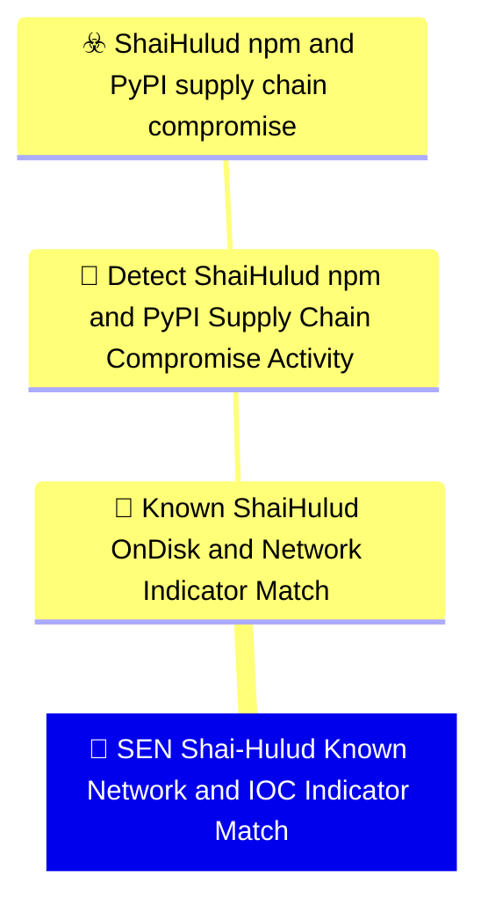

# 🚨 SEN Shai-Hulud Known Network and IOC Indicator Match

🚦 **TLP:CLEAR** ⚪ : Recipients can spread this to the world, there is no limit on disclosure.


---

`🔑 UUID : cf614690-69c4-4229-af59-072a9e18583b` **|** `🏷️ Version : 1` **|** `🗓️ Creation Date : 2026-06-16` **|** `🗓️ Last Modification : 2026-06-22` **|** `Sharing Organisation : {'uuid': '56b0a0f0-b0bc-47d9-bb46-02f80ae2065a', 'name': 'EC DIGIT CSOC'}` **|** `🧱 Schema Identifier : mdr::2.1`

## 👁️‍🗨️ Description

> #### MDR Technical Details
> Microsoft Sentinel scheduled analytic rule implementing DOM signal
> `678d0786-dfd7-40fb-ba90-3c368ed00342` (Known Shai-Hulud On-Disk and
> Network Indicator Match). Correlates DNS queries and threat-intelligence
> feed matches for campaign domains, exfiltration IP, and malicious package
> version indicators across `DnsEvents`, `CommonSecurityLog`, and
> `ThreatIntelIndicators`.
> 
> #### Detection Criteria
> - DNS resolution of `git-tanstack.com` or `*.getsession.org`.
> - OR proxy/firewall log connection to `83.142.209.194`.
> - OR active `ThreatIntelIndicators` entry referencing Shai-Hulud campaign
>   packages or infrastructure.
> - Frequency: 1 hour; severity Critical.
> 
> #### Exclusion Criteria
> - Threat-intel feed matches require `Active == true` and unexpired indicators.
> - DNS matches alone on security-research sandboxes should be scoped to
>   developer and CI network segments where possible.
> 

### 🕸️ Relations





| 📡 Detection Objective Signals                                                                                                                                                                                                                                                                                                                                                                                                | 🎯 Detection Objectives                                                                                                                                                                                                                                                                                                                          | ☣️ Threat Vectors                                                                                                                                                                                                                                                                                      | 🛡️ Detection Models    |
|:-----------------------------------------------------------------------------------------------------------------------------------------------------------------------------------------------------------------------------------------------------------------------------------------------------------------------------------------------------------------------------------------------------------------------------|:------------------------------------------------------------------------------------------------------------------------------------------------------------------------------------------------------------------------------------------------------------------------------------------------------------------------------------------------|:-------------------------------------------------------------------------------------------------------------------------------------------------------------------------------------------------------------------------------------------------------------------------------------------------------|:-----------------------|
| [Detect Shai-Hulud npm and PyPI Supply Chain Compromise Activity::Known Shai-Hulud On-Disk and Network Indicator Match](Detect%20Shai-Hulud%20npm%20and%20PyPI%20Supply%20Chain%20Compromise%20Activity#known-shai-hulud-on-disk-and-network-indicator-match.md 'High-specificity artefact and IOC matching for publicly reportedShai-Hulud indicators  suitable for retrospective sweeps andlive IOC gatesDetection cr...') | [Detect Shai-Hulud npm and PyPI Supply Chain Compromise Activity](../Detection%20Objectives/🎯%20Detect%20Shai-Hulud%20npm%20and%20PyPI%20Supply%20Chain%20Compromise%20Activity.md 'This Detection Objective addresses the May 2026 Shai-Hulud  miniShai-Hulud supply-chain campaign affecting npm and PyPI packagesincluding the tanstack...') | [Shai-Hulud npm and PyPI supply chain compromise](../Threat%20Vectors/☣️%20Shai-Hulud%20npm%20and%20PyPI%20supply%20chain%20compromise.md '## Executive SummaryOn 11 May 2026, a coordinated supply-chain campaign publicly trackedas Shai-Hulud  mini Shai-Hulud compromised packages across the...') | ❌ No Detection Models  |

&nbsp;

## ⚠️ Response

| 🌡️ Alert Severity                                                                     | ‍🚒 Alert Handling Team                                     | 👣 Playbook link                                 |
|:--------------------------------------------------------------------------------------|:-----------------------------------------------------------|:------------------------------------------------|
| **High** : Needs attention within tight SLAs alongside a comprehensive investigation. | **No defined responders for alerts generated by this MDR** | No playbook was defined for this detection rule |

### 📋 Procedure

#### 🕵🏼‍♂️ Analysis

> 1. Identify the source host or client IP for the IOC match.
> 2. Map the asset to developer workstation or CI runner inventory.
> 3. Trigger endpoint IOC sweep on the correlated host.
> 4. Check lockfiles and SBOM for compromised package versions.
> 


#### 🔐 Containment
> Block IOC domains and IP at DNS and proxy layers. Initiate endpoint
> response on correlated developer and CI assets.
> 

&nbsp;

## 💽 Configurations


<details>
<summary>Microsoft Sentinel <b>DEVELOPMENT</b></summary>

>**Status** : `DEVELOPMENT` - _Under active technical implementation, going in exploratory rounds_
>**Strategy** : `PREVIEW` - _Deployment from Pull/Merge Requests_

| Parameter                     | System Config                                         | Description                                                                                                                                                                                                                                                                       | Config                                                                                                                                                                         |
|:------------------------------|:------------------------------------------------------|:----------------------------------------------------------------------------------------------------------------------------------------------------------------------------------------------------------------------------------------------------------------------------------|:-------------------------------------------------------------------------------------------------------------------------------------------------------------------------------|
| Schema identifier and version |                                                       | Identifier of the schema at its current version                                                                                                                                                                                                                                   | `sentinel::2.4`                                                                                                                                                                |
| 🧊 Entity Mappings             | `entityMappings`                                      | Entity mapping is an integral part of the configuration of scheduled query analytics rules. It enriches the rules' output (alerts and incidents) with essential information that serves as the building blocks of any investigative processes and remedial actions that follow.   | `{'entity': 'IP', 'mappings': [{'identifier': 'Address', 'column': 'ClientIP'}]}`, `{'entity': 'DNS', 'mappings': [{'identifier': 'DomainName', 'column': 'IndicatorValue'}]}` |
| 🔫 _Missing_                   |                                                       | The operation against the threshold that triggers alert rule.  ⚠️ If you create a NRT rule, this value must be removed or commented out (NRT rules trigger an alert on the first match)                                                                                           | `GreaterThan`                                                                                                                                                                  |
| ⚖️ Event threshold            | `triggerThreshold`                                    | If amount of events is higher than threshold (during the timeframe) the alert is triggered.   ⚠️ If you create a NRT rule, this value must be removed or commented out (NRT rules trigger an alert on the first match)                                                            | 0                                                                                                                                                                              |
| ⏱ Recurring Search Interval   | `queryFrequency`                                      | Time intervals at which the scheduled search should be ran at, from 5m to up to 14days. Format is X d|h|m. If you create a NRT rule, this value must be removed or commented out.                                                                                                 | `1h`                                                                                                                                                                           |
| ⌛ Lookback Configuration      | `queryPeriod`                                         | Duration of logs to search in, up to 14 days. Format is X d|h|m. If you create a NRT rule, this value must be removed or commented out.                                                                                                                                           | `1h`                                                                                                                                                                           |
| Create Incident               | `incidentConfiguration.createIncident`                | Create incidents from alerts triggered by this analytics rule                                                                                                                                                                                                                     | `True`                                                                                                                                                                         |
| Alert Suppression             | `suppressionDuration`                                 | The duration to wait since last time this alert rule been triggered. Set to "false" to disable all suppression.                                                                                                                                                                   | `False`                                                                                                                                                                        |
| 🎫 Alert Display Name Format   | `alertDetailsOverride.alertDisplayNameFormat`         | Free text with field names embedded using the format {{columnName}}. Up to 256 chars and 3 placeholders.                                                                                                                                                                          | `Shai-Hulud network IOC match — {{IndicatorValue}}`                                                                                                                            |
| 🔬 Alert Description Format    | `alertDetailsOverride.alertDescriptionFormat`         | Free text with field names embedded using the format {{columnName}}. Up to 5000 chars and 3 placeholders                                                                                                                                                                          | `DNS, proxy, or threat-intelligence telemetry matches a known Shai-Hulud campaign indicator. `                                                                                 |
| MITRE ATT&CK Tactics          |                                                       | Mapping of relevant tactics                                                                                                                                                                                                                                                       | `CommandAndControl`, `Exfiltration`                                                                                                                                            |
| MITRE ATT&CK Techniques       |                                                       | Mapping of relevant tactics - Warning : it's currently not possible to support all valid techniques as a schema for each target system, as they all support different variants and version of ATT&CK. You must check on the GUI what techniques are available and replicate here. | `T1071.001`, `T1567.002`, `T1195.002`                                                                                                                                          |
| 📣 Event Grouping Details      | `eventGroupingSettings.aggregationKind`               | Configure how rule query results are grouped into alerts.                                                                                                                                                                                                                         | `AlertPerResult`                                                                                                                                                               |
| 🎚️ Enable Alert Grouping      | `incidentConfiguration.groupingConfiguration.enabled` |                                                                                                                                                                                                                                                                                   | `False`                                                                                                                                                                        |

</details>
&nbsp; 


### 🔎 Queries


<details>
<summary>Expand to view Microsoft Sentinel <b>DEVELOPMENT</b> query</summary>

```sql
// Detection: Shai-Hulud known network and IOC indicator match
// DOM signal: 678d0786-dfd7-40fb-ba90-3c368ed00342
// MITRE ATT&CK: T1071.001, T1195.002
// Platform: SENTINEL
let IocDomains = dynamic([
    "git-tanstack.com", "getsession.org", "filev2.getsession.org",
    "seed1.getsession.org", "seed2.getsession.org", "seed3.getsession.org"
]);
let ExfilIp = "83.142.209.194";
let DnsMatch =
DnsEvents
| where TimeGenerated > ago(1h)
| where Name has_any (IocDomains)
| project TimeGenerated, ClientIP = ClientIP, IndicatorValue = Name,
    MatchSource = "DnsEvents", IndicatorType = "domain";
let ProxyMatch =
CommonSecurityLog
| where TimeGenerated > ago(1h)
| where DestinationIP == ExfilIp
    or DestinationHostName has_any (IocDomains)
| project TimeGenerated, ClientIP = SourceIP,
    IndicatorValue = coalesce(DestinationHostName, DestinationIP),
    MatchSource = "CommonSecurityLog", IndicatorType = "network";
let TiMatch =
ThreatIntelIndicators
| where TimeGenerated > ago(7d)
| where ExpirationDateTime > now() and Active == true
| where Description has_any ("Shai-Hulud", "mini-shai-hulud", "git-tanstack")
    or DomainName has_any (IocDomains)
    or NetworkIP == ExfilIp
| extend IndicatorValue = coalesce(DomainName, NetworkIP, Description)
| project TimeGenerated, ClientIP = "", IndicatorValue,
    MatchSource = "ThreatIntelIndicators", IndicatorType = ThreatType;
union DnsMatch, ProxyMatch, TiMatch
| order by TimeGenerated desc
```

</details>
&nbsp; 


### 🔗 References


**🕊️ Publicly available resources**

- [_1_] https://www.wiz.io/blog/mini-shai-hulud-strikes-again-tanstack-more-npm-packages-compromised
- [_2_] https://www.aikido.dev/blog/mini-shai-hulud-is-back-tanstack-compromised
- [_3_] https://tanstack.com/blog/npm-supply-chain-compromise-postmortem
- [_4_] https://www.stepsecurity.io/blog/mini-shai-hulud-is-back-a-self-spreading-supply-chain-attack-hits-the-npm-ecosystem

[1]: https://www.wiz.io/blog/mini-shai-hulud-strikes-again-tanstack-more-npm-packages-compromised
[2]: https://www.aikido.dev/blog/mini-shai-hulud-is-back-tanstack-compromised
[3]: https://tanstack.com/blog/npm-supply-chain-compromise-postmortem
[4]: https://www.stepsecurity.io/blog/mini-shai-hulud-is-back-a-self-spreading-supply-chain-attack-hits-the-npm-ecosystem

&nbsp;


