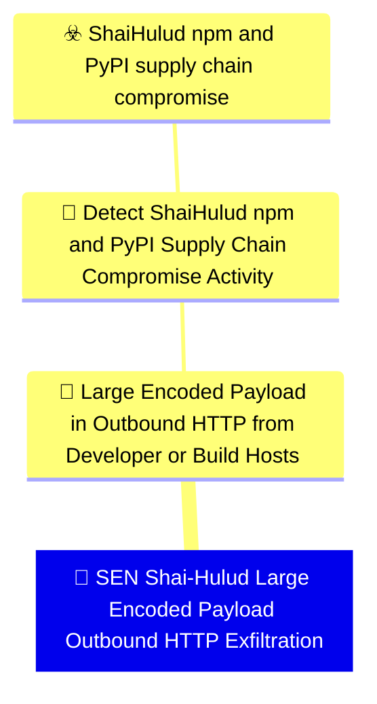

# 🚨 SEN Shai-Hulud Large Encoded Payload Outbound HTTP Exfiltration

🚦 **TLP:CLEAR** ⚪ : Recipients can spread this to the world, there is no limit on disclosure.


---

`🔑 UUID : bd5c57f3-bbb1-441f-8934-7a9b13c73f67` **|** `🏷️ Version : 1` **|** `🗓️ Creation Date : 2026-06-16` **|** `🗓️ Last Modification : 2026-06-22` **|** `Sharing Organisation : {'uuid': '56b0a0f0-b0bc-47d9-bb46-02f80ae2065a', 'name': 'EC DIGIT CSOC'}` **|** `🧱 Schema Identifier : mdr::2.1`

## 👁️‍🗨️ Description

> #### MDR Technical Details
> Microsoft Sentinel scheduled analytic rule implementing DOM signal
> `21a527de-8635-4187-87d4-c9e5f5c1badc` (Large Encoded Payload in Outbound
> HTTP from Developer or Build Hosts). Uses corporate web-proxy
> `CommonSecurityLog` entries for large POST/PUT requests to Shai-Hulud IOC
> destinations, complementing the MDE endpoint-network variant.
> 
> #### Detection Criteria
> - HTTP POST or PUT to `git-tanstack.com` or `filev2.getsession.org`.
> - Request or response bytes ≥ 50 KB (proxy-dependent field availability).
> - Frequency: 1 hour; severity Medium.
> 
> #### Exclusion Criteria
> - Internal artefact registry uploads — exclude known internal registry
>   hostnames via deployment-specific `let` block.
> - Requires web-proxy connector with body-size or byte-count fields.
> 

### 🕸️ Relations





| 📡 Detection Objective Signals                                                                                                                                                                                                                                                                                                                                                                                                                                | 🎯 Detection Objectives                                                                                                                                                                                                                                                                                                                          | ☣️ Threat Vectors                                                                                                                                                                                                                                                                                      | 🛡️ Detection Models    |
|:-------------------------------------------------------------------------------------------------------------------------------------------------------------------------------------------------------------------------------------------------------------------------------------------------------------------------------------------------------------------------------------------------------------------------------------------------------------|:------------------------------------------------------------------------------------------------------------------------------------------------------------------------------------------------------------------------------------------------------------------------------------------------------------------------------------------------|:-------------------------------------------------------------------------------------------------------------------------------------------------------------------------------------------------------------------------------------------------------------------------------------------------------|:-----------------------|
| [Detect Shai-Hulud npm and PyPI Supply Chain Compromise Activity::Large Encoded Payload in Outbound HTTP from Developer or Build Hosts](Detect%20Shai-Hulud%20npm%20and%20PyPI%20Supply%20Chain%20Compromise%20Activity#large-encoded-payload-in-outbound-http-from-developer-or-build-hosts.md 'Pattern-matching detection for sizeable Base64 or otherwiseencoded HTTP request bodies leaving developer laptops or CIrunners shortly after package-ma...') | [Detect Shai-Hulud npm and PyPI Supply Chain Compromise Activity](../Detection%20Objectives/🎯%20Detect%20Shai-Hulud%20npm%20and%20PyPI%20Supply%20Chain%20Compromise%20Activity.md 'This Detection Objective addresses the May 2026 Shai-Hulud  miniShai-Hulud supply-chain campaign affecting npm and PyPI packagesincluding the tanstack...') | [Shai-Hulud npm and PyPI supply chain compromise](../Threat%20Vectors/☣️%20Shai-Hulud%20npm%20and%20PyPI%20supply%20chain%20compromise.md '## Executive SummaryOn 11 May 2026, a coordinated supply-chain campaign publicly trackedas Shai-Hulud  mini Shai-Hulud compromised packages across the...') | ❌ No Detection Models  |

&nbsp;

## ⚠️ Response

| 🌡️ Alert Severity                                                                | ‍🚒 Alert Handling Team                                     | 👣 Playbook link                                 |
|:---------------------------------------------------------------------------------|:-----------------------------------------------------------|:------------------------------------------------|
| **Medium** : Moderate SLAs required, can be grouped into a larger investigation. | **No defined responders for alerts generated by this MDR** | No playbook was defined for this detection rule |

### 📋 Procedure

#### 🕵🏼‍♂️ Analysis

> 1. Review proxy log fields for source host and destination URL.
> 2. Correlate source IP with developer workstation or CI runner inventory.
> 3. Hunt endpoint telemetry for preceding package install activity.
> 


#### 🔐 Containment
> Block IOC domains at the proxy and rotate credentials if the source
> host matches a developer or CI asset.
> 

&nbsp;

## 💽 Configurations


<details>
<summary>Microsoft Sentinel <b>DEVELOPMENT</b></summary>

>**Status** : `DEVELOPMENT` - _Under active technical implementation, going in exploratory rounds_
>**Strategy** : `PREVIEW` - _Deployment from Pull/Merge Requests_

| Parameter                     | System Config                                         | Description                                                                                                                                                                                                                                                                       | Config                                                                                                                                                              |
|:------------------------------|:------------------------------------------------------|:----------------------------------------------------------------------------------------------------------------------------------------------------------------------------------------------------------------------------------------------------------------------------------|:--------------------------------------------------------------------------------------------------------------------------------------------------------------------|
| Schema identifier and version |                                                       | Identifier of the schema at its current version                                                                                                                                                                                                                                   | `sentinel::2.4`                                                                                                                                                     |
| 🧊 Entity Mappings             | `entityMappings`                                      | Entity mapping is an integral part of the configuration of scheduled query analytics rules. It enriches the rules' output (alerts and incidents) with essential information that serves as the building blocks of any investigative processes and remedial actions that follow.   | `{'entity': 'IP', 'mappings': [{'identifier': 'Address', 'column': 'SourceIP'}]}`, `{'entity': 'URL', 'mappings': [{'identifier': 'Url', 'column': 'RequestURL'}]}` |
| 🔫 _Missing_                   |                                                       | The operation against the threshold that triggers alert rule.  ⚠️ If you create a NRT rule, this value must be removed or commented out (NRT rules trigger an alert on the first match)                                                                                           | `GreaterThan`                                                                                                                                                       |
| ⚖️ Event threshold            | `triggerThreshold`                                    | If amount of events is higher than threshold (during the timeframe) the alert is triggered.   ⚠️ If you create a NRT rule, this value must be removed or commented out (NRT rules trigger an alert on the first match)                                                            | 0                                                                                                                                                                   |
| ⏱ Recurring Search Interval   | `queryFrequency`                                      | Time intervals at which the scheduled search should be ran at, from 5m to up to 14days. Format is X d|h|m. If you create a NRT rule, this value must be removed or commented out.                                                                                                 | `1h`                                                                                                                                                                |
| ⌛ Lookback Configuration      | `queryPeriod`                                         | Duration of logs to search in, up to 14 days. Format is X d|h|m. If you create a NRT rule, this value must be removed or commented out.                                                                                                                                           | `1h`                                                                                                                                                                |
| Create Incident               | `incidentConfiguration.createIncident`                | Create incidents from alerts triggered by this analytics rule                                                                                                                                                                                                                     | `True`                                                                                                                                                              |
| Alert Suppression             | `suppressionDuration`                                 | The duration to wait since last time this alert rule been triggered. Set to "false" to disable all suppression.                                                                                                                                                                   | `False`                                                                                                                                                             |
| 🎫 Alert Display Name Format   | `alertDetailsOverride.alertDisplayNameFormat`         | Free text with field names embedded using the format {{columnName}}. Up to 256 chars and 3 placeholders.                                                                                                                                                                          | `Shai-Hulud large HTTP exfil to {{DestinationHostName}}`                                                                                                            |
| 🔬 Alert Description Format    | `alertDetailsOverride.alertDescriptionFormat`         | Free text with field names embedded using the format {{columnName}}. Up to 5000 chars and 3 placeholders                                                                                                                                                                          | `Web proxy telemetry shows a large POST/PUT to a Shai-Hulud exfiltration destination from a developer or build-network host. `                                      |
| MITRE ATT&CK Tactics          |                                                       | Mapping of relevant tactics                                                                                                                                                                                                                                                       | `Exfiltration`                                                                                                                                                      |
| MITRE ATT&CK Techniques       |                                                       | Mapping of relevant tactics - Warning : it's currently not possible to support all valid techniques as a schema for each target system, as they all support different variants and version of ATT&CK. You must check on the GUI what techniques are available and replicate here. | `T1567.002`, `T1071.001`, `T1027`                                                                                                                                   |
| 📣 Event Grouping Details      | `eventGroupingSettings.aggregationKind`               | Configure how rule query results are grouped into alerts.                                                                                                                                                                                                                         | `AlertPerResult`                                                                                                                                                    |
| 🎚️ Enable Alert Grouping      | `incidentConfiguration.groupingConfiguration.enabled` |                                                                                                                                                                                                                                                                                   | `False`                                                                                                                                                             |

</details>
&nbsp; 


### 🔎 Queries


<details>
<summary>Expand to view Microsoft Sentinel <b>DEVELOPMENT</b> query</summary>

```sql
// Detection: Shai-Hulud large encoded outbound HTTP exfiltration (proxy)
// DOM signal: 21a527de-8635-4187-87d4-c9e5f5c1badc
// MITRE ATT&CK: T1567.002, T1071.001
// Platform: SENTINEL
let IocDomains = dynamic([
    "git-tanstack.com", "filev2.getsession.org"
]);
let MinBytes = 50000;
CommonSecurityLog
| where TimeGenerated > ago(1h)
| where RequestMethod in ("POST", "PUT")
| where DestinationHostName has_any (IocDomains)
    or DestinationIP == "83.142.209.194"
| where ReceivedBytes >= MinBytes or SentBytes >= MinBytes
| extend RequestURL = strcat(RequestMethod, " ", DestinationHostName, DestinationURL)
| project TimeGenerated, SourceIP, DestinationHostName, RequestURL,
    ReceivedBytes, SentBytes, DeviceVendor, DeviceProduct
```

</details>
&nbsp; 


### 🔗 References


**🕊️ Publicly available resources**

- [_1_] https://www.wiz.io/blog/mini-shai-hulud-strikes-again-tanstack-more-npm-packages-compromised
- [_2_] https://www.aikido.dev/blog/mini-shai-hulud-is-back-tanstack-compromised
- [_3_] https://tanstack.com/blog/npm-supply-chain-compromise-postmortem
- [_4_] https://www.stepsecurity.io/blog/mini-shai-hulud-is-back-a-self-spreading-supply-chain-attack-hits-the-npm-ecosystem

[1]: https://www.wiz.io/blog/mini-shai-hulud-strikes-again-tanstack-more-npm-packages-compromised
[2]: https://www.aikido.dev/blog/mini-shai-hulud-is-back-tanstack-compromised
[3]: https://tanstack.com/blog/npm-supply-chain-compromise-postmortem
[4]: https://www.stepsecurity.io/blog/mini-shai-hulud-is-back-a-self-spreading-supply-chain-attack-hits-the-npm-ecosystem

&nbsp;


