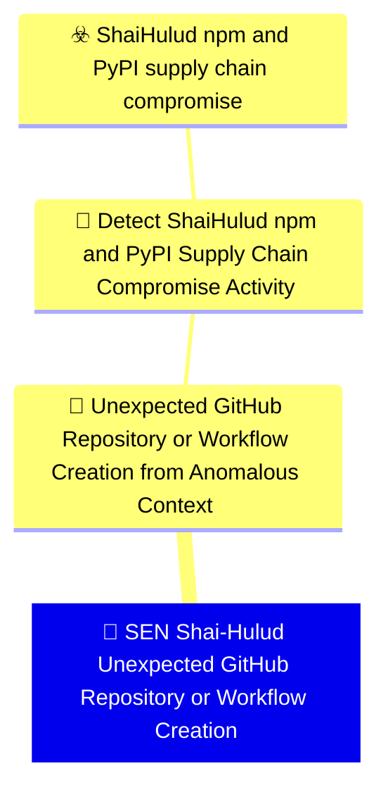

# 🚨 SEN Shai-Hulud Unexpected GitHub Repository or Workflow Creation

🚦 **TLP:CLEAR** ⚪ : Recipients can spread this to the world, there is no limit on disclosure.


---

`🔑 UUID : 7eb85d22-2e60-449f-b92c-8cecc28d34c6` **|** `🏷️ Version : 1` **|** `🗓️ Creation Date : 2026-06-16` **|** `🗓️ Last Modification : 2026-06-22` **|** `Sharing Organisation : {'uuid': '56b0a0f0-b0bc-47d9-bb46-02f80ae2065a', 'name': 'EC DIGIT CSOC'}` **|** `🧱 Schema Identifier : mdr::2.1`

## 👁️‍🗨️ Description

> #### MDR Technical Details
> Microsoft Sentinel scheduled analytic rule implementing DOM signal
> `287114bd-7d58-422d-9711-f5516900b9ce` (Unexpected GitHub Repository or
> Workflow Creation from Anomalous Context). Searches `GitHubAuditLog` and
> `CloudAppEvents` for dead-drop repository markers, suspicious workflow
> commits, and package-related audit actions.
> 
> #### Detection Criteria
> - GitHub audit `Data` or CloudApp `RawEventData` contains campaign strings:
>   `Shai-Hulud: Here We Go Again`, `PUSH UR T3MPRR`, or the token-wipe
>   commit message.
> - OR repository/workflow actions involving `router_init.js`, `setup.mjs`,
>   or `.github/workflows` from GitHub application telemetry.
> - Time window: 1 hour lookback with 1 hour frequency.
> - Severity: High.
> 
> #### Exclusion Criteria
> - Legitimate open-source forks and hobby repositories — correlate with
>   endpoint install anomalies on linked CI runners before escalation.
> - Dune-themed repository names alone are insufficient; require marker
>   strings or malicious workflow file references.
> 

### 🕸️ Relations





| 📡 Detection Objective Signals                                                                                                                                                                                                                                                                                                                                                                                                                                        | 🎯 Detection Objectives                                                                                                                                                                                                                                                                                                                          | ☣️ Threat Vectors                                                                                                                                                                                                                                                                                      | 🛡️ Detection Models    |
|:---------------------------------------------------------------------------------------------------------------------------------------------------------------------------------------------------------------------------------------------------------------------------------------------------------------------------------------------------------------------------------------------------------------------------------------------------------------------|:------------------------------------------------------------------------------------------------------------------------------------------------------------------------------------------------------------------------------------------------------------------------------------------------------------------------------------------------|:-------------------------------------------------------------------------------------------------------------------------------------------------------------------------------------------------------------------------------------------------------------------------------------------------------|:-----------------------|
| [Detect Shai-Hulud npm and PyPI Supply Chain Compromise Activity::Unexpected GitHub Repository or Workflow Creation from Anomalous Context](Detect%20Shai-Hulud%20npm%20and%20PyPI%20Supply%20Chain%20Compromise%20Activity#unexpected-github-repository-or-workflow-creation-from-anomalous-context.md 'Event-search detection in GitHub audit and cloud applicationlogs for worm propagation artefacts dead-drop repositories,workflow injection, and publish...') | [Detect Shai-Hulud npm and PyPI Supply Chain Compromise Activity](../Detection%20Objectives/🎯%20Detect%20Shai-Hulud%20npm%20and%20PyPI%20Supply%20Chain%20Compromise%20Activity.md 'This Detection Objective addresses the May 2026 Shai-Hulud  miniShai-Hulud supply-chain campaign affecting npm and PyPI packagesincluding the tanstack...') | [Shai-Hulud npm and PyPI supply chain compromise](../Threat%20Vectors/☣️%20Shai-Hulud%20npm%20and%20PyPI%20supply%20chain%20compromise.md '## Executive SummaryOn 11 May 2026, a coordinated supply-chain campaign publicly trackedas Shai-Hulud  mini Shai-Hulud compromised packages across the...') | ❌ No Detection Models  |

&nbsp;

## ⚠️ Response

| 🌡️ Alert Severity                                                                     | ‍🚒 Alert Handling Team                                     | 👣 Playbook link                                 |
|:--------------------------------------------------------------------------------------|:-----------------------------------------------------------|:------------------------------------------------|
| **High** : Needs attention within tight SLAs alongside a comprehensive investigation. | **No defined responders for alerts generated by this MDR** | No playbook was defined for this detection rule |

### 📋 Procedure

#### 🕵🏼‍♂️ Analysis

> 1. Identify the GitHub actor and repositories affected.
> 2. Review repository description and commit messages for campaign markers.
> 3. Check whether the actor's token was used from a compromised CI runner.
> 4. Correlate with npm publish and endpoint IOC signals.
> 

#### 🔎 Supporting Searches

<table>
<tr><th>Purpose</th>
<th>Target System</th>
<th>Query</th>
</tr><tr>

<td>Expand GitHub audit activity for the alerted actor
</td>
<td>Microsoft Sentinel</td>

<td>

```sql
GitHubAuditLog
| where TimeGenerated > ago(24h)
| where Actor == "{{Actor}}"
| project TimeGenerated, Action, Repository, Data
| order by TimeGenerated desc
```
</td>
</tr>

</table>

#### 🔐 Containment
> Revoke the compromised GitHub token, delete dead-drop repositories,
> and audit workflow files for malicious publish steps.
> 

&nbsp;

## 💽 Configurations


<details>
<summary>Microsoft Sentinel <b>DEVELOPMENT</b></summary>

>**Status** : `DEVELOPMENT` - _Under active technical implementation, going in exploratory rounds_
>**Strategy** : `PREVIEW` - _Deployment from Pull/Merge Requests_

| Parameter                     | System Config                                         | Description                                                                                                                                                                                                                                                                       | Config                                                                                                                                                                          |
|:------------------------------|:------------------------------------------------------|:----------------------------------------------------------------------------------------------------------------------------------------------------------------------------------------------------------------------------------------------------------------------------------|:--------------------------------------------------------------------------------------------------------------------------------------------------------------------------------|
| Schema identifier and version |                                                       | Identifier of the schema at its current version                                                                                                                                                                                                                                   | `sentinel::2.4`                                                                                                                                                                 |
| 🧊 Entity Mappings             | `entityMappings`                                      | Entity mapping is an integral part of the configuration of scheduled query analytics rules. It enriches the rules' output (alerts and incidents) with essential information that serves as the building blocks of any investigative processes and remedial actions that follow.   | `{'entity': 'Account', 'mappings': [{'identifier': 'Name', 'column': 'Actor'}]}`, `{'entity': 'IP', 'mappings': [{'identifier': 'Address', 'column': 'IPAddress'}]}`            |
| 🔫 _Missing_                   |                                                       | The operation against the threshold that triggers alert rule.  ⚠️ If you create a NRT rule, this value must be removed or commented out (NRT rules trigger an alert on the first match)                                                                                           | `GreaterThan`                                                                                                                                                                   |
| ⚖️ Event threshold            | `triggerThreshold`                                    | If amount of events is higher than threshold (during the timeframe) the alert is triggered.   ⚠️ If you create a NRT rule, this value must be removed or commented out (NRT rules trigger an alert on the first match)                                                            | 0                                                                                                                                                                               |
| ⏱ Recurring Search Interval   | `queryFrequency`                                      | Time intervals at which the scheduled search should be ran at, from 5m to up to 14days. Format is X d|h|m. If you create a NRT rule, this value must be removed or commented out.                                                                                                 | `1h`                                                                                                                                                                            |
| ⌛ Lookback Configuration      | `queryPeriod`                                         | Duration of logs to search in, up to 14 days. Format is X d|h|m. If you create a NRT rule, this value must be removed or commented out.                                                                                                                                           | `1h`                                                                                                                                                                            |
| Create Incident               | `incidentConfiguration.createIncident`                | Create incidents from alerts triggered by this analytics rule                                                                                                                                                                                                                     | `True`                                                                                                                                                                          |
| Alert Suppression             | `suppressionDuration`                                 | The duration to wait since last time this alert rule been triggered. Set to "false" to disable all suppression.                                                                                                                                                                   | `False`                                                                                                                                                                         |
| 🎫 Alert Display Name Format   | `alertDetailsOverride.alertDisplayNameFormat`         | Free text with field names embedded using the format {{columnName}}. Up to 256 chars and 3 placeholders.                                                                                                                                                                          | `Shai-Hulud GitHub dead-drop activity by {{Actor}}`                                                                                                                             |
| 🔬 Alert Description Format    | `alertDetailsOverride.alertDescriptionFormat`         | Free text with field names embedded using the format {{columnName}}. Up to 5000 chars and 3 placeholders                                                                                                                                                                          | `GitHub audit or cloud application telemetry matches Shai-Hulud worm propagation markers — dead-drop repositories, workflow injection, or suspicious package-related actions. ` |
| MITRE ATT&CK Tactics          |                                                       | Mapping of relevant tactics                                                                                                                                                                                                                                                       | `InitialAccess`, `Persistence`, `Exfiltration`                                                                                                                                  |
| MITRE ATT&CK Techniques       |                                                       | Mapping of relevant tactics - Warning : it's currently not possible to support all valid techniques as a schema for each target system, as they all support different variants and version of ATT&CK. You must check on the GUI what techniques are available and replicate here. | `T1195.002`, `T1078`, `T1567.002`                                                                                                                                               |
| 📣 Event Grouping Details      | `eventGroupingSettings.aggregationKind`               | Configure how rule query results are grouped into alerts.                                                                                                                                                                                                                         | `AlertPerResult`                                                                                                                                                                |
| 🎚️ Enable Alert Grouping      | `incidentConfiguration.groupingConfiguration.enabled` |                                                                                                                                                                                                                                                                                   | `False`                                                                                                                                                                         |

</details>
&nbsp; 


### 🔎 Queries


<details>
<summary>Expand to view Microsoft Sentinel <b>DEVELOPMENT</b> query</summary>

```sql
// Detection: Shai-Hulud unexpected GitHub repository or workflow creation
// DOM signal: 287114bd-7d58-422d-9711-f5516900b9ce
// MITRE ATT&CK: T1195.002, T1078
// Platform: SENTINEL
let ShaiHuludMarkers = dynamic([
    "Shai-Hulud: Here We Go Again",
    "PUSH UR T3MPRR",
    "IfYouRevokeThisTokenItWillWipeTheComputerOfTheOwner"
]);
let MaliciousPaths = dynamic([
    "router_init.js", "setup.mjs", ".github/workflows"
]);
let GitHubAudit =
GitHubAuditLog
| where TimeGenerated > ago(1h)
| extend DataStr = tostring(Data)
| where Action has_any ("repo.", "workflows.", "packages.")
| where DataStr has_any (ShaiHuludMarkers)
    or (Action has "repo.create" and DataStr has "dune")
| project TimeGenerated, Actor, Action, Repository, DataStr,
    IPAddress = "", Source = "GitHubAuditLog";
let CloudAppGitHub =
CloudAppEvents
| where TimeGenerated > ago(1h)
| where Application has "GitHub"
| where ActionType has_any ("Create", "Publish", "Push", "Commit")
| extend RawStr = tostring(RawEventData)
| where RawStr has_any (ShaiHuludMarkers)
    or ObjectName has_any (MaliciousPaths)
| project TimeGenerated, Actor = AccountDisplayName, Action = ActionType,
    Repository = ObjectName, DataStr = RawStr,
    IPAddress, Source = "CloudAppEvents";
union GitHubAudit, CloudAppGitHub
| order by TimeGenerated desc
```

</details>
&nbsp; 


### 🔗 References


**🕊️ Publicly available resources**

- [_1_] https://www.wiz.io/blog/mini-shai-hulud-strikes-again-tanstack-more-npm-packages-compromised
- [_2_] https://www.aikido.dev/blog/mini-shai-hulud-is-back-tanstack-compromised
- [_3_] https://tanstack.com/blog/npm-supply-chain-compromise-postmortem
- [_4_] https://www.stepsecurity.io/blog/mini-shai-hulud-is-back-a-self-spreading-supply-chain-attack-hits-the-npm-ecosystem

[1]: https://www.wiz.io/blog/mini-shai-hulud-strikes-again-tanstack-more-npm-packages-compromised
[2]: https://www.aikido.dev/blog/mini-shai-hulud-is-back-tanstack-compromised
[3]: https://tanstack.com/blog/npm-supply-chain-compromise-postmortem
[4]: https://www.stepsecurity.io/blog/mini-shai-hulud-is-back-a-self-spreading-supply-chain-attack-hits-the-npm-ecosystem

&nbsp;


