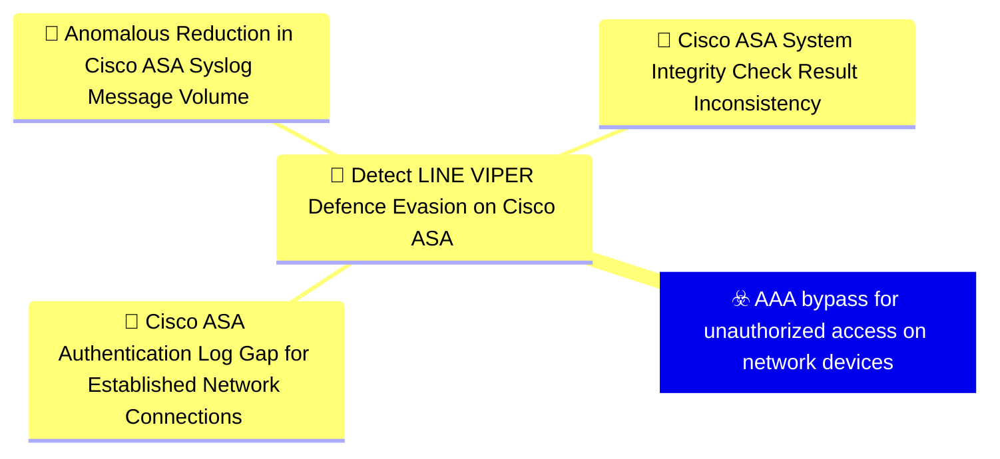
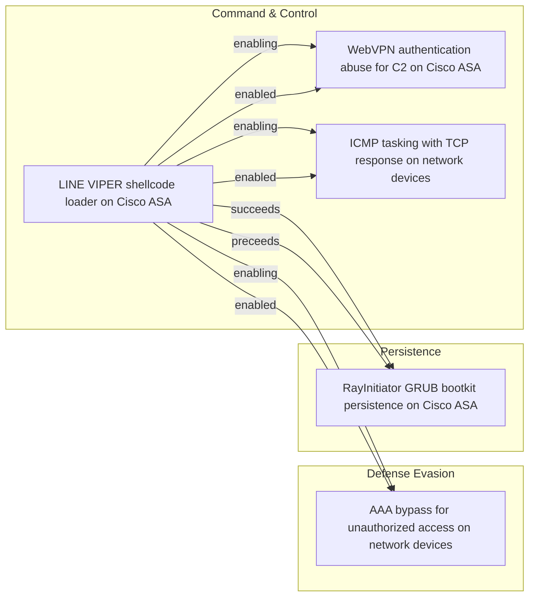

# ☣️ AAA bypass for unauthorized access on network devices

🔥 **Criticality:Severe** 🚨 : A Severe priority incident is likely to result in a significant impact to public health or safety, national security, economic security, foreign relations, or civil liberties. 

🚦 **TLP:CLEAR** ⚪ : Recipients can spread this to the world, there is no limit on disclosure.

🗡️ **ATT&CK Techniques** [T1562.001 : Impair Defenses: Disable or Modify Tools](https://attack.mitre.org/techniques/T1562/001 'Adversaries may modify andor disable security tools to avoid possible detection of their malwaretools and activities This may take many forms, such as'), [T1562 : Impair Defenses](https://attack.mitre.org/techniques/T1562 'Adversaries may maliciously modify components of a victim environment in order to hinder or disable defensive mechanisms This not only involves impair'), [T1556 : Modify Authentication Process](https://attack.mitre.org/techniques/T1556 'Adversaries may modify authentication mechanisms and processes to access user credentials or enable otherwise unwarranted access to accounts The authe'), [T1550 : Use Alternate Authentication Material](https://attack.mitre.org/techniques/T1550 'Adversaries may use alternate authentication material, such as password hashes, Kerberos tickets, and application access tokens, in order to move late')

---

`🔑 UUID : 53389577-fd8d-4ce6-9852-8365ed947c17` **|** `🏷️ Version : 1` **|** `🗓️ Creation Date : 2026-06-18` **|** `🗓️ Last Modification : 2026-06-18` **|** `Sharing Organisation : {'uuid': '56b0a0f0-b0bc-47d9-bb46-02f80ae2065a', 'name': 'EC DIGIT CSOC'}` **|** `🧱 Schema Identifier : tvm::2.1`

## 👁️ Description

> LINE VIPER implements a critical capability to bypass
> Authentication, Authorization, and Accounting (AAA) mechanisms on
> compromised Cisco ASA devices [1]. This allows actor-controlled
> devices to access the network infrastructure without proper
> authentication and without generating audit logs that would normally
> record access attempts.
> 
> #### AAA Mechanisms on Cisco ASA
> 
> Cisco ASA devices implement AAA as a fundamental security control
> for managing access to network resources. The three components work
> together to:
> 
> - **Authentication:** Verify the identity of users and devices
>   attempting to access the network or device management interfaces.
> 
> - **Authorization:** Determine what authenticated users and devices
>   are permitted to access, based on defined policies and access
>   control lists.
> 
> - **Accounting:** Record access attempts, commands executed, and
>   other activities for audit and compliance purposes.
> 
> Bypassing AAA effectively removes all three layers of this security
> control, providing unfettered access to the network infrastructure.
> 
> #### Implementation and Impact
> 
> LINE VIPER's AAA bypass capability operates at the system level
> within the compromised Cisco ASA device [1]. The malware modifies
> authentication processing to recognise actor-controlled devices and
> grant them access without proper validation.
> 
> **No Authentication Logs:** A critical aspect of this bypass is that
> it prevents the generation of authentication logs for actor devices.
> This provides significant operational security benefits:
> 
> - **Stealth Access:** Administrators reviewing authentication logs
>   will not see any suspicious access attempts or successful logins
>   from attacker infrastructure.
> 
> - **Audit Trail Evasion:** Compliance and security audits that rely
>   on AAA logs will not detect unauthorised access.
> 
> - **Incident Response Blindness:** During incident response
>   activities, investigators cannot rely on authentication logs to
>   understand the scope of compromise or identify attacker
>   infrastructure.
> 
> - **Forensic Analysis Degradation:** The lack of authentication logs
>   significantly impairs forensic timeline construction and
>   attribution efforts.
> 
> #### Operational Advantages
> 
> The AAA bypass provides multiple advantages for maintaining
> persistent access to compromised network infrastructure [1]:
> 
> - **Persistent Administrative Access:** Actor-controlled devices can
>   access management interfaces without authentication, enabling
>   configuration changes, command execution, and data collection.
> 
> - **Network Pivoting:** Bypassing AAA on network security devices
>   allows attackers to pivot through the network infrastructure
>   without triggering authentication failures or alerts.
> 
> - **Policy Circumvention:** Authorisation policies that would
>   normally restrict access to sensitive network segments or
>   configurations can be completely bypassed.
> 
> - **Detection Evasion:** The absence of failed authentication
>   attempts removes a common indicator of malicious activity that
>   security monitoring systems typically alert on.
> 
> #### Context within LINE VIPER Capabilities
> 
> The AAA bypass capability is part of a broader set of defence
> evasion and system tampering capabilities in LINE VIPER [1]:
> 
> - Works in conjunction with syslog suppression to prevent detection
>   of unauthorised access and malicious activities.
> 
> - Complements the rootkit functionality that patches system
>   integrity checks to hide the malware's presence.
> 
> - Enables the CLI command execution capability to operate with
>   administrative privileges without authentication barriers.
> 
> The combination of AAA bypass with other LINE VIPER capabilities
> creates a comprehensive compromise of the network security device,
> effectively turning it into an attacker-controlled platform while
> maintaining the appearance of normal operation to administrators and
> security monitoring systems.
> 

## 🖥️ Terrain 

 > Cisco ASA devices with LINE VIPER malware deployed that has memory-
> resident hooks in the lina binary [1]. The malware operates with
> sufficient privileges to modify AAA processing logic at runtime,
> intercepting authentication requests before they reach legitimate
> AAA validation routines. This requires prior compromise through
> bootkit deployment that provides the necessary execution context and
> privileges.
> 

---

## 🕸️ Relations

### 🌊 OpenTide Objects

 **Descendants** 

| 🎯 Detection Objectives                                                                                                                                                                                                                                                                                      | 📡 Detection Objective Signals (3)                                                                                                                                                                                                                                                                                                                                                                                                                                                                                                                                                                                                                                                                                                                                                                                                                                                                                                                                                                                                                                                                                                                                                                                      | 🛡️ Detection Models    | 🚨 Detection Rules    |
|:------------------------------------------------------------------------------------------------------------------------------------------------------------------------------------------------------------------------------------------------------------------------------------------------------------|:-----------------------------------------------------------------------------------------------------------------------------------------------------------------------------------------------------------------------------------------------------------------------------------------------------------------------------------------------------------------------------------------------------------------------------------------------------------------------------------------------------------------------------------------------------------------------------------------------------------------------------------------------------------------------------------------------------------------------------------------------------------------------------------------------------------------------------------------------------------------------------------------------------------------------------------------------------------------------------------------------------------------------------------------------------------------------------------------------------------------------------------------------------------------------------------------------------------------------|:-----------------------|:---------------------|
| [Detect LINE VIPER Defence Evasion on Cisco ASA](../Detection%20Objectives/🎯%20Detect%20LINE%20VIPER%20Defence%20Evasion%20on%20Cisco%20ASA.md 'This detection objective addresses the defence evasion and anti-forensic capabilities of the LINE VIPER implant on Cisco ASA devices,specifically the ...') | [Detect LINE VIPER Defence Evasion on Cisco ASA::Cisco ASA Authentication Log Gap for Established Network Connections](Detect%20LINE%20VIPER%20Defence%20Evasion%20on%20Cisco%20ASA#cisco-asa-authentication-log-gap-for-established-network-connections.md 'Detects the absence of expected Cisco ASA AAA authenticationsyslog events for network connections that are otherwise visiblein traffic logs, indicatin...') [Detect LINE VIPER Defence Evasion on Cisco ASA::Anomalous Reduction in Cisco ASA Syslog Message Volume](Detect%20LINE%20VIPER%20Defence%20Evasion%20on%20Cisco%20ASA#anomalous-reduction-in-cisco-asa-syslog-message-volume.md 'Detects statistical anomalies in Cisco ASA syslog output volumeor message type distribution that may indicate LINE VIPERssyslog suppression capability...') [Detect LINE VIPER Defence Evasion on Cisco ASA::Cisco ASA System Integrity Check Result Inconsistency](Detect%20LINE%20VIPER%20Defence%20Evasion%20on%20Cisco%20ASA#cisco-asa-system-integrity-check-result-inconsistency.md 'Detects divergence between Cisco ASA on-device system integritycheck results and out-of-band verification of device imageintegrity, indicating LINE VI...') | ❌ No Detection Models  | ❌ No Detection Rules |

 --- 

### ⛓️ Threat Chaining

Expand chaining data

| ☣️ Vector                                                                                                                                                                                                                                                                                                            | ⛓️ Link              | 🎯 Target                                                                                                                                                                                                                                                                                                             | ⛰️ Terrain                                                                                                                                                                                                                                                                                                                                                                                                                                                            | 🗡️ ATT&CK                                                                                                                                                                                                                                                                                                                                                                                                                                                                                                                                                                                                                                                                                                                                                                                                                                                                                                                                                                                                                                                                                                                                                                                                                                                                                                                                                                                                                                                                                                         |
|:---------------------------------------------------------------------------------------------------------------------------------------------------------------------------------------------------------------------------------------------------------------------------------------------------------------------|:---------------------|:---------------------------------------------------------------------------------------------------------------------------------------------------------------------------------------------------------------------------------------------------------------------------------------------------------------------|:----------------------------------------------------------------------------------------------------------------------------------------------------------------------------------------------------------------------------------------------------------------------------------------------------------------------------------------------------------------------------------------------------------------------------------------------------------------------|:------------------------------------------------------------------------------------------------------------------------------------------------------------------------------------------------------------------------------------------------------------------------------------------------------------------------------------------------------------------------------------------------------------------------------------------------------------------------------------------------------------------------------------------------------------------------------------------------------------------------------------------------------------------------------------------------------------------------------------------------------------------------------------------------------------------------------------------------------------------------------------------------------------------------------------------------------------------------------------------------------------------------------------------------------------------------------------------------------------------------------------------------------------------------------------------------------------------------------------------------------------------------------------------------------------------------------------------------------------------------------------------------------------------------------------------------------------------------------------------------------------------|
| [LINE VIPER shellcode loader on Cisco ASA](../Threat%20Vectors/☣️%20LINE%20VIPER%20shellcode%20loader%20on%20Cisco%20ASA.md 'LINE VIPER is a sophisticated user-mode shellcode loader withassociated modules that targets Cisco ASA Adaptive SecurityAppliance devices It represent...')                             | `support::enabling`  | [AAA bypass for unauthorized access on network devices](../Threat%20Vectors/☣️%20AAA%20bypass%20for%20unauthorized%20access%20on%20network%20devices.md 'LINE VIPER implements a critical capability to bypassAuthentication, Authorization, and Accounting AAA mechanisms oncompromised Cisco ASA devices 1 Th...') | Cisco ASA devices with LINE VIPER malware deployed that has memory- resident hooks in the lina binary [1]. The malware operates with sufficient privileges to modify AAA processing logic at runtime, intercepting authentication requests before they reach legitimate AAA validation routines. This requires prior compromise through bootkit deployment that provides the necessary execution context and privileges.                                              | [T1562.001 : Impair Defenses: Disable or Modify Tools](https://attack.mitre.org/techniques/T1562/001 'Adversaries may modify andor disable security tools to avoid possible detection of their malwaretools and activities This may take many forms, such as'), [T1562 : Impair Defenses](https://attack.mitre.org/techniques/T1562 'Adversaries may maliciously modify components of a victim environment in order to hinder or disable defensive mechanisms This not only involves impair'), [T1556 : Modify Authentication Process](https://attack.mitre.org/techniques/T1556 'Adversaries may modify authentication mechanisms and processes to access user credentials or enable otherwise unwarranted access to accounts The authe'), [T1550 : Use Alternate Authentication Material](https://attack.mitre.org/techniques/T1550 'Adversaries may use alternate authentication material, such as password hashes, Kerberos tickets, and application access tokens, in order to move late')                                                                                                                                                                                                                                                                                                                                                                                                                                                                                                                   |
| [LINE VIPER shellcode loader on Cisco ASA](../Threat%20Vectors/☣️%20LINE%20VIPER%20shellcode%20loader%20on%20Cisco%20ASA.md 'LINE VIPER is a sophisticated user-mode shellcode loader withassociated modules that targets Cisco ASA Adaptive SecurityAppliance devices It represent...')                             | `support::enabling`  | [WebVPN authentication abuse for C2 on Cisco ASA](../Threat%20Vectors/☣️%20WebVPN%20authentication%20abuse%20for%20C2%20on%20Cisco%20ASA.md 'LINE VIPER implements a sophisticated command and control mechanismthat abuses legitimate WebVPN client authentication functionality onCisco ASA devic...')             | Cisco ASA devices with WebVPN functionality enabled and accessible to attacker infrastructure [1]. The WebVPN client authentication mechanism processes XML data containing device-id, version, and form elements through a large codebase in lina. This XML processing does not adequately validate or sanitise crafted authentication requests, allowing arbitrary data to be embedded in standard authentication fields like device-type within the XML structure. | [T1071.001 : Application Layer Protocol: Web Protocols](https://attack.mitre.org/techniques/T1071/001 'Adversaries may communicate using application layer protocols associated with web traffic to avoid detectionnetwork filtering by blending in with exis'), [T1573.001 : Encrypted Channel: Symmetric Cryptography](https://attack.mitre.org/techniques/T1573/001 'Adversaries may employ a known symmetric encryption algorithm to conceal command and control traffic rather than relying on any inherent protections p'), [T1573.002 : Encrypted Channel: Asymmetric Cryptography](https://attack.mitre.org/techniques/T1573/002 'Adversaries may employ a known asymmetric encryption algorithm to conceal command and control traffic rather than relying on any inherent protections '), [T1090 : Proxy](https://attack.mitre.org/techniques/T1090 'Adversaries may use a connection proxy to direct network traffic between systems or act as an intermediary for network communications to a command and')                                                                                                                                                                                                                                                                                                                                                                                                                                                                                           |
| [LINE VIPER shellcode loader on Cisco ASA](../Threat%20Vectors/☣️%20LINE%20VIPER%20shellcode%20loader%20on%20Cisco%20ASA.md 'LINE VIPER is a sophisticated user-mode shellcode loader withassociated modules that targets Cisco ASA Adaptive SecurityAppliance devices It represent...')                             | `support::enabling`  | [ICMP tasking with TCP response on network devices](../Threat%20Vectors/☣️%20ICMP%20tasking%20with%20TCP%20response%20on%20network%20devices.md 'LINE VIPER implements a sophisticated alternative command andcontrol mechanism that uses ICMP Internet Control Message Protocolfor receiving tasking c...')         | Network configurations where ICMP traffic is permitted to reach Cisco ASA LAN interfaces, particularly through established VPN tunnels [1]. In observed operations, ICMP tasking is not sent to the WAN interface but instead tunnelled through an established VPN session to a LAN interface. The VPN connection allows actor- controlled systems within the local network to send ICMP Echo Requests that bypass traditional WAN-focused network monitoring.        | [T1095](https://attack.mitre.org/techniques/T1095 'Adversaries may use an OSI non-application layer protocol for communication between host and C2 server or among infected hosts within a network The li'), [T1571](https://attack.mitre.org/techniques/T1571 'Adversaries may communicate using a protocol and port pairing that are typically not associated For example, HTTPS over port 8088Citation Symantec Elf'), [T1573.001](https://attack.mitre.org/techniques/T1573/001 'Adversaries may employ a known symmetric encryption algorithm to conceal command and control traffic rather than relying on any inherent protections p'), [T1573.002](https://attack.mitre.org/techniques/T1573/002 'Adversaries may employ a known asymmetric encryption algorithm to conceal command and control traffic rather than relying on any inherent protections '), [T1480.001](https://attack.mitre.org/techniques/T1480/001 'Adversaries may environmentally key payloads or other features of malware to evade defenses and constraint execution to a specific target environment ')                                                                                                                                                                                                                                                                                                                                                                                                                           |
| [LINE VIPER shellcode loader on Cisco ASA](../Threat%20Vectors/☣️%20LINE%20VIPER%20shellcode%20loader%20on%20Cisco%20ASA.md 'LINE VIPER is a sophisticated user-mode shellcode loader withassociated modules that targets Cisco ASA Adaptive SecurityAppliance devices It represent...')                             | `sequence::succeeds` | [RayInitiator GRUB bootkit persistence on Cisco ASA](../Threat%20Vectors/☣️%20RayInitiator%20GRUB%20bootkit%20persistence%20on%20Cisco%20ASA.md 'RayInitiator is a sophisticated persistent multi-stage bootkit thatfacilitates the deployment of LINE VIPER malware to Cisco ASAAdaptive Security Appl...')         | Cisco ASA 5500-X series devices without secure boot technology, lacking cryptographic verification of early boot software [1]. These models were released in 2012 with an End of Life notice issued by Cisco in 2020. All observed targeted models have either passed their last day of support or reach end of support September 30, 2025 [1]. The absence of secure boot allows arbitrary modification of the GRUB bootloader without cryptographic validation.     | [T1542.003 : Pre-OS Boot: Bootkit](https://attack.mitre.org/techniques/T1542/003 'Adversaries may use bootkits to persist on systems A bootkit is a malware variant that modifies the boot sectors of a hard drive, allowing malicious c'), [T1601.001 : Modify System Image: Patch System Image](https://attack.mitre.org/techniques/T1601/001 'Adversaries may modify the operating system of a network device to introduce new capabilities or weaken existing defensesCitation Killing the myth of '), [T1542.001 : Pre-OS Boot: System Firmware](https://attack.mitre.org/techniques/T1542/001 'Adversaries may modify system firmware to persist on systemsThe BIOS Basic InputOutput System and The Unified Extensible Firmware Interface UEFI or Ex')                                                                                                                                                                                                                                                                                                                                                                                                                                                                                                                                                                                                                                                                                                                                                     |
| [RayInitiator GRUB bootkit persistence on Cisco ASA](../Threat%20Vectors/☣️%20RayInitiator%20GRUB%20bootkit%20persistence%20on%20Cisco%20ASA.md 'RayInitiator is a sophisticated persistent multi-stage bootkit thatfacilitates the deployment of LINE VIPER malware to Cisco ASAAdaptive Security Appl...')         | `sequence::preceeds` | [LINE VIPER shellcode loader on Cisco ASA](../Threat%20Vectors/☣️%20LINE%20VIPER%20shellcode%20loader%20on%20Cisco%20ASA.md 'LINE VIPER is a sophisticated user-mode shellcode loader withassociated modules that targets Cisco ASA Adaptive SecurityAppliance devices It represent...')                             | Compromised Cisco ASA devices running firmware versions 9.12(4)67 and 9.14(4)24, which were fully patched at time of discovery [1]. Requires prior deployment of RayInitiator bootkit which installs hooks into lina binary to intercept WebVPN XML form element processing. The WebVPN traffic handling codebase in lina processes XML data that can be weaponised to load shellcode when specific form elements are encountered.                                    | [T1059.008](https://attack.mitre.org/techniques/T1059/008 'Adversaries may abuse scripting or built-in command line interpreters CLI on network devices to execute malicious command and payloads The CLI is the '), [T1014](https://attack.mitre.org/techniques/T1014 'Adversaries may use rootkits to hide the presence of programs, files, network connections, services, drivers, and other system components Rootkits are'), [T1562.001](https://attack.mitre.org/techniques/T1562/001 'Adversaries may modify andor disable security tools to avoid possible detection of their malwaretools and activities This may take many forms, such as'), [T1562](https://attack.mitre.org/techniques/T1562 'Adversaries may maliciously modify components of a victim environment in order to hinder or disable defensive mechanisms This not only involves impair'), [T1202](https://attack.mitre.org/techniques/T1202 'Adversaries may abuse utilities that allow for command execution to bypass security restrictions that limit the use of command-line interpreters Vario'), [T1040](https://attack.mitre.org/techniques/T1040 'Adversaries may passively sniff network traffic to capture information about an environment, including authentication material passed over the network'), [T1480.001](https://attack.mitre.org/techniques/T1480/001 'Adversaries may environmentally key payloads or other features of malware to evade defenses and constraint execution to a specific target environment ') |
| [WebVPN authentication abuse for C2 on Cisco ASA](../Threat%20Vectors/☣️%20WebVPN%20authentication%20abuse%20for%20C2%20on%20Cisco%20ASA.md 'LINE VIPER implements a sophisticated command and control mechanismthat abuses legitimate WebVPN client authentication functionality onCisco ASA devic...')             | `support::enabled`   | [LINE VIPER shellcode loader on Cisco ASA](../Threat%20Vectors/☣️%20LINE%20VIPER%20shellcode%20loader%20on%20Cisco%20ASA.md 'LINE VIPER is a sophisticated user-mode shellcode loader withassociated modules that targets Cisco ASA Adaptive SecurityAppliance devices It represent...')                             | Compromised Cisco ASA devices running firmware versions 9.12(4)67 and 9.14(4)24, which were fully patched at time of discovery [1]. Requires prior deployment of RayInitiator bootkit which installs hooks into lina binary to intercept WebVPN XML form element processing. The WebVPN traffic handling codebase in lina processes XML data that can be weaponised to load shellcode when specific form elements are encountered.                                    | [T1059.008](https://attack.mitre.org/techniques/T1059/008 'Adversaries may abuse scripting or built-in command line interpreters CLI on network devices to execute malicious command and payloads The CLI is the '), [T1014](https://attack.mitre.org/techniques/T1014 'Adversaries may use rootkits to hide the presence of programs, files, network connections, services, drivers, and other system components Rootkits are'), [T1562.001](https://attack.mitre.org/techniques/T1562/001 'Adversaries may modify andor disable security tools to avoid possible detection of their malwaretools and activities This may take many forms, such as'), [T1562](https://attack.mitre.org/techniques/T1562 'Adversaries may maliciously modify components of a victim environment in order to hinder or disable defensive mechanisms This not only involves impair'), [T1202](https://attack.mitre.org/techniques/T1202 'Adversaries may abuse utilities that allow for command execution to bypass security restrictions that limit the use of command-line interpreters Vario'), [T1040](https://attack.mitre.org/techniques/T1040 'Adversaries may passively sniff network traffic to capture information about an environment, including authentication material passed over the network'), [T1480.001](https://attack.mitre.org/techniques/T1480/001 'Adversaries may environmentally key payloads or other features of malware to evade defenses and constraint execution to a specific target environment ') |
| [ICMP tasking with TCP response on network devices](../Threat%20Vectors/☣️%20ICMP%20tasking%20with%20TCP%20response%20on%20network%20devices.md 'LINE VIPER implements a sophisticated alternative command andcontrol mechanism that uses ICMP Internet Control Message Protocolfor receiving tasking c...')         | `support::enabled`   | [LINE VIPER shellcode loader on Cisco ASA](../Threat%20Vectors/☣️%20LINE%20VIPER%20shellcode%20loader%20on%20Cisco%20ASA.md 'LINE VIPER is a sophisticated user-mode shellcode loader withassociated modules that targets Cisco ASA Adaptive SecurityAppliance devices It represent...')                             | Compromised Cisco ASA devices running firmware versions 9.12(4)67 and 9.14(4)24, which were fully patched at time of discovery [1]. Requires prior deployment of RayInitiator bootkit which installs hooks into lina binary to intercept WebVPN XML form element processing. The WebVPN traffic handling codebase in lina processes XML data that can be weaponised to load shellcode when specific form elements are encountered.                                    | [T1059.008](https://attack.mitre.org/techniques/T1059/008 'Adversaries may abuse scripting or built-in command line interpreters CLI on network devices to execute malicious command and payloads The CLI is the '), [T1014](https://attack.mitre.org/techniques/T1014 'Adversaries may use rootkits to hide the presence of programs, files, network connections, services, drivers, and other system components Rootkits are'), [T1562.001](https://attack.mitre.org/techniques/T1562/001 'Adversaries may modify andor disable security tools to avoid possible detection of their malwaretools and activities This may take many forms, such as'), [T1562](https://attack.mitre.org/techniques/T1562 'Adversaries may maliciously modify components of a victim environment in order to hinder or disable defensive mechanisms This not only involves impair'), [T1202](https://attack.mitre.org/techniques/T1202 'Adversaries may abuse utilities that allow for command execution to bypass security restrictions that limit the use of command-line interpreters Vario'), [T1040](https://attack.mitre.org/techniques/T1040 'Adversaries may passively sniff network traffic to capture information about an environment, including authentication material passed over the network'), [T1480.001](https://attack.mitre.org/techniques/T1480/001 'Adversaries may environmentally key payloads or other features of malware to evade defenses and constraint execution to a specific target environment ') |
| [AAA bypass for unauthorized access on network devices](../Threat%20Vectors/☣️%20AAA%20bypass%20for%20unauthorized%20access%20on%20network%20devices.md 'LINE VIPER implements a critical capability to bypassAuthentication, Authorization, and Accounting AAA mechanisms oncompromised Cisco ASA devices 1 Th...') | `support::enabled`   | [LINE VIPER shellcode loader on Cisco ASA](../Threat%20Vectors/☣️%20LINE%20VIPER%20shellcode%20loader%20on%20Cisco%20ASA.md 'LINE VIPER is a sophisticated user-mode shellcode loader withassociated modules that targets Cisco ASA Adaptive SecurityAppliance devices It represent...')                             | Compromised Cisco ASA devices running firmware versions 9.12(4)67 and 9.14(4)24, which were fully patched at time of discovery [1]. Requires prior deployment of RayInitiator bootkit which installs hooks into lina binary to intercept WebVPN XML form element processing. The WebVPN traffic handling codebase in lina processes XML data that can be weaponised to load shellcode when specific form elements are encountered.                                    | [T1059.008](https://attack.mitre.org/techniques/T1059/008 'Adversaries may abuse scripting or built-in command line interpreters CLI on network devices to execute malicious command and payloads The CLI is the '), [T1014](https://attack.mitre.org/techniques/T1014 'Adversaries may use rootkits to hide the presence of programs, files, network connections, services, drivers, and other system components Rootkits are'), [T1562.001](https://attack.mitre.org/techniques/T1562/001 'Adversaries may modify andor disable security tools to avoid possible detection of their malwaretools and activities This may take many forms, such as'), [T1562](https://attack.mitre.org/techniques/T1562 'Adversaries may maliciously modify components of a victim environment in order to hinder or disable defensive mechanisms This not only involves impair'), [T1202](https://attack.mitre.org/techniques/T1202 'Adversaries may abuse utilities that allow for command execution to bypass security restrictions that limit the use of command-line interpreters Vario'), [T1040](https://attack.mitre.org/techniques/T1040 'Adversaries may passively sniff network traffic to capture information about an environment, including authentication material passed over the network'), [T1480.001](https://attack.mitre.org/techniques/T1480/001 'Adversaries may environmentally key payloads or other features of malware to evade defenses and constraint execution to a specific target environment ') |

&nbsp; 

---

## Model Data

#### **⛓️ Cyber Kill Chain**

 > Cyber attacks are typically phased progressions towards strategic objectives. The Unified Kill Chains provides insight into the tactics that hackers employ to attain these objectives. This provides a solid basis to develop (or realign) defensive strategies to raise cyber resilience.

 [`🏃🏽 Defense Evasion`](https://www.unifiedkillchain.com/assets/The-Unified-Kill-Chain.pdf) : Techniques an attacker may specifically use for evading detection or avoiding other defenses.

---

#### **🛰️ Domains [DEPRECATED]**

 > Infrastructure technologies domain of interest to attackers.

  - `🏢 Enterprise` : Generic databases, applications, machines and systems that are usually on premises or on Cloud traditional VMs.
 - `🌐 Networking` : Communications backbone connecting users, applications and machines.

---

#### **🎯 Targets [DEPRECATED]**

 > Granular delimited technical entities holding a value to the organization, that are targeted by adversaries. They might be also involved in the detection coverage as the target of log collection. Partially inspired by Veris.

  - [`🌐 Network Equipment`](http://veriscommunity.net/enums.html#section-asset) : Placeholder
 - [`🔑 Server Authentication`](http://veriscommunity.net/enums.html#section-asset) : Server - Authentication

---

#### **💿 Platforms concerned [DEPRECATED]**

 > Actual technologies used by the organization that will be exploited by adversaries during a successful attack, and eventually of relevance for detection. Are named by commercial designation.

 ` Network Router` : Placeholder

---

#### **💣 Severity**

 > The severity summarizes the overall danger of incident the vector will provoke, and is to be derived (WIP) from impact, leverage, and difficulty to execute.

 [`🔥 Substantial incident`](https://www.ncsc.gov.uk/news/new-cyber-attack-categorisation-system-improve-uk-response-incidents) : A cyber attack which has a serious impact on a medium-sized organisation, or which poses a considerable risk to a large organisation or wider / local government.

---

#### **🪄 Leverage acquisition**

 > Technical aftermath of the attack from the target perspective, differentiated from impact as it does not consider the value of the consequence, only what increased control the vector execution provides to the adversary.

  - [`💅 Elevation of privilege`](https://owasp.org/www-community/Threat_Modeling_Process#stride) : Capacity to augment leverage over the target system by upgrading the compromised access rights
 - [`🗿 Repudiation`](https://owasp.org/www-community/Threat_Modeling_Process#stride) : Threat action aimed at performing prohibited operations in a system that lacks the ability to trace the operations.
 - [`💀 Infrastructure Compromise`](https://owasp.org/www-community/Threat_Modeling_Process#stride) : The compromised target is likely to be used to further expand the sphere of influence of the attacker and allow more potent vectors to be executed.
 - [`🐒 Tampering`](https://owasp.org/www-community/Threat_Modeling_Process#stride) : Threat action intending to maliciously change or modify persistent data, such as records in a database, and the alteration of data in transit between two computers over an open network, such as the Internet.

---

#### **💥 Impact**

 > Analysis of the threat vector from the organizational perspective, in non technical term. This aims at putting a clear denomination on what the attacker will actually be able to act upon if the threat vector is realized.

  - [`🤬 Lose Capabilities`](http://veriscommunity.net/enums.html#section-impact) : Vector execution will remove key functions to the organization, which will not be easily circumvented. Most day-to-day is heavily impaired, but processes can reorganize at a loss.
 - [`🎖️ National Security`](http://veriscommunity.net/enums.html#section-impact) : The vector execution will expose or destroy such sufficient critical information infrastructure that the country will have to intervene due to loss to key national  or international functions.
 - [`🌍 Reputational Damages`](http://veriscommunity.net/enums.html#section-impact) : Damages to the organization public view may be achieved by using directly the access gained, or indirectly with data gathered.
 - [`🔓 Data Breach`](http://veriscommunity.net/enums.html#section-impact) : Non-public information has been accessed from the outside, and successfully extracted.

---

#### **🎲 Vector Viability**

 > Described with estimative language (likelyhood probability), describes how likely the analyst believes the vector to actually be realized on the organization infrastructure. Estimative language describes quality and credibility of underlying sources, data, and methodologies based Intelligence Community Directive 203 (ICD 203) and JP 2-0, Joint Intelligence.

 [`🧐 Likely`](https://www.dni.gov/files/documents/ICD/ICD%20203%20Analytic%20Standards.pdf) : Probable (probably) - 55-80%

---

### 🔗 References

**🕊️ Publicly available resources**

- [_1_] https://www.ncsc.gov.uk/static-assets/documents/malware-analysis-reports/RayInitiator-LINE-VIPER/ncsc-mar-rayinitiator-line-viper.pdf

[1]: https://www.ncsc.gov.uk/static-assets/documents/malware-analysis-reports/RayInitiator-LINE-VIPER/ncsc-mar-rayinitiator-line-viper.pdf

---

#### 🏷️ Tags

#-, #-, #-, #
, #
, ##, ##, ##, ##, # , #🏷, #️, # , #T, #a, #g, #s, #
, #

