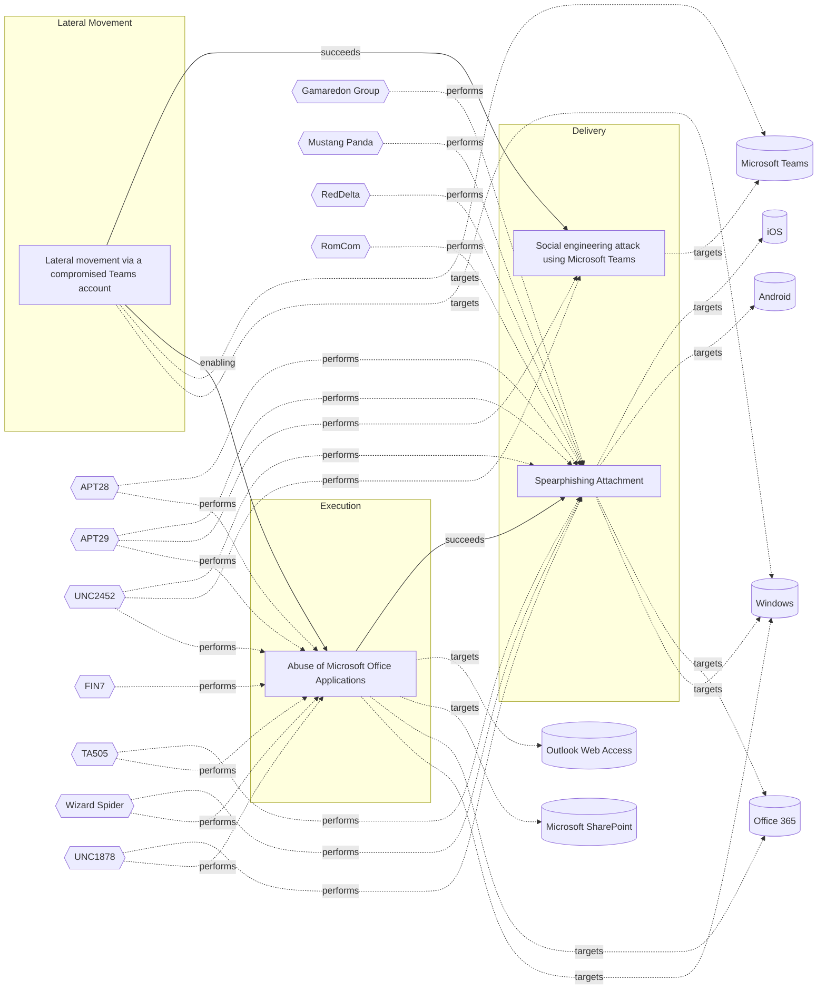

# ☣️ Abuse of Microsoft Office Applications

🔥 **Criticality:Medium** ❗ : A Medium priority incident may affect public health or safety, national security, economic security, foreign relations, civil liberties, or public confidence. 

🚦 **TLP:CLEAR** ⚪ : Recipients can spread this to the world, there is no limit on disclosure.

🗡️ **ATT&CK Techniques** [T1059.005 : Command and Scripting Interpreter: Visual Basic](https://attack.mitre.org/techniques/T1059/005 'Adversaries may abuse Visual Basic VB for execution VB is a programming language created by Microsoft with interoperability with many Windows technolo'), [T1204.002 : User Execution: Malicious File](https://attack.mitre.org/techniques/T1204/002 'An adversary may rely upon a user opening a malicious file in order to gain execution Users may be subjected to social engineering to get them to open'), [T1137 : Office Application Startup](https://attack.mitre.org/techniques/T1137 'Adversaries may leverage Microsoft Office-based applications for persistence between startups Microsoft Office is a fairly common application suite on'), [T1203 : Exploitation for Client Execution](https://attack.mitre.org/techniques/T1203 'Adversaries may exploit software vulnerabilities in client applications to execute code Vulnerabilities can exist in software due to unsecure coding p')

---

`🔑 UUID : b663b684-a80f-4570-89b6-2f7faa16fece` **|** `🏷️ Version : 1` **|** `🗓️ Creation Date : 2024-10-31` **|** `🗓️ Last Modification : 2024-10-31` **|** `Sharing Organisation : {'uuid': '56b0a0f0-b0bc-47d9-bb46-02f80ae2065a', 'name': 'EC DIGIT CSOC'}` **|** `🧱 Schema Identifier : tvm::2.0`

## 👁️ Description

> An employee named receives an email that appears to be from a trusted business 
> partner or colleague. The email contains an office document. The end-user clic on it.
> 
> The attached file, is a macro-enabled Word document. It usually pops-up with 
> the following message :
> "This document was created in an earlier version of Microsoft Word. 
> Please click 'Enable Content' above to view the full document."
> 
> This message is designed to entice end-user to enable macros or active content, 
> which is disabled by default for security reasons.
> 
> By clicking ont it, it allows the embedded macro, written in 
> Visual Basic for Applications (VBA), to execute without further prompts.
> 
> Once executed, the macro initiates a hidden process that launches Windows PowerShell, 
> which run:
> 
> - Run silently without displaying a window to the user.
> - Bypass execution policies that normally restrict script running.
> - Connect to an external server controlled by the attacker.
> - Download and execute additional malicious code or a payload.
> 
> Threat actors may also modify Windows Registry settings related to 
> Microsoft Office security.
> 
> - Disabling the COM Kill Bit: This involves changing registry values 
> that control the activation of certain COM objects or ActiveX controls 
> within Office applications. By disabling the "kill bit," the threat actor 
> re-enables outdated or vulnerable components that can be exploited.
> 
> - Altering Macro Security Settings: Changing registry keys to lower the 
> macro security level, allowing macros to run without prompts in the future.
> 
> To maintain long-term access to the compromised system, 
> the attacker may target Microsoft Outlook.
> 
> - Embedding Malicious Code in Outlook's VBA Project:
> - The attacker adds VBA code to Outlook's VbaProject.otm file.
> This code executes every time Outlook starts, performing actions without the user's knowledge.

## 🖥️ Terrain 

 > Target systems must have Microsoft Office applications installed with macros 
> enabled or be susceptible to social engineering tactics that prompt users 
> to enable macros or execute malicious content.
> 

---

## 🕸️ Relations

### 🐲 Actors sightings 

| Actor               | Description                                                                                                                                                                                                                                                                                                                                                                                                                                                                                                                                                                                                                                                                                                                                                                                                                                                                                                                                                                                                                                                                                                                                                                                                                                                                                                                                                                                                                                                                                                                                                                                                                                                                                                                                          | Aliases                                                                                                                                                                                                                                                                                                   | Source                     | Sighting               | Reference                |
|:--------------------|:-----------------------------------------------------------------------------------------------------------------------------------------------------------------------------------------------------------------------------------------------------------------------------------------------------------------------------------------------------------------------------------------------------------------------------------------------------------------------------------------------------------------------------------------------------------------------------------------------------------------------------------------------------------------------------------------------------------------------------------------------------------------------------------------------------------------------------------------------------------------------------------------------------------------------------------------------------------------------------------------------------------------------------------------------------------------------------------------------------------------------------------------------------------------------------------------------------------------------------------------------------------------------------------------------------------------------------------------------------------------------------------------------------------------------------------------------------------------------------------------------------------------------------------------------------------------------------------------------------------------------------------------------------------------------------------------------------------------------------------------------------|:----------------------------------------------------------------------------------------------------------------------------------------------------------------------------------------------------------------------------------------------------------------------------------------------------------|:---------------------------|:-----------------------|:-------------------------|
| [Mobile] APT28      | [APT28](https://attack.mitre.org/groups/G0007) is a threat group that has been attributed to Russia's General Staff Main Intelligence Directorate (GRU) 85th Main Special Service Center (GTsSS) military unit 26165.(Citation: NSA/FBI Drovorub August 2020)(Citation: Cybersecurity Advisory GRU Brute Force Campaign July 2021) This group has been active since at least 2004.(Citation: DOJ GRU Indictment Jul 2018)(Citation: Ars Technica GRU indictment Jul 2018)(Citation: Crowdstrike DNC June 2016)(Citation: FireEye APT28)(Citation: SecureWorks TG-4127)(Citation: FireEye APT28 January 2017)(Citation: GRIZZLY STEPPE JAR)(Citation: Sofacy DealersChoice)(Citation: Palo Alto Sofacy 06-2018)(Citation: Symantec APT28 Oct 2018)(Citation: ESET Zebrocy May 2019)[APT28](https://attack.mitre.org/groups/G0007) reportedly compromised the Hillary Clinton campaign, the Democratic National Committee, and the Democratic Congressional Campaign Committee in 2016 in an attempt to interfere with the U.S. presidential election.(Citation: Crowdstrike DNC June 2016) In 2018, the US indicted five GRU Unit 26165 officers associated with [APT28](https://attack.mitre.org/groups/G0007) for cyber operations (including close-access operations) conducted between 2014 and 2018 against the World Anti-Doping Agency (WADA), the US Anti-Doping Agency, a US nuclear facility, the Organization for the Prohibition of Chemical Weapons (OPCW), the Spiez Swiss Chemicals Laboratory, and other organizations.(Citation: US District Court Indictment GRU Oct 2018) Some of these were conducted with the assistance of GRU Unit 74455, which is also referred to as [Sandworm Team](https://attack.mitre.org/groups/G0034). | FROZENLAKE, Fancy Bear, Forest Blizzard, Group 74, GruesomeLarch, IRON TWILIGHT, Pawn Storm, SNAKEMACKEREL, STRONTIUM, Sednit, Sofacy, Swallowtail, TG-4127, Threat Group-4127, Tsar Team                                                                                                                 | 🗡️ MITRE ATT&CK Groups     | No documented sighting | No documented references |
| APT28               | The Sofacy Group (also known as APT28, Pawn Storm, Fancy Bear and Sednit) is a cyber espionage group believed to have ties to the Russian government. Likely operating since 2007, the group is known to target government, military, and security organizations. It has been characterized as an advanced persistent threat.                                                                                                                                                                                                                                                                                                                                                                                                                                                                                                                                                                                                                                                                                                                                                                                                                                                                                                                                                                                                                                                                                                                                                                                                                                                                                                                                                                                                                        | Pawn Storm, FANCY BEAR, Sednit, SNAKEMACKEREL, Tsar Team, TG-4127, STRONTIUM, Swallowtail, IRON TWILIGHT, Group 74, SIG40, Grizzly Steppe, G0007, ATK5, Fighting Ursa, ITG05, Blue Athena, TA422, T-APT-12, APT-C-20, UAC-0028, FROZENLAKE, Sofacy, Forest Blizzard, BlueDelta, Fancy Bear, GruesomeLarch | 🌌 MISP Threat Actor Galaxy | No documented sighting | No documented references |
| [Enterprise] APT29  | [APT29](https://attack.mitre.org/groups/G0016) is threat group that has been attributed to Russia's Foreign Intelligence Service (SVR).(Citation: White House Imposing Costs RU Gov April 2021)(Citation: UK Gov Malign RIS Activity April 2021) They have operated since at least 2008, often targeting government networks in Europe and NATO member countries, research institutes, and think tanks. [APT29](https://attack.mitre.org/groups/G0016) reportedly compromised the Democratic National Committee starting in the summer of 2015.(Citation: F-Secure The Dukes)(Citation: GRIZZLY STEPPE JAR)(Citation: Crowdstrike DNC June 2016)(Citation: UK Gov UK Exposes Russia SolarWinds April 2021)In April 2021, the US and UK governments attributed the [SolarWinds Compromise](https://attack.mitre.org/campaigns/C0024) to the SVR; public statements included citations to [APT29](https://attack.mitre.org/groups/G0016), Cozy Bear, and The Dukes.(Citation: NSA Joint Advisory SVR SolarWinds April 2021)(Citation: UK NSCS Russia SolarWinds April 2021) Industry reporting also referred to the actors involved in this campaign as UNC2452, NOBELIUM, StellarParticle, Dark Halo, and SolarStorm.(Citation: FireEye SUNBURST Backdoor December 2020)(Citation: MSTIC NOBELIUM Mar 2021)(Citation: CrowdStrike SUNSPOT Implant January 2021)(Citation: Volexity SolarWinds)(Citation: Cybersecurity Advisory SVR TTP May 2021)(Citation: Unit 42 SolarStorm December 2020)                                                                                                                                                                                                                                                         | Blue Kitsune, Cozy Bear, CozyDuke, Dark Halo, IRON HEMLOCK, IRON RITUAL, Midnight Blizzard, NOBELIUM, NobleBaron, SolarStorm, The Dukes, UNC2452, UNC3524, YTTRIUM                                                                                                                                        | 🗡️ MITRE ATT&CK Groups     | No documented sighting | No documented references |
| UNC2452             | Reporting regarding activity related to the SolarWinds supply chain injection has grown quickly since initial disclosure on 13 December 2020. A significant amount of press reporting has focused on the identification of the actor(s) involved, victim organizations, possible campaign timeline, and potential impact. The US Government and cyber community have also provided detailed information on how the campaign was likely conducted and some of the malware used.  MITRE’s ATT&CK team — with the assistance of contributors — has been mapping techniques used by the actor group, referred to as UNC2452/Dark Halo by FireEye and Volexity respectively, as well as SUNBURST and TEARDROP malware.                                                                                                                                                                                                                                                                                                                                                                                                                                                                                                                                                                                                                                                                                                                                                                                                                                                                                                                                                                                                                                    | DarkHalo, StellarParticle, NOBELIUM, Solar Phoenix, Midnight Blizzard                                                                                                                                                                                                                                     | 🌌 MISP Threat Actor Galaxy | No documented sighting | No documented references |
| [ICS] FIN7          | [FIN7](https://attack.mitre.org/groups/G0046) is a financially-motivated threat group that has been active since 2013. [FIN7](https://attack.mitre.org/groups/G0046) has primarily targeted the retail, restaurant, hospitality, software, consulting, financial services, medical equipment, cloud services, media, food and beverage, transportation, and utilities industries in the U.S. A portion of [FIN7](https://attack.mitre.org/groups/G0046) was run out of a front company called Combi Security and often used point-of-sale malware for targeting efforts. Since 2020, [FIN7](https://attack.mitre.org/groups/G0046) shifted operations to a big game hunting (BGH) approach including use of [REvil](https://attack.mitre.org/software/S0496) ransomware and their own Ransomware as a Service (RaaS), Darkside. FIN7 may be linked to the [Carbanak](https://attack.mitre.org/groups/G0008) Group, but there appears to be several groups using [Carbanak](https://attack.mitre.org/software/S0030) malware and are therefore tracked separately.(Citation: FireEye FIN7 March 2017)(Citation: FireEye FIN7 April 2017)(Citation: FireEye CARBANAK June 2017)(Citation: FireEye FIN7 Aug 2018)(Citation: CrowdStrike Carbon Spider August 2021)(Citation: Mandiant FIN7 Apr 2022)                                                                                                                                                                                                                                                                                                                                                                                                                                                    | Carbon Spider, ELBRUS, GOLD NIAGARA, ITG14, Sangria Tempest                                                                                                                                                                                                                                               | 🗡️ MITRE ATT&CK Groups     | No documented sighting | No documented references |
| FIN7                | Groups targeting financial organizations or people with significant financial assets.                                                                                                                                                                                                                                                                                                                                                                                                                                                                                                                                                                                                                                                                                                                                                                                                                                                                                                                                                                                                                                                                                                                                                                                                                                                                                                                                                                                                                                                                                                                                                                                                                                                                | CARBON SPIDER, GOLD NIAGARA, Calcium, ATK32, G0046, G0008, Coreid, Carbanak, Sangria Tempest, ELBRUS, Carbon Spider, JokerStash                                                                                                                                                                           | 🌌 MISP Threat Actor Galaxy | No documented sighting | No documented references |
| [Enterprise] TA505  | [TA505](https://attack.mitre.org/groups/G0092) is a cyber criminal group that has been active since at least 2014. [TA505](https://attack.mitre.org/groups/G0092) is known for frequently changing malware, driving global trends in criminal malware distribution, and ransomware campaigns involving [Clop](https://attack.mitre.org/software/S0611).(Citation: Proofpoint TA505 Sep 2017)(Citation: Proofpoint TA505 June 2018)(Citation: Proofpoint TA505 Jan 2019)(Citation: NCC Group TA505)(Citation: Korean FSI TA505 2020)                                                                                                                                                                                                                                                                                                                                                                                                                                                                                                                                                                                                                                                                                                                                                                                                                                                                                                                                                                                                                                                                                                                                                                                                                  | CHIMBORAZO, Hive0065, Spandex Tempest                                                                                                                                                                                                                                                                     | 🗡️ MITRE ATT&CK Groups     | No documented sighting | No documented references |
| TA505               | TA505, the name given by Proofpoint, has been in the cybercrime business for at least four years. This is the group behind the infamous Dridex banking trojan and Locky ransomware, delivered through malicious email campaigns via Necurs botnet. Other malware associated with TA505 include Philadelphia and GlobeImposter ransomware families.                                                                                                                                                                                                                                                                                                                                                                                                                                                                                                                                                                                                                                                                                                                                                                                                                                                                                                                                                                                                                                                                                                                                                                                                                                                                                                                                                                                                   | SectorJ04, SectorJ04 Group, GRACEFUL SPIDER, GOLD TAHOE, Dudear, G0092, ATK103, Hive0065, CHIMBORAZO, Spandex Tempest                                                                                                                                                                                     | 🌌 MISP Threat Actor Galaxy | No documented sighting | No documented references |
| [ICS] Wizard Spider | [Wizard Spider](https://attack.mitre.org/groups/G0102) is a Russia-based financially motivated threat group originally known for the creation and deployment of [TrickBot](https://attack.mitre.org/software/S0266) since at least 2016. [Wizard Spider](https://attack.mitre.org/groups/G0102) possesses a diverse arsenal of tools and has conducted ransomware campaigns against a variety of organizations, ranging from major corporations to hospitals.(Citation: CrowdStrike Ryuk January 2019)(Citation: DHS/CISA Ransomware Targeting Healthcare October 2020)(Citation: CrowdStrike Wizard Spider October 2020)                                                                                                                                                                                                                                                                                                                                                                                                                                                                                                                                                                                                                                                                                                                                                                                                                                                                                                                                                                                                                                                                                                                            | DEV-0193, FIN12, GOLD BLACKBURN, Grim Spider, ITG23, Periwinkle Tempest, TEMP.MixMaster, UNC1878                                                                                                                                                                                                          | 🗡️ MITRE ATT&CK Groups     | No documented sighting | No documented references |
| UNC1878             | UNC1878 is a financially motivated threat actor that monetizes network access via the deployment of RYUK ransomware. Earlier this year, Mandiant published a blog on a fast-moving adversary deploying RYUK ransomware, UNC1878. Shortly after its release, there was a significant decrease in observed UNC1878 intrusions and RYUK activity overall almost completely vanishing over the summer. But beginning in early fall, Mandiant has seen a resurgence of RYUK along with TTP overlaps indicating that UNC1878 has returned from the grave and resumed their operations.                                                                                                                                                                                                                                                                                                                                                                                                                                                                                                                                                                                                                                                                                                                                                                                                                                                                                                                                                                                                                                                                                                                                                                     |                                                                                                                                                                                                                                                                                                           | 🌌 MISP Threat Actor Galaxy | No documented sighting | No documented references |

### 🌊 OpenTide Objects
🚫 No related OpenTide objects indexed.

 --- 

### ⛓️ Threat Chaining

Expand chaining data

| ☣️ Vector                                                                                                                                                                                                                                                                                                | ⛓️ Link              | 🎯 Target                                                                                                                                                                                                                                                                                             | ⛰️ Terrain                                                                                                                                                                                                                                                                                                                                                                                                                                                                                                                                                                                                                                                                                                                                                                                                                                                | 🗡️ ATT&CK                                                                                                                                                                                                                                                                                                                                                                                                                                                                                                                                                                                                                                                                                                                                                                                                                                                                                                                                                                                                              |
|:---------------------------------------------------------------------------------------------------------------------------------------------------------------------------------------------------------------------------------------------------------------------------------------------------------|:---------------------|:-----------------------------------------------------------------------------------------------------------------------------------------------------------------------------------------------------------------------------------------------------------------------------------------------------|:----------------------------------------------------------------------------------------------------------------------------------------------------------------------------------------------------------------------------------------------------------------------------------------------------------------------------------------------------------------------------------------------------------------------------------------------------------------------------------------------------------------------------------------------------------------------------------------------------------------------------------------------------------------------------------------------------------------------------------------------------------------------------------------------------------------------------------------------------------|:-----------------------------------------------------------------------------------------------------------------------------------------------------------------------------------------------------------------------------------------------------------------------------------------------------------------------------------------------------------------------------------------------------------------------------------------------------------------------------------------------------------------------------------------------------------------------------------------------------------------------------------------------------------------------------------------------------------------------------------------------------------------------------------------------------------------------------------------------------------------------------------------------------------------------------------------------------------------------------------------------------------------------|
| [Lateral movement via a compromised Teams account](../Threat%20Vectors/☣️%20Lateral%20movement%20via%20a%20compromised%20Teams%20account.md 'Lateral movement refers to attackers exploiting compromised accounts or systems to navigate through a network and gain access to sensitive resources I...') | `support::enabling`  | [Abuse of Microsoft Office Applications](../Threat%20Vectors/☣️%20Abuse%20of%20Microsoft%20Office%20Applications.md 'An employee named receives an email that appears to be from a trusted business partner or colleague The email contains an office document The end-user...')                     | Target systems must have Microsoft Office applications installed with macros  enabled or be susceptible to social engineering tactics that prompt users  to enable macros or execute malicious content.                                                                                                                                                                                                                                                                                                                                                                                                                                                                                                                                                                                                                                                   | [T1059.005 : Command and Scripting Interpreter: Visual Basic](https://attack.mitre.org/techniques/T1059/005 'Adversaries may abuse Visual Basic VB for execution VB is a programming language created by Microsoft with interoperability with many Windows technolo'), [T1204.002 : User Execution: Malicious File](https://attack.mitre.org/techniques/T1204/002 'An adversary may rely upon a user opening a malicious file in order to gain execution Users may be subjected to social engineering to get them to open'), [T1137 : Office Application Startup](https://attack.mitre.org/techniques/T1137 'Adversaries may leverage Microsoft Office-based applications for persistence between startups Microsoft Office is a fairly common application suite on'), [T1203 : Exploitation for Client Execution](https://attack.mitre.org/techniques/T1203 'Adversaries may exploit software vulnerabilities in client applications to execute code Vulnerabilities can exist in software due to unsecure coding p') |
| [Lateral movement via a compromised Teams account](../Threat%20Vectors/☣️%20Lateral%20movement%20via%20a%20compromised%20Teams%20account.md 'Lateral movement refers to attackers exploiting compromised accounts or systems to navigate through a network and gain access to sensitive resources I...') | `sequence::succeeds` | [Social engineering attack using Microsoft Teams](../Threat%20Vectors/☣️%20Social%20engineering%20attack%20using%20Microsoft%20Teams.md 'Adversaries are using compromised Microsoft 365 tenants to create technicalsupport-themed domains and send tech support lures via Microsoft Teams, att...') | Attacker has compromised a valid Microsoft 365 tenant to host the lures, and valid valid credentials in targeted M365 tenant too. Targeted organizations must use an app like Microsoft Authenticator as second factor (app taking the code received after successful authentication granted by  the victim, the user, in previous step).                                                                                                                                                                                                                                                                                                                                                                                                                                                                                                                 | [T1199 : Trusted Relationship](https://attack.mitre.org/techniques/T1199 'Adversaries may breach or otherwise leverage organizations who have access to intended victims Access through trusted third party relationship abuses ')                                                                                                                                                                                                                                                                                                                                                                                                                                                                                                                                                                                                                                                                                                                                                                                     |
| [Abuse of Microsoft Office Applications](../Threat%20Vectors/☣️%20Abuse%20of%20Microsoft%20Office%20Applications.md 'An employee named receives an email that appears to be from a trusted business partner or colleague The email contains an office document The end-user...')                         | `sequence::succeeds` | [Spearphishing Attachment](../Threat%20Vectors/☣️%20Spearphishing%20Attachment.md 'Spearphishing messages are often crafted using pernicious social engineeringtechniquesIn Spearphishing Attachment attacks, recipients receive emails t...')                                                       | Spear phishing requires more preparation and time to achieve success  than a phishing attack. That is because spear-phishing attackers attempt to obtain vast amounts of personal information about their victims.   Attackers can get the personal information they need using different ways:   - to compromise an email or messaging system trough other means, - to use OSINT, sourcing Social Media or glean personal information from the user's online presence. They want to craft emails that look as legitimate and attractive as possible  to increase the chances of fooling their targets, for instance sending a malicious  attachment where the filename references a topic the recipient is interested in. The highly personalized nature of spear-phishing attacks makes it more  difficult to identity than widescale phishing attacks. | [T1566.001 : Phishing: Spearphishing Attachment](https://attack.mitre.org/techniques/T1566/001 'Adversaries may send spearphishing emails with a malicious attachment in an attempt to gain access to victim systems Spearphishing attachment is a spe')                                                                                                                                                                                                                                                                                                                                                                                                                                                                                                                                                                                                                                                                                                                                                               |

&nbsp; 

---

## Model Data

#### **⛓️ Cyber Kill Chain**

 > Cyber attacks are typically phased progressions towards strategic objectives. The Unified Kill Chains provides insight into the tactics that hackers employ to attain these objectives. This provides a solid basis to develop (or realign) defensive strategies to raise cyber resilience.

 [`⚡ Execution`](https://www.unifiedkillchain.com/assets/The-Unified-Kill-Chain.pdf) : Techniques that result in execution of attacker-controlled code on a local or remote system.

---

#### **🛰️ Domains**

 > Infrastructure technologies domain of interest to attackers.

 `🏢 Enterprise` : Generic databases, applications, machines and systems that are usually on premises or on Cloud traditional VMs.

---

#### **🎯 Targets**

 > Granular delimited technical entities holding a value to the organization, that are targeted by adversaries. They might be also involved in the detection coverage as the target of log collection. Partially inspired by Veris.

  - [`📧 Email Platform`](http://veriscommunity.net/enums.html#section-asset) : Placeholder
 - [`🖥️ Desktop`](http://veriscommunity.net/enums.html#section-asset) : User Device - Desktop or workstation
 - [`💻 Laptop`](http://veriscommunity.net/enums.html#section-asset) : User Device - Laptop
 - [`🗃️ Critical Documents`](http://veriscommunity.net/enums.html#section-asset) : Placeholder
 - [`🪪 Personal Information`](http://veriscommunity.net/enums.html#section-asset) : Placeholder
 - [`🖥️ Workstations`](http://veriscommunity.net/enums.html#section-asset) : Placeholder

---

#### **💿 Platforms concerned**

 > Actual technologies used by the organization that will be exploited by adversaries during a successful attack, and eventually of relevance for detection. Are named by commercial designation.

  - ` Windows` : Placeholder
 - ` Office 365` : Placeholder
 - [` Microsoft SharePoint`](https://docs.microsoft.com/en-us/sharepoint/) : Microsoft SharePoint is a cloud-based service that helps organizations share and manage content, knowledge, and applications
 - [` Outlook Web Access`](https://docs.microsoft.com/en-us/exchange/troubleshoot/client-connectivity/set-up-web-access) : Outlook on the web (formerly known as Outlook Web App or Outlook Web Access) is a browser-based email client. Outlook on the web lets you access your Microsoft Exchange Server mailbox from almost any web browser.

---

#### **💣 Severity**

 > The severity summarizes the overall danger of incident the vector will provoke, and is to be derived (WIP) from impact, leverage, and difficulty to execute.

 [`🧨 Moderate incident`](https://www.ncsc.gov.uk/news/new-cyber-attack-categorisation-system-improve-uk-response-incidents) : A cyber attack on a small organisation, or which poses a considerable risk to a medium-sized organisation, or preliminary indications of cyber activity against a large organisation or the government.

---

#### **🪄 Leverage acquisition**

 > Technical aftermath of the attack from the target perspective, differentiated from impact as it does not consider the value of the consequence, only what increased control the vector execution provides to the adversary.

  - [`👻 Spoofing`](https://owasp.org/www-community/Threat_Modeling_Process#stride) : Threat action aimed at accessing and use of another user’s credentials, such as username and password.
 - [`🐒 Tampering`](https://owasp.org/www-community/Threat_Modeling_Process#stride) : Threat action intending to maliciously change or modify persistent data, such as records in a database, and the alteration of data in transit between two computers over an open network, such as the Internet.
 - [`👁️‍🗨️ Information Disclosure`](https://owasp.org/www-community/Threat_Modeling_Process#stride) : Threat action intending to read a file that one was not granted access to, or to read data in transit.
 - [`💅 Elevation of privilege`](https://owasp.org/www-community/Threat_Modeling_Process#stride) : Capacity to augment leverage over the target system by upgrading the compromised access rights
 - [`📦 Software installation`](https://owasp.org/www-community/Threat_Modeling_Process#stride) : Software installation or code modification

---

#### **💥 Impact**

 > Analysis of the threat vector from the organizational perspective, in non technical term. This aims at putting a clear denomination on what the attacker will actually be able to act upon if the threat vector is realized.

  - [`🔓 Data Breach`](http://veriscommunity.net/enums.html#section-impact) : Non-public information has been accessed from the outside, and successfully extracted.
 - [`🧠 IP Loss`](http://veriscommunity.net/enums.html#section-impact) : Particular, key data, information and blueprint conducive to the organization capability to gain and retain a commercial or geopolitical advantage has been accessed, and their content potentially used by competitors or other adversaries.
 - [`🥸 Identity Theft`](http://veriscommunity.net/enums.html#section-impact) : Acquisition of sufficient information and privileges to profess as a given individual, for the purpose of abusing and deceiving human trust relationships.
 - [`🛑 Business disruption`](http://veriscommunity.net/enums.html#section-impact) : Business disruption

---

#### **🎲 Vector Viability**

 > Described with estimative language (likelyhood probability), describes how likely the analyst believes the vector to actually be realized on the organization infrastructure. Estimative language describes quality and credibility of underlying sources, data, and methodologies based Intelligence Community Directive 203 (ICD 203) and JP 2-0, Joint Intelligence.

 [`😰 Very Likely`](https://www.dni.gov/files/documents/ICD/ICD%20203%20Analytic%20Standards.pdf) : Highly probable - 80-95%

---

---

#### 🏷️ Tags

#-, #-, #-, #
, #
, ##, ##, ##, ##, # , #🏷, #️, # , #T, #a, #g, #s, #
, #

