# ☣️ Abuse of Windows Utilities

🔥 **Criticality:Medium** ❗ : A Medium priority incident may affect public health or safety, national security, economic security, foreign relations, civil liberties, or public confidence. 

🚦 **TLP:CLEAR** ⚪ : Recipients can spread this to the world, there is no limit on disclosure.

🗡️ **ATT&CK Techniques** [T1218 : System Binary Proxy Execution](https://attack.mitre.org/techniques/T1218 'Adversaries may bypass process andor signature-based defenses by proxying execution of malicious content with signed, or otherwise trusted, binaries B'), [T1197 : BITS Jobs](https://attack.mitre.org/techniques/T1197 'Adversaries may abuse BITS jobs to persistently execute code and perform various background tasks Windows Background Intelligent Transfer Service BITS'), [T1218.004 : System Binary Proxy Execution: InstallUtil](https://attack.mitre.org/techniques/T1218/004 'Adversaries may use InstallUtil to proxy execution of code through a trusted Windows utility InstallUtil is a command-line utility that allows for ins'), [T1563 : Remote Service Session Hijacking](https://attack.mitre.org/techniques/T1563 'Adversaries may take control of preexisting sessions with remote services to move laterally in an environment Users may use valid credentials to log i'), [T1140 : Deobfuscate/Decode Files or Information](https://attack.mitre.org/techniques/T1140 'Adversaries may use Obfuscated Files or InformationhttpsattackmitreorgtechniquesT1027 to hide artifacts of an intrusion from analysis They may require'), [T1218.010 : System Binary Proxy Execution: Regsvr32](https://attack.mitre.org/techniques/T1218/010 'Adversaries may abuse Regsvr32exe to proxy execution of malicious code Regsvr32exe is a command-line program used to register and unregister object li'), [T1218.005 : System Binary Proxy Execution: Mshta](https://attack.mitre.org/techniques/T1218/005 'Adversaries may abuse mshtaexe to proxy execution of malicious hta files and Javascript or VBScript through a trusted Windows utility There are severa')

---

`🔑 UUID : d5039f2c-9fcc-4ba3-ad6a-da8c891ba745` **|** `🏷️ Version : 1` **|** `🗓️ Creation Date : 2024-10-30` **|** `🗓️ Last Modification : 2024-10-30` **|** `Sharing Organisation : {'uuid': '56b0a0f0-b0bc-47d9-bb46-02f80ae2065a', 'name': 'EC DIGIT CSOC'}` **|** `🧱 Schema Identifier : tvm::2.0`

## 👁️ Description

> Advanced threat actors frequently abuse legitimate Windows utilities to execute 
> malicious code, evade detection, and maintain persistence. This technique, known 
> as Living off the Land Binaries (LoLBins), leverages trusted applications to 
> carry out unauthorized actions.

## 🖥️ Terrain 

 > Adversaries must have access to a Windows environment where they can execute 
> built-in utilities. Limited user privileges may suffice, 
> but administrative privileges enhance the potential impact.
> 

---

## 🕸️ Relations

### 🐲 Actors sightings 

| Actor               | Description                                                                                                                                                                                                                                                                                                                                                                                                                                                                                                                                                                                                                                                                                                                                                                                                                                                                                                                                                                                                                                                                                                                                                                                                                                                                                                                                                                                                                                                                                  | Aliases                                                                                                                                                                                                                                                                                                                                                                                                                                                                                                                                                | Source                     | Sighting               | Reference                |
|:--------------------|:---------------------------------------------------------------------------------------------------------------------------------------------------------------------------------------------------------------------------------------------------------------------------------------------------------------------------------------------------------------------------------------------------------------------------------------------------------------------------------------------------------------------------------------------------------------------------------------------------------------------------------------------------------------------------------------------------------------------------------------------------------------------------------------------------------------------------------------------------------------------------------------------------------------------------------------------------------------------------------------------------------------------------------------------------------------------------------------------------------------------------------------------------------------------------------------------------------------------------------------------------------------------------------------------------------------------------------------------------------------------------------------------------------------------------------------------------------------------------------------------|:-------------------------------------------------------------------------------------------------------------------------------------------------------------------------------------------------------------------------------------------------------------------------------------------------------------------------------------------------------------------------------------------------------------------------------------------------------------------------------------------------------------------------------------------------------|:---------------------------|:-----------------------|:-------------------------|
| [Enterprise] APT29  | [APT29](https://attack.mitre.org/groups/G0016) is threat group that has been attributed to Russia's Foreign Intelligence Service (SVR).(Citation: White House Imposing Costs RU Gov April 2021)(Citation: UK Gov Malign RIS Activity April 2021) They have operated since at least 2008, often targeting government networks in Europe and NATO member countries, research institutes, and think tanks. [APT29](https://attack.mitre.org/groups/G0016) reportedly compromised the Democratic National Committee starting in the summer of 2015.(Citation: F-Secure The Dukes)(Citation: GRIZZLY STEPPE JAR)(Citation: Crowdstrike DNC June 2016)(Citation: UK Gov UK Exposes Russia SolarWinds April 2021)In April 2021, the US and UK governments attributed the [SolarWinds Compromise](https://attack.mitre.org/campaigns/C0024) to the SVR; public statements included citations to [APT29](https://attack.mitre.org/groups/G0016), Cozy Bear, and The Dukes.(Citation: NSA Joint Advisory SVR SolarWinds April 2021)(Citation: UK NSCS Russia SolarWinds April 2021) Industry reporting also referred to the actors involved in this campaign as UNC2452, NOBELIUM, StellarParticle, Dark Halo, and SolarStorm.(Citation: FireEye SUNBURST Backdoor December 2020)(Citation: MSTIC NOBELIUM Mar 2021)(Citation: CrowdStrike SUNSPOT Implant January 2021)(Citation: Volexity SolarWinds)(Citation: Cybersecurity Advisory SVR TTP May 2021)(Citation: Unit 42 SolarStorm December 2020) | Blue Kitsune, Cozy Bear, CozyDuke, Dark Halo, IRON HEMLOCK, IRON RITUAL, Midnight Blizzard, NOBELIUM, NobleBaron, SolarStorm, The Dukes, UNC2452, UNC3524, YTTRIUM                                                                                                                                                                                                                                                                                                                                                                                     | 🗡️ MITRE ATT&CK Groups     | No documented sighting | No documented references |
| UNC2452             | Reporting regarding activity related to the SolarWinds supply chain injection has grown quickly since initial disclosure on 13 December 2020. A significant amount of press reporting has focused on the identification of the actor(s) involved, victim organizations, possible campaign timeline, and potential impact. The US Government and cyber community have also provided detailed information on how the campaign was likely conducted and some of the malware used.  MITRE’s ATT&CK team — with the assistance of contributors — has been mapping techniques used by the actor group, referred to as UNC2452/Dark Halo by FireEye and Volexity respectively, as well as SUNBURST and TEARDROP malware.                                                                                                                                                                                                                                                                                                                                                                                                                                                                                                                                                                                                                                                                                                                                                                            | DarkHalo, StellarParticle, NOBELIUM, Solar Phoenix, Midnight Blizzard                                                                                                                                                                                                                                                                                                                                                                                                                                                                                  | 🌌 MISP Threat Actor Galaxy | No documented sighting | No documented references |
| [ICS] Wizard Spider | [Wizard Spider](https://attack.mitre.org/groups/G0102) is a Russia-based financially motivated threat group originally known for the creation and deployment of [TrickBot](https://attack.mitre.org/software/S0266) since at least 2016. [Wizard Spider](https://attack.mitre.org/groups/G0102) possesses a diverse arsenal of tools and has conducted ransomware campaigns against a variety of organizations, ranging from major corporations to hospitals.(Citation: CrowdStrike Ryuk January 2019)(Citation: DHS/CISA Ransomware Targeting Healthcare October 2020)(Citation: CrowdStrike Wizard Spider October 2020)                                                                                                                                                                                                                                                                                                                                                                                                                                                                                                                                                                                                                                                                                                                                                                                                                                                                    | DEV-0193, FIN12, GOLD BLACKBURN, Grim Spider, ITG23, Periwinkle Tempest, TEMP.MixMaster, UNC1878                                                                                                                                                                                                                                                                                                                                                                                                                                                       | 🗡️ MITRE ATT&CK Groups     | No documented sighting | No documented references |
| UNC1878             | UNC1878 is a financially motivated threat actor that monetizes network access via the deployment of RYUK ransomware. Earlier this year, Mandiant published a blog on a fast-moving adversary deploying RYUK ransomware, UNC1878. Shortly after its release, there was a significant decrease in observed UNC1878 intrusions and RYUK activity overall almost completely vanishing over the summer. But beginning in early fall, Mandiant has seen a resurgence of RYUK along with TTP overlaps indicating that UNC1878 has returned from the grave and resumed their operations.                                                                                                                                                                                                                                                                                                                                                                                                                                                                                                                                                                                                                                                                                                                                                                                                                                                                                                             |                                                                                                                                                                                                                                                                                                                                                                                                                                                                                                                                                        | 🌌 MISP Threat Actor Galaxy | No documented sighting | No documented references |
| [ICS] APT38         | [APT38](https://attack.mitre.org/groups/G0082) is a North Korean state-sponsored threat group that specializes in financial cyber operations; it has been attributed to the Reconnaissance General Bureau.(Citation: CISA AA20-239A BeagleBoyz August 2020) Active since at least 2014, [APT38](https://attack.mitre.org/groups/G0082) has targeted banks, financial institutions, casinos, cryptocurrency exchanges, SWIFT system endpoints, and ATMs in at least 38 countries worldwide. Significant operations include the 2016 Bank of Bangladesh heist, during which [APT38](https://attack.mitre.org/groups/G0082) stole $81 million, as well as attacks against Bancomext (Citation: FireEye APT38 Oct 2018) and Banco de Chile (Citation: FireEye APT38 Oct 2018); some of their attacks have been destructive.(Citation: CISA AA20-239A BeagleBoyz August 2020)(Citation: FireEye APT38 Oct 2018)(Citation: DOJ North Korea Indictment Feb 2021)(Citation: Kaspersky Lazarus Under The Hood Blog 2017)North Korean group definitions are known to have significant overlap, and some security researchers report all North Korean state-sponsored cyber activity under the name [Lazarus Group](https://attack.mitre.org/groups/G0032) instead of tracking clusters or subgroups.                                                                                                                                                                                                   | BeagleBoyz, Bluenoroff, COPERNICIUM, NICKEL GLADSTONE, Sapphire Sleet, Stardust Chollima                                                                                                                                                                                                                                                                                                                                                                                                                                                               | 🗡️ MITRE ATT&CK Groups     | No documented sighting | No documented references |
| Lazarus Group       | Since 2009, HIDDEN COBRA actors have leveraged their capabilities to target and compromise a range of victims; some intrusions have resulted in the exfiltration of data while others have been disruptive in nature. Commercial reporting has referred to this activity as Lazarus Group and Guardians of Peace. Tools and capabilities used by HIDDEN COBRA actors include DDoS botnets, keyloggers, remote access tools (RATs), and wiper malware. Variants of malware and tools used by HIDDEN COBRA actors include Destover, Duuzer, and Hangman.                                                                                                                                                                                                                                                                                                                                                                                                                                                                                                                                                                                                                                                                                                                                                                                                                                                                                                                                       | Operation DarkSeoul, Dark Seoul, Hidden Cobra, Hastati Group, Andariel, Unit 121, Bureau 121, NewRomanic Cyber Army Team, Bluenoroff, Subgroup: Bluenoroff, Group 77, Labyrinth Chollima, Operation Troy, Operation GhostSecret, Operation AppleJeus, APT38, APT 38, Stardust Chollima, Whois Hacking Team, Zinc, Appleworm, Nickel Academy, APT-C-26, NICKEL GLADSTONE, COVELLITE, ATK3, G0032, ATK117, G0082, Citrine Sleet, DEV-0139, DEV-1222, Diamond Sleet, ZINC, Sapphire Sleet, COPERNICIUM, TA404, Lazarus group, BeagleBoyz, Moonstone Sleet | 🌌 MISP Threat Actor Galaxy | No documented sighting | No documented references |

### 🌊 OpenTide Objects
🚫 No related OpenTide objects indexed.

 --- 

### ⛓️ Threat Chaining

```mermaid

flowchart LR

d0522985-6001-4e25-a5ff-2dc87bf2fee8[Windows credential access attempt]
d5039f2c-9fcc-4ba3-ad6a-da8c891ba745[Abuse of Windows Utilities]
35c76d6c-2ac7-486e-b0b7-b56f6b110bec[Password hash cracking on Windows]
03cc9593-e7cf-484b-ae9c-684bf6f7199f[Pass the ticket using Kerberos ticket]
3b1026c6-7d04-4b91-ba6f-abc68e993616[Abusing Lolbins to Enumerate Local and Domain Accounts and Groups]
d5892ae6-d022-4ac8-858c-c2756067cdac[Malicious Code Execution with Windows Utilities]
767f10bd-1947-44e3-b999-5fbf50d99027[Abuse of mshta]
765be5d9-4f79-4e3d-b894-fa428f285ab5[Download and Execute Payloads with Windows Utilities]
426a0ab5-66e7-4149-82b0-6357a1cf4b4b[Leverage Windows Utilities for Proxy Execution of Malicious Code]
86f62c3a-6556-4a64-a9f5-a79168ad42d9[Abuse Windows Utilities to Side-Load Malicious DLLs]
66277f27-d57b-47f8-bc9c-b024c7cd1313[Abuse Windows Utilities to Enable Persistence]
fd0542bd-1541-42a7-8c07-0e073a198a53[Network service discovery]
59d2eb7f-63cd-4ac4-9608-e65663fea667[FileFix technique abuses Windows Explorer to execute commands]
596d294a-9aa8-41b2-9507-5c9d605de6b4[Use Windows utilities to manipulate a local account or group]
e3d7cb59-7aca-4c3d-b488-48c785930b6d[PowerShell usage for credential manipulation]
06523ed4-7881-4466-9ac5-f8417e972d13[Using a Windows command prompt for credential manipulation]

subgraph Credential Access
d0522985-6001-4e25-a5ff-2dc87bf2fee8
35c76d6c-2ac7-486e-b0b7-b56f6b110bec
59d2eb7f-63cd-4ac4-9608-e65663fea667
end
subgraph Execution
d5039f2c-9fcc-4ba3-ad6a-da8c891ba745
d5892ae6-d022-4ac8-858c-c2756067cdac
767f10bd-1947-44e3-b999-5fbf50d99027
765be5d9-4f79-4e3d-b894-fa428f285ab5
426a0ab5-66e7-4149-82b0-6357a1cf4b4b
86f62c3a-6556-4a64-a9f5-a79168ad42d9
596d294a-9aa8-41b2-9507-5c9d605de6b4
e3d7cb59-7aca-4c3d-b488-48c785930b6d
06523ed4-7881-4466-9ac5-f8417e972d13
end
subgraph Defense Evasion
03cc9593-e7cf-484b-ae9c-684bf6f7199f
end
subgraph Discovery
3b1026c6-7d04-4b91-ba6f-abc68e993616
fd0542bd-1541-42a7-8c07-0e073a198a53
end
subgraph Persistence
66277f27-d57b-47f8-bc9c-b024c7cd1313
end

Windows[(Windows)]
ActiveDirectory[(Active Directory)]
AWSEC2[(AWS EC2)]
AWSECS[(AWS ECS)]
AWSEKS[(AWS EKS)]
Linux[(Linux)]
macOS[(macOS)]
PowerShell[(PowerShell)]
AWSVPC[(AWS VPC)]
Azure[(Azure)]
ApacheHTTPServer[(Apache HTTP Server)]
Android[(Android)]
iOS[(iOS)]
NetworkRouter[(Network Router)]
APT29{{APT29}}
APT28{{APT28}}
LazarusGroup{{Lazarus Group}}
UNC2452{{UNC2452}}
WizardSpider{{Wizard Spider}}
UNC1878{{UNC1878}}
APT38{{APT38}}
FIN6{{FIN6}}
Dragonfly{{Dragonfly}}
ENERGETICBEAR{{ENERGETIC BEAR}}
APT32{{APT32}}
BRONZEBUTLER{{BRONZE BUTLER}}
Tick{{Tick}}
APT1{{APT1}}
Chimera{{Chimera}}
Ke3chang{{Ke3chang}}
APT15{{APT15}}
FIN7{{FIN7}}
CobaltGroup{{Cobalt Group}}
Cobalt{{Cobalt}}
Turla{{Turla}}
WIZARDSPIDER{{WIZARD SPIDER}}
APT37{{APT37}}
DeepPanda{{Deep Panda}}
APT19{{APT19}}
APT39{{APT39}}
FoxKitten{{Fox Kitten}}
OilRig{{OilRig}}

d0522985-6001-4e25-a5ff-2dc87bf2fee8 -.->|targets| Windows
d0522985-6001-4e25-a5ff-2dc87bf2fee8 -.->|targets| ActiveDirectory
d5039f2c-9fcc-4ba3-ad6a-da8c891ba745 -.->|targets| Windows
35c76d6c-2ac7-486e-b0b7-b56f6b110bec -.->|targets| Windows
35c76d6c-2ac7-486e-b0b7-b56f6b110bec -.->|targets| ActiveDirectory
03cc9593-e7cf-484b-ae9c-684bf6f7199f -.->|targets| Windows
03cc9593-e7cf-484b-ae9c-684bf6f7199f -.->|targets| ActiveDirectory
3b1026c6-7d04-4b91-ba6f-abc68e993616 -.->|targets| AWSEC2
3b1026c6-7d04-4b91-ba6f-abc68e993616 -.->|targets| AWSECS
3b1026c6-7d04-4b91-ba6f-abc68e993616 -.->|targets| AWSEKS
3b1026c6-7d04-4b91-ba6f-abc68e993616 -.->|targets| Linux
3b1026c6-7d04-4b91-ba6f-abc68e993616 -.->|targets| macOS
3b1026c6-7d04-4b91-ba6f-abc68e993616 -.->|targets| Windows
d5892ae6-d022-4ac8-858c-c2756067cdac -.->|targets| Windows
d5892ae6-d022-4ac8-858c-c2756067cdac -.->|targets| ActiveDirectory
d5892ae6-d022-4ac8-858c-c2756067cdac -.->|targets| PowerShell
767f10bd-1947-44e3-b999-5fbf50d99027 -.->|targets| Windows
767f10bd-1947-44e3-b999-5fbf50d99027 -.->|targets| ActiveDirectory
765be5d9-4f79-4e3d-b894-fa428f285ab5 -.->|targets| Windows
765be5d9-4f79-4e3d-b894-fa428f285ab5 -.->|targets| PowerShell
426a0ab5-66e7-4149-82b0-6357a1cf4b4b -.->|targets| Windows
86f62c3a-6556-4a64-a9f5-a79168ad42d9 -.->|targets| Windows
86f62c3a-6556-4a64-a9f5-a79168ad42d9 -.->|targets| PowerShell
66277f27-d57b-47f8-bc9c-b024c7cd1313 -.->|targets| Windows
66277f27-d57b-47f8-bc9c-b024c7cd1313 -.->|targets| ActiveDirectory
66277f27-d57b-47f8-bc9c-b024c7cd1313 -.->|targets| PowerShell
fd0542bd-1541-42a7-8c07-0e073a198a53 -.->|targets| ActiveDirectory
fd0542bd-1541-42a7-8c07-0e073a198a53 -.->|targets| AWSVPC
fd0542bd-1541-42a7-8c07-0e073a198a53 -.->|targets| Azure
fd0542bd-1541-42a7-8c07-0e073a198a53 -.->|targets| Windows
fd0542bd-1541-42a7-8c07-0e073a198a53 -.->|targets| Linux
fd0542bd-1541-42a7-8c07-0e073a198a53 -.->|targets| macOS
fd0542bd-1541-42a7-8c07-0e073a198a53 -.->|targets| ApacheHTTPServer
fd0542bd-1541-42a7-8c07-0e073a198a53 -.->|targets| Android
fd0542bd-1541-42a7-8c07-0e073a198a53 -.->|targets| iOS
fd0542bd-1541-42a7-8c07-0e073a198a53 -.->|targets| NetworkRouter
59d2eb7f-63cd-4ac4-9608-e65663fea667 -.->|targets| Windows
59d2eb7f-63cd-4ac4-9608-e65663fea667 -.->|targets| PowerShell
596d294a-9aa8-41b2-9507-5c9d605de6b4 -.->|targets| Windows
e3d7cb59-7aca-4c3d-b488-48c785930b6d -.->|targets| Windows
e3d7cb59-7aca-4c3d-b488-48c785930b6d -.->|targets| ActiveDirectory
e3d7cb59-7aca-4c3d-b488-48c785930b6d -.->|targets| PowerShell
06523ed4-7881-4466-9ac5-f8417e972d13 -.->|targets| Windows
APT29 -.-> |performs| d0522985-6001-4e25-a5ff-2dc87bf2fee8
APT28 -.-> |performs| d0522985-6001-4e25-a5ff-2dc87bf2fee8
LazarusGroup -.-> |performs| d0522985-6001-4e25-a5ff-2dc87bf2fee8
APT29 -.-> |performs| d5039f2c-9fcc-4ba3-ad6a-da8c891ba745
UNC2452 -.-> |performs| d5039f2c-9fcc-4ba3-ad6a-da8c891ba745
WizardSpider -.-> |performs| d5039f2c-9fcc-4ba3-ad6a-da8c891ba745
UNC1878 -.-> |performs| d5039f2c-9fcc-4ba3-ad6a-da8c891ba745
APT38 -.-> |performs| d5039f2c-9fcc-4ba3-ad6a-da8c891ba745
LazarusGroup -.-> |performs| d5039f2c-9fcc-4ba3-ad6a-da8c891ba745
FIN6 -.-> |performs| 35c76d6c-2ac7-486e-b0b7-b56f6b110bec
Dragonfly -.-> |performs| 35c76d6c-2ac7-486e-b0b7-b56f6b110bec
ENERGETICBEAR -.-> |performs| 35c76d6c-2ac7-486e-b0b7-b56f6b110bec
APT29 -.-> |performs| 03cc9593-e7cf-484b-ae9c-684bf6f7199f
UNC2452 -.-> |performs| 03cc9593-e7cf-484b-ae9c-684bf6f7199f
APT32 -.-> |performs| 03cc9593-e7cf-484b-ae9c-684bf6f7199f
BRONZEBUTLER -.-> |performs| 03cc9593-e7cf-484b-ae9c-684bf6f7199f
Tick -.-> |performs| 03cc9593-e7cf-484b-ae9c-684bf6f7199f
APT29 -.-> |performs| 3b1026c6-7d04-4b91-ba6f-abc68e993616
UNC2452 -.-> |performs| 3b1026c6-7d04-4b91-ba6f-abc68e993616
APT1 -.-> |performs| 3b1026c6-7d04-4b91-ba6f-abc68e993616
Chimera -.-> |performs| 3b1026c6-7d04-4b91-ba6f-abc68e993616
APT32 -.-> |performs| 3b1026c6-7d04-4b91-ba6f-abc68e993616
Ke3chang -.-> |performs| 3b1026c6-7d04-4b91-ba6f-abc68e993616
APT15 -.-> |performs| 3b1026c6-7d04-4b91-ba6f-abc68e993616
FIN7 -.-> |performs| d5892ae6-d022-4ac8-858c-c2756067cdac
CobaltGroup -.-> |performs| d5892ae6-d022-4ac8-858c-c2756067cdac
Cobalt -.-> |performs| d5892ae6-d022-4ac8-858c-c2756067cdac
APT28 -.-> |performs| d5892ae6-d022-4ac8-858c-c2756067cdac
APT29 -.-> |performs| 767f10bd-1947-44e3-b999-5fbf50d99027
UNC2452 -.-> |performs| 767f10bd-1947-44e3-b999-5fbf50d99027
WizardSpider -.-> |performs| 767f10bd-1947-44e3-b999-5fbf50d99027
UNC1878 -.-> |performs| 767f10bd-1947-44e3-b999-5fbf50d99027
FIN7 -.-> |performs| 765be5d9-4f79-4e3d-b894-fa428f285ab5
Turla -.-> |performs| 765be5d9-4f79-4e3d-b894-fa428f285ab5
APT29 -.-> |performs| 765be5d9-4f79-4e3d-b894-fa428f285ab5
UNC2452 -.-> |performs| 765be5d9-4f79-4e3d-b894-fa428f285ab5
APT29 -.-> |performs| 426a0ab5-66e7-4149-82b0-6357a1cf4b4b
UNC2452 -.-> |performs| 426a0ab5-66e7-4149-82b0-6357a1cf4b4b
FIN7 -.-> |performs| 426a0ab5-66e7-4149-82b0-6357a1cf4b4b
APT38 -.-> |performs| 426a0ab5-66e7-4149-82b0-6357a1cf4b4b
LazarusGroup -.-> |performs| 426a0ab5-66e7-4149-82b0-6357a1cf4b4b
FIN7 -.-> |performs| 86f62c3a-6556-4a64-a9f5-a79168ad42d9
APT38 -.-> |performs| 86f62c3a-6556-4a64-a9f5-a79168ad42d9
LazarusGroup -.-> |performs| 86f62c3a-6556-4a64-a9f5-a79168ad42d9
APT29 -.-> |performs| 86f62c3a-6556-4a64-a9f5-a79168ad42d9
UNC2452 -.-> |performs| 86f62c3a-6556-4a64-a9f5-a79168ad42d9
APT29 -.-> |performs| 66277f27-d57b-47f8-bc9c-b024c7cd1313
UNC2452 -.-> |performs| 66277f27-d57b-47f8-bc9c-b024c7cd1313
APT38 -.-> |performs| 66277f27-d57b-47f8-bc9c-b024c7cd1313
LazarusGroup -.-> |performs| 66277f27-d57b-47f8-bc9c-b024c7cd1313
WizardSpider -.-> |performs| 66277f27-d57b-47f8-bc9c-b024c7cd1313
UNC1878 -.-> |performs| 66277f27-d57b-47f8-bc9c-b024c7cd1313
LazarusGroup -.-> |performs| fd0542bd-1541-42a7-8c07-0e073a198a53
WIZARDSPIDER -.-> |performs| 596d294a-9aa8-41b2-9507-5c9d605de6b4
APT29 -.-> |performs| 596d294a-9aa8-41b2-9507-5c9d605de6b4
LazarusGroup -.-> |performs| 596d294a-9aa8-41b2-9507-5c9d605de6b4
APT29 -.-> |performs| e3d7cb59-7aca-4c3d-b488-48c785930b6d
UNC2452 -.-> |performs| e3d7cb59-7aca-4c3d-b488-48c785930b6d
APT28 -.-> |performs| e3d7cb59-7aca-4c3d-b488-48c785930b6d
Chimera -.-> |performs| e3d7cb59-7aca-4c3d-b488-48c785930b6d
WizardSpider -.-> |performs| e3d7cb59-7aca-4c3d-b488-48c785930b6d
UNC1878 -.-> |performs| e3d7cb59-7aca-4c3d-b488-48c785930b6d
FIN6 -.-> |performs| e3d7cb59-7aca-4c3d-b488-48c785930b6d
FIN7 -.-> |performs| e3d7cb59-7aca-4c3d-b488-48c785930b6d
APT32 -.-> |performs| e3d7cb59-7aca-4c3d-b488-48c785930b6d
APT37 -.-> |performs| e3d7cb59-7aca-4c3d-b488-48c785930b6d
DeepPanda -.-> |performs| 06523ed4-7881-4466-9ac5-f8417e972d13
APT19 -.-> |performs| 06523ed4-7881-4466-9ac5-f8417e972d13
APT32 -.-> |performs| 06523ed4-7881-4466-9ac5-f8417e972d13
APT39 -.-> |performs| 06523ed4-7881-4466-9ac5-f8417e972d13
Dragonfly -.-> |performs| 06523ed4-7881-4466-9ac5-f8417e972d13
ENERGETICBEAR -.-> |performs| 06523ed4-7881-4466-9ac5-f8417e972d13
FIN6 -.-> |performs| 06523ed4-7881-4466-9ac5-f8417e972d13
FIN7 -.-> |performs| 06523ed4-7881-4466-9ac5-f8417e972d13
FoxKitten -.-> |performs| 06523ed4-7881-4466-9ac5-f8417e972d13
OilRig -.-> |performs| 06523ed4-7881-4466-9ac5-f8417e972d13
APT29 -.-> |performs| 06523ed4-7881-4466-9ac5-f8417e972d13
UNC2452 -.-> |performs| 06523ed4-7881-4466-9ac5-f8417e972d13

d5039f2c-9fcc-4ba3-ad6a-da8c891ba745 -->|preceeds| d0522985-6001-4e25-a5ff-2dc87bf2fee8
35c76d6c-2ac7-486e-b0b7-b56f6b110bec -->|preceeds| d0522985-6001-4e25-a5ff-2dc87bf2fee8
03cc9593-e7cf-484b-ae9c-684bf6f7199f -->|preceeds| d0522985-6001-4e25-a5ff-2dc87bf2fee8
3b1026c6-7d04-4b91-ba6f-abc68e993616 -->|preceeds| d0522985-6001-4e25-a5ff-2dc87bf2fee8
d5892ae6-d022-4ac8-858c-c2756067cdac -->|implements| d5039f2c-9fcc-4ba3-ad6a-da8c891ba745
767f10bd-1947-44e3-b999-5fbf50d99027 -->|implements| d5039f2c-9fcc-4ba3-ad6a-da8c891ba745
765be5d9-4f79-4e3d-b894-fa428f285ab5 -->|implements| d5039f2c-9fcc-4ba3-ad6a-da8c891ba745
426a0ab5-66e7-4149-82b0-6357a1cf4b4b -->|implements| d5039f2c-9fcc-4ba3-ad6a-da8c891ba745
86f62c3a-6556-4a64-a9f5-a79168ad42d9 -->|implements| d5039f2c-9fcc-4ba3-ad6a-da8c891ba745
66277f27-d57b-47f8-bc9c-b024c7cd1313 -->|implements| d5039f2c-9fcc-4ba3-ad6a-da8c891ba745
fd0542bd-1541-42a7-8c07-0e073a198a53 -->|implements| d5039f2c-9fcc-4ba3-ad6a-da8c891ba745
59d2eb7f-63cd-4ac4-9608-e65663fea667 -->|implements| d5039f2c-9fcc-4ba3-ad6a-da8c891ba745
596d294a-9aa8-41b2-9507-5c9d605de6b4 -->|implements| d5039f2c-9fcc-4ba3-ad6a-da8c891ba745
e3d7cb59-7aca-4c3d-b488-48c785930b6d -->|preceeds| 596d294a-9aa8-41b2-9507-5c9d605de6b4
06523ed4-7881-4466-9ac5-f8417e972d13 -->|preceeds| 596d294a-9aa8-41b2-9507-5c9d605de6b4
66277f27-d57b-47f8-bc9c-b024c7cd1313 -->|preceeds| 596d294a-9aa8-41b2-9507-5c9d605de6b4

```

Expand chaining data

| ☣️ Vector                                                                                                                                                                                                                                                                                                                                    | ⛓️ Link                 | 🎯 Target                                                                                                                                                                                                                                                                                                                                         | ⛰️ Terrain                                                                                                                                                                                          | 🗡️ ATT&CK                                                                                                                                                                                                                                                                                                                                                                                                                                                                                                                                                                                                                                                                                                                                                                                                                                                                                                                                                                                                                                                                                                                                                                                                                                                                                                                                                                                                                                                                                                         |
|:---------------------------------------------------------------------------------------------------------------------------------------------------------------------------------------------------------------------------------------------------------------------------------------------------------------------------------------------|:------------------------|:-------------------------------------------------------------------------------------------------------------------------------------------------------------------------------------------------------------------------------------------------------------------------------------------------------------------------------------------------|:----------------------------------------------------------------------------------------------------------------------------------------------------------------------------------------------------|:------------------------------------------------------------------------------------------------------------------------------------------------------------------------------------------------------------------------------------------------------------------------------------------------------------------------------------------------------------------------------------------------------------------------------------------------------------------------------------------------------------------------------------------------------------------------------------------------------------------------------------------------------------------------------------------------------------------------------------------------------------------------------------------------------------------------------------------------------------------------------------------------------------------------------------------------------------------------------------------------------------------------------------------------------------------------------------------------------------------------------------------------------------------------------------------------------------------------------------------------------------------------------------------------------------------------------------------------------------------------------------------------------------------------------------------------------------------------------------------------------------------|
| [Windows credential access attempt](../Threat%20Vectors/☣️%20Windows%20credential%20access%20attempt.md 'Windows credential access refers to techniques used by threatactors to steal authentication information such as passwords,hashes, tokens, or Kerberos ...')                                                                         | `sequence::preceeds`    | [Abuse of Windows Utilities](../Threat%20Vectors/☣️%20Abuse%20of%20Windows%20Utilities.md 'Advanced threat actors frequently abuse legitimate Windows utilities to execute malicious code, evade detection, and maintain persistence This techniq...')                                                                                           | Adversaries must have access to a Windows environment where they can execute  built-in utilities. Limited user privileges may suffice,  but administrative privileges enhance the potential impact. | [T1218](https://attack.mitre.org/techniques/T1218 'Adversaries may bypass process andor signature-based defenses by proxying execution of malicious content with signed, or otherwise trusted, binaries B'), [T1197](https://attack.mitre.org/techniques/T1197 'Adversaries may abuse BITS jobs to persistently execute code and perform various background tasks Windows Background Intelligent Transfer Service BITS'), [T1218.004](https://attack.mitre.org/techniques/T1218/004 'Adversaries may use InstallUtil to proxy execution of code through a trusted Windows utility InstallUtil is a command-line utility that allows for ins'), [T1563](https://attack.mitre.org/techniques/T1563 'Adversaries may take control of preexisting sessions with remote services to move laterally in an environment Users may use valid credentials to log i'), [T1140](https://attack.mitre.org/techniques/T1140 'Adversaries may use Obfuscated Files or InformationhttpsattackmitreorgtechniquesT1027 to hide artifacts of an intrusion from analysis They may require'), [T1218.010](https://attack.mitre.org/techniques/T1218/010 'Adversaries may abuse Regsvr32exe to proxy execution of malicious code Regsvr32exe is a command-line program used to register and unregister object li'), [T1218.005](https://attack.mitre.org/techniques/T1218/005 'Adversaries may abuse mshtaexe to proxy execution of malicious hta files and Javascript or VBScript through a trusted Windows utility There are severa') |
| [Windows credential access attempt](../Threat%20Vectors/☣️%20Windows%20credential%20access%20attempt.md 'Windows credential access refers to techniques used by threatactors to steal authentication information such as passwords,hashes, tokens, or Kerberos ...')                                                                         | `sequence::preceeds`    | [Password hash cracking on Windows](../Threat%20Vectors/☣️%20Password%20hash%20cracking%20on%20Windows.md 'Threat actors often extract valid credentials from target systems Whenthese credentials are in a hashed format, threat actors may use differentmethods...')                                                                           | A threat actor is using already compromised Windows endpoint.                                                                                                                                       | [T1110.002 : Brute Force: Password Cracking](https://attack.mitre.org/techniques/T1110/002 'Adversaries may use password cracking to attempt to recover usable credentials, such as plaintext passwords, when credential material such as password')                                                                                                                                                                                                                                                                                                                                                                                                                                                                                                                                                                                                                                                                                                                                                                                                                                                                                                                                                                                                                                                                                                                                                                                                                                                              |
| [Windows credential access attempt](../Threat%20Vectors/☣️%20Windows%20credential%20access%20attempt.md 'Windows credential access refers to techniques used by threatactors to steal authentication information such as passwords,hashes, tokens, or Kerberos ...')                                                                         | `sequence::preceeds`    | [Pass the ticket using Kerberos ticket](../Threat%20Vectors/☣️%20Pass%20the%20ticket%20using%20Kerberos%20ticket.md 'Pass-the-Ticket using Kerberos tickets is an advanced method wherein threat actors illicitly extract and exploit Kerberos tickets to gain unauthorized...')                                                                 | Adversaries need to compromise an asset and be able to execute commands.                                                                                                                            | [T1550.003 : Use Alternate Authentication Material: Pass the Ticket](https://attack.mitre.org/techniques/T1550/003 'Adversaries may pass the ticket using stolen Kerberos tickets to move laterally within an environment, bypassing normal system access controls Pass th')                                                                                                                                                                                                                                                                                                                                                                                                                                                                                                                                                                                                                                                                                                                                                                                                                                                                                                                                                                                                                                                                                                                                                                                                                                      |
| [Windows credential access attempt](../Threat%20Vectors/☣️%20Windows%20credential%20access%20attempt.md 'Windows credential access refers to techniques used by threatactors to steal authentication information such as passwords,hashes, tokens, or Kerberos ...')                                                                         | `sequence::preceeds`    | [Abusing Lolbins to Enumerate Local and Domain Accounts and Groups](../Threat%20Vectors/☣️%20Abusing%20Lolbins%20to%20Enumerate%20Local%20and%20Domain%20Accounts%20and%20Groups.md 'Adversaries may attempt to enumerate the environment and list alllocal system and domain accounts or groups  To achieve this purpose, they can use var...') | Adversaries can take advantage of already compromised system (Windows or  Linux OS or OSX) to run commands.                                                                                         | [T1087.001 : Account Discovery: Local Account](https://attack.mitre.org/techniques/T1087/001 'Adversaries may attempt to get a listing of local system accounts This information can help adversaries determine which local accounts exist on a syst'), [T1087.002 : Account Discovery: Domain Account](https://attack.mitre.org/techniques/T1087/002 'Adversaries may attempt to get a listing of domain accounts This information can help adversaries determine which domain accounts exist to aid in foll'), [T1069.001 : Permission Groups Discovery: Local Groups](https://attack.mitre.org/techniques/T1069/001 'Adversaries may attempt to find local system groups and permission settings The knowledge of local system permission groups can help adversaries deter'), [T1069.002 : Permission Groups Discovery: Domain Groups](https://attack.mitre.org/techniques/T1069/002 'Adversaries may attempt to find domain-level groups and permission settings The knowledge of domain-level permission groups can help adversaries deter')                                                                                                                                                                                                                                                                                                                                                                                                                                                                |
| [Malicious Code Execution with Windows Utilities](../Threat%20Vectors/☣️%20Malicious%20Code%20Execution%20with%20Windows%20Utilities.md '### 1 MsxslexeDescription A command-line XSLT processor that can transform XML data using XSL style sheets Attackers can craft malicious XSL files tha...')                                         | `atomicity::implements` | [Abuse of Windows Utilities](../Threat%20Vectors/☣️%20Abuse%20of%20Windows%20Utilities.md 'Advanced threat actors frequently abuse legitimate Windows utilities to execute malicious code, evade detection, and maintain persistence This techniq...')                                                                                           | Adversaries must have access to a Windows environment where they can execute  built-in utilities. Limited user privileges may suffice,  but administrative privileges enhance the potential impact. | [T1218](https://attack.mitre.org/techniques/T1218 'Adversaries may bypass process andor signature-based defenses by proxying execution of malicious content with signed, or otherwise trusted, binaries B'), [T1197](https://attack.mitre.org/techniques/T1197 'Adversaries may abuse BITS jobs to persistently execute code and perform various background tasks Windows Background Intelligent Transfer Service BITS'), [T1218.004](https://attack.mitre.org/techniques/T1218/004 'Adversaries may use InstallUtil to proxy execution of code through a trusted Windows utility InstallUtil is a command-line utility that allows for ins'), [T1563](https://attack.mitre.org/techniques/T1563 'Adversaries may take control of preexisting sessions with remote services to move laterally in an environment Users may use valid credentials to log i'), [T1140](https://attack.mitre.org/techniques/T1140 'Adversaries may use Obfuscated Files or InformationhttpsattackmitreorgtechniquesT1027 to hide artifacts of an intrusion from analysis They may require'), [T1218.010](https://attack.mitre.org/techniques/T1218/010 'Adversaries may abuse Regsvr32exe to proxy execution of malicious code Regsvr32exe is a command-line program used to register and unregister object li'), [T1218.005](https://attack.mitre.org/techniques/T1218/005 'Adversaries may abuse mshtaexe to proxy execution of malicious hta files and Javascript or VBScript through a trusted Windows utility There are severa') |
| [Abuse of mshta](../Threat%20Vectors/☣️%20Abuse%20of%20mshta.md 'Mshtaexe is a legitimate Microsoft binary used for executing Microsoft HTML Application HTA files Because mshtaexe is digitally signed by Microsoft, m...')                                                                                                                 | `atomicity::implements` | [Abuse of Windows Utilities](../Threat%20Vectors/☣️%20Abuse%20of%20Windows%20Utilities.md 'Advanced threat actors frequently abuse legitimate Windows utilities to execute malicious code, evade detection, and maintain persistence This techniq...')                                                                                           | Adversaries must have access to a Windows environment where they can execute  built-in utilities. Limited user privileges may suffice,  but administrative privileges enhance the potential impact. | [T1218](https://attack.mitre.org/techniques/T1218 'Adversaries may bypass process andor signature-based defenses by proxying execution of malicious content with signed, or otherwise trusted, binaries B'), [T1197](https://attack.mitre.org/techniques/T1197 'Adversaries may abuse BITS jobs to persistently execute code and perform various background tasks Windows Background Intelligent Transfer Service BITS'), [T1218.004](https://attack.mitre.org/techniques/T1218/004 'Adversaries may use InstallUtil to proxy execution of code through a trusted Windows utility InstallUtil is a command-line utility that allows for ins'), [T1563](https://attack.mitre.org/techniques/T1563 'Adversaries may take control of preexisting sessions with remote services to move laterally in an environment Users may use valid credentials to log i'), [T1140](https://attack.mitre.org/techniques/T1140 'Adversaries may use Obfuscated Files or InformationhttpsattackmitreorgtechniquesT1027 to hide artifacts of an intrusion from analysis They may require'), [T1218.010](https://attack.mitre.org/techniques/T1218/010 'Adversaries may abuse Regsvr32exe to proxy execution of malicious code Regsvr32exe is a command-line program used to register and unregister object li'), [T1218.005](https://attack.mitre.org/techniques/T1218/005 'Adversaries may abuse mshtaexe to proxy execution of malicious hta files and Javascript or VBScript through a trusted Windows utility There are severa') |
| [Download and Execute Payloads with Windows Utilities](../Threat%20Vectors/☣️%20Download%20and%20Execute%20Payloads%20with%20Windows%20Utilities.md '1 BitsadminexeDescription A command-line tool to create and manage BITS jobs Threat actors use it to download or upload files stealthilyExamplebitsadm...')                             | `atomicity::implements` | [Abuse of Windows Utilities](../Threat%20Vectors/☣️%20Abuse%20of%20Windows%20Utilities.md 'Advanced threat actors frequently abuse legitimate Windows utilities to execute malicious code, evade detection, and maintain persistence This techniq...')                                                                                           | Adversaries must have access to a Windows environment where they can execute  built-in utilities. Limited user privileges may suffice,  but administrative privileges enhance the potential impact. | [T1218](https://attack.mitre.org/techniques/T1218 'Adversaries may bypass process andor signature-based defenses by proxying execution of malicious content with signed, or otherwise trusted, binaries B'), [T1197](https://attack.mitre.org/techniques/T1197 'Adversaries may abuse BITS jobs to persistently execute code and perform various background tasks Windows Background Intelligent Transfer Service BITS'), [T1218.004](https://attack.mitre.org/techniques/T1218/004 'Adversaries may use InstallUtil to proxy execution of code through a trusted Windows utility InstallUtil is a command-line utility that allows for ins'), [T1563](https://attack.mitre.org/techniques/T1563 'Adversaries may take control of preexisting sessions with remote services to move laterally in an environment Users may use valid credentials to log i'), [T1140](https://attack.mitre.org/techniques/T1140 'Adversaries may use Obfuscated Files or InformationhttpsattackmitreorgtechniquesT1027 to hide artifacts of an intrusion from analysis They may require'), [T1218.010](https://attack.mitre.org/techniques/T1218/010 'Adversaries may abuse Regsvr32exe to proxy execution of malicious code Regsvr32exe is a command-line program used to register and unregister object li'), [T1218.005](https://attack.mitre.org/techniques/T1218/005 'Adversaries may abuse mshtaexe to proxy execution of malicious hta files and Javascript or VBScript through a trusted Windows utility There are severa') |
| [Leverage Windows Utilities for Proxy Execution of Malicious Code](../Threat%20Vectors/☣️%20Leverage%20Windows%20Utilities%20for%20Proxy%20Execution%20of%20Malicious%20Code.md 'Threat actors frequently exploit legitimate Windows utilities to execute malicious code covertly, a technique known as Living off the Land LotL By usi...') | `atomicity::implements` | [Abuse of Windows Utilities](../Threat%20Vectors/☣️%20Abuse%20of%20Windows%20Utilities.md 'Advanced threat actors frequently abuse legitimate Windows utilities to execute malicious code, evade detection, and maintain persistence This techniq...')                                                                                           | Adversaries must have access to a Windows environment where they can execute  built-in utilities. Limited user privileges may suffice,  but administrative privileges enhance the potential impact. | [T1218](https://attack.mitre.org/techniques/T1218 'Adversaries may bypass process andor signature-based defenses by proxying execution of malicious content with signed, or otherwise trusted, binaries B'), [T1197](https://attack.mitre.org/techniques/T1197 'Adversaries may abuse BITS jobs to persistently execute code and perform various background tasks Windows Background Intelligent Transfer Service BITS'), [T1218.004](https://attack.mitre.org/techniques/T1218/004 'Adversaries may use InstallUtil to proxy execution of code through a trusted Windows utility InstallUtil is a command-line utility that allows for ins'), [T1563](https://attack.mitre.org/techniques/T1563 'Adversaries may take control of preexisting sessions with remote services to move laterally in an environment Users may use valid credentials to log i'), [T1140](https://attack.mitre.org/techniques/T1140 'Adversaries may use Obfuscated Files or InformationhttpsattackmitreorgtechniquesT1027 to hide artifacts of an intrusion from analysis They may require'), [T1218.010](https://attack.mitre.org/techniques/T1218/010 'Adversaries may abuse Regsvr32exe to proxy execution of malicious code Regsvr32exe is a command-line program used to register and unregister object li'), [T1218.005](https://attack.mitre.org/techniques/T1218/005 'Adversaries may abuse mshtaexe to proxy execution of malicious hta files and Javascript or VBScript through a trusted Windows utility There are severa') |
| [Abuse Windows Utilities to Side-Load Malicious DLLs](../Threat%20Vectors/☣️%20Abuse%20Windows%20Utilities%20to%20Side-Load%20Malicious%20DLLs.md '### 1 SquirrelexeDescription Associated with the Squirrel installationupdate framework Threat actors can perform DLL side-loading by placing a malicio...')                               | `atomicity::implements` | [Abuse of Windows Utilities](../Threat%20Vectors/☣️%20Abuse%20of%20Windows%20Utilities.md 'Advanced threat actors frequently abuse legitimate Windows utilities to execute malicious code, evade detection, and maintain persistence This techniq...')                                                                                           | Adversaries must have access to a Windows environment where they can execute  built-in utilities. Limited user privileges may suffice,  but administrative privileges enhance the potential impact. | [T1218](https://attack.mitre.org/techniques/T1218 'Adversaries may bypass process andor signature-based defenses by proxying execution of malicious content with signed, or otherwise trusted, binaries B'), [T1197](https://attack.mitre.org/techniques/T1197 'Adversaries may abuse BITS jobs to persistently execute code and perform various background tasks Windows Background Intelligent Transfer Service BITS'), [T1218.004](https://attack.mitre.org/techniques/T1218/004 'Adversaries may use InstallUtil to proxy execution of code through a trusted Windows utility InstallUtil is a command-line utility that allows for ins'), [T1563](https://attack.mitre.org/techniques/T1563 'Adversaries may take control of preexisting sessions with remote services to move laterally in an environment Users may use valid credentials to log i'), [T1140](https://attack.mitre.org/techniques/T1140 'Adversaries may use Obfuscated Files or InformationhttpsattackmitreorgtechniquesT1027 to hide artifacts of an intrusion from analysis They may require'), [T1218.010](https://attack.mitre.org/techniques/T1218/010 'Adversaries may abuse Regsvr32exe to proxy execution of malicious code Regsvr32exe is a command-line program used to register and unregister object li'), [T1218.005](https://attack.mitre.org/techniques/T1218/005 'Adversaries may abuse mshtaexe to proxy execution of malicious hta files and Javascript or VBScript through a trusted Windows utility There are severa') |
| [Abuse Windows Utilities to Enable Persistence](../Threat%20Vectors/☣️%20Abuse%20Windows%20Utilities%20to%20Enable%20Persistence.md '1 MsdeployexeDescription The Microsoft Web Deployment Tool used for syncing contentand configurations Threat actors can deploy web shells or malicious...')                                             | `atomicity::implements` | [Abuse of Windows Utilities](../Threat%20Vectors/☣️%20Abuse%20of%20Windows%20Utilities.md 'Advanced threat actors frequently abuse legitimate Windows utilities to execute malicious code, evade detection, and maintain persistence This techniq...')                                                                                           | Adversaries must have access to a Windows environment where they can execute  built-in utilities. Limited user privileges may suffice,  but administrative privileges enhance the potential impact. | [T1218](https://attack.mitre.org/techniques/T1218 'Adversaries may bypass process andor signature-based defenses by proxying execution of malicious content with signed, or otherwise trusted, binaries B'), [T1197](https://attack.mitre.org/techniques/T1197 'Adversaries may abuse BITS jobs to persistently execute code and perform various background tasks Windows Background Intelligent Transfer Service BITS'), [T1218.004](https://attack.mitre.org/techniques/T1218/004 'Adversaries may use InstallUtil to proxy execution of code through a trusted Windows utility InstallUtil is a command-line utility that allows for ins'), [T1563](https://attack.mitre.org/techniques/T1563 'Adversaries may take control of preexisting sessions with remote services to move laterally in an environment Users may use valid credentials to log i'), [T1140](https://attack.mitre.org/techniques/T1140 'Adversaries may use Obfuscated Files or InformationhttpsattackmitreorgtechniquesT1027 to hide artifacts of an intrusion from analysis They may require'), [T1218.010](https://attack.mitre.org/techniques/T1218/010 'Adversaries may abuse Regsvr32exe to proxy execution of malicious code Regsvr32exe is a command-line program used to register and unregister object li'), [T1218.005](https://attack.mitre.org/techniques/T1218/005 'Adversaries may abuse mshtaexe to proxy execution of malicious hta files and Javascript or VBScript through a trusted Windows utility There are severa') |
| [Network service discovery](../Threat%20Vectors/☣️%20Network%20service%20discovery.md 'Network service discovery is the process of identifying and mappingthe services and applications running on a network This can includediscovering open...')                                                                                           | `atomicity::implements` | [Abuse of Windows Utilities](../Threat%20Vectors/☣️%20Abuse%20of%20Windows%20Utilities.md 'Advanced threat actors frequently abuse legitimate Windows utilities to execute malicious code, evade detection, and maintain persistence This techniq...')                                                                                           | Adversaries must have access to a Windows environment where they can execute  built-in utilities. Limited user privileges may suffice,  but administrative privileges enhance the potential impact. | [T1218](https://attack.mitre.org/techniques/T1218 'Adversaries may bypass process andor signature-based defenses by proxying execution of malicious content with signed, or otherwise trusted, binaries B'), [T1197](https://attack.mitre.org/techniques/T1197 'Adversaries may abuse BITS jobs to persistently execute code and perform various background tasks Windows Background Intelligent Transfer Service BITS'), [T1218.004](https://attack.mitre.org/techniques/T1218/004 'Adversaries may use InstallUtil to proxy execution of code through a trusted Windows utility InstallUtil is a command-line utility that allows for ins'), [T1563](https://attack.mitre.org/techniques/T1563 'Adversaries may take control of preexisting sessions with remote services to move laterally in an environment Users may use valid credentials to log i'), [T1140](https://attack.mitre.org/techniques/T1140 'Adversaries may use Obfuscated Files or InformationhttpsattackmitreorgtechniquesT1027 to hide artifacts of an intrusion from analysis They may require'), [T1218.010](https://attack.mitre.org/techniques/T1218/010 'Adversaries may abuse Regsvr32exe to proxy execution of malicious code Regsvr32exe is a command-line program used to register and unregister object li'), [T1218.005](https://attack.mitre.org/techniques/T1218/005 'Adversaries may abuse mshtaexe to proxy execution of malicious hta files and Javascript or VBScript through a trusted Windows utility There are severa') |
| [FileFix technique abuses Windows Explorer to execute commands](../Threat%20Vectors/☣️%20FileFix%20technique%20abuses%20Windows%20Explorer%20to%20execute%20commands.md 'The FileFix technique is a new social engineering method similar toClickFix attack FileFix is used by the threat actors to abuse WindowsExplorer and e...')         | `atomicity::implements` | [Abuse of Windows Utilities](../Threat%20Vectors/☣️%20Abuse%20of%20Windows%20Utilities.md 'Advanced threat actors frequently abuse legitimate Windows utilities to execute malicious code, evade detection, and maintain persistence This techniq...')                                                                                           | Adversaries must have access to a Windows environment where they can execute  built-in utilities. Limited user privileges may suffice,  but administrative privileges enhance the potential impact. | [T1218](https://attack.mitre.org/techniques/T1218 'Adversaries may bypass process andor signature-based defenses by proxying execution of malicious content with signed, or otherwise trusted, binaries B'), [T1197](https://attack.mitre.org/techniques/T1197 'Adversaries may abuse BITS jobs to persistently execute code and perform various background tasks Windows Background Intelligent Transfer Service BITS'), [T1218.004](https://attack.mitre.org/techniques/T1218/004 'Adversaries may use InstallUtil to proxy execution of code through a trusted Windows utility InstallUtil is a command-line utility that allows for ins'), [T1563](https://attack.mitre.org/techniques/T1563 'Adversaries may take control of preexisting sessions with remote services to move laterally in an environment Users may use valid credentials to log i'), [T1140](https://attack.mitre.org/techniques/T1140 'Adversaries may use Obfuscated Files or InformationhttpsattackmitreorgtechniquesT1027 to hide artifacts of an intrusion from analysis They may require'), [T1218.010](https://attack.mitre.org/techniques/T1218/010 'Adversaries may abuse Regsvr32exe to proxy execution of malicious code Regsvr32exe is a command-line program used to register and unregister object li'), [T1218.005](https://attack.mitre.org/techniques/T1218/005 'Adversaries may abuse mshtaexe to proxy execution of malicious hta files and Javascript or VBScript through a trusted Windows utility There are severa') |
| [Use Windows utilities to manipulate a local account or group](../Threat%20Vectors/☣️%20Use%20Windows%20utilities%20to%20manipulate%20a%20local%20account%20or%20group.md 'Local account manipulation involves creating, modifying, or exploiting local user accounts on a computer system, typically for malicious purposes Loca...')       | `atomicity::implements` | [Abuse of Windows Utilities](../Threat%20Vectors/☣️%20Abuse%20of%20Windows%20Utilities.md 'Advanced threat actors frequently abuse legitimate Windows utilities to execute malicious code, evade detection, and maintain persistence This techniq...')                                                                                           | Adversaries must have access to a Windows environment where they can execute  built-in utilities. Limited user privileges may suffice,  but administrative privileges enhance the potential impact. | [T1218](https://attack.mitre.org/techniques/T1218 'Adversaries may bypass process andor signature-based defenses by proxying execution of malicious content with signed, or otherwise trusted, binaries B'), [T1197](https://attack.mitre.org/techniques/T1197 'Adversaries may abuse BITS jobs to persistently execute code and perform various background tasks Windows Background Intelligent Transfer Service BITS'), [T1218.004](https://attack.mitre.org/techniques/T1218/004 'Adversaries may use InstallUtil to proxy execution of code through a trusted Windows utility InstallUtil is a command-line utility that allows for ins'), [T1563](https://attack.mitre.org/techniques/T1563 'Adversaries may take control of preexisting sessions with remote services to move laterally in an environment Users may use valid credentials to log i'), [T1140](https://attack.mitre.org/techniques/T1140 'Adversaries may use Obfuscated Files or InformationhttpsattackmitreorgtechniquesT1027 to hide artifacts of an intrusion from analysis They may require'), [T1218.010](https://attack.mitre.org/techniques/T1218/010 'Adversaries may abuse Regsvr32exe to proxy execution of malicious code Regsvr32exe is a command-line program used to register and unregister object li'), [T1218.005](https://attack.mitre.org/techniques/T1218/005 'Adversaries may abuse mshtaexe to proxy execution of malicious hta files and Javascript or VBScript through a trusted Windows utility There are severa') |
| [Use Windows utilities to manipulate a local account or group](../Threat%20Vectors/☣️%20Use%20Windows%20utilities%20to%20manipulate%20a%20local%20account%20or%20group.md 'Local account manipulation involves creating, modifying, or exploiting local user accounts on a computer system, typically for malicious purposes Loca...')       | `sequence::preceeds`    | [PowerShell usage for credential manipulation](../Threat%20Vectors/☣️%20PowerShell%20usage%20for%20credential%20manipulation.md 'Threat actors are using different methods to manipulate users credentialsOne example of credential manipulation is by using PowerShell commands orscri...')                                                     | Requires an already compromised Windows endpoint and in some cases administrative privilege access to a PowerShell console.                                                                         | [T1098.001 : Account Manipulation: Additional Cloud Credentials](https://attack.mitre.org/techniques/T1098/001 'Adversaries may add adversary-controlled credentials to a cloud account to maintain persistent access to victim accounts and instances within the envi'), [T1059.001 : Command and Scripting Interpreter: PowerShell](https://attack.mitre.org/techniques/T1059/001 'Adversaries may abuse PowerShell commands and scripts for execution PowerShell is a powerful interactive command-line interface and scripting environm')                                                                                                                                                                                                                                                                                                                                                                                                                                                                                                                                                                                                                                                                                                                                                                                                                                                                                                                                                                     |
| [Use Windows utilities to manipulate a local account or group](../Threat%20Vectors/☣️%20Use%20Windows%20utilities%20to%20manipulate%20a%20local%20account%20or%20group.md 'Local account manipulation involves creating, modifying, or exploiting local user accounts on a computer system, typically for malicious purposes Loca...')       | `sequence::preceeds`    | [Using a Windows command prompt for credential manipulation](../Threat%20Vectors/☣️%20Using%20a%20Windows%20command%20prompt%20for%20credential%20manipulation.md 'Threat actors may use Windows commad prompt commands to search for, accessin order to manipulate create, modify, delete, read users credentialslocally...')                   | Requires an already compromised Windows endpoint and in some cases elevated administrator privileges to command prompt interface.                                                                   | [T1059.003 : Command and Scripting Interpreter: Windows Command Shell](https://attack.mitre.org/techniques/T1059/003 'Adversaries may abuse the Windows command shell for execution The Windows command shell cmdhttpsattackmitreorgsoftwareS0106 is the primary command pro'), [T1098.001 : Account Manipulation: Additional Cloud Credentials](https://attack.mitre.org/techniques/T1098/001 'Adversaries may add adversary-controlled credentials to a cloud account to maintain persistent access to victim accounts and instances within the envi')                                                                                                                                                                                                                                                                                                                                                                                                                                                                                                                                                                                                                                                                                                                                                                                                                                                                                                                                                          |
| [Use Windows utilities to manipulate a local account or group](../Threat%20Vectors/☣️%20Use%20Windows%20utilities%20to%20manipulate%20a%20local%20account%20or%20group.md 'Local account manipulation involves creating, modifying, or exploiting local user accounts on a computer system, typically for malicious purposes Loca...')       | `sequence::preceeds`    | [Abuse Windows Utilities to Enable Persistence](../Threat%20Vectors/☣️%20Abuse%20Windows%20Utilities%20to%20Enable%20Persistence.md '1 MsdeployexeDescription The Microsoft Web Deployment Tool used for syncing contentand configurations Threat actors can deploy web shells or malicious...')                                                 | Adversary must have administrative privileges on Windows systems within  the enterprise network.                                                                                                    | [T1547.001 : Boot or Logon Autostart Execution: Registry Run Keys / Startup Folder](https://attack.mitre.org/techniques/T1547/001 'Adversaries may achieve persistence by adding a program to a startup folder or referencing it with a Registry run key Adding an entry to the run keys '), [T1218 : System Binary Proxy Execution](https://attack.mitre.org/techniques/T1218 'Adversaries may bypass process andor signature-based defenses by proxying execution of malicious content with signed, or otherwise trusted, binaries B')                                                                                                                                                                                                                                                                                                                                                                                                                                                                                                                                                                                                                                                                                                                                                                                                                                                                                                                                                                          |

&nbsp; 

---

## Model Data

#### **⛓️ Cyber Kill Chain**

 > Cyber attacks are typically phased progressions towards strategic objectives. The Unified Kill Chains provides insight into the tactics that hackers employ to attain these objectives. This provides a solid basis to develop (or realign) defensive strategies to raise cyber resilience.

 [`⚡ Execution`](https://www.unifiedkillchain.com/assets/The-Unified-Kill-Chain.pdf) : Techniques that result in execution of attacker-controlled code on a local or remote system.

---

#### **🛰️ Domains**

 > Infrastructure technologies domain of interest to attackers.

 `🏢 Enterprise` : Generic databases, applications, machines and systems that are usually on premises or on Cloud traditional VMs.

---

#### **🎯 Targets**

 > Granular delimited technical entities holding a value to the organization, that are targeted by adversaries. They might be also involved in the detection coverage as the target of log collection. Partially inspired by Veris.

  - [`🖥️ Workstations`](http://veriscommunity.net/enums.html#section-asset) : Placeholder
 - [`💻 Laptop`](http://veriscommunity.net/enums.html#section-asset) : User Device - Laptop

---

#### **💿 Platforms concerned**

 > Actual technologies used by the organization that will be exploited by adversaries during a successful attack, and eventually of relevance for detection. Are named by commercial designation.

 ` Windows` : Placeholder

---

#### **💣 Severity**

 > The severity summarizes the overall danger of incident the vector will provoke, and is to be derived (WIP) from impact, leverage, and difficulty to execute.

 [`🧨 Moderate incident`](https://www.ncsc.gov.uk/news/new-cyber-attack-categorisation-system-improve-uk-response-incidents) : A cyber attack on a small organisation, or which poses a considerable risk to a medium-sized organisation, or preliminary indications of cyber activity against a large organisation or the government.

---

#### **🪄 Leverage acquisition**

 > Technical aftermath of the attack from the target perspective, differentiated from impact as it does not consider the value of the consequence, only what increased control the vector execution provides to the adversary.

  - [`💅 Elevation of privilege`](https://owasp.org/www-community/Threat_Modeling_Process#stride) : Capacity to augment leverage over the target system by upgrading the compromised access rights
 - [`👁️‍🗨️ Information Disclosure`](https://owasp.org/www-community/Threat_Modeling_Process#stride) : Threat action intending to read a file that one was not granted access to, or to read data in transit.
 - [`⚙️ Modify configuration`](https://owasp.org/www-community/Threat_Modeling_Process#stride) : Modify configuration or services
 - [`📦 Software installation`](https://owasp.org/www-community/Threat_Modeling_Process#stride) : Software installation or code modification

---

#### **💥 Impact**

 > Analysis of the threat vector from the organizational perspective, in non technical term. This aims at putting a clear denomination on what the attacker will actually be able to act upon if the threat vector is realized.

  - [`🔓 Data Breach`](http://veriscommunity.net/enums.html#section-impact) : Non-public information has been accessed from the outside, and successfully extracted.
 - [`🌍 Reputational Damages`](http://veriscommunity.net/enums.html#section-impact) : Damages to the organization public view may be achieved by using directly the access gained, or indirectly with data gathered.
 - [`🛑 Business disruption`](http://veriscommunity.net/enums.html#section-impact) : Business disruption
 - [`🥸 Identity Theft`](http://veriscommunity.net/enums.html#section-impact) : Acquisition of sufficient information and privileges to profess as a given individual, for the purpose of abusing and deceiving human trust relationships.

---

#### **🎲 Vector Viability**

 > Described with estimative language (likelyhood probability), describes how likely the analyst believes the vector to actually be realized on the organization infrastructure. Estimative language describes quality and credibility of underlying sources, data, and methodologies based Intelligence Community Directive 203 (ICD 203) and JP 2-0, Joint Intelligence.

 [`🧐 Likely`](https://www.dni.gov/files/documents/ICD/ICD%20203%20Analytic%20Standards.pdf) : Probable (probably) - 55-80%

---

### 🔗 References

**🕊️ Publicly available resources**

- [_1_] https://docs.microsoft.com/en-us/windows-hardware/drivers/debugger/time-travel-debugging-overview
- [_2_] https://redcanary.com/threat-detection-report/techniques/dll-search-order-hijacking/
- [_3_] https://lolbas-project.github.io/

[1]: https://docs.microsoft.com/en-us/windows-hardware/drivers/debugger/time-travel-debugging-overview
[2]: https://redcanary.com/threat-detection-report/techniques/dll-search-order-hijacking/
[3]: https://lolbas-project.github.io/

---

#### 🏷️ Tags

#-, #-, #-, #
, #
, ##, ##, ##, ##, # , #🏷, #️, # , #T, #a, #g, #s, #
, #

