# ☣️ Abusing Lolbins to Enumerate Local and Domain Accounts and Groups

🔥 **Criticality:High** ⚠️ : A High priority incident is likely to result in a demonstrable impact to public health or safety, national security, economic security, foreign relations, civil liberties, or public confidence. 

🚦 **TLP:CLEAR** ⚪ : Recipients can spread this to the world, there is no limit on disclosure.

🗡️ **ATT&CK Techniques** [T1087.001 : Account Discovery: Local Account](https://attack.mitre.org/techniques/T1087/001 'Adversaries may attempt to get a listing of local system accounts This information can help adversaries determine which local accounts exist on a syst'), [T1087.002 : Account Discovery: Domain Account](https://attack.mitre.org/techniques/T1087/002 'Adversaries may attempt to get a listing of domain accounts This information can help adversaries determine which domain accounts exist to aid in foll'), [T1069.001 : Permission Groups Discovery: Local Groups](https://attack.mitre.org/techniques/T1069/001 'Adversaries may attempt to find local system groups and permission settings The knowledge of local system permission groups can help adversaries deter'), [T1069.002 : Permission Groups Discovery: Domain Groups](https://attack.mitre.org/techniques/T1069/002 'Adversaries may attempt to find domain-level groups and permission settings The knowledge of domain-level permission groups can help adversaries deter')

---

`🔑 UUID : 3b1026c6-7d04-4b91-ba6f-abc68e993616` **|** `🏷️ Version : 5` **|** `🗓️ Creation Date : 2022-11-10` **|** `🗓️ Last Modification : 2025-10-01` **|** `Sharing Organisation : {'uuid': '56b0a0f0-b0bc-47d9-bb46-02f80ae2065a', 'name': 'EC DIGIT CSOC'}` **|** `🧱 Schema Identifier : tvm::2.0`

## 👁️ Description

> Adversaries may attempt to enumerate the environment and list all
> local system and domain accounts or groups.  
> To achieve this purpose, they can use variety of tools and techniques.  
> Their goal is reconnaissance, gathering of user's account information on 
> the system or in the domain and further usage of accounts with higher 
> privilege access.
> 
> 
> ### For Windows OS:
> 
> On Windows platforms threat actors can use the net utility or dsquery,
> as examples as lolbins. Net utility commands, as examples, are executed
> with additional parameters like "net localgroup", "net user" for
> administrators and guest accounts. For domain users and groups net
> utility commands are used with the parameter /domain.  
> 
> Examples:   
> 
> - net user /domain
> - net group /domain
> - net localgroup on localhost
> - net user on localhost
> - net localgroup "Administrators" on localhost
> 
> Executable files net.exe or net1.exe are indicators for accounts enumeration.
> "Net1.exe" resides in "C:\Windows\System32" like "net.exe" and indicates process 
> known as Net Command or Application Installer. These .exe files are usually related 
> to run applications, batch files, and scripts that call Net utility.  
> 
> Threat actors may enumerate currently or previously connected users, or a subset
> of users as for example administrative users.  
> 
> ### For Linux OS (including Windows Subsystem for Linux):
> 
> Here some example of commands typically used for discovery on accounts 
> and groups.
> 
> - whoami        #current user (often used in legitimate scripts)
> - hostname      #show or set the system's host name
> - id            #print real and effective user and group IDs
> - uname         #print system information
> - arp
> - users
> - netdiscover
> - ifconfig	  #configure a network interface
> - nmap
> - ps            #report a snapshot of the current processes
> - netstat
> - uname
> - issue
> - groups
> - tcpdump
> - sudo -l
> - cat /etc/shadow
> - cat /etc/passwd # other command could be used to list the content of the file ex: 'less', 'more' etc.
> - cat /etc/group  # Groups
> - cat /etc/sudoers # File that allocate system rights to users
> - last            # most recent login sessions
> - ldapsearch      # Get information from LDAP server
> - rpcclient       # Command-line utility used to interact with Microsoft RPC protocol. Could be used to enumerate AD
> - finger          #  user information lookup command 
> 

## 🖥️ Terrain 

 > Adversaries can take advantage of already compromised system (Windows or 
> Linux OS or OSX) to run commands.
> 

---

## 🕸️ Relations

### 🐲 Actors sightings 

| Actor                 | Description                                                                                                                                                                                                                                                                                                                                                                                                                                                                                                                                                                                                                                                                                                                                                                                                                                                                                                                                                                                                                                                                                                                                                                                                                                                                                                                                                                                                                                                                                  | Aliases                                                                                                                                                                                    | Source                     | Sighting               | Reference                |
|:----------------------|:---------------------------------------------------------------------------------------------------------------------------------------------------------------------------------------------------------------------------------------------------------------------------------------------------------------------------------------------------------------------------------------------------------------------------------------------------------------------------------------------------------------------------------------------------------------------------------------------------------------------------------------------------------------------------------------------------------------------------------------------------------------------------------------------------------------------------------------------------------------------------------------------------------------------------------------------------------------------------------------------------------------------------------------------------------------------------------------------------------------------------------------------------------------------------------------------------------------------------------------------------------------------------------------------------------------------------------------------------------------------------------------------------------------------------------------------------------------------------------------------|:-------------------------------------------------------------------------------------------------------------------------------------------------------------------------------------------|:---------------------------|:-----------------------|:-------------------------|
| [Enterprise] APT29    | [APT29](https://attack.mitre.org/groups/G0016) is threat group that has been attributed to Russia's Foreign Intelligence Service (SVR).(Citation: White House Imposing Costs RU Gov April 2021)(Citation: UK Gov Malign RIS Activity April 2021) They have operated since at least 2008, often targeting government networks in Europe and NATO member countries, research institutes, and think tanks. [APT29](https://attack.mitre.org/groups/G0016) reportedly compromised the Democratic National Committee starting in the summer of 2015.(Citation: F-Secure The Dukes)(Citation: GRIZZLY STEPPE JAR)(Citation: Crowdstrike DNC June 2016)(Citation: UK Gov UK Exposes Russia SolarWinds April 2021)In April 2021, the US and UK governments attributed the [SolarWinds Compromise](https://attack.mitre.org/campaigns/C0024) to the SVR; public statements included citations to [APT29](https://attack.mitre.org/groups/G0016), Cozy Bear, and The Dukes.(Citation: NSA Joint Advisory SVR SolarWinds April 2021)(Citation: UK NSCS Russia SolarWinds April 2021) Industry reporting also referred to the actors involved in this campaign as UNC2452, NOBELIUM, StellarParticle, Dark Halo, and SolarStorm.(Citation: FireEye SUNBURST Backdoor December 2020)(Citation: MSTIC NOBELIUM Mar 2021)(Citation: CrowdStrike SUNSPOT Implant January 2021)(Citation: Volexity SolarWinds)(Citation: Cybersecurity Advisory SVR TTP May 2021)(Citation: Unit 42 SolarStorm December 2020) | Blue Kitsune, Cozy Bear, CozyDuke, Dark Halo, IRON HEMLOCK, IRON RITUAL, Midnight Blizzard, NOBELIUM, NobleBaron, SolarStorm, The Dukes, UNC2452, UNC3524, YTTRIUM                         | 🗡️ MITRE ATT&CK Groups     | No documented sighting | No documented references |
| UNC2452               | Reporting regarding activity related to the SolarWinds supply chain injection has grown quickly since initial disclosure on 13 December 2020. A significant amount of press reporting has focused on the identification of the actor(s) involved, victim organizations, possible campaign timeline, and potential impact. The US Government and cyber community have also provided detailed information on how the campaign was likely conducted and some of the malware used.  MITRE’s ATT&CK team — with the assistance of contributors — has been mapping techniques used by the actor group, referred to as UNC2452/Dark Halo by FireEye and Volexity respectively, as well as SUNBURST and TEARDROP malware.                                                                                                                                                                                                                                                                                                                                                                                                                                                                                                                                                                                                                                                                                                                                                                            | DarkHalo, StellarParticle, NOBELIUM, Solar Phoenix, Midnight Blizzard                                                                                                                      | 🌌 MISP Threat Actor Galaxy | No documented sighting | No documented references |
| [Enterprise] APT1     | [APT1](https://attack.mitre.org/groups/G0006) is a Chinese threat group that has been attributed to the 2nd Bureau of the People’s Liberation Army (PLA) General Staff Department’s (GSD) 3rd Department, commonly known by its Military Unit Cover Designator (MUCD) as Unit 61398. (Citation: Mandiant APT1)                                                                                                                                                                                                                                                                                                                                                                                                                                                                                                                                                                                                                                                                                                                                                                                                                                                                                                                                                                                                                                                                                                                                                                               | Comment Crew, Comment Group, Comment Panda                                                                                                                                                 | 🗡️ MITRE ATT&CK Groups     | No documented sighting | No documented references |
| APT1                  | PLA Unit 61398 (Chinese: 61398部队, Pinyin: 61398 bùduì) is the Military Unit Cover Designator (MUCD)[1] of a People's Liberation Army advanced persistent threat unit that has been alleged to be a source of Chinese computer hacking attacks                                                                                                                                                                                                                                                                                                                                                                                                                                                                                                                                                                                                                                                                                                                                                                                                                                                                                                                                                                                                                                                                                                                                                                                                                                                | COMMENT PANDA, PLA Unit 61398, Comment Crew, Byzantine Candor, Group 3, TG-8223, Comment Group, Brown Fox, GIF89a, ShadyRAT, G0006                                                         | 🌌 MISP Threat Actor Galaxy | No documented sighting | No documented references |
| [Enterprise] Chimera  | [Chimera](https://attack.mitre.org/groups/G0114) is a suspected China-based threat group that has been active since at least 2018 targeting the semiconductor industry in Taiwan as well as data from the airline industry.(Citation: Cycraft Chimera April 2020)(Citation: NCC Group Chimera January 2021)                                                                                                                                                                                                                                                                                                                                                                                                                                                                                                                                                                                                                                                                                                                                                                                                                                                                                                                                                                                                                                                                                                                                                                                  |                                                                                                                                                                                            | 🗡️ MITRE ATT&CK Groups     | No documented sighting | No documented references |
| [Enterprise] APT32    | [APT32](https://attack.mitre.org/groups/G0050) is a suspected Vietnam-based threat group that has been active since at least 2014. The group has targeted multiple private sector industries as well as foreign governments, dissidents, and journalists with a strong focus on Southeast Asian countries like Vietnam, the Philippines, Laos, and Cambodia. They have extensively used strategic web compromises to compromise victims.(Citation: FireEye APT32 May 2017)(Citation: Volexity OceanLotus Nov 2017)(Citation: ESET OceanLotus)                                                                                                                                                                                                                                                                                                                                                                                                                                                                                                                                                                                                                                                                                                                                                                                                                                                                                                                                                | APT-C-00, BISMUTH, Canvas Cyclone, OceanLotus, SeaLotus                                                                                                                                    | 🗡️ MITRE ATT&CK Groups     | No documented sighting | No documented references |
| APT32                 | Cyber espionage actors, now designated by FireEye as APT32 (OceanLotus Group), are carrying out intrusions into private sector companies across multiple industries and have also targeted foreign governments, dissidents, and journalists. FireEye assesses that APT32 leverages a unique suite of fully-featured malware, in conjunction with commercially-available tools, to conduct targeted operations that are aligned with Vietnamese state interests.                                                                                                                                                                                                                                                                                                                                                                                                                                                                                                                                                                                                                                                                                                                                                                                                                                                                                                                                                                                                                              | OceanLotus Group, Ocean Lotus, OceanLotus, Cobalt Kitty, APT-C-00, SeaLotus, Sea Lotus, APT-32, APT 32, Ocean Buffalo, POND LOACH, TIN WOODLAWN, BISMUTH, ATK17, G0050, Canvas Cyclone     | 🌌 MISP Threat Actor Galaxy | No documented sighting | No documented references |
| [Enterprise] Ke3chang | [Ke3chang](https://attack.mitre.org/groups/G0004) is a threat group attributed to actors operating out of China. [Ke3chang](https://attack.mitre.org/groups/G0004) has targeted oil, government, diplomatic, military, and NGOs in Central and South America, the Caribbean, Europe, and North America since at least 2010.(Citation: Mandiant Operation Ke3chang November 2014)(Citation: NCC Group APT15 Alive and Strong)(Citation: APT15 Intezer June 2018)(Citation: Microsoft NICKEL December 2021)                                                                                                                                                                                                                                                                                                                                                                                                                                                                                                                                                                                                                                                                                                                                                                                                                                                                                                                                                                                    | APT15, GREF, Mirage, NICKEL, Nylon Typhoon, Playful Dragon, RoyalAPT, Vixen Panda                                                                                                          | 🗡️ MITRE ATT&CK Groups     | No documented sighting | No documented references |
| APT15                 | This threat actor uses phishing techniques to compromise the networks of foreign ministries of European countries for espionage purposes.                                                                                                                                                                                                                                                                                                                                                                                                                                                                                                                                                                                                                                                                                                                                                                                                                                                                                                                                                                                                                                                                                                                                                                                                                                                                                                                                                    | VIXEN PANDA, Ke3Chang, Playful Dragon, Metushy, Lurid, Social Network Team, Royal APT, BRONZE PALACE, BRONZE DAVENPORT, BRONZE IDLEWOOD, NICKEL, G0004, Red Vulture, Nylon Typhoon, Mirage | 🌌 MISP Threat Actor Galaxy | No documented sighting | No documented references |

### 🌊 OpenTide Objects
🚫 No related OpenTide objects indexed.

 --- 

### ⛓️ Threat Chaining

```mermaid

flowchart LR

d0522985-6001-4e25-a5ff-2dc87bf2fee8[Windows credential access attempt]
3b1026c6-7d04-4b91-ba6f-abc68e993616[Abusing Lolbins to Enumerate Local and Domain Accounts and Groups]
35c76d6c-2ac7-486e-b0b7-b56f6b110bec[Password hash cracking on Windows]
03cc9593-e7cf-484b-ae9c-684bf6f7199f[Pass the ticket using Kerberos ticket]
d5039f2c-9fcc-4ba3-ad6a-da8c891ba745[Abuse of Windows Utilities]
8bc82ff8-e106-4377-98f1-2cb912631ffa[User information gathering in Linux systems]
e2d8ce6b-f21e-4444-a828-0c6b722a9c93[Local user account added]
75415bc5-6615-487e-a69c-7a4ffc196996[Lateral movement using Impacket framework]
fe243f7f-ffc5-49c0-94e6-293ae2411ad6[Windows User and Group Enumeration with specific tools]

subgraph Credential Access
d0522985-6001-4e25-a5ff-2dc87bf2fee8
35c76d6c-2ac7-486e-b0b7-b56f6b110bec
75415bc5-6615-487e-a69c-7a4ffc196996
end
subgraph Discovery
3b1026c6-7d04-4b91-ba6f-abc68e993616
fe243f7f-ffc5-49c0-94e6-293ae2411ad6
end
subgraph Defense Evasion
03cc9593-e7cf-484b-ae9c-684bf6f7199f
end
subgraph Execution
d5039f2c-9fcc-4ba3-ad6a-da8c891ba745
end
subgraph Reconnaissance
8bc82ff8-e106-4377-98f1-2cb912631ffa
end
subgraph Persistence
e2d8ce6b-f21e-4444-a828-0c6b722a9c93
end

Windows[(Windows)]
ActiveDirectory[(Active Directory)]
AWSEC2[(AWS EC2)]
AWSECS[(AWS ECS)]
AWSEKS[(AWS EKS)]
Linux[(Linux)]
macOS[(macOS)]
APT29{{APT29}}
APT28{{APT28}}
LazarusGroup{{Lazarus Group}}
UNC2452{{UNC2452}}
APT1{{APT1}}
Chimera{{Chimera}}
APT32{{APT32}}
Ke3chang{{Ke3chang}}
APT15{{APT15}}
FIN6{{FIN6}}
Dragonfly{{Dragonfly}}
ENERGETICBEAR{{ENERGETIC BEAR}}
BRONZEBUTLER{{BRONZE BUTLER}}
Tick{{Tick}}
WizardSpider{{Wizard Spider}}
UNC1878{{UNC1878}}
APT38{{APT38}}
EmberBear{{Ember Bear}}
DEV-0586{{DEV-0586}}
menuPass{{menuPass}}
APT10{{APT10}}
APT20{{APT20}}
MuddyWater{{MuddyWater}}
Turla{{Turla}}
OilRig{{OilRig}}
FoxKitten{{Fox Kitten}}

d0522985-6001-4e25-a5ff-2dc87bf2fee8 -.->|targets| Windows
d0522985-6001-4e25-a5ff-2dc87bf2fee8 -.->|targets| ActiveDirectory
3b1026c6-7d04-4b91-ba6f-abc68e993616 -.->|targets| AWSEC2
3b1026c6-7d04-4b91-ba6f-abc68e993616 -.->|targets| AWSECS
3b1026c6-7d04-4b91-ba6f-abc68e993616 -.->|targets| AWSEKS
3b1026c6-7d04-4b91-ba6f-abc68e993616 -.->|targets| Linux
3b1026c6-7d04-4b91-ba6f-abc68e993616 -.->|targets| macOS
3b1026c6-7d04-4b91-ba6f-abc68e993616 -.->|targets| Windows
35c76d6c-2ac7-486e-b0b7-b56f6b110bec -.->|targets| Windows
35c76d6c-2ac7-486e-b0b7-b56f6b110bec -.->|targets| ActiveDirectory
03cc9593-e7cf-484b-ae9c-684bf6f7199f -.->|targets| Windows
03cc9593-e7cf-484b-ae9c-684bf6f7199f -.->|targets| ActiveDirectory
d5039f2c-9fcc-4ba3-ad6a-da8c891ba745 -.->|targets| Windows
8bc82ff8-e106-4377-98f1-2cb912631ffa -.->|targets| Linux
e2d8ce6b-f21e-4444-a828-0c6b722a9c93 -.->|targets| Windows
e2d8ce6b-f21e-4444-a828-0c6b722a9c93 -.->|targets| Linux
e2d8ce6b-f21e-4444-a828-0c6b722a9c93 -.->|targets| macOS
75415bc5-6615-487e-a69c-7a4ffc196996 -.->|targets| Windows
fe243f7f-ffc5-49c0-94e6-293ae2411ad6 -.->|targets| Windows
APT29 -.-> |performs| d0522985-6001-4e25-a5ff-2dc87bf2fee8
APT28 -.-> |performs| d0522985-6001-4e25-a5ff-2dc87bf2fee8
LazarusGroup -.-> |performs| d0522985-6001-4e25-a5ff-2dc87bf2fee8
APT29 -.-> |performs| 3b1026c6-7d04-4b91-ba6f-abc68e993616
UNC2452 -.-> |performs| 3b1026c6-7d04-4b91-ba6f-abc68e993616
APT1 -.-> |performs| 3b1026c6-7d04-4b91-ba6f-abc68e993616
Chimera -.-> |performs| 3b1026c6-7d04-4b91-ba6f-abc68e993616
APT32 -.-> |performs| 3b1026c6-7d04-4b91-ba6f-abc68e993616
Ke3chang -.-> |performs| 3b1026c6-7d04-4b91-ba6f-abc68e993616
APT15 -.-> |performs| 3b1026c6-7d04-4b91-ba6f-abc68e993616
FIN6 -.-> |performs| 35c76d6c-2ac7-486e-b0b7-b56f6b110bec
Dragonfly -.-> |performs| 35c76d6c-2ac7-486e-b0b7-b56f6b110bec
ENERGETICBEAR -.-> |performs| 35c76d6c-2ac7-486e-b0b7-b56f6b110bec
APT29 -.-> |performs| 03cc9593-e7cf-484b-ae9c-684bf6f7199f
UNC2452 -.-> |performs| 03cc9593-e7cf-484b-ae9c-684bf6f7199f
APT32 -.-> |performs| 03cc9593-e7cf-484b-ae9c-684bf6f7199f
BRONZEBUTLER -.-> |performs| 03cc9593-e7cf-484b-ae9c-684bf6f7199f
Tick -.-> |performs| 03cc9593-e7cf-484b-ae9c-684bf6f7199f
APT29 -.-> |performs| d5039f2c-9fcc-4ba3-ad6a-da8c891ba745
UNC2452 -.-> |performs| d5039f2c-9fcc-4ba3-ad6a-da8c891ba745
WizardSpider -.-> |performs| d5039f2c-9fcc-4ba3-ad6a-da8c891ba745
UNC1878 -.-> |performs| d5039f2c-9fcc-4ba3-ad6a-da8c891ba745
APT38 -.-> |performs| d5039f2c-9fcc-4ba3-ad6a-da8c891ba745
LazarusGroup -.-> |performs| d5039f2c-9fcc-4ba3-ad6a-da8c891ba745
EmberBear -.-> |performs| 75415bc5-6615-487e-a69c-7a4ffc196996
DEV-0586 -.-> |performs| 75415bc5-6615-487e-a69c-7a4ffc196996
WizardSpider -.-> |performs| fe243f7f-ffc5-49c0-94e6-293ae2411ad6
UNC1878 -.-> |performs| fe243f7f-ffc5-49c0-94e6-293ae2411ad6
APT38 -.-> |performs| fe243f7f-ffc5-49c0-94e6-293ae2411ad6
LazarusGroup -.-> |performs| fe243f7f-ffc5-49c0-94e6-293ae2411ad6
Dragonfly -.-> |performs| fe243f7f-ffc5-49c0-94e6-293ae2411ad6
ENERGETICBEAR -.-> |performs| fe243f7f-ffc5-49c0-94e6-293ae2411ad6
menuPass -.-> |performs| fe243f7f-ffc5-49c0-94e6-293ae2411ad6
APT10 -.-> |performs| fe243f7f-ffc5-49c0-94e6-293ae2411ad6
Chimera -.-> |performs| fe243f7f-ffc5-49c0-94e6-293ae2411ad6
APT20 -.-> |performs| fe243f7f-ffc5-49c0-94e6-293ae2411ad6
FIN6 -.-> |performs| fe243f7f-ffc5-49c0-94e6-293ae2411ad6
Ke3chang -.-> |performs| fe243f7f-ffc5-49c0-94e6-293ae2411ad6
APT15 -.-> |performs| fe243f7f-ffc5-49c0-94e6-293ae2411ad6
MuddyWater -.-> |performs| fe243f7f-ffc5-49c0-94e6-293ae2411ad6
Turla -.-> |performs| fe243f7f-ffc5-49c0-94e6-293ae2411ad6
OilRig -.-> |performs| fe243f7f-ffc5-49c0-94e6-293ae2411ad6
BRONZEBUTLER -.-> |performs| fe243f7f-ffc5-49c0-94e6-293ae2411ad6
Tick -.-> |performs| fe243f7f-ffc5-49c0-94e6-293ae2411ad6
FoxKitten -.-> |performs| fe243f7f-ffc5-49c0-94e6-293ae2411ad6

3b1026c6-7d04-4b91-ba6f-abc68e993616 -->|preceeds| d0522985-6001-4e25-a5ff-2dc87bf2fee8
35c76d6c-2ac7-486e-b0b7-b56f6b110bec -->|preceeds| d0522985-6001-4e25-a5ff-2dc87bf2fee8
03cc9593-e7cf-484b-ae9c-684bf6f7199f -->|preceeds| d0522985-6001-4e25-a5ff-2dc87bf2fee8
d5039f2c-9fcc-4ba3-ad6a-da8c891ba745 -->|preceeds| d0522985-6001-4e25-a5ff-2dc87bf2fee8
8bc82ff8-e106-4377-98f1-2cb912631ffa -->|succeeds| 3b1026c6-7d04-4b91-ba6f-abc68e993616
8bc82ff8-e106-4377-98f1-2cb912631ffa -->|succeeds| e2d8ce6b-f21e-4444-a828-0c6b722a9c93
75415bc5-6615-487e-a69c-7a4ffc196996 -->|succeeds| 3b1026c6-7d04-4b91-ba6f-abc68e993616
fe243f7f-ffc5-49c0-94e6-293ae2411ad6 <-->|synergize| 3b1026c6-7d04-4b91-ba6f-abc68e993616

```

Expand chaining data

| ☣️ Vector                                                                                                                                                                                                                                                                                                              | ⛓️ Link              | 🎯 Target                                                                                                                                                                                                                                                                                                                                         | ⛰️ Terrain                                                                                                                                                                                          | 🗡️ ATT&CK                                                                                                                                                                                                                                                                                                                                                                                                                                                                                                                                                                                                                                                                                                                                                                                                                                                                                                                                                                                                                                                                                                                                                                                                                                                                                                                                                                                                                                                                                                         |
|:-----------------------------------------------------------------------------------------------------------------------------------------------------------------------------------------------------------------------------------------------------------------------------------------------------------------------|:---------------------|:-------------------------------------------------------------------------------------------------------------------------------------------------------------------------------------------------------------------------------------------------------------------------------------------------------------------------------------------------|:----------------------------------------------------------------------------------------------------------------------------------------------------------------------------------------------------|:------------------------------------------------------------------------------------------------------------------------------------------------------------------------------------------------------------------------------------------------------------------------------------------------------------------------------------------------------------------------------------------------------------------------------------------------------------------------------------------------------------------------------------------------------------------------------------------------------------------------------------------------------------------------------------------------------------------------------------------------------------------------------------------------------------------------------------------------------------------------------------------------------------------------------------------------------------------------------------------------------------------------------------------------------------------------------------------------------------------------------------------------------------------------------------------------------------------------------------------------------------------------------------------------------------------------------------------------------------------------------------------------------------------------------------------------------------------------------------------------------------------|
| [Windows credential access attempt](../Threat%20Vectors/☣️%20Windows%20credential%20access%20attempt.md 'Windows credential access refers to techniques used by threatactors to steal authentication information such as passwords,hashes, tokens, or Kerberos ...')                                                   | `sequence::preceeds` | [Abusing Lolbins to Enumerate Local and Domain Accounts and Groups](../Threat%20Vectors/☣️%20Abusing%20Lolbins%20to%20Enumerate%20Local%20and%20Domain%20Accounts%20and%20Groups.md 'Adversaries may attempt to enumerate the environment and list alllocal system and domain accounts or groups  To achieve this purpose, they can use var...') | Adversaries can take advantage of already compromised system (Windows or  Linux OS or OSX) to run commands.                                                                                         | [T1087.001 : Account Discovery: Local Account](https://attack.mitre.org/techniques/T1087/001 'Adversaries may attempt to get a listing of local system accounts This information can help adversaries determine which local accounts exist on a syst'), [T1087.002 : Account Discovery: Domain Account](https://attack.mitre.org/techniques/T1087/002 'Adversaries may attempt to get a listing of domain accounts This information can help adversaries determine which domain accounts exist to aid in foll'), [T1069.001 : Permission Groups Discovery: Local Groups](https://attack.mitre.org/techniques/T1069/001 'Adversaries may attempt to find local system groups and permission settings The knowledge of local system permission groups can help adversaries deter'), [T1069.002 : Permission Groups Discovery: Domain Groups](https://attack.mitre.org/techniques/T1069/002 'Adversaries may attempt to find domain-level groups and permission settings The knowledge of domain-level permission groups can help adversaries deter')                                                                                                                                                                                                                                                                                                                                                                                                                                                                |
| [Windows credential access attempt](../Threat%20Vectors/☣️%20Windows%20credential%20access%20attempt.md 'Windows credential access refers to techniques used by threatactors to steal authentication information such as passwords,hashes, tokens, or Kerberos ...')                                                   | `sequence::preceeds` | [Password hash cracking on Windows](../Threat%20Vectors/☣️%20Password%20hash%20cracking%20on%20Windows.md 'Threat actors often extract valid credentials from target systems Whenthese credentials are in a hashed format, threat actors may use differentmethods...')                                                                           | A threat actor is using already compromised Windows endpoint.                                                                                                                                       | [T1110.002 : Brute Force: Password Cracking](https://attack.mitre.org/techniques/T1110/002 'Adversaries may use password cracking to attempt to recover usable credentials, such as plaintext passwords, when credential material such as password')                                                                                                                                                                                                                                                                                                                                                                                                                                                                                                                                                                                                                                                                                                                                                                                                                                                                                                                                                                                                                                                                                                                                                                                                                                                              |
| [Windows credential access attempt](../Threat%20Vectors/☣️%20Windows%20credential%20access%20attempt.md 'Windows credential access refers to techniques used by threatactors to steal authentication information such as passwords,hashes, tokens, or Kerberos ...')                                                   | `sequence::preceeds` | [Pass the ticket using Kerberos ticket](../Threat%20Vectors/☣️%20Pass%20the%20ticket%20using%20Kerberos%20ticket.md 'Pass-the-Ticket using Kerberos tickets is an advanced method wherein threat actors illicitly extract and exploit Kerberos tickets to gain unauthorized...')                                                                 | Adversaries need to compromise an asset and be able to execute commands.                                                                                                                            | [T1550.003 : Use Alternate Authentication Material: Pass the Ticket](https://attack.mitre.org/techniques/T1550/003 'Adversaries may pass the ticket using stolen Kerberos tickets to move laterally within an environment, bypassing normal system access controls Pass th')                                                                                                                                                                                                                                                                                                                                                                                                                                                                                                                                                                                                                                                                                                                                                                                                                                                                                                                                                                                                                                                                                                                                                                                                                                      |
| [Windows credential access attempt](../Threat%20Vectors/☣️%20Windows%20credential%20access%20attempt.md 'Windows credential access refers to techniques used by threatactors to steal authentication information such as passwords,hashes, tokens, or Kerberos ...')                                                   | `sequence::preceeds` | [Abuse of Windows Utilities](../Threat%20Vectors/☣️%20Abuse%20of%20Windows%20Utilities.md 'Advanced threat actors frequently abuse legitimate Windows utilities to execute malicious code, evade detection, and maintain persistence This techniq...')                                                                                           | Adversaries must have access to a Windows environment where they can execute  built-in utilities. Limited user privileges may suffice,  but administrative privileges enhance the potential impact. | [T1218](https://attack.mitre.org/techniques/T1218 'Adversaries may bypass process andor signature-based defenses by proxying execution of malicious content with signed, or otherwise trusted, binaries B'), [T1197](https://attack.mitre.org/techniques/T1197 'Adversaries may abuse BITS jobs to persistently execute code and perform various background tasks Windows Background Intelligent Transfer Service BITS'), [T1218.004](https://attack.mitre.org/techniques/T1218/004 'Adversaries may use InstallUtil to proxy execution of code through a trusted Windows utility InstallUtil is a command-line utility that allows for ins'), [T1563](https://attack.mitre.org/techniques/T1563 'Adversaries may take control of preexisting sessions with remote services to move laterally in an environment Users may use valid credentials to log i'), [T1140](https://attack.mitre.org/techniques/T1140 'Adversaries may use Obfuscated Files or InformationhttpsattackmitreorgtechniquesT1027 to hide artifacts of an intrusion from analysis They may require'), [T1218.010](https://attack.mitre.org/techniques/T1218/010 'Adversaries may abuse Regsvr32exe to proxy execution of malicious code Regsvr32exe is a command-line program used to register and unregister object li'), [T1218.005](https://attack.mitre.org/techniques/T1218/005 'Adversaries may abuse mshtaexe to proxy execution of malicious hta files and Javascript or VBScript through a trusted Windows utility There are severa') |
| [User information gathering in Linux systems](../Threat%20Vectors/☣️%20User%20information%20gathering%20in%20Linux%20systems.md 'Threat actors use various methods and tools to collect user data on Linuxsystems Some of them are given below### Common methods used for gathering of ...')                           | `sequence::succeeds` | [Abusing Lolbins to Enumerate Local and Domain Accounts and Groups](../Threat%20Vectors/☣️%20Abusing%20Lolbins%20to%20Enumerate%20Local%20and%20Domain%20Accounts%20and%20Groups.md 'Adversaries may attempt to enumerate the environment and list alllocal system and domain accounts or groups  To achieve this purpose, they can use var...') | Adversaries can take advantage of already compromised system (Windows or  Linux OS or OSX) to run commands.                                                                                         | [T1087.001 : Account Discovery: Local Account](https://attack.mitre.org/techniques/T1087/001 'Adversaries may attempt to get a listing of local system accounts This information can help adversaries determine which local accounts exist on a syst'), [T1087.002 : Account Discovery: Domain Account](https://attack.mitre.org/techniques/T1087/002 'Adversaries may attempt to get a listing of domain accounts This information can help adversaries determine which domain accounts exist to aid in foll'), [T1069.001 : Permission Groups Discovery: Local Groups](https://attack.mitre.org/techniques/T1069/001 'Adversaries may attempt to find local system groups and permission settings The knowledge of local system permission groups can help adversaries deter'), [T1069.002 : Permission Groups Discovery: Domain Groups](https://attack.mitre.org/techniques/T1069/002 'Adversaries may attempt to find domain-level groups and permission settings The knowledge of domain-level permission groups can help adversaries deter')                                                                                                                                                                                                                                                                                                                                                                                                                                                                |
| [User information gathering in Linux systems](../Threat%20Vectors/☣️%20User%20information%20gathering%20in%20Linux%20systems.md 'Threat actors use various methods and tools to collect user data on Linuxsystems Some of them are given below### Common methods used for gathering of ...')                           | `sequence::succeeds` | [Local user account added](../Threat%20Vectors/☣️%20Local%20user%20account%20added.md 'Threat actors may add or modify local user accounts on compromised systems to establish persistence, maintain unauthorized access, and potentially esc...')                                                                                               | Adversary must have existing administrative privileges on a compromised host  within the targeted infrastructure to create or modify local user accounts.                                           | [T1136.001 : Create Account: Local Account](https://attack.mitre.org/techniques/T1136/001 'Adversaries may create a local account to maintain access to victim systems Local accounts are those configured by an organization for use by users, r')                                                                                                                                                                                                                                                                                                                                                                                                                                                                                                                                                                                                                                                                                                                                                                                                                                                                                                                                                                                                                                                                                                                                                                                                                                                               |
| [Lateral movement using Impacket framework](../Threat%20Vectors/☣️%20Lateral%20movement%20using%20Impacket%20framework.md 'Threat actors conduct lateral movement with valid network credentialsobtained from credential harvesting To conduct lateral movement moreefficiently, ...')                                 | `sequence::succeeds` | [Abusing Lolbins to Enumerate Local and Domain Accounts and Groups](../Threat%20Vectors/☣️%20Abusing%20Lolbins%20to%20Enumerate%20Local%20and%20Domain%20Accounts%20and%20Groups.md 'Adversaries may attempt to enumerate the environment and list alllocal system and domain accounts or groups  To achieve this purpose, they can use var...') | Adversaries can take advantage of already compromised system (Windows or  Linux OS or OSX) to run commands.                                                                                         | [T1087.001 : Account Discovery: Local Account](https://attack.mitre.org/techniques/T1087/001 'Adversaries may attempt to get a listing of local system accounts This information can help adversaries determine which local accounts exist on a syst'), [T1087.002 : Account Discovery: Domain Account](https://attack.mitre.org/techniques/T1087/002 'Adversaries may attempt to get a listing of domain accounts This information can help adversaries determine which domain accounts exist to aid in foll'), [T1069.001 : Permission Groups Discovery: Local Groups](https://attack.mitre.org/techniques/T1069/001 'Adversaries may attempt to find local system groups and permission settings The knowledge of local system permission groups can help adversaries deter'), [T1069.002 : Permission Groups Discovery: Domain Groups](https://attack.mitre.org/techniques/T1069/002 'Adversaries may attempt to find domain-level groups and permission settings The knowledge of domain-level permission groups can help adversaries deter')                                                                                                                                                                                                                                                                                                                                                                                                                                                                |
| [Windows User and Group Enumeration with specific tools](../Threat%20Vectors/☣️%20Windows%20User%20and%20Group%20Enumeration%20with%20specific%20tools.md 'Adversaries may attempt to enumerate the environment and list all local system and domain accounts or groupsTo achieve this purpose, they can use vari...') | `support::synergize` | [Abusing Lolbins to Enumerate Local and Domain Accounts and Groups](../Threat%20Vectors/☣️%20Abusing%20Lolbins%20to%20Enumerate%20Local%20and%20Domain%20Accounts%20and%20Groups.md 'Adversaries may attempt to enumerate the environment and list alllocal system and domain accounts or groups  To achieve this purpose, they can use var...') | Adversaries can take advantage of already compromised system (Windows or  Linux OS or OSX) to run commands.                                                                                         | [T1087.001 : Account Discovery: Local Account](https://attack.mitre.org/techniques/T1087/001 'Adversaries may attempt to get a listing of local system accounts This information can help adversaries determine which local accounts exist on a syst'), [T1087.002 : Account Discovery: Domain Account](https://attack.mitre.org/techniques/T1087/002 'Adversaries may attempt to get a listing of domain accounts This information can help adversaries determine which domain accounts exist to aid in foll'), [T1069.001 : Permission Groups Discovery: Local Groups](https://attack.mitre.org/techniques/T1069/001 'Adversaries may attempt to find local system groups and permission settings The knowledge of local system permission groups can help adversaries deter'), [T1069.002 : Permission Groups Discovery: Domain Groups](https://attack.mitre.org/techniques/T1069/002 'Adversaries may attempt to find domain-level groups and permission settings The knowledge of domain-level permission groups can help adversaries deter')                                                                                                                                                                                                                                                                                                                                                                                                                                                                |

&nbsp; 

---

## Model Data

#### **⛓️ Cyber Kill Chain**

 > Cyber attacks are typically phased progressions towards strategic objectives. The Unified Kill Chains provides insight into the tactics that hackers employ to attain these objectives. This provides a solid basis to develop (or realign) defensive strategies to raise cyber resilience.

 [`🧭 Discovery`](https://www.unifiedkillchain.com/assets/The-Unified-Kill-Chain.pdf) : Techniques that allow an attacker to gain knowledge about a system and its network environment.

---

#### **🛰️ Domains**

 > Infrastructure technologies domain of interest to attackers.

  - `🏢 Enterprise` : Generic databases, applications, machines and systems that are usually on premises or on Cloud traditional VMs.
 - `☁️ Private Cloud` : Infrastructure hosted at a third party, but based on custom specification and managed on a platform level.
 - `☁️ Public Cloud` : Infrastructure handled by a commercial cloud provider. Managed mostly on a service level, and connected over the internet.

---

#### **🎯 Targets**

 > Granular delimited technical entities holding a value to the organization, that are targeted by adversaries. They might be also involved in the detection coverage as the target of log collection. Partially inspired by Veris.

  - [`🖥️ Desktop`](http://veriscommunity.net/enums.html#section-asset) : User Device - Desktop or workstation
 - [`📂 Directory`](http://veriscommunity.net/enums.html#section-asset) : Server - Directory (LDAP, AD)
 - [`👷 Engineering Workstation`](https://collaborate.mitre.org/attackics/index.php/Engineering_Workstation) : The engineering workstation is usually a high-end very reliable computing platform designed for configuration, maintenance and diagnostics of the control system applications and other control system equipment. The system is usually made up of redundant hard disk drives, high speed network interface, reliable CPUs, performance graphics hardware, and applications that provide configuration and monitoring tools to perform control system application development, compilation and distribution of system modifications.
 - [`🔥 Firewall`](http://veriscommunity.net/enums.html#section-asset) : Network - Firewall
 - [`💻 Laptop`](http://veriscommunity.net/enums.html#section-asset) : User Device - Laptop
 - [`🖥️ Public-Facing Servers`](http://veriscommunity.net/enums.html#section-asset) : Placeholder
 - [`🖥️ Web Application Servers`](http://veriscommunity.net/enums.html#section-asset) : Placeholder
 - [`🖥️ Workstations`](http://veriscommunity.net/enums.html#section-asset) : Placeholder

---

#### **💿 Platforms concerned**

 > Actual technologies used by the organization that will be exploited by adversaries during a successful attack, and eventually of relevance for detection. Are named by commercial designation.

  - [` AWS EC2`](https://docs.aws.amazon.com/ec2/index.html) : Amazon Elastic Compute Cloud (Amazon EC2) is a web service that provides resizable computing capacity—literally, servers in Amazon's data centers—that you use to build and host your software systems.
 - [` AWS ECS`](https://docs.aws.amazon.com/ecs/index.html) : Amazon Elastic Container Service (Amazon ECS) is a highly scalable, fast, container management service that makes it easy to run, stop, and manage Docker containers on a cluster of Amazon EC2 instances.
 - [` AWS EKS`](https://docs.aws.amazon.com/eks/index.html) : Amazon Elastic Kubernetes Service (Amazon EKS) is a managed service that makes it easy for you to run Kubernetes on AWS without needing to install and operate your own Kubernetes clusters.
 - ` Linux` : Placeholder
 - ` macOS` : Placeholder
 - ` Windows` : Placeholder

---

#### **💣 Severity**

 > The severity summarizes the overall danger of incident the vector will provoke, and is to be derived (WIP) from impact, leverage, and difficulty to execute.

 [`🧨 Moderate incident`](https://www.ncsc.gov.uk/news/new-cyber-attack-categorisation-system-improve-uk-response-incidents) : A cyber attack on a small organisation, or which poses a considerable risk to a medium-sized organisation, or preliminary indications of cyber activity against a large organisation or the government.

---

#### **🪄 Leverage acquisition**

 > Technical aftermath of the attack from the target perspective, differentiated from impact as it does not consider the value of the consequence, only what increased control the vector execution provides to the adversary.

 [`👁️‍🗨️ Information Disclosure`](https://owasp.org/www-community/Threat_Modeling_Process#stride) : Threat action intending to read a file that one was not granted access to, or to read data in transit.

---

#### **💥 Impact**

 > Analysis of the threat vector from the organizational perspective, in non technical term. This aims at putting a clear denomination on what the attacker will actually be able to act upon if the threat vector is realized.

  - [`🥸 Identity Theft`](http://veriscommunity.net/enums.html#section-impact) : Acquisition of sufficient information and privileges to profess as a given individual, for the purpose of abusing and deceiving human trust relationships.
 - [`😤 Nuisance`](http://veriscommunity.net/enums.html#section-impact) : Small and mostly inconsequential to day to day operations, but noticed.
 - [`🌍 Reputational Damages`](http://veriscommunity.net/enums.html#section-impact) : Damages to the organization public view may be achieved by using directly the access gained, or indirectly with data gathered.

---

#### **🎲 Vector Viability**

 > Described with estimative language (likelyhood probability), describes how likely the analyst believes the vector to actually be realized on the organization infrastructure. Estimative language describes quality and credibility of underlying sources, data, and methodologies based Intelligence Community Directive 203 (ICD 203) and JP 2-0, Joint Intelligence.

 [`🧐 Likely`](https://www.dni.gov/files/documents/ICD/ICD%20203%20Analytic%20Standards.pdf) : Probable (probably) - 55-80%

---

### 🔗 References

**🕊️ Publicly available resources**

- [_1_] https://attack.mitre.org/techniques/T1087/001/
- [_2_] https://attack.mitre.org/software/S0039/
- [_3_] https://www.nextofwindows.com/the-net-command-line-to-list-local-users-and-groups

[1]: https://attack.mitre.org/techniques/T1087/001/
[2]: https://attack.mitre.org/software/S0039/
[3]: https://www.nextofwindows.com/the-net-command-line-to-list-local-users-and-groups

---

#### 🏷️ Tags

#-, #-, #-, #
, #
, ##, ##, ##, ##, # , #🏷, #️, # , #T, #a, #g, #s, #
, #

