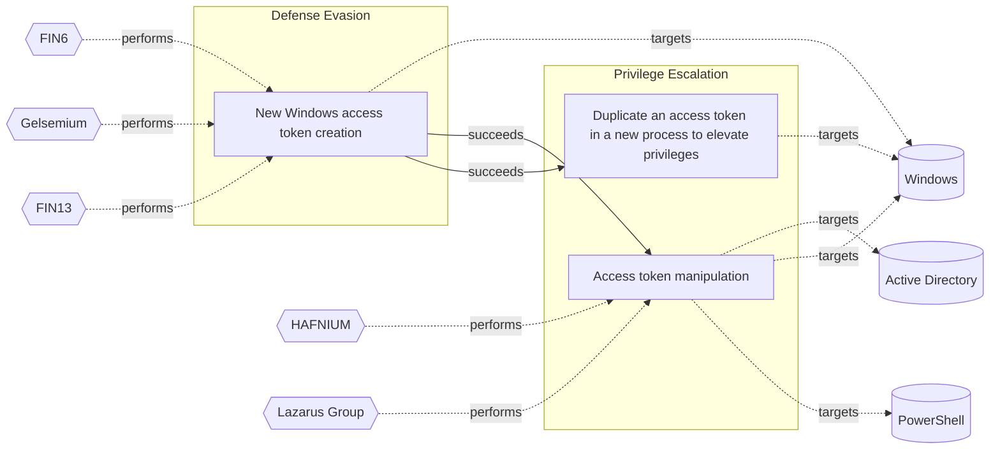

# ☣️ Access token manipulation

🔥 **Criticality:High** ⚠️ : A High priority incident is likely to result in a demonstrable impact to public health or safety, national security, economic security, foreign relations, civil liberties, or public confidence. 

🚦 **TLP:CLEAR** ⚪ : Recipients can spread this to the world, there is no limit on disclosure.

🗡️ **ATT&CK Techniques** [T1098 : Account Manipulation](https://attack.mitre.org/techniques/T1098 'Adversaries may manipulate accounts to maintain andor elevate access to victim systems Account manipulation may consist of any action that preserves o')

---

`🔑 UUID : 2404055a-10f8-4c50-9e9b-0f26756e7838` **|** `🏷️ Version : 1` **|** `🗓️ Creation Date : 2025-02-03` **|** `🗓️ Last Modification : 2025-02-03` **|** `Sharing Organisation : {'uuid': '56b0a0f0-b0bc-47d9-bb46-02f80ae2065a', 'name': 'EC DIGIT CSOC'}` **|** `🧱 Schema Identifier : tvm::2.1`

## 👁️ Description

> ### Access token:
> 
> An access token is part of the logon session of the user, and it also contains their credentials for
> Windows single sign on (SSO) authentication to access local or remote network services.
> 
> When a user signs on to a machine ((irrespective of the logon type), the system generates an 
> access token for them. With this access token, Windows handles the user identification,
> security, and access rights on the system.
> 
> ### Access token manipulation:
> 
> An attacker can manipulate access tokens to make a process appear to be initiated by a different
> user account, when in reality, the request was originated by the account of the attacker.
> 
> Attackers use access tokens to escalate privileges from administrative to SYSTEM level,
> allowing them to undertake malicious operations and remotely access systems in the corporate network.
> 
> ### Manipulating access token by injecting malware:
> 
> - If the current logged-on user on the compromised or infected machine is a member of the administrator
>   group of users or is running a process with higher privileges (e.g., by using the “runas” command),
>   malware can take advantage of the privileges of the process’s access token to elevate its privileges
>   on the system, allowing it to perform privileged tasks.
> 
> - Malware can enumerate the Windows processes running with higher privileges (typically SYSTEM level privileges),
>   obtain the access tokens for those processes, and utilise the acquired token to launch new processes.
>   As a result, the new process is launched in the context of the SYSTEM user, as represented by the token.
> 
> - Malware can also perform a token impersonation attack, in which it copies the access tokens of higher-level
>   SYSTEM processes, converts them into impersonation tokens using appropriate Windows functionality, 
>   and then impersonates the SYSTEM user on the infected machine, thereby elevating its privileges.
> 
> ### Methods used to manipulate access tokens:  
> 
> - Theft of access tokens.
>   An attacker can copy and use existing tokens from other processes to undertake malicious activities using 
>   the built-in Windows API functions:
>     - To make duplicate tokens of existing access tokens, utilise the DuplicateTokenEx() function.
>     - The ImpersonateLoggedOnUser() function is used to run the process as another user.
>     - Attackers can assign an impersonated token to a thread using the SetThreatToken() function.
> 
> - Using a stolen access token to create a new process.
>   Use the CreateProcessWithTokenW() function to create a new process with a duplicated token. The attackers
>   can use this function to generate tokens that implement the security context of any user they want to impersonate.
> 
> - Creating Logon sessions.
>   If an attacker has the credentials for any user account, they can use the LogonUser() function to create logon 
>   sessions for them remotely. They can then gain a token from the security context of the logged in user, 
>   which they can give to a thread to launch a process.
> 

## 🖥️ Terrain 

 > Adversary must have administrative privileges on Windows systems within 
>  the enterprise network.
> 

---

## 🕸️ Relations

### 🐲 Actors sightings 

| Actor                | Description                                                                                                                                                                                                                                                                                                                                                                                                                                                                                                                                                                                                                                                                                                                                                                                                                                                                                                                                                                                                                                                                                                                                                                                                                                               | Aliases                                                                                   | Source                 | Sighting               | Reference                |
|:---------------------|:----------------------------------------------------------------------------------------------------------------------------------------------------------------------------------------------------------------------------------------------------------------------------------------------------------------------------------------------------------------------------------------------------------------------------------------------------------------------------------------------------------------------------------------------------------------------------------------------------------------------------------------------------------------------------------------------------------------------------------------------------------------------------------------------------------------------------------------------------------------------------------------------------------------------------------------------------------------------------------------------------------------------------------------------------------------------------------------------------------------------------------------------------------------------------------------------------------------------------------------------------------|:------------------------------------------------------------------------------------------|:-----------------------|:-----------------------|:-------------------------|
| [Enterprise] HAFNIUM | [HAFNIUM](https://attack.mitre.org/groups/G0125) is a likely state-sponsored cyber espionage group operating out of China that has been active since at least January 2021. [HAFNIUM](https://attack.mitre.org/groups/G0125) primarily targets entities in the US across a number of industry sectors, including infectious disease researchers, law firms, higher education institutions, defense contractors, policy think tanks, and NGOs. [HAFNIUM](https://attack.mitre.org/groups/G0125) has targeted remote management tools and cloud software for intial access and has demonstrated an ability to quickly operationalize exploits for identified vulnerabilities in edge devices.(Citation: Microsoft HAFNIUM March 2020)(Citation: Volexity Exchange Marauder March 2021)(Citation: Microsoft Silk Typhoon MAR 2025)                                                                                                                                                                                                                                                                                                                                                                                                                           | Operation Exchange Marauder, Silk Typhoon                                                 | 🗡️ MITRE ATT&CK Groups | No documented sighting | No documented references |
| [ICS] Lazarus Group  | [Lazarus Group](https://attack.mitre.org/groups/G0032) is a North Korean state-sponsored cyber threat group that has been attributed to the Reconnaissance General Bureau.(Citation: US-CERT HIDDEN COBRA June 2017)(Citation: Treasury North Korean Cyber Groups September 2019) The group has been active since at least 2009 and was reportedly responsible for the November 2014 destructive wiper attack against Sony Pictures Entertainment as part of a campaign named Operation Blockbuster by Novetta. Malware used by [Lazarus Group](https://attack.mitre.org/groups/G0032) correlates to other reported campaigns, including Operation Flame, Operation 1Mission, Operation Troy, DarkSeoul, and Ten Days of Rain.(Citation: Novetta Blockbuster)North Korean group definitions are known to have significant overlap, and some security researchers report all North Korean state-sponsored cyber activity under the name [Lazarus Group](https://attack.mitre.org/groups/G0032) instead of tracking clusters or subgroups, such as [Andariel](https://attack.mitre.org/groups/G0138), [APT37](https://attack.mitre.org/groups/G0067), [APT38](https://attack.mitre.org/groups/G0082), and [Kimsuky](https://attack.mitre.org/groups/G0094). | Diamond Sleet, Guardians of Peace, HIDDEN COBRA, Labyrinth Chollima, NICKEL ACADEMY, ZINC | 🗡️ MITRE ATT&CK Groups | No documented sighting | No documented references |

### 🌊 OpenTide Objects
🚫 No related OpenTide objects indexed.

 --- 

### ⛓️ Threat Chaining

Expand chaining data

| ☣️ Vector                                                                                                                                                                                                                                                              | ⛓️ Link              | 🎯 Target                                                                                                                                                                                                                                                                                                                                         | ⛰️ Terrain                                                                                                                                                                                                                                                                                                                                                             | 🗡️ ATT&CK                                                                                                                                                                                                                                                                  |
|:-----------------------------------------------------------------------------------------------------------------------------------------------------------------------------------------------------------------------------------------------------------------------|:---------------------|:-------------------------------------------------------------------------------------------------------------------------------------------------------------------------------------------------------------------------------------------------------------------------------------------------------------------------------------------------|:-----------------------------------------------------------------------------------------------------------------------------------------------------------------------------------------------------------------------------------------------------------------------------------------------------------------------------------------------------------------------|:---------------------------------------------------------------------------------------------------------------------------------------------------------------------------------------------------------------------------------------------------------------------------|
| [New Windows access token creation](../Threat%20Vectors/☣️%20New%20Windows%20access%20token%20creation.md 'A Windows access token is a data structure that contains informationabout a users security context, including their security identifierSID, group memb...') | `sequence::succeeds` | [Access token manipulation](../Threat%20Vectors/☣️%20Access%20token%20manipulation.md '### Access tokenAn access token is part of the logon session of the user, and it also contains their credentials forWindows single sign on SSO authent...')                                                                                               | Adversary must have administrative privileges on Windows systems within   the enterprise network.                                                                                                                                                                                                                                                                      | [T1098 : Account Manipulation](https://attack.mitre.org/techniques/T1098 'Adversaries may manipulate accounts to maintain andor elevate access to victim systems Account manipulation may consist of any action that preserves o')                                         |
| [New Windows access token creation](../Threat%20Vectors/☣️%20New%20Windows%20access%20token%20creation.md 'A Windows access token is a data structure that contains informationabout a users security context, including their security identifierSID, group memb...') | `sequence::succeeds` | [Duplicate an access token in a new process to elevate privileges](../Threat%20Vectors/☣️%20Duplicate%20an%20access%20token%20in%20a%20new%20process%20to%20elevate%20privileges.md 'An adversary can use automated solutions like CobaltStrike frameworkto create a new process with a duplicated token to escalate privileges and bypass ...') | Threat actors are using already compromised Windows environment to create  a new process with a duplicated token. Their purpose is often to elevate  their privileges to SYSTEM level access (NT AUTHORITY\SYSTEM), but the same  threat vector can also be used for defense evasion and other purposes by  duplicating other access token types and privilege levels. | [T1134.002 : Access Token Manipulation: Create Process with Token](https://attack.mitre.org/techniques/T1134/002 'Adversaries may create a new process with an existing token to escalate privileges and bypass access controls Processes can be created with the token ') |

&nbsp; 

---

## Model Data

#### **⛓️ Cyber Kill Chain**

 > Cyber attacks are typically phased progressions towards strategic objectives. The Unified Kill Chains provides insight into the tactics that hackers employ to attain these objectives. This provides a solid basis to develop (or realign) defensive strategies to raise cyber resilience.

 [`🥸 Privilege Escalation`](https://www.unifiedkillchain.com/assets/The-Unified-Kill-Chain.pdf) : The result of techniques that provide an attacker with higher permissions on a system or network.

---

#### **🛰️ Domains**

 > Infrastructure technologies domain of interest to attackers.

 `🏢 Enterprise` : Generic databases, applications, machines and systems that are usually on premises or on Cloud traditional VMs.

---

#### **🎯 Targets**

 > Granular delimited technical entities holding a value to the organization, that are targeted by adversaries. They might be also involved in the detection coverage as the target of log collection. Partially inspired by Veris.

  - [`💻 Laptop`](http://veriscommunity.net/enums.html#section-asset) : User Device - Laptop
 - [`🖥️ Workstations`](http://veriscommunity.net/enums.html#section-asset) : Placeholder

---

#### **💿 Platforms concerned**

 > Actual technologies used by the organization that will be exploited by adversaries during a successful attack, and eventually of relevance for detection. Are named by commercial designation.

  - ` Active Directory` : Placeholder
 - ` Windows` : Placeholder
 - ` PowerShell` : Placeholder

---

#### **💣 Severity**

 > The severity summarizes the overall danger of incident the vector will provoke, and is to be derived (WIP) from impact, leverage, and difficulty to execute.

 [`⚠️ Significant incident`](https://www.ncsc.gov.uk/news/new-cyber-attack-categorisation-system-improve-uk-response-incidents) : A cyber attack which has a serious impact on a large organisation or on wider / local government, or which poses a considerable risk to central government or (inter)national essential services.

---

#### **🪄 Leverage acquisition**

 > Technical aftermath of the attack from the target perspective, differentiated from impact as it does not consider the value of the consequence, only what increased control the vector execution provides to the adversary.

  - [`⚙️ Modify configuration`](https://owasp.org/www-community/Threat_Modeling_Process#stride) : Modify configuration or services
 - [`✨ Modify data`](https://owasp.org/www-community/Threat_Modeling_Process#stride) : Modify stored data or content
 - [`🐒 Tampering`](https://owasp.org/www-community/Threat_Modeling_Process#stride) : Threat action intending to maliciously change or modify persistent data, such as records in a database, and the alteration of data in transit between two computers over an open network, such as the Internet.
 - [`🔐 New Accounts`](https://owasp.org/www-community/Threat_Modeling_Process#stride) : Ability to create new arbitrary user accounts.

---

#### **💥 Impact**

 > Analysis of the threat vector from the organizational perspective, in non technical term. This aims at putting a clear denomination on what the attacker will actually be able to act upon if the threat vector is realized.

  - [`🔓 Data Breach`](http://veriscommunity.net/enums.html#section-impact) : Non-public information has been accessed from the outside, and successfully extracted.
 - [`🛑 Business disruption`](http://veriscommunity.net/enums.html#section-impact) : Business disruption
 - [`🌍 Reputational Damages`](http://veriscommunity.net/enums.html#section-impact) : Damages to the organization public view may be achieved by using directly the access gained, or indirectly with data gathered.
 - [`💲 Operating costs`](http://veriscommunity.net/enums.html#section-impact) : Increased operating costs

---

#### **🎲 Vector Viability**

 > Described with estimative language (likelyhood probability), describes how likely the analyst believes the vector to actually be realized on the organization infrastructure. Estimative language describes quality and credibility of underlying sources, data, and methodologies based Intelligence Community Directive 203 (ICD 203) and JP 2-0, Joint Intelligence.

 [`🧐 Likely`](https://www.dni.gov/files/documents/ICD/ICD%20203%20Analytic%20Standards.pdf) : Probable (probably) - 55-80%

---

### 🔗 References

**🕊️ Publicly available resources**

- [_1_] https://www.cisa.gov/news-events/cybersecurity-advisories/aa23-059a
- [_2_] https://www.manageengine.com/log-management/cyber-security/account-manipulation-attack.html
- [_3_] https://www.elastic.co/blog/how-attackers-abuse-access-token-manipulation

[1]: https://www.cisa.gov/news-events/cybersecurity-advisories/aa23-059a
[2]: https://www.manageengine.com/log-management/cyber-security/account-manipulation-attack.html
[3]: https://www.elastic.co/blog/how-attackers-abuse-access-token-manipulation

---

#### 🏷️ Tags

#-, #-, #-, #
, #
, ##, ##, ##, ##, # , #🏷, #️, # , #T, #a, #g, #s, #
, #

