# ☣️ Admin SMB shares privilege escalation exploit

🔥 **Criticality:Medium** ❗ : A Medium priority incident may affect public health or safety, national security, economic security, foreign relations, civil liberties, or public confidence. 

🚦 **TLP:CLEAR** ⚪ : Recipients can spread this to the world, there is no limit on disclosure.

🗡️ **ATT&CK Techniques** [T1210 : Exploitation of Remote Services](https://attack.mitre.org/techniques/T1210 'Adversaries may exploit remote services to gain unauthorized access to internal systems once inside of a network Exploitation of a software vulnerabil'), [T1078 : Valid Accounts](https://attack.mitre.org/techniques/T1078 'Adversaries may obtain and abuse credentials of existing accounts as a means of gaining Initial Access, Persistence, Privilege Escalation, or Defense '), [T1021.002 : Remote Services: SMB/Windows Admin Shares](https://attack.mitre.org/techniques/T1021/002 'Adversaries may use Valid AccountshttpsattackmitreorgtechniquesT1078 to interact with a remote network share using Server Message Block SMB The advers'), [T1570 : Lateral Tool Transfer](https://attack.mitre.org/techniques/T1570 'Adversaries may transfer tools or other files between systems in a compromised environment Once brought into the victim environment ie, Ingress Tool T')

---

`🔑 UUID : 02810748-52b5-4d3a-a788-29a948538cd2` **|** `🏷️ Version : 1` **|** `🗓️ Creation Date : 2025-07-29` **|** `🗓️ Last Modification : 2025-08-26` **|** `Sharing Organisation : {'uuid': '56b0a0f0-b0bc-47d9-bb46-02f80ae2065a', 'name': 'EC DIGIT CSOC'}` **|** `🧱 Schema Identifier : tvm::2.1`

## 👁️ Description

> One of the most common ways adversaries leverage SMB and Windows Admin
> Shares is in conjunction with another technique, T1570: Lateral Tool
> Transfer. In other words, they move payloads from one endpoint to another
> and execute them. Adversaries do this with native utilities like net.exe or
> through functionality provided by command and control (C2) frameworks - to
> name just a couple of the many options available. Additionally, adversaries
> can use Admin Shares for privilege escalation using tools like PsExec, a 
> Sysinternals tool that enables remote system management.
> 
> ### Possible patterns of malicious activity
> 
> - Remote file copy and retrieval - attackers can use tools such as SMBexec to 
> create a temporary share to copy files to and then remotely parse their 
> contents. An adversary could accomplish this similarly by leveraging tools 
> like WMIexec or MMCexec.
> 
> - Lateral movement and privilege escalation - Most C2 Frameworks provide 
> built-in functionality for lateral movement or privilege escalation utilizing 
> PsExec-like functionality. In the case of Cobalt Strike, beacons leverage the 
> Service Control Manager to copy a binary to the ADMIN$ share on the target 
> endpoint and leverage a service for execution.
> 
> Common offensive and dual-use tools that leverage SMB/Windows Admin Shares 
> include:
> 
> - PsExec
> - Impacket's SMBexec and WMIexec
> - `net.exe`
> - Probably all C2 frameworks (commercial and open source)
> 

## 🖥️ Terrain 

 > A threat actor needs to have initial access to a machine that has remote or 
> local SMB share connectivity.    
> 

 &nbsp;
### ❤️‍🩹 Common Vulnerability Enumeration

⚠️ ERROR : Could not successfully retrieve CVE Details, double check the broken links below to confirm the CVE ID exists.

- [💔 CVE-2025-33073](https://nvd.nist.gov/vuln/detail/CVE-2025-33073)

&nbsp;

---

## 🕸️ Relations

### 🐲 Actors sightings 

| Actor              | Description                                                                                                                                                                                                                                                                                                                                                                                                                                                                                                                                                                                                                                                                                                                                                   | Aliases                                                                                      | Source                     | Sighting                                                                    | Reference                                                                                      |
|:-------------------|:--------------------------------------------------------------------------------------------------------------------------------------------------------------------------------------------------------------------------------------------------------------------------------------------------------------------------------------------------------------------------------------------------------------------------------------------------------------------------------------------------------------------------------------------------------------------------------------------------------------------------------------------------------------------------------------------------------------------------------------------------------------|:---------------------------------------------------------------------------------------------|:---------------------------|:----------------------------------------------------------------------------|:-----------------------------------------------------------------------------------------------|
| [Enterprise] APT39 | [APT39](https://attack.mitre.org/groups/G0087) is one of several names for cyber espionage activity conducted by the Iranian Ministry of Intelligence and Security (MOIS) through the front company Rana Intelligence Computing since at least 2014. [APT39](https://attack.mitre.org/groups/G0087) has primarily targeted the travel, hospitality, academic, and telecommunications industries in Iran and across Asia, Africa, Europe, and North America to track individuals and entities considered to be a threat by the MOIS.(Citation: FireEye APT39 Jan 2019)(Citation: Symantec Chafer Dec 2015)(Citation: FBI FLASH APT39 September 2020)(Citation: Dept. of Treasury Iran Sanctions September 2020)(Citation: DOJ Iran Indictments September 2020) | Chafer, ITG07, Remix Kitten                                                                  | 🗡️ MITRE ATT&CK Groups     | No documented sighting                                                      | No documented references                                                                       |
| APT39              | APT39 was created to bring together previous activities and methods used by this actor, and its activities largely align with a group publicly referred to as "Chafer." However, there are differences in what has been publicly reported due to the variances in how organizations track activity. APT39 primarily leverages the SEAWEED and CACHEMONEY backdoors along with a specific variant of the POWBAT backdoor. While APT39's targeting scope is global, its activities are concentrated in the Middle East. APT39 has prioritized the telecommunications sector, with additional targeting of the travel industry and IT firms that support it and the high-tech industry.                                                                          | Chafer, REMIX KITTEN, COBALT HICKMAN, G0087, Radio Serpens, TA454, ITG07, Burgundy Sandstorm | 🌌 MISP Threat Actor Galaxy | APT39 is a vietnam-based threat group known to use SMB for lateralmovement. | https://www.security.com/threat-intelligence/chafer-latest-attacks-reveal-heightened-ambitions |

### 🌊 OpenTide Objects
🚫 No related OpenTide objects indexed.

 --- 

### ⛓️ Threat Chaining

```mermaid

flowchart LR

02810748-52b5-4d3a-a788-29a948538cd2[Admin SMB shares privilege escalation exploit]
75415bc5-6615-487e-a69c-7a4ffc196996[Lateral movement using Impacket framework]
f33a693b-04cd-476e-9067-9deab561e55a[Move laterally with SMB by abusing WMI]
3b1026c6-7d04-4b91-ba6f-abc68e993616[Abusing Lolbins to Enumerate Local and Domain Accounts and Groups]

subgraph Privilege Escalation
02810748-52b5-4d3a-a788-29a948538cd2
end
subgraph Credential Access
75415bc5-6615-487e-a69c-7a4ffc196996
end
subgraph Lateral Movement
f33a693b-04cd-476e-9067-9deab561e55a
end
subgraph Discovery
3b1026c6-7d04-4b91-ba6f-abc68e993616
end

CVE-2025-33073>CVE-2025-33073]
Windows[(Windows)]
AWSEC2[(AWS EC2)]
AWSECS[(AWS ECS)]
AWSEKS[(AWS EKS)]
Linux[(Linux)]
macOS[(macOS)]
APT39{{APT39}}
EmberBear{{Ember Bear}}
DEV-0586{{DEV-0586}}
APT32{{APT32}}
APT29{{APT29}}
UNC2452{{UNC2452}}
BlueMockingbird{{Blue Mockingbird}}
Chimera{{Chimera}}
CobaltGroup{{Cobalt Group}}
Cobalt{{Cobalt}}
FIN6{{FIN6}}
FIN7{{FIN7}}
GALLIUM{{GALLIUM}}
GamaredonGroup{{Gamaredon Group}}
APT38{{APT38}}
LazarusGroup{{Lazarus Group}}
Leviathan{{Leviathan}}
APT40{{APT40}}
MagicHound{{Magic Hound}}
TA453{{TA453}}
menuPass{{menuPass}}
APT10{{APT10}}
MuddyWater{{MuddyWater}}
MustangPanda{{Mustang Panda}}
RedDelta{{RedDelta}}
APT30{{APT30}}
OilRig{{OilRig}}
SandwormTeam{{Sandworm Team}}
GreyEnergy{{GreyEnergy}}
WizardSpider{{Wizard Spider}}
UNC1878{{UNC1878}}
APT1{{APT1}}
Ke3chang{{Ke3chang}}
APT15{{APT15}}

02810748-52b5-4d3a-a788-29a948538cd2 -.->|exploits| CVE-2025-33073
02810748-52b5-4d3a-a788-29a948538cd2 -.->|targets| Windows
75415bc5-6615-487e-a69c-7a4ffc196996 -.->|targets| Windows
f33a693b-04cd-476e-9067-9deab561e55a -.->|targets| Windows
3b1026c6-7d04-4b91-ba6f-abc68e993616 -.->|targets| AWSEC2
3b1026c6-7d04-4b91-ba6f-abc68e993616 -.->|targets| AWSECS
3b1026c6-7d04-4b91-ba6f-abc68e993616 -.->|targets| AWSEKS
3b1026c6-7d04-4b91-ba6f-abc68e993616 -.->|targets| Linux
3b1026c6-7d04-4b91-ba6f-abc68e993616 -.->|targets| macOS
3b1026c6-7d04-4b91-ba6f-abc68e993616 -.->|targets| Windows
APT39 -.-> |performs| 02810748-52b5-4d3a-a788-29a948538cd2
EmberBear -.-> |performs| 75415bc5-6615-487e-a69c-7a4ffc196996
DEV-0586 -.-> |performs| 75415bc5-6615-487e-a69c-7a4ffc196996
APT32 -.-> |performs| f33a693b-04cd-476e-9067-9deab561e55a
APT29 -.-> |performs| f33a693b-04cd-476e-9067-9deab561e55a
UNC2452 -.-> |performs| f33a693b-04cd-476e-9067-9deab561e55a
BlueMockingbird -.-> |performs| f33a693b-04cd-476e-9067-9deab561e55a
Chimera -.-> |performs| f33a693b-04cd-476e-9067-9deab561e55a
CobaltGroup -.-> |performs| f33a693b-04cd-476e-9067-9deab561e55a
Cobalt -.-> |performs| f33a693b-04cd-476e-9067-9deab561e55a
FIN6 -.-> |performs| f33a693b-04cd-476e-9067-9deab561e55a
FIN7 -.-> |performs| f33a693b-04cd-476e-9067-9deab561e55a
GALLIUM -.-> |performs| f33a693b-04cd-476e-9067-9deab561e55a
GamaredonGroup -.-> |performs| f33a693b-04cd-476e-9067-9deab561e55a
APT38 -.-> |performs| f33a693b-04cd-476e-9067-9deab561e55a
LazarusGroup -.-> |performs| f33a693b-04cd-476e-9067-9deab561e55a
Leviathan -.-> |performs| f33a693b-04cd-476e-9067-9deab561e55a
APT40 -.-> |performs| f33a693b-04cd-476e-9067-9deab561e55a
MagicHound -.-> |performs| f33a693b-04cd-476e-9067-9deab561e55a
TA453 -.-> |performs| f33a693b-04cd-476e-9067-9deab561e55a
menuPass -.-> |performs| f33a693b-04cd-476e-9067-9deab561e55a
APT10 -.-> |performs| f33a693b-04cd-476e-9067-9deab561e55a
MuddyWater -.-> |performs| f33a693b-04cd-476e-9067-9deab561e55a
MustangPanda -.-> |performs| f33a693b-04cd-476e-9067-9deab561e55a
RedDelta -.-> |performs| f33a693b-04cd-476e-9067-9deab561e55a
APT30 -.-> |performs| f33a693b-04cd-476e-9067-9deab561e55a
OilRig -.-> |performs| f33a693b-04cd-476e-9067-9deab561e55a
SandwormTeam -.-> |performs| f33a693b-04cd-476e-9067-9deab561e55a
GreyEnergy -.-> |performs| f33a693b-04cd-476e-9067-9deab561e55a
WizardSpider -.-> |performs| f33a693b-04cd-476e-9067-9deab561e55a
UNC1878 -.-> |performs| f33a693b-04cd-476e-9067-9deab561e55a
APT29 -.-> |performs| 3b1026c6-7d04-4b91-ba6f-abc68e993616
UNC2452 -.-> |performs| 3b1026c6-7d04-4b91-ba6f-abc68e993616
APT1 -.-> |performs| 3b1026c6-7d04-4b91-ba6f-abc68e993616
Chimera -.-> |performs| 3b1026c6-7d04-4b91-ba6f-abc68e993616
APT32 -.-> |performs| 3b1026c6-7d04-4b91-ba6f-abc68e993616
Ke3chang -.-> |performs| 3b1026c6-7d04-4b91-ba6f-abc68e993616
APT15 -.-> |performs| 3b1026c6-7d04-4b91-ba6f-abc68e993616

02810748-52b5-4d3a-a788-29a948538cd2 -->|implements| 75415bc5-6615-487e-a69c-7a4ffc196996
02810748-52b5-4d3a-a788-29a948538cd2 -->|succeeds| f33a693b-04cd-476e-9067-9deab561e55a
75415bc5-6615-487e-a69c-7a4ffc196996 -->|succeeds| 3b1026c6-7d04-4b91-ba6f-abc68e993616

```

Expand chaining data

| ☣️ Vector                                                                                                                                                                                                                                                                                        | ⛓️ Link                 | 🎯 Target                                                                                                                                                                                                                                                                                                                                         | ⛰️ Terrain                                                                                                                                                                                   | 🗡️ ATT&CK                                                                                                                                                                                                                                                                                                                                                                                                                                                                                                                                                                                                                                                                                                                                                                                                                                                                                                                                                                                                                                          |
|:-------------------------------------------------------------------------------------------------------------------------------------------------------------------------------------------------------------------------------------------------------------------------------------------------|:------------------------|:-------------------------------------------------------------------------------------------------------------------------------------------------------------------------------------------------------------------------------------------------------------------------------------------------------------------------------------------------|:---------------------------------------------------------------------------------------------------------------------------------------------------------------------------------------------|:---------------------------------------------------------------------------------------------------------------------------------------------------------------------------------------------------------------------------------------------------------------------------------------------------------------------------------------------------------------------------------------------------------------------------------------------------------------------------------------------------------------------------------------------------------------------------------------------------------------------------------------------------------------------------------------------------------------------------------------------------------------------------------------------------------------------------------------------------------------------------------------------------------------------------------------------------------------------------------------------------------------------------------------------------|
| [Admin SMB shares privilege escalation exploit](../Threat%20Vectors/☣️%20Admin%20SMB%20shares%20privilege%20escalation%20exploit.md 'One of the most common ways adversaries leverage SMB and Windows AdminShares is in conjunction with another technique, T1570 Lateral ToolTransfer In o...') | `atomicity::implements` | [Lateral movement using Impacket framework](../Threat%20Vectors/☣️%20Lateral%20movement%20using%20Impacket%20framework.md 'Threat actors conduct lateral movement with valid network credentialsobtained from credential harvesting To conduct lateral movement moreefficiently, ...')                                                           | A threat actor needs initial access to move laterally through the network.                                                                                                                   | [T1021 : Remote Services](https://attack.mitre.org/techniques/T1021 'Adversaries may use Valid AccountshttpsattackmitreorgtechniquesT1078 to log into a service that accepts remote connections, such as telnet, SSH, and V'), [T1059.001 : Command and Scripting Interpreter: PowerShell](https://attack.mitre.org/techniques/T1059/001 'Adversaries may abuse PowerShell commands and scripts for execution PowerShell is a powerful interactive command-line interface and scripting environm'), [T1552.002 : Unsecured Credentials: Credentials in Registry](https://attack.mitre.org/techniques/T1552/002 'Adversaries may search the Registry on compromised systems for insecurely stored credentials The Windows Registry stores configuration information tha')                                                                                                                                                                                                                                                                           |
| [Admin SMB shares privilege escalation exploit](../Threat%20Vectors/☣️%20Admin%20SMB%20shares%20privilege%20escalation%20exploit.md 'One of the most common ways adversaries leverage SMB and Windows AdminShares is in conjunction with another technique, T1570 Lateral ToolTransfer In o...') | `sequence::succeeds`    | [Move laterally with SMB by abusing WMI](../Threat%20Vectors/☣️%20Move%20laterally%20with%20SMB%20by%20abusing%20WMI.md 'Windows management instrumentation WMI is a tool that is implemented as service to locallyand remotely manages data, operations and configuring settin...')                                                             | It is a built-in tool developped by Microsoft and belonging to Sysinternal command-line tools. It should be installed However SMB is a native protocol that do not require any installation. | [T1570 : Lateral Tool Transfer](https://attack.mitre.org/techniques/T1570 'Adversaries may transfer tools or other files between systems in a compromised environment Once brought into the victim environment ie, Ingress Tool T'), [T1047 : Windows Management Instrumentation](https://attack.mitre.org/techniques/T1047 'Adversaries may abuse Windows Management Instrumentation WMI to execute malicious commands and payloads WMI is designed for programmers and is the inf')                                                                                                                                                                                                                                                                                                                                                                                                                                                                                                                                                              |
| [Lateral movement using Impacket framework](../Threat%20Vectors/☣️%20Lateral%20movement%20using%20Impacket%20framework.md 'Threat actors conduct lateral movement with valid network credentialsobtained from credential harvesting To conduct lateral movement moreefficiently, ...')           | `sequence::succeeds`    | [Abusing Lolbins to Enumerate Local and Domain Accounts and Groups](../Threat%20Vectors/☣️%20Abusing%20Lolbins%20to%20Enumerate%20Local%20and%20Domain%20Accounts%20and%20Groups.md 'Adversaries may attempt to enumerate the environment and list alllocal system and domain accounts or groups  To achieve this purpose, they can use var...') | Adversaries can take advantage of already compromised system (Windows or  Linux OS or OSX) to run commands.                                                                                  | [T1087.001 : Account Discovery: Local Account](https://attack.mitre.org/techniques/T1087/001 'Adversaries may attempt to get a listing of local system accounts This information can help adversaries determine which local accounts exist on a syst'), [T1087.002 : Account Discovery: Domain Account](https://attack.mitre.org/techniques/T1087/002 'Adversaries may attempt to get a listing of domain accounts This information can help adversaries determine which domain accounts exist to aid in foll'), [T1069.001 : Permission Groups Discovery: Local Groups](https://attack.mitre.org/techniques/T1069/001 'Adversaries may attempt to find local system groups and permission settings The knowledge of local system permission groups can help adversaries deter'), [T1069.002 : Permission Groups Discovery: Domain Groups](https://attack.mitre.org/techniques/T1069/002 'Adversaries may attempt to find domain-level groups and permission settings The knowledge of domain-level permission groups can help adversaries deter') |

&nbsp; 

---

## Model Data

#### **⛓️ Cyber Kill Chain**

 > Cyber attacks are typically phased progressions towards strategic objectives. The Unified Kill Chains provides insight into the tactics that hackers employ to attain these objectives. This provides a solid basis to develop (or realign) defensive strategies to raise cyber resilience.

 [`🥸 Privilege Escalation`](https://www.unifiedkillchain.com/assets/The-Unified-Kill-Chain.pdf) : The result of techniques that provide an attacker with higher permissions on a system or network.

---

#### **🛰️ Domains**

 > Infrastructure technologies domain of interest to attackers.

 `🏢 Enterprise` : Generic databases, applications, machines and systems that are usually on premises or on Cloud traditional VMs.

---

#### **🎯 Targets**

 > Granular delimited technical entities holding a value to the organization, that are targeted by adversaries. They might be also involved in the detection coverage as the target of log collection. Partially inspired by Veris.

  - [`🖥️ Public-Facing Servers`](http://veriscommunity.net/enums.html#section-asset) : Placeholder
 - [`🖥️ Workstations`](http://veriscommunity.net/enums.html#section-asset) : Placeholder
 - [`🖥️ Web Application Servers`](http://veriscommunity.net/enums.html#section-asset) : Placeholder

---

#### **💿 Platforms concerned**

 > Actual technologies used by the organization that will be exploited by adversaries during a successful attack, and eventually of relevance for detection. Are named by commercial designation.

 ` Windows` : Placeholder

---

#### **💣 Severity**

 > The severity summarizes the overall danger of incident the vector will provoke, and is to be derived (WIP) from impact, leverage, and difficulty to execute.

 [`🧨 Moderate incident`](https://www.ncsc.gov.uk/news/new-cyber-attack-categorisation-system-improve-uk-response-incidents) : A cyber attack on a small organisation, or which poses a considerable risk to a medium-sized organisation, or preliminary indications of cyber activity against a large organisation or the government.

---

#### **🪄 Leverage acquisition**

 > Technical aftermath of the attack from the target perspective, differentiated from impact as it does not consider the value of the consequence, only what increased control the vector execution provides to the adversary.

  - [`💅 Elevation of privilege`](https://owasp.org/www-community/Threat_Modeling_Process#stride) : Capacity to augment leverage over the target system by upgrading the compromised access rights
 - [`💀 Infrastructure Compromise`](https://owasp.org/www-community/Threat_Modeling_Process#stride) : The compromised target is likely to be used to further expand the sphere of influence of the attacker and allow more potent vectors to be executed.
 - [`👁️‍🗨️ Information Disclosure`](https://owasp.org/www-community/Threat_Modeling_Process#stride) : Threat action intending to read a file that one was not granted access to, or to read data in transit.

---

#### **💥 Impact**

 > Analysis of the threat vector from the organizational perspective, in non technical term. This aims at putting a clear denomination on what the attacker will actually be able to act upon if the threat vector is realized.

  - [`🔓 Data Breach`](http://veriscommunity.net/enums.html#section-impact) : Non-public information has been accessed from the outside, and successfully extracted.
 - [`🩼 Impairement`](http://veriscommunity.net/enums.html#section-impact) : Incapacitation of a particular key system that will cause disruptions in day-to-day operations, and eventually service delivery.

---

#### **🎲 Vector Viability**

 > Described with estimative language (likelyhood probability), describes how likely the analyst believes the vector to actually be realized on the organization infrastructure. Estimative language describes quality and credibility of underlying sources, data, and methodologies based Intelligence Community Directive 203 (ICD 203) and JP 2-0, Joint Intelligence.

 [`🧐 Likely`](https://www.dni.gov/files/documents/ICD/ICD%20203%20Analytic%20Standards.pdf) : Probable (probably) - 55-80%

---

### 🔗 References

**🕊️ Publicly available resources**

- [_1_] https://redcanary.com/threat-detection-report/techniques/windows-admin-shares
- [_2_] https://www.pentesting.org/file-sharing-attacks/
- [_3_] https://www.cayosoft.com/smb-vulnerability
- [_4_] https://securityonline.info/windows-smb-flaw-cve-2025-33073-system-privilege-escalation-via-kerberos-poc-available
- [_5_] https://windowsforum.com/threads/cve-2025-33073-critical-windows-smb-privilege-escalation-vulnerability-explained.369790
- [_6_] https://www.thehackacademy.com/news/microsoft-issues-emergency-fix-for-severe-windows-smb-vulnerability-update-now
- [_7_] https://www.security.com/threat-intelligence/chafer-latest-attacks-reveal-heightened-ambitions

[1]: https://redcanary.com/threat-detection-report/techniques/windows-admin-shares
[2]: https://www.pentesting.org/file-sharing-attacks/
[3]: https://www.cayosoft.com/smb-vulnerability
[4]: https://securityonline.info/windows-smb-flaw-cve-2025-33073-system-privilege-escalation-via-kerberos-poc-available
[5]: https://windowsforum.com/threads/cve-2025-33073-critical-windows-smb-privilege-escalation-vulnerability-explained.369790
[6]: https://www.thehackacademy.com/news/microsoft-issues-emergency-fix-for-severe-windows-smb-vulnerability-update-now
[7]: https://www.security.com/threat-intelligence/chafer-latest-attacks-reveal-heightened-ambitions

---

#### 🏷️ Tags

#-, #-, #-, #
, #
, ##, ##, ##, ##, # , #🏷, #️, # , #T, #a, #g, #s, #
, #

