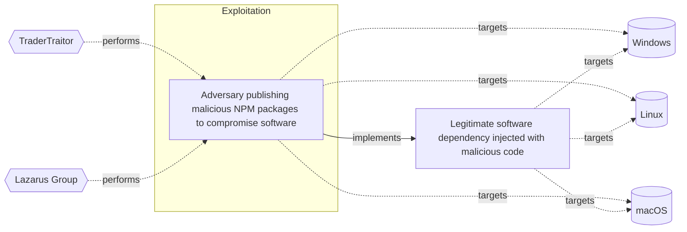

# ☣️ Adversary publishing malicious NPM packages to compromise software

🔥 **Criticality:Low** 🔫 : A Low priority incident is unlikely to affect public health or safety, national security, economic security, foreign relations, civil liberties, or public confidence. 

🚦 **TLP:CLEAR** ⚪ : Recipients can spread this to the world, there is no limit on disclosure.

🗡️ **ATT&CK Techniques** [T1195 : Supply Chain Compromise](https://attack.mitre.org/techniques/T1195 'Adversaries may manipulate products or product delivery mechanisms prior to receipt by a final consumer for the purpose of data or system compromiseSu'), [T1082 : System Information Discovery](https://attack.mitre.org/techniques/T1082 'An adversary may attempt to get detailed information about the operating system and hardware, including version, patches, hotfixes, service packs, and'), [T1546.016 : Event Triggered Execution: Installer Packages](https://attack.mitre.org/techniques/T1546/016 'Adversaries may establish persistence and elevate privileges by using an installer to trigger the execution of malicious content Installer packages ar'), [T1036 : Masquerading](https://attack.mitre.org/techniques/T1036 'Adversaries may attempt to manipulate features of their artifacts to make them appear legitimate or benign to users andor security tools Masquerading ')

---

`🔑 UUID : d24f2b4a-80fc-4ee7-9293-3f6e9e3bbbe4` **|** `🏷️ Version : 1` **|** `🗓️ Creation Date : 2025-04-09` **|** `🗓️ Last Modification : 2025-04-24` **|** `Sharing Organisation : {'uuid': '56b0a0f0-b0bc-47d9-bb46-02f80ae2065a', 'name': 'EC DIGIT CSOC'}` **|** `🧱 Schema Identifier : tvm::2.1`

## 👁️ Description

> Threat actors use a technique which includes updating of NPM packages
> with malicious code to deceive a developer or an end-user to download
> and install them. This attack vector is used to steal profile and
> system data from the developer's systems.    
> 
> In one of the threat actor's campaigns was observed that multiple
> cryptocurrency-related packages are targeted, and the popular
> country-currency-map package was downloaded thousands of times
> a week. The malicious code is found in two heavily obfuscated
> scripts, "/scripts/launch.js" and "/scripts/diagnostic-report.js,"
> which execute upon the package installation ref [1].    
> 
> The threat actor steals the device's environment variables and sends
> them to a remote host. The threat actor's groups are targeting environment
> variables as they can contain API keys, database credentials, cloud
> credentials, and encryption keys, which can be used for further attacks.

## 🖥️ Terrain 

 > Adversary publishing malicious NPM packages to compromise software.   
> 

---

## 🕸️ Relations

### 🐲 Actors sightings 

| Actor         | Description                                                                                                                                                                                                                                                                                                                                                                                                                                                                                                                                            | Aliases                                                                                                                                                                                                                                                                                                                                                                                                                                                                                                                                                | Source                     | Sighting                                                                                                                                                                                                                                                                                                                  | Reference                                                                                                                                        |
|:--------------|:-------------------------------------------------------------------------------------------------------------------------------------------------------------------------------------------------------------------------------------------------------------------------------------------------------------------------------------------------------------------------------------------------------------------------------------------------------------------------------------------------------------------------------------------------------|:-------------------------------------------------------------------------------------------------------------------------------------------------------------------------------------------------------------------------------------------------------------------------------------------------------------------------------------------------------------------------------------------------------------------------------------------------------------------------------------------------------------------------------------------------------|:---------------------------|:--------------------------------------------------------------------------------------------------------------------------------------------------------------------------------------------------------------------------------------------------------------------------------------------------------------------------|:-------------------------------------------------------------------------------------------------------------------------------------------------|
| TraderTraitor | TraderTraitor targets blockchain companies through spear-phishing messages. The group sends these messages to employees, particularly those in system administration or software development roles, on various communication platforms, intended to gain access to these start-up and high-tech companies. TraderTraitor may be the work of operators previously responsible for APT38 activity.                                                                                                                                                       | Jade Sleet, UNC4899, Pukchong                                                                                                                                                                                                                                                                                                                                                                                                                                                                                                                          | 🌌 MISP Threat Actor Galaxy | With a high confidence this campaign is associated with a group operatingin support of North Korean objectives, known as Jade Sleet or also knownas TraderTraitor. Jade Sleet mostly targets users associated withcryptocurrency and other blockchain-related organizations,but also targets vendors used by those firms. | https://github.blog/security/vulnerability-research/security-alert-social-engineering-campaign-targets-technology-industry-employees/#indicators |
| Lazarus Group | Since 2009, HIDDEN COBRA actors have leveraged their capabilities to target and compromise a range of victims; some intrusions have resulted in the exfiltration of data while others have been disruptive in nature. Commercial reporting has referred to this activity as Lazarus Group and Guardians of Peace. Tools and capabilities used by HIDDEN COBRA actors include DDoS botnets, keyloggers, remote access tools (RATs), and wiper malware. Variants of malware and tools used by HIDDEN COBRA actors include Destover, Duuzer, and Hangman. | Operation DarkSeoul, Dark Seoul, Hidden Cobra, Hastati Group, Andariel, Unit 121, Bureau 121, NewRomanic Cyber Army Team, Bluenoroff, Subgroup: Bluenoroff, Group 77, Labyrinth Chollima, Operation Troy, Operation GhostSecret, Operation AppleJeus, APT38, APT 38, Stardust Chollima, Whois Hacking Team, Zinc, Appleworm, Nickel Academy, APT-C-26, NICKEL GLADSTONE, COVELLITE, ATK3, G0032, ATK117, G0082, Citrine Sleet, DEV-0139, DEV-1222, Diamond Sleet, ZINC, Sapphire Sleet, COPERNICIUM, TA404, Lazarus group, BeagleBoyz, Moonstone Sleet | 🌌 MISP Threat Actor Galaxy | Various threat actor profiles, ranging from low-profile cybercriminalsto advanced state-sponsored groups like North Korea's Lazarus cluster,have leveraged malicious npm packages to compromise software supplychains.                                                                                                    | https://git.s.cec.eu.int/catch/ec-tide/-/issues/incident/4325                                                                                    |

### 🌊 OpenTide Objects
🚫 No related OpenTide objects indexed.

 --- 

### ⛓️ Threat Chaining

Expand chaining data

| ☣️ Vector                                                                                                                                                                                                                                                                                                                                      | ⛓️ Link                 | 🎯 Target                                                                                                                                                                                                                                                                                                                       | ⛰️ Terrain                                                                                                                                                                                                                                         | 🗡️ ATT&CK                                                                                                                                                                                                                                                                                                                                                                                                                                                                                                                                                                                                                                                                                                                                                                                                                                                                                                                                                                                                                                                                                                                                                                                                                                                                                                                                                                                                                                                                                                         |
|:-----------------------------------------------------------------------------------------------------------------------------------------------------------------------------------------------------------------------------------------------------------------------------------------------------------------------------------------------|:------------------------|:-------------------------------------------------------------------------------------------------------------------------------------------------------------------------------------------------------------------------------------------------------------------------------------------------------------------------------|:---------------------------------------------------------------------------------------------------------------------------------------------------------------------------------------------------------------------------------------------------|:------------------------------------------------------------------------------------------------------------------------------------------------------------------------------------------------------------------------------------------------------------------------------------------------------------------------------------------------------------------------------------------------------------------------------------------------------------------------------------------------------------------------------------------------------------------------------------------------------------------------------------------------------------------------------------------------------------------------------------------------------------------------------------------------------------------------------------------------------------------------------------------------------------------------------------------------------------------------------------------------------------------------------------------------------------------------------------------------------------------------------------------------------------------------------------------------------------------------------------------------------------------------------------------------------------------------------------------------------------------------------------------------------------------------------------------------------------------------------------------------------------------|
| [Adversary publishing malicious NPM packages to compromise software](../Threat%20Vectors/☣️%20Adversary%20publishing%20malicious%20NPM%20packages%20to%20compromise%20software.md 'Threat actors use a technique which includes updating of NPM packageswith malicious code to deceive a developer or an end-user to downloadand install ...') | `atomicity::implements` | [Legitimate software dependency injected with malicious code](../Threat%20Vectors/☣️%20Legitimate%20software%20dependency%20injected%20with%20malicious%20code.md 'Legitimate software dependency injected with malicious code refersto a type of attack where an adversary compromises a legitimate softwaredependency, ...') | A threat actor uses an already existing vulnerable open-source library component to inject malicious code.  They can use also a build-in or some type of an inherited vulnerability in the vendor's process which allows malicious code injection. | [T1195.002](https://attack.mitre.org/techniques/T1195/002 'Adversaries may manipulate application software prior to receipt by a final consumer for the purpose of data or system compromise Supply chain comprom'), [T1195.001](https://attack.mitre.org/techniques/T1195/001 'Adversaries may manipulate software dependencies and development tools prior to receipt by a final consumer for the purpose of data or system compromi'), [T1204](https://attack.mitre.org/techniques/T1204 'An adversary may rely upon specific actions by a user in order to gain execution Users may be subjected to social engineering to get them to execute m'), [T1218](https://attack.mitre.org/techniques/T1218 'Adversaries may bypass process andor signature-based defenses by proxying execution of malicious content with signed, or otherwise trusted, binaries B'), [T1499](https://attack.mitre.org/techniques/T1499 'Adversaries may perform Endpoint Denial of Service DoS attacks to degrade or block the availability of services to users Endpoint DoS can be performed'), [T1559.002](https://attack.mitre.org/techniques/T1559/002 'Adversaries may use Windows Dynamic Data Exchange DDE to execute arbitrary commands DDE is a client-server protocol for one-time andor continuous inte'), [T1036](https://attack.mitre.org/techniques/T1036 'Adversaries may attempt to manipulate features of their artifacts to make them appear legitimate or benign to users andor security tools Masquerading ') |

&nbsp; 

---

## Model Data

#### **⛓️ Cyber Kill Chain**

 > Cyber attacks are typically phased progressions towards strategic objectives. The Unified Kill Chains provides insight into the tactics that hackers employ to attain these objectives. This provides a solid basis to develop (or realign) defensive strategies to raise cyber resilience.

 [`💥 Exploitation`](https://www.unifiedkillchain.com/assets/The-Unified-Kill-Chain.pdf) : Techniques to exploit vulnerabilities in systems that may, amongst others, result in code execution.

---

#### **🛰️ Domains**

 > Infrastructure technologies domain of interest to attackers.

  - `🏢 Enterprise` : Generic databases, applications, machines and systems that are usually on premises or on Cloud traditional VMs.
 - `🏭 Industrial` : Related to Industrial Control Systems, Operational Technologies their specific concepts (SCADA, PLCs, DCS etc.)
 - `📱 Mobile` : Smartphones, tablets and applications running these devices.

---

#### **🎯 Targets**

 > Granular delimited technical entities holding a value to the organization, that are targeted by adversaries. They might be also involved in the detection coverage as the target of log collection. Partially inspired by Veris.

  - [`👤 End-user`](http://veriscommunity.net/enums.html#section-asset) : People - End-user
 - [`👤 Developer`](http://veriscommunity.net/enums.html#section-asset) : People - Developer
 - [`💻 Laptop`](http://veriscommunity.net/enums.html#section-asset) : User Device - Laptop
 - [`👤 Customer`](http://veriscommunity.net/enums.html#section-asset) : People - Customer
 - [` Other`](http://veriscommunity.net/enums.html#section-asset) : Media - Other/Unknown
 - [`🧩 API Endpoints`](http://veriscommunity.net/enums.html#section-asset) : Placeholder

---

#### **💿 Platforms concerned**

 > Actual technologies used by the organization that will be exploited by adversaries during a successful attack, and eventually of relevance for detection. Are named by commercial designation.

  - ` Windows` : Placeholder
 - ` Linux` : Placeholder
 - ` macOS` : Placeholder

---

#### **💣 Severity**

 > The severity summarizes the overall danger of incident the vector will provoke, and is to be derived (WIP) from impact, leverage, and difficulty to execute.

 [`🧨 Moderate incident`](https://www.ncsc.gov.uk/news/new-cyber-attack-categorisation-system-improve-uk-response-incidents) : A cyber attack on a small organisation, or which poses a considerable risk to a medium-sized organisation, or preliminary indications of cyber activity against a large organisation or the government.

---

#### **🪄 Leverage acquisition**

 > Technical aftermath of the attack from the target perspective, differentiated from impact as it does not consider the value of the consequence, only what increased control the vector execution provides to the adversary.

  - [`💀 Infrastructure Compromise`](https://owasp.org/www-community/Threat_Modeling_Process#stride) : The compromised target is likely to be used to further expand the sphere of influence of the attacker and allow more potent vectors to be executed.
 - [`👁️‍🗨️ Information Disclosure`](https://owasp.org/www-community/Threat_Modeling_Process#stride) : Threat action intending to read a file that one was not granted access to, or to read data in transit.
 - [`🐒 Tampering`](https://owasp.org/www-community/Threat_Modeling_Process#stride) : Threat action intending to maliciously change or modify persistent data, such as records in a database, and the alteration of data in transit between two computers over an open network, such as the Internet.

---

#### **💥 Impact**

 > Analysis of the threat vector from the organizational perspective, in non technical term. This aims at putting a clear denomination on what the attacker will actually be able to act upon if the threat vector is realized.

  - [`🥸 Identity Theft`](http://veriscommunity.net/enums.html#section-impact) : Acquisition of sufficient information and privileges to profess as a given individual, for the purpose of abusing and deceiving human trust relationships.
 - [`🩼 Impairement`](http://veriscommunity.net/enums.html#section-impact) : Incapacitation of a particular key system that will cause disruptions in day-to-day operations, and eventually service delivery.
 - [`🤬 Lose Capabilities`](http://veriscommunity.net/enums.html#section-impact) : Vector execution will remove key functions to the organization, which will not be easily circumvented. Most day-to-day is heavily impaired, but processes can reorganize at a loss.

---

#### **🎲 Vector Viability**

 > Described with estimative language (likelyhood probability), describes how likely the analyst believes the vector to actually be realized on the organization infrastructure. Estimative language describes quality and credibility of underlying sources, data, and methodologies based Intelligence Community Directive 203 (ICD 203) and JP 2-0, Joint Intelligence.

 [`🧐 Likely`](https://www.dni.gov/files/documents/ICD/ICD%20203%20Analytic%20Standards.pdf) : Probable (probably) - 55-80%

---

### 🔗 References

**🕊️ Publicly available resources**

- [_1_] https://www.bleepingcomputer.com/news/security/infostealer-campaign-compromises-10-npm-packages-targets-devs/
- [_2_] https://github.blog/security/vulnerability-research/security-alert-social-engineering-campaign-targets-technology-industry-employees/#indicators
- [_3_] https://www.sonatype.com/blog/multiple-crypto-packages-hijacked-turned-into-info-stealers
- [_4_] https://www.reversinglabs.com/blog/malicious-npm-patch-delivers-reverse-shell
- [_5_] https://www.crowdstrike.com/en-us/blog/crowdstrike-customers-protected-from-compromised-npm-package-in-supply-chain-attack/
- [_6_] https://thehackernews.com/2025/04/malicious-npm-package-targets-atomic.html

[1]: https://www.bleepingcomputer.com/news/security/infostealer-campaign-compromises-10-npm-packages-targets-devs/
[2]: https://github.blog/security/vulnerability-research/security-alert-social-engineering-campaign-targets-technology-industry-employees/#indicators
[3]: https://www.sonatype.com/blog/multiple-crypto-packages-hijacked-turned-into-info-stealers
[4]: https://www.reversinglabs.com/blog/malicious-npm-patch-delivers-reverse-shell
[5]: https://www.crowdstrike.com/en-us/blog/crowdstrike-customers-protected-from-compromised-npm-package-in-supply-chain-attack/
[6]: https://thehackernews.com/2025/04/malicious-npm-package-targets-atomic.html

---

#### 🏷️ Tags

#-, #-, #-, #
, #
, ##, ##, ##, ##, # , #🏷, #️, # , #T, #a, #g, #s, #
, #

