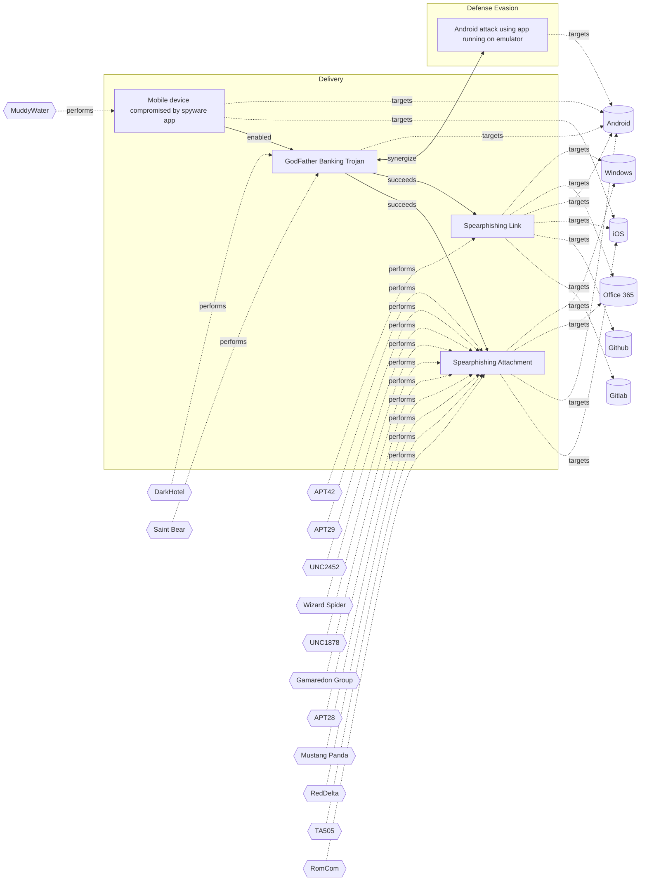

# ☣️ Android attack using app running on emulator

🔥 **Criticality:High** ⚠️ : A High priority incident is likely to result in a demonstrable impact to public health or safety, national security, economic security, foreign relations, civil liberties, or public confidence. 

🚦 **TLP:CLEAR** ⚪ : Recipients can spread this to the world, there is no limit on disclosure.

🗡️ **ATT&CK Techniques** [T1626 : Mobile : Abuse Elevation Control Mechanism](https://attack.mitre.org/techniques/T1626 'Adversaries may circumvent mechanisms designed to control elevated privileges to gain higher-level permissions Most modern systems contain native elev'), [T1633 : Mobile : Virtualization/Sandbox Evasion](https://attack.mitre.org/techniques/T1633 'Adversaries may employ various means to detect and avoid virtualization and analysis environments This may include changing behaviors after checking f'), [T1417 : Mobile : Input Capture](https://attack.mitre.org/techniques/T1417 'Adversaries may use methods of capturing user input to obtain credentials or collect information During normal device usage, users often provide crede'), [T1635 : Mobile : Steal Application Access Token](https://attack.mitre.org/techniques/T1635 'Adversaries can steal user application access tokens as a means of acquiring credentials to access remote systems and resources This can occur through'), [T1426 : Mobile : System Information Discovery](https://attack.mitre.org/techniques/T1426 'Adversaries may attempt to get detailed information about a devices operating system and hardware, including versions, patches, and architecture Adver'), [T0869 : Industrial : Standard Application Layer Protocol](https://attack.mitre.org/techniques/T0869 'Adversaries may establish command and control capabilities over commonly used application layer protocols such as HTTPS, OPC, RDP, telnet, DNP3, and m'), [T1641 : Mobile : Data Manipulation](https://attack.mitre.org/techniques/T1641 'Adversaries may insert, delete, or alter data in order to manipulate external outcomes or hide activity By manipulating data, adversaries may attempt ')

---

`🔑 UUID : 4a4a7c81-ca98-4761-8f23-7ef6354e9d1c` **|** `🏷️ Version : 1` **|** `🗓️ Creation Date : 2025-04-10` **|** `🗓️ Last Modification : 2025-04-14` **|** `Sharing Organisation : {'uuid': '56b0a0f0-b0bc-47d9-bb46-02f80ae2065a', 'name': 'EC DIGIT CSOC'}` **|** `🧱 Schema Identifier : tvm::2.1`

## 👁️ Description

> The threat vector involves exploiting emulated environments to bypass security measures, 
> automate malicious activities, and manipulate app behavior. Below are key aspects 
> of this threat:
> 
> ## How the Attack Works
> 1. **Exploitation of Emulators**:
>   - Android emulators like NoxPlayer, BlueStacks, or custom emulator farms are 
>   used by attackers to mimic legitimate devices and bypass app security mechanisms.
>   - Emulators provide attackers with a controlled environment to test and refine 
>   their techniques before deploying them at scale.
> 
> 2. **Fraudulent Activities**:
>   - **Spoofing Device Identifiers**: Attackers use emulators to replicate legitimate 
>   device identifiers (e.g., IMEI, OS version) obtained through malware or phishing 
>   attacks, making fraudulent transactions appear genuine.
>   - **Automation**: Scripts and automation frameworks enable large-scale fraud, 
>   such as creating fake accounts, performing unauthorized transactions, or bypassing 
>   authentication systems.
>   - **Data Manipulation**: Emulators allow attackers to intercept and modify app 
>   data or API calls for malicious purposes.
> 
> 3. **Advanced Techniques**:
>   - **Runtime Hooks**: Tools like Frida are used to hook into app functions dynamically, 
>   altering system properties (e.g., `ro.kernel.qemu`) to make the emulator appear 
>   as a physical device.
>   - **Customized Emulator Farms**: Organized groups deploy emulator farms with 
>   dozens of emulators to cycle through spoofed devices rapidly, avoiding detection 
>   and maximizing fraud efficiency.
> 
> ## Common Attack Scenarios
> - **Financial Fraud**: Emulator farms have been used to steal millions from banks 
> by automating fraudulent transactions while evading detection systems.
> - **API Abuse**: Attackers reverse-engineer apps running on emulators to exploit 
> APIs for unauthorized access or data theft.
> - **App Tampering**: Emulators facilitate code injection or reverse engineering 
> to modify app functionality and compromise security features.
> 
> ## Key Components Used in These Attacks
> - Access to compromised credentials (usernames/passwords) and device identifiers.
> - Custom scripts for network interception and API manipulation.
> - Cycling of spoofed devices to evade detection and maintain operational stealth.
> 

## 🖥️ Terrain 

 > Adversaries require users to download emulators that have been
> compromised or misconfigured and through these, they can carry
> out malicious activities.
> 

---

## 🕸️ Relations

### 🌊 OpenTide Objects
🚫 No related OpenTide objects indexed.

 --- 

### ⛓️ Threat Chaining

Expand chaining data

| ☣️ Vector                                                                                                                                                                                                                                        | ⛓️ Link              | 🎯 Target                                                                                                                                                                                                                                                                                         | ⛰️ Terrain                                                                                                                                                                                                                                                                                                                                                                                                                                                                                                                                                                                                                                                                                                                                                                                                                                                | 🗡️ ATT&CK                                                                                                                                                                                                                                                                                                                                                                                                                                                                                                                                                                                                                                                                                                                                                                                                                                                                                                                                                                                                                                                                                                                                                                                                                                                                                                                                                                                                                                                                                 |
|:-------------------------------------------------------------------------------------------------------------------------------------------------------------------------------------------------------------------------------------------------|:---------------------|:-------------------------------------------------------------------------------------------------------------------------------------------------------------------------------------------------------------------------------------------------------------------------------------------------|:----------------------------------------------------------------------------------------------------------------------------------------------------------------------------------------------------------------------------------------------------------------------------------------------------------------------------------------------------------------------------------------------------------------------------------------------------------------------------------------------------------------------------------------------------------------------------------------------------------------------------------------------------------------------------------------------------------------------------------------------------------------------------------------------------------------------------------------------------------|:------------------------------------------------------------------------------------------------------------------------------------------------------------------------------------------------------------------------------------------------------------------------------------------------------------------------------------------------------------------------------------------------------------------------------------------------------------------------------------------------------------------------------------------------------------------------------------------------------------------------------------------------------------------------------------------------------------------------------------------------------------------------------------------------------------------------------------------------------------------------------------------------------------------------------------------------------------------------------------------------------------------------------------------------------------------------------------------------------------------------------------------------------------------------------------------------------------------------------------------------------------------------------------------------------------------------------------------------------------------------------------------------------------------------------------------------------------------------------------------|
| [GodFather Banking Trojan](../Threat%20Vectors/☣️%20GodFather%20Banking%20Trojan.md 'The GodFather malware is a highly advanced Android banking trojan that has evolved into one of the most effective and disruptive mobile threats target...') | `support::synergize` | [Android attack using app running on emulator](../Threat%20Vectors/☣️%20Android%20attack%20using%20app%20running%20on%20emulator.md 'The threat vector involves exploiting emulated environments to bypass security measures, automate malicious activities, and manipulate app behavior Be...') | Adversaries require users to download emulators that have been compromised or misconfigured and through these, they can carry out malicious activities.                                                                                                                                                                                                                                                                                                                                                                                                                                                                                                                                                                                                                                                                                                   | [T1626](https://attack.mitre.org/techniques/T1626 'Adversaries may circumvent mechanisms designed to control elevated privileges to gain higher-level permissions Most modern systems contain native elev'), [T1633](https://attack.mitre.org/techniques/T1633 'Adversaries may employ various means to detect and avoid virtualization and analysis environments This may include changing behaviors after checking f'), [T1417](https://attack.mitre.org/techniques/T1417 'Adversaries may use methods of capturing user input to obtain credentials or collect information During normal device usage, users often provide crede'), [T1635](https://attack.mitre.org/techniques/T1635 'Adversaries can steal user application access tokens as a means of acquiring credentials to access remote systems and resources This can occur through'), [T1426](https://attack.mitre.org/techniques/T1426 'Adversaries may attempt to get detailed information about a devices operating system and hardware, including versions, patches, and architecture Adver'), [T0869](https://attack.mitre.org/techniques/T0869 'Adversaries may establish command and control capabilities over commonly used application layer protocols such as HTTPS, OPC, RDP, telnet, DNP3, and m'), [T1641](https://attack.mitre.org/techniques/T1641 'Adversaries may insert, delete, or alter data in order to manipulate external outcomes or hide activity By manipulating data, adversaries may attempt ') |
| [GodFather Banking Trojan](../Threat%20Vectors/☣️%20GodFather%20Banking%20Trojan.md 'The GodFather malware is a highly advanced Android banking trojan that has evolved into one of the most effective and disruptive mobile threats target...') | `sequence::succeeds` | [Spearphishing Link](../Threat%20Vectors/☣️%20Spearphishing%20Link.md 'Adversaries may send spearphishing emails with a malicious link in anattempt to gain access to victim systems This sub-technique employsthe use of lin...')                                                               | Spear phishing requires more preparation and time to achieve success than a phishing attack. That is because spear-phishing attackers attempt to obtain vast amounts of personal information about their victims,   the entities their work for, or their areas of interest.    Attackers can get the personal information they need using different ways: to compromise an email or messaging system trough other means, to use OSINT, scouring Social Media or glean personal information from the user's online presence.                                                                                                                                                                                                                                                                                                                              | [T1566.002 : Phishing: Spearphishing Link](https://attack.mitre.org/techniques/T1566/002 'Adversaries may send spearphishing emails with a malicious link in an attempt to gain access to victim systems Spearphishing with a link is a specific'), [T1036 : Masquerading](https://attack.mitre.org/techniques/T1036 'Adversaries may attempt to manipulate features of their artifacts to make them appear legitimate or benign to users andor security tools Masquerading '), [T1656 : Impersonation](https://attack.mitre.org/techniques/T1656 'Adversaries may impersonate a trusted person or organization in order to persuade and trick a target into performing some action on their behalf For e')                                                                                                                                                                                                                                                                                                                                                                                                                                                                                                                                                                                                                                                                                                                                                                               |
| [GodFather Banking Trojan](../Threat%20Vectors/☣️%20GodFather%20Banking%20Trojan.md 'The GodFather malware is a highly advanced Android banking trojan that has evolved into one of the most effective and disruptive mobile threats target...') | `sequence::succeeds` | [Spearphishing Attachment](../Threat%20Vectors/☣️%20Spearphishing%20Attachment.md 'Spearphishing messages are often crafted using pernicious social engineeringtechniquesIn Spearphishing Attachment attacks, recipients receive emails t...')                                                   | Spear phishing requires more preparation and time to achieve success  than a phishing attack. That is because spear-phishing attackers attempt to obtain vast amounts of personal information about their victims.   Attackers can get the personal information they need using different ways:   - to compromise an email or messaging system trough other means, - to use OSINT, sourcing Social Media or glean personal information from the user's online presence. They want to craft emails that look as legitimate and attractive as possible  to increase the chances of fooling their targets, for instance sending a malicious  attachment where the filename references a topic the recipient is interested in. The highly personalized nature of spear-phishing attacks makes it more  difficult to identity than widescale phishing attacks. | [T1566.001 : Phishing: Spearphishing Attachment](https://attack.mitre.org/techniques/T1566/001 'Adversaries may send spearphishing emails with a malicious attachment in an attempt to gain access to victim systems Spearphishing attachment is a spe')                                                                                                                                                                                                                                                                                                                                                                                                                                                                                                                                                                                                                                                                                                                                                                                                                                                                                                                                                                                                                                                                                                                                                                                                                                  |
| [GodFather Banking Trojan](../Threat%20Vectors/☣️%20GodFather%20Banking%20Trojan.md 'The GodFather malware is a highly advanced Android banking trojan that has evolved into one of the most effective and disruptive mobile threats target...') | `support::enabled`   | [Mobile device compromised by spyware app](../Threat%20Vectors/☣️%20Mobile%20device%20compromised%20by%20spyware%20app.md 'Earlier versions of spyware apps were installed on smartphones through vulnerabilitiesin commonly used apps, or involving an SMS or iMessage that prov...')           | Adversaries can abuse iOS or Android devices which are vulnerable to a zero-click or zero-day exploitation, without user intervention.                                                                                                                                                                                                                                                                                                                                                                                                                                                                                                                                                                                                                                                                                                                    | [T1512](https://attack.mitre.org/techniques/T1512 'An adversary can leverage a devices cameras to gather information by capturing video recordings Images may also be captured, potentially in specified '), [T1582](https://attack.mitre.org/techniques/T1582 'Adversaries may delete, alter, or send SMS messages without user authorization This could be used to hide C2 SMS messages, spread malware, or various '), [T1513](https://attack.mitre.org/techniques/T1513 'Adversaries may use screen capture to collect additional information about a target device, such as applications running in the foreground, user data,'), [T1517](https://attack.mitre.org/techniques/T1517 'Adversaries may collect data within notifications sent by the operating system or other applications Notifications may contain sensitive data such as '), [T1429](https://attack.mitre.org/techniques/T1429 'Adversaries may capture audio to collect information by leveraging standard operating system APIs of a mobile device Examples of audio information adv'), [T1643](https://attack.mitre.org/techniques/T1643 'Adversaries may generate outbound traffic from devices This is typically performed to manipulate external outcomes, such as to achieve carrier billing')                                                                                                                                                                                                              |

&nbsp; 

---

## Model Data

#### **⛓️ Cyber Kill Chain**

 > Cyber attacks are typically phased progressions towards strategic objectives. The Unified Kill Chains provides insight into the tactics that hackers employ to attain these objectives. This provides a solid basis to develop (or realign) defensive strategies to raise cyber resilience.

 [`🏃🏽 Defense Evasion`](https://www.unifiedkillchain.com/assets/The-Unified-Kill-Chain.pdf) : Techniques an attacker may specifically use for evading detection or avoiding other defenses.

---

#### **🛰️ Domains**

 > Infrastructure technologies domain of interest to attackers.

 `📱 Mobile` : Smartphones, tablets and applications running these devices.

---

#### **🎯 Targets**

 > Granular delimited technical entities holding a value to the organization, that are targeted by adversaries. They might be also involved in the detection coverage as the target of log collection. Partially inspired by Veris.

  - [`📱 Mobile phone`](http://veriscommunity.net/enums.html#section-asset) : User Device - Mobile phone or smartphone
 - [`🪪 Personal Information`](http://veriscommunity.net/enums.html#section-asset) : Placeholder
 - [`📱 Tablet`](http://veriscommunity.net/enums.html#section-asset) : User Device - Tablet

---

#### **💿 Platforms concerned**

 > Actual technologies used by the organization that will be exploited by adversaries during a successful attack, and eventually of relevance for detection. Are named by commercial designation.

 ` Android` : Placeholder

---

#### **💣 Severity**

 > The severity summarizes the overall danger of incident the vector will provoke, and is to be derived (WIP) from impact, leverage, and difficulty to execute.

 [`⚠️ Significant incident`](https://www.ncsc.gov.uk/news/new-cyber-attack-categorisation-system-improve-uk-response-incidents) : A cyber attack which has a serious impact on a large organisation or on wider / local government, or which poses a considerable risk to central government or (inter)national essential services.

---

#### **🪄 Leverage acquisition**

 > Technical aftermath of the attack from the target perspective, differentiated from impact as it does not consider the value of the consequence, only what increased control the vector execution provides to the adversary.

  - [`👁️‍🗨️ Information Disclosure`](https://owasp.org/www-community/Threat_Modeling_Process#stride) : Threat action intending to read a file that one was not granted access to, or to read data in transit.
 - [`⚙️ Modify configuration`](https://owasp.org/www-community/Threat_Modeling_Process#stride) : Modify configuration or services
 - [`✨ Modify data`](https://owasp.org/www-community/Threat_Modeling_Process#stride) : Modify stored data or content
 - [`📦 Software installation`](https://owasp.org/www-community/Threat_Modeling_Process#stride) : Software installation or code modification
 - [`🐒 Tampering`](https://owasp.org/www-community/Threat_Modeling_Process#stride) : Threat action intending to maliciously change or modify persistent data, such as records in a database, and the alteration of data in transit between two computers over an open network, such as the Internet.
 - [`🦠 Dwelling`](https://owasp.org/www-community/Threat_Modeling_Process#stride) : Active or passive extended presence in the target, which performs adversarial operations continuously.

---

#### **💥 Impact**

 > Analysis of the threat vector from the organizational perspective, in non technical term. This aims at putting a clear denomination on what the attacker will actually be able to act upon if the threat vector is realized.

  - [`🔓 Data Breach`](http://veriscommunity.net/enums.html#section-impact) : Non-public information has been accessed from the outside, and successfully extracted.
 - [`🥸 Identity Theft`](http://veriscommunity.net/enums.html#section-impact) : Acquisition of sufficient information and privileges to profess as a given individual, for the purpose of abusing and deceiving human trust relationships.
 - [`🧠 IP Loss`](http://veriscommunity.net/enums.html#section-impact) : Particular, key data, information and blueprint conducive to the organization capability to gain and retain a commercial or geopolitical advantage has been accessed, and their content potentially used by competitors or other adversaries.
 - [`😤 Nuisance`](http://veriscommunity.net/enums.html#section-impact) : Small and mostly inconsequential to day to day operations, but noticed.
 - [`🌍 Reputational Damages`](http://veriscommunity.net/enums.html#section-impact) : Damages to the organization public view may be achieved by using directly the access gained, or indirectly with data gathered.

---

#### **🎲 Vector Viability**

 > Described with estimative language (likelyhood probability), describes how likely the analyst believes the vector to actually be realized on the organization infrastructure. Estimative language describes quality and credibility of underlying sources, data, and methodologies based Intelligence Community Directive 203 (ICD 203) and JP 2-0, Joint Intelligence.

 [`🧐 Likely`](https://www.dni.gov/files/documents/ICD/ICD%20203%20Analytic%20Standards.pdf) : Probable (probably) - 55-80%

---

### 🔗 References

**🕊️ Publicly available resources**

- [_1_] https://fingerprint.com/blog/android-emulator-tamper-fraud-detection/
- [_2_] https://www.infosecinstitute.com/resources/general-security/mobile-emulator-farms-what-are-they-and-how-they-work/
- [_3_] https://doverunner.com/blogs/tips-for-protecting-apps-from-attacks-with-android-emulator-detection/
- [_4_] https://www.claranet.com/uk/blog/bypassing-hardened-android-applications/

[1]: https://fingerprint.com/blog/android-emulator-tamper-fraud-detection/
[2]: https://www.infosecinstitute.com/resources/general-security/mobile-emulator-farms-what-are-they-and-how-they-work/
[3]: https://doverunner.com/blogs/tips-for-protecting-apps-from-attacks-with-android-emulator-detection/
[4]: https://www.claranet.com/uk/blog/bypassing-hardened-android-applications/

---

#### 🏷️ Tags

#-, #-, #-, #
, #
, ##, ##, ##, ##, # , #🏷, #️, # , #T, #a, #g, #s, #
, #

