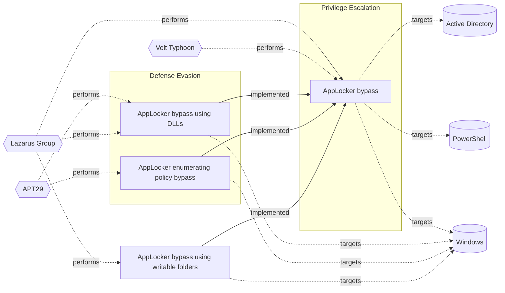

# ☣️ AppLocker bypass using DLLs

🔥 **Criticality:High** ⚠️ : A High priority incident is likely to result in a demonstrable impact to public health or safety, national security, economic security, foreign relations, civil liberties, or public confidence. 

🚦 **TLP:CLEAR** ⚪ : Recipients can spread this to the world, there is no limit on disclosure.

🗡️ **ATT&CK Techniques** [T1218 : System Binary Proxy Execution](https://attack.mitre.org/techniques/T1218 'Adversaries may bypass process andor signature-based defenses by proxying execution of malicious content with signed, or otherwise trusted, binaries B')

---

`🔑 UUID : a73c2506-8584-4c0b-bfdc-52e33c8bd229` **|** `🏷️ Version : 1` **|** `🗓️ Creation Date : 2025-07-10` **|** `🗓️ Last Modification : 2025-07-10` **|** `Sharing Organisation : {'uuid': '56b0a0f0-b0bc-47d9-bb46-02f80ae2065a', 'name': 'EC DIGIT CSOC'}` **|** `🧱 Schema Identifier : tvm::2.1`

## 👁️ Description

> AppLocker bypass using DLLs involves exploiting the way Windows loads DLLs
> into processes. An attacker can create a malicious DLL that mimics a
> legitimate one, which is allowed to run by AppLocker. When a legitimate
> application loads the malicious DLL, it can execute arbitrary code,
> effectively bypassing AppLocker restrictions.
> 
> A threat actor can bypass AppLocker application whitelisting using DLL
> libraries. The reason is that there is no a mechanism for blocking out some
> of the default DLLs. 
> 
> Additionally, DLLs are not executed directly by the operating system;
> instead, they are loaded into the memory space of a process. This makes
> it challenging for AppLocker to detect and block malicious DLLs activities.
> 
> There are several techniques that can be used to bypass AppLocker
> using DLLs:
> 
> - DLL Hijacking - a threat actor can create a malicious DLL with the same
>   name as a legitimate DLL that is already allowed by AppLocker. When the
>   legitimate application loads the DLL, it will load the malicious one
>   instead, allowing the attacker to execute arbitrary code.
> - DLL Preloading - a threat actor can create a malicious DLL that is loaded
>   before the legitimate DLL. This can be done by placing the malicious DLL in
>   a directory that is searched before the directory containing the legitimate
>   DLL.
> - DLL Side-Loading: An attacker can create a malicious DLL that is loaded by
>   a legitimate application that is allowed by AppLocker. The malicious DLL can
>   then execute arbitrary code.
> 
> ### DLL hijacking mimics a legitimate DLL name in AppLocker
> 
> An attacker can create a malicious DLL with the same name as a legitimate
> one, which is allowed to run by AppLocker. The malicious DLL is placed in a
> directory that is searched before the legitimate DLL's location.
> 
> ### Loading a malicious DLL
> 
> When a legitimate application loads the malicious DLL, Windows will load the
> malicious DLL instead of the legitimate one. This allows the attacker to
> execute arbitrary code, bypassing AppLocker restrictions.
> 
> ### REGSRV32 binary can bypass AppLocker restrictions by executing malicious DLL
> 
> Regsvr32.exe is a trusted Windows binary which can be used to bypass
> AppLocker restrictions by executing a malicious DLL (e.g., cmd.dll).
> Since regsvr32.exe is typically allowed by AppLocker policies and doesn't
> rely on cmd.exe or powershell.exe, it can be used to load and run arbitrary
> code through exported functions like `DllRegisterServer`. This allows
> attackers to execute commands or scripts while avoiding detection and
> bypassing common application whitelisting controls ref [1].
> 
> ### An example of AppLocker bypass using DLLs
> 
> As an example to bypass Windows AppLocker a threat actor can create a
> malicious DLL named `search.dll` and place it in the `C:\Windows` directory.
> When the Windows Search service loads the `search.dll` DLL, it will load the
> malicious one instead of the legitimate one.
> 

## 🖥️ Terrain 

 > The target must be a Windows environment with AppLocker enabled in
> whitelisting mode. The attacker requires initial code execution on the
> system (e.g., via phishing or exploit) and the ability to drop or register
> a DLL alongside a permitted LOLbin.  
> 

---

## 🕸️ Relations

### 🐲 Actors sightings 

| Actor               | Description                                                                                                                                                                                                                                                                                                                                                                                                                                                                                                                                                                                                                                                                                                                                                                                                                                                                                                                                                                                                                                                                                                                                                                                                                                                                                                                                                                                                                                                                                                                                                                                                                                                                                                                                                                                                                                                                                                                                                                                                                                                                                                                                                                                                                                                                                                        | Aliases                                                                                                                                                                                                                                                                                                                                                                                                                                                                                                                                                | Source                     | Sighting                                                                                                                                                                                       | Reference                                                                                                                                                                                                          |
|:--------------------|:-------------------------------------------------------------------------------------------------------------------------------------------------------------------------------------------------------------------------------------------------------------------------------------------------------------------------------------------------------------------------------------------------------------------------------------------------------------------------------------------------------------------------------------------------------------------------------------------------------------------------------------------------------------------------------------------------------------------------------------------------------------------------------------------------------------------------------------------------------------------------------------------------------------------------------------------------------------------------------------------------------------------------------------------------------------------------------------------------------------------------------------------------------------------------------------------------------------------------------------------------------------------------------------------------------------------------------------------------------------------------------------------------------------------------------------------------------------------------------------------------------------------------------------------------------------------------------------------------------------------------------------------------------------------------------------------------------------------------------------------------------------------------------------------------------------------------------------------------------------------------------------------------------------------------------------------------------------------------------------------------------------------------------------------------------------------------------------------------------------------------------------------------------------------------------------------------------------------------------------------------------------------------------------------------------------------|:-------------------------------------------------------------------------------------------------------------------------------------------------------------------------------------------------------------------------------------------------------------------------------------------------------------------------------------------------------------------------------------------------------------------------------------------------------------------------------------------------------------------------------------------------------|:---------------------------|:-----------------------------------------------------------------------------------------------------------------------------------------------------------------------------------------------|:-------------------------------------------------------------------------------------------------------------------------------------------------------------------------------------------------------------------|
| [Enterprise] APT29  | [APT29](https://attack.mitre.org/groups/G0016) is threat group that has been attributed to Russia's Foreign Intelligence Service (SVR).(Citation: White House Imposing Costs RU Gov April 2021)(Citation: UK Gov Malign RIS Activity April 2021) They have operated since at least 2008, often targeting government networks in Europe and NATO member countries, research institutes, and think tanks. [APT29](https://attack.mitre.org/groups/G0016) reportedly compromised the Democratic National Committee starting in the summer of 2015.(Citation: F-Secure The Dukes)(Citation: GRIZZLY STEPPE JAR)(Citation: Crowdstrike DNC June 2016)(Citation: UK Gov UK Exposes Russia SolarWinds April 2021)In April 2021, the US and UK governments attributed the [SolarWinds Compromise](https://attack.mitre.org/campaigns/C0024) to the SVR; public statements included citations to [APT29](https://attack.mitre.org/groups/G0016), Cozy Bear, and The Dukes.(Citation: NSA Joint Advisory SVR SolarWinds April 2021)(Citation: UK NSCS Russia SolarWinds April 2021) Industry reporting also referred to the actors involved in this campaign as UNC2452, NOBELIUM, StellarParticle, Dark Halo, and SolarStorm.(Citation: FireEye SUNBURST Backdoor December 2020)(Citation: MSTIC NOBELIUM Mar 2021)(Citation: CrowdStrike SUNSPOT Implant January 2021)(Citation: Volexity SolarWinds)(Citation: Cybersecurity Advisory SVR TTP May 2021)(Citation: Unit 42 SolarStorm December 2020)                                                                                                                                                                                                                                                                                                                                                                                                                                                                                                                                                                                                                                                                                                                                                                                                                       | Blue Kitsune, Cozy Bear, CozyDuke, Dark Halo, IRON HEMLOCK, IRON RITUAL, Midnight Blizzard, NOBELIUM, NobleBaron, SolarStorm, The Dukes, UNC2452, UNC3524, YTTRIUM                                                                                                                                                                                                                                                                                                                                                                                     | 🗡️ MITRE ATT&CK Groups     | No documented sighting                                                                                                                                                                         | No documented references                                                                                                                                                                                           |
| APT29               | A 2015 report by F-Secure describe APT29 as: 'The Dukes are a well-resourced, highly dedicated and organized cyberespionage group that we believe has been working for the Russian Federation since at least 2008 to collect intelligence in support of foreign and security policy decision-making. The Dukes show unusual confidence in their ability to continue successfully compromising their targets, as well as in their ability to operate with impunity. The Dukes primarily target Western governments and related organizations, such as government ministries and agencies, political think tanks, and governmental subcontractors. Their targets have also included the governments of members of the Commonwealth of Independent States;Asian, African, and Middle Eastern governments;organizations associated with Chechen extremism;and Russian speakers engaged in the illicit trade of controlled substances and drugs. The Dukes are known to employ a vast arsenal of malware toolsets, which we identify as MiniDuke, CosmicDuke, OnionDuke, CozyDuke, CloudDuke, SeaDuke, HammerDuke, PinchDuke, and GeminiDuke. In recent years, the Dukes have engaged in apparently biannual large - scale spear - phishing campaigns against hundreds or even thousands of recipients associated with governmental institutions and affiliated organizations. These campaigns utilize a smash - and - grab approach involving a fast but noisy breakin followed by the rapid collection and exfiltration of as much data as possible.If the compromised target is discovered to be of value, the Dukes will quickly switch the toolset used and move to using stealthier tactics focused on persistent compromise and long - term intelligence gathering. This threat actor targets government ministries and agencies in the West, Central Asia, East Africa, and the Middle East; Chechen extremist groups; Russian organized crime; and think tanks. It is suspected to be behind the 2015 compromise of unclassified networks at the White House, Department of State, Pentagon, and the Joint Chiefs of Staff. The threat actor includes all of the Dukes tool sets, including MiniDuke, CosmicDuke, OnionDuke, CozyDuke, SeaDuke, CloudDuke (aka MiniDionis), and HammerDuke (aka Hammertoss). ' | Group 100, COZY BEAR, The Dukes, Minidionis, SeaDuke, YTTRIUM, IRON HEMLOCK, Grizzly Steppe, G0016, ATK7, Cloaked Ursa, TA421, Blue Kitsune, ITG11, BlueBravo, Nobelium, UAC-0029                                                                                                                                                                                                                                                                                                                                                                      | 🌌 MISP Threat Actor Galaxy | This Russian affiliated state-sponsored threat group APT29 has beenknown to use AppLocker bypass techniques, including DLL side-loading,to install and execute malware on compromised systems. | https://medium.com/@Idabian/abusing-applocker-misconfigurations-powershell-without-powershell-part-2-24d61ce3202f                                                                                                  |
| [ICS] Lazarus Group | [Lazarus Group](https://attack.mitre.org/groups/G0032) is a North Korean state-sponsored cyber threat group that has been attributed to the Reconnaissance General Bureau.(Citation: US-CERT HIDDEN COBRA June 2017)(Citation: Treasury North Korean Cyber Groups September 2019) The group has been active since at least 2009 and was reportedly responsible for the November 2014 destructive wiper attack against Sony Pictures Entertainment as part of a campaign named Operation Blockbuster by Novetta. Malware used by [Lazarus Group](https://attack.mitre.org/groups/G0032) correlates to other reported campaigns, including Operation Flame, Operation 1Mission, Operation Troy, DarkSeoul, and Ten Days of Rain.(Citation: Novetta Blockbuster)North Korean group definitions are known to have significant overlap, and some security researchers report all North Korean state-sponsored cyber activity under the name [Lazarus Group](https://attack.mitre.org/groups/G0032) instead of tracking clusters or subgroups, such as [Andariel](https://attack.mitre.org/groups/G0138), [APT37](https://attack.mitre.org/groups/G0067), [APT38](https://attack.mitre.org/groups/G0082), and [Kimsuky](https://attack.mitre.org/groups/G0094).                                                                                                                                                                                                                                                                                                                                                                                                                                                                                                                                                                                                                                                                                                                                                                                                                                                                                                                                                                                                                                                          | Diamond Sleet, Guardians of Peace, HIDDEN COBRA, Labyrinth Chollima, NICKEL ACADEMY, ZINC                                                                                                                                                                                                                                                                                                                                                                                                                                                              | 🗡️ MITRE ATT&CK Groups     | No documented sighting                                                                                                                                                                         | No documented references                                                                                                                                                                                           |
| Lazarus Group       | Since 2009, HIDDEN COBRA actors have leveraged their capabilities to target and compromise a range of victims; some intrusions have resulted in the exfiltration of data while others have been disruptive in nature. Commercial reporting has referred to this activity as Lazarus Group and Guardians of Peace. Tools and capabilities used by HIDDEN COBRA actors include DDoS botnets, keyloggers, remote access tools (RATs), and wiper malware. Variants of malware and tools used by HIDDEN COBRA actors include Destover, Duuzer, and Hangman.                                                                                                                                                                                                                                                                                                                                                                                                                                                                                                                                                                                                                                                                                                                                                                                                                                                                                                                                                                                                                                                                                                                                                                                                                                                                                                                                                                                                                                                                                                                                                                                                                                                                                                                                                             | Operation DarkSeoul, Dark Seoul, Hidden Cobra, Hastati Group, Andariel, Unit 121, Bureau 121, NewRomanic Cyber Army Team, Bluenoroff, Subgroup: Bluenoroff, Group 77, Labyrinth Chollima, Operation Troy, Operation GhostSecret, Operation AppleJeus, APT38, APT 38, Stardust Chollima, Whois Hacking Team, Zinc, Appleworm, Nickel Academy, APT-C-26, NICKEL GLADSTONE, COVELLITE, ATK3, G0032, ATK117, G0082, Citrine Sleet, DEV-0139, DEV-1222, Diamond Sleet, ZINC, Sapphire Sleet, COPERNICIUM, TA404, Lazarus group, BeagleBoyz, Moonstone Sleet | 🌌 MISP Threat Actor Galaxy | The North Korean Lazarus group has been known to use AppLocker bypasstechniques, including DLL sideloading, to install and execute malwareon compromised systems.                              | https://www.csoonline.com/article/1311082/north-koreas-lazarus-deploys-rootkit-via-applocker-zero-day-flaw.html, https://www.securityweek.com/windows-zero-day-exploited-by-north-korean-hackers-in-rootkit-attack |

### 🌊 OpenTide Objects
🚫 No related OpenTide objects indexed.

 --- 

### ⛓️ Threat Chaining

Expand chaining data

| ☣️ Vector                                                                                                                                                                                                                      | ⛓️ Link                  | 🎯 Target                                                                                                                                                                                                                                                                           | ⛰️ Terrain                                                                                                                                                                                                                                                                                                                                                                                                | 🗡️ ATT&CK                                                                                                                                                                                                                                   |
|:-------------------------------------------------------------------------------------------------------------------------------------------------------------------------------------------------------------------------------|:-------------------------|:-----------------------------------------------------------------------------------------------------------------------------------------------------------------------------------------------------------------------------------------------------------------------------------|:----------------------------------------------------------------------------------------------------------------------------------------------------------------------------------------------------------------------------------------------------------------------------------------------------------------------------------------------------------------------------------------------------------|:--------------------------------------------------------------------------------------------------------------------------------------------------------------------------------------------------------------------------------------------|
| [AppLocker bypass](../Threat%20Vectors/☣️%20AppLocker%20bypass.md '### AppLocker rules types AppLocker can be found from within the Group Policy Management at _Local Computer Policy -Computer Configuration - Windows S...') | `atomicity::implemented` | [AppLocker bypass using DLLs](../Threat%20Vectors/☣️%20AppLocker%20bypass%20using%20DLLs.md 'AppLocker bypass using DLLs involves exploiting the way Windows loads DLLsinto processes An attacker can create a malicious DLL that mimics alegitimat...')                           | The target must be a Windows environment with AppLocker enabled in whitelisting mode. The attacker requires initial code execution on the system (e.g., via phishing or exploit) and the ability to drop or register a DLL alongside a permitted LOLbin.                                                                                                                                                  | [T1218 : System Binary Proxy Execution](https://attack.mitre.org/techniques/T1218 'Adversaries may bypass process andor signature-based defenses by proxying execution of malicious content with signed, or otherwise trusted, binaries B') |
| [AppLocker bypass](../Threat%20Vectors/☣️%20AppLocker%20bypass.md '### AppLocker rules types AppLocker can be found from within the Group Policy Management at _Local Computer Policy -Computer Configuration - Windows S...') | `atomicity::implemented` | [AppLocker enumerating policy bypass](../Threat%20Vectors/☣️%20AppLocker%20enumerating%20policy%20bypass.md 'Enumerating policy bypass in AppLocker refers to the process of identifyingand exploiting weaknesses or vulnerabilities in AppLocker policies to runun...')           | A threat actor needs to have sufficient privileges to enumerate AppLocker policies and initial access to the targeted system.   Required level of privileges to enumerate SharpAppLocker could be one of the listed below:  - Local Administrator or elevated privileges - Access to the Windows Management Instrumentation (WMI) or Windows Registry - Ability to execute PowerShell scripts or commands | [T1218 : System Binary Proxy Execution](https://attack.mitre.org/techniques/T1218 'Adversaries may bypass process andor signature-based defenses by proxying execution of malicious content with signed, or otherwise trusted, binaries B') |
| [AppLocker bypass](../Threat%20Vectors/☣️%20AppLocker%20bypass.md '### AppLocker rules types AppLocker can be found from within the Group Policy Management at _Local Computer Policy -Computer Configuration - Windows S...') | `atomicity::implemented` | [AppLocker bypass using writable folders](../Threat%20Vectors/☣️%20AppLocker%20bypass%20using%20writable%20folders.md 'AppLocker bypass using writable folders is a technique where an attackerexploits the fact that AppLocker only checks the executable files path,not the...') | A threat actor needs and initial access to a Windows system and user's write permissions where AppLocker policies allow execution from common writable directories like C:\\Windows\\Temp or Tasks.                                                                                                                                                                                                       | [T1218 : System Binary Proxy Execution](https://attack.mitre.org/techniques/T1218 'Adversaries may bypass process andor signature-based defenses by proxying execution of malicious content with signed, or otherwise trusted, binaries B') |

&nbsp; 

---

## Model Data

#### **⛓️ Cyber Kill Chain**

 > Cyber attacks are typically phased progressions towards strategic objectives. The Unified Kill Chains provides insight into the tactics that hackers employ to attain these objectives. This provides a solid basis to develop (or realign) defensive strategies to raise cyber resilience.

 [`🏃🏽 Defense Evasion`](https://www.unifiedkillchain.com/assets/The-Unified-Kill-Chain.pdf) : Techniques an attacker may specifically use for evading detection or avoiding other defenses.

---

#### **🛰️ Domains**

 > Infrastructure technologies domain of interest to attackers.

 `🏢 Enterprise` : Generic databases, applications, machines and systems that are usually on premises or on Cloud traditional VMs.

---

#### **🎯 Targets**

 > Granular delimited technical entities holding a value to the organization, that are targeted by adversaries. They might be also involved in the detection coverage as the target of log collection. Partially inspired by Veris.

  - [`💻 Laptop`](http://veriscommunity.net/enums.html#section-asset) : User Device - Laptop
 - [`🖥️ Workstations`](http://veriscommunity.net/enums.html#section-asset) : Placeholder
 - [`👤 Customer`](http://veriscommunity.net/enums.html#section-asset) : People - Customer
 - [`👤 End-user`](http://veriscommunity.net/enums.html#section-asset) : People - End-user

---

#### **💿 Platforms concerned**

 > Actual technologies used by the organization that will be exploited by adversaries during a successful attack, and eventually of relevance for detection. Are named by commercial designation.

 ` Windows` : Placeholder

---

#### **💣 Severity**

 > The severity summarizes the overall danger of incident the vector will provoke, and is to be derived (WIP) from impact, leverage, and difficulty to execute.

 [`⚠️ Significant incident`](https://www.ncsc.gov.uk/news/new-cyber-attack-categorisation-system-improve-uk-response-incidents) : A cyber attack which has a serious impact on a large organisation or on wider / local government, or which poses a considerable risk to central government or (inter)national essential services.

---

#### **🪄 Leverage acquisition**

 > Technical aftermath of the attack from the target perspective, differentiated from impact as it does not consider the value of the consequence, only what increased control the vector execution provides to the adversary.

  - [`💅 Elevation of privilege`](https://owasp.org/www-community/Threat_Modeling_Process#stride) : Capacity to augment leverage over the target system by upgrading the compromised access rights
 - [`💀 Infrastructure Compromise`](https://owasp.org/www-community/Threat_Modeling_Process#stride) : The compromised target is likely to be used to further expand the sphere of influence of the attacker and allow more potent vectors to be executed.
 - [`👁️‍🗨️ Information Disclosure`](https://owasp.org/www-community/Threat_Modeling_Process#stride) : Threat action intending to read a file that one was not granted access to, or to read data in transit.
 - [`🐒 Tampering`](https://owasp.org/www-community/Threat_Modeling_Process#stride) : Threat action intending to maliciously change or modify persistent data, such as records in a database, and the alteration of data in transit between two computers over an open network, such as the Internet.

---

#### **💥 Impact**

 > Analysis of the threat vector from the organizational perspective, in non technical term. This aims at putting a clear denomination on what the attacker will actually be able to act upon if the threat vector is realized.

  - [`🛑 Business disruption`](http://veriscommunity.net/enums.html#section-impact) : Business disruption
 - [`🩼 Impairement`](http://veriscommunity.net/enums.html#section-impact) : Incapacitation of a particular key system that will cause disruptions in day-to-day operations, and eventually service delivery.
 - [`⚖️ Legal and regulatory`](http://veriscommunity.net/enums.html#section-impact) : Legal and regulatory costs
 - [`🔓 Data Breach`](http://veriscommunity.net/enums.html#section-impact) : Non-public information has been accessed from the outside, and successfully extracted.
 - [`🤬 Lose Capabilities`](http://veriscommunity.net/enums.html#section-impact) : Vector execution will remove key functions to the organization, which will not be easily circumvented. Most day-to-day is heavily impaired, but processes can reorganize at a loss.

---

#### **🎲 Vector Viability**

 > Described with estimative language (likelyhood probability), describes how likely the analyst believes the vector to actually be realized on the organization infrastructure. Estimative language describes quality and credibility of underlying sources, data, and methodologies based Intelligence Community Directive 203 (ICD 203) and JP 2-0, Joint Intelligence.

 [`🧐 Likely`](https://www.dni.gov/files/documents/ICD/ICD%20203%20Analytic%20Standards.pdf) : Probable (probably) - 55-80%

---

### 🔗 References

**🕊️ Publicly available resources**

- [_1_] https://umsundu.co.uk/posts/Breaking-Windows-Bypassing-AppLocker-When-PowerShell-and-CMD-Are-Locked-Down
- [_2_] https://security.stackexchange.com/questions/183021/how-does-this-applocker-bypass-work-exactly-squibblydoo
- [_3_] https://insights.sei.cmu.edu/blog/bypassing-application-whitelisting
- [_4_] https://learn.microsoft.com/en-us/windows/security/application-security/application-control/app-control-for-business/applocker/dll-rules-in-applocker
- [_5_] https://www.cyberis.com/article/cve-2021-20047-dll-search-order-hijacking-vulnerability
- [_6_] https://medium.com/@Idabian/abusing-applocker-misconfigurations-powershell-without-powershell-part-2-24d61ce3202f
- [_7_] https://www.csoonline.com/article/1311082/north-koreas-lazarus-deploys-rootkit-via-applocker-zero-day-flaw.html
- [_8_] https://www.securityweek.com/windows-zero-day-exploited-by-north-korean-hackers-in-rootkit-attack

[1]: https://umsundu.co.uk/posts/Breaking-Windows-Bypassing-AppLocker-When-PowerShell-and-CMD-Are-Locked-Down
[2]: https://security.stackexchange.com/questions/183021/how-does-this-applocker-bypass-work-exactly-squibblydoo
[3]: https://insights.sei.cmu.edu/blog/bypassing-application-whitelisting
[4]: https://learn.microsoft.com/en-us/windows/security/application-security/application-control/app-control-for-business/applocker/dll-rules-in-applocker
[5]: https://www.cyberis.com/article/cve-2021-20047-dll-search-order-hijacking-vulnerability
[6]: https://medium.com/@Idabian/abusing-applocker-misconfigurations-powershell-without-powershell-part-2-24d61ce3202f
[7]: https://www.csoonline.com/article/1311082/north-koreas-lazarus-deploys-rootkit-via-applocker-zero-day-flaw.html
[8]: https://www.securityweek.com/windows-zero-day-exploited-by-north-korean-hackers-in-rootkit-attack

---

#### 🏷️ Tags

#-, #-, #-, #
, #
, ##, ##, ##, ##, # , #🏷, #️, # , #T, #a, #g, #s, #
, #

