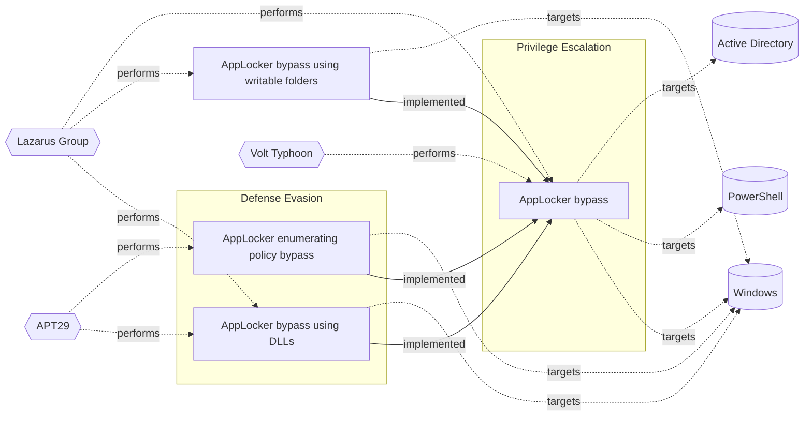

# ☣️ AppLocker bypass using writable folders

🔥 **Criticality:High** ⚠️ : A High priority incident is likely to result in a demonstrable impact to public health or safety, national security, economic security, foreign relations, civil liberties, or public confidence. 

🚦 **TLP:CLEAR** ⚪ : Recipients can spread this to the world, there is no limit on disclosure.

🗡️ **ATT&CK Techniques** [T1218 : System Binary Proxy Execution](https://attack.mitre.org/techniques/T1218 'Adversaries may bypass process andor signature-based defenses by proxying execution of malicious content with signed, or otherwise trusted, binaries B')

---

`🔑 UUID : ff8c52ac-77d0-4bee-9f6d-e40fc6e0da63` **|** `🏷️ Version : 1` **|** `🗓️ Creation Date : 2025-07-14` **|** `🗓️ Last Modification : 2025-07-15` **|** `Sharing Organisation : {'uuid': '56b0a0f0-b0bc-47d9-bb46-02f80ae2065a', 'name': 'EC DIGIT CSOC'}` **|** `🧱 Schema Identifier : tvm::2.1`

## 👁️ Description

> AppLocker bypass using writable folders is a technique where an attacker
> exploits the fact that AppLocker only checks the executable file's path,
> not the path of the folder containing the executable. By placing a malicious
> executable in a writable folder that is not restricted by AppLocker, an
> attacker can bypass AppLocker controls.  
> 
> AppLocker uses a set of rules to determine which applications are allowed
> to run. These rules are based on factors like the application's path,
> publisher, and hash. If a threat actor can write to a folder that is allowed
> by AppLocker, they can potentially bypass the restrictions.  
> 
> ### Examples for AppLocker writable folders
> 
> The list below includes some of the folders in Windows where a standard user
> have write permissions by default. These permissions can be used by threat
> actors and let them to bypass AppLocker Windows whitelisting functionality.
> For more information please check ref [1], [2].  
> 
> - `C:\Windows\Tasks` - Windows Tasks directory, writable by the "Users" group
> - `C:\Windows\Temp`  - Temporary Files
> - `C:\Windows\tracing`
> - `C:\Windows\Registration\CRMLog`
> - `C:\Windows\System32\FxsTmp`
> - `C:\Windows\System32\com\dmp`
> - `C:\Windows\System32\Microsoft\Crypto\RSA\MachineKeys`
> - `C:\Windows\System32\spool\PRINTERS`
> - `C:\Windows\System32\spool\SERVERS`
> - `C:\Windows\System32\spool\drivers\color`
> - `C:\Windows\System32\Tasks\Microsoft\Windows\SyncCenter`
> - `C:\Windows\System32\Tasks_Migrated`
>    (after peforming a version upgrade of Windows 10)
> - `C:\Windows\SysWOW64\FxsTmp`
> - `C:\Windows\SysWOW64\com\dmp`
> - `C:\Windows\SysWOW64\Tasks\Microsoft\Windows\SyncCenter`
> - `C:\Windows\SysWOW64\Tasks\Microsoft\Windows\PLA\System`
> 
> Additional ref [3], [4]:
> 
> - `%APPDATA%`                        # Application Data / Roaming User Data
> - `%LOCALAPPDATA%`                   # Local Application Data / Local User Data
> - `%USERPROFILE%\Desktop`            # User's Desktop): Desktop
> - `%USERPROFILE%\AppData\Local\Temp` # Local Low, this is a subfolder of %LOCALAPPDATA%
> 
> ### Other possible writable folders in AppLocker
> 
> There are some other possible writable folders in `C:\WINDOWS` where a
> standard Windows user may have write permissions by default. For example,
> 'accesschk.exe' from Sysinternals Suite can be used to find folders that
> are writable and can be leveraged. Furthermore, 'icacls.exe' can be used to
> determine if we also have execute rights within the targeted folder.
> 
> Different threat actors are actively exploiting this AppLocker bypass
> technique to deploy malware, execute malicious code, and gain persistence
> on compromised systems.
> 
> ### Example
> 
> Lenovo devices include a file, MFGSTAT.zip, in C:\\Windows that is writable
> by authenticated users. An attacker can embed a malicious payload into an
> NTFS alternate data stream within this ZIP file and invoke it via a signed
> Windows binary (e.g., AppVLP.exe), bypassing AppLocker rules.  
> 

## 🖥️ Terrain 

 > A threat actor needs and initial access to a Windows system and user's write
> permissions where AppLocker policies allow execution from common writable
> directories like C:\\Windows\\Temp or Tasks.     
> 

---

## 🕸️ Relations

### 🐲 Actors sightings 

| Actor               | Description                                                                                                                                                                                                                                                                                                                                                                                                                                                                                                                                                                                                                                                                                                                                                                                                                                                                                                                                                                                                                                                                                                                                                                                                                                               | Aliases                                                                                                                                                                                                                                                                                                                                                                                                                                                                                                                                                | Source                     | Sighting                                                                                                                                                                      | Reference                                                                |
|:--------------------|:----------------------------------------------------------------------------------------------------------------------------------------------------------------------------------------------------------------------------------------------------------------------------------------------------------------------------------------------------------------------------------------------------------------------------------------------------------------------------------------------------------------------------------------------------------------------------------------------------------------------------------------------------------------------------------------------------------------------------------------------------------------------------------------------------------------------------------------------------------------------------------------------------------------------------------------------------------------------------------------------------------------------------------------------------------------------------------------------------------------------------------------------------------------------------------------------------------------------------------------------------------|:-------------------------------------------------------------------------------------------------------------------------------------------------------------------------------------------------------------------------------------------------------------------------------------------------------------------------------------------------------------------------------------------------------------------------------------------------------------------------------------------------------------------------------------------------------|:---------------------------|:------------------------------------------------------------------------------------------------------------------------------------------------------------------------------|:-------------------------------------------------------------------------|
| [ICS] Lazarus Group | [Lazarus Group](https://attack.mitre.org/groups/G0032) is a North Korean state-sponsored cyber threat group that has been attributed to the Reconnaissance General Bureau.(Citation: US-CERT HIDDEN COBRA June 2017)(Citation: Treasury North Korean Cyber Groups September 2019) The group has been active since at least 2009 and was reportedly responsible for the November 2014 destructive wiper attack against Sony Pictures Entertainment as part of a campaign named Operation Blockbuster by Novetta. Malware used by [Lazarus Group](https://attack.mitre.org/groups/G0032) correlates to other reported campaigns, including Operation Flame, Operation 1Mission, Operation Troy, DarkSeoul, and Ten Days of Rain.(Citation: Novetta Blockbuster)North Korean group definitions are known to have significant overlap, and some security researchers report all North Korean state-sponsored cyber activity under the name [Lazarus Group](https://attack.mitre.org/groups/G0032) instead of tracking clusters or subgroups, such as [Andariel](https://attack.mitre.org/groups/G0138), [APT37](https://attack.mitre.org/groups/G0067), [APT38](https://attack.mitre.org/groups/G0082), and [Kimsuky](https://attack.mitre.org/groups/G0094). | Diamond Sleet, Guardians of Peace, HIDDEN COBRA, Labyrinth Chollima, NICKEL ACADEMY, ZINC                                                                                                                                                                                                                                                                                                                                                                                                                                                              | 🗡️ MITRE ATT&CK Groups     | No documented sighting                                                                                                                                                        | No documented references                                                 |
| Lazarus Group       | Since 2009, HIDDEN COBRA actors have leveraged their capabilities to target and compromise a range of victims; some intrusions have resulted in the exfiltration of data while others have been disruptive in nature. Commercial reporting has referred to this activity as Lazarus Group and Guardians of Peace. Tools and capabilities used by HIDDEN COBRA actors include DDoS botnets, keyloggers, remote access tools (RATs), and wiper malware. Variants of malware and tools used by HIDDEN COBRA actors include Destover, Duuzer, and Hangman.                                                                                                                                                                                                                                                                                                                                                                                                                                                                                                                                                                                                                                                                                                    | Operation DarkSeoul, Dark Seoul, Hidden Cobra, Hastati Group, Andariel, Unit 121, Bureau 121, NewRomanic Cyber Army Team, Bluenoroff, Subgroup: Bluenoroff, Group 77, Labyrinth Chollima, Operation Troy, Operation GhostSecret, Operation AppleJeus, APT38, APT 38, Stardust Chollima, Whois Hacking Team, Zinc, Appleworm, Nickel Academy, APT-C-26, NICKEL GLADSTONE, COVELLITE, ATK3, G0032, ATK117, G0082, Citrine Sleet, DEV-0139, DEV-1222, Diamond Sleet, ZINC, Sapphire Sleet, COPERNICIUM, TA404, Lazarus group, BeagleBoyz, Moonstone Sleet | 🌌 MISP Threat Actor Galaxy | In one of the steps of Lazarus group malicious campaign was observedthat a writable file in Lenovo's Windows directory bypass AppLockersecurity due to incorrect permissions. | https://cybersecuritynews.com/writable-file-in-lenovos-windows-directory |

### 🌊 OpenTide Objects
🚫 No related OpenTide objects indexed.

 --- 

### ⛓️ Threat Chaining

Expand chaining data

| ☣️ Vector                                                                                                                                                                                                                      | ⛓️ Link                  | 🎯 Target                                                                                                                                                                                                                                                                           | ⛰️ Terrain                                                                                                                                                                                                                                                                                                                                                                                                | 🗡️ ATT&CK                                                                                                                                                                                                                                   |
|:-------------------------------------------------------------------------------------------------------------------------------------------------------------------------------------------------------------------------------|:-------------------------|:-----------------------------------------------------------------------------------------------------------------------------------------------------------------------------------------------------------------------------------------------------------------------------------|:----------------------------------------------------------------------------------------------------------------------------------------------------------------------------------------------------------------------------------------------------------------------------------------------------------------------------------------------------------------------------------------------------------|:--------------------------------------------------------------------------------------------------------------------------------------------------------------------------------------------------------------------------------------------|
| [AppLocker bypass](../Threat%20Vectors/☣️%20AppLocker%20bypass.md '### AppLocker rules types AppLocker can be found from within the Group Policy Management at _Local Computer Policy -Computer Configuration - Windows S...') | `atomicity::implemented` | [AppLocker bypass using writable folders](../Threat%20Vectors/☣️%20AppLocker%20bypass%20using%20writable%20folders.md 'AppLocker bypass using writable folders is a technique where an attackerexploits the fact that AppLocker only checks the executable files path,not the...') | A threat actor needs and initial access to a Windows system and user's write permissions where AppLocker policies allow execution from common writable directories like C:\\Windows\\Temp or Tasks.                                                                                                                                                                                                       | [T1218 : System Binary Proxy Execution](https://attack.mitre.org/techniques/T1218 'Adversaries may bypass process andor signature-based defenses by proxying execution of malicious content with signed, or otherwise trusted, binaries B') |
| [AppLocker bypass](../Threat%20Vectors/☣️%20AppLocker%20bypass.md '### AppLocker rules types AppLocker can be found from within the Group Policy Management at _Local Computer Policy -Computer Configuration - Windows S...') | `atomicity::implemented` | [AppLocker enumerating policy bypass](../Threat%20Vectors/☣️%20AppLocker%20enumerating%20policy%20bypass.md 'Enumerating policy bypass in AppLocker refers to the process of identifyingand exploiting weaknesses or vulnerabilities in AppLocker policies to runun...')           | A threat actor needs to have sufficient privileges to enumerate AppLocker policies and initial access to the targeted system.   Required level of privileges to enumerate SharpAppLocker could be one of the listed below:  - Local Administrator or elevated privileges - Access to the Windows Management Instrumentation (WMI) or Windows Registry - Ability to execute PowerShell scripts or commands | [T1218 : System Binary Proxy Execution](https://attack.mitre.org/techniques/T1218 'Adversaries may bypass process andor signature-based defenses by proxying execution of malicious content with signed, or otherwise trusted, binaries B') |
| [AppLocker bypass](../Threat%20Vectors/☣️%20AppLocker%20bypass.md '### AppLocker rules types AppLocker can be found from within the Group Policy Management at _Local Computer Policy -Computer Configuration - Windows S...') | `atomicity::implemented` | [AppLocker bypass using DLLs](../Threat%20Vectors/☣️%20AppLocker%20bypass%20using%20DLLs.md 'AppLocker bypass using DLLs involves exploiting the way Windows loads DLLsinto processes An attacker can create a malicious DLL that mimics alegitimat...')                           | The target must be a Windows environment with AppLocker enabled in whitelisting mode. The attacker requires initial code execution on the system (e.g., via phishing or exploit) and the ability to drop or register a DLL alongside a permitted LOLbin.                                                                                                                                                  | [T1218 : System Binary Proxy Execution](https://attack.mitre.org/techniques/T1218 'Adversaries may bypass process andor signature-based defenses by proxying execution of malicious content with signed, or otherwise trusted, binaries B') |

&nbsp; 

---

## Model Data

#### **🛰️ Domains**

 > Infrastructure technologies domain of interest to attackers.

 `🏢 Enterprise` : Generic databases, applications, machines and systems that are usually on premises or on Cloud traditional VMs.

---

#### **🎯 Targets**

 > Granular delimited technical entities holding a value to the organization, that are targeted by adversaries. They might be also involved in the detection coverage as the target of log collection. Partially inspired by Veris.

  - [`🖥️ Workstations`](http://veriscommunity.net/enums.html#section-asset) : Placeholder
 - [`👤 End-user`](http://veriscommunity.net/enums.html#section-asset) : People - End-user
 - [`👤 Customer`](http://veriscommunity.net/enums.html#section-asset) : People - Customer

---

#### **💿 Platforms concerned**

 > Actual technologies used by the organization that will be exploited by adversaries during a successful attack, and eventually of relevance for detection. Are named by commercial designation.

 ` Windows` : Placeholder

---

#### **💣 Severity**

 > The severity summarizes the overall danger of incident the vector will provoke, and is to be derived (WIP) from impact, leverage, and difficulty to execute.

 [`⚠️ Significant incident`](https://www.ncsc.gov.uk/news/new-cyber-attack-categorisation-system-improve-uk-response-incidents) : A cyber attack which has a serious impact on a large organisation or on wider / local government, or which poses a considerable risk to central government or (inter)national essential services.

---

#### **🪄 Leverage acquisition**

 > Technical aftermath of the attack from the target perspective, differentiated from impact as it does not consider the value of the consequence, only what increased control the vector execution provides to the adversary.

  - [`💅 Elevation of privilege`](https://owasp.org/www-community/Threat_Modeling_Process#stride) : Capacity to augment leverage over the target system by upgrading the compromised access rights
 - [`💀 Infrastructure Compromise`](https://owasp.org/www-community/Threat_Modeling_Process#stride) : The compromised target is likely to be used to further expand the sphere of influence of the attacker and allow more potent vectors to be executed.
 - [`🐒 Tampering`](https://owasp.org/www-community/Threat_Modeling_Process#stride) : Threat action intending to maliciously change or modify persistent data, such as records in a database, and the alteration of data in transit between two computers over an open network, such as the Internet.

---

#### **💥 Impact**

 > Analysis of the threat vector from the organizational perspective, in non technical term. This aims at putting a clear denomination on what the attacker will actually be able to act upon if the threat vector is realized.

  - [`🩼 Impairement`](http://veriscommunity.net/enums.html#section-impact) : Incapacitation of a particular key system that will cause disruptions in day-to-day operations, and eventually service delivery.
 - [`🔓 Data Breach`](http://veriscommunity.net/enums.html#section-impact) : Non-public information has been accessed from the outside, and successfully extracted.
 - [`🛑 Business disruption`](http://veriscommunity.net/enums.html#section-impact) : Business disruption
 - [`🤬 Lose Capabilities`](http://veriscommunity.net/enums.html#section-impact) : Vector execution will remove key functions to the organization, which will not be easily circumvented. Most day-to-day is heavily impaired, but processes can reorganize at a loss.
 - [`🌍 Reputational Damages`](http://veriscommunity.net/enums.html#section-impact) : Damages to the organization public view may be achieved by using directly the access gained, or indirectly with data gathered.

---

#### **🎲 Vector Viability**

 > Described with estimative language (likelyhood probability), describes how likely the analyst believes the vector to actually be realized on the organization infrastructure. Estimative language describes quality and credibility of underlying sources, data, and methodologies based Intelligence Community Directive 203 (ICD 203) and JP 2-0, Joint Intelligence.

 [`🧐 Likely`](https://www.dni.gov/files/documents/ICD/ICD%20203%20Analytic%20Standards.pdf) : Probable (probably) - 55-80%

---

### 🔗 References

**🕊️ Publicly available resources**

- [_1_] https://techyrick.com/applocker-bypass-windows-privilege-escalation
- [_2_] https://github.com/api0cradle/UltimateAppLockerByPassList/blob/master/Generic-AppLockerbypasses.md
- [_3_] https://www.windowscentral.com/software-apps/windows-11/what-is-the-appdata-folder-windows-11-app-data-storage-explained
- [_4_] https://learn.microsoft.com/en-us/windows/win32/shell/knownfolderid?redirectedfrom=MSDN#roaming
- [_5_] https://www.reddit.com/r/sysadmin/comments/dvu43i/psa_applocker_default_rules_can_be_easily_bypassed
- [_6_] https://gist.github.com/egre55/6b91444b8da8ccff65a9670a334fc05d
- [_7_] https://cybersecuritynews.com/writable-file-in-lenovos-windows-directory

[1]: https://techyrick.com/applocker-bypass-windows-privilege-escalation
[2]: https://github.com/api0cradle/UltimateAppLockerByPassList/blob/master/Generic-AppLockerbypasses.md
[3]: https://www.windowscentral.com/software-apps/windows-11/what-is-the-appdata-folder-windows-11-app-data-storage-explained
[4]: https://learn.microsoft.com/en-us/windows/win32/shell/knownfolderid?redirectedfrom=MSDN#roaming
[5]: https://www.reddit.com/r/sysadmin/comments/dvu43i/psa_applocker_default_rules_can_be_easily_bypassed
[6]: https://gist.github.com/egre55/6b91444b8da8ccff65a9670a334fc05d
[7]: https://cybersecuritynews.com/writable-file-in-lenovos-windows-directory

---

#### 🏷️ Tags

#-, #-, #-, #
, #
, ##, ##, ##, ##, # , #🏷, #️, # , #T, #a, #g, #s, #
, #

