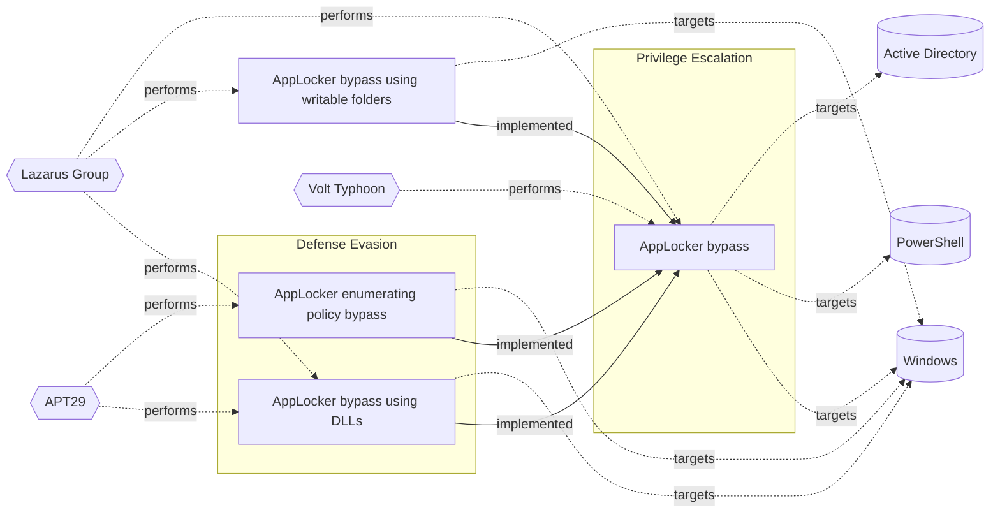

# ☣️ AppLocker bypass

🔥 **Criticality:High** ⚠️ : A High priority incident is likely to result in a demonstrable impact to public health or safety, national security, economic security, foreign relations, civil liberties, or public confidence. 

🚦 **TLP:CLEAR** ⚪ : Recipients can spread this to the world, there is no limit on disclosure.

🗡️ **ATT&CK Techniques** [T1218 : System Binary Proxy Execution](https://attack.mitre.org/techniques/T1218 'Adversaries may bypass process andor signature-based defenses by proxying execution of malicious content with signed, or otherwise trusted, binaries B')

---

`🔑 UUID : 197c06c8-7959-4e28-9ede-b3e7b6f13442` **|** `🏷️ Version : 2` **|** `🗓️ Creation Date : 2025-02-04` **|** `🗓️ Last Modification : 2025-07-23` **|** `Sharing Organisation : {'uuid': '56b0a0f0-b0bc-47d9-bb46-02f80ae2065a', 'name': 'EC DIGIT CSOC'}` **|** `🧱 Schema Identifier : tvm::2.1`

## 👁️ Description

> ### AppLocker rules types 
> 
> AppLocker can be found from within the Group Policy Management at _Local Computer Policy ->
> Computer Configuration -> Windows Settings -> Security Settings -> Application Control Policies_.
> Four rule types are available:  
> - Executable rules: enforces the rules for executable files (`.exe`).
> - Windows Installer rules: enforces the rules for windows installer files (`.msi`).
> - Script rules: enforces the rules for PowerShell, JScript, VB and older file formats (`.cmd`, `.bat`).
> - Package app rules: enforces the rules for packages that can be installed through Microsoft Store.
> 
> ### Enumerating AppLocker policies
> 
> AppLocker policies can be enumerated using the registry query functionality, as show below:
> `reg query HKEY_LOCAL_MACHINE\Software\Policies\Microsoft\Windows\SrpV2\`
> 
> ## Several strategies are available:
> 
> 
> ### Bypassing leveraging trusted folders
> 
> There are several writable folders within `C:\WINDOWS` where standard users have write permissions by default.
> `accesschk.exe` from Sysinternals Suite can be used to find folders that are writable and can be leveraged.
> Furthermore, `icacls.exe` can be used to determine if we also have execute rights within the targeted folder.
> By moving a binaryfile (for example) to the folder with execute rights, it is possible to execute the binary.
> 
> ### Bypassing using DLLs
> 
> From the initial setup there was no option of blocking out DLLs by default, resulting in another way of bypassing
> the application whitelisting. Note that AppLocker configuration can be further tweaked to restrict the usage of
> DLLs by enabling DLL rule collection from within the AppLocker properties.
> 
> ### Bypassing using Alternate Data Stream
> 
> Another method to bypass AppLocker involves embedding an executable into another file, known as an 
> alternate data stream (ADS), and then executing the EXE from the ADS. AppLocker rules do not prevent executables
> from running within an ADS.
> 
> ### Bypassing using third parties
> 
> Third party tools or software can be used to bypass the AppLocker policy. However, this is conditional, as it
> requires the system to have installed these tools on it. An example would be using Python or Perl.
> 

## 🖥️ Terrain 

 > Adversary must have administrative privileges on Windows systems within 
> the enterprise network.
> 

---

## 🕸️ Relations

### 🐲 Actors sightings 

| Actor         | Description                                                                                                                                                                                                                                                                                                                                                                                                                                                                                                                                                                                                                                                               | Aliases                                                                                                                                                                                                                                                                                                                                                                                                                                                                                                                                                | Source                     | Sighting               | Reference                |
|:--------------|:--------------------------------------------------------------------------------------------------------------------------------------------------------------------------------------------------------------------------------------------------------------------------------------------------------------------------------------------------------------------------------------------------------------------------------------------------------------------------------------------------------------------------------------------------------------------------------------------------------------------------------------------------------------------------|:-------------------------------------------------------------------------------------------------------------------------------------------------------------------------------------------------------------------------------------------------------------------------------------------------------------------------------------------------------------------------------------------------------------------------------------------------------------------------------------------------------------------------------------------------------|:---------------------------|:-----------------------|:-------------------------|
| Lazarus Group | Since 2009, HIDDEN COBRA actors have leveraged their capabilities to target and compromise a range of victims; some intrusions have resulted in the exfiltration of data while others have been disruptive in nature. Commercial reporting has referred to this activity as Lazarus Group and Guardians of Peace. Tools and capabilities used by HIDDEN COBRA actors include DDoS botnets, keyloggers, remote access tools (RATs), and wiper malware. Variants of malware and tools used by HIDDEN COBRA actors include Destover, Duuzer, and Hangman.                                                                                                                    | Operation DarkSeoul, Dark Seoul, Hidden Cobra, Hastati Group, Andariel, Unit 121, Bureau 121, NewRomanic Cyber Army Team, Bluenoroff, Subgroup: Bluenoroff, Group 77, Labyrinth Chollima, Operation Troy, Operation GhostSecret, Operation AppleJeus, APT38, APT 38, Stardust Chollima, Whois Hacking Team, Zinc, Appleworm, Nickel Academy, APT-C-26, NICKEL GLADSTONE, COVELLITE, ATK3, G0032, ATK117, G0082, Citrine Sleet, DEV-0139, DEV-1222, Diamond Sleet, ZINC, Sapphire Sleet, COPERNICIUM, TA404, Lazarus group, BeagleBoyz, Moonstone Sleet | 🌌 MISP Threat Actor Galaxy | No documented sighting | No documented references |
| Volt Typhoon  | [Microsoft] Volt Typhoon, a state-sponsored actor based in China that typically focuses on espionage and information gathering. Microsoft assesses with moderate confidence that this Volt Typhoon campaign is pursuing development of capabilities that could disrupt critical communications infrastructure between the United States and Asia region during future crises.[Secureworks] BRONZE SILHOUETTE likely operates on behalf the PRC. The targeting of U.S. government and defense organizations for intelligence gain aligns with PRC requirements, and the tradecraft observed in these engagements overlap with other state-sponsored Chinese threat groups. | BRONZE SILHOUETTE, VANGUARD PANDA, UNC3236, Insidious Taurus, VOLTZITE, Dev-0391, Storm-0391                                                                                                                                                                                                                                                                                                                                                                                                                                                           | 🌌 MISP Threat Actor Galaxy | No documented sighting | No documented references |

### 🌊 OpenTide Objects
🚫 No related OpenTide objects indexed.

 --- 

### ⛓️ Threat Chaining

Expand chaining data

| ☣️ Vector                                                                                                                                                                                                                      | ⛓️ Link                  | 🎯 Target                                                                                                                                                                                                                                                                           | ⛰️ Terrain                                                                                                                                                                                                                                                                                                                                                                                                | 🗡️ ATT&CK                                                                                                                                                                                                                                   |
|:-------------------------------------------------------------------------------------------------------------------------------------------------------------------------------------------------------------------------------|:-------------------------|:-----------------------------------------------------------------------------------------------------------------------------------------------------------------------------------------------------------------------------------------------------------------------------------|:----------------------------------------------------------------------------------------------------------------------------------------------------------------------------------------------------------------------------------------------------------------------------------------------------------------------------------------------------------------------------------------------------------|:--------------------------------------------------------------------------------------------------------------------------------------------------------------------------------------------------------------------------------------------|
| [AppLocker bypass](../Threat%20Vectors/☣️%20AppLocker%20bypass.md '### AppLocker rules types AppLocker can be found from within the Group Policy Management at _Local Computer Policy -Computer Configuration - Windows S...') | `atomicity::implemented` | [AppLocker enumerating policy bypass](../Threat%20Vectors/☣️%20AppLocker%20enumerating%20policy%20bypass.md 'Enumerating policy bypass in AppLocker refers to the process of identifyingand exploiting weaknesses or vulnerabilities in AppLocker policies to runun...')           | A threat actor needs to have sufficient privileges to enumerate AppLocker policies and initial access to the targeted system.   Required level of privileges to enumerate SharpAppLocker could be one of the listed below:  - Local Administrator or elevated privileges - Access to the Windows Management Instrumentation (WMI) or Windows Registry - Ability to execute PowerShell scripts or commands | [T1218 : System Binary Proxy Execution](https://attack.mitre.org/techniques/T1218 'Adversaries may bypass process andor signature-based defenses by proxying execution of malicious content with signed, or otherwise trusted, binaries B') |
| [AppLocker bypass](../Threat%20Vectors/☣️%20AppLocker%20bypass.md '### AppLocker rules types AppLocker can be found from within the Group Policy Management at _Local Computer Policy -Computer Configuration - Windows S...') | `atomicity::implemented` | [AppLocker bypass using writable folders](../Threat%20Vectors/☣️%20AppLocker%20bypass%20using%20writable%20folders.md 'AppLocker bypass using writable folders is a technique where an attackerexploits the fact that AppLocker only checks the executable files path,not the...') | A threat actor needs and initial access to a Windows system and user's write permissions where AppLocker policies allow execution from common writable directories like C:\\Windows\\Temp or Tasks.                                                                                                                                                                                                       | [T1218 : System Binary Proxy Execution](https://attack.mitre.org/techniques/T1218 'Adversaries may bypass process andor signature-based defenses by proxying execution of malicious content with signed, or otherwise trusted, binaries B') |
| [AppLocker bypass](../Threat%20Vectors/☣️%20AppLocker%20bypass.md '### AppLocker rules types AppLocker can be found from within the Group Policy Management at _Local Computer Policy -Computer Configuration - Windows S...') | `atomicity::implemented` | [AppLocker bypass using DLLs](../Threat%20Vectors/☣️%20AppLocker%20bypass%20using%20DLLs.md 'AppLocker bypass using DLLs involves exploiting the way Windows loads DLLsinto processes An attacker can create a malicious DLL that mimics alegitimat...')                           | The target must be a Windows environment with AppLocker enabled in whitelisting mode. The attacker requires initial code execution on the system (e.g., via phishing or exploit) and the ability to drop or register a DLL alongside a permitted LOLbin.                                                                                                                                                  | [T1218 : System Binary Proxy Execution](https://attack.mitre.org/techniques/T1218 'Adversaries may bypass process andor signature-based defenses by proxying execution of malicious content with signed, or otherwise trusted, binaries B') |

&nbsp; 

---

## Model Data

#### **⛓️ Cyber Kill Chain**

 > Cyber attacks are typically phased progressions towards strategic objectives. The Unified Kill Chains provides insight into the tactics that hackers employ to attain these objectives. This provides a solid basis to develop (or realign) defensive strategies to raise cyber resilience.

 [`🥸 Privilege Escalation`](https://www.unifiedkillchain.com/assets/The-Unified-Kill-Chain.pdf) : The result of techniques that provide an attacker with higher permissions on a system or network.

---

#### **🛰️ Domains**

 > Infrastructure technologies domain of interest to attackers.

 `🏢 Enterprise` : Generic databases, applications, machines and systems that are usually on premises or on Cloud traditional VMs.

---

#### **🎯 Targets**

 > Granular delimited technical entities holding a value to the organization, that are targeted by adversaries. They might be also involved in the detection coverage as the target of log collection. Partially inspired by Veris.

  - [`🖥️ Workstations`](http://veriscommunity.net/enums.html#section-asset) : Placeholder
 - [`💻 Laptop`](http://veriscommunity.net/enums.html#section-asset) : User Device - Laptop

---

#### **💿 Platforms concerned**

 > Actual technologies used by the organization that will be exploited by adversaries during a successful attack, and eventually of relevance for detection. Are named by commercial designation.

  - ` Active Directory` : Placeholder
 - ` PowerShell` : Placeholder
 - ` Windows` : Placeholder

---

#### **💣 Severity**

 > The severity summarizes the overall danger of incident the vector will provoke, and is to be derived (WIP) from impact, leverage, and difficulty to execute.

 [`🔫 Localised incident`](https://www.ncsc.gov.uk/news/new-cyber-attack-categorisation-system-improve-uk-response-incidents) : A cyber attack on an individual, or preliminary indications of cyber activity against a small or medium-sized organisation.

---

#### **🪄 Leverage acquisition**

 > Technical aftermath of the attack from the target perspective, differentiated from impact as it does not consider the value of the consequence, only what increased control the vector execution provides to the adversary.

  - [`⚙️ Modify configuration`](https://owasp.org/www-community/Threat_Modeling_Process#stride) : Modify configuration or services
 - [`💅 Modify privileges`](https://owasp.org/www-community/Threat_Modeling_Process#stride) : Modify privileges or permissions
 - [`📦 Software installation`](https://owasp.org/www-community/Threat_Modeling_Process#stride) : Software installation or code modification

---

#### **💥 Impact**

 > Analysis of the threat vector from the organizational perspective, in non technical term. This aims at putting a clear denomination on what the attacker will actually be able to act upon if the threat vector is realized.

  - [`🔓 Data Breach`](http://veriscommunity.net/enums.html#section-impact) : Non-public information has been accessed from the outside, and successfully extracted.
 - [`🛑 Business disruption`](http://veriscommunity.net/enums.html#section-impact) : Business disruption
 - [`🌍 Reputational Damages`](http://veriscommunity.net/enums.html#section-impact) : Damages to the organization public view may be achieved by using directly the access gained, or indirectly with data gathered.
 - [`💲 Operating costs`](http://veriscommunity.net/enums.html#section-impact) : Increased operating costs

---

#### **🎲 Vector Viability**

 > Described with estimative language (likelyhood probability), describes how likely the analyst believes the vector to actually be realized on the organization infrastructure. Estimative language describes quality and credibility of underlying sources, data, and methodologies based Intelligence Community Directive 203 (ICD 203) and JP 2-0, Joint Intelligence.

 [`♻️ Environment dependent`](https://www.dni.gov/files/documents/ICD/ICD%20203%20Analytic%20Standards.pdf) : Depends

---

### 🔗 References

**🕊️ Publicly available resources**

- [_1_] https://techyrick.com/applocker-bypass-windows-privilege-escalation/
- [_2_] https://github.com/api0cradle/UltimateAppLockerByPassList/blob/master/Generic-AppLockerbypasses.md
- [_3_] https://learn.microsoft.com/en-us/windows/security/application-security/application-control/app-control-for-business/applocker/applocker-technical-reference

[1]: https://techyrick.com/applocker-bypass-windows-privilege-escalation/
[2]: https://github.com/api0cradle/UltimateAppLockerByPassList/blob/master/Generic-AppLockerbypasses.md
[3]: https://learn.microsoft.com/en-us/windows/security/application-security/application-control/app-control-for-business/applocker/applocker-technical-reference

---

#### 🏷️ Tags

#-, #-, #-, #
, #
, ##, ##, ##, ##, # , #🏷, #️, # , #T, #a, #g, #s, #
, #

