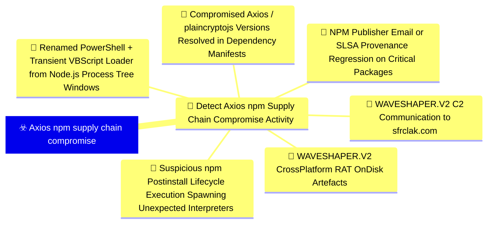
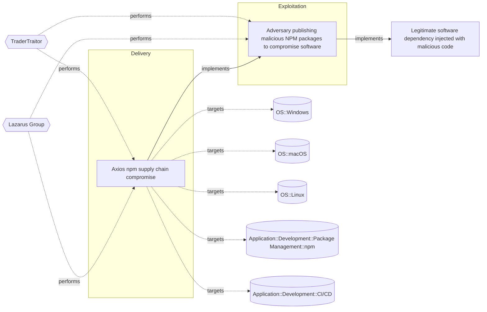

# ☣️ Axios npm supply chain compromise

🔥 **Criticality:Severe** 🚨 : A Severe priority incident is likely to result in a significant impact to public health or safety, national security, economic security, foreign relations, or civil liberties. 

🚦 **TLP:CLEAR** ⚪ : Recipients can spread this to the world, there is no limit on disclosure.


🗡️ **ATT&CK Techniques** [T1195.001 : Supply Chain Compromise: Compromise Software Dependencies and Development Tools](https://attack.mitre.org/techniques/T1195/001 'Adversaries may manipulate software dependencies and development tools prior to receipt by a final consumer for the purpose of data or system compromi'), [T1195.002 : Supply Chain Compromise: Compromise Software Supply Chain](https://attack.mitre.org/techniques/T1195/002 'Adversaries may manipulate application software prior to receipt by a final consumer for the purpose of data or system compromise Supply chain comprom'), [T1546.016 : Event Triggered Execution: Installer Packages](https://attack.mitre.org/techniques/T1546/016 'Adversaries may establish persistence and elevate privileges by using an installer to trigger the execution of malicious content Installer packages ar'), [T1078 : Valid Accounts](https://attack.mitre.org/techniques/T1078 'Adversaries may obtain and abuse credentials of existing accounts as a means of gaining Initial Access, Persistence, Privilege Escalation, or Defense '), [T1566.004 : Phishing: Spearphishing Voice](https://attack.mitre.org/techniques/T1566/004 'Adversaries may use voice communications to ultimately gain access to victim systems Spearphishing voice is a specific variant of spearphishing It is '), [T1027.014 : Obfuscated Files or Information: Polymorphic Code](https://attack.mitre.org/techniques/T1027/014 'Adversaries may utilize polymorphic code also known as metamorphic or mutating code to evade detection Polymorphic code is a type of software capable '), [T1059.001 : Command and Scripting Interpreter: PowerShell](https://attack.mitre.org/techniques/T1059/001 'Adversaries may abuse PowerShell commands and scripts for execution PowerShell is a powerful interactive command-line interface and scripting environm'), [T1059.005 : Command and Scripting Interpreter: Visual Basic](https://attack.mitre.org/techniques/T1059/005 'Adversaries may abuse Visual Basic VB for execution VB is a programming language created by Microsoft with interoperability with many Windows technolo'), [T1059.006 : Command and Scripting Interpreter: Python](https://attack.mitre.org/techniques/T1059/006 'Adversaries may abuse Python commands and scripts for execution Python is a very popular scriptingprogramming language, with capabilities to perform m'), [T1059.004 : Command and Scripting Interpreter: Unix Shell](https://attack.mitre.org/techniques/T1059/004 'Adversaries may abuse Unix shell commands and scripts for execution Unix shells are the primary command prompt on Linux, macOS, and ESXi systems, thou'), [T1036.003 : Masquerading: Rename Legitimate Utilities](https://attack.mitre.org/techniques/T1036/003 'Adversaries may rename legitimate  system utilities to try to evade security mechanisms concerning the usage of those utilities Security monitoring an'), [T1036.005 : Masquerading: Match Legitimate Resource Name or Location](https://attack.mitre.org/techniques/T1036/005 'Adversaries may match or approximate the name or location of legitimate files, Registry keys, or other resources when namingplacing them This is done '), [T1070.004 : Indicator Removal: File Deletion](https://attack.mitre.org/techniques/T1070/004 'Adversaries may delete files left behind by the actions of their intrusion activity Malware, tools, or other non-native files dropped or created on a '), [T1071.001 : Application Layer Protocol: Web Protocols](https://attack.mitre.org/techniques/T1071/001 'Adversaries may communicate using application layer protocols associated with web traffic to avoid detectionnetwork filtering by blending in with exis'), [T1082 : System Information Discovery](https://attack.mitre.org/techniques/T1082 'An adversary may attempt to get detailed information about the operating system and hardware, including version, patches, hotfixes, service packs, and'), [T1102.002 : Web Service: Bidirectional Communication](https://attack.mitre.org/techniques/T1102/002 'Adversaries may use an existing, legitimate external Web service as a means for sending commands to and receiving output from a compromised system ove'), [T1219 : Remote Access Tools](https://attack.mitre.org/techniques/T1219 'An adversary may use legitimate remote access tools to establish an interactive command and control channel within a network Remote access tools creat')


---

`🔑 UUID : 000790d9-06de-49af-893d-e4993abe6e38` **|** `🏷️ Version : 1` **|** `🗓️ Creation Date : 2026-04-28` **|** `🗓️ Last Modification : 2026-04-28` **|** `Sharing Organisation : {'uuid': '56b0a0f0-b0bc-47d9-bb46-02f80ae2065a', 'name': 'EC DIGIT CSOC'}` **|** `🧱 Schema Identifier : tvm::2.1`


## 👁️ Description

> ## Executive Summary
> 
> On 31 March 2026, the npm account of `jasonsaayman` - the lead
> maintainer of the `axios` HTTP client (~100M weekly downloads on
> the 1.x branch and ~83M on the 0.x branch) - was used to publish
> two malicious releases: `axios@1.14.1` (tagged `latest`) and
> `axios@0.30.4` (tagged `legacy`). The compromised versions were
> live for roughly three hours before being unpublished by npm.
> During that window, any default `npm install axios` resolved to a
> backdoored package whose only modification - a single line in
> `package.json` adding `"plain-crypto-js": "^4.2.1"` - pulled in a
> pre-staged dropper that, via the npm postinstall lifecycle hook,
> deployed a cross-platform Remote Access Trojan (tracked by Google
> GTIG and Elastic Security Labs as `WAVESHAPER.V2`) on Windows,
> macOS, and Linux hosts.
> 
> Google Threat Intelligence Group attributes the activity to
> `UNC1069`, a financially motivated North Korea-nexus actor active
> since at least 2018, based on malware lineage and infrastructure
> overlap.
> 
> ## Attack Timeline (UTC)
> 
> - **2026-03-30 05:57** - Attacker-controlled npm account `nrwise`
>   (`nrwise@proton.me`) publishes a clean decoy package
>   `plain-crypto-js@4.2.0` to seed registry history.
> - **2026-03-30 23:59** - `nrwise` publishes
>   `plain-crypto-js@4.2.1` carrying the malicious `setup.js`
>   dropper wired into the `postinstall` hook.
> - **2026-03-31 00:21** - The `jasonsaayman` npm account, with
>   its registered email silently changed to `ifstap@proton.me`,
>   publishes `axios@1.14.1` directly via CLI (no GitHub Actions
>   OIDC, no SLSA provenance), declaring `plain-crypto-js@^4.2.1`
>   as a dependency.
> - **2026-03-31 ~01:00** - Same actor publishes `axios@0.30.4`
>   with the identical malicious dependency, hitting the
>   legacy 0.x branch.
> - **2026-03-31 ~01:00** - First external detections by
>   Socket / StepSecurity / Aikido automated supply-chain
>   monitoring; community alerting begins.
> - **2026-03-31 ~03:20** - Both compromised axios versions and
>   `plain-crypto-js@4.2.1` are unpublished from the npm registry.
> - **2026-04-02** - Maintainer publishes the public post-mortem
>   (axios issue #10636) describing the social-engineering chain
>   that compromised his workstation.
> 
> ## Initial Access: Maintainer Account Takeover via Social Engineering
> 
> The attackers gained `npm publish` rights on `axios` not by
> exploiting the registry or the source code, but by compromising
> the maintainer's workstation. According to the maintainer's own
> post-mortem and corroborating reporting:
> 
> 1. Attackers approached the maintainer pretending to be the
>    founder of a (plausibly branded) company and invited him to
>    a private Slack workspace populated with realistic channels,
>    team members, and posts.
> 2. They scheduled a Microsoft Teams call with what appeared to
>    be several stakeholders.
> 3. During the call, the attackers told the maintainer that
>    "something on his system was out of date" and prompted him
>    to install a fix. The "fix" was a Remote Access Trojan.
> 4. With full RAT-grade control of the workstation, the attackers
>    extracted a long-lived classic npm access token (2FA on the
>    account did not block local `npm publish` because TOTP can
>    be relayed by a RAT operator), changed the registered email
>    on the npm account to `ifstap@proton.me`, and published the
>    two malicious releases directly from the registry CLI -
>    bypassing the GitHub Actions / OIDC / SLSA Trusted Publisher
>    workflow that had signed every legitimate v1.x release since
>    2023.
> 
> ## Delivery: Pre-staged Transitive Dependency
> 
> The only change to the axios package itself, in both compromised
> versions, was a single new entry under `dependencies` in
> `package.json`:
> 
> ```json
> "plain-crypto-js": "^4.2.1"
> ```
> 
> `plain-crypto-js` is never imported anywhere in the axios source.
> It exists solely to execute its `postinstall` hook on every
> consumer. The dependency had been pre-staged ~18 hours earlier:
> a clean `4.2.0` was published first to give the package
> legitimate-looking registry history, then `4.2.1` was published
> with the malicious `setup.js` dropper.
> 
> Because npm's standard resolution honours `^` semver ranges,
> every downstream `npm install axios` during the exposure window
> transparently pulled the malicious transitive dependency,
> regardless of any explicit pinning at the application level.
> 
> ## Execution: setup.js Dropper and WAVESHAPER.V2 Deployment
> 
> The `postinstall` hook of `plain-crypto-js@4.2.1` runs
> `node setup.js`, an obfuscated Node.js dropper using a custom
> Base64 + XOR string-table scheme. After deobfuscation it:
> 
> 1. Calls `os.platform()` and branches into one of three
>    OS-specific delivery routines.
> 2. Issues an HTTP POST to `http://sfrclak[.]com:8000/6202033`
>    with a platform tag in the body
>    (`packages.npm.org/product0` for macOS,
>    `packages.npm.org/product1` for Windows,
>    `packages.npm.org/product2` for Linux). The
>    `packages.npm.org/` prefix in the body is a deliberate
>    attempt to make outbound traffic look like benign npm
>    registry chatter in network logs.
> 3. Receives the platform-specific stage-2 payload from the same
>    endpoint and executes it.
> 4. Self-deletes (`setup.js` is removed and `package.json` is
>    overwritten with a clean stub) to hide on-disk evidence.
> 
> ### macOS chain
> - Stage-2: compiled Mach-O binary saved to
>   `/Library/Caches/com.apple.act.mond` (masquerading as an
>   Apple system daemon).
> - Permissions set with `chmod`, launched in the background
>   via `nohup` / `/bin/bash`.
> 
> ### Windows chain
> - The dropper locates `powershell.exe` and copies it to
>   `%PROGRAMDATA%\wt.exe` (masquerading as the Windows Terminal
>   binary).
> - Writes a transient VBScript at `%TEMP%\6202033.vbs`, executed
>   via the renamed PowerShell, which fetches a PowerShell-based
>   RAT script from C2 and executes it in memory.
> - Transient artefacts: `%TEMP%\6202033.vbs`,
>   `%TEMP%\6202033.ps1`.
> 
> ### Linux chain
> - The dropper uses Node.js `execSync` to fetch a Python RAT
>   script, saved to `/tmp/ld.py` and launched in the background
>   via `nohup` for terminal-session-independent persistence.
> 
> All three stage-2 payloads are functionally the same RAT
> (`WAVESHAPER.V2`): identical C2 protocol, command set, and
> operational behaviour across implementations.
> 
> ## WAVESHAPER.V2 Operational Profile
> 
> - C2 transport: HTTP POST.
> - Body encoding: Base64-encoded JSON.
> - User-Agent: `mozilla/4.0 (compatible; msie 8.0; windows nt 5.1; trident/4.0)`
>   (deliberately anachronistic, useful as a network detection
>   signal).
> - Beacon interval: ~60 seconds.
> - Per-execution session UID: 16-character random alphanumeric.
> - Outbound message types: `FirstInfo`, `BaseInfo`, `CmdResult`.
> - Inbound command types: `kill`, `peinject`, `runscript`,
>   `rundir`.
> - Response command types: `rsp_kill`, `rsp_peinject`,
>   `rsp_runscript`, `rsp_rundir`.
> 
> Capabilities observed across the three implementations include
> system reconnaissance, in-memory script execution, payload
> drop-and-run from a directory, PE injection (Windows), and
> process termination.
> 
> ## Indicators of Compromise (IOCs)
> 
> ### Malicious npm packages
> - `axios@1.14.1` - shasum
>   `2553649f2322049666871cea80a5d0d6adc700ca` (compromised,
>   tagged `latest` at time of discovery)
> - `axios@0.30.4` - shasum
>   `d6f3f62fd3b9f5432f5782b62d8cfd5247d5ee71` (compromised,
>   tagged `legacy` at time of discovery)
> - `plain-crypto-js@4.2.1` - shasum
>   `07d889e2dadce6f3910dcbc253317d28ca61c766` (malicious dropper)
> - `plain-crypto-js@4.2.0` (clean decoy used to seed registry
>   history)
> 
> ### Network indicators
> - C2 domain: `sfrclak[.]com`
> - C2 IP: `142.11.206.73`
> - Suspected adjacent UNC1069 IP: `23.254.167.216`
> - Full C2 URL: `http://sfrclak[.]com:8000/6202033`
> - Campaign ID: `6202033`
> - Distinctive User-Agent:
>   `mozilla/4.0 (compatible; msie 8.0; windows nt 5.1; trident/4.0)`
> - Suspicious POST body markers (decoy npm-looking strings):
>   `packages.npm.org/product0`, `packages.npm.org/product1`,
>   `packages.npm.org/product2`
> 
> ### File system indicators
> - macOS: `/Library/Caches/com.apple.act.mond`
>   sha256 `92ff08773995ebc8d55ec4b8e1a225d0d1e51efa4ef88b8849d0071230c9645a`
> - Windows: `%PROGRAMDATA%\wt.exe`,
>   `%TEMP%\6202033.vbs`, `%TEMP%\6202033.ps1`
>   (PowerShell stage-2 sha256
>   `617b67a8e1210e4fc87c92d1d1da45a2f311c08d26e89b12307cf583c900d101`)
> - Linux: `/tmp/ld.py`
>   sha256 `fcb81618bb15edfdedfb638b4c08a2af9cac9ecfa551af135a8402bf980375cf`
> - Presence of `node_modules/plain-crypto-js/` in any project
>   tree is, on its own, a strong indicator that the dropper ran.
> 
> ### Attacker accounts
> - `jasonsaayman` (compromised legitimate maintainer; registered
>   email silently flipped to `ifstap@proton.me`).
> - `nrwise` (`nrwise@proton.me`) - attacker-created npm account
>   used to publish `plain-crypto-js`.
> 
> ## Mitigation Recommendations
> 
> 1. **Immediate**
>    - Pin to safe versions: `axios@1.14.0` (1.x branch) and
>      `axios@0.30.3` (0.x branch). Add explicit `overrides` /
>      `resolutions` in manifests to prevent transitive resolution
>      to compromised versions.
>    - Remove `plain-crypto-js` from `node_modules` and
>      regenerate lockfiles from a clean state.
>    - Treat any host that ran `npm install` resolving to
>      `axios@1.14.1` or `axios@0.30.4` as fully compromised.
>      Rotate every credential reachable from that host: npm
>      tokens, GitHub PATs, AWS / Azure / GCP keys, SSH keys,
>      CI/CD secrets, and `.env` values.
>    - Block egress to `sfrclak[.]com` and `142.11.206.73`.
> 2. **Hardening**
>    - Run `npm ci --ignore-scripts` in CI/CD as a default policy
>      to neutralise `postinstall`-based supply chain attacks.
>    - Configure managed npm registries / proxies to enforce a
>      minimum package age (e.g. `npm config set min-release-age 3`
>      days) so that packages published in a narrow attacker
>      window are not pulled into builds before community
>      detection.
>    - Enforce GitHub Actions / OIDC Trusted Publishing and
>      require SLSA provenance attestations on critical packages;
>      monitor for regressions where a previously-attested package
>      is suddenly published from a CLI without provenance.
>    - Subscribe to malicious-package feeds (OpenSSF Malicious
>      Packages, Aikido Intel, Socket, StepSecurity) and integrate
>      them into pre-install gating.
> 
> ## Key Takeaways
> 
> - The axios source code was never modified - the attack lived
>   entirely in the npm publish pipeline and a single injected
>   transitive dependency.
> - 2FA on the maintainer account did not stop the attack; a RAT
>   with interactive control of the workstation defeats software
>   TOTP just as easily as it defeats a stored token.
> - The same incident chained two human-targeted techniques (fake
>   Slack / fake Teams call to install a "fix") with two
>   ecosystem-targeted techniques (transitive dependency staging
>   + maintainer account takeover) to reach hundreds of millions
>   of consumers in a 3-hour window.
> - WAVESHAPER.V2 is a single RAT specification implemented in
>   three languages targeting three operating systems, all
>   sharing the same C2 protocol. Detection should not focus on
>   a single platform.
> 


## 🖥️ Terrain 

 > Any organisation, developer workstation, or CI/CD pipeline that
> resolved axios from the public npm registry between 2026-03-31
> ~00:21 UTC and ~03:20 UTC, where the resolved version was either
> axios@1.14.1 (tagged latest) or axios@0.30.4 (tagged legacy).
> During that ~3-hour window, a default `npm install axios` (or any
> transitive resolution that floated to the latest minor) pulled in
> the malicious plain-crypto-js@^4.2.1 dependency, whose postinstall
> hook executed automatically on Windows, macOS, and Linux build
> hosts and developer laptops. Affected populations explicitly
> observed in the wild include developer endpoints, build agents,
> and CI runners across multiple operating systems and sectors;
> Huntress alone reported at least 135 endpoints communicating with
> the attacker C2 during the exposure window. The attack does not
> rely on any vulnerability in axios source code - the trust
> boundary between maintainer credentials and the npm publish
> pipeline is the actual vulnerable surface.
> 

---

## 🕸️ Relations


### 🐲 Actors sightings 

| Actor         | Description                                                                                                                                                                                                                                                                                                                                                                                                                                                                                                                                            | Aliases                                                                                                                                                                                                                                                                                                                                                                                                                                                                                                                                                | Source                     | Sighting                                                                                                                                                                                                                                                                                                                                                                                                                                                                                                                                                                                                                                                                                                                                                                                                                         | Reference                                                                                                   |
|:--------------|:-------------------------------------------------------------------------------------------------------------------------------------------------------------------------------------------------------------------------------------------------------------------------------------------------------------------------------------------------------------------------------------------------------------------------------------------------------------------------------------------------------------------------------------------------------|:-------------------------------------------------------------------------------------------------------------------------------------------------------------------------------------------------------------------------------------------------------------------------------------------------------------------------------------------------------------------------------------------------------------------------------------------------------------------------------------------------------------------------------------------------------|:---------------------------|:---------------------------------------------------------------------------------------------------------------------------------------------------------------------------------------------------------------------------------------------------------------------------------------------------------------------------------------------------------------------------------------------------------------------------------------------------------------------------------------------------------------------------------------------------------------------------------------------------------------------------------------------------------------------------------------------------------------------------------------------------------------------------------------------------------------------------------|:------------------------------------------------------------------------------------------------------------|
| TraderTraitor | TraderTraitor targets blockchain companies through spear-phishing messages. The group sends these messages to employees, particularly those in system administration or software development roles, on various communication platforms, intended to gain access to these start-up and high-tech companies. TraderTraitor may be the work of operators previously responsible for APT38 activity.                                                                                                                                                       | Jade Sleet, UNC4899, Pukchong                                                                                                                                                                                                                                                                                                                                                                                                                                                                                                                          | 🌌 MISP Threat Actor Galaxy | Google Threat Intelligence Group (GTIG) attributes the Axiosnpm compromise to UNC1069, a financially motivated NorthKorea-nexus threat actor active since at least 2018. UNC1069sits in the broader DPRK developer-targeting ecosystemalongside TraderTraitor / Jade Sleet, which has historicallytargeted blockchain and technology employees with socialengineering on communication platforms - the same tradecraftobserved against the axios maintainer. Attribution to UNC1069is based on the deployment of WAVESHAPER.V2 (an updatedvariant of WAVESHAPER previously used by UNC1069) and oninfrastructure overlap: the C2 host sfrclak[.]com(142.11.206.73) was contacted from an AstrillVPN nodepreviously linked to UNC1069, and adjacent infrastructure onthe same ASN has been historically tied to the same cluster. | https://cloud.google.com/blog/topics/threat-intelligence/north-korea-threat-actor-targets-axios-npm-package |
| Lazarus Group | Since 2009, HIDDEN COBRA actors have leveraged their capabilities to target and compromise a range of victims; some intrusions have resulted in the exfiltration of data while others have been disruptive in nature. Commercial reporting has referred to this activity as Lazarus Group and Guardians of Peace. Tools and capabilities used by HIDDEN COBRA actors include DDoS botnets, keyloggers, remote access tools (RATs), and wiper malware. Variants of malware and tools used by HIDDEN COBRA actors include Destover, Duuzer, and Hangman. | Operation DarkSeoul, Dark Seoul, Hidden Cobra, Hastati Group, Andariel, Unit 121, Bureau 121, NewRomanic Cyber Army Team, Bluenoroff, Subgroup: Bluenoroff, Group 77, Labyrinth Chollima, Operation Troy, Operation GhostSecret, Operation AppleJeus, APT38, APT 38, Stardust Chollima, Whois Hacking Team, Zinc, Appleworm, Nickel Academy, APT-C-26, NICKEL GLADSTONE, COVELLITE, ATK3, G0032, ATK117, G0082, Citrine Sleet, DEV-0139, DEV-1222, Diamond Sleet, ZINC, Sapphire Sleet, COPERNICIUM, TA404, Lazarus group, BeagleBoyz, Moonstone Sleet | 🌌 MISP Threat Actor Galaxy | UNC1069 is generally aligned with the broader DPRK cyberecosystem (Lazarus cluster). The use of npm packagecompromise as an initial access vehicle is consistent withprior Lazarus / TraderTraitor operations targeting developertooling and cryptocurrency-adjacent organisations.                                                                                                                                                                                                                                                                                                                                                                                                                                                                                                                                              | No documented references                                                                                    |

### 🌊 OpenTide Objects




 **Descendants** 

| 🎯 Detection Objectives                                                                                                                                                                                                                                                                                          | 📡 Detection Objective Signals (6)                                                                                                                                                                                                                                                                                                                                                                                                                                                                                                                                                                                                                                                                                                                                                                                                                                                                                                                                                                                                                                                                                                                                                                                                                                                                                                                                                                                                                                                                                                                                                                                                                                                                                                                                                                                                                                                                                                                                                                                                                                                                                                                                                                                                                                                                                                                                                                                                                                                                                                                                                      | 🛡️ Detection Models    | 🚨 Detection Rules    |
|:----------------------------------------------------------------------------------------------------------------------------------------------------------------------------------------------------------------------------------------------------------------------------------------------------------------|:---------------------------------------------------------------------------------------------------------------------------------------------------------------------------------------------------------------------------------------------------------------------------------------------------------------------------------------------------------------------------------------------------------------------------------------------------------------------------------------------------------------------------------------------------------------------------------------------------------------------------------------------------------------------------------------------------------------------------------------------------------------------------------------------------------------------------------------------------------------------------------------------------------------------------------------------------------------------------------------------------------------------------------------------------------------------------------------------------------------------------------------------------------------------------------------------------------------------------------------------------------------------------------------------------------------------------------------------------------------------------------------------------------------------------------------------------------------------------------------------------------------------------------------------------------------------------------------------------------------------------------------------------------------------------------------------------------------------------------------------------------------------------------------------------------------------------------------------------------------------------------------------------------------------------------------------------------------------------------------------------------------------------------------------------------------------------------------------------------------------------------------------------------------------------------------------------------------------------------------------------------------------------------------------------------------------------------------------------------------------------------------------------------------------------------------------------------------------------------------------------------------------------------------------------------------------------------------|:-----------------------|:---------------------|
| [Detect Axios npm Supply Chain Compromise Activity](../Detection%20Objectives/🎯%20Detect%20Axios%20npm%20Supply%20Chain%20Compromise%20Activity.md 'This Detection Objective addresses the 31 March 2026 supply chaincompromise of the axios npm package, in which a hijackedmaintainer account published ...') | [Detect Axios npm Supply Chain Compromise Activity::WAVESHAPER.V2 Cross-Platform RAT On-Disk Artefacts](Detect%20Axios%20npm%20Supply%20Chain%20Compromise%20Activity#waveshaper.v2-cross-platform-rat-on-disk-artefacts.md 'High-specificity file-event detection for the platform-specific stage-2 RAT artefacts dropped by theplain-crypto-js postinstall chain Each branch of t...')<br>[Detect Axios npm Supply Chain Compromise Activity::NPM Publisher Email or SLSA Provenance Regression on Critical Packages](Detect%20Axios%20npm%20Supply%20Chain%20Compromise%20Activity#npm-publisher-email-or-slsa-provenance-regression-on-critical-packages.md 'Preventive detection that surfaces the registry-sideprecondition exploited in the axios attack thelegitimate maintainers account was hijacked, theregi...')<br>[Detect Axios npm Supply Chain Compromise Activity::Suspicious npm Postinstall Lifecycle Execution Spawning Unexpected Interpreters](Detect%20Axios%20npm%20Supply%20Chain%20Compromise%20Activity#suspicious-npm-postinstall-lifecycle-execution-spawning-unexpected-interpreters.md 'Behavioural detection of the npm postinstall hookexecuting the setupjs dropper The dropper is launchedby the package manager npm, pnpm, or yarn -ultim...')<br>[Detect Axios npm Supply Chain Compromise Activity::Renamed PowerShell + Transient VBScript Loader from Node.js Process Tree (Windows)](Detect%20Axios%20npm%20Supply%20Chain%20Compromise%20Activity#renamed-powershell-+-transient-vbscript-loader-from-node.js-process-tree-(windows).md 'Windows-specific behavioural detection for thedistinctive stage-2 chain used by WAVESHAPERV2 Thedropper1 Locates powershellexe and copies it to   PROG...')<br>[Detect Axios npm Supply Chain Compromise Activity::WAVESHAPER.V2 C2 Communication to sfrclak[.]com](Detect%20Axios%20npm%20Supply%20Chain%20Compromise%20Activity#waveshaper.v2-c2-communication-to-sfrclak[.]com.md 'Network-level detection of the WAVESHAPERV2 command-and-control channel All three OS-specific RATimplementations share the same C2 protocol, host, and...')<br>[Detect Axios npm Supply Chain Compromise Activity::Compromised Axios / plain-crypto-js Versions Resolved in Dependency Manifests](Detect%20Axios%20npm%20Supply%20Chain%20Compromise%20Activity#compromised-axios-/-plain-crypto-js-versions-resolved-in-dependency-manifests.md 'Inventory-level detection that any project, lockfile, SBOM,or build artefact ever resolved a compromised version ofaxios or any version of plain-crypt...') | ❌ No Detection Models  | ❌ No Detection Rules |


 --- 

### ⛓️ Threat Chaining




<details>
<summary>Expand chaining data</summary>

| ☣️ Vector                                                                                                                                                                                                                                                                                                                                      | ⛓️ Link                 | 🎯 Target                                                                                                                                                                                                                                                                                                                                       | ⛰️ Terrain                                                                                                                                                                                                                                         | 🗡️ ATT&CK                                                                                                                                                                                                                                                                                                                                                                                                                                                                                                                                                                                                                                                                                                                                                                                                                                                                                                                                                                                                                                                                                                                                                                                                                                                                                                                                                                                                                                                                                                         |
|:-----------------------------------------------------------------------------------------------------------------------------------------------------------------------------------------------------------------------------------------------------------------------------------------------------------------------------------------------|:------------------------|:-----------------------------------------------------------------------------------------------------------------------------------------------------------------------------------------------------------------------------------------------------------------------------------------------------------------------------------------------|:---------------------------------------------------------------------------------------------------------------------------------------------------------------------------------------------------------------------------------------------------|:------------------------------------------------------------------------------------------------------------------------------------------------------------------------------------------------------------------------------------------------------------------------------------------------------------------------------------------------------------------------------------------------------------------------------------------------------------------------------------------------------------------------------------------------------------------------------------------------------------------------------------------------------------------------------------------------------------------------------------------------------------------------------------------------------------------------------------------------------------------------------------------------------------------------------------------------------------------------------------------------------------------------------------------------------------------------------------------------------------------------------------------------------------------------------------------------------------------------------------------------------------------------------------------------------------------------------------------------------------------------------------------------------------------------------------------------------------------------------------------------------------------|
| [Axios npm supply chain compromise](../Threat%20Vectors/☣️%20Axios%20npm%20supply%20chain%20compromise.md '## Executive SummaryOn 31 March 2026, the npm account of jasonsaayman - the leadmaintainer of the axios HTTP client 100M weekly downloads onthe 1x bra...')                                                                         | `atomicity::implements` | [Adversary publishing malicious NPM packages to compromise software](../Threat%20Vectors/☣️%20Adversary%20publishing%20malicious%20NPM%20packages%20to%20compromise%20software.md 'Threat actors use a technique which includes updating of NPM packageswith malicious code to deceive a developer or an end-user to downloadand install ...') | Adversary publishing malicious NPM packages to compromise software.                                                                                                                                                                                | [T1195 : Supply Chain Compromise](https://attack.mitre.org/techniques/T1195 'Adversaries may manipulate products or product delivery mechanisms prior to receipt by a final consumer for the purpose of data or system compromiseSu'), [T1082 : System Information Discovery](https://attack.mitre.org/techniques/T1082 'An adversary may attempt to get detailed information about the operating system and hardware, including version, patches, hotfixes, service packs, and'), [T1546.016 : Event Triggered Execution: Installer Packages](https://attack.mitre.org/techniques/T1546/016 'Adversaries may establish persistence and elevate privileges by using an installer to trigger the execution of malicious content Installer packages ar'), [T1036 : Masquerading](https://attack.mitre.org/techniques/T1036 'Adversaries may attempt to manipulate features of their artifacts to make them appear legitimate or benign to users andor security tools Masquerading ')                                                                                                                                                                                                                                                                                                                                                                                                                                                                                                                                |
| [Adversary publishing malicious NPM packages to compromise software](../Threat%20Vectors/☣️%20Adversary%20publishing%20malicious%20NPM%20packages%20to%20compromise%20software.md 'Threat actors use a technique which includes updating of NPM packageswith malicious code to deceive a developer or an end-user to downloadand install ...') | `atomicity::implements` | [Legitimate software dependency injected with malicious code](../Threat%20Vectors/☣️%20Legitimate%20software%20dependency%20injected%20with%20malicious%20code.md 'Legitimate software dependency injected with malicious code refersto a type of attack where an adversary compromises a legitimate softwaredependency, ...')                 | A threat actor uses an already existing vulnerable open-source library component to inject malicious code.  They can use also a build-in or some type of an inherited vulnerability in the vendor's process which allows malicious code injection. | [T1195.002](https://attack.mitre.org/techniques/T1195/002 'Adversaries may manipulate application software prior to receipt by a final consumer for the purpose of data or system compromise Supply chain comprom'), [T1195.001](https://attack.mitre.org/techniques/T1195/001 'Adversaries may manipulate software dependencies and development tools prior to receipt by a final consumer for the purpose of data or system compromi'), [T1204](https://attack.mitre.org/techniques/T1204 'An adversary may rely upon specific actions by a user in order to gain execution Users may be subjected to social engineering to get them to execute m'), [T1218](https://attack.mitre.org/techniques/T1218 'Adversaries may bypass process andor signature-based defenses by proxying execution of malicious content with signed, or otherwise trusted, binaries B'), [T1499](https://attack.mitre.org/techniques/T1499 'Adversaries may perform Endpoint Denial of Service DoS attacks to degrade or block the availability of services to users Endpoint DoS can be performed'), [T1559.002](https://attack.mitre.org/techniques/T1559/002 'Adversaries may use Windows Dynamic Data Exchange DDE to execute arbitrary commands DDE is a client-server protocol for one-time andor continuous inte'), [T1036](https://attack.mitre.org/techniques/T1036 'Adversaries may attempt to manipulate features of their artifacts to make them appear legitimate or benign to users andor security tools Masquerading ') |

</details>
&nbsp; 


---

## Model Data

#### **⛓️ Cyber Kill Chain**

 > Cyber attacks are typically phased progressions towards strategic objectives. The Unified Kill Chains provides insight into the tactics that hackers employ to attain these objectives. This provides a solid basis to develop (or realign) defensive strategies to raise cyber resilience.

 [`📦 Delivery`](https://www.unifiedkillchain.com/assets/The-Unified-Kill-Chain.pdf) : Techniques resulting in the transmission of a weaponized object to the targeted environment.

---

#### **💣 Severity**

 > The severity summarizes the overall danger of incident the vector will provoke, and is to be derived (WIP) from impact, leverage, and difficulty to execute.

 [`🚨 Highly significant incident`](https://www.ncsc.gov.uk/news/new-cyber-attack-categorisation-system-improve-uk-response-incidents) : A cyber attack which has a serious impact on central government, (inter)national essential services, a large proportion of the (inter)national population, or the (inter)national economy.

---

#### **🪄 Leverage acquisition**

 > Technical aftermath of the attack from the target perspective, differentiated from impact as it does not consider the value of the consequence, only what increased control the vector execution provides to the adversary.

  - [`💀 Infrastructure Compromise`](https://owasp.org/www-community/Threat_Modeling_Process#stride) : The compromised target is likely to be used to further expand the sphere of influence of the attacker and allow more potent vectors to be executed.
 - [`🐒 Tampering`](https://owasp.org/www-community/Threat_Modeling_Process#stride) : Threat action intending to maliciously change or modify persistent data, such as records in a database, and the alteration of data in transit between two computers over an open network, such as the Internet.
 - [`📦 Software installation`](https://owasp.org/www-community/Threat_Modeling_Process#stride) : Software installation or code modification
 - [`🔭 Information Gathering`](https://owasp.org/www-community/Threat_Modeling_Process#stride) : Gathering information about the target system, network, or environment to inform subsequent attack phases.
 - [`👁️‍🗨️ Information Disclosure`](https://owasp.org/www-community/Threat_Modeling_Process#stride) : Threat action intending to read a file that one was not granted access to, or to read data in transit.

---

#### **💥 Impact**

 > Analysis of the threat vector from the organizational perspective, in non technical term. This aims at putting a clear denomination on what the attacker will actually be able to act upon if the threat vector is realized.

  - [`🔓 Data Breach`](http://veriscommunity.net/enums.html#section-impact) : Non-public information has been accessed from the outside, and successfully extracted.
 - [`🛑 Business disruption`](http://veriscommunity.net/enums.html#section-impact) : Business disruption
 - [`🤬 Lose Capabilities`](http://veriscommunity.net/enums.html#section-impact) : Vector execution will remove key functions to the organization, which will not be easily circumvented. Most day-to-day is heavily impaired, but processes can reorganize at a loss.
 - [`🌍 Reputational Damages`](http://veriscommunity.net/enums.html#section-impact) : Damages to the organization public view may be achieved by using directly the access gained, or indirectly with data gathered.
 - [`💲 Operating costs`](http://veriscommunity.net/enums.html#section-impact) : Increased operating costs

---

#### **🎲 Vector Viability**

 > Described with estimative language (likelyhood probability), describes how likely the analyst believes the vector to actually be realized on the organization infrastructure. Estimative language describes quality and credibility of underlying sources, data, and methodologies based Intelligence Community Directive 203 (ICD 203) and JP 2-0, Joint Intelligence.

 [`😱 Almost certain`](https://www.dni.gov/files/documents/ICD/ICD%20203%20Analytic%20Standards.pdf) : Nearly certain - 95-99%

---


## 🌐 Threat Surface

- ` OS::Windows` — Microsoft Windows operating systems (all versions)
- ` OS::macOS` — Apple macOS operating systems (all versions)
- ` OS::Linux` — Linux-based operating systems (all distributions)
- ` Application::Development::Package Management::npm` — npm JavaScript package manager
- ` Application::Development::CI/CD` — Continuous integration and continuous delivery platforms


### 🔗 References


**🕊️ Publicly available resources**

- [_1_] https://www.cisa.gov/news-events/alerts/2026/04/20/supply-chain-compromise-impacts-axios-node-package-manager
- [_2_] https://www.microsoft.com/en-us/security/blog/2026/04/01/mitigating-the-axios-npm-supply-chain-compromise/
- [_3_] https://cloud.google.com/blog/topics/threat-intelligence/north-korea-threat-actor-targets-axios-npm-package
- [_4_] https://www.aikido.dev/blog/axios-npm-compromised-maintainer-hijacked-rat
- [_5_] https://socprime.com/active-threats/supply-chain-attack-on-axios-pulls-malicious-dependency-from-npm/
- [_6_] https://www.huntress.com/blog/axios-npm-compromise
- [_7_] https://www.elastic.co/security-labs/axios-one-rat-to-rule-them-all
- [_8_] https://www.picussecurity.com/resource/blog/axios-npm-supply-chain-attack-cross-platform-rat-delivery-via-compromised-maintainer-credentials
- [_9_] https://www.stepsecurity.io/blog/axios-compromised-on-npm-malicious-versions-drop-remote-access-trojan
- [_10_] https://socket.dev/blog/axios-npm-package-compromised
- [_11_] https://github.com/axios/axios/issues/10636
- [_12_] https://www.airlockdigital.com/airlock-blog/the-axios-supply-chain-attack-why-detection-wasnt-enough

[1]: https://www.cisa.gov/news-events/alerts/2026/04/20/supply-chain-compromise-impacts-axios-node-package-manager
[2]: https://www.microsoft.com/en-us/security/blog/2026/04/01/mitigating-the-axios-npm-supply-chain-compromise/
[3]: https://cloud.google.com/blog/topics/threat-intelligence/north-korea-threat-actor-targets-axios-npm-package
[4]: https://www.aikido.dev/blog/axios-npm-compromised-maintainer-hijacked-rat
[5]: https://socprime.com/active-threats/supply-chain-attack-on-axios-pulls-malicious-dependency-from-npm/
[6]: https://www.huntress.com/blog/axios-npm-compromise
[7]: https://www.elastic.co/security-labs/axios-one-rat-to-rule-them-all
[8]: https://www.picussecurity.com/resource/blog/axios-npm-supply-chain-attack-cross-platform-rat-delivery-via-compromised-maintainer-credentials
[9]: https://www.stepsecurity.io/blog/axios-compromised-on-npm-malicious-versions-drop-remote-access-trojan
[10]: https://socket.dev/blog/axios-npm-package-compromised
[11]: https://github.com/axios/axios/issues/10636
[12]: https://www.airlockdigital.com/airlock-blog/the-axios-supply-chain-attack-why-detection-wasnt-enough

---

#### 🏷️ Tags

#-, #-, #-, #
, #
, ##, ##, ##, ##, # , #🏷, #️, # , #T, #a, #g, #s, #
, #


