# ☣️ Azure - Port Mapping

🔥 **Criticality:High** ⚠️ : A High priority incident is likely to result in a demonstrable impact to public health or safety, national security, economic security, foreign relations, civil liberties, or public confidence. 

🚦 **TLP:CLEAR** ⚪ : Recipients can spread this to the world, there is no limit on disclosure.

🗡️ **ATT&CK Techniques** [T1190 : Exploit Public-Facing Application](https://attack.mitre.org/techniques/T1190 'Adversaries may attempt to exploit a weakness in an Internet-facing host or system to initially access a network The weakness in the system can be a s'), [T1078 : Valid Accounts](https://attack.mitre.org/techniques/T1078 'Adversaries may obtain and abuse credentials of existing accounts as a means of gaining Initial Access, Persistence, Privilege Escalation, or Defense '), [T1110 : Brute Force](https://attack.mitre.org/techniques/T1110 'Adversaries may use brute force techniques to gain access to accounts when passwords are unknown or when password hashes are obtainedCitation TrendMic')

---

`🔑 UUID : 394dde97-4a8c-4b6a-8f8b-c6bf18a7a87f` **|** `🏷️ Version : 3` **|** `🗓️ Creation Date : 2025-07-10` **|** `🗓️ Last Modification : 2025-09-08` **|** `Sharing Organisation : {'uuid': '56b0a0f0-b0bc-47d9-bb46-02f80ae2065a', 'name': 'EC DIGIT CSOC'}` **|** `🧱 Schema Identifier : tvm::2.1`

## 👁️ Description

> Port mapping in Azure refers to the process of exposing internal ports of virtual 
> machines (VMs), containers, or services to external networks, often through Azure 
> Load Balancers, Network Security Groups (NSGs), or NAT rules. This allows external 
> users or services to access resources inside a private Azure network by mapping 
> public ports to private ones.
> 
> ### How Port Mapping Can Be a Threat Vector
> 
> Port mapping, if misconfigured or left unsecured, can introduce several security risks:
> 
> - **Exposure of Internal Services:** Mapping internal ports to public endpoints 
> can expose services (e.g., RDP, SSH, HTTP) to the internet, making them targets 
> for scanning, brute-force attacks, and exploitation of vulnerabilities.
> - **Reconnaissance by Attackers:** Attackers can enumerate open ports by analyzing 
> NSG rules or scanning Azure IP ranges, identifying which services are accessible 
> and potentially vulnerable.
> - **Misconfigured NSGs:** If NSGs are not properly configured, they may inadvertently 
> allow unrestricted access to sensitive ports, increasing the attack surface.
> - **Bypassing Security Controls:** Using non-standard port mappings 
> (e.g., mapping RDP 3389 to a random high port) may provide slight obscurity but 
> does not prevent targeted attacks, especially if attackers scan all ports.
> - **Container and VM Risks:** Improper port mapping in Azure container services 
> or VMs can lead to exposure of management interfaces or application endpoints, increasing 
> the risk of unauthorized access or lateral movement within the environment.
> 
> ### Common Attack Scenarios
> 
> - **Brute Force Attacks:** Exposed RDP (3389) or SSH (22) ports are frequent targets 
> for automated brute-force attempts.
> - **Service Exploitation:** Attackers may exploit known vulnerabilities on exposed 
> ports, especially if services are outdated or unpatched.
> - **Information Gathering:** Attackers use port mapping information to build a profile 
> of the environment, identifying potential entry points for further attacks.
> 

## 🖥️ Terrain 

 > Adversaries need an exposed service or port that is accessible from outside the Azure 
> environment—typically via a public IP and a mapped port (such as SSH, RDP, or web services).
> 

---

## 🕸️ Relations

### 🌊 OpenTide Objects
🚫 No related OpenTide objects indexed.

 --- 

### ⛓️ Threat Chaining

```mermaid

flowchart LR

394dde97-4a8c-4b6a-8f8b-c6bf18a7a87f[Azure - Port Mapping]
4e7eae8e-6615-41f2-bfe1-21a04f7a6088[Azure - Gather Victim Data]
b1593e0b-1b3b-462d-9ab6-21d1c136469d[Azure - Gather Resource Data]
53063205-4404-4e6d-a2f5-d566c6085d96[Data collection using SharpHound, SoapHound, Bloodhound and Azurehound]
dd5d942c-bac4-4000-b9a6-ca4fef6cfb84[Spearphishing Attachment]
1a68b5eb-0112-424d-a21f-88dda0b6b8df[Spearphishing Link]
66aafb61-9a46-4287-8b40-4785b42b77a3[Adversary in the Middle phishing sites to bypass MFA]
9bb31c65-8abd-48fc-afe3-8aca76109737[Azure - Modify federation trust to accept externally signed tokens]
4a807ac4-f764-41b1-ae6f-94239041d349[MFA Bypass Techniques]

subgraph Reconnaissance
394dde97-4a8c-4b6a-8f8b-c6bf18a7a87f
4e7eae8e-6615-41f2-bfe1-21a04f7a6088
b1593e0b-1b3b-462d-9ab6-21d1c136469d
53063205-4404-4e6d-a2f5-d566c6085d96
end
subgraph Delivery
dd5d942c-bac4-4000-b9a6-ca4fef6cfb84
1a68b5eb-0112-424d-a21f-88dda0b6b8df
end
subgraph Credential Access
66aafb61-9a46-4287-8b40-4785b42b77a3
4a807ac4-f764-41b1-ae6f-94239041d349
end
subgraph Lateral Movement
9bb31c65-8abd-48fc-afe3-8aca76109737
end

Azure[(Azure)]
AzureAD[(Azure AD)]
Office365[(Office 365)]
Windows[(Windows)]
Linux[(Linux)]
PowerShell[(PowerShell)]
ActiveDirectory[(Active Directory)]
AzureAKS[(Azure AKS)]
Android[(Android)]
iOS[(iOS)]
Github[(Github)]
Gitlab[(Gitlab)]
ADFS[(AD FS)]
AWSIAM[(AWS IAM)]
EULogin[(EU Login)]
APT32{{APT32}}
FIN13{{FIN13}}
HEXANE{{HEXANE}}
LAPSUS{{LAPSUS}}
MagicHound{{Magic Hound}}
OperationWocao{{Operation Wocao}}
StarBlizzard{{Star Blizzard}}
VoltTyphoon{{Volt Typhoon}}
HAFNIUM{{HAFNIUM}}
SaltTyphoon{{Salt Typhoon}}
WIZARDSPIDER{{WIZARD SPIDER}}
APT29{{APT29}}
TA505{{TA505}}
UNC2452{{UNC2452}}
WizardSpider{{Wizard Spider}}
UNC1878{{UNC1878}}
GamaredonGroup{{Gamaredon Group}}
APT28{{APT28}}
MustangPanda{{Mustang Panda}}
RedDelta{{RedDelta}}
RomCom{{RomCom}}
APT42{{APT42}}
Storm-0829{{Storm-0829}}
SandwormTeam{{Sandworm Team}}
GreyEnergy{{GreyEnergy}}
Chimera{{Chimera}}
Kimsuky{{Kimsuky}}
TA406{{TA406}}
LAPSUS${{LAPSUS$}}

394dde97-4a8c-4b6a-8f8b-c6bf18a7a87f -.->|targets| Azure
394dde97-4a8c-4b6a-8f8b-c6bf18a7a87f -.->|targets| AzureAD
4e7eae8e-6615-41f2-bfe1-21a04f7a6088 -.->|targets| Azure
4e7eae8e-6615-41f2-bfe1-21a04f7a6088 -.->|targets| AzureAD
4e7eae8e-6615-41f2-bfe1-21a04f7a6088 -.->|targets| Office365
b1593e0b-1b3b-462d-9ab6-21d1c136469d -.->|targets| Azure
b1593e0b-1b3b-462d-9ab6-21d1c136469d -.->|targets| AzureAD
b1593e0b-1b3b-462d-9ab6-21d1c136469d -.->|targets| Windows
b1593e0b-1b3b-462d-9ab6-21d1c136469d -.->|targets| Linux
b1593e0b-1b3b-462d-9ab6-21d1c136469d -.->|targets| PowerShell
53063205-4404-4e6d-a2f5-d566c6085d96 -.->|targets| Azure
53063205-4404-4e6d-a2f5-d566c6085d96 -.->|targets| AzureAD
53063205-4404-4e6d-a2f5-d566c6085d96 -.->|targets| Windows
53063205-4404-4e6d-a2f5-d566c6085d96 -.->|targets| ActiveDirectory
53063205-4404-4e6d-a2f5-d566c6085d96 -.->|targets| AzureAKS
53063205-4404-4e6d-a2f5-d566c6085d96 -.->|targets| Linux
dd5d942c-bac4-4000-b9a6-ca4fef6cfb84 -.->|targets| Windows
dd5d942c-bac4-4000-b9a6-ca4fef6cfb84 -.->|targets| Office365
dd5d942c-bac4-4000-b9a6-ca4fef6cfb84 -.->|targets| Android
dd5d942c-bac4-4000-b9a6-ca4fef6cfb84 -.->|targets| iOS
1a68b5eb-0112-424d-a21f-88dda0b6b8df -.->|targets| Windows
1a68b5eb-0112-424d-a21f-88dda0b6b8df -.->|targets| Office365
1a68b5eb-0112-424d-a21f-88dda0b6b8df -.->|targets| Android
1a68b5eb-0112-424d-a21f-88dda0b6b8df -.->|targets| iOS
1a68b5eb-0112-424d-a21f-88dda0b6b8df -.->|targets| Github
1a68b5eb-0112-424d-a21f-88dda0b6b8df -.->|targets| Gitlab
66aafb61-9a46-4287-8b40-4785b42b77a3 -.->|targets| Office365
9bb31c65-8abd-48fc-afe3-8aca76109737 -.->|targets| AzureAD
9bb31c65-8abd-48fc-afe3-8aca76109737 -.->|targets| ADFS
9bb31c65-8abd-48fc-afe3-8aca76109737 -.->|targets| AWSIAM
4a807ac4-f764-41b1-ae6f-94239041d349 -.->|targets| Android
4a807ac4-f764-41b1-ae6f-94239041d349 -.->|targets| iOS
4a807ac4-f764-41b1-ae6f-94239041d349 -.->|targets| EULogin
4a807ac4-f764-41b1-ae6f-94239041d349 -.->|targets| AzureAD
4a807ac4-f764-41b1-ae6f-94239041d349 -.->|targets| Office365
APT32 -.-> |performs| 4e7eae8e-6615-41f2-bfe1-21a04f7a6088
FIN13 -.-> |performs| 4e7eae8e-6615-41f2-bfe1-21a04f7a6088
HEXANE -.-> |performs| 4e7eae8e-6615-41f2-bfe1-21a04f7a6088
LAPSUS -.-> |performs| 4e7eae8e-6615-41f2-bfe1-21a04f7a6088
MagicHound -.-> |performs| 4e7eae8e-6615-41f2-bfe1-21a04f7a6088
OperationWocao -.-> |performs| 4e7eae8e-6615-41f2-bfe1-21a04f7a6088
StarBlizzard -.-> |performs| 4e7eae8e-6615-41f2-bfe1-21a04f7a6088
VoltTyphoon -.-> |performs| 4e7eae8e-6615-41f2-bfe1-21a04f7a6088
VoltTyphoon -.-> |performs| b1593e0b-1b3b-462d-9ab6-21d1c136469d
HAFNIUM -.-> |performs| b1593e0b-1b3b-462d-9ab6-21d1c136469d
FIN13 -.-> |performs| b1593e0b-1b3b-462d-9ab6-21d1c136469d
SaltTyphoon -.-> |performs| b1593e0b-1b3b-462d-9ab6-21d1c136469d
WIZARDSPIDER -.-> |performs| 53063205-4404-4e6d-a2f5-d566c6085d96
APT29 -.-> |performs| 53063205-4404-4e6d-a2f5-d566c6085d96
TA505 -.-> |performs| 53063205-4404-4e6d-a2f5-d566c6085d96
APT29 -.-> |performs| dd5d942c-bac4-4000-b9a6-ca4fef6cfb84
UNC2452 -.-> |performs| dd5d942c-bac4-4000-b9a6-ca4fef6cfb84
WizardSpider -.-> |performs| dd5d942c-bac4-4000-b9a6-ca4fef6cfb84
UNC1878 -.-> |performs| dd5d942c-bac4-4000-b9a6-ca4fef6cfb84
GamaredonGroup -.-> |performs| dd5d942c-bac4-4000-b9a6-ca4fef6cfb84
APT28 -.-> |performs| dd5d942c-bac4-4000-b9a6-ca4fef6cfb84
MustangPanda -.-> |performs| dd5d942c-bac4-4000-b9a6-ca4fef6cfb84
RedDelta -.-> |performs| dd5d942c-bac4-4000-b9a6-ca4fef6cfb84
TA505 -.-> |performs| dd5d942c-bac4-4000-b9a6-ca4fef6cfb84
RomCom -.-> |performs| dd5d942c-bac4-4000-b9a6-ca4fef6cfb84
APT42 -.-> |performs| 1a68b5eb-0112-424d-a21f-88dda0b6b8df
Storm-0829 -.-> |performs| 66aafb61-9a46-4287-8b40-4785b42b77a3
APT29 -.-> |performs| 9bb31c65-8abd-48fc-afe3-8aca76109737
UNC2452 -.-> |performs| 9bb31c65-8abd-48fc-afe3-8aca76109737
APT29 -.-> |performs| 4a807ac4-f764-41b1-ae6f-94239041d349
UNC2452 -.-> |performs| 4a807ac4-f764-41b1-ae6f-94239041d349
SandwormTeam -.-> |performs| 4a807ac4-f764-41b1-ae6f-94239041d349
GreyEnergy -.-> |performs| 4a807ac4-f764-41b1-ae6f-94239041d349
Chimera -.-> |performs| 4a807ac4-f764-41b1-ae6f-94239041d349
Kimsuky -.-> |performs| 4a807ac4-f764-41b1-ae6f-94239041d349
TA406 -.-> |performs| 4a807ac4-f764-41b1-ae6f-94239041d349
LAPSUS$ -.-> |performs| 4a807ac4-f764-41b1-ae6f-94239041d349
LAPSUS -.-> |performs| 4a807ac4-f764-41b1-ae6f-94239041d349

4e7eae8e-6615-41f2-bfe1-21a04f7a6088 -->|enabled| 394dde97-4a8c-4b6a-8f8b-c6bf18a7a87f
b1593e0b-1b3b-462d-9ab6-21d1c136469d -->|enabled| 394dde97-4a8c-4b6a-8f8b-c6bf18a7a87f
53063205-4404-4e6d-a2f5-d566c6085d96 -->|enabled| 394dde97-4a8c-4b6a-8f8b-c6bf18a7a87f
dd5d942c-bac4-4000-b9a6-ca4fef6cfb84 -->|preceeds| 4e7eae8e-6615-41f2-bfe1-21a04f7a6088
1a68b5eb-0112-424d-a21f-88dda0b6b8df -->|preceeds| 4e7eae8e-6615-41f2-bfe1-21a04f7a6088
b1593e0b-1b3b-462d-9ab6-21d1c136469d -->|succeeds| 66aafb61-9a46-4287-8b40-4785b42b77a3
b1593e0b-1b3b-462d-9ab6-21d1c136469d -->|succeeds| 9bb31c65-8abd-48fc-afe3-8aca76109737
66aafb61-9a46-4287-8b40-4785b42b77a3 -->|implements| 4a807ac4-f764-41b1-ae6f-94239041d349
53063205-4404-4e6d-a2f5-d566c6085d96 -->|succeeds| 1a68b5eb-0112-424d-a21f-88dda0b6b8df
53063205-4404-4e6d-a2f5-d566c6085d96 -->|succeeds| dd5d942c-bac4-4000-b9a6-ca4fef6cfb84

```

Expand chaining data

| ☣️ Vector                                                                                                                                                                                                                                                                                                                                              | ⛓️ Link                 | 🎯 Target                                                                                                                                                                                                                                                                                                                                               | ⛰️ Terrain                                                                                                                                                                                                                                                                                                                                                                                                                                                                                                                                                                                                                                                                                                                                                                                                                                                | 🗡️ ATT&CK                                                                                                                                                                                                                                                                                                                                                                                                                                                                                                                                                                                                                                                                                                                                                                                                                                                                                                                                                                                                                                                                               |
|:-------------------------------------------------------------------------------------------------------------------------------------------------------------------------------------------------------------------------------------------------------------------------------------------------------------------------------------------------------|:------------------------|:-------------------------------------------------------------------------------------------------------------------------------------------------------------------------------------------------------------------------------------------------------------------------------------------------------------------------------------------------------|:----------------------------------------------------------------------------------------------------------------------------------------------------------------------------------------------------------------------------------------------------------------------------------------------------------------------------------------------------------------------------------------------------------------------------------------------------------------------------------------------------------------------------------------------------------------------------------------------------------------------------------------------------------------------------------------------------------------------------------------------------------------------------------------------------------------------------------------------------------|:----------------------------------------------------------------------------------------------------------------------------------------------------------------------------------------------------------------------------------------------------------------------------------------------------------------------------------------------------------------------------------------------------------------------------------------------------------------------------------------------------------------------------------------------------------------------------------------------------------------------------------------------------------------------------------------------------------------------------------------------------------------------------------------------------------------------------------------------------------------------------------------------------------------------------------------------------------------------------------------------------------------------------------------------------------------------------------------|
| [Azure - Port Mapping](../Threat%20Vectors/☣️%20Azure%20-%20Port%20Mapping.md 'Port mapping in Azure refers to the process of exposing internal ports of virtual machines VMs, containers, or services to external networks, often th...')                                                                                                             | `support::enabled`      | [Azure - Gather Victim Data](../Threat%20Vectors/☣️%20Azure%20-%20Gather%20Victim%20Data.md 'The Gather Victim Data is a reconnaissance threat vector within the Azure Threat Research Matrix ATRM It involves an adversary accessing a users perso...')                                                                                               | An adversary successfully compromises a user's Azure Active Directory account credentials  or session token through phishing, credential theft, or token theft.                                                                                                                                                                                                                                                                                                                                                                                                                                                                                                                                                                                                                                                                                           | [T1589 : Gather Victim Identity Information](https://attack.mitre.org/techniques/T1589 'Adversaries may gather information about the victims identity that can be used during targeting Information about identities may include a variety of '), [T1590 : Gather Victim Network Information](https://attack.mitre.org/techniques/T1590 'Adversaries may gather information about the victims networks that can be used during targeting Information about networks may include a variety of de'), [T1078.004 : Valid Accounts: Cloud Accounts](https://attack.mitre.org/techniques/T1078/004 'Valid accounts in cloud environments may allow adversaries to perform actions to achieve Initial Access, Persistence, Privilege Escalation, or Defense')                                                                                                                                                                                                                                                                                                                                 |
| [Azure - Port Mapping](../Threat%20Vectors/☣️%20Azure%20-%20Port%20Mapping.md 'Port mapping in Azure refers to the process of exposing internal ports of virtual machines VMs, containers, or services to external networks, often th...')                                                                                                             | `support::enabled`      | [Azure - Gather Resource Data](../Threat%20Vectors/☣️%20Azure%20-%20Gather%20Resource%20Data.md 'The Gather Resource Data technique is a key part of the reconnaissance phase in attacks against Azure environments This activity focuses on enumeratin...')                                                                                           | The attacker obtains credentials (via phishing, password spray, leaked keys) granting  at least Reader access to the target Azure tenant.                                                                                                                                                                                                                                                                                                                                                                                                                                                                                                                                                                                                                                                                                                                 | [T1526 : Cloud Service Discovery](https://attack.mitre.org/techniques/T1526 'An adversary may attempt to enumerate the cloud services running on a system after gaining access These methods can differ from platform-as-a-service '), [T1087 : Account Discovery](https://attack.mitre.org/techniques/T1087 'Adversaries may attempt to get a listing of valid accounts, usernames, or email addresses on a system or within a compromised environment This informa'), [T1552.001 : Unsecured Credentials: Credentials In Files](https://attack.mitre.org/techniques/T1552/001 'Adversaries may search local file systems and remote file shares for files containing insecurely stored credentials These can be files created by user'), [T1530 : Data from Cloud Storage](https://attack.mitre.org/techniques/T1530 'Adversaries may access data from cloud storageMany IaaS providers offer solutions for online data object storage such as Amazon S3, Azure Storage, and')                                                                                                        |
| [Azure - Port Mapping](../Threat%20Vectors/☣️%20Azure%20-%20Port%20Mapping.md 'Port mapping in Azure refers to the process of exposing internal ports of virtual machines VMs, containers, or services to external networks, often th...')                                                                                                             | `support::enabled`      | [Data collection using SharpHound, SoapHound, Bloodhound and Azurehound](../Threat%20Vectors/☣️%20Data%20collection%20using%20SharpHound,%20SoapHound,%20Bloodhound%20and%20Azurehound.md 'The threat vector of data collection using SharpHound, BloodHound, and AzureHound represents a sophisticated method for gathering and analyzing inform...') | Attackers need to establish an initial presence within the target environment, in  order to gather sufficient permissions to execute the data collection tools.                                                                                                                                                                                                                                                                                                                                                                                                                                                                                                                                                                                                                                                                                           | [T1087](https://attack.mitre.org/techniques/T1087 'Adversaries may attempt to get a listing of valid accounts, usernames, or email addresses on a system or within a compromised environment This informa'), [T1069](https://attack.mitre.org/techniques/T1069 'Adversaries may attempt to discover group and permission settings This information can help adversaries determine which user accounts and groups are a'), [T1482](https://attack.mitre.org/techniques/T1482 'Adversaries may attempt to gather information on domain trust relationships that may be used to identify lateral movement opportunities in Windows mul'), [T1018](https://attack.mitre.org/techniques/T1018 'Adversaries may attempt to get a listing of other systems by IP address, hostname, or other logical identifier on a network that may be used for Later'), [T1201](https://attack.mitre.org/techniques/T1201 'Adversaries may attempt to access detailed information about the password policy used within an enterprise network or cloud environment Password polic')                         |
| [Azure - Gather Victim Data](../Threat%20Vectors/☣️%20Azure%20-%20Gather%20Victim%20Data.md 'The Gather Victim Data is a reconnaissance threat vector within the Azure Threat Research Matrix ATRM It involves an adversary accessing a users perso...')                                                                                               | `sequence::preceeds`    | [Spearphishing Attachment](../Threat%20Vectors/☣️%20Spearphishing%20Attachment.md 'Spearphishing messages are often crafted using pernicious social engineeringtechniquesIn Spearphishing Attachment attacks, recipients receive emails t...')                                                                                                         | Spear phishing requires more preparation and time to achieve success  than a phishing attack. That is because spear-phishing attackers attempt to obtain vast amounts of personal information about their victims.   Attackers can get the personal information they need using different ways:   - to compromise an email or messaging system trough other means, - to use OSINT, sourcing Social Media or glean personal information from the user's online presence. They want to craft emails that look as legitimate and attractive as possible  to increase the chances of fooling their targets, for instance sending a malicious  attachment where the filename references a topic the recipient is interested in. The highly personalized nature of spear-phishing attacks makes it more  difficult to identity than widescale phishing attacks. | [T1566.001 : Phishing: Spearphishing Attachment](https://attack.mitre.org/techniques/T1566/001 'Adversaries may send spearphishing emails with a malicious attachment in an attempt to gain access to victim systems Spearphishing attachment is a spe')                                                                                                                                                                                                                                                                                                                                                                                                                                                                                                                                                                                                                                                                                                                                                                                                                                |
| [Azure - Gather Victim Data](../Threat%20Vectors/☣️%20Azure%20-%20Gather%20Victim%20Data.md 'The Gather Victim Data is a reconnaissance threat vector within the Azure Threat Research Matrix ATRM It involves an adversary accessing a users perso...')                                                                                               | `sequence::preceeds`    | [Spearphishing Link](../Threat%20Vectors/☣️%20Spearphishing%20Link.md 'Adversaries may send spearphishing emails with a malicious link in anattempt to gain access to victim systems This sub-technique employsthe use of lin...')                                                                                                                     | Spear phishing requires more preparation and time to achieve success than a phishing attack. That is because spear-phishing attackers attempt to obtain vast amounts of personal information about their victims,   the entities their work for, or their areas of interest.    Attackers can get the personal information they need using different ways: to compromise an email or messaging system trough other means, to use OSINT, scouring Social Media or glean personal information from the user's online presence.                                                                                                                                                                                                                                                                                                                              | [T1566.002 : Phishing: Spearphishing Link](https://attack.mitre.org/techniques/T1566/002 'Adversaries may send spearphishing emails with a malicious link in an attempt to gain access to victim systems Spearphishing with a link is a specific'), [T1036 : Masquerading](https://attack.mitre.org/techniques/T1036 'Adversaries may attempt to manipulate features of their artifacts to make them appear legitimate or benign to users andor security tools Masquerading '), [T1656 : Impersonation](https://attack.mitre.org/techniques/T1656 'Adversaries may impersonate a trusted person or organization in order to persuade and trick a target into performing some action on their behalf For e')                                                                                                                                                                                                                                                                                                                                                                             |
| [Azure - Gather Resource Data](../Threat%20Vectors/☣️%20Azure%20-%20Gather%20Resource%20Data.md 'The Gather Resource Data technique is a key part of the reconnaissance phase in attacks against Azure environments This activity focuses on enumeratin...')                                                                                           | `sequence::succeeds`    | [Adversary in the Middle phishing sites to bypass MFA](../Threat%20Vectors/☣️%20Adversary%20in%20the%20Middle%20phishing%20sites%20to%20bypass%20MFA.md 'Threat actors use malicious attachments to send the users to redirection site, which hosts a fake MFA login pageThe MitM page completes the authentica...')                                   | An adversary needs to target companies and contacts  to distribute the malware, it's used a massive distrigution  technique on a random principle.                                                                                                                                                                                                                                                                                                                                                                                                                                                                                                                                                                                                                                                                                                        | [T1566.002](https://attack.mitre.org/techniques/T1566/002 'Adversaries may send spearphishing emails with a malicious link in an attempt to gain access to victim systems Spearphishing with a link is a specific'), [T1557](https://attack.mitre.org/techniques/T1557 'Adversaries may attempt to position themselves between two or more networked devices using an adversary-in-the-middle AiTM technique to support follow'), [T1539](https://attack.mitre.org/techniques/T1539 'An adversary may steal web application or service session cookies and use them to gain access to web applications or Internet services as an authentic'), [T1556](https://attack.mitre.org/techniques/T1556 'Adversaries may modify authentication mechanisms and processes to access user credentials or enable otherwise unwarranted access to accounts The authe'), [T1078.004](https://attack.mitre.org/techniques/T1078/004 'Valid accounts in cloud environments may allow adversaries to perform actions to achieve Initial Access, Persistence, Privilege Escalation, or Defense')         |
| [Azure - Gather Resource Data](../Threat%20Vectors/☣️%20Azure%20-%20Gather%20Resource%20Data.md 'The Gather Resource Data technique is a key part of the reconnaissance phase in attacks against Azure environments This activity focuses on enumeratin...')                                                                                           | `sequence::succeeds`    | [Azure - Modify federation trust to accept externally signed tokens](../Threat%20Vectors/☣️%20Azure%20-%20Modify%20federation%20trust%20to%20accept%20externally%20signed%20tokens.md 'Once they acquired sufficient priviledges,attackers add their own certificate as a trusted entity in the domain either by adding a new federation trus...')     | Attackers need to have gained administrative Azure Active Directory (Azure AD) privileges using compromised credentials                                                                                                                                                                                                                                                                                                                                                                                                                                                                                                                                                                                                                                                                                                                                   | [T1484.002 : Domain or Tenant Policy Modification: Trust Modification](https://attack.mitre.org/techniques/T1484/002 'Adversaries may add new domain trusts, modify the properties of existing domain trusts, or otherwise change the configuration of trust relationships b')                                                                                                                                                                                                                                                                                                                                                                                                                                                                                                                                                                                                                                                                                                                                                                                                          |
| [Adversary in the Middle phishing sites to bypass MFA](../Threat%20Vectors/☣️%20Adversary%20in%20the%20Middle%20phishing%20sites%20to%20bypass%20MFA.md 'Threat actors use malicious attachments to send the users to redirection site, which hosts a fake MFA login pageThe MitM page completes the authentica...')                                   | `atomicity::implements` | [MFA Bypass Techniques](../Threat%20Vectors/☣️%20MFA%20Bypass%20Techniques.md 'MFA is a technique that requires more than one piece of evidence to authorize the user to access a resource If two pieces of evidence are needed to ve...')                                                                                                             | Sufficient reconnaissance to identify a target account and MFA technologies being used.                                                                                                                                                                                                                                                                                                                                                                                                                                                                                                                                                                                                                                                                                                                                                                   | [T1111](https://attack.mitre.org/techniques/T1111 'Adversaries may target multi-factor authentication MFA mechanisms, ie, smart cards, token generators, etc to gain access to credentials that can be us'), [T1621](https://attack.mitre.org/techniques/T1621 'Adversaries may attempt to bypass multi-factor authentication MFA mechanisms and gain access to accounts by generating MFA requests sent to usersAdver'), [T1566.001](https://attack.mitre.org/techniques/T1566/001 'Adversaries may send spearphishing emails with a malicious attachment in an attempt to gain access to victim systems Spearphishing attachment is a spe'), [T1566.002](https://attack.mitre.org/techniques/T1566/002 'Adversaries may send spearphishing emails with a malicious link in an attempt to gain access to victim systems Spearphishing with a link is a specific'), [T1566.004](https://attack.mitre.org/techniques/T1566/004 'Adversaries may use voice communications to ultimately gain access to victim systems Spearphishing voice is a specific variant of spearphishing It is ') |
| [Data collection using SharpHound, SoapHound, Bloodhound and Azurehound](../Threat%20Vectors/☣️%20Data%20collection%20using%20SharpHound,%20SoapHound,%20Bloodhound%20and%20Azurehound.md 'The threat vector of data collection using SharpHound, BloodHound, and AzureHound represents a sophisticated method for gathering and analyzing inform...') | `sequence::succeeds`    | [Spearphishing Link](../Threat%20Vectors/☣️%20Spearphishing%20Link.md 'Adversaries may send spearphishing emails with a malicious link in anattempt to gain access to victim systems This sub-technique employsthe use of lin...')                                                                                                                     | Spear phishing requires more preparation and time to achieve success than a phishing attack. That is because spear-phishing attackers attempt to obtain vast amounts of personal information about their victims,   the entities their work for, or their areas of interest.    Attackers can get the personal information they need using different ways: to compromise an email or messaging system trough other means, to use OSINT, scouring Social Media or glean personal information from the user's online presence.                                                                                                                                                                                                                                                                                                                              | [T1566.002 : Phishing: Spearphishing Link](https://attack.mitre.org/techniques/T1566/002 'Adversaries may send spearphishing emails with a malicious link in an attempt to gain access to victim systems Spearphishing with a link is a specific'), [T1036 : Masquerading](https://attack.mitre.org/techniques/T1036 'Adversaries may attempt to manipulate features of their artifacts to make them appear legitimate or benign to users andor security tools Masquerading '), [T1656 : Impersonation](https://attack.mitre.org/techniques/T1656 'Adversaries may impersonate a trusted person or organization in order to persuade and trick a target into performing some action on their behalf For e')                                                                                                                                                                                                                                                                                                                                                                             |
| [Data collection using SharpHound, SoapHound, Bloodhound and Azurehound](../Threat%20Vectors/☣️%20Data%20collection%20using%20SharpHound,%20SoapHound,%20Bloodhound%20and%20Azurehound.md 'The threat vector of data collection using SharpHound, BloodHound, and AzureHound represents a sophisticated method for gathering and analyzing inform...') | `sequence::succeeds`    | [Spearphishing Attachment](../Threat%20Vectors/☣️%20Spearphishing%20Attachment.md 'Spearphishing messages are often crafted using pernicious social engineeringtechniquesIn Spearphishing Attachment attacks, recipients receive emails t...')                                                                                                         | Spear phishing requires more preparation and time to achieve success  than a phishing attack. That is because spear-phishing attackers attempt to obtain vast amounts of personal information about their victims.   Attackers can get the personal information they need using different ways:   - to compromise an email or messaging system trough other means, - to use OSINT, sourcing Social Media or glean personal information from the user's online presence. They want to craft emails that look as legitimate and attractive as possible  to increase the chances of fooling their targets, for instance sending a malicious  attachment where the filename references a topic the recipient is interested in. The highly personalized nature of spear-phishing attacks makes it more  difficult to identity than widescale phishing attacks. | [T1566.001 : Phishing: Spearphishing Attachment](https://attack.mitre.org/techniques/T1566/001 'Adversaries may send spearphishing emails with a malicious attachment in an attempt to gain access to victim systems Spearphishing attachment is a spe')                                                                                                                                                                                                                                                                                                                                                                                                                                                                                                                                                                                                                                                                                                                                                                                                                                |

&nbsp; 

---

## Model Data

#### **⛓️ Cyber Kill Chain**

 > Cyber attacks are typically phased progressions towards strategic objectives. The Unified Kill Chains provides insight into the tactics that hackers employ to attain these objectives. This provides a solid basis to develop (or realign) defensive strategies to raise cyber resilience.

 [`🔭 Reconnaissance`](https://www.unifiedkillchain.com/assets/The-Unified-Kill-Chain.pdf) : Researching, identifying and selecting targets using active or passive reconnaissance.

---

#### **🛰️ Domains**

 > Infrastructure technologies domain of interest to attackers.

 `☁️ Public Cloud` : Infrastructure handled by a commercial cloud provider. Managed mostly on a service level, and connected over the internet.

---

#### **🎯 Targets**

 > Granular delimited technical entities holding a value to the organization, that are targeted by adversaries. They might be also involved in the detection coverage as the target of log collection. Partially inspired by Veris.

  - [`🛠️ Virtual Machines`](http://veriscommunity.net/enums.html#section-asset) : Placeholder
 - [`🖥️ Public-Facing Servers`](http://veriscommunity.net/enums.html#section-asset) : Placeholder
 - [`🌐 Network Equipment`](http://veriscommunity.net/enums.html#section-asset) : Placeholder

---

#### **💿 Platforms concerned**

 > Actual technologies used by the organization that will be exploited by adversaries during a successful attack, and eventually of relevance for detection. Are named by commercial designation.

  - ` Azure` : Placeholder
 - ` Azure AD` : Placeholder

---

#### **💣 Severity**

 > The severity summarizes the overall danger of incident the vector will provoke, and is to be derived (WIP) from impact, leverage, and difficulty to execute.

 [`⚠️ Significant incident`](https://www.ncsc.gov.uk/news/new-cyber-attack-categorisation-system-improve-uk-response-incidents) : A cyber attack which has a serious impact on a large organisation or on wider / local government, or which poses a considerable risk to central government or (inter)national essential services.

---

#### **🪄 Leverage acquisition**

 > Technical aftermath of the attack from the target perspective, differentiated from impact as it does not consider the value of the consequence, only what increased control the vector execution provides to the adversary.

  - [`👻 Spoofing`](https://owasp.org/www-community/Threat_Modeling_Process#stride) : Threat action aimed at accessing and use of another user’s credentials, such as username and password.
 - [`🐒 Tampering`](https://owasp.org/www-community/Threat_Modeling_Process#stride) : Threat action intending to maliciously change or modify persistent data, such as records in a database, and the alteration of data in transit between two computers over an open network, such as the Internet.
 - [`🗿 Repudiation`](https://owasp.org/www-community/Threat_Modeling_Process#stride) : Threat action aimed at performing prohibited operations in a system that lacks the ability to trace the operations.
 - [`💀 Infrastructure Compromise`](https://owasp.org/www-community/Threat_Modeling_Process#stride) : The compromised target is likely to be used to further expand the sphere of influence of the attacker and allow more potent vectors to be executed.
 - [`👁️‍🗨️ Information Disclosure`](https://owasp.org/www-community/Threat_Modeling_Process#stride) : Threat action intending to read a file that one was not granted access to, or to read data in transit.
 - [`💅 Elevation of privilege`](https://owasp.org/www-community/Threat_Modeling_Process#stride) : Capacity to augment leverage over the target system by upgrading the compromised access rights

---

#### **💥 Impact**

 > Analysis of the threat vector from the organizational perspective, in non technical term. This aims at putting a clear denomination on what the attacker will actually be able to act upon if the threat vector is realized.

  - [`🔓 Data Breach`](http://veriscommunity.net/enums.html#section-impact) : Non-public information has been accessed from the outside, and successfully extracted.
 - [`🧠 IP Loss`](http://veriscommunity.net/enums.html#section-impact) : Particular, key data, information and blueprint conducive to the organization capability to gain and retain a commercial or geopolitical advantage has been accessed, and their content potentially used by competitors or other adversaries.
 - [`🌍 Reputational Damages`](http://veriscommunity.net/enums.html#section-impact) : Damages to the organization public view may be achieved by using directly the access gained, or indirectly with data gathered.
 - [`🥸 Identity Theft`](http://veriscommunity.net/enums.html#section-impact) : Acquisition of sufficient information and privileges to profess as a given individual, for the purpose of abusing and deceiving human trust relationships.
 - [`💸 Monetary Loss`](http://veriscommunity.net/enums.html#section-impact) : The vector will directly conduct to loss of value directly impacting the bottom line.
 - [`🛑 Business disruption`](http://veriscommunity.net/enums.html#section-impact) : Business disruption

---

#### **🎲 Vector Viability**

 > Described with estimative language (likelyhood probability), describes how likely the analyst believes the vector to actually be realized on the organization infrastructure. Estimative language describes quality and credibility of underlying sources, data, and methodologies based Intelligence Community Directive 203 (ICD 203) and JP 2-0, Joint Intelligence.

 [`🧐 Likely`](https://www.dni.gov/files/documents/ICD/ICD%20203%20Analytic%20Standards.pdf) : Probable (probably) - 55-80%

---

### 🔗 References

**🕊️ Publicly available resources**

- [_1_] https://techcommunity.microsoft.com/discussions/azure/port-mapping-on-new-azure-portal/63181
- [_2_] https://microsoft.github.io/Azure-Threat-Research-Matrix/Reconnaissance/AZT101/AZT101/
- [_3_] https://security.packt.com/identify-vulnerabilities-in-azure/

[1]: https://techcommunity.microsoft.com/discussions/azure/port-mapping-on-new-azure-portal/63181
[2]: https://microsoft.github.io/Azure-Threat-Research-Matrix/Reconnaissance/AZT101/AZT101/
[3]: https://security.packt.com/identify-vulnerabilities-in-azure/

---

#### 🏷️ Tags

#-, #-, #-, #
, #
, ##, ##, ##, ##, # , #🏷, #️, # , #T, #a, #g, #s, #
, #

