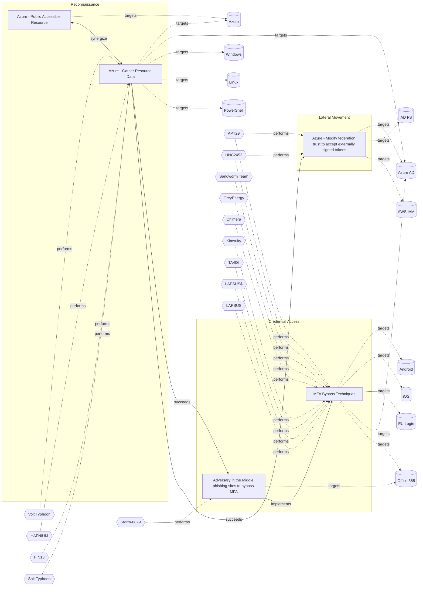

# ☣️ Azure - Public Accessible Resource

🔥 **Criticality:High** ⚠️ : A High priority incident is likely to result in a demonstrable impact to public health or safety, national security, economic security, foreign relations, civil liberties, or public confidence. 

🚦 **TLP:CLEAR** ⚪ : Recipients can spread this to the world, there is no limit on disclosure.

🗡️ **ATT&CK Techniques** [T1580 : Cloud Infrastructure Discovery](https://attack.mitre.org/techniques/T1580 'An adversary may attempt to discover infrastructure and resources that are available within an infrastructure-as-a-service IaaS environment This inclu'), [T1046 : Network Service Discovery](https://attack.mitre.org/techniques/T1046 'Adversaries may attempt to get a listing of services running on remote hosts and local network infrastructure devices, including those that may be vul'), [T1133 : External Remote Services](https://attack.mitre.org/techniques/T1133 'Adversaries may leverage external-facing remote services to initially access andor persist within a network Remote services such as VPNs, Citrix, and ')

---

`🔑 UUID : 9b41d6cf-de4d-44d1-97cc-f3671f4ee5ab` **|** `🏷️ Version : 2` **|** `🗓️ Creation Date : 2025-07-31` **|** `🗓️ Last Modification : 2025-09-04` **|** `Sharing Organisation : {'uuid': '56b0a0f0-b0bc-47d9-bb46-02f80ae2065a', 'name': 'EC DIGIT CSOC'}` **|** `🧱 Schema Identifier : tvm::2.1`

## 👁️ Description

> In Azure, this technique highlights the risk where certain resources—commonly **Network Interfaces** 
> and **Virtual Machines**—have public IP addresses or open ports, making them directly 
> reachable from the internet. Unlike other reconnaissance techniques, this isn’t 
> just about discovering resource metadata but about identifying resources configured 
> (intentionally or not) for public access.
> 
> #### How Attackers Use This Vector
> 
> - **Discovery Phase:** Attackers or researchers employ automated tools and scan 
> internet-facing IP space, hunting for live Azure VMs, network interfaces, and endpoints 
> whose public exposure can be confirmed.
> - **Enumeration Approaches:** 
>   - **Subdomain/Service Pattern Scanning:** Many Azure services use predictable 
>   domain structures (e.g., `*.azurewebsites.net`, `*.blob.core.windows.net`). 
>   Attackers enumerate these to find exposed resources.
>   - **Open Ports Scans:** Tools scan IPs for open RDP, SSH, web, or management ports.
> - **Public APIs and Metadata:** Some Azure resource information is available through 
> public APIs or unauthenticated metadata services, providing further opportunities 
> for adversaries to discover exposed resources.
> - **Real-World Tools:** Well-known tools include MicroBurst, AADInternals, and custom 
> scripts for mass scanning.
>   
> #### Specific Azure Resources at Risk
> 
> - **Network Interfaces:** Networking components that, if tied to public IPs, may 
> expose internal workloads.
> - **Virtual Machines:** Especially those configured with public IPs and ports like 
> RDP (3389) or SSH (22) open.
> - **App Services and Blob Storage:** Though not explicitly listed in AZT103, these 
> are also frequent targets for enumeration due to default public endpoints.
> - **Databases/Clusters:** Services like Azure Data Explorer or managed databases 
> may be misconfigured to allow public ingress.
> 
> #### Security Implications
> 
> - **Increased Attack Surface:** Exposing resources multiplies the number of direct 
> entry points for adversaries.
> - **Brute-Force and Vulnerability Exploitation:** Resources with public connectivity 
> are subject to constant automated attacks and vulnerability scans.
> - **Potential Lateral Movement:** Compromising one public resource can serve as 
> a foothold to move deeper into the Azure environment.
> 

## 🖥️ Terrain 

 > Adversary must have access to internet-facing IP space to scan for live Azure VMs 
> and network interfaces.
> 

---

## 🕸️ Relations

### 🌊 OpenTide Objects
🚫 No related OpenTide objects indexed.

 --- 

### ⛓️ Threat Chaining

Expand chaining data

| ☣️ Vector                                                                                                                                                                                                                                                                                                            | ⛓️ Link                 | 🎯 Target                                                                                                                                                                                                                                                                                                                                           | ⛰️ Terrain                                                                                                                                         | 🗡️ ATT&CK                                                                                                                                                                                                                                                                                                                                                                                                                                                                                                                                                                                                                                                                                                                                                                                                                                                                                                                                                                                                                                                                               |
|:---------------------------------------------------------------------------------------------------------------------------------------------------------------------------------------------------------------------------------------------------------------------------------------------------------------------|:------------------------|:---------------------------------------------------------------------------------------------------------------------------------------------------------------------------------------------------------------------------------------------------------------------------------------------------------------------------------------------------|:---------------------------------------------------------------------------------------------------------------------------------------------------|:----------------------------------------------------------------------------------------------------------------------------------------------------------------------------------------------------------------------------------------------------------------------------------------------------------------------------------------------------------------------------------------------------------------------------------------------------------------------------------------------------------------------------------------------------------------------------------------------------------------------------------------------------------------------------------------------------------------------------------------------------------------------------------------------------------------------------------------------------------------------------------------------------------------------------------------------------------------------------------------------------------------------------------------------------------------------------------------|
| [Azure - Public Accessible Resource](../Threat%20Vectors/☣️%20Azure%20-%20Public%20Accessible%20Resource.md 'In Azure, this technique highlights the risk where certain resourcescommonly Network Interfaces and Virtual Machineshave public IP addresses or open p...')                                             | `support::synergize`    | [Azure - Gather Resource Data](../Threat%20Vectors/☣️%20Azure%20-%20Gather%20Resource%20Data.md 'The Gather Resource Data technique is a key part of the reconnaissance phase in attacks against Azure environments This activity focuses on enumeratin...')                                                                                       | The attacker obtains credentials (via phishing, password spray, leaked keys) granting  at least Reader access to the target Azure tenant.          | [T1526 : Cloud Service Discovery](https://attack.mitre.org/techniques/T1526 'An adversary may attempt to enumerate the cloud services running on a system after gaining access These methods can differ from platform-as-a-service '), [T1087 : Account Discovery](https://attack.mitre.org/techniques/T1087 'Adversaries may attempt to get a listing of valid accounts, usernames, or email addresses on a system or within a compromised environment This informa'), [T1552.001 : Unsecured Credentials: Credentials In Files](https://attack.mitre.org/techniques/T1552/001 'Adversaries may search local file systems and remote file shares for files containing insecurely stored credentials These can be files created by user'), [T1530 : Data from Cloud Storage](https://attack.mitre.org/techniques/T1530 'Adversaries may access data from cloud storageMany IaaS providers offer solutions for online data object storage such as Amazon S3, Azure Storage, and')                                                                                                        |
| [Azure - Gather Resource Data](../Threat%20Vectors/☣️%20Azure%20-%20Gather%20Resource%20Data.md 'The Gather Resource Data technique is a key part of the reconnaissance phase in attacks against Azure environments This activity focuses on enumeratin...')                                                         | `sequence::succeeds`    | [Adversary in the Middle phishing sites to bypass MFA](../Threat%20Vectors/☣️%20Adversary%20in%20the%20Middle%20phishing%20sites%20to%20bypass%20MFA.md 'Threat actors use malicious attachments to send the users to redirection site, which hosts a fake MFA login pageThe MitM page completes the authentica...')                               | An adversary needs to target companies and contacts  to distribute the malware, it's used a massive distrigution  technique on a random principle. | [T1566.002](https://attack.mitre.org/techniques/T1566/002 'Adversaries may send spearphishing emails with a malicious link in an attempt to gain access to victim systems Spearphishing with a link is a specific'), [T1557](https://attack.mitre.org/techniques/T1557 'Adversaries may attempt to position themselves between two or more networked devices using an adversary-in-the-middle AiTM technique to support follow'), [T1539](https://attack.mitre.org/techniques/T1539 'An adversary may steal web application or service session cookies and use them to gain access to web applications or Internet services as an authentic'), [T1556](https://attack.mitre.org/techniques/T1556 'Adversaries may modify authentication mechanisms and processes to access user credentials or enable otherwise unwarranted access to accounts The authe'), [T1078.004](https://attack.mitre.org/techniques/T1078/004 'Valid accounts in cloud environments may allow adversaries to perform actions to achieve Initial Access, Persistence, Privilege Escalation, or Defense')         |
| [Azure - Gather Resource Data](../Threat%20Vectors/☣️%20Azure%20-%20Gather%20Resource%20Data.md 'The Gather Resource Data technique is a key part of the reconnaissance phase in attacks against Azure environments This activity focuses on enumeratin...')                                                         | `sequence::succeeds`    | [Azure - Modify federation trust to accept externally signed tokens](../Threat%20Vectors/☣️%20Azure%20-%20Modify%20federation%20trust%20to%20accept%20externally%20signed%20tokens.md 'Once they acquired sufficient priviledges,attackers add their own certificate as a trusted entity in the domain either by adding a new federation trus...') | Attackers need to have gained administrative Azure Active Directory (Azure AD) privileges using compromised credentials                            | [T1484.002 : Domain or Tenant Policy Modification: Trust Modification](https://attack.mitre.org/techniques/T1484/002 'Adversaries may add new domain trusts, modify the properties of existing domain trusts, or otherwise change the configuration of trust relationships b')                                                                                                                                                                                                                                                                                                                                                                                                                                                                                                                                                                                                                                                                                                                                                                                                          |
| [Adversary in the Middle phishing sites to bypass MFA](../Threat%20Vectors/☣️%20Adversary%20in%20the%20Middle%20phishing%20sites%20to%20bypass%20MFA.md 'Threat actors use malicious attachments to send the users to redirection site, which hosts a fake MFA login pageThe MitM page completes the authentica...') | `atomicity::implements` | [MFA Bypass Techniques](../Threat%20Vectors/☣️%20MFA%20Bypass%20Techniques.md 'MFA is a technique that requires more than one piece of evidence to authorize the user to access a resource If two pieces of evidence are needed to ve...')                                                                                                         | Sufficient reconnaissance to identify a target account and MFA technologies being used.                                                            | [T1111](https://attack.mitre.org/techniques/T1111 'Adversaries may target multi-factor authentication MFA mechanisms, ie, smart cards, token generators, etc to gain access to credentials that can be us'), [T1621](https://attack.mitre.org/techniques/T1621 'Adversaries may attempt to bypass multi-factor authentication MFA mechanisms and gain access to accounts by generating MFA requests sent to usersAdver'), [T1566.001](https://attack.mitre.org/techniques/T1566/001 'Adversaries may send spearphishing emails with a malicious attachment in an attempt to gain access to victim systems Spearphishing attachment is a spe'), [T1566.002](https://attack.mitre.org/techniques/T1566/002 'Adversaries may send spearphishing emails with a malicious link in an attempt to gain access to victim systems Spearphishing with a link is a specific'), [T1566.004](https://attack.mitre.org/techniques/T1566/004 'Adversaries may use voice communications to ultimately gain access to victim systems Spearphishing voice is a specific variant of spearphishing It is ') |

&nbsp; 

---

## Model Data

#### **⛓️ Cyber Kill Chain**

 > Cyber attacks are typically phased progressions towards strategic objectives. The Unified Kill Chains provides insight into the tactics that hackers employ to attain these objectives. This provides a solid basis to develop (or realign) defensive strategies to raise cyber resilience.

 [`🔭 Reconnaissance`](https://www.unifiedkillchain.com/assets/The-Unified-Kill-Chain.pdf) : Researching, identifying and selecting targets using active or passive reconnaissance.

---

#### **🛰️ Domains**

 > Infrastructure technologies domain of interest to attackers.

  - `☁️ Public Cloud` : Infrastructure handled by a commercial cloud provider. Managed mostly on a service level, and connected over the internet.
 - `☁️ Private Cloud` : Infrastructure hosted at a third party, but based on custom specification and managed on a platform level.

---

#### **🎯 Targets**

 > Granular delimited technical entities holding a value to the organization, that are targeted by adversaries. They might be also involved in the detection coverage as the target of log collection. Partially inspired by Veris.

  - [`🛠️ Virtual Machines`](http://veriscommunity.net/enums.html#section-asset) : Placeholder
 - [`🌐 Network Equipment`](http://veriscommunity.net/enums.html#section-asset) : Placeholder
 - [`🖥️ Public-Facing Servers`](http://veriscommunity.net/enums.html#section-asset) : Placeholder
 - [`🪣 Cloud Storage Accounts`](http://veriscommunity.net/enums.html#section-asset) : Placeholder

---

#### **💿 Platforms concerned**

 > Actual technologies used by the organization that will be exploited by adversaries during a successful attack, and eventually of relevance for detection. Are named by commercial designation.

 ` Azure` : Placeholder

---

#### **💣 Severity**

 > The severity summarizes the overall danger of incident the vector will provoke, and is to be derived (WIP) from impact, leverage, and difficulty to execute.

 [`⚠️ Significant incident`](https://www.ncsc.gov.uk/news/new-cyber-attack-categorisation-system-improve-uk-response-incidents) : A cyber attack which has a serious impact on a large organisation or on wider / local government, or which poses a considerable risk to central government or (inter)national essential services.

---

#### **🪄 Leverage acquisition**

 > Technical aftermath of the attack from the target perspective, differentiated from impact as it does not consider the value of the consequence, only what increased control the vector execution provides to the adversary.

  - [`👻 Spoofing`](https://owasp.org/www-community/Threat_Modeling_Process#stride) : Threat action aimed at accessing and use of another user’s credentials, such as username and password.
 - [`🐒 Tampering`](https://owasp.org/www-community/Threat_Modeling_Process#stride) : Threat action intending to maliciously change or modify persistent data, such as records in a database, and the alteration of data in transit between two computers over an open network, such as the Internet.
 - [`👁️‍🗨️ Information Disclosure`](https://owasp.org/www-community/Threat_Modeling_Process#stride) : Threat action intending to read a file that one was not granted access to, or to read data in transit.
 - [`⛔ Denial of Service`](https://owasp.org/www-community/Threat_Modeling_Process#stride) : Threat action attempting to deny access to valid users, such as by making a web server temporarily unavailable or unusable.
 - [`💅 Elevation of privilege`](https://owasp.org/www-community/Threat_Modeling_Process#stride) : Capacity to augment leverage over the target system by upgrading the compromised access rights

---

#### **💥 Impact**

 > Analysis of the threat vector from the organizational perspective, in non technical term. This aims at putting a clear denomination on what the attacker will actually be able to act upon if the threat vector is realized.

  - [`🔓 Data Breach`](http://veriscommunity.net/enums.html#section-impact) : Non-public information has been accessed from the outside, and successfully extracted.
 - [`🧠 IP Loss`](http://veriscommunity.net/enums.html#section-impact) : Particular, key data, information and blueprint conducive to the organization capability to gain and retain a commercial or geopolitical advantage has been accessed, and their content potentially used by competitors or other adversaries.
 - [`🌍 Reputational Damages`](http://veriscommunity.net/enums.html#section-impact) : Damages to the organization public view may be achieved by using directly the access gained, or indirectly with data gathered.
 - [`💸 Monetary Loss`](http://veriscommunity.net/enums.html#section-impact) : The vector will directly conduct to loss of value directly impacting the bottom line.
 - [`🛑 Business disruption`](http://veriscommunity.net/enums.html#section-impact) : Business disruption

---

#### **🎲 Vector Viability**

 > Described with estimative language (likelyhood probability), describes how likely the analyst believes the vector to actually be realized on the organization infrastructure. Estimative language describes quality and credibility of underlying sources, data, and methodologies based Intelligence Community Directive 203 (ICD 203) and JP 2-0, Joint Intelligence.

 [`🧐 Likely`](https://www.dni.gov/files/documents/ICD/ICD%20203%20Analytic%20Standards.pdf) : Probable (probably) - 55-80%

---

### 🔗 References

**🕊️ Publicly available resources**

- [_1_] https://misp-galaxy.org/atrm/
- [_2_] https://www.bdosecurity.de/en-gb/insights/security-column/cloud-hacking-the-azure-cyber-kill-chain-part-1
- [_3_] https://learn.microsoft.com/en-us/azure/data-explorer/security-network-restrict-public-access

[1]: https://misp-galaxy.org/atrm/
[2]: https://www.bdosecurity.de/en-gb/insights/security-column/cloud-hacking-the-azure-cyber-kill-chain-part-1
[3]: https://learn.microsoft.com/en-us/azure/data-explorer/security-network-restrict-public-access

---

#### 🏷️ Tags

#-, #-, #-, #
, #
, ##, ##, ##, ##, # , #🏷, #️, # , #T, #a, #g, #s, #
, #

