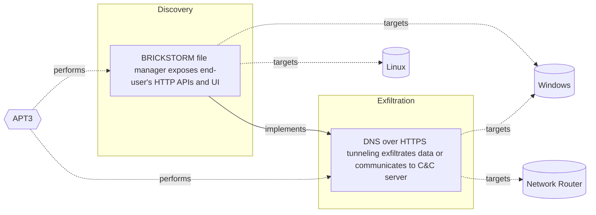

# ☣️ BRICKSTORM file manager exposes end-user's HTTP APIs and UI

🔥 **Criticality:High** ⚠️ : A High priority incident is likely to result in a demonstrable impact to public health or safety, national security, economic security, foreign relations, civil liberties, or public confidence. 

🚦 **TLP:CLEAR** ⚪ : Recipients can spread this to the world, there is no limit on disclosure.

🗡️ **ATT&CK Techniques** [T1190 : Exploit Public-Facing Application](https://attack.mitre.org/techniques/T1190 'Adversaries may attempt to exploit a weakness in an Internet-facing host or system to initially access a network The weakness in the system can be a s'), [T1204 : User Execution](https://attack.mitre.org/techniques/T1204 'An adversary may rely upon specific actions by a user in order to gain execution Users may be subjected to social engineering to get them to execute m'), [T1071.001 : Application Layer Protocol: Web Protocols](https://attack.mitre.org/techniques/T1071/001 'Adversaries may communicate using application layer protocols associated with web traffic to avoid detectionnetwork filtering by blending in with exis'), [T1082 : System Information Discovery](https://attack.mitre.org/techniques/T1082 'An adversary may attempt to get detailed information about the operating system and hardware, including version, patches, hotfixes, service packs, and'), [T1588 : Obtain Capabilities](https://attack.mitre.org/techniques/T1588 'Adversaries may buy andor steal capabilities that can be used during targeting Rather than developing their own capabilities in-house, adversaries may'), [T1552 : Unsecured Credentials](https://attack.mitre.org/techniques/T1552 'Adversaries may search compromised systems to find and obtain insecurely stored credentials These credentials can be stored andor misplaced in many lo')

---

`🔑 UUID : 5e6af460-db12-4278-b44d-7a7a3fa7fe76` **|** `🏷️ Version : 1` **|** `🗓️ Creation Date : 2025-04-23` **|** `🗓️ Last Modification : 2025-05-20` **|** `Sharing Organisation : {'uuid': '56b0a0f0-b0bc-47d9-bb46-02f80ae2065a', 'name': 'EC DIGIT CSOC'}` **|** `🧱 Schema Identifier : tvm::2.1`

## 👁️ Description

> One of the observed China-nexus cluster achieves their goals with
> the involvement and the usage of previously unknown vulnerabilities
> (a.k.a., zero-days) alongside with low-noise backdoors like `BRICKSTORM`
> family.
> 
> The unauthorised access provided by `BRICKSTORM` grants attackers the
> ability to execute file management and network tunneling functions
> crucial for espionage. These capabilities enable them to browse file
> systems, create or delete files and directories, and establish network
> connections to facilitate lateral movement within the compromised
> environment. Unlike many other forms of malware that create noticeable
> disruptions, BRICKSTORM's operations are meticulously crafted to avoid
> detection, maintaining a consistent and clandestine presence within
> the target network ref [3]. 
> 
> Recently identified `BRICKSTORM` executables provide threat actors
> with a file manager named `BRICKSTORM file manager`.   
> 
> The `BRICKSTORM file manager` exposes an HTTP API and rudimentary UI
> (User Interface) encapsulated within the protocol. The backdoor's
> JSON-based API provides a wide range of file-related actions such
> as uploading, downloading, renaming, and deleting files.
> 
> Adversaries can further-more create or delete directories as well
> as list their contents. The BRICKSTORM panel is served by the malware
> itself and proxied through its protocol towards a Command & Control
> server. Further this functionality and specific behavior allows the
> adversary to select a drive they wish to browse. Once the drive is
> selected, BRICKSTORM allows the adversaries to browse through the
> file system and download files by their choice ref [1].  
> 

## 🖥️ Terrain 

 > A threat actor abuses publicly exposed HTTP APIs
> and end-user publicly exposed UIs (User Interfaces).  
> 

---

## 🕸️ Relations

### 🐲 Actors sightings 

| Actor             | Description                                                                                                                                                                                                                                                                                                                                                                                                                                                                                                                                                                                                              | Aliases                                                                                                   | Source                     | Sighting                                                                                                                                                                                                                       | Reference                |
|:------------------|:-------------------------------------------------------------------------------------------------------------------------------------------------------------------------------------------------------------------------------------------------------------------------------------------------------------------------------------------------------------------------------------------------------------------------------------------------------------------------------------------------------------------------------------------------------------------------------------------------------------------------|:----------------------------------------------------------------------------------------------------------|:---------------------------|:-------------------------------------------------------------------------------------------------------------------------------------------------------------------------------------------------------------------------------|:-------------------------|
| [Enterprise] APT3 | [APT3](https://attack.mitre.org/groups/G0022) is a China-based threat group that researchers have attributed to China's Ministry of State Security.(Citation: FireEye Clandestine Wolf)(Citation: Recorded Future APT3 May 2017) This group is responsible for the campaigns known as Operation Clandestine Fox, Operation Clandestine Wolf, and Operation Double Tap.(Citation: FireEye Clandestine Wolf)(Citation: FireEye Operation Double Tap) As of June 2015, the group appears to have shifted from targeting primarily US victims to primarily political organizations in Hong Kong.(Citation: Symantec Buckeye) | Buckeye, Gothic Panda, Pirpi, TG-0110, Threat Group-0110, UPS Team                                        | 🗡️ MITRE ATT&CK Groups     | No documented sighting                                                                                                                                                                                                         | No documented references |
| APT3              | Symantec described UPS in  2016 report as: 'Buckeye (also known as APT3, Gothic Panda, UPS Team, and TG-0110) is a cyberespionage group that is believed to have been operating for well over half a decade. Traditionally, the group attacked organizations in the US as well as other targets. However, Buckeyes focus appears to have changed as of June 2015, when the group began compromising political entities in Hong Kong.'                                                                                                                                                                                    | GOTHIC PANDA, TG-0110, Group 6, UPS, Buckeye, Boyusec, BORON, BRONZE MAYFAIR, Red Sylvan, Brocade Typhoon | 🌌 MISP Threat Actor Galaxy | UNC5221, also known as Gothic Panda or BlackBhamasura isa known Chenese affiliated threat actor linked to a stringof cyberattacks targeting various sectors, includingtelecommunications, healthcare, and government agencies. | No documented references |

### 🌊 OpenTide Objects
🚫 No related OpenTide objects indexed.

 --- 

### ⛓️ Threat Chaining

Expand chaining data

| ☣️ Vector                                                                                                                                                                                                                                                                                                                          | ⛓️ Link                 | 🎯 Target                                                                                                                                                                                                                                                                                                                                                       | ⛰️ Terrain                                                                                | 🗡️ ATT&CK                                                                                                                                                                                                                                                                                                                                                                                                                                                                                                                                                                                                                                                                                                                                                                                                                                                                                                                                                                                                                                                       |
|:-----------------------------------------------------------------------------------------------------------------------------------------------------------------------------------------------------------------------------------------------------------------------------------------------------------------------------------|:------------------------|:---------------------------------------------------------------------------------------------------------------------------------------------------------------------------------------------------------------------------------------------------------------------------------------------------------------------------------------------------------------|:------------------------------------------------------------------------------------------|:----------------------------------------------------------------------------------------------------------------------------------------------------------------------------------------------------------------------------------------------------------------------------------------------------------------------------------------------------------------------------------------------------------------------------------------------------------------------------------------------------------------------------------------------------------------------------------------------------------------------------------------------------------------------------------------------------------------------------------------------------------------------------------------------------------------------------------------------------------------------------------------------------------------------------------------------------------------------------------------------------------------------------------------------------------------|
| [BRICKSTORM file manager exposes end-user's HTTP APIs and UI](../Threat%20Vectors/☣️%20BRICKSTORM%20file%20manager%20exposes%20end-user's%20HTTP%20APIs%20and%20UI.md 'One of the observed China-nexus cluster achieves their goals withthe involvement and the usage of previously unknown vulnerabilitiesaka, zero-days alo...') | `atomicity::implements` | [DNS over HTTPS tunneling exfiltrates data or communicates to C&C server](../Threat%20Vectors/☣️%20DNS%20over%20HTTPS%20tunneling%20exfiltrates%20data%20or%20communicates%20to%20C&C%20server.md 'DNS over HTTPS DoH tunneling is a technique used by threat actorsto exfiltrate data or communicate to a Command and Control C&Cserver The data exchang...') | A threat actor can use DNS over HTTPS tunneling technique to hide traffic and activities. | [T1572](https://attack.mitre.org/techniques/T1572 'Adversaries may tunnel network communications to and from a victim system within a separate protocol to avoid detectionnetwork filtering andor enable '), [T1036](https://attack.mitre.org/techniques/T1036 'Adversaries may attempt to manipulate features of their artifacts to make them appear legitimate or benign to users andor security tools Masquerading '), [T1041](https://attack.mitre.org/techniques/T1041 'Adversaries may steal data by exfiltrating it over an existing command and control channel Stolen data is encoded into the normal communications chann'), [T1190](https://attack.mitre.org/techniques/T1190 'Adversaries may attempt to exploit a weakness in an Internet-facing host or system to initially access a network The weakness in the system can be a s'), [T1566](https://attack.mitre.org/techniques/T1566 'Adversaries may send phishing messages to gain access to victim systems All forms of phishing are electronically delivered social engineering Phishing') |

&nbsp; 

---

## Model Data

#### **⛓️ Cyber Kill Chain**

 > Cyber attacks are typically phased progressions towards strategic objectives. The Unified Kill Chains provides insight into the tactics that hackers employ to attain these objectives. This provides a solid basis to develop (or realign) defensive strategies to raise cyber resilience.

 [`🧭 Discovery`](https://www.unifiedkillchain.com/assets/The-Unified-Kill-Chain.pdf) : Techniques that allow an attacker to gain knowledge about a system and its network environment.

---

#### **🛰️ Domains**

 > Infrastructure technologies domain of interest to attackers.

 `🏢 Enterprise` : Generic databases, applications, machines and systems that are usually on premises or on Cloud traditional VMs.

---

#### **🎯 Targets**

 > Granular delimited technical entities holding a value to the organization, that are targeted by adversaries. They might be also involved in the detection coverage as the target of log collection. Partially inspired by Veris.

  - [`🧩 API Endpoints`](http://veriscommunity.net/enums.html#section-asset) : Placeholder
 - [`👤 End-user`](http://veriscommunity.net/enums.html#section-asset) : People - End-user
 - [`💻 Laptop`](http://veriscommunity.net/enums.html#section-asset) : User Device - Laptop
 - [`🖥️ Workstations`](http://veriscommunity.net/enums.html#section-asset) : Placeholder
 - [`🖥️ Public-Facing Servers`](http://veriscommunity.net/enums.html#section-asset) : Placeholder
 - [`🖥️ Web Application Servers`](http://veriscommunity.net/enums.html#section-asset) : Placeholder

---

#### **💿 Platforms concerned**

 > Actual technologies used by the organization that will be exploited by adversaries during a successful attack, and eventually of relevance for detection. Are named by commercial designation.

  - ` Windows` : Placeholder
 - ` Linux` : Placeholder

---

#### **💣 Severity**

 > The severity summarizes the overall danger of incident the vector will provoke, and is to be derived (WIP) from impact, leverage, and difficulty to execute.

 [`🔫 Localised incident`](https://www.ncsc.gov.uk/news/new-cyber-attack-categorisation-system-improve-uk-response-incidents) : A cyber attack on an individual, or preliminary indications of cyber activity against a small or medium-sized organisation.

---

#### **🪄 Leverage acquisition**

 > Technical aftermath of the attack from the target perspective, differentiated from impact as it does not consider the value of the consequence, only what increased control the vector execution provides to the adversary.

  - [`💀 Infrastructure Compromise`](https://owasp.org/www-community/Threat_Modeling_Process#stride) : The compromised target is likely to be used to further expand the sphere of influence of the attacker and allow more potent vectors to be executed.
 - [`🐒 Tampering`](https://owasp.org/www-community/Threat_Modeling_Process#stride) : Threat action intending to maliciously change or modify persistent data, such as records in a database, and the alteration of data in transit between two computers over an open network, such as the Internet.
 - [`✨ Modify data`](https://owasp.org/www-community/Threat_Modeling_Process#stride) : Modify stored data or content

---

#### **💥 Impact**

 > Analysis of the threat vector from the organizational perspective, in non technical term. This aims at putting a clear denomination on what the attacker will actually be able to act upon if the threat vector is realized.

  - [`🩼 Impairement`](http://veriscommunity.net/enums.html#section-impact) : Incapacitation of a particular key system that will cause disruptions in day-to-day operations, and eventually service delivery.
 - [`🤬 Lose Capabilities`](http://veriscommunity.net/enums.html#section-impact) : Vector execution will remove key functions to the organization, which will not be easily circumvented. Most day-to-day is heavily impaired, but processes can reorganize at a loss.
 - [`💲 Operating costs`](http://veriscommunity.net/enums.html#section-impact) : Increased operating costs

---

#### **🎲 Vector Viability**

 > Described with estimative language (likelyhood probability), describes how likely the analyst believes the vector to actually be realized on the organization infrastructure. Estimative language describes quality and credibility of underlying sources, data, and methodologies based Intelligence Community Directive 203 (ICD 203) and JP 2-0, Joint Intelligence.

 [`🧐 Likely`](https://www.dni.gov/files/documents/ICD/ICD%20203%20Analytic%20Standards.pdf) : Probable (probably) - 55-80%

---

### 🔗 References

**🕊️ Publicly available resources**

- [_1_] https://blog.nviso.eu/wp-content/uploads/2025/04/NVISO-BRICKSTORM-Report.pdf
- [_2_] https://www.techzine.eu/news/security/130580/belgian-security-experts-find-chinese-espionage-malware-on-windows
- [_3_] https://b2bdaily.com/it/can-brickstorm-malware-undermine-europes-strategic-industries
- [_4_] https://apt.etda.or.th/cgi-bin/listgroups.cgi?t=BRICKSTORM

[1]: https://blog.nviso.eu/wp-content/uploads/2025/04/NVISO-BRICKSTORM-Report.pdf
[2]: https://www.techzine.eu/news/security/130580/belgian-security-experts-find-chinese-espionage-malware-on-windows
[3]: https://b2bdaily.com/it/can-brickstorm-malware-undermine-europes-strategic-industries
[4]: https://apt.etda.or.th/cgi-bin/listgroups.cgi?t=BRICKSTORM

---

#### 🏷️ Tags

#-, #-, #-, #
, #
, ##, ##, ##, ##, # , #🏷, #️, # , #T, #a, #g, #s, #
, #

