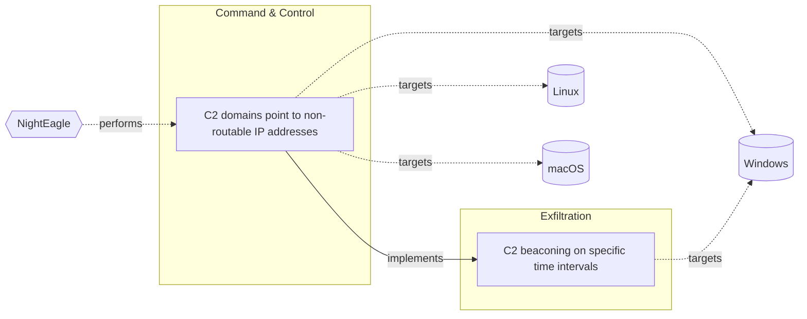

# ☣️ C2 beaconing on specific time intervals

🔥 **Criticality:Medium** ❗ : A Medium priority incident may affect public health or safety, national security, economic security, foreign relations, civil liberties, or public confidence. 

🚦 **TLP:CLEAR** ⚪ : Recipients can spread this to the world, there is no limit on disclosure.

🗡️ **ATT&CK Techniques** [T1205 : Traffic Signaling](https://attack.mitre.org/techniques/T1205 'Adversaries may use traffic signaling to hide open ports or other malicious functionality used for persistence or command and control Traffic signalin'), [T1029 : Scheduled Transfer](https://attack.mitre.org/techniques/T1029 'Adversaries may schedule data exfiltration to be performed only at certain times of day or at certain intervals This could be done to blend traffic pa')

---

`🔑 UUID : 7b122bb4-fc13-438b-a052-4388c501ec59` **|** `🏷️ Version : 1` **|** `🗓️ Creation Date : 2025-08-22` **|** `🗓️ Last Modification : 2025-08-26` **|** `Sharing Organisation : {'uuid': '56b0a0f0-b0bc-47d9-bb46-02f80ae2065a', 'name': 'EC DIGIT CSOC'}` **|** `🧱 Schema Identifier : tvm::2.1`

## 👁️ Description

> C2 beaconing refers to the periodic communication between a compromised
> system and a Command and Control (C2) server. The packets are sent from the
> infected host to the C2 server at regular intervals, known as the `beacon
> interval`, which can be down to the second to avoid suspicion. For example,
> a Cobalt Strike beacon might have an average sleep of several seconds with
> jitter added to disrupt the pattern. The compromised system, often is
> referred as a "beacon" sends periodic signals or "beacons" to the C2 for
> one of the following reasons ref [1].
> 
> - Check for new commands or updates
> - Report back on its status or activities
> - Receive instructions or configuration changes
> - C2 beaconing on specific time intervals
> 
> To avoid detection, attackers often configure the compromised system to
> beacon on specific time intervals.
> 
> ### Possible C2 beaconing set-up
> 
> A threat actor can set C2 server to respond in one of the following ways.
> 
> - Fixed intervals: The beacon sends signals at fixed intervals, e.g., every
>   5 minutes, 1 hour, or 24 hours.
> - Randomised intervals: The beacon sends signals at randomised intervals,
>   e.g., between 5-15 minutes, to make it harder to detect.
> - Scheduled intervals: The beacon sends signals at specific times, e.g.,
>   during business hours or when the system is most active.
> 
> ### Threat actor's purposes
> 
> Attackers can set a specific timing or rules in their Command and Control
> servers depends on different reasons and goals.
> 
> - Evade detection: By beaconing at regular intervals, the attacker can avoid
>   detection by security systems that rely on anomaly detection or behavioral
>   analysis.
> - Maintain stealth: By using fixed or randomized intervals, the attacker can
>   make it harder for security teams to detect the beaconing activity.
> - Conserve resources: By only communicating at specific intervals, the
>   attacker can conserve resources, such as bandwidth and system resources,
>   on the compromised system.  
> 

## 🖥️ Terrain 

 > A threat actor uses a compromised endpoint to set and monitor specific time
> intervals known as beacons.  
> 

---

## 🕸️ Relations

### 🌊 OpenTide Objects
🚫 No related OpenTide objects indexed.

 --- 

### ⛓️ Threat Chaining

Expand chaining data

| ☣️ Vector                                                                                                                                                                                                                                                                                          | ⛓️ Link                 | 🎯 Target                                                                                                                                                                                                                                                                             | ⛰️ Terrain                                                                                              | 🗡️ ATT&CK                                                                                                                                                                                                                                                                                                                                                                                                                                                         |
|:---------------------------------------------------------------------------------------------------------------------------------------------------------------------------------------------------------------------------------------------------------------------------------------------------|:------------------------|:-------------------------------------------------------------------------------------------------------------------------------------------------------------------------------------------------------------------------------------------------------------------------------------|:--------------------------------------------------------------------------------------------------------|:------------------------------------------------------------------------------------------------------------------------------------------------------------------------------------------------------------------------------------------------------------------------------------------------------------------------------------------------------------------------------------------------------------------------------------------------------------------|
| [C2 domains point to non-routable IP addresses](../Threat%20Vectors/☣️%20C2%20domains%20point%20to%20non-routable%20IP%20addresses.md 'The attackers may configure their own C2 domain to point to a non-internetroutable address, localhost 127001 or RFC1918 private IP addresses 1 By doin...') | `atomicity::implements` | [C2 beaconing on specific time intervals](../Threat%20Vectors/☣️%20C2%20beaconing%20on%20specific%20time%20intervals.md 'C2 beaconing refers to the periodic communication between a compromisedsystem and a Command and Control C2 server The packets are sent from theinfecte...') | A threat actor uses a compromised endpoint to set and monitor specific time intervals known as beacons. | [T1205 : Traffic Signaling](https://attack.mitre.org/techniques/T1205 'Adversaries may use traffic signaling to hide open ports or other malicious functionality used for persistence or command and control Traffic signalin'), [T1029 : Scheduled Transfer](https://attack.mitre.org/techniques/T1029 'Adversaries may schedule data exfiltration to be performed only at certain times of day or at certain intervals This could be done to blend traffic pa') |

&nbsp; 

---

## Model Data

#### **⛓️ Cyber Kill Chain**

 > Cyber attacks are typically phased progressions towards strategic objectives. The Unified Kill Chains provides insight into the tactics that hackers employ to attain these objectives. This provides a solid basis to develop (or realign) defensive strategies to raise cyber resilience.

 [`📨 Exfiltration`](https://www.unifiedkillchain.com/assets/The-Unified-Kill-Chain.pdf) : Techniques that result or aid in an attacker removing data from a target network.

---

#### **🛰️ Domains**

 > Infrastructure technologies domain of interest to attackers.

 `🏢 Enterprise` : Generic databases, applications, machines and systems that are usually on premises or on Cloud traditional VMs.

---

#### **🎯 Targets**

 > Granular delimited technical entities holding a value to the organization, that are targeted by adversaries. They might be also involved in the detection coverage as the target of log collection. Partially inspired by Veris.

  - [`👤 Customer`](http://veriscommunity.net/enums.html#section-asset) : People - Customer
 - [`🖥️ Workstations`](http://veriscommunity.net/enums.html#section-asset) : Placeholder
 - [`👤 End-user`](http://veriscommunity.net/enums.html#section-asset) : People - End-user

---

#### **💿 Platforms concerned**

 > Actual technologies used by the organization that will be exploited by adversaries during a successful attack, and eventually of relevance for detection. Are named by commercial designation.

 ` Windows` : Placeholder

---

#### **💣 Severity**

 > The severity summarizes the overall danger of incident the vector will provoke, and is to be derived (WIP) from impact, leverage, and difficulty to execute.

 [`🧨 Moderate incident`](https://www.ncsc.gov.uk/news/new-cyber-attack-categorisation-system-improve-uk-response-incidents) : A cyber attack on a small organisation, or which poses a considerable risk to a medium-sized organisation, or preliminary indications of cyber activity against a large organisation or the government.

---

#### **🪄 Leverage acquisition**

 > Technical aftermath of the attack from the target perspective, differentiated from impact as it does not consider the value of the consequence, only what increased control the vector execution provides to the adversary.

  - [`🦠 Dwelling`](https://owasp.org/www-community/Threat_Modeling_Process#stride) : Active or passive extended presence in the target, which performs adversarial operations continuously.
 - [`👁️‍🗨️ Information Disclosure`](https://owasp.org/www-community/Threat_Modeling_Process#stride) : Threat action intending to read a file that one was not granted access to, or to read data in transit.

---

#### **💥 Impact**

 > Analysis of the threat vector from the organizational perspective, in non technical term. This aims at putting a clear denomination on what the attacker will actually be able to act upon if the threat vector is realized.

 [`🔓 Data Breach`](http://veriscommunity.net/enums.html#section-impact) : Non-public information has been accessed from the outside, and successfully extracted.

---

#### **🎲 Vector Viability**

 > Described with estimative language (likelyhood probability), describes how likely the analyst believes the vector to actually be realized on the organization infrastructure. Estimative language describes quality and credibility of underlying sources, data, and methodologies based Intelligence Community Directive 203 (ICD 203) and JP 2-0, Joint Intelligence.

 [`🧐 Likely`](https://www.dni.gov/files/documents/ICD/ICD%20203%20Analytic%20Standards.pdf) : Probable (probably) - 55-80%

---

### 🔗 References

**🕊️ Publicly available resources**

- [_1_] https://hunt.io/glossary/c2-beaconing
- [_2_] https://systemweakness.com/detecting-malware-c2-traffic-a-step-by-step-guide-using-splunk-python-19a1b9500772
- [_3_] https://thecyberthrone.in/2025/07/05/nighteagle-apt-targeted-zero-day-exploitation-campaign
- [_4_] https://securityonline.info/nighteagle-apt-group-soars-over-chinas-critical-tech-zero-days-exchange-exploits-and-tailored-espionage
- [_5_] https://www.geeksforgeeks.org/ethical-hacking/beaconing-in-cyber-security

[1]: https://hunt.io/glossary/c2-beaconing
[2]: https://systemweakness.com/detecting-malware-c2-traffic-a-step-by-step-guide-using-splunk-python-19a1b9500772
[3]: https://thecyberthrone.in/2025/07/05/nighteagle-apt-targeted-zero-day-exploitation-campaign
[4]: https://securityonline.info/nighteagle-apt-group-soars-over-chinas-critical-tech-zero-days-exchange-exploits-and-tailored-espionage
[5]: https://www.geeksforgeeks.org/ethical-hacking/beaconing-in-cyber-security

---

#### 🏷️ Tags

#-, #-, #-, #
, #
, ##, ##, ##, ##, # , #🏷, #️, # , #T, #a, #g, #s, #
, #

