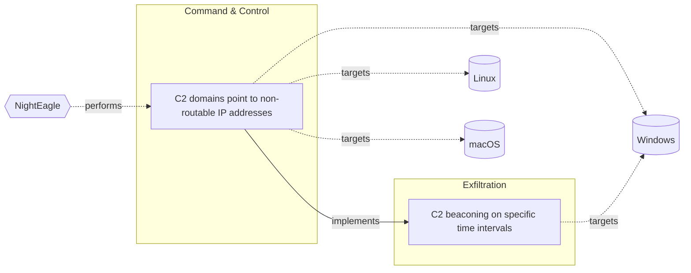

# ☣️ C2 domains point to non-routable IP addresses

🔥 **Criticality:High** ⚠️ : A High priority incident is likely to result in a demonstrable impact to public health or safety, national security, economic security, foreign relations, civil liberties, or public confidence. 

🚦 **TLP:CLEAR** ⚪ : Recipients can spread this to the world, there is no limit on disclosure.

🗡️ **ATT&CK Techniques** [T1568 : Dynamic Resolution](https://attack.mitre.org/techniques/T1568 'Adversaries may dynamically establish connections to command and control infrastructure to evade common detections and remediations This may be achiev')

---

`🔑 UUID : ddab407e-d09d-4804-a4af-c11213553146` **|** `🏷️ Version : 1` **|** `🗓️ Creation Date : 2025-08-27` **|** `🗓️ Last Modification : 2025-08-28` **|** `Sharing Organisation : {'uuid': '56b0a0f0-b0bc-47d9-bb46-02f80ae2065a', 'name': 'EC DIGIT CSOC'}` **|** `🧱 Schema Identifier : tvm::2.1`

## 👁️ Description

> The attackers may configure their own C2 domain to point to a non-internet
> routable address, localhost (127.0.0.1) or RFC1918 (private) IP addresses [1]. 
> By doing so, the underlying IP C2 infrastructure remains hidden, allowing
> the threat actor to remain undetected for longer period of time until they
> decide to engage infected hosts by changing the DNS A record to point the
> actual C2 server.
> 
> One of the top threat actor groups is observed to use multiple malicious
> domains which are resolving to non-routable addresses (like `127.0.0.1`).
> During inactive periods of time, the goal of this technique is to mask the
> location of the Command and Control server. Analysis indicates attacks
> predominantly occur during night hours in China, originating likely from
> North America, and are precisely timed to avoid detection ref [2], [3].     
> 
> Evasion of detection - when a threat actor uses this technique, they could 
> evade detection by traditional network security monitoring tools and rules, 
> which typically focus on outgoing (victim network -> internet) traffic.
> 
> Avoiding C2 Indicator of Compromise (IoC) detections - when the threat actor 
> has a suspicion of being detected or the C2 IP has been exposed, they may 
> change the C2 domain DNS record to a non-routable one while setting up new 
> infrastructure.
> 

## 🖥️ Terrain 

 > The threat actor needs to have control over the DNS infrastructure that
> resolves the C2 domain.  
> 

---

## 🕸️ Relations

### 🐲 Actors sightings 

| Actor      | Description                                                                                                                                                                                                                                                                                                                                                                                                                                                                                          | Aliases   | Source                     | Sighting                                                                                                                                                                                                                                                                                                                                                                                                                                  | Reference                                                          |
|:-----------|:-----------------------------------------------------------------------------------------------------------------------------------------------------------------------------------------------------------------------------------------------------------------------------------------------------------------------------------------------------------------------------------------------------------------------------------------------------------------------------------------------------|:----------|:---------------------------|:------------------------------------------------------------------------------------------------------------------------------------------------------------------------------------------------------------------------------------------------------------------------------------------------------------------------------------------------------------------------------------------------------------------------------------------|:-------------------------------------------------------------------|
| NightEagle | NightEagle is an advanced Threat Actor that targeted China's High-Tech Industry and Military Organisation, leveraging sophisticated techniques, 0 days, and specialized detection avoiding malware. The threat actor seems to have access to significant funding, with dedicated infrastructure, and focuses on low-noise, low-impact intelligence gathering operations. NightEagle is identified as a North-American, state-sponsored or affiliated group that has been active since at least 2023. | APT-Q-95  | 🌌 MISP Threat Actor Galaxy | Advanced Persistent Threat (APT) group known as NightEagle (APT-Q-95)is suspected of utilising an unknown vulnerability in MicrosoftExchange. Their activities originates and come from North America andare related to multiple registered domains and IP addresses which arechanging rapidly to avoid detection. Some of these domains areconfigured to point to private IP addresses. The goal is to make themdifficult to trace back. | https://cyberpress.org/nighteagle-apt-breaches-industrial-networks |

### 🌊 OpenTide Objects
🚫 No related OpenTide objects indexed.

 --- 

### ⛓️ Threat Chaining

Expand chaining data

| ☣️ Vector                                                                                                                                                                                                                                                                                          | ⛓️ Link                 | 🎯 Target                                                                                                                                                                                                                                                                             | ⛰️ Terrain                                                                                              | 🗡️ ATT&CK                                                                                                                                                                                                                                                                                                                                                                                                                                                         |
|:---------------------------------------------------------------------------------------------------------------------------------------------------------------------------------------------------------------------------------------------------------------------------------------------------|:------------------------|:-------------------------------------------------------------------------------------------------------------------------------------------------------------------------------------------------------------------------------------------------------------------------------------|:--------------------------------------------------------------------------------------------------------|:------------------------------------------------------------------------------------------------------------------------------------------------------------------------------------------------------------------------------------------------------------------------------------------------------------------------------------------------------------------------------------------------------------------------------------------------------------------|
| [C2 domains point to non-routable IP addresses](../Threat%20Vectors/☣️%20C2%20domains%20point%20to%20non-routable%20IP%20addresses.md 'The attackers may configure their own C2 domain to point to a non-internetroutable address, localhost 127001 or RFC1918 private IP addresses 1 By doin...') | `atomicity::implements` | [C2 beaconing on specific time intervals](../Threat%20Vectors/☣️%20C2%20beaconing%20on%20specific%20time%20intervals.md 'C2 beaconing refers to the periodic communication between a compromisedsystem and a Command and Control C2 server The packets are sent from theinfecte...') | A threat actor uses a compromised endpoint to set and monitor specific time intervals known as beacons. | [T1205 : Traffic Signaling](https://attack.mitre.org/techniques/T1205 'Adversaries may use traffic signaling to hide open ports or other malicious functionality used for persistence or command and control Traffic signalin'), [T1029 : Scheduled Transfer](https://attack.mitre.org/techniques/T1029 'Adversaries may schedule data exfiltration to be performed only at certain times of day or at certain intervals This could be done to blend traffic pa') |

&nbsp; 

---

## Model Data

#### **⛓️ Cyber Kill Chain**

 > Cyber attacks are typically phased progressions towards strategic objectives. The Unified Kill Chains provides insight into the tactics that hackers employ to attain these objectives. This provides a solid basis to develop (or realign) defensive strategies to raise cyber resilience.

 [`🕹️ Command & Control`](https://www.unifiedkillchain.com/assets/The-Unified-Kill-Chain.pdf) : Techniques that allow attackers to communicate with controlled systems within a target network.

---

#### **🛰️ Domains**

 > Infrastructure technologies domain of interest to attackers.

 `🏢 Enterprise` : Generic databases, applications, machines and systems that are usually on premises or on Cloud traditional VMs.

---

#### **🎯 Targets**

 > Granular delimited technical entities holding a value to the organization, that are targeted by adversaries. They might be also involved in the detection coverage as the target of log collection. Partially inspired by Veris.

 [`📄 Server Logs`](http://veriscommunity.net/enums.html#section-asset) : Server - Log or event management

---

#### **💿 Platforms concerned**

 > Actual technologies used by the organization that will be exploited by adversaries during a successful attack, and eventually of relevance for detection. Are named by commercial designation.

  - ` Windows` : Placeholder
 - ` Linux` : Placeholder
 - ` macOS` : Placeholder

---

#### **💣 Severity**

 > The severity summarizes the overall danger of incident the vector will provoke, and is to be derived (WIP) from impact, leverage, and difficulty to execute.

 [`⚠️ Significant incident`](https://www.ncsc.gov.uk/news/new-cyber-attack-categorisation-system-improve-uk-response-incidents) : A cyber attack which has a serious impact on a large organisation or on wider / local government, or which poses a considerable risk to central government or (inter)national essential services.

---

#### **🪄 Leverage acquisition**

 > Technical aftermath of the attack from the target perspective, differentiated from impact as it does not consider the value of the consequence, only what increased control the vector execution provides to the adversary.

 [`👻 Spoofing`](https://owasp.org/www-community/Threat_Modeling_Process#stride) : Threat action aimed at accessing and use of another user’s credentials, such as username and password.

---

#### **💥 Impact**

 > Analysis of the threat vector from the organizational perspective, in non technical term. This aims at putting a clear denomination on what the attacker will actually be able to act upon if the threat vector is realized.

  - [`🛑 Business disruption`](http://veriscommunity.net/enums.html#section-impact) : Business disruption
 - [`🩼 Impairement`](http://veriscommunity.net/enums.html#section-impact) : Incapacitation of a particular key system that will cause disruptions in day-to-day operations, and eventually service delivery.
 - [`🤬 Lose Capabilities`](http://veriscommunity.net/enums.html#section-impact) : Vector execution will remove key functions to the organization, which will not be easily circumvented. Most day-to-day is heavily impaired, but processes can reorganize at a loss.

---

#### **🎲 Vector Viability**

 > Described with estimative language (likelyhood probability), describes how likely the analyst believes the vector to actually be realized on the organization infrastructure. Estimative language describes quality and credibility of underlying sources, data, and methodologies based Intelligence Community Directive 203 (ICD 203) and JP 2-0, Joint Intelligence.

 [`🧐 Likely`](https://www.dni.gov/files/documents/ICD/ICD%20203%20Analytic%20Standards.pdf) : Probable (probably) - 55-80%

---

### 🔗 References

**🕊️ Publicly available resources**

- [_1_] https://www.ctfiot.com/259781.html
- [_2_] https://cyberpress.org/nighteagle-apt-breaches-industrial-networks
- [_3_] https://otx.alienvault.com/pulse/68684083b180ae933649d3ee
- [_4_] https://www.geeksforgeeks.org/computer-networks/non-routable-address-space
- [_5_] https://www.the-next-tech.com/security/non-routable-ip-addresses
- [_6_] https://www.corgi-corp.com/post/malicious-c2-domains-how-to-stomp-a-moving-target
- [_7_] https://github.com/RedDrip7/NightEagle_Disclose/blob/main/Exclusive%20disclosure%20of%20the%20attack%20activities%20of%20the%20APT%20group%20NightEagle.pdf

[1]: https://www.ctfiot.com/259781.html
[2]: https://cyberpress.org/nighteagle-apt-breaches-industrial-networks
[3]: https://otx.alienvault.com/pulse/68684083b180ae933649d3ee
[4]: https://www.geeksforgeeks.org/computer-networks/non-routable-address-space
[5]: https://www.the-next-tech.com/security/non-routable-ip-addresses
[6]: https://www.corgi-corp.com/post/malicious-c2-domains-how-to-stomp-a-moving-target
[7]: https://github.com/RedDrip7/NightEagle_Disclose/blob/main/Exclusive%20disclosure%20of%20the%20attack%20activities%20of%20the%20APT%20group%20NightEagle.pdf

---

#### 🏷️ Tags

#-, #-, #-, #
, #
, ##, ##, ##, ##, # , #🏷, #️, # , #T, #a, #g, #s, #
, #

