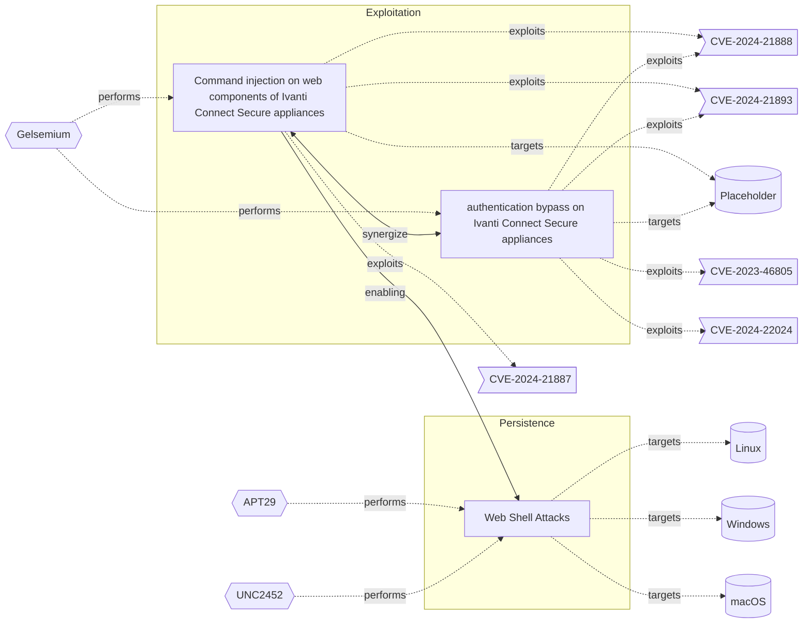

# ☣️ Command injection on web components of Ivanti Connect Secure appliances

🔥 **Criticality:Severe** 🚨 : A Severe priority incident is likely to result in a significant impact to public health or safety, national security, economic security, foreign relations, or civil liberties. 

🚦 **TLP:CLEAR** ⚪ : Recipients can spread this to the world, there is no limit on disclosure.

🗡️ **ATT&CK Techniques** [T1190 : Exploit Public-Facing Application](https://attack.mitre.org/techniques/T1190 'Adversaries may attempt to exploit a weakness in an Internet-facing host or system to initially access a network The weakness in the system can be a s')

---

`🔑 UUID : 4b1c47ee-f45a-4b89-98e7-e943bcd5dd19` **|** `🏷️ Version : 3` **|** `🗓️ Creation Date : 2024-01-15` **|** `🗓️ Last Modification : 2024-04-18` **|** `Sharing Organisation : {'uuid': '56b0a0f0-b0bc-47d9-bb46-02f80ae2065a', 'name': 'EC DIGIT CSOC'}` **|** `🧱 Schema Identifier : tvm::2.0`

## 👁️ Description

> Attackers may manage to inject commands to an Ivanti Connect Secure 
> appliance (that provide remote VPN access to corporate 
> infrastructures) either with valid credentials for vulnerable 
> authenticated endpoints or exploiting a vulnerability to bypass 
> authentication.  
> 
> These vulnerabilities are identified as CVE-2024-21888 and 
> CVE-2024-21893. CVE-2024-21893 have been exploited in the wild chained 
> with CVE-2024-21887 and can lead to remote adversaries to execute 
> arbitrary commands on targeted gateways.
> 
> In addition to the list of LOLbins see [3], following commands were 
> used in the ICS attack is the following:
> - aria2c
> - at
> - cat 
> - check_ssl_cert
> - crash
> - crontab
> - echo
> - mount
> - nohup
> - pidstat
> - sed
> - split
> - sysctl
> - tcpdump
> - wireshark
> - tshark
> 

## 🖥️ Terrain 

 > Attacker need remote access to an Ivanti Connect Secure appliance vulnerable to command injection
> 

 &nbsp;
### ❤️‍🩹 Common Vulnerability Enumeration

⚠️ ERROR : Could not successfully retrieve CVE Details, double check the broken links below to confirm the CVE ID exists.

- [💔 CVE-2024-21887](https://nvd.nist.gov/vuln/detail/CVE-2024-21887)
- [💔 CVE-2024-21888](https://nvd.nist.gov/vuln/detail/CVE-2024-21888)
- [💔 CVE-2024-21893](https://nvd.nist.gov/vuln/detail/CVE-2024-21893)

&nbsp;

---

## 🕸️ Relations

### 🐲 Actors sightings 

| Actor     | Description                                                                                                                                                                                                                                                                                                                                                                                                                                                                                                                                      | Aliases   | Source                     | Sighting               | Reference                |
|:----------|:-------------------------------------------------------------------------------------------------------------------------------------------------------------------------------------------------------------------------------------------------------------------------------------------------------------------------------------------------------------------------------------------------------------------------------------------------------------------------------------------------------------------------------------------------|:----------|:---------------------------|:-----------------------|:-------------------------|
| Gelsemium | The Gelsemium group has been active since at least 2014 and was described in the past by a few security companies. Gelsemium’s name comes from one possible translation ESET found while reading a report from VenusTech who dubbed the group 狼毒草 for the first time. It’s the name of a genus of flowering plants belonging to the family Gelsemiaceae, Gelsemium elegans is the species that contains toxic compounds like Gelsemine, Gelsenicine and Gelsevirine, which ESET choses as names for the three components of this malware family. | 狼毒草       | 🌌 MISP Threat Actor Galaxy | No documented sighting | No documented references |

### 🌊 OpenTide Objects
🚫 No related OpenTide objects indexed.

 --- 

### ⛓️ Threat Chaining

Expand chaining data

| ☣️ Vector                                                                                                                                                                                                                                                                                                                                                    | ⛓️ Link              | 🎯 Target                                                                                                                                                                                                                                                                                                                   | ⛰️ Terrain                                                                                                        | 🗡️ ATT&CK                                                                                                                                                                                                                                                                                                                                                                                                                                                                                                                                                                                                                                                                                                                                                                                                                                                                                                                                                                          |
|:-------------------------------------------------------------------------------------------------------------------------------------------------------------------------------------------------------------------------------------------------------------------------------------------------------------------------------------------------------------|:---------------------|:---------------------------------------------------------------------------------------------------------------------------------------------------------------------------------------------------------------------------------------------------------------------------------------------------------------------------|:------------------------------------------------------------------------------------------------------------------|:-----------------------------------------------------------------------------------------------------------------------------------------------------------------------------------------------------------------------------------------------------------------------------------------------------------------------------------------------------------------------------------------------------------------------------------------------------------------------------------------------------------------------------------------------------------------------------------------------------------------------------------------------------------------------------------------------------------------------------------------------------------------------------------------------------------------------------------------------------------------------------------------------------------------------------------------------------------------------------------|
| [Command injection on web components of Ivanti Connect Secure appliances](../Threat%20Vectors/☣️%20Command%20injection%20on%20web%20components%20of%20Ivanti%20Connect%20Secure%20appliances.md 'Attackers may manage to inject commands to an Ivanti Connect Secure appliance that provide remote VPN access to corporate infrastructures either with ...') | `support::synergize` | [authentication bypass on Ivanti Connect Secure appliances](../Threat%20Vectors/☣️%20authentication%20bypass%20on%20Ivanti%20Connect%20Secure%20appliances.md '### chained exploitation of CVE-2023-46805 or CVE-2024-21893 together with CVE-2024-21887Attackers may chain exploits on vulnerabilities CVE-2023-4680...') | Ivanti Connect Secure appliance vulnerable to authentication bypass (CVE-2023-46805)                              | [T1011 : Exfiltration Over Other Network Medium](https://attack.mitre.org/techniques/T1011 'Adversaries may attempt to exfiltrate data over a different network medium than the command and control channel If the command and control network is '), [T1041 : Exfiltration Over C2 Channel](https://attack.mitre.org/techniques/T1041 'Adversaries may steal data by exfiltrating it over an existing command and control channel Stolen data is encoded into the normal communications chann'), [T1070 : Indicator Removal](https://attack.mitre.org/techniques/T1070 'Adversaries may delete or modify artifacts generated within systems to remove evidence of their presence or hinder defenses Various artifacts may be c'), [T1190 : Exploit Public-Facing Application](https://attack.mitre.org/techniques/T1190 'Adversaries may attempt to exploit a weakness in an Internet-facing host or system to initially access a network The weakness in the system can be a s') |
| [Command injection on web components of Ivanti Connect Secure appliances](../Threat%20Vectors/☣️%20Command%20injection%20on%20web%20components%20of%20Ivanti%20Connect%20Secure%20appliances.md 'Attackers may manage to inject commands to an Ivanti Connect Secure appliance that provide remote VPN access to corporate infrastructures either with ...') | `support::enabling`  | [Web Shell Attacks](../Threat%20Vectors/☣️%20Web%20Shell%20Attacks.md 'Adversaries may backdoor web servers with web shells to establish persistent access to systems A Web shell is a Web script that is placed on an openly...')                                                                                         | Adversary access to a compromise Web server with vulnerability or account to upload and serve the Web shell file. | [T1505.003 : Server Software Component: Web Shell](https://attack.mitre.org/techniques/T1505/003 'Adversaries may backdoor web servers with web shells to establish persistent access to systems A Web shell is a Web script that is placed on an openly')                                                                                                                                                                                                                                                                                                                                                                                                                                                                                                                                                                                                                                                                                                                         |

&nbsp; 

---

## Model Data

#### **⛓️ Cyber Kill Chain**

 > Cyber attacks are typically phased progressions towards strategic objectives. The Unified Kill Chains provides insight into the tactics that hackers employ to attain these objectives. This provides a solid basis to develop (or realign) defensive strategies to raise cyber resilience.

 [`💥 Exploitation`](https://www.unifiedkillchain.com/assets/The-Unified-Kill-Chain.pdf) : Techniques to exploit vulnerabilities in systems that may, amongst others, result in code execution.

---

#### **🛰️ Domains**

 > Infrastructure technologies domain of interest to attackers.

  - `🔧 Embedded` : Firmware, middleware and low level software running on devices which are typically not manageable by the consumer.
 - `🏢 Enterprise` : Generic databases, applications, machines and systems that are usually on premises or on Cloud traditional VMs.
 - `🌐 Networking` : Communications backbone connecting users, applications and machines.

---

#### **🎯 Targets**

 > Granular delimited technical entities holding a value to the organization, that are targeted by adversaries. They might be also involved in the detection coverage as the target of log collection. Partially inspired by Veris.

  - [`🕹️ Remote access`](http://veriscommunity.net/enums.html#section-asset) : Server - Remote access
 - [`🛡️ VPN Client`](http://veriscommunity.net/enums.html#section-asset) : Placeholder

---

#### **💿 Platforms concerned**

 > Actual technologies used by the organization that will be exploited by adversaries during a successful attack, and eventually of relevance for detection. Are named by commercial designation.

 ` Placeholder` : Placeholder

---

#### **💣 Severity**

 > The severity summarizes the overall danger of incident the vector will provoke, and is to be derived (WIP) from impact, leverage, and difficulty to execute.

 [`🚨 Highly significant incident`](https://www.ncsc.gov.uk/news/new-cyber-attack-categorisation-system-improve-uk-response-incidents) : A cyber attack which has a serious impact on central government, (inter)national essential services, a large proportion of the (inter)national population, or the (inter)national economy.

---

#### **🪄 Leverage acquisition**

 > Technical aftermath of the attack from the target perspective, differentiated from impact as it does not consider the value of the consequence, only what increased control the vector execution provides to the adversary.

  - [`💀 Infrastructure Compromise`](https://owasp.org/www-community/Threat_Modeling_Process#stride) : The compromised target is likely to be used to further expand the sphere of influence of the attacker and allow more potent vectors to be executed.
 - [`💅 Elevation of privilege`](https://owasp.org/www-community/Threat_Modeling_Process#stride) : Capacity to augment leverage over the target system by upgrading the compromised access rights
 - [`🔄 Log tampering`](https://owasp.org/www-community/Threat_Modeling_Process#stride) : Log tampering or modification
 - [`⚙️ Modify configuration`](https://owasp.org/www-community/Threat_Modeling_Process#stride) : Modify configuration or services
 - [`🐒 Tampering`](https://owasp.org/www-community/Threat_Modeling_Process#stride) : Threat action intending to maliciously change or modify persistent data, such as records in a database, and the alteration of data in transit between two computers over an open network, such as the Internet.
 - [`🔐 New Accounts`](https://owasp.org/www-community/Threat_Modeling_Process#stride) : Ability to create new arbitrary user accounts.

---

#### **💥 Impact**

 > Analysis of the threat vector from the organizational perspective, in non technical term. This aims at putting a clear denomination on what the attacker will actually be able to act upon if the threat vector is realized.

  - [`🛑 Business disruption`](http://veriscommunity.net/enums.html#section-impact) : Business disruption
 - [`💲 Operating costs`](http://veriscommunity.net/enums.html#section-impact) : Increased operating costs
 - [`🌍 Reputational Damages`](http://veriscommunity.net/enums.html#section-impact) : Damages to the organization public view may be achieved by using directly the access gained, or indirectly with data gathered.
 - [`🔓 Data Breach`](http://veriscommunity.net/enums.html#section-impact) : Non-public information has been accessed from the outside, and successfully extracted.

---

#### **🎲 Vector Viability**

 > Described with estimative language (likelyhood probability), describes how likely the analyst believes the vector to actually be realized on the organization infrastructure. Estimative language describes quality and credibility of underlying sources, data, and methodologies based Intelligence Community Directive 203 (ICD 203) and JP 2-0, Joint Intelligence.

 [`😱 Almost certain`](https://www.dni.gov/files/documents/ICD/ICD%20203%20Analytic%20Standards.pdf) : Nearly certain - 95-99%

---

### 🔗 References

**🕊️ Publicly available resources**

- [_1_] https://www.volexity.com/blog/2024/01/10/active-exploitation-of-two-zero-day-vulnerabilities-in-ivanti-connect-secure-vpn/
- [_2_] https://cert.europa.eu/publications/security-advisories/2024-004/
- [_3_] https://lolbas-project.github.io/#

[1]: https://www.volexity.com/blog/2024/01/10/active-exploitation-of-two-zero-day-vulnerabilities-in-ivanti-connect-secure-vpn/
[2]: https://cert.europa.eu/publications/security-advisories/2024-004/
[3]: https://lolbas-project.github.io/#

---

#### 🏷️ Tags

#-, #-, #-, #
, #
, ##, ##, ##, ##, # , #🏷, #️, # , #T, #a, #g, #s, #
, #

