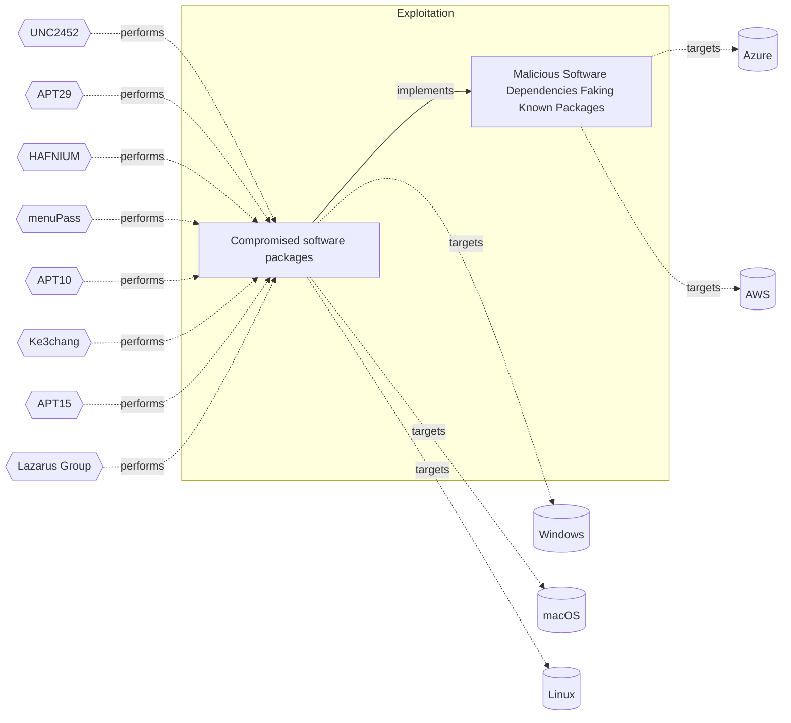

# ☣️ Compromised software packages

🔥 **Criticality:High** ⚠️ : A High priority incident is likely to result in a demonstrable impact to public health or safety, national security, economic security, foreign relations, civil liberties, or public confidence. 

🚦 **TLP:CLEAR** ⚪ : Recipients can spread this to the world, there is no limit on disclosure.

🗡️ **ATT&CK Techniques** [T1546.016 : Event Triggered Execution: Installer Packages](https://attack.mitre.org/techniques/T1546/016 'Adversaries may establish persistence and elevate privileges by using an installer to trigger the execution of malicious content Installer packages ar'), [T1195 : Supply Chain Compromise](https://attack.mitre.org/techniques/T1195 'Adversaries may manipulate products or product delivery mechanisms prior to receipt by a final consumer for the purpose of data or system compromiseSu')

---

`🔑 UUID : 1c1c9665-a30e-479b-bd80-1afb7b53ac83` **|** `🏷️ Version : 1` **|** `🗓️ Creation Date : 2025-04-15` **|** `🗓️ Last Modification : 2025-04-22` **|** `Sharing Organisation : {'uuid': '56b0a0f0-b0bc-47d9-bb46-02f80ae2065a', 'name': 'EC DIGIT CSOC'}` **|** `🧱 Schema Identifier : tvm::2.1`

## 👁️ Description

> Compromised software packages in a supply chain attack refer to the
> intentional or unintentional inclusion of malicious code or vulnerabilities
> in software components, libraries, or dependencies that are used by multiple
> organizations or products. This type of attack targets the software supply
> chain, which includes all the organizations, people, and processes involved
> in designing, developing, testing, building, delivering, and maintaining
> software.
> 
> ### Types of compromised software packages
> 
> - Malicious libraries or dependencies: Open-source or third-party libraries
> that contain malicious code, which can be used to steal sensitive data,
> disrupt operations, or create backdoors.
> - Tampered software updates: Legitimate software updates that have been
> compromised by an attacker, allowing them to inject malware or backdoors
> into the updated software.
> - Infected software components: Software components, such as DLLs or
> executables, that contain malware or vulnerabilities, which can be
> used to compromise the entire system.
> - Fake or counterfeit software: Software that is intentionally designed
> to mimic legitimate software, but contains malware or vulnerabilities.
> - Typosquatting attacks: This type of approach includes a small changes
> in the name of the software packages. In this way is very difficult to
> recognise a malicious from a legitimate software package for installation.
> The packages with names similar to legitimate ones could be deceiving and
> easily lure the victim to download and use them. 
> 
> ### Dependency poisoning 
> 
> Threat actors can add intentional vulnerabilities to open-source libraries
> by exploiting their accessibility. Such example is typosquatting attacks
> in which an adversary uploads malicious packages with names similar to
> popular NPM or PyPI libraries to trick developers into downloading
> the wrong one. Threat actors can also inject malicious code into trusted
> libraries,for example: Log4j, NPM, or PyPI, compromising thousands of
> applications that rely on them. This type of attack, often referred
> to as “supply chain poisoning,” can have a massive impactful
> consequences. ref [2].  
> 
> It's recommended a security officer to establish robust policies for
> evaluating, approving, and managing open-source libraries. This includes
> selecting packages from trusted sources and monitoring their activity.

## 🖥️ Terrain 

 > A threat actor can use vulnerabilities in the function and appearance
> of software malicious dev packages to entice a developer to install them.
> 

---

## 🕸️ Relations

### 🐲 Actors sightings 

| Actor                 | Description                                                                                                                                                                                                                                                                                                                                                                                                                                                                                                                                                                                                                                                                                                                                                                                                                                                                                                                                                                                                                                                                                                                                                                                                                                                                                                                                                                                                                                                                                                                                                                                                                                                                                                                                                                                                                                                                                                                                                                                                                                                                                                                                                                                                                                                                                                        | Aliases                                                                                                                                                                                                                                                                                                                                                                                                                                                                                                                                                | Source                     | Sighting                                                                                                                                       | Reference                                                                                                                                      |
|:----------------------|:-------------------------------------------------------------------------------------------------------------------------------------------------------------------------------------------------------------------------------------------------------------------------------------------------------------------------------------------------------------------------------------------------------------------------------------------------------------------------------------------------------------------------------------------------------------------------------------------------------------------------------------------------------------------------------------------------------------------------------------------------------------------------------------------------------------------------------------------------------------------------------------------------------------------------------------------------------------------------------------------------------------------------------------------------------------------------------------------------------------------------------------------------------------------------------------------------------------------------------------------------------------------------------------------------------------------------------------------------------------------------------------------------------------------------------------------------------------------------------------------------------------------------------------------------------------------------------------------------------------------------------------------------------------------------------------------------------------------------------------------------------------------------------------------------------------------------------------------------------------------------------------------------------------------------------------------------------------------------------------------------------------------------------------------------------------------------------------------------------------------------------------------------------------------------------------------------------------------------------------------------------------------------------------------------------------------|:-------------------------------------------------------------------------------------------------------------------------------------------------------------------------------------------------------------------------------------------------------------------------------------------------------------------------------------------------------------------------------------------------------------------------------------------------------------------------------------------------------------------------------------------------------|:---------------------------|:-----------------------------------------------------------------------------------------------------------------------------------------------|:-----------------------------------------------------------------------------------------------------------------------------------------------|
| UNC2452               | Reporting regarding activity related to the SolarWinds supply chain injection has grown quickly since initial disclosure on 13 December 2020. A significant amount of press reporting has focused on the identification of the actor(s) involved, victim organizations, possible campaign timeline, and potential impact. The US Government and cyber community have also provided detailed information on how the campaign was likely conducted and some of the malware used.  MITRE’s ATT&CK team — with the assistance of contributors — has been mapping techniques used by the actor group, referred to as UNC2452/Dark Halo by FireEye and Volexity respectively, as well as SUNBURST and TEARDROP malware.                                                                                                                                                                                                                                                                                                                                                                                                                                                                                                                                                                                                                                                                                                                                                                                                                                                                                                                                                                                                                                                                                                                                                                                                                                                                                                                                                                                                                                                                                                                                                                                                  | DarkHalo, StellarParticle, NOBELIUM, Solar Phoenix, Midnight Blizzard                                                                                                                                                                                                                                                                                                                                                                                                                                                                                  | 🌌 MISP Threat Actor Galaxy | No documented sighting                                                                                                                         | https://cloud.google.com/blog/topics/threat-intelligence/evasive-attacker-leverages-solarwinds-supply-chain-compromises-with-sunburst-backdoor |
| APT29                 | A 2015 report by F-Secure describe APT29 as: 'The Dukes are a well-resourced, highly dedicated and organized cyberespionage group that we believe has been working for the Russian Federation since at least 2008 to collect intelligence in support of foreign and security policy decision-making. The Dukes show unusual confidence in their ability to continue successfully compromising their targets, as well as in their ability to operate with impunity. The Dukes primarily target Western governments and related organizations, such as government ministries and agencies, political think tanks, and governmental subcontractors. Their targets have also included the governments of members of the Commonwealth of Independent States;Asian, African, and Middle Eastern governments;organizations associated with Chechen extremism;and Russian speakers engaged in the illicit trade of controlled substances and drugs. The Dukes are known to employ a vast arsenal of malware toolsets, which we identify as MiniDuke, CosmicDuke, OnionDuke, CozyDuke, CloudDuke, SeaDuke, HammerDuke, PinchDuke, and GeminiDuke. In recent years, the Dukes have engaged in apparently biannual large - scale spear - phishing campaigns against hundreds or even thousands of recipients associated with governmental institutions and affiliated organizations. These campaigns utilize a smash - and - grab approach involving a fast but noisy breakin followed by the rapid collection and exfiltration of as much data as possible.If the compromised target is discovered to be of value, the Dukes will quickly switch the toolset used and move to using stealthier tactics focused on persistent compromise and long - term intelligence gathering. This threat actor targets government ministries and agencies in the West, Central Asia, East Africa, and the Middle East; Chechen extremist groups; Russian organized crime; and think tanks. It is suspected to be behind the 2015 compromise of unclassified networks at the White House, Department of State, Pentagon, and the Joint Chiefs of Staff. The threat actor includes all of the Dukes tool sets, including MiniDuke, CosmicDuke, OnionDuke, CozyDuke, SeaDuke, CloudDuke (aka MiniDionis), and HammerDuke (aka Hammertoss). ' | Group 100, COZY BEAR, The Dukes, Minidionis, SeaDuke, YTTRIUM, IRON HEMLOCK, Grizzly Steppe, G0016, ATK7, Cloaked Ursa, TA421, Blue Kitsune, ITG11, BlueBravo, Nobelium, UAC-0029                                                                                                                                                                                                                                                                                                                                                                      | 🌌 MISP Threat Actor Galaxy | No documented sighting                                                                                                                         | No documented references                                                                                                                       |
| [Enterprise] APT29    | [APT29](https://attack.mitre.org/groups/G0016) is threat group that has been attributed to Russia's Foreign Intelligence Service (SVR).(Citation: White House Imposing Costs RU Gov April 2021)(Citation: UK Gov Malign RIS Activity April 2021) They have operated since at least 2008, often targeting government networks in Europe and NATO member countries, research institutes, and think tanks. [APT29](https://attack.mitre.org/groups/G0016) reportedly compromised the Democratic National Committee starting in the summer of 2015.(Citation: F-Secure The Dukes)(Citation: GRIZZLY STEPPE JAR)(Citation: Crowdstrike DNC June 2016)(Citation: UK Gov UK Exposes Russia SolarWinds April 2021)In April 2021, the US and UK governments attributed the [SolarWinds Compromise](https://attack.mitre.org/campaigns/C0024) to the SVR; public statements included citations to [APT29](https://attack.mitre.org/groups/G0016), Cozy Bear, and The Dukes.(Citation: NSA Joint Advisory SVR SolarWinds April 2021)(Citation: UK NSCS Russia SolarWinds April 2021) Industry reporting also referred to the actors involved in this campaign as UNC2452, NOBELIUM, StellarParticle, Dark Halo, and SolarStorm.(Citation: FireEye SUNBURST Backdoor December 2020)(Citation: MSTIC NOBELIUM Mar 2021)(Citation: CrowdStrike SUNSPOT Implant January 2021)(Citation: Volexity SolarWinds)(Citation: Cybersecurity Advisory SVR TTP May 2021)(Citation: Unit 42 SolarStorm December 2020)                                                                                                                                                                                                                                                                                                                                                                                                                                                                                                                                                                                                                                                                                                                                                                                                                       | Blue Kitsune, Cozy Bear, CozyDuke, Dark Halo, IRON HEMLOCK, IRON RITUAL, Midnight Blizzard, NOBELIUM, NobleBaron, SolarStorm, The Dukes, UNC2452, UNC3524, YTTRIUM                                                                                                                                                                                                                                                                                                                                                                                     | 🗡️ MITRE ATT&CK Groups     | A Russian state-sponsored threat actor that has been linkedto the SolarWinds hack and has also been known to compromise software packages.     | https://sensorstechforum.com/apt29-tactics-revealed-five-eyes                                                                                  |
| [Enterprise] HAFNIUM  | [HAFNIUM](https://attack.mitre.org/groups/G0125) is a likely state-sponsored cyber espionage group operating out of China that has been active since at least January 2021. [HAFNIUM](https://attack.mitre.org/groups/G0125) primarily targets entities in the US across a number of industry sectors, including infectious disease researchers, law firms, higher education institutions, defense contractors, policy think tanks, and NGOs. [HAFNIUM](https://attack.mitre.org/groups/G0125) has targeted remote management tools and cloud software for intial access and has demonstrated an ability to quickly operationalize exploits for identified vulnerabilities in edge devices.(Citation: Microsoft HAFNIUM March 2020)(Citation: Volexity Exchange Marauder March 2021)(Citation: Microsoft Silk Typhoon MAR 2025)                                                                                                                                                                                                                                                                                                                                                                                                                                                                                                                                                                                                                                                                                                                                                                                                                                                                                                                                                                                                                                                                                                                                                                                                                                                                                                                                                                                                                                                                                    | Operation Exchange Marauder, Silk Typhoon                                                                                                                                                                                                                                                                                                                                                                                                                                                                                                              | 🗡️ MITRE ATT&CK Groups     | No documented sighting                                                                                                                         | No documented references                                                                                                                       |
| HAFNIUM               | HAFNIUM primarily targets entities in the United States across a number of industry sectors, including infectious disease researchers, law firms, higher education institutions, defense contractors, policy think tanks, and NGOs. Microsoft Threat Intelligence Center (MSTIC) attributes this campaign with high confidence to HAFNIUM, a group assessed to be state-sponsored and operating out of China, based on observed victimology, tactics and procedures. HAFNIUM has previously compromised victims by exploiting vulnerabilities in internet-facing servers, and has used legitimate open-source frameworks, like Covenant, for command and control. Once they’ve gained access to a victim network, HAFNIUM typically exfiltrates data to file sharing sites like MEGA.In campaigns unrelated to these vulnerabilities, Microsoft has observed HAFNIUM interacting with victim Office 365 tenants. While they are often unsuccessful in compromising customer accounts, this reconnaissance activity helps the adversary identify more details about their targets’ environments. HAFNIUM operates primarily from leased virtual private servers (VPS) in the United States.                                                                                                                                                                                                                                                                                                                                                                                                                                                                                                                                                                                                                                                                                                                                                                                                                                                                                                                                                                                                                                                                                                                         | ATK233, G0125, Operation Exchange Marauder, Red Dev 13, Silk Typhoon, MURKY PANDA                                                                                                                                                                                                                                                                                                                                                                                                                                                                      | 🌌 MISP Threat Actor Galaxy | A Chinese state-sponsored threat actor that has been knownto exploit vulnerabilities in software packages, includingMicrosoft Exchange Server. | https://edition.cnn.com/2021/03/10/tech/microsoft-exchange-hafnium-hack-explainer/index.html                                                   |
| [Enterprise] menuPass | [menuPass](https://attack.mitre.org/groups/G0045) is a threat group that has been active since at least 2006. Individual members of [menuPass](https://attack.mitre.org/groups/G0045) are known to have acted in association with the Chinese Ministry of State Security's (MSS) Tianjin State Security Bureau and worked for the Huaying Haitai Science and Technology Development Company.(Citation: DOJ APT10 Dec 2018)(Citation: District Court of NY APT10 Indictment December 2018)[menuPass](https://attack.mitre.org/groups/G0045) has targeted healthcare, defense, aerospace, finance, maritime, biotechnology, energy, and government sectors globally, with an emphasis on Japanese organizations. In 2016 and 2017, the group is known to have targeted managed IT service providers (MSPs), manufacturing and mining companies, and a university.(Citation: Palo Alto menuPass Feb 2017)(Citation: Crowdstrike CrowdCast Oct 2013)(Citation: FireEye Poison Ivy)(Citation: PWC Cloud Hopper April 2017)(Citation: FireEye APT10 April 2017)(Citation: DOJ APT10 Dec 2018)(Citation: District Court of NY APT10 Indictment December 2018)                                                                                                                                                                                                                                                                                                                                                                                                                                                                                                                                                                                                                                                                                                                                                                                                                                                                                                                                                                                                                                                                                                                                                             | APT10, BRONZE RIVERSIDE, CVNX, Cicada, HOGFISH, POTASSIUM, Red Apollo, Stone Panda                                                                                                                                                                                                                                                                                                                                                                                                                                                                     | 🗡️ MITRE ATT&CK Groups     | No documented sighting                                                                                                                         | No documented references                                                                                                                       |
| APT10                 | menuPass is a threat group that has been active since at least 2006. Individual members of menuPass are known to have acted in association with the Chinese Ministry of State Security's (MSS) Tianjin State Security Bureau and worked for the Huaying Haitai Science and Technology Development Company.                                                                                                                                                                                                                                                                                                                                                                                                                                                                                                                                                                                                                                                                                                                                                                                                                                                                                                                                                                                                                                                                                                                                                                                                                                                                                                                                                                                                                                                                                                                                                                                                                                                                                                                                                                                                                                                                                                                                                                                                         | STONE PANDA, Menupass Team, happyyongzi, POTASSIUM, Red Apollo, CVNX, HOGFISH, Cloud Hopper, BRONZE RIVERSIDE, ATK41, G0045, Granite Taurus, TA429, Cicada, Purple Typhoon                                                                                                                                                                                                                                                                                                                                                                             | 🌌 MISP Threat Actor Galaxy | A Chinese threat actor that has been known to compromisesoftware packages, including the NetSarang software.                                   | https://medium.com/aardvark-infinity/apt10-in-depth-analysis-of-an-advanced-persistent-threat-group-e897cc7e8efe                               |
| [Enterprise] Ke3chang | [Ke3chang](https://attack.mitre.org/groups/G0004) is a threat group attributed to actors operating out of China. [Ke3chang](https://attack.mitre.org/groups/G0004) has targeted oil, government, diplomatic, military, and NGOs in Central and South America, the Caribbean, Europe, and North America since at least 2010.(Citation: Mandiant Operation Ke3chang November 2014)(Citation: NCC Group APT15 Alive and Strong)(Citation: APT15 Intezer June 2018)(Citation: Microsoft NICKEL December 2021)                                                                                                                                                                                                                                                                                                                                                                                                                                                                                                                                                                                                                                                                                                                                                                                                                                                                                                                                                                                                                                                                                                                                                                                                                                                                                                                                                                                                                                                                                                                                                                                                                                                                                                                                                                                                          | APT15, GREF, Mirage, NICKEL, Nylon Typhoon, Playful Dragon, RoyalAPT, Vixen Panda                                                                                                                                                                                                                                                                                                                                                                                                                                                                      | 🗡️ MITRE ATT&CK Groups     | No documented sighting                                                                                                                         | No documented references                                                                                                                       |
| APT15                 | This threat actor uses phishing techniques to compromise the networks of foreign ministries of European countries for espionage purposes.                                                                                                                                                                                                                                                                                                                                                                                                                                                                                                                                                                                                                                                                                                                                                                                                                                                                                                                                                                                                                                                                                                                                                                                                                                                                                                                                                                                                                                                                                                                                                                                                                                                                                                                                                                                                                                                                                                                                                                                                                                                                                                                                                                          | VIXEN PANDA, Ke3Chang, Playful Dragon, Metushy, Lurid, Social Network Team, Royal APT, BRONZE PALACE, BRONZE DAVENPORT, BRONZE IDLEWOOD, NICKEL, G0004, Red Vulture, Nylon Typhoon, Mirage                                                                                                                                                                                                                                                                                                                                                             | 🌌 MISP Threat Actor Galaxy | A Chinese threat actor that has been known to compromisesoftware packages, including the CCleaner software.                                    | https://arstechnica.com/information-technology/2017/09/backdoor-malware-planted-in-legitimate-software-updates-to-ccleaner                     |
| [ICS] Lazarus Group   | [Lazarus Group](https://attack.mitre.org/groups/G0032) is a North Korean state-sponsored cyber threat group that has been attributed to the Reconnaissance General Bureau.(Citation: US-CERT HIDDEN COBRA June 2017)(Citation: Treasury North Korean Cyber Groups September 2019) The group has been active since at least 2009 and was reportedly responsible for the November 2014 destructive wiper attack against Sony Pictures Entertainment as part of a campaign named Operation Blockbuster by Novetta. Malware used by [Lazarus Group](https://attack.mitre.org/groups/G0032) correlates to other reported campaigns, including Operation Flame, Operation 1Mission, Operation Troy, DarkSeoul, and Ten Days of Rain.(Citation: Novetta Blockbuster)North Korean group definitions are known to have significant overlap, and some security researchers report all North Korean state-sponsored cyber activity under the name [Lazarus Group](https://attack.mitre.org/groups/G0032) instead of tracking clusters or subgroups, such as [Andariel](https://attack.mitre.org/groups/G0138), [APT37](https://attack.mitre.org/groups/G0067), [APT38](https://attack.mitre.org/groups/G0082), and [Kimsuky](https://attack.mitre.org/groups/G0094).                                                                                                                                                                                                                                                                                                                                                                                                                                                                                                                                                                                                                                                                                                                                                                                                                                                                                                                                                                                                                                                          | Diamond Sleet, Guardians of Peace, HIDDEN COBRA, Labyrinth Chollima, NICKEL ACADEMY, ZINC                                                                                                                                                                                                                                                                                                                                                                                                                                                              | 🗡️ MITRE ATT&CK Groups     | No documented sighting                                                                                                                         | No documented references                                                                                                                       |
| Lazarus Group         | Since 2009, HIDDEN COBRA actors have leveraged their capabilities to target and compromise a range of victims; some intrusions have resulted in the exfiltration of data while others have been disruptive in nature. Commercial reporting has referred to this activity as Lazarus Group and Guardians of Peace. Tools and capabilities used by HIDDEN COBRA actors include DDoS botnets, keyloggers, remote access tools (RATs), and wiper malware. Variants of malware and tools used by HIDDEN COBRA actors include Destover, Duuzer, and Hangman.                                                                                                                                                                                                                                                                                                                                                                                                                                                                                                                                                                                                                                                                                                                                                                                                                                                                                                                                                                                                                                                                                                                                                                                                                                                                                                                                                                                                                                                                                                                                                                                                                                                                                                                                                             | Operation DarkSeoul, Dark Seoul, Hidden Cobra, Hastati Group, Andariel, Unit 121, Bureau 121, NewRomanic Cyber Army Team, Bluenoroff, Subgroup: Bluenoroff, Group 77, Labyrinth Chollima, Operation Troy, Operation GhostSecret, Operation AppleJeus, APT38, APT 38, Stardust Chollima, Whois Hacking Team, Zinc, Appleworm, Nickel Academy, APT-C-26, NICKEL GLADSTONE, COVELLITE, ATK3, G0032, ATK117, G0082, Citrine Sleet, DEV-0139, DEV-1222, Diamond Sleet, ZINC, Sapphire Sleet, COPERNICIUM, TA404, Lazarus group, BeagleBoyz, Moonstone Sleet | 🌌 MISP Threat Actor Galaxy | A North Korean state-sponsored threat actor that has been knownto compromise software packages, including the Adobe Flash Player.              | https://dailysecurityreview.com/resources/lazarus-ransomware-group-the-north-korean-cyber-menace                                               |

### 🌊 OpenTide Objects
🚫 No related OpenTide objects indexed.

 --- 

### ⛓️ Threat Chaining

Expand chaining data

| ☣️ Vector                                                                                                                                                                                                                                                  | ⛓️ Link                 | 🎯 Target                                                                                                                                                                                                                                                                                                         | ⛰️ Terrain                                                                                                               | 🗡️ ATT&CK                                                                                                                                                                                                                             |
|:-----------------------------------------------------------------------------------------------------------------------------------------------------------------------------------------------------------------------------------------------------------|:------------------------|:-----------------------------------------------------------------------------------------------------------------------------------------------------------------------------------------------------------------------------------------------------------------------------------------------------------------|:-------------------------------------------------------------------------------------------------------------------------|:--------------------------------------------------------------------------------------------------------------------------------------------------------------------------------------------------------------------------------------|
| [Compromised software packages](../Threat%20Vectors/☣️%20Compromised%20software%20packages.md 'Compromised software packages in a supply chain attack refer to theintentional or unintentional inclusion of malicious code or vulnerabilitiesin softw...') | `atomicity::implements` | [Malicious Software Dependencies Faking Known Packages](../Threat%20Vectors/☣️%20Malicious%20Software%20Dependencies%20Faking%20Known%20Packages.md 'Adversaries maymimick known and trusted software packages anddistributors, with the intent to be mistaken for the original developer,and thus deliver ...') | Software development performed internally need to rely on external dependencies, and sources are not rigorously checked. | [T1195 : Supply Chain Compromise](https://attack.mitre.org/techniques/T1195 'Adversaries may manipulate products or product delivery mechanisms prior to receipt by a final consumer for the purpose of data or system compromiseSu') |

&nbsp; 

---

## Model Data

#### **⛓️ Cyber Kill Chain**

 > Cyber attacks are typically phased progressions towards strategic objectives. The Unified Kill Chains provides insight into the tactics that hackers employ to attain these objectives. This provides a solid basis to develop (or realign) defensive strategies to raise cyber resilience.

 [`💥 Exploitation`](https://www.unifiedkillchain.com/assets/The-Unified-Kill-Chain.pdf) : Techniques to exploit vulnerabilities in systems that may, amongst others, result in code execution.

---

#### **🛰️ Domains**

 > Infrastructure technologies domain of interest to attackers.

  - `🏢 Enterprise` : Generic databases, applications, machines and systems that are usually on premises or on Cloud traditional VMs.
 - `🦾 IoT` : Placeholder
 - `☁️ Private Cloud` : Infrastructure hosted at a third party, but based on custom specification and managed on a platform level.
 - `☁️ Public Cloud` : Infrastructure handled by a commercial cloud provider. Managed mostly on a service level, and connected over the internet.

---

#### **🎯 Targets**

 > Granular delimited technical entities holding a value to the organization, that are targeted by adversaries. They might be also involved in the detection coverage as the target of log collection. Partially inspired by Veris.

  - [`🛠️ CI/CD Pipelines`](http://veriscommunity.net/enums.html#section-asset) : CI/CD pipelines automate the process of building, testing, and deploying software, ensuring efficient and reliable software delivery.
 - [`👤 Developer`](http://veriscommunity.net/enums.html#section-asset) : People - Developer
 - [`🖥️ Workstations`](http://veriscommunity.net/enums.html#section-asset) : Placeholder
 - [`💻 Laptop`](http://veriscommunity.net/enums.html#section-asset) : User Device - Laptop

---

#### **💿 Platforms concerned**

 > Actual technologies used by the organization that will be exploited by adversaries during a successful attack, and eventually of relevance for detection. Are named by commercial designation.

  - ` Windows` : Placeholder
 - ` macOS` : Placeholder
 - ` Linux` : Placeholder

---

#### **💣 Severity**

 > The severity summarizes the overall danger of incident the vector will provoke, and is to be derived (WIP) from impact, leverage, and difficulty to execute.

 [`🚨 Highly significant incident`](https://www.ncsc.gov.uk/news/new-cyber-attack-categorisation-system-improve-uk-response-incidents) : A cyber attack which has a serious impact on central government, (inter)national essential services, a large proportion of the (inter)national population, or the (inter)national economy.

---

#### **🪄 Leverage acquisition**

 > Technical aftermath of the attack from the target perspective, differentiated from impact as it does not consider the value of the consequence, only what increased control the vector execution provides to the adversary.

  - [`👁️‍🗨️ Information Disclosure`](https://owasp.org/www-community/Threat_Modeling_Process#stride) : Threat action intending to read a file that one was not granted access to, or to read data in transit.
 - [`💀 Infrastructure Compromise`](https://owasp.org/www-community/Threat_Modeling_Process#stride) : The compromised target is likely to be used to further expand the sphere of influence of the attacker and allow more potent vectors to be executed.
 - [`💅 Elevation of privilege`](https://owasp.org/www-community/Threat_Modeling_Process#stride) : Capacity to augment leverage over the target system by upgrading the compromised access rights
 - [`🐒 Tampering`](https://owasp.org/www-community/Threat_Modeling_Process#stride) : Threat action intending to maliciously change or modify persistent data, such as records in a database, and the alteration of data in transit between two computers over an open network, such as the Internet.

---

#### **💥 Impact**

 > Analysis of the threat vector from the organizational perspective, in non technical term. This aims at putting a clear denomination on what the attacker will actually be able to act upon if the threat vector is realized.

  - [`🛑 Business disruption`](http://veriscommunity.net/enums.html#section-impact) : Business disruption
 - [`🩼 Impairement`](http://veriscommunity.net/enums.html#section-impact) : Incapacitation of a particular key system that will cause disruptions in day-to-day operations, and eventually service delivery.
 - [`🤬 Lose Capabilities`](http://veriscommunity.net/enums.html#section-impact) : Vector execution will remove key functions to the organization, which will not be easily circumvented. Most day-to-day is heavily impaired, but processes can reorganize at a loss.

---

#### **🎲 Vector Viability**

 > Described with estimative language (likelyhood probability), describes how likely the analyst believes the vector to actually be realized on the organization infrastructure. Estimative language describes quality and credibility of underlying sources, data, and methodologies based Intelligence Community Directive 203 (ICD 203) and JP 2-0, Joint Intelligence.

 [`🧐 Likely`](https://www.dni.gov/files/documents/ICD/ICD%20203%20Analytic%20Standards.pdf) : Probable (probably) - 55-80%

---

### 🔗 References

**🕊️ Publicly available resources**

- [_1_] https://cycode.com/blog/software-supply-chain-risks/
- [_2_] https://www.balbix.com/insights/what-are-software-supply-chain-vulnerabilities-understanding-the-risks-how-to-mitigate-them/
- [_3_] https://secureframe.com/blog/software-supply-chain-security
- [_4_] https://www.bleepingcomputer.com/news/security/infostealer-campaign-compromises-10-npm-packages-targets-devs/
- [_5_] https://www.reversinglabs.com/blog/malicious-npm-patch-delivers-reverse-shell

[1]: https://cycode.com/blog/software-supply-chain-risks/
[2]: https://www.balbix.com/insights/what-are-software-supply-chain-vulnerabilities-understanding-the-risks-how-to-mitigate-them/
[3]: https://secureframe.com/blog/software-supply-chain-security
[4]: https://www.bleepingcomputer.com/news/security/infostealer-campaign-compromises-10-npm-packages-targets-devs/
[5]: https://www.reversinglabs.com/blog/malicious-npm-patch-delivers-reverse-shell

---

#### 🏷️ Tags

#-, #-, #-, #
, #
, ##, ##, ##, ##, # , #🏷, #️, # , #T, #a, #g, #s, #
, #

