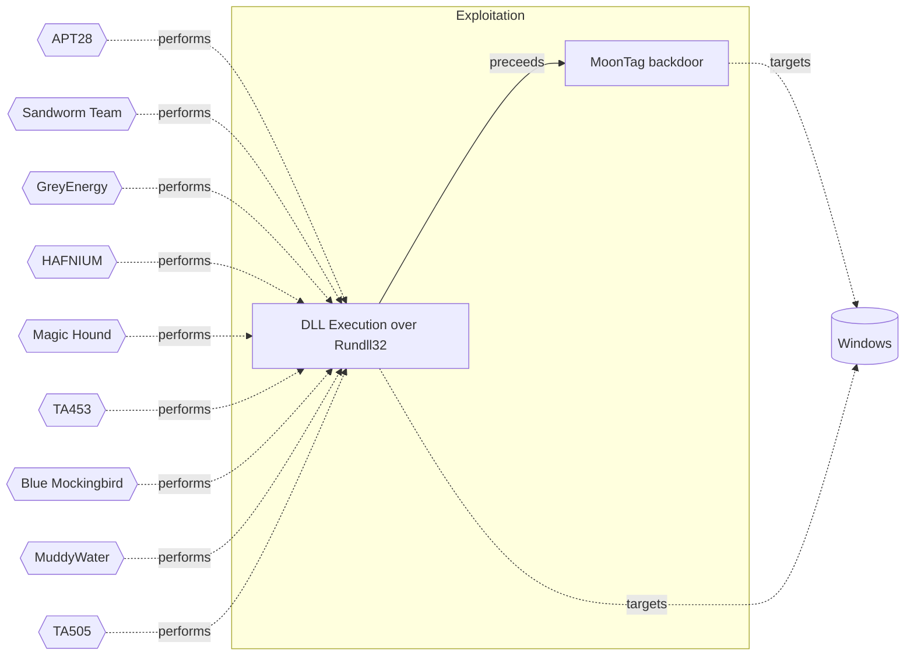

# ☣️ DLL Execution over Rundll32

🔥 **Criticality:Severe** 🚨 : A Severe priority incident is likely to result in a significant impact to public health or safety, national security, economic security, foreign relations, or civil liberties. 

🚦 **TLP:CLEAR** ⚪ : Recipients can spread this to the world, there is no limit on disclosure.

🗡️ **ATT&CK Techniques** [T1218.011 : System Binary Proxy Execution: Rundll32](https://attack.mitre.org/techniques/T1218/011 'Adversaries may abuse rundll32exe to proxy execution of malicious code Using rundll32exe, vice executing directly ie Shared Moduleshttpsattackmitreorg')

---

`🔑 UUID : f3a392f7-3268-4c54-8bfa-8117b784f520` **|** `🏷️ Version : 2` **|** `🗓️ Creation Date : 2023-07-25` **|** `🗓️ Last Modification : 2025-10-01` **|** `Sharing Organisation : {'uuid': '56b0a0f0-b0bc-47d9-bb46-02f80ae2065a', 'name': 'EC DIGIT CSOC'}` **|** `🧱 Schema Identifier : tvm::2.0`

## 👁️ Description

> Rundll32.exe is a powerful asset for adversaries to proxy execution of arbitrary
> and malicious code. It is flexible and efficient for loading code into memory,
> as may load malicious DLLs by ordinals, function names or directly.
> Rundll32.exe has a certain degree of trust; which can result in a possible
> AppLocker and Software Restriction Policies (SRP) bypass.
> 
> Adversaries rely on distinct vectors to infect their targets, who might get
> infected. Upon successful exploitation, malicious actors have been seen executing
> DLL files using Rundll32.exe for multiple purposes; such as download and execute a
> payload from a remote server (DLL path could be both local and remote when the DLL
> is hosted on a SMB share using UNC paths), contact C&C server to upload stolen data
> or dump LSASS process memory to obtain credentials.
> 

## 🖥️ Terrain 

 > Adversary must have enough privileges on the Windows host to bypass application
> control solutions via the rundll32.exe process. Natively, rundll32.exe will load
> DLLs and is a great example of a Living off the Land Binary.    
> 

---

## 🕸️ Relations

### 🐲 Actors sightings 

| Actor                         | Description                                                                                                                                                                                                                                                                                                                                                                                                                                                                                                                                                                                                                                                                                                                                                                                                                                                                                                                                                                                                                                                                                                                                                                                                                                                                                                                                                                                                                                                                                                                                                                                                                                                                                                                                          | Aliases                                                                                                                                                                                                                                                                                                   | Source                     | Sighting               | Reference                |
|:------------------------------|:-----------------------------------------------------------------------------------------------------------------------------------------------------------------------------------------------------------------------------------------------------------------------------------------------------------------------------------------------------------------------------------------------------------------------------------------------------------------------------------------------------------------------------------------------------------------------------------------------------------------------------------------------------------------------------------------------------------------------------------------------------------------------------------------------------------------------------------------------------------------------------------------------------------------------------------------------------------------------------------------------------------------------------------------------------------------------------------------------------------------------------------------------------------------------------------------------------------------------------------------------------------------------------------------------------------------------------------------------------------------------------------------------------------------------------------------------------------------------------------------------------------------------------------------------------------------------------------------------------------------------------------------------------------------------------------------------------------------------------------------------------|:----------------------------------------------------------------------------------------------------------------------------------------------------------------------------------------------------------------------------------------------------------------------------------------------------------|:---------------------------|:-----------------------|:-------------------------|
| [Mobile] APT28                | [APT28](https://attack.mitre.org/groups/G0007) is a threat group that has been attributed to Russia's General Staff Main Intelligence Directorate (GRU) 85th Main Special Service Center (GTsSS) military unit 26165.(Citation: NSA/FBI Drovorub August 2020)(Citation: Cybersecurity Advisory GRU Brute Force Campaign July 2021) This group has been active since at least 2004.(Citation: DOJ GRU Indictment Jul 2018)(Citation: Ars Technica GRU indictment Jul 2018)(Citation: Crowdstrike DNC June 2016)(Citation: FireEye APT28)(Citation: SecureWorks TG-4127)(Citation: FireEye APT28 January 2017)(Citation: GRIZZLY STEPPE JAR)(Citation: Sofacy DealersChoice)(Citation: Palo Alto Sofacy 06-2018)(Citation: Symantec APT28 Oct 2018)(Citation: ESET Zebrocy May 2019)[APT28](https://attack.mitre.org/groups/G0007) reportedly compromised the Hillary Clinton campaign, the Democratic National Committee, and the Democratic Congressional Campaign Committee in 2016 in an attempt to interfere with the U.S. presidential election.(Citation: Crowdstrike DNC June 2016) In 2018, the US indicted five GRU Unit 26165 officers associated with [APT28](https://attack.mitre.org/groups/G0007) for cyber operations (including close-access operations) conducted between 2014 and 2018 against the World Anti-Doping Agency (WADA), the US Anti-Doping Agency, a US nuclear facility, the Organization for the Prohibition of Chemical Weapons (OPCW), the Spiez Swiss Chemicals Laboratory, and other organizations.(Citation: US District Court Indictment GRU Oct 2018) Some of these were conducted with the assistance of GRU Unit 74455, which is also referred to as [Sandworm Team](https://attack.mitre.org/groups/G0034). | FROZENLAKE, Fancy Bear, Forest Blizzard, Group 74, GruesomeLarch, IRON TWILIGHT, Pawn Storm, SNAKEMACKEREL, STRONTIUM, Sednit, Sofacy, Swallowtail, TG-4127, Threat Group-4127, Tsar Team                                                                                                                 | 🗡️ MITRE ATT&CK Groups     | No documented sighting | No documented references |
| APT28                         | The Sofacy Group (also known as APT28, Pawn Storm, Fancy Bear and Sednit) is a cyber espionage group believed to have ties to the Russian government. Likely operating since 2007, the group is known to target government, military, and security organizations. It has been characterized as an advanced persistent threat.                                                                                                                                                                                                                                                                                                                                                                                                                                                                                                                                                                                                                                                                                                                                                                                                                                                                                                                                                                                                                                                                                                                                                                                                                                                                                                                                                                                                                        | Pawn Storm, FANCY BEAR, Sednit, SNAKEMACKEREL, Tsar Team, TG-4127, STRONTIUM, Swallowtail, IRON TWILIGHT, Group 74, SIG40, Grizzly Steppe, G0007, ATK5, Fighting Ursa, ITG05, Blue Athena, TA422, T-APT-12, APT-C-20, UAC-0028, FROZENLAKE, Sofacy, Forest Blizzard, BlueDelta, Fancy Bear, GruesomeLarch | 🌌 MISP Threat Actor Galaxy | No documented sighting | No documented references |
| [Mobile] Sandworm Team        | [Sandworm Team](https://attack.mitre.org/groups/G0034) is a destructive threat group that has been attributed to Russia's General Staff Main Intelligence Directorate (GRU) Main Center for Special Technologies (GTsST) military unit 74455.(Citation: US District Court Indictment GRU Unit 74455 October 2020)(Citation: UK NCSC Olympic Attacks October 2020) This group has been active since at least 2009.(Citation: iSIGHT Sandworm 2014)(Citation: CrowdStrike VOODOO BEAR)(Citation: USDOJ Sandworm Feb 2020)(Citation: NCSC Sandworm Feb 2020)In October 2020, the US indicted six GRU Unit 74455 officers associated with [Sandworm Team](https://attack.mitre.org/groups/G0034) for the following cyber operations: the 2015 and 2016 attacks against Ukrainian electrical companies and government organizations, the 2017 worldwide [NotPetya](https://attack.mitre.org/software/S0368) attack, targeting of the 2017 French presidential campaign, the 2018 [Olympic Destroyer](https://attack.mitre.org/software/S0365) attack against the Winter Olympic Games, the 2018 operation against the Organisation for the Prohibition of Chemical Weapons, and attacks against the country of Georgia in 2018 and 2019.(Citation: US District Court Indictment GRU Unit 74455 October 2020)(Citation: UK NCSC Olympic Attacks October 2020) Some of these were conducted with the assistance of GRU Unit 26165, which is also referred to as [APT28](https://attack.mitre.org/groups/G0007).(Citation: US District Court Indictment GRU Oct 2018)                                                                                                                                                                                        | APT44, BlackEnergy (Group), ELECTRUM, FROZENBARENTS, IRIDIUM, IRON VIKING, Quedagh, Seashell Blizzard, Telebots, Voodoo Bear                                                                                                                                                                              | 🗡️ MITRE ATT&CK Groups     | No documented sighting | No documented references |
| GreyEnergy                    | ESET research reveals a successor to the infamous BlackEnergy APT group targeting critical infrastructure, quite possibly in preparation for damaging attacks                                                                                                                                                                                                                                                                                                                                                                                                                                                                                                                                                                                                                                                                                                                                                                                                                                                                                                                                                                                                                                                                                                                                                                                                                                                                                                                                                                                                                                                                                                                                                                                        |                                                                                                                                                                                                                                                                                                           | 🌌 MISP Threat Actor Galaxy | No documented sighting | No documented references |
| [Enterprise] HAFNIUM          | [HAFNIUM](https://attack.mitre.org/groups/G0125) is a likely state-sponsored cyber espionage group operating out of China that has been active since at least January 2021. [HAFNIUM](https://attack.mitre.org/groups/G0125) primarily targets entities in the US across a number of industry sectors, including infectious disease researchers, law firms, higher education institutions, defense contractors, policy think tanks, and NGOs. [HAFNIUM](https://attack.mitre.org/groups/G0125) has targeted remote management tools and cloud software for intial access and has demonstrated an ability to quickly operationalize exploits for identified vulnerabilities in edge devices.(Citation: Microsoft HAFNIUM March 2020)(Citation: Volexity Exchange Marauder March 2021)(Citation: Microsoft Silk Typhoon MAR 2025)                                                                                                                                                                                                                                                                                                                                                                                                                                                                                                                                                                                                                                                                                                                                                                                                                                                                                                                      | Operation Exchange Marauder, Silk Typhoon                                                                                                                                                                                                                                                                 | 🗡️ MITRE ATT&CK Groups     | No documented sighting | No documented references |
| HAFNIUM                       | HAFNIUM primarily targets entities in the United States across a number of industry sectors, including infectious disease researchers, law firms, higher education institutions, defense contractors, policy think tanks, and NGOs. Microsoft Threat Intelligence Center (MSTIC) attributes this campaign with high confidence to HAFNIUM, a group assessed to be state-sponsored and operating out of China, based on observed victimology, tactics and procedures. HAFNIUM has previously compromised victims by exploiting vulnerabilities in internet-facing servers, and has used legitimate open-source frameworks, like Covenant, for command and control. Once they’ve gained access to a victim network, HAFNIUM typically exfiltrates data to file sharing sites like MEGA.In campaigns unrelated to these vulnerabilities, Microsoft has observed HAFNIUM interacting with victim Office 365 tenants. While they are often unsuccessful in compromising customer accounts, this reconnaissance activity helps the adversary identify more details about their targets’ environments. HAFNIUM operates primarily from leased virtual private servers (VPS) in the United States.                                                                                                                                                                                                                                                                                                                                                                                                                                                                                                                                                           | ATK233, G0125, Operation Exchange Marauder, Red Dev 13, Silk Typhoon, MURKY PANDA                                                                                                                                                                                                                         | 🌌 MISP Threat Actor Galaxy | No documented sighting | No documented references |
| [Enterprise] Magic Hound      | [Magic Hound](https://attack.mitre.org/groups/G0059) is an Iranian-sponsored threat group that conducts long term, resource-intensive cyber espionage operations, likely on behalf of the Islamic Revolutionary Guard Corps. They have targeted European, U.S., and Middle Eastern government and military personnel, academics, journalists, and organizations such as the World Health Organization (WHO), via complex social engineering campaigns since at least 2014.(Citation: FireEye APT35 2018)(Citation: ClearSky Kittens Back 3 August 2020)(Citation: Certfa Charming Kitten January 2021)(Citation: Secureworks COBALT ILLUSION Threat Profile)(Citation: Proofpoint TA453 July2021)                                                                                                                                                                                                                                                                                                                                                                                                                                                                                                                                                                                                                                                                                                                                                                                                                                                                                                                                                                                                                                                    | APT35, COBALT ILLUSION, Charming Kitten, ITG18, Mint Sandstorm, Newscaster, Phosphorus, TA453                                                                                                                                                                                                             | 🗡️ MITRE ATT&CK Groups     | No documented sighting | No documented references |
| TA453                         | TA453 has employed the use of compromised accounts, malware, and confrontational lures to go after targets with a range of backgrounds from medical researchers to realtors to travel agencies.                                                                                                                                                                                                                                                                                                                                                                                                                                                                                                                                                                                                                                                                                                                                                                                                                                                                                                                                                                                                                                                                                                                                                                                                                                                                                                                                                                                                                                                                                                                                                      |                                                                                                                                                                                                                                                                                                           | 🌌 MISP Threat Actor Galaxy | No documented sighting | No documented references |
| [Enterprise] Blue Mockingbird | [Blue Mockingbird](https://attack.mitre.org/groups/G0108) is a cluster of observed activity involving Monero cryptocurrency-mining payloads in dynamic-link library (DLL) form on Windows systems. The earliest observed Blue Mockingbird tools were created in December 2019.(Citation: RedCanary Mockingbird May 2020)                                                                                                                                                                                                                                                                                                                                                                                                                                                                                                                                                                                                                                                                                                                                                                                                                                                                                                                                                                                                                                                                                                                                                                                                                                                                                                                                                                                                                             |                                                                                                                                                                                                                                                                                                           | 🗡️ MITRE ATT&CK Groups     | No documented sighting | No documented references |
| [Enterprise] MuddyWater       | [MuddyWater](https://attack.mitre.org/groups/G0069) is a cyber espionage group assessed to be a subordinate element within Iran's Ministry of Intelligence and Security (MOIS).(Citation: CYBERCOM Iranian Intel Cyber January 2022) Since at least 2017, [MuddyWater](https://attack.mitre.org/groups/G0069) has targeted a range of government and private organizations across sectors, including telecommunications, local government, defense, and oil and natural gas organizations, in the Middle East, Asia, Africa, Europe, and North America.(Citation: Unit 42 MuddyWater Nov 2017)(Citation: Symantec MuddyWater Dec 2018)(Citation: ClearSky MuddyWater Nov 2018)(Citation: ClearSky MuddyWater June 2019)(Citation: Reaqta MuddyWater November 2017)(Citation: DHS CISA AA22-055A MuddyWater February 2022)(Citation: Talos MuddyWater Jan 2022)                                                                                                                                                                                                                                                                                                                                                                                                                                                                                                                                                                                                                                                                                                                                                                                                                                                                                       | Earth Vetala, MERCURY, Mango Sandstorm, Seedworm, Static Kitten, TA450, TEMP.Zagros                                                                                                                                                                                                                       | 🗡️ MITRE ATT&CK Groups     | No documented sighting | No documented references |
| MuddyWater                    | The MuddyWater attacks are primarily against Middle Eastern nations. However, we have also observed attacks against surrounding nations and beyond, including targets in India and the USA. MuddyWater attacks are characterized by the use of a slowly evolving PowerShell-based first stage backdoor we call “POWERSTATS”. Despite broad scrutiny and reports on MuddyWater attacks, the activity continues with only incremental changes to the tools and techniques.                                                                                                                                                                                                                                                                                                                                                                                                                                                                                                                                                                                                                                                                                                                                                                                                                                                                                                                                                                                                                                                                                                                                                                                                                                                                             | TEMP.Zagros, Static Kitten, Seedworm, MERCURY, COBALT ULSTER, G0069, ATK51, Boggy Serpens, Mango Sandstorm, TA450, Earth Vetala                                                                                                                                                                           | 🌌 MISP Threat Actor Galaxy | No documented sighting | No documented references |
| [Enterprise] TA505            | [TA505](https://attack.mitre.org/groups/G0092) is a cyber criminal group that has been active since at least 2014. [TA505](https://attack.mitre.org/groups/G0092) is known for frequently changing malware, driving global trends in criminal malware distribution, and ransomware campaigns involving [Clop](https://attack.mitre.org/software/S0611).(Citation: Proofpoint TA505 Sep 2017)(Citation: Proofpoint TA505 June 2018)(Citation: Proofpoint TA505 Jan 2019)(Citation: NCC Group TA505)(Citation: Korean FSI TA505 2020)                                                                                                                                                                                                                                                                                                                                                                                                                                                                                                                                                                                                                                                                                                                                                                                                                                                                                                                                                                                                                                                                                                                                                                                                                  | CHIMBORAZO, Hive0065, Spandex Tempest                                                                                                                                                                                                                                                                     | 🗡️ MITRE ATT&CK Groups     | No documented sighting | No documented references |
| TA505                         | TA505, the name given by Proofpoint, has been in the cybercrime business for at least four years. This is the group behind the infamous Dridex banking trojan and Locky ransomware, delivered through malicious email campaigns via Necurs botnet. Other malware associated with TA505 include Philadelphia and GlobeImposter ransomware families.                                                                                                                                                                                                                                                                                                                                                                                                                                                                                                                                                                                                                                                                                                                                                                                                                                                                                                                                                                                                                                                                                                                                                                                                                                                                                                                                                                                                   | SectorJ04, SectorJ04 Group, GRACEFUL SPIDER, GOLD TAHOE, Dudear, G0092, ATK103, Hive0065, CHIMBORAZO, Spandex Tempest                                                                                                                                                                                     | 🌌 MISP Threat Actor Galaxy | No documented sighting | No documented references |

### 🌊 OpenTide Objects
🚫 No related OpenTide objects indexed.

 --- 

### ⛓️ Threat Chaining

Expand chaining data

| ☣️ Vector                                                                                                                                                                                                                      | ⛓️ Link              | 🎯 Target                                                                                                                                                                                                                                                 | ⛰️ Terrain                                                                                                                                                                                                                    | 🗡️ ATT&CK                                                                                                                                                                                                                                                     |
|:-------------------------------------------------------------------------------------------------------------------------------------------------------------------------------------------------------------------------------|:---------------------|:---------------------------------------------------------------------------------------------------------------------------------------------------------------------------------------------------------------------------------------------------------|:------------------------------------------------------------------------------------------------------------------------------------------------------------------------------------------------------------------------------|:--------------------------------------------------------------------------------------------------------------------------------------------------------------------------------------------------------------------------------------------------------------|
| [MoonTag backdoor](../Threat%20Vectors/☣️%20MoonTag%20backdoor.md 'MoonTag is a new backdoor which appears to be recently uploadedto VirusTotal The backdoor seems to be in development phase anduses the Microsoft Graph...') | `sequence::preceeds` | [DLL Execution over Rundll32](../Threat%20Vectors/☣️%20DLL%20Execution%20over%20Rundll32.md 'Rundll32exe is a powerful asset for adversaries to proxy execution of arbitraryand malicious code It is flexible and efficient for loading code into m...') | Adversary must have enough privileges on the Windows host to bypass application control solutions via the rundll32.exe process. Natively, rundll32.exe will load DLLs and is a great example of a Living off the Land Binary. | [T1218.011 : System Binary Proxy Execution: Rundll32](https://attack.mitre.org/techniques/T1218/011 'Adversaries may abuse rundll32exe to proxy execution of malicious code Using rundll32exe, vice executing directly ie Shared Moduleshttpsattackmitreorg') |

&nbsp; 

---

## Model Data

#### **⛓️ Cyber Kill Chain**

 > Cyber attacks are typically phased progressions towards strategic objectives. The Unified Kill Chains provides insight into the tactics that hackers employ to attain these objectives. This provides a solid basis to develop (or realign) defensive strategies to raise cyber resilience.

 [`💥 Exploitation`](https://www.unifiedkillchain.com/assets/The-Unified-Kill-Chain.pdf) : Techniques to exploit vulnerabilities in systems that may, amongst others, result in code execution.

---

#### **🛰️ Domains**

 > Infrastructure technologies domain of interest to attackers.

  - `🏢 Enterprise` : Generic databases, applications, machines and systems that are usually on premises or on Cloud traditional VMs.
 - `☁️ Public Cloud` : Infrastructure handled by a commercial cloud provider. Managed mostly on a service level, and connected over the internet.
 - `☁️ Private Cloud` : Infrastructure hosted at a third party, but based on custom specification and managed on a platform level.

---

#### **🎯 Targets**

 > Granular delimited technical entities holding a value to the organization, that are targeted by adversaries. They might be also involved in the detection coverage as the target of log collection. Partially inspired by Veris.

  - [`🖥️ Web Application Servers`](http://veriscommunity.net/enums.html#section-asset) : Placeholder
 - [`🛠️ Virtual Machines`](http://veriscommunity.net/enums.html#section-asset) : Placeholder
 - [`💻 Laptop`](http://veriscommunity.net/enums.html#section-asset) : User Device - Laptop
 - [`🖥️ Workstations`](http://veriscommunity.net/enums.html#section-asset) : Placeholder

---

#### **💿 Platforms concerned**

 > Actual technologies used by the organization that will be exploited by adversaries during a successful attack, and eventually of relevance for detection. Are named by commercial designation.

 ` Windows` : Placeholder

---

#### **💣 Severity**

 > The severity summarizes the overall danger of incident the vector will provoke, and is to be derived (WIP) from impact, leverage, and difficulty to execute.

 [`🧨 Moderate incident`](https://www.ncsc.gov.uk/news/new-cyber-attack-categorisation-system-improve-uk-response-incidents) : A cyber attack on a small organisation, or which poses a considerable risk to a medium-sized organisation, or preliminary indications of cyber activity against a large organisation or the government.

---

#### **🪄 Leverage acquisition**

 > Technical aftermath of the attack from the target perspective, differentiated from impact as it does not consider the value of the consequence, only what increased control the vector execution provides to the adversary.

  - [`💅 Modify privileges`](https://owasp.org/www-community/Threat_Modeling_Process#stride) : Modify privileges or permissions
 - [`💅 Elevation of privilege`](https://owasp.org/www-community/Threat_Modeling_Process#stride) : Capacity to augment leverage over the target system by upgrading the compromised access rights
 - [`👁️‍🗨️ Information Disclosure`](https://owasp.org/www-community/Threat_Modeling_Process#stride) : Threat action intending to read a file that one was not granted access to, or to read data in transit.

---

#### **💥 Impact**

 > Analysis of the threat vector from the organizational perspective, in non technical term. This aims at putting a clear denomination on what the attacker will actually be able to act upon if the threat vector is realized.

  - [`🔓 Data Breach`](http://veriscommunity.net/enums.html#section-impact) : Non-public information has been accessed from the outside, and successfully extracted.
 - [`🤬 Lose Capabilities`](http://veriscommunity.net/enums.html#section-impact) : Vector execution will remove key functions to the organization, which will not be easily circumvented. Most day-to-day is heavily impaired, but processes can reorganize at a loss.

---

#### **🎲 Vector Viability**

 > Described with estimative language (likelyhood probability), describes how likely the analyst believes the vector to actually be realized on the organization infrastructure. Estimative language describes quality and credibility of underlying sources, data, and methodologies based Intelligence Community Directive 203 (ICD 203) and JP 2-0, Joint Intelligence.

 [`🧐 Likely`](https://www.dni.gov/files/documents/ICD/ICD%20203%20Analytic%20Standards.pdf) : Probable (probably) - 55-80%

---

### 🔗 References

**🕊️ Publicly available resources**

- [_1_] https://research.splunk.com/stories/suspicious_rundll32_activity/
- [_2_] https://www.attackify.com/blog/rundll32_execution_order
- [_3_] https://renenyffenegger.ch/notes/Windows/dirs/Windows/System32/rundll32_exe/example-dll
- [_4_] https://www.elastic.co/security-labs/Hunting-for-Suspicious-Windows-Libraries-for-Execution-and-Evasion

[1]: https://research.splunk.com/stories/suspicious_rundll32_activity/
[2]: https://www.attackify.com/blog/rundll32_execution_order
[3]: https://renenyffenegger.ch/notes/Windows/dirs/Windows/System32/rundll32_exe/example-dll
[4]: https://www.elastic.co/security-labs/Hunting-for-Suspicious-Windows-Libraries-for-Execution-and-Evasion

---

#### 🏷️ Tags

#-, #-, #-, #
, #
, ##, ##, ##, ##, # , #🏷, #️, # , #T, #a, #g, #s, #
, #

