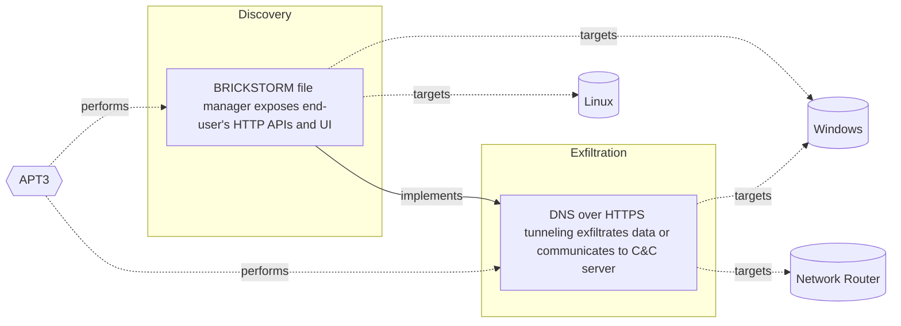

# ☣️ DNS over HTTPS tunneling exfiltrates data or communicates to C&C server

🔥 **Criticality:Medium** ❗ : A Medium priority incident may affect public health or safety, national security, economic security, foreign relations, civil liberties, or public confidence. 

🚦 **TLP:CLEAR** ⚪ : Recipients can spread this to the world, there is no limit on disclosure.

🗡️ **ATT&CK Techniques** [T1572 : Protocol Tunneling](https://attack.mitre.org/techniques/T1572 'Adversaries may tunnel network communications to and from a victim system within a separate protocol to avoid detectionnetwork filtering andor enable '), [T1036 : Masquerading](https://attack.mitre.org/techniques/T1036 'Adversaries may attempt to manipulate features of their artifacts to make them appear legitimate or benign to users andor security tools Masquerading '), [T1041 : Exfiltration Over C2 Channel](https://attack.mitre.org/techniques/T1041 'Adversaries may steal data by exfiltrating it over an existing command and control channel Stolen data is encoded into the normal communications chann'), [T1190 : Exploit Public-Facing Application](https://attack.mitre.org/techniques/T1190 'Adversaries may attempt to exploit a weakness in an Internet-facing host or system to initially access a network The weakness in the system can be a s'), [T1566 : Phishing](https://attack.mitre.org/techniques/T1566 'Adversaries may send phishing messages to gain access to victim systems All forms of phishing are electronically delivered social engineering Phishing')

---

`🔑 UUID : 901dd804-00cc-4034-85aa-3d10e257c16c` **|** `🏷️ Version : 2` **|** `🗓️ Creation Date : 2025-04-22` **|** `🗓️ Last Modification : 2025-05-08` **|** `Sharing Organisation : {'uuid': '56b0a0f0-b0bc-47d9-bb46-02f80ae2065a', 'name': 'EC DIGIT CSOC'}` **|** `🧱 Schema Identifier : tvm::2.1`

## 👁️ Description

> DNS over HTTPS (DoH) tunneling is a technique used by threat actors
> to exfiltrate data or communicate to a Command and Control (C&C)
> server. The data exchange and transfer between the victim and the
> attacker's server can include - data exfiltration (stolen data) as
> confidential documents or files, PIIs, financial data or intellectual
> property. The data flow can be also an administrative traffic like
> covert C&C communication, for example - chat or messaging traffic,
> file (malicious payload) transfers, system control, manipulation
> instructions and other possible signaling or instructions transfer.
> 
> DoH is a protocol that encrypts DNS requests and responses, making
> it more difficult for third parties to intercept and manipulate DNS
> traffic. However, threat actors have found a way to exploit this
> protocol for malicious purposes ref [1].      
> 
> In a DoH tunneling attack, the threat actor uses the DoH protocol
> to encapsulate malicious data, such as stolen credentials, sensitive
> information, or malware, within DNS requests. The encrypted DNS requests
> are then sent to a C&C server, which can be hosted on a compromised domain
> or a domain controlled by the threat actor ref [2].    
> 
> A threat actor can use some of the following initial access techniques
> or methods to perform DNS over HTTPS tunneling:   
> 
> - Compromises a device: Gains access to a victim's device, either through
> phishing, exploiting vulnerabilities, or using malware.
> - Installs malware: Installs malware on the compromised device, which can
> be designed to collect sensitive information, such as login credentials
> or personal data.
> - Configures DoH: Configures the device to use DoH, either by modifying
> the device's DNS settings or by installing a malicious DoH client.
> - Encapsulates data: Encapsulates the stolen data within DNS requests,
> using techniques such as:
> - Data encoding: Encoding the data using techniques like Base64 or
> hexadecimal encoding.
> - Data fragmentation: Breaking the data into smaller fragments and
> sending them across multiple DNS requests.
> - Sends DNS requests: Sends the encrypted DNS requests to the C&C
> server, which can be hosted on a compromised domain or a domain
> controlled by the threat actor.
> - Exfiltrates data: The C&C server receives the DNS requests, extracts
> the encapsulated data, and stores or forwards it to the threat actor.
> 

## 🖥️ Terrain 

 > A threat actor can use DNS over HTTPS tunneling technique
> to hide traffic and activities.
> 

---

## 🕸️ Relations

### 🐲 Actors sightings 

| Actor             | Description                                                                                                                                                                                                                                                                                                                                                                                                                                                                                                                                                                                                              | Aliases                                                                                                   | Source                     | Sighting                                                                                                                                                                                                                       | Reference                                                                                                                      |
|:------------------|:-------------------------------------------------------------------------------------------------------------------------------------------------------------------------------------------------------------------------------------------------------------------------------------------------------------------------------------------------------------------------------------------------------------------------------------------------------------------------------------------------------------------------------------------------------------------------------------------------------------------------|:----------------------------------------------------------------------------------------------------------|:---------------------------|:-------------------------------------------------------------------------------------------------------------------------------------------------------------------------------------------------------------------------------|:-------------------------------------------------------------------------------------------------------------------------------|
| [Enterprise] APT3 | [APT3](https://attack.mitre.org/groups/G0022) is a China-based threat group that researchers have attributed to China's Ministry of State Security.(Citation: FireEye Clandestine Wolf)(Citation: Recorded Future APT3 May 2017) This group is responsible for the campaigns known as Operation Clandestine Fox, Operation Clandestine Wolf, and Operation Double Tap.(Citation: FireEye Clandestine Wolf)(Citation: FireEye Operation Double Tap) As of June 2015, the group appears to have shifted from targeting primarily US victims to primarily political organizations in Hong Kong.(Citation: Symantec Buckeye) | Buckeye, Gothic Panda, Pirpi, TG-0110, Threat Group-0110, UPS Team                                        | 🗡️ MITRE ATT&CK Groups     | No documented sighting                                                                                                                                                                                                         | No documented references                                                                                                       |
| APT3              | Symantec described UPS in  2016 report as: 'Buckeye (also known as APT3, Gothic Panda, UPS Team, and TG-0110) is a cyberespionage group that is believed to have been operating for well over half a decade. Traditionally, the group attacked organizations in the US as well as other targets. However, Buckeyes focus appears to have changed as of June 2015, when the group began compromising political entities in Hong Kong.'                                                                                                                                                                                    | GOTHIC PANDA, TG-0110, Group 6, UPS, Buckeye, Boyusec, BORON, BRONZE MAYFAIR, Red Sylvan, Brocade Typhoon | 🌌 MISP Threat Actor Galaxy | UNC5221, also known as Gothic Panda or BlackBhamasura isa known Chenese affiliated threat actor linked to a stringof cyberattacks targeting various sectors, includingtelecommunications, healthcare, and government agencies. | https://medium.com/@scottbolen/mitre-attunes-spotlight-on-unc5221-decoding-chinas-apt-with-recent-attack-findings-2c3e7781c73b |

### 🌊 OpenTide Objects
🚫 No related OpenTide objects indexed.

 --- 

### ⛓️ Threat Chaining

Expand chaining data

| ☣️ Vector                                                                                                                                                                                                                                                                                                                          | ⛓️ Link                 | 🎯 Target                                                                                                                                                                                                                                                                                                                                                       | ⛰️ Terrain                                                                                | 🗡️ ATT&CK                                                                                                                                                                                                                                                                                                                                                                                                                                                                                                                                                                                                                                                                                                                                                                                                                                                                                                                                                                                                                                                       |
|:-----------------------------------------------------------------------------------------------------------------------------------------------------------------------------------------------------------------------------------------------------------------------------------------------------------------------------------|:------------------------|:---------------------------------------------------------------------------------------------------------------------------------------------------------------------------------------------------------------------------------------------------------------------------------------------------------------------------------------------------------------|:------------------------------------------------------------------------------------------|:----------------------------------------------------------------------------------------------------------------------------------------------------------------------------------------------------------------------------------------------------------------------------------------------------------------------------------------------------------------------------------------------------------------------------------------------------------------------------------------------------------------------------------------------------------------------------------------------------------------------------------------------------------------------------------------------------------------------------------------------------------------------------------------------------------------------------------------------------------------------------------------------------------------------------------------------------------------------------------------------------------------------------------------------------------------|
| [BRICKSTORM file manager exposes end-user's HTTP APIs and UI](../Threat%20Vectors/☣️%20BRICKSTORM%20file%20manager%20exposes%20end-user's%20HTTP%20APIs%20and%20UI.md 'One of the observed China-nexus cluster achieves their goals withthe involvement and the usage of previously unknown vulnerabilitiesaka, zero-days alo...') | `atomicity::implements` | [DNS over HTTPS tunneling exfiltrates data or communicates to C&C server](../Threat%20Vectors/☣️%20DNS%20over%20HTTPS%20tunneling%20exfiltrates%20data%20or%20communicates%20to%20C&C%20server.md 'DNS over HTTPS DoH tunneling is a technique used by threat actorsto exfiltrate data or communicate to a Command and Control C&Cserver The data exchang...') | A threat actor can use DNS over HTTPS tunneling technique to hide traffic and activities. | [T1572](https://attack.mitre.org/techniques/T1572 'Adversaries may tunnel network communications to and from a victim system within a separate protocol to avoid detectionnetwork filtering andor enable '), [T1036](https://attack.mitre.org/techniques/T1036 'Adversaries may attempt to manipulate features of their artifacts to make them appear legitimate or benign to users andor security tools Masquerading '), [T1041](https://attack.mitre.org/techniques/T1041 'Adversaries may steal data by exfiltrating it over an existing command and control channel Stolen data is encoded into the normal communications chann'), [T1190](https://attack.mitre.org/techniques/T1190 'Adversaries may attempt to exploit a weakness in an Internet-facing host or system to initially access a network The weakness in the system can be a s'), [T1566](https://attack.mitre.org/techniques/T1566 'Adversaries may send phishing messages to gain access to victim systems All forms of phishing are electronically delivered social engineering Phishing') |

&nbsp; 

---

## Model Data

#### **⛓️ Cyber Kill Chain**

 > Cyber attacks are typically phased progressions towards strategic objectives. The Unified Kill Chains provides insight into the tactics that hackers employ to attain these objectives. This provides a solid basis to develop (or realign) defensive strategies to raise cyber resilience.

 [`📨 Exfiltration`](https://www.unifiedkillchain.com/assets/The-Unified-Kill-Chain.pdf) : Techniques that result or aid in an attacker removing data from a target network.

---

#### **🛰️ Domains**

 > Infrastructure technologies domain of interest to attackers.

 `🏢 Enterprise` : Generic databases, applications, machines and systems that are usually on premises or on Cloud traditional VMs.

---

#### **🎯 Targets**

 > Granular delimited technical entities holding a value to the organization, that are targeted by adversaries. They might be also involved in the detection coverage as the target of log collection. Partially inspired by Veris.

  - [`🖲️ Control Server`](https://collaborate.mitre.org/attackics/index.php/Control_Server) : A device which acts as both a server and controller, that hosts the control software used in communicating with lower-level control devices in an ICS network (e.g. Remote Terminal Units (RTUs) and Programmable Logic Controllers (PLCs)).
 - [`👤 Customer`](http://veriscommunity.net/enums.html#section-asset) : People - Customer
 - [`🖥️ Public-Facing Servers`](http://veriscommunity.net/enums.html#section-asset) : Placeholder

---

#### **💿 Platforms concerned**

 > Actual technologies used by the organization that will be exploited by adversaries during a successful attack, and eventually of relevance for detection. Are named by commercial designation.

  - ` Windows` : Placeholder
 - ` Network Router` : Placeholder

---

#### **💣 Severity**

 > The severity summarizes the overall danger of incident the vector will provoke, and is to be derived (WIP) from impact, leverage, and difficulty to execute.

 [`⚠️ Significant incident`](https://www.ncsc.gov.uk/news/new-cyber-attack-categorisation-system-improve-uk-response-incidents) : A cyber attack which has a serious impact on a large organisation or on wider / local government, or which poses a considerable risk to central government or (inter)national essential services.

---

#### **🪄 Leverage acquisition**

 > Technical aftermath of the attack from the target perspective, differentiated from impact as it does not consider the value of the consequence, only what increased control the vector execution provides to the adversary.

  - [`🦠 Dwelling`](https://owasp.org/www-community/Threat_Modeling_Process#stride) : Active or passive extended presence in the target, which performs adversarial operations continuously.
 - [`💀 Infrastructure Compromise`](https://owasp.org/www-community/Threat_Modeling_Process#stride) : The compromised target is likely to be used to further expand the sphere of influence of the attacker and allow more potent vectors to be executed.
 - [`🐒 Tampering`](https://owasp.org/www-community/Threat_Modeling_Process#stride) : Threat action intending to maliciously change or modify persistent data, such as records in a database, and the alteration of data in transit between two computers over an open network, such as the Internet.

---

#### **💥 Impact**

 > Analysis of the threat vector from the organizational perspective, in non technical term. This aims at putting a clear denomination on what the attacker will actually be able to act upon if the threat vector is realized.

  - [`🩼 Impairement`](http://veriscommunity.net/enums.html#section-impact) : Incapacitation of a particular key system that will cause disruptions in day-to-day operations, and eventually service delivery.
 - [`🥸 Identity Theft`](http://veriscommunity.net/enums.html#section-impact) : Acquisition of sufficient information and privileges to profess as a given individual, for the purpose of abusing and deceiving human trust relationships.
 - [`🔓 Data Breach`](http://veriscommunity.net/enums.html#section-impact) : Non-public information has been accessed from the outside, and successfully extracted.
 - [`💲 Operating costs`](http://veriscommunity.net/enums.html#section-impact) : Increased operating costs
 - [`🌍 Reputational Damages`](http://veriscommunity.net/enums.html#section-impact) : Damages to the organization public view may be achieved by using directly the access gained, or indirectly with data gathered.

---

#### **🎲 Vector Viability**

 > Described with estimative language (likelyhood probability), describes how likely the analyst believes the vector to actually be realized on the organization infrastructure. Estimative language describes quality and credibility of underlying sources, data, and methodologies based Intelligence Community Directive 203 (ICD 203) and JP 2-0, Joint Intelligence.

 [`🧐 Likely`](https://www.dni.gov/files/documents/ICD/ICD%20203%20Analytic%20Standards.pdf) : Probable (probably) - 55-80%

---

### 🔗 References

**🕊️ Publicly available resources**

- [_1_] https://www.approach-cyber.com/blog-article/doh-cybersecurity-risk-in-enterprise/
- [_2_] https://quointelligence.eu/2021/02/dns-over-https-doh
- [_3_] https://medium.com/@0xHossam/evading-detection-and-stealthy-data-exfiltration-with-dns-over-https-doh-ee134b5766d4
- [_4_] https://medium.com/@scottbolen/mitre-attunes-spotlight-on-unc5221-decoding-chinas-apt-with-recent-attack-findings-2c3e7781c73b
- [_5_] https://www.zdnet.com/article/dns-over-https-causes-more-problems-than-it-solves-experts-say
- [_6_] https://www.csoonline.com/article/570867/understanding-doh-challenges-a-necessary-step-in-improving-network-privacy-and-security.html

[1]: https://www.approach-cyber.com/blog-article/doh-cybersecurity-risk-in-enterprise/
[2]: https://quointelligence.eu/2021/02/dns-over-https-doh
[3]: https://medium.com/@0xHossam/evading-detection-and-stealthy-data-exfiltration-with-dns-over-https-doh-ee134b5766d4
[4]: https://medium.com/@scottbolen/mitre-attunes-spotlight-on-unc5221-decoding-chinas-apt-with-recent-attack-findings-2c3e7781c73b
[5]: https://www.zdnet.com/article/dns-over-https-causes-more-problems-than-it-solves-experts-say
[6]: https://www.csoonline.com/article/570867/understanding-doh-challenges-a-necessary-step-in-improving-network-privacy-and-security.html

---

#### 🏷️ Tags

#-, #-, #-, #
, #
, ##, ##, ##, ##, # , #🏷, #️, # , #T, #a, #g, #s, #
, #

