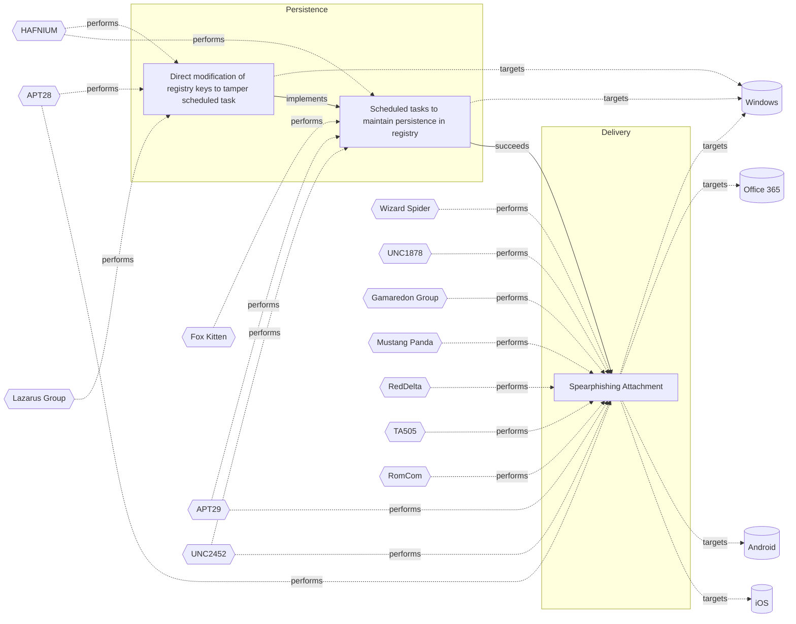

# ☣️ Direct modification of registry keys to tamper scheduled task

🔥 **Criticality:Medium** ❗ : A Medium priority incident may affect public health or safety, national security, economic security, foreign relations, civil liberties, or public confidence. 

🚦 **TLP:CLEAR** ⚪ : Recipients can spread this to the world, there is no limit on disclosure.


🗡️ **ATT&CK Techniques** [T1112 : Modify Registry](https://attack.mitre.org/techniques/T1112 'Adversaries may interact with the Windows Registry as part of a variety of other techniques to aid in defense evasion, persistence, and executionAcces'), [T1543 : Create or Modify System Process](https://attack.mitre.org/techniques/T1543 'Adversaries may create or modify system-level processes to repeatedly execute malicious payloads as part of persistence When operating systems boot up'), [T1543.003 : Create or Modify System Process: Windows Service](https://attack.mitre.org/techniques/T1543/003 'Adversaries may create or modify Windows services to repeatedly execute malicious payloads as part of persistence When Windows boots up, it starts pro'), [T1053.005 : Scheduled Task/Job: Scheduled Task](https://attack.mitre.org/techniques/T1053/005 'Adversaries may abuse the Windows Task Scheduler to perform task scheduling for initial or recurring execution of malicious code There are multiple wa')


---

`🔑 UUID : efe13bd7-c621-423b-b226-9b536766a252` **|** `🏷️ Version : 1` **|** `🗓️ Creation Date : 2025-05-22` **|** `🗓️ Last Modification : 2025-06-02` **|** `Sharing Organisation : {'uuid': '56b0a0f0-b0bc-47d9-bb46-02f80ae2065a', 'name': 'EC DIGIT CSOC'}` **|** `🧱 Schema Identifier : tvm::2.1`


## 👁️ Description

> Direct modification of registry keys to tamper with scheduled tasks
> involves altering the Windows Registry to manipulate or disable scheduled
> tasks. 
> 
> Scheduled tasks are stored in the Windows Registry, and modifying these
> registry keys can allow an attacker to:
> 
> - Disable or modify existing tasks: by changing the registry keys
> associated with a scheduled task, an attacker can prevent the task from
> running or alter its behavior.
> - Create new malicious tasks: An attacker can add new registry keys
> to create a malicious scheduled task that runs without the user's
> knowledge.
> - Elevate privileges: modifying registry keys can allow an attacker
> to escalate privileges, enabling them to execute tasks with higher
> privileges.
> 
> The registry keys which involved in scheduled tasks could be:
> 
> ```
> HKEY_LOCAL_MACHINE\SOFTWARE\Microsoft\Windows NT\CurrentVersion\Schedule\TaskCache
> 
> ```
> This key contains subkeys for each scheduled task, including:
> 
> - Tasks: Stores information about each task, such as the task name,
> description, and execution settings.
> - Boot: Stores information about tasks that run at boot time.
> - Logon: Stores information about tasks that run at logon time.
> 
> ### Modifying registry keys to tamper with scheduled tasks
> 
> To modify registry keys and tamper with scheduled tasks, an attacker
> would typically follow these steps:
> 
>   - Access the Registry Editor: The attacker would need to access the
>   Windows Registry Editor (Regedit.exe) with administrative privileges.
>   - Navigate to the scheduled task registry key. 
>   The attacker would navigate to the registry key:
>   `HKEY_LOCAL_MACHINE\SOFTWARE\Microsoft\Windows NT\CurrentVersion\Schedule\TaskCache key`.
>   - Identify the target task: The attacker would identify the subkey
>   associated with the scheduled task they want to modify or disable.
>   - Modify the registry key: The attacker would modify the registry
>   key to change the task's behavior, such as changing the execution
>   settings or disabling the task.  
> 
> ### Examples of registry key modifications
> 
> Some examples of registry key modifications that can tamper
> with scheduled tasks include:
> 
> - Disabling a task: Setting the Enabled value to 0 in the task's subkey.
> - Changing the task's execution settings: Modifying the Actions or Triggers
> values in the task's subkey.
> - Creating a new malicious task: Adding a new subkey with malicious
> settings, such as executing a malicious executable.  
> 


## 🖥️ Terrain 

 > A threat actor needs an Admin Windows System level to a target
> endpoint in order to perform direct modification of the registries.
> 

---

## 🕸️ Relations


### 🐲 Actors sightings 

| Actor                | Description                                                                                                                                                                                                                                                                                                                                                                                                                                                                                                                                                                                                                                                                                                                                                                                                                                                                                                                                                                                                                                                                                                                                                                                                                                                                                                                                                                                                                                                                                                                                                                                                                                                                                                                                          | Aliases                                                                                                                                                                                                                                                                                                                                                                                                                                                                                                                                                | Source                     | Sighting                                                                                                                                                                                                                                                                                                                                            | Reference                                                                                                                                                          |
|:---------------------|:-----------------------------------------------------------------------------------------------------------------------------------------------------------------------------------------------------------------------------------------------------------------------------------------------------------------------------------------------------------------------------------------------------------------------------------------------------------------------------------------------------------------------------------------------------------------------------------------------------------------------------------------------------------------------------------------------------------------------------------------------------------------------------------------------------------------------------------------------------------------------------------------------------------------------------------------------------------------------------------------------------------------------------------------------------------------------------------------------------------------------------------------------------------------------------------------------------------------------------------------------------------------------------------------------------------------------------------------------------------------------------------------------------------------------------------------------------------------------------------------------------------------------------------------------------------------------------------------------------------------------------------------------------------------------------------------------------------------------------------------------------|:-------------------------------------------------------------------------------------------------------------------------------------------------------------------------------------------------------------------------------------------------------------------------------------------------------------------------------------------------------------------------------------------------------------------------------------------------------------------------------------------------------------------------------------------------------|:---------------------------|:----------------------------------------------------------------------------------------------------------------------------------------------------------------------------------------------------------------------------------------------------------------------------------------------------------------------------------------------------|:-------------------------------------------------------------------------------------------------------------------------------------------------------------------|
| [Enterprise] HAFNIUM | [HAFNIUM](https://attack.mitre.org/groups/G0125) is a likely state-sponsored cyber espionage group operating out of China that has been active since at least January 2021. [HAFNIUM](https://attack.mitre.org/groups/G0125) primarily targets entities in the US across a number of industry sectors, including infectious disease researchers, law firms, higher education institutions, defense contractors, policy think tanks, and NGOs. [HAFNIUM](https://attack.mitre.org/groups/G0125) has targeted remote management tools and cloud software for intial access and has demonstrated an ability to quickly operationalize exploits for identified vulnerabilities in edge devices.(Citation: Microsoft HAFNIUM March 2020)(Citation: Volexity Exchange Marauder March 2021)(Citation: Microsoft Silk Typhoon MAR 2025)                                                                                                                                                                                                                                                                                                                                                                                                                                                                                                                                                                                                                                                                                                                                                                                                                                                                                                                      | Operation Exchange Marauder, Silk Typhoon                                                                                                                                                                                                                                                                                                                                                                                                                                                                                                              | 🗡️ MITRE ATT&CK Groups     | No documented sighting                                                                                                                                                                                                                                                                                                                              | No documented references                                                                                                                                           |
| HAFNIUM              | HAFNIUM primarily targets entities in the United States across a number of industry sectors, including infectious disease researchers, law firms, higher education institutions, defense contractors, policy think tanks, and NGOs. Microsoft Threat Intelligence Center (MSTIC) attributes this campaign with high confidence to HAFNIUM, a group assessed to be state-sponsored and operating out of China, based on observed victimology, tactics and procedures. HAFNIUM has previously compromised victims by exploiting vulnerabilities in internet-facing servers, and has used legitimate open-source frameworks, like Covenant, for command and control. Once they’ve gained access to a victim network, HAFNIUM typically exfiltrates data to file sharing sites like MEGA.In campaigns unrelated to these vulnerabilities, Microsoft has observed HAFNIUM interacting with victim Office 365 tenants. While they are often unsuccessful in compromising customer accounts, this reconnaissance activity helps the adversary identify more details about their targets’ environments. HAFNIUM operates primarily from leased virtual private servers (VPS) in the United States.                                                                                                                                                                                                                                                                                                                                                                                                                                                                                                                                                           | ATK233, G0125, Operation Exchange Marauder, Red Dev 13, Silk Typhoon, MURKY PANDA                                                                                                                                                                                                                                                                                                                                                                                                                                                                      | 🌌 MISP Threat Actor Galaxy | The HAFNIUM threat actor is using a method to tamper scheduledtasks in order to establish persistence via modification ofregistry keys in their malware called `Tarrask`. The benefitof using registry keys is that enables the threat actor tocreate stealthy scheduled tasks for persistence by avoidingto utilize traditional execution methods. | https://ipurple.team/2024/01/03/scheduled-task-tampering                                                                                                           |
| [Mobile] APT28       | [APT28](https://attack.mitre.org/groups/G0007) is a threat group that has been attributed to Russia's General Staff Main Intelligence Directorate (GRU) 85th Main Special Service Center (GTsSS) military unit 26165.(Citation: NSA/FBI Drovorub August 2020)(Citation: Cybersecurity Advisory GRU Brute Force Campaign July 2021) This group has been active since at least 2004.(Citation: DOJ GRU Indictment Jul 2018)(Citation: Ars Technica GRU indictment Jul 2018)(Citation: Crowdstrike DNC June 2016)(Citation: FireEye APT28)(Citation: SecureWorks TG-4127)(Citation: FireEye APT28 January 2017)(Citation: GRIZZLY STEPPE JAR)(Citation: Sofacy DealersChoice)(Citation: Palo Alto Sofacy 06-2018)(Citation: Symantec APT28 Oct 2018)(Citation: ESET Zebrocy May 2019)[APT28](https://attack.mitre.org/groups/G0007) reportedly compromised the Hillary Clinton campaign, the Democratic National Committee, and the Democratic Congressional Campaign Committee in 2016 in an attempt to interfere with the U.S. presidential election.(Citation: Crowdstrike DNC June 2016) In 2018, the US indicted five GRU Unit 26165 officers associated with [APT28](https://attack.mitre.org/groups/G0007) for cyber operations (including close-access operations) conducted between 2014 and 2018 against the World Anti-Doping Agency (WADA), the US Anti-Doping Agency, a US nuclear facility, the Organization for the Prohibition of Chemical Weapons (OPCW), the Spiez Swiss Chemicals Laboratory, and other organizations.(Citation: US District Court Indictment GRU Oct 2018) Some of these were conducted with the assistance of GRU Unit 74455, which is also referred to as [Sandworm Team](https://attack.mitre.org/groups/G0034). | FROZENLAKE, Fancy Bear, Forest Blizzard, Group 74, GruesomeLarch, IRON TWILIGHT, Pawn Storm, SNAKEMACKEREL, STRONTIUM, Sednit, Sofacy, Swallowtail, TG-4127, Threat Group-4127, Tsar Team                                                                                                                                                                                                                                                                                                                                                              | 🗡️ MITRE ATT&CK Groups     | No documented sighting                                                                                                                                                                                                                                                                                                                              | No documented references                                                                                                                                           |
| APT28                | The Sofacy Group (also known as APT28, Pawn Storm, Fancy Bear and Sednit) is a cyber espionage group believed to have ties to the Russian government. Likely operating since 2007, the group is known to target government, military, and security organizations. It has been characterized as an advanced persistent threat.                                                                                                                                                                                                                                                                                                                                                                                                                                                                                                                                                                                                                                                                                                                                                                                                                                                                                                                                                                                                                                                                                                                                                                                                                                                                                                                                                                                                                        | Pawn Storm, FANCY BEAR, Sednit, SNAKEMACKEREL, Tsar Team, TG-4127, STRONTIUM, Swallowtail, IRON TWILIGHT, Group 74, SIG40, Grizzly Steppe, G0007, ATK5, Fighting Ursa, ITG05, Blue Athena, TA422, T-APT-12, APT-C-20, UAC-0028, FROZENLAKE, Sofacy, Forest Blizzard, BlueDelta, Fancy Bear, GruesomeLarch                                                                                                                                                                                                                                              | 🌌 MISP Threat Actor Galaxy | APT28 threat actor Russian affiliated group is observed tocreate a schedule task named “Settings\ServiceDispatch” byusing `RegisterTaskDefinition`. This activity is a modificationin the Windows registry which leads to a change of behavior ofa particular scheduled task (in this case a creation of a new task).                               | https://blog.sekoia.io/double-tap-campaign-russia-nexus-apt-possibly-related-to-apt28-conducts-cyber-espionage-on-central-asia-and-kazakhstan-diplomatic-relations |
| [ICS] Lazarus Group  | [Lazarus Group](https://attack.mitre.org/groups/G0032) is a North Korean state-sponsored cyber threat group that has been attributed to the Reconnaissance General Bureau.(Citation: US-CERT HIDDEN COBRA June 2017)(Citation: Treasury North Korean Cyber Groups September 2019) The group has been active since at least 2009 and was reportedly responsible for the November 2014 destructive wiper attack against Sony Pictures Entertainment as part of a campaign named Operation Blockbuster by Novetta. Malware used by [Lazarus Group](https://attack.mitre.org/groups/G0032) correlates to other reported campaigns, including Operation Flame, Operation 1Mission, Operation Troy, DarkSeoul, and Ten Days of Rain.(Citation: Novetta Blockbuster)North Korean group definitions are known to have significant overlap, and some security researchers report all North Korean state-sponsored cyber activity under the name [Lazarus Group](https://attack.mitre.org/groups/G0032) instead of tracking clusters or subgroups, such as [Andariel](https://attack.mitre.org/groups/G0138), [APT37](https://attack.mitre.org/groups/G0067), [APT38](https://attack.mitre.org/groups/G0082), and [Kimsuky](https://attack.mitre.org/groups/G0094).                                                                                                                                                                                                                                                                                                                                                                                                                                                                                            | Diamond Sleet, Guardians of Peace, HIDDEN COBRA, Labyrinth Chollima, NICKEL ACADEMY, ZINC                                                                                                                                                                                                                                                                                                                                                                                                                                                              | 🗡️ MITRE ATT&CK Groups     | No documented sighting                                                                                                                                                                                                                                                                                                                              | No documented references                                                                                                                                           |
| Lazarus Group        | Since 2009, HIDDEN COBRA actors have leveraged their capabilities to target and compromise a range of victims; some intrusions have resulted in the exfiltration of data while others have been disruptive in nature. Commercial reporting has referred to this activity as Lazarus Group and Guardians of Peace. Tools and capabilities used by HIDDEN COBRA actors include DDoS botnets, keyloggers, remote access tools (RATs), and wiper malware. Variants of malware and tools used by HIDDEN COBRA actors include Destover, Duuzer, and Hangman.                                                                                                                                                                                                                                                                                                                                                                                                                                                                                                                                                                                                                                                                                                                                                                                                                                                                                                                                                                                                                                                                                                                                                                                               | Operation DarkSeoul, Dark Seoul, Hidden Cobra, Hastati Group, Andariel, Unit 121, Bureau 121, NewRomanic Cyber Army Team, Bluenoroff, Subgroup: Bluenoroff, Group 77, Labyrinth Chollima, Operation Troy, Operation GhostSecret, Operation AppleJeus, APT38, APT 38, Stardust Chollima, Whois Hacking Team, Zinc, Appleworm, Nickel Academy, APT-C-26, NICKEL GLADSTONE, COVELLITE, ATK3, G0032, ATK117, G0082, Citrine Sleet, DEV-0139, DEV-1222, Diamond Sleet, ZINC, Sapphire Sleet, COPERNICIUM, TA404, Lazarus group, BeagleBoyz, Moonstone Sleet | 🌌 MISP Threat Actor Galaxy | Lazarus group use a technique `Registry modification`to ensure their malware persist even after a system reboot.For example, a scheduled task creation can be considered asan anomalous behavior as `Reg.exe` is rarely executed bythe scheduled task utility.                                                                                      | https://thesecmaster.com/blog/lazarus-group, https://labs.withsecure.com/publications/catching-lazarus-threat-intelligence-to-real-detection-logic-part-two        |

### 🌊 OpenTide Objects
🚫 No related OpenTide objects indexed.


 --- 

### ⛓️ Threat Chaining




<details>
<summary>Expand chaining data</summary>

| ☣️ Vector                                                                                                                                                                                                                                                                                                                              | ⛓️ Link                 | 🎯 Target                                                                                                                                                                                                                                                                                                       | ⛰️ Terrain                                                                                                                                                                                                                                                                                                                                                                                                                                                                                                                                                                                                                                                                                                                                                                                                                                                | 🗡️ ATT&CK                                                                                                                                                                                                                                                                                                                                                                                                                                                                               |
|:---------------------------------------------------------------------------------------------------------------------------------------------------------------------------------------------------------------------------------------------------------------------------------------------------------------------------------------|:------------------------|:---------------------------------------------------------------------------------------------------------------------------------------------------------------------------------------------------------------------------------------------------------------------------------------------------------------|:----------------------------------------------------------------------------------------------------------------------------------------------------------------------------------------------------------------------------------------------------------------------------------------------------------------------------------------------------------------------------------------------------------------------------------------------------------------------------------------------------------------------------------------------------------------------------------------------------------------------------------------------------------------------------------------------------------------------------------------------------------------------------------------------------------------------------------------------------------|:----------------------------------------------------------------------------------------------------------------------------------------------------------------------------------------------------------------------------------------------------------------------------------------------------------------------------------------------------------------------------------------------------------------------------------------------------------------------------------------|
| [Direct modification of registry keys to tamper scheduled task](../Threat%20Vectors/☣️%20Direct%20modification%20of%20registry%20keys%20to%20tamper%20scheduled%20task.md 'Direct modification of registry keys to tamper with scheduled tasksinvolves altering the Windows Registry to manipulate or disable scheduledtasks Sche...') | `atomicity::implements` | [Scheduled tasks to maintain persistence in registry](../Threat%20Vectors/☣️%20Scheduled%20tasks%20to%20maintain%20persistence%20in%20registry.md 'A threat actor can successfully maintain persistence on a compromised system by using scheduled tasks to create or edit registry entriesWindows Schedu...') | An adversary has gained control over a Windows endpoint and has privileges  to create scheduled tasks in order to maintain persistence in the registry.                                                                                                                                                                                                                                                                                                                                                                                                                                                                                                                                                                                                                                                                                                   | [T1053.005 : Scheduled Task/Job: Scheduled Task](https://attack.mitre.org/techniques/T1053/005 'Adversaries may abuse the Windows Task Scheduler to perform task scheduling for initial or recurring execution of malicious code There are multiple wa'), [T1112 : Modify Registry](https://attack.mitre.org/techniques/T1112 'Adversaries may interact with the Windows Registry as part of a variety of other techniques to aid in defense evasion, persistence, and executionAcces') |
| [Scheduled tasks to maintain persistence in registry](../Threat%20Vectors/☣️%20Scheduled%20tasks%20to%20maintain%20persistence%20in%20registry.md 'A threat actor can successfully maintain persistence on a compromised system by using scheduled tasks to create or edit registry entriesWindows Schedu...')                         | `sequence::succeeds`    | [Spearphishing Attachment](../Threat%20Vectors/☣️%20Spearphishing%20Attachment.md 'Spearphishing messages are often crafted using pernicious social engineeringtechniquesIn Spearphishing Attachment attacks, recipients receive emails t...')                                                                 | Spear phishing requires more preparation and time to achieve success  than a phishing attack. That is because spear-phishing attackers attempt to obtain vast amounts of personal information about their victims.   Attackers can get the personal information they need using different ways:   - to compromise an email or messaging system trough other means, - to use OSINT, sourcing Social Media or glean personal information from the user's online presence. They want to craft emails that look as legitimate and attractive as possible  to increase the chances of fooling their targets, for instance sending a malicious  attachment where the filename references a topic the recipient is interested in. The highly personalized nature of spear-phishing attacks makes it more  difficult to identity than widescale phishing attacks. | [T1566.001 : Phishing: Spearphishing Attachment](https://attack.mitre.org/techniques/T1566/001 'Adversaries may send spearphishing emails with a malicious attachment in an attempt to gain access to victim systems Spearphishing attachment is a spe')                                                                                                                                                                                                                                |

</details>
&nbsp; 


---

## Model Data

#### **⛓️ Cyber Kill Chain**

 > Cyber attacks are typically phased progressions towards strategic objectives. The Unified Kill Chains provides insight into the tactics that hackers employ to attain these objectives. This provides a solid basis to develop (or realign) defensive strategies to raise cyber resilience.

 [`🔐 Persistence`](https://www.unifiedkillchain.com/assets/The-Unified-Kill-Chain.pdf) : Any access, action or change to a system that gives an attacker persistent presence on the system.

---

#### **🛰️ Domains**

 > Infrastructure technologies domain of interest to attackers.

  - `🏢 Enterprise` : Generic databases, applications, machines and systems that are usually on premises or on Cloud traditional VMs.
 - `☁️ Private Cloud` : Infrastructure hosted at a third party, but based on custom specification and managed on a platform level.
 - `☁️ Public Cloud` : Infrastructure handled by a commercial cloud provider. Managed mostly on a service level, and connected over the internet.

---

#### **🎯 Targets**

 > Granular delimited technical entities holding a value to the organization, that are targeted by adversaries. They might be also involved in the detection coverage as the target of log collection. Partially inspired by Veris.

  - [`👤 End-user`](http://veriscommunity.net/enums.html#section-asset) : People - End-user
 - [`🖥️ Workstations`](http://veriscommunity.net/enums.html#section-asset) : Placeholder
 - [` Other`](http://veriscommunity.net/enums.html#section-asset) : Media - Other/Unknown

---

#### **💿 Platforms concerned**

 > Actual technologies used by the organization that will be exploited by adversaries during a successful attack, and eventually of relevance for detection. Are named by commercial designation.

 ` Windows` : Placeholder

---

#### **💣 Severity**

 > The severity summarizes the overall danger of incident the vector will provoke, and is to be derived (WIP) from impact, leverage, and difficulty to execute.

 [`🧨 Moderate incident`](https://www.ncsc.gov.uk/news/new-cyber-attack-categorisation-system-improve-uk-response-incidents) : A cyber attack on a small organisation, or which poses a considerable risk to a medium-sized organisation, or preliminary indications of cyber activity against a large organisation or the government.

---

#### **🪄 Leverage acquisition**

 > Technical aftermath of the attack from the target perspective, differentiated from impact as it does not consider the value of the consequence, only what increased control the vector execution provides to the adversary.

  - [`💀 Infrastructure Compromise`](https://owasp.org/www-community/Threat_Modeling_Process#stride) : The compromised target is likely to be used to further expand the sphere of influence of the attacker and allow more potent vectors to be executed.
 - [`🐒 Tampering`](https://owasp.org/www-community/Threat_Modeling_Process#stride) : Threat action intending to maliciously change or modify persistent data, such as records in a database, and the alteration of data in transit between two computers over an open network, such as the Internet.
 - [`⚙️ Modify configuration`](https://owasp.org/www-community/Threat_Modeling_Process#stride) : Modify configuration or services

---

#### **💥 Impact**

 > Analysis of the threat vector from the organizational perspective, in non technical term. This aims at putting a clear denomination on what the attacker will actually be able to act upon if the threat vector is realized.

  - [`🛑 Business disruption`](http://veriscommunity.net/enums.html#section-impact) : Business disruption
 - [`🩼 Impairement`](http://veriscommunity.net/enums.html#section-impact) : Incapacitation of a particular key system that will cause disruptions in day-to-day operations, and eventually service delivery.
 - [`🤬 Lose Capabilities`](http://veriscommunity.net/enums.html#section-impact) : Vector execution will remove key functions to the organization, which will not be easily circumvented. Most day-to-day is heavily impaired, but processes can reorganize at a loss.
 - [`💲 Operating costs`](http://veriscommunity.net/enums.html#section-impact) : Increased operating costs

---

#### **🎲 Vector Viability**

 > Described with estimative language (likelyhood probability), describes how likely the analyst believes the vector to actually be realized on the organization infrastructure. Estimative language describes quality and credibility of underlying sources, data, and methodologies based Intelligence Community Directive 203 (ICD 203) and JP 2-0, Joint Intelligence.

 [`🧐 Likely`](https://www.dni.gov/files/documents/ICD/ICD%20203%20Analytic%20Standards.pdf) : Probable (probably) - 55-80%

---


### 🔗 References


**🕊️ Publicly available resources**

- [_1_] https://cybersecuritynews.com/hackers-modifying-registry-keys
- [_2_] https://ipurple.team/2024/01/03/scheduled-task-tampering
- [_3_] https://cyberbuff.github.io/TheAtomicPlaybook/tactics/execution/T1053.005.html
- [_4_] https://github.com/netero1010/GhostTask

[1]: https://cybersecuritynews.com/hackers-modifying-registry-keys
[2]: https://ipurple.team/2024/01/03/scheduled-task-tampering
[3]: https://cyberbuff.github.io/TheAtomicPlaybook/tactics/execution/T1053.005.html
[4]: https://github.com/netero1010/GhostTask

---

#### 🏷️ Tags

#-, #-, #-, #
, #
, ##, ##, ##, ##, # , #🏷, #️, # , #T, #a, #g, #s, #
, #


