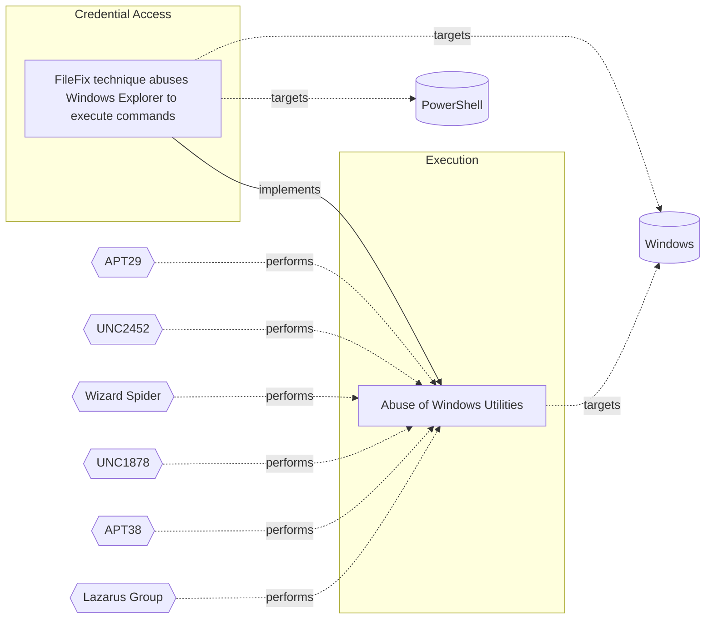

# ☣️ FileFix technique abuses Windows Explorer to execute commands

🔥 **Criticality:Medium** ❗ : A Medium priority incident may affect public health or safety, national security, economic security, foreign relations, civil liberties, or public confidence. 

🚦 **TLP:CLEAR** ⚪ : Recipients can spread this to the world, there is no limit on disclosure.

🗡️ **ATT&CK Techniques** [T1555.003 : Credentials from Password Stores: Credentials from Web Browsers](https://attack.mitre.org/techniques/T1555/003 'Adversaries may acquire credentials from web browsers by reading files specific to the target browserCitation Talos Olympic Destroyer 2018 Web browser'), [T1204.004 : User Execution: Malicious Copy and Paste](https://attack.mitre.org/techniques/T1204/004 'An adversary may rely upon a user copying and pasting code in order to gain execution Users may be subjected to social engineering to get them to copy')

---

`🔑 UUID : 59d2eb7f-63cd-4ac4-9608-e65663fea667` **|** `🏷️ Version : 1` **|** `🗓️ Creation Date : 2025-09-24` **|** `🗓️ Last Modification : 2025-09-25` **|** `Sharing Organisation : {'uuid': '56b0a0f0-b0bc-47d9-bb46-02f80ae2065a', 'name': 'EC DIGIT CSOC'}` **|** `🧱 Schema Identifier : tvm::2.1`

## 👁️ Description

> The `FileFix` technique is a new social engineering method similar to
> `ClickFix` attack. `FileFix` is used by the threat actors to abuse Windows
> Explorer and execute malicious commands on a compromised system. This
> technique takes advantage of the Windows Explorer feature that allows users
> to specify a custom executable to open a file with. The goal of this
> technique is to harvest user's credentials. Threat actor can execute
> commands through the user's Windows Explorer and deploy further a loader
> which drops infostealer, harvesting browsers, wallets and cloud credentials
> ref [1],[2].
> 
> Unlike `ClickFix`, which tricks users into running malicious commands via
> the Windows Run dialog, `FileFix` takes a subtler approach: A malicious
> webpage will open a legitimate File Explorer window while covertly copying
> a disguised PowerShell one-liner into the clipboard. The user is then asked
> to paste into the Explorer address bar (or otherwise paste into a UI), and
> the pasted content runs in the user context, often invoking PowerShell to
> download and execute follow-on payloads ref [1].  
> 
> ### How FileFix Works
> 
> - User Interaction: The attack typically begins when a user is lured to a
>   compromised website that prompts them to perform actions that seem benign, 
>   such as opening File Explorer to access a shared document.
> - Clipboard Manipulation: The website uses JavaScript to copy a malicious
>   PowerShell command to the clipboard while simultaneously opening a File
>   Explorer window.
> - Execution: The user is instructed to paste the clipboard content into the
>   File Explorer address bar, which leads to the execution of the malicious
>   command.
> 
> To the victims, this process appears to be a simple task of opening a shared
> file or folder, making it feel routine and safe. This subtle manipulation
> makes `FileFix` a more stealthy and potentially more dangerous evolution of
> the `ClickFix` social engineering attack. 
> 

## 🖥️ Terrain 

 > The attack requires Windows hosts with interactive users who have the
> ability to open File Explorer or paste into the Explorer address bar.
> The browser must allow JavaScript to run (standard), and the victim must
> be able to interactively paste content from the clipboard into the Explorer
> address bar or other UI (e.g., Run dialog).  
> 

---

## 🕸️ Relations

### 🌊 OpenTide Objects
🚫 No related OpenTide objects indexed.

 --- 

### ⛓️ Threat Chaining

Expand chaining data

| ☣️ Vector                                                                                                                                                                                                                                                                                                                            | ⛓️ Link                 | 🎯 Target                                                                                                                                                                                                                                               | ⛰️ Terrain                                                                                                                                                                                          | 🗡️ ATT&CK                                                                                                                                                                                                                                                                                                                                                                                                                                                                                                                                                                                                                                                                                                                                                                                                                                                                                                                                                                                                                                                                                                                                                                                                                                                                                                                                                                                                                                                                                                         |
|:-------------------------------------------------------------------------------------------------------------------------------------------------------------------------------------------------------------------------------------------------------------------------------------------------------------------------------------|:------------------------|:-------------------------------------------------------------------------------------------------------------------------------------------------------------------------------------------------------------------------------------------------------|:----------------------------------------------------------------------------------------------------------------------------------------------------------------------------------------------------|:------------------------------------------------------------------------------------------------------------------------------------------------------------------------------------------------------------------------------------------------------------------------------------------------------------------------------------------------------------------------------------------------------------------------------------------------------------------------------------------------------------------------------------------------------------------------------------------------------------------------------------------------------------------------------------------------------------------------------------------------------------------------------------------------------------------------------------------------------------------------------------------------------------------------------------------------------------------------------------------------------------------------------------------------------------------------------------------------------------------------------------------------------------------------------------------------------------------------------------------------------------------------------------------------------------------------------------------------------------------------------------------------------------------------------------------------------------------------------------------------------------------|
| [FileFix technique abuses Windows Explorer to execute commands](../Threat%20Vectors/☣️%20FileFix%20technique%20abuses%20Windows%20Explorer%20to%20execute%20commands.md 'The FileFix technique is a new social engineering method similar toClickFix attack FileFix is used by the threat actors to abuse WindowsExplorer and e...') | `atomicity::implements` | [Abuse of Windows Utilities](../Threat%20Vectors/☣️%20Abuse%20of%20Windows%20Utilities.md 'Advanced threat actors frequently abuse legitimate Windows utilities to execute malicious code, evade detection, and maintain persistence This techniq...') | Adversaries must have access to a Windows environment where they can execute  built-in utilities. Limited user privileges may suffice,  but administrative privileges enhance the potential impact. | [T1218](https://attack.mitre.org/techniques/T1218 'Adversaries may bypass process andor signature-based defenses by proxying execution of malicious content with signed, or otherwise trusted, binaries B'), [T1197](https://attack.mitre.org/techniques/T1197 'Adversaries may abuse BITS jobs to persistently execute code and perform various background tasks Windows Background Intelligent Transfer Service BITS'), [T1218.004](https://attack.mitre.org/techniques/T1218/004 'Adversaries may use InstallUtil to proxy execution of code through a trusted Windows utility InstallUtil is a command-line utility that allows for ins'), [T1563](https://attack.mitre.org/techniques/T1563 'Adversaries may take control of preexisting sessions with remote services to move laterally in an environment Users may use valid credentials to log i'), [T1140](https://attack.mitre.org/techniques/T1140 'Adversaries may use Obfuscated Files or InformationhttpsattackmitreorgtechniquesT1027 to hide artifacts of an intrusion from analysis They may require'), [T1218.010](https://attack.mitre.org/techniques/T1218/010 'Adversaries may abuse Regsvr32exe to proxy execution of malicious code Regsvr32exe is a command-line program used to register and unregister object li'), [T1218.005](https://attack.mitre.org/techniques/T1218/005 'Adversaries may abuse mshtaexe to proxy execution of malicious hta files and Javascript or VBScript through a trusted Windows utility There are severa') |

&nbsp; 

---

## Model Data

#### **⛓️ Cyber Kill Chain**

 > Cyber attacks are typically phased progressions towards strategic objectives. The Unified Kill Chains provides insight into the tactics that hackers employ to attain these objectives. This provides a solid basis to develop (or realign) defensive strategies to raise cyber resilience.

 [`🔑 Credential Access`](https://www.unifiedkillchain.com/assets/The-Unified-Kill-Chain.pdf) : Techniques resulting in the access of, or control over, system, service or domain credentials.

---

#### **🛰️ Domains**

 > Infrastructure technologies domain of interest to attackers.

 `🏢 Enterprise` : Generic databases, applications, machines and systems that are usually on premises or on Cloud traditional VMs.

---

#### **🎯 Targets**

 > Granular delimited technical entities holding a value to the organization, that are targeted by adversaries. They might be also involved in the detection coverage as the target of log collection. Partially inspired by Veris.

  - [`🖥️ Workstations`](http://veriscommunity.net/enums.html#section-asset) : Placeholder
 - [`👤 Customer`](http://veriscommunity.net/enums.html#section-asset) : People - Customer
 - [`👤 End-user`](http://veriscommunity.net/enums.html#section-asset) : People - End-user

---

#### **💿 Platforms concerned**

 > Actual technologies used by the organization that will be exploited by adversaries during a successful attack, and eventually of relevance for detection. Are named by commercial designation.

  - ` Windows` : Placeholder
 - ` PowerShell` : Placeholder

---

#### **💣 Severity**

 > The severity summarizes the overall danger of incident the vector will provoke, and is to be derived (WIP) from impact, leverage, and difficulty to execute.

 [`🧨 Moderate incident`](https://www.ncsc.gov.uk/news/new-cyber-attack-categorisation-system-improve-uk-response-incidents) : A cyber attack on a small organisation, or which poses a considerable risk to a medium-sized organisation, or preliminary indications of cyber activity against a large organisation or the government.

---

#### **🪄 Leverage acquisition**

 > Technical aftermath of the attack from the target perspective, differentiated from impact as it does not consider the value of the consequence, only what increased control the vector execution provides to the adversary.

  - [`💅 Elevation of privilege`](https://owasp.org/www-community/Threat_Modeling_Process#stride) : Capacity to augment leverage over the target system by upgrading the compromised access rights
 - [`💀 Infrastructure Compromise`](https://owasp.org/www-community/Threat_Modeling_Process#stride) : The compromised target is likely to be used to further expand the sphere of influence of the attacker and allow more potent vectors to be executed.
 - [`🐒 Tampering`](https://owasp.org/www-community/Threat_Modeling_Process#stride) : Threat action intending to maliciously change or modify persistent data, such as records in a database, and the alteration of data in transit between two computers over an open network, such as the Internet.

---

#### **💥 Impact**

 > Analysis of the threat vector from the organizational perspective, in non technical term. This aims at putting a clear denomination on what the attacker will actually be able to act upon if the threat vector is realized.

  - [`🛑 Business disruption`](http://veriscommunity.net/enums.html#section-impact) : Business disruption
 - [`🩼 Impairement`](http://veriscommunity.net/enums.html#section-impact) : Incapacitation of a particular key system that will cause disruptions in day-to-day operations, and eventually service delivery.
 - [`🤬 Lose Capabilities`](http://veriscommunity.net/enums.html#section-impact) : Vector execution will remove key functions to the organization, which will not be easily circumvented. Most day-to-day is heavily impaired, but processes can reorganize at a loss.

---

#### **🎲 Vector Viability**

 > Described with estimative language (likelyhood probability), describes how likely the analyst believes the vector to actually be realized on the organization infrastructure. Estimative language describes quality and credibility of underlying sources, data, and methodologies based Intelligence Community Directive 203 (ICD 203) and JP 2-0, Joint Intelligence.

 [`🧐 Likely`](https://www.dni.gov/files/documents/ICD/ICD%20203%20Analytic%20Standards.pdf) : Probable (probably) - 55-80%

---

### 🔗 References

**🕊️ Publicly available resources**

- [_1_] https://blog.checkpoint.com/research/filefix-the-new-social-engineering-attack-building-on-clickfix-tested-in-the-wild
- [_2_] https://www.acronis.com/en/tru/posts/filefix-in-the-wild-new-filefix-campaign-goes-beyond-poc-and-leverages-steganography
- [_3_] https://mrd0x.com/filefix-clickfix-alternative
- [_4_] https://thehackernews.com/2025/06/new-filefix-method-emerges-as-threat.html
- [_5_] https://blog.checkpoint.com/research/filefix-the-new-social-engineering-attack-building-on-clickfix-tested-in-the-wild

[1]: https://blog.checkpoint.com/research/filefix-the-new-social-engineering-attack-building-on-clickfix-tested-in-the-wild
[2]: https://www.acronis.com/en/tru/posts/filefix-in-the-wild-new-filefix-campaign-goes-beyond-poc-and-leverages-steganography
[3]: https://mrd0x.com/filefix-clickfix-alternative
[4]: https://thehackernews.com/2025/06/new-filefix-method-emerges-as-threat.html
[5]: https://blog.checkpoint.com/research/filefix-the-new-social-engineering-attack-building-on-clickfix-tested-in-the-wild

---

#### 🏷️ Tags

#-, #-, #-, #
, #
, ##, ##, ##, ##, # , #🏷, #️, # , #T, #a, #g, #s, #
, #

