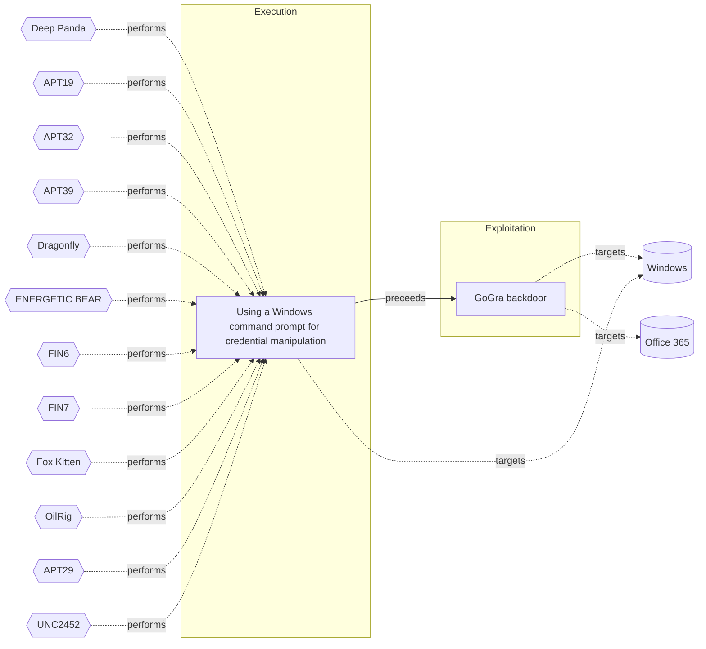

# ☣️ GoGra backdoor

🔥 **Criticality:High** ⚠️ : A High priority incident is likely to result in a demonstrable impact to public health or safety, national security, economic security, foreign relations, civil liberties, or public confidence. 

🚦 **TLP:CLEAR** ⚪ : Recipients can spread this to the world, there is no limit on disclosure.

🗡️ **ATT&CK Techniques** [T1134 : Access Token Manipulation](https://attack.mitre.org/techniques/T1134 'Adversaries may modify access tokens to operate under a different user or system security context to perform actions and bypass access controls Window'), [T1027 : Obfuscated Files or Information](https://attack.mitre.org/techniques/T1027 'Adversaries may attempt to make an executable or file difficult to discover or analyze by encrypting, encoding, or otherwise obfuscating its contents '), [T1059.003 : Command and Scripting Interpreter: Windows Command Shell](https://attack.mitre.org/techniques/T1059/003 'Adversaries may abuse the Windows command shell for execution The Windows command shell cmdhttpsattackmitreorgsoftwareS0106 is the primary command pro'), [T1204.002 : User Execution: Malicious File](https://attack.mitre.org/techniques/T1204/002 'An adversary may rely upon a user opening a malicious file in order to gain execution Users may be subjected to social engineering to get them to open')

---

`🔑 UUID : f2c59a8e-3b1f-4a99-80f0-3675b8c1f184` **|** `🏷️ Version : 1` **|** `🗓️ Creation Date : 2023-10-15` **|** `🗓️ Last Modification : 2023-10-15` **|** `Sharing Organisation : {'uuid': '56b0a0f0-b0bc-47d9-bb46-02f80ae2065a', 'name': 'EC DIGIT CSOC'}` **|** `🧱 Schema Identifier : tvm::2.0`

## 👁️ Description

> GoGra or also known as Trojan.Gogra is a newly discovered backdoor,
> deployed against a media organization in South Asia in November 2023.
> Written in Go, it uses the Microsoft Graph API to communicate with a
> Command and Control server hosted on Microsoft mail services ref [1].  
> 
> Its authentication is managed via OAuth access tokens. GoGra is configured
> to read messages from an Outlook account with the username "FNU LNU" whose
> subject line begins with "Input". It decrypts the content using AES-256 in
> Cipher Block Chaining (CBC) mode, with a specific key. The malware can
> execute commands via cmd.exe and supports a "cd" command to change
> directories ref [1, 3].        
> 
> After the command execution, the output is encrypted and sent back to the
> Outlook account with the subject "Output". GoGra is believed to be
> developed by a nation-state-backed group known for targeting South Asian
> organizations.      
> 
> GoGra is functionally similar to another known tool used by the same threat
> actor called Graphon, written in .NET. Aside from the different programming
> languages used, Graphon is using a different AES key and didn't contain an
> extra “cd” command as well as haven't a hardcoded Outlook username to
> communicate with. The username instead is received directly from the
> C&C server ref [3].  
> 

## 🖥️ Terrain 

 > Cloud environments, with a primary focus on Microsoft cloud services
> such as Microsoft 365 and Outlook. This threat leverages legitimate
> Microsoft Graph APIs and authentication mechanisms (OAuth) to interact
> with Microsoft services via a Command and Control server ref [a, 3].    
> 

---

## 🕸️ Relations

### 🌊 OpenTide Objects
🚫 No related OpenTide objects indexed.

 --- 

### ⛓️ Threat Chaining

Expand chaining data

| ☣️ Vector                                                                                                                                                                                                                  | ⛓️ Link              | 🎯 Target                                                                                                                                                                                                                                                                                                                       | ⛰️ Terrain                                                                                                                        | 🗡️ ATT&CK                                                                                                                                                                                                                                                                                                                                                                                                                                                                                                                                                |
|:---------------------------------------------------------------------------------------------------------------------------------------------------------------------------------------------------------------------------|:---------------------|:-------------------------------------------------------------------------------------------------------------------------------------------------------------------------------------------------------------------------------------------------------------------------------------------------------------------------------|:----------------------------------------------------------------------------------------------------------------------------------|:---------------------------------------------------------------------------------------------------------------------------------------------------------------------------------------------------------------------------------------------------------------------------------------------------------------------------------------------------------------------------------------------------------------------------------------------------------------------------------------------------------------------------------------------------------|
| [GoGra backdoor](../Threat%20Vectors/☣️%20GoGra%20backdoor.md 'GoGra or also known as TrojanGogra is a newly discovered backdoor,deployed against a media organization in South Asia in November 2023Written in Go, i...') | `sequence::preceeds` | [Using a Windows command prompt for credential manipulation](../Threat%20Vectors/☣️%20Using%20a%20Windows%20command%20prompt%20for%20credential%20manipulation.md 'Threat actors may use Windows commad prompt commands to search for, accessin order to manipulate create, modify, delete, read users credentialslocally...') | Requires an already compromised Windows endpoint and in some cases elevated administrator privileges to command prompt interface. | [T1059.003 : Command and Scripting Interpreter: Windows Command Shell](https://attack.mitre.org/techniques/T1059/003 'Adversaries may abuse the Windows command shell for execution The Windows command shell cmdhttpsattackmitreorgsoftwareS0106 is the primary command pro'), [T1098.001 : Account Manipulation: Additional Cloud Credentials](https://attack.mitre.org/techniques/T1098/001 'Adversaries may add adversary-controlled credentials to a cloud account to maintain persistent access to victim accounts and instances within the envi') |

&nbsp; 

---

## Model Data

#### **⛓️ Cyber Kill Chain**

 > Cyber attacks are typically phased progressions towards strategic objectives. The Unified Kill Chains provides insight into the tactics that hackers employ to attain these objectives. This provides a solid basis to develop (or realign) defensive strategies to raise cyber resilience.

 [`💥 Exploitation`](https://www.unifiedkillchain.com/assets/The-Unified-Kill-Chain.pdf) : Techniques to exploit vulnerabilities in systems that may, amongst others, result in code execution.

---

#### **🛰️ Domains**

 > Infrastructure technologies domain of interest to attackers.

  - `🏢 Enterprise` : Generic databases, applications, machines and systems that are usually on premises or on Cloud traditional VMs.
 - `☁️ Private Cloud` : Infrastructure hosted at a third party, but based on custom specification and managed on a platform level.
 - `☁️ Public Cloud` : Infrastructure handled by a commercial cloud provider. Managed mostly on a service level, and connected over the internet.

---

#### **🎯 Targets**

 > Granular delimited technical entities holding a value to the organization, that are targeted by adversaries. They might be also involved in the detection coverage as the target of log collection. Partially inspired by Veris.

  - [`👤 End-user`](http://veriscommunity.net/enums.html#section-asset) : People - End-user
 - [`🧩 Windows API`](https://learn.microsoft.com/en-us/windows/win32/apiindex/windows-api-list) : The Windows API, informally WinAPI, is Microsoft's core set of application programming interfaces (APIs) available in the Microsoft Windows operating systems. The name Windows API collectively refers to several different platform implementations that are often referred to by their own names (for example, Win32 API). Almost all Windows programs interact with the Windows API.
 - [`🖥️ Workstations`](http://veriscommunity.net/enums.html#section-asset) : Placeholder
 - [`🖥️ Desktop`](http://veriscommunity.net/enums.html#section-asset) : User Device - Desktop or workstation
 - [`🎞️ Media`](http://veriscommunity.net/enums.html#section-asset) : User Device - Media player or recorder
 - [`🖥️ Public-Facing Servers`](http://veriscommunity.net/enums.html#section-asset) : Placeholder
 - [`📧 Email Platform`](http://veriscommunity.net/enums.html#section-asset) : Placeholder

---

#### **💿 Platforms concerned**

 > Actual technologies used by the organization that will be exploited by adversaries during a successful attack, and eventually of relevance for detection. Are named by commercial designation.

  - ` Office 365` : Placeholder
 - ` Windows` : Placeholder

---

#### **💣 Severity**

 > The severity summarizes the overall danger of incident the vector will provoke, and is to be derived (WIP) from impact, leverage, and difficulty to execute.

 [`🔫 Localised incident`](https://www.ncsc.gov.uk/news/new-cyber-attack-categorisation-system-improve-uk-response-incidents) : A cyber attack on an individual, or preliminary indications of cyber activity against a small or medium-sized organisation.

---

#### **🪄 Leverage acquisition**

 > Technical aftermath of the attack from the target perspective, differentiated from impact as it does not consider the value of the consequence, only what increased control the vector execution provides to the adversary.

  - [`🦠 Dwelling`](https://owasp.org/www-community/Threat_Modeling_Process#stride) : Active or passive extended presence in the target, which performs adversarial operations continuously.
 - [`💀 Infrastructure Compromise`](https://owasp.org/www-community/Threat_Modeling_Process#stride) : The compromised target is likely to be used to further expand the sphere of influence of the attacker and allow more potent vectors to be executed.
 - [`👁️‍🗨️ Information Disclosure`](https://owasp.org/www-community/Threat_Modeling_Process#stride) : Threat action intending to read a file that one was not granted access to, or to read data in transit.
 - [`👻 Spoofing`](https://owasp.org/www-community/Threat_Modeling_Process#stride) : Threat action aimed at accessing and use of another user’s credentials, such as username and password.

---

#### **💥 Impact**

 > Analysis of the threat vector from the organizational perspective, in non technical term. This aims at putting a clear denomination on what the attacker will actually be able to act upon if the threat vector is realized.

  - [`😤 Nuisance`](http://veriscommunity.net/enums.html#section-impact) : Small and mostly inconsequential to day to day operations, but noticed.
 - [`🩼 Impairement`](http://veriscommunity.net/enums.html#section-impact) : Incapacitation of a particular key system that will cause disruptions in day-to-day operations, and eventually service delivery.
 - [`🔓 Data Breach`](http://veriscommunity.net/enums.html#section-impact) : Non-public information has been accessed from the outside, and successfully extracted.
 - [`💲 Operating costs`](http://veriscommunity.net/enums.html#section-impact) : Increased operating costs

---

#### **🎲 Vector Viability**

 > Described with estimative language (likelyhood probability), describes how likely the analyst believes the vector to actually be realized on the organization infrastructure. Estimative language describes quality and credibility of underlying sources, data, and methodologies based Intelligence Community Directive 203 (ICD 203) and JP 2-0, Joint Intelligence.

 [`🧐 Likely`](https://www.dni.gov/files/documents/ICD/ICD%20203%20Analytic%20Standards.pdf) : Probable (probably) - 55-80%

---

### 🔗 References

**🕊️ Publicly available resources**

- [_1_] https://thehackernews.com/2024/08/new-go-based-backdoor-gogra-targets.html
- [_2_] https://thehackernews.com/2024/05/hackers-increasingly-abusing-microsoft.html
- [_3_] https://www.security.com/threat-intelligence/cloud-espionage-attacks

[1]: https://thehackernews.com/2024/08/new-go-based-backdoor-gogra-targets.html
[2]: https://thehackernews.com/2024/05/hackers-increasingly-abusing-microsoft.html
[3]: https://www.security.com/threat-intelligence/cloud-espionage-attacks

---

#### 🏷️ Tags

#-, #-, #-, #
, #
, ##, ##, ##, ##, # , #🏷, #️, # , #T, #a, #g, #s, #
, #

