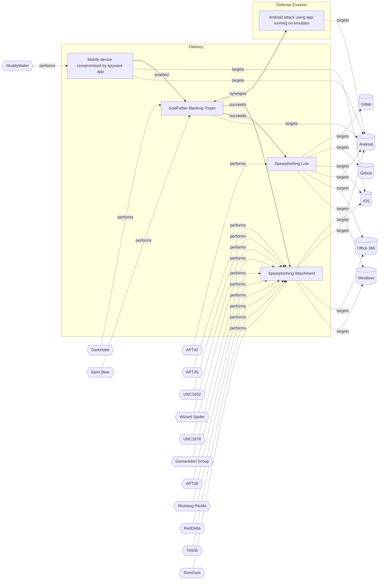

# ☣️ GodFather Banking Trojan

🔥 **Criticality:High** ⚠️ : A High priority incident is likely to result in a demonstrable impact to public health or safety, national security, economic security, foreign relations, civil liberties, or public confidence. 

🚦 **TLP:CLEAR** ⚪ : Recipients can spread this to the world, there is no limit on disclosure.

🗡️ **ATT&CK Techniques** [T1055 : Process Injection](https://attack.mitre.org/techniques/T1055 'Adversaries may inject code into processes in order to evade process-based defenses as well as possibly elevate privileges Process injection is a meth'), [T1497 : Virtualization/Sandbox Evasion](https://attack.mitre.org/techniques/T1497 'Adversaries may employ various means to detect and avoid virtualization and analysis environments This may include changing behaviors based on the res'), [T1056.001 : Input Capture: Keylogging](https://attack.mitre.org/techniques/T1056/001 'Adversaries may log user keystrokes to intercept credentials as the user types them Keylogging is likely to be used to acquire credentials for new acc')

---

`🔑 UUID : 46a79e6f-3df1-4332-a452-3f1fe83bdaf3` **|** `🏷️ Version : 1` **|** `🗓️ Creation Date : 2025-09-17` **|** `🗓️ Last Modification : 2025-09-17` **|** `Sharing Organisation : {'uuid': '56b0a0f0-b0bc-47d9-bb46-02f80ae2065a', 'name': 'EC DIGIT CSOC'}` **|** `🧱 Schema Identifier : tvm::2.1`

## 👁️ Description

> The GodFather malware is a highly advanced Android banking trojan that has evolved 
> into one of the most effective and disruptive mobile threats targeting financial, 
> banking, and cryptocurrency applications globally.
> 
> ### Main Threat Vectors
> 
> - **On-Device Virtualization**: GodFather’s core tactic is deploying a virtualization 
> framework on infected Android devices. It creates a virtual environment into which 
> it loads real banking or crypto apps. When a legitimate app is launched, the user 
> is redirected invisibly to the app’s clone running inside the sandbox, allowing 
> the malware to monitor every action, tap, and credential input in real-time.
> - **Overlay Attacks**: Beyond virtualization, GodFather can also display fake overlays 
> that look identical to lock screens or login pages, capturing PINs, patterns, or 
> passwords as users enter them, further compromising device and account security.
> - **Hooking and Network Interception**: The malware uses the Xposed framework to 
> hook into the OkHttp network library, which is utilized by many Android apps, thus 
> logging network requests and credentials.
> 
> ### Infection and Evasion
> 
> - **Infection Chain**: Typically distributed as trojanized or impersonated apps 
> (e.g., fake music downloaders or bogus “Google Protect” apps), GodFather prompts 
> users to grant invasive permissions for storage, SMS, contacts, and especially accessibility 
> services.
> - **Bypassing Security**: It employs advanced ZIP manipulation and code shifting 
> to the Java layer to bypass static analysis tools. It also hooks Android APIs such 
> as `getEnabledAccessibilityServiceList` to hide from anti-malware scans.
> - **Command Capabilities**: Once active, it supports a broad command set for attackers, 
> including remote control to simulate gestures, manipulate settings, execute overlay 
> attacks, log keystrokes, and exfiltrate a wide range of sensitive data.
> 
> ### Targets and Impact
> 
> - **Scope**: GodFather targets over 484 of the world’s most popular financial and 
> cryptocurrency apps, with campaigns observed in Europe, the U.S., Canada, Asia, 
> and the Middle East.
> - **Consequences**: It can lead to severe financial loss, reputational damage, operational 
> disruption, and regulatory fines for both consumers and organizations. The malware 
> is particularly dangerous in BYOD enterprise environments, as it can compromise 
> corporate data if personal devices are infected.
> - **Stealth**: The virtualization attack results in “perfect deception,” as users 
> interact with their real apps, making visual or user-driven detection virtually 
> impossible.
> 

## 🖥️ Terrain 

 > Adversaries achieve granting AccessibilityService permissions to GodFather
> malware primarily through social engineering techniques that trick users into
> enabling these permissions. 
> 

---

## 🕸️ Relations

### 🐲 Actors sightings 

| Actor                   | Description                                                                                                                                                                                                                                                                                                                                                                                                                                                                                                                                                                                                                                                                                                                                                                                                                                                                                                                                              | Aliases                                                                                                                                                  | Source                     | Sighting                                                                                      | Reference                                                                      |
|:------------------------|:---------------------------------------------------------------------------------------------------------------------------------------------------------------------------------------------------------------------------------------------------------------------------------------------------------------------------------------------------------------------------------------------------------------------------------------------------------------------------------------------------------------------------------------------------------------------------------------------------------------------------------------------------------------------------------------------------------------------------------------------------------------------------------------------------------------------------------------------------------------------------------------------------------------------------------------------------------|:---------------------------------------------------------------------------------------------------------------------------------------------------------|:---------------------------|:----------------------------------------------------------------------------------------------|:-------------------------------------------------------------------------------|
| DarkHotel               | Kaspersky described DarkHotel in a 2014 report as: '... DarkHotel drives its campaigns by spear-phishing targets with highly advanced Flash zero-day exploits that effectively evade the latest Windows and Adobe defenses, and yet they also imprecisely spread among large numbers of vague targets with peer-to-peer spreading tactics. Moreover, this crews most unusual characteristic is that for several years the Darkhotel APT has maintained a capability to use hotel networks to follow and hit selected targets as they travel around the world.'                                                                                                                                                                                                                                                                                                                                                                                           | DUBNIUM, Fallout Team, Karba, Luder, Nemim, Nemin, Tapaoux, Pioneer, Shadow Crane, APT-C-06, SIG25, TUNGSTEN BRIDGE, T-APT-02, G0012, ATK52, Zigzag Hail | 🌌 MISP Threat Actor Galaxy | Darkhotel malware has employed just-in-time decryption of strings to evade sandbox detection. | https://www.lastline.com/labsblog/defeating-darkhotel-just-in-time-decryption/ |
| [Enterprise] Saint Bear | [Saint Bear](https://attack.mitre.org/groups/G1031) is a Russian-nexus threat actor active since early 2021, primarily targeting entities in Ukraine and Georgia. The group is notable for a specific remote access tool, [Saint Bot](https://attack.mitre.org/software/S1018), and information stealer, [OutSteel](https://attack.mitre.org/software/S1017) in campaigns. [Saint Bear](https://attack.mitre.org/groups/G1031) typically relies on phishing or web staging of malicious documents and related file types for initial access, spoofing government or related entities.(Citation: Palo Alto Unit 42 OutSteel SaintBot February 2022 )(Citation: Cadet Blizzard emerges as novel threat actor) [Saint Bear](https://attack.mitre.org/groups/G1031) has previously been confused with [Ember Bear](https://attack.mitre.org/groups/G1003) operations, but analysis of behaviors, tools, and targeting indicates these are distinct clusters. | Lorec53, Storm-0587, TA471, UAC-0056                                                                                                                     | 🗡️ MITRE ATT&CK Groups     | Saint Bear contains several anti-analysis and anti-virtualization checks.                     | https://unit42.paloaltonetworks.com/ukraine-targeted-outsteel-saintbot/        |

### 🌊 OpenTide Objects
🚫 No related OpenTide objects indexed.

 --- 

### ⛓️ Threat Chaining

Expand chaining data

| ☣️ Vector                                                                                                                                                                                                                                        | ⛓️ Link              | 🎯 Target                                                                                                                                                                                                                                                                                         | ⛰️ Terrain                                                                                                                                                                                                                                                                                                                                                                                                                                                                                                                                                                                                                                                                                                                                                                                                                                                | 🗡️ ATT&CK                                                                                                                                                                                                                                                                                                                                                                                                                                                                                                                                                                                                                                                                                                                                                                                                                                                                                                                                                                                                                                                                                                                                                                                                                                                                                                                                                                                                                                                                                 |
|:-------------------------------------------------------------------------------------------------------------------------------------------------------------------------------------------------------------------------------------------------|:---------------------|:-------------------------------------------------------------------------------------------------------------------------------------------------------------------------------------------------------------------------------------------------------------------------------------------------|:----------------------------------------------------------------------------------------------------------------------------------------------------------------------------------------------------------------------------------------------------------------------------------------------------------------------------------------------------------------------------------------------------------------------------------------------------------------------------------------------------------------------------------------------------------------------------------------------------------------------------------------------------------------------------------------------------------------------------------------------------------------------------------------------------------------------------------------------------------|:------------------------------------------------------------------------------------------------------------------------------------------------------------------------------------------------------------------------------------------------------------------------------------------------------------------------------------------------------------------------------------------------------------------------------------------------------------------------------------------------------------------------------------------------------------------------------------------------------------------------------------------------------------------------------------------------------------------------------------------------------------------------------------------------------------------------------------------------------------------------------------------------------------------------------------------------------------------------------------------------------------------------------------------------------------------------------------------------------------------------------------------------------------------------------------------------------------------------------------------------------------------------------------------------------------------------------------------------------------------------------------------------------------------------------------------------------------------------------------------|
| [GodFather Banking Trojan](../Threat%20Vectors/☣️%20GodFather%20Banking%20Trojan.md 'The GodFather malware is a highly advanced Android banking trojan that has evolved into one of the most effective and disruptive mobile threats target...') | `sequence::succeeds` | [Spearphishing Link](../Threat%20Vectors/☣️%20Spearphishing%20Link.md 'Adversaries may send spearphishing emails with a malicious link in anattempt to gain access to victim systems This sub-technique employsthe use of lin...')                                                               | Spear phishing requires more preparation and time to achieve success than a phishing attack. That is because spear-phishing attackers attempt to obtain vast amounts of personal information about their victims,   the entities their work for, or their areas of interest.    Attackers can get the personal information they need using different ways: to compromise an email or messaging system trough other means, to use OSINT, scouring Social Media or glean personal information from the user's online presence.                                                                                                                                                                                                                                                                                                                              | [T1566.002 : Phishing: Spearphishing Link](https://attack.mitre.org/techniques/T1566/002 'Adversaries may send spearphishing emails with a malicious link in an attempt to gain access to victim systems Spearphishing with a link is a specific'), [T1036 : Masquerading](https://attack.mitre.org/techniques/T1036 'Adversaries may attempt to manipulate features of their artifacts to make them appear legitimate or benign to users andor security tools Masquerading '), [T1656 : Impersonation](https://attack.mitre.org/techniques/T1656 'Adversaries may impersonate a trusted person or organization in order to persuade and trick a target into performing some action on their behalf For e')                                                                                                                                                                                                                                                                                                                                                                                                                                                                                                                                                                                                                                                                                                                                                                               |
| [GodFather Banking Trojan](../Threat%20Vectors/☣️%20GodFather%20Banking%20Trojan.md 'The GodFather malware is a highly advanced Android banking trojan that has evolved into one of the most effective and disruptive mobile threats target...') | `sequence::succeeds` | [Spearphishing Attachment](../Threat%20Vectors/☣️%20Spearphishing%20Attachment.md 'Spearphishing messages are often crafted using pernicious social engineeringtechniquesIn Spearphishing Attachment attacks, recipients receive emails t...')                                                   | Spear phishing requires more preparation and time to achieve success  than a phishing attack. That is because spear-phishing attackers attempt to obtain vast amounts of personal information about their victims.   Attackers can get the personal information they need using different ways:   - to compromise an email or messaging system trough other means, - to use OSINT, sourcing Social Media or glean personal information from the user's online presence. They want to craft emails that look as legitimate and attractive as possible  to increase the chances of fooling their targets, for instance sending a malicious  attachment where the filename references a topic the recipient is interested in. The highly personalized nature of spear-phishing attacks makes it more  difficult to identity than widescale phishing attacks. | [T1566.001 : Phishing: Spearphishing Attachment](https://attack.mitre.org/techniques/T1566/001 'Adversaries may send spearphishing emails with a malicious attachment in an attempt to gain access to victim systems Spearphishing attachment is a spe')                                                                                                                                                                                                                                                                                                                                                                                                                                                                                                                                                                                                                                                                                                                                                                                                                                                                                                                                                                                                                                                                                                                                                                                                                                  |
| [GodFather Banking Trojan](../Threat%20Vectors/☣️%20GodFather%20Banking%20Trojan.md 'The GodFather malware is a highly advanced Android banking trojan that has evolved into one of the most effective and disruptive mobile threats target...') | `support::synergize` | [Android attack using app running on emulator](../Threat%20Vectors/☣️%20Android%20attack%20using%20app%20running%20on%20emulator.md 'The threat vector involves exploiting emulated environments to bypass security measures, automate malicious activities, and manipulate app behavior Be...') | Adversaries require users to download emulators that have been compromised or misconfigured and through these, they can carry out malicious activities.                                                                                                                                                                                                                                                                                                                                                                                                                                                                                                                                                                                                                                                                                                   | [T1626](https://attack.mitre.org/techniques/T1626 'Adversaries may circumvent mechanisms designed to control elevated privileges to gain higher-level permissions Most modern systems contain native elev'), [T1633](https://attack.mitre.org/techniques/T1633 'Adversaries may employ various means to detect and avoid virtualization and analysis environments This may include changing behaviors after checking f'), [T1417](https://attack.mitre.org/techniques/T1417 'Adversaries may use methods of capturing user input to obtain credentials or collect information During normal device usage, users often provide crede'), [T1635](https://attack.mitre.org/techniques/T1635 'Adversaries can steal user application access tokens as a means of acquiring credentials to access remote systems and resources This can occur through'), [T1426](https://attack.mitre.org/techniques/T1426 'Adversaries may attempt to get detailed information about a devices operating system and hardware, including versions, patches, and architecture Adver'), [T0869](https://attack.mitre.org/techniques/T0869 'Adversaries may establish command and control capabilities over commonly used application layer protocols such as HTTPS, OPC, RDP, telnet, DNP3, and m'), [T1641](https://attack.mitre.org/techniques/T1641 'Adversaries may insert, delete, or alter data in order to manipulate external outcomes or hide activity By manipulating data, adversaries may attempt ') |
| [GodFather Banking Trojan](../Threat%20Vectors/☣️%20GodFather%20Banking%20Trojan.md 'The GodFather malware is a highly advanced Android banking trojan that has evolved into one of the most effective and disruptive mobile threats target...') | `support::enabled`   | [Mobile device compromised by spyware app](../Threat%20Vectors/☣️%20Mobile%20device%20compromised%20by%20spyware%20app.md 'Earlier versions of spyware apps were installed on smartphones through vulnerabilitiesin commonly used apps, or involving an SMS or iMessage that prov...')           | Adversaries can abuse iOS or Android devices which are vulnerable to a zero-click or zero-day exploitation, without user intervention.                                                                                                                                                                                                                                                                                                                                                                                                                                                                                                                                                                                                                                                                                                                    | [T1512](https://attack.mitre.org/techniques/T1512 'An adversary can leverage a devices cameras to gather information by capturing video recordings Images may also be captured, potentially in specified '), [T1582](https://attack.mitre.org/techniques/T1582 'Adversaries may delete, alter, or send SMS messages without user authorization This could be used to hide C2 SMS messages, spread malware, or various '), [T1513](https://attack.mitre.org/techniques/T1513 'Adversaries may use screen capture to collect additional information about a target device, such as applications running in the foreground, user data,'), [T1517](https://attack.mitre.org/techniques/T1517 'Adversaries may collect data within notifications sent by the operating system or other applications Notifications may contain sensitive data such as '), [T1429](https://attack.mitre.org/techniques/T1429 'Adversaries may capture audio to collect information by leveraging standard operating system APIs of a mobile device Examples of audio information adv'), [T1643](https://attack.mitre.org/techniques/T1643 'Adversaries may generate outbound traffic from devices This is typically performed to manipulate external outcomes, such as to achieve carrier billing')                                                                                                                                                                                                              |

&nbsp; 

---

## Model Data

#### **⛓️ Cyber Kill Chain**

 > Cyber attacks are typically phased progressions towards strategic objectives. The Unified Kill Chains provides insight into the tactics that hackers employ to attain these objectives. This provides a solid basis to develop (or realign) defensive strategies to raise cyber resilience.

 [`📦 Delivery`](https://www.unifiedkillchain.com/assets/The-Unified-Kill-Chain.pdf) : Techniques resulting in the transmission of a weaponized object to the targeted environment.

---

#### **🛰️ Domains**

 > Infrastructure technologies domain of interest to attackers.

 `📱 Mobile` : Smartphones, tablets and applications running these devices.

---

#### **🎯 Targets**

 > Granular delimited technical entities holding a value to the organization, that are targeted by adversaries. They might be also involved in the detection coverage as the target of log collection. Partially inspired by Veris.

  - [`📱 Mobile phone`](http://veriscommunity.net/enums.html#section-asset) : User Device - Mobile phone or smartphone
 - [`🪪 Personal Information`](http://veriscommunity.net/enums.html#section-asset) : Placeholder

---

#### **💿 Platforms concerned**

 > Actual technologies used by the organization that will be exploited by adversaries during a successful attack, and eventually of relevance for detection. Are named by commercial designation.

 ` Android` : Placeholder

---

#### **💣 Severity**

 > The severity summarizes the overall danger of incident the vector will provoke, and is to be derived (WIP) from impact, leverage, and difficulty to execute.

 [`⚠️ Significant incident`](https://www.ncsc.gov.uk/news/new-cyber-attack-categorisation-system-improve-uk-response-incidents) : A cyber attack which has a serious impact on a large organisation or on wider / local government, or which poses a considerable risk to central government or (inter)national essential services.

---

#### **🪄 Leverage acquisition**

 > Technical aftermath of the attack from the target perspective, differentiated from impact as it does not consider the value of the consequence, only what increased control the vector execution provides to the adversary.

  - [`👻 Spoofing`](https://owasp.org/www-community/Threat_Modeling_Process#stride) : Threat action aimed at accessing and use of another user’s credentials, such as username and password.
 - [`🐒 Tampering`](https://owasp.org/www-community/Threat_Modeling_Process#stride) : Threat action intending to maliciously change or modify persistent data, such as records in a database, and the alteration of data in transit between two computers over an open network, such as the Internet.
 - [`👁️‍🗨️ Information Disclosure`](https://owasp.org/www-community/Threat_Modeling_Process#stride) : Threat action intending to read a file that one was not granted access to, or to read data in transit.
 - [`💅 Elevation of privilege`](https://owasp.org/www-community/Threat_Modeling_Process#stride) : Capacity to augment leverage over the target system by upgrading the compromised access rights

---

#### **💥 Impact**

 > Analysis of the threat vector from the organizational perspective, in non technical term. This aims at putting a clear denomination on what the attacker will actually be able to act upon if the threat vector is realized.

  - [`🔓 Data Breach`](http://veriscommunity.net/enums.html#section-impact) : Non-public information has been accessed from the outside, and successfully extracted.
 - [`💸 Monetary Loss`](http://veriscommunity.net/enums.html#section-impact) : The vector will directly conduct to loss of value directly impacting the bottom line.
 - [`🥸 Identity Theft`](http://veriscommunity.net/enums.html#section-impact) : Acquisition of sufficient information and privileges to profess as a given individual, for the purpose of abusing and deceiving human trust relationships.

---

#### **🎲 Vector Viability**

 > Described with estimative language (likelyhood probability), describes how likely the analyst believes the vector to actually be realized on the organization infrastructure. Estimative language describes quality and credibility of underlying sources, data, and methodologies based Intelligence Community Directive 203 (ICD 203) and JP 2-0, Joint Intelligence.

 [`😰 Very Likely`](https://www.dni.gov/files/documents/ICD/ICD%20203%20Analytic%20Standards.pdf) : Highly probable - 80-95%

---

### 🔗 References

**🕊️ Publicly available resources**

- [_1_] https://securityaffairs.com/179191/malware/godfather-android-trojan-uses-virtualization-to-hijack-banking-and-crypto-apps.html
- [_2_] https://zimperium.com/blog/your-mobile-app-their-playground-the-dark-side-of-the-virtualization
- [_3_] https://www.americanbanker.com/news/godfather-malware-poses-new-threat-to-android-banking-apps

[1]: https://securityaffairs.com/179191/malware/godfather-android-trojan-uses-virtualization-to-hijack-banking-and-crypto-apps.html
[2]: https://zimperium.com/blog/your-mobile-app-their-playground-the-dark-side-of-the-virtualization
[3]: https://www.americanbanker.com/news/godfather-malware-poses-new-threat-to-android-banking-apps

---

#### 🏷️ Tags

#-, #-, #-, #
, #
, ##, ##, ##, ##, # , #🏷, #️, # , #T, #a, #g, #s, #
, #

