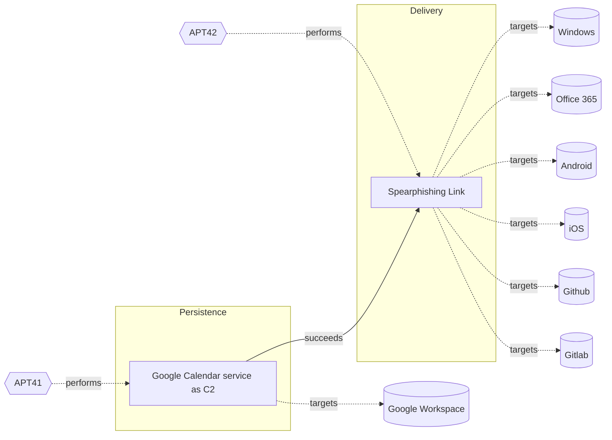

# ☣️ Google Calendar service as C2

🔥 **Criticality:Medium** ❗ : A Medium priority incident may affect public health or safety, national security, economic security, foreign relations, civil liberties, or public confidence. 

🚦 **TLP:CLEAR** ⚪ : Recipients can spread this to the world, there is no limit on disclosure.

🗡️ **ATT&CK Techniques** [T1566.002 : Phishing: Spearphishing Link](https://attack.mitre.org/techniques/T1566/002 'Adversaries may send spearphishing emails with a malicious link in an attempt to gain access to victim systems Spearphishing with a link is a specific'), [T1204.002 : User Execution: Malicious File](https://attack.mitre.org/techniques/T1204/002 'An adversary may rely upon a user opening a malicious file in order to gain execution Users may be subjected to social engineering to get them to open'), [T1190 : Exploit Public-Facing Application](https://attack.mitre.org/techniques/T1190 'Adversaries may attempt to exploit a weakness in an Internet-facing host or system to initially access a network The weakness in the system can be a s')

---

`🔑 UUID : 3f0b4b8e-6017-406a-9461-740d542d0917` **|** `🏷️ Version : 1` **|** `🗓️ Creation Date : 2025-06-11` **|** `🗓️ Last Modification : 2025-07-04` **|** `Sharing Organisation : {'uuid': '56b0a0f0-b0bc-47d9-bb46-02f80ae2065a', 'name': 'EC DIGIT CSOC'}` **|** `🧱 Schema Identifier : tvm::2.1`

## 👁️ Description

> In some of the reports and analysis a Chinese-affiliated threat actor was
> observed abusing Google Calendar to deliver malware and establish Command
> and Control (CnC) communication.  
> 
> ### Abuse of Google calendar
> 
> A malware delivered payload has the capability to read and write events with
> an attacker-controlled Google calendar. Once executed, this malware creates
> a zero minute calendar event at a hardcoded date, with data collected from
> the compromised host being encrypted and written in the calendar event
> description.  
> 
> A threat operator places encrypted commands in calendar events on this date
> and next one day, which are predetermined dates also hardcoded into the
> malware. The malicious code then begins polling calendar for these events.
> When an event is retrieved, the event description is decrypted and the
> command it contains is executed on the compromised host. Results from the
> command execution are encrypted and written back to another calendar event
> ref [1]. 
> 
> In several steps below is represented the threat vector pattern how the
> threat actor manages to exploit a Google calendar ref [1]. 
> 
> - Initial access : The threat actor gains initial access to a victim's
> Google account, often through phishing or credential reuse.
> - Google calendar creation: As a next step the malicious actor creates
> a new Google Calendar event, which is used as a mechanism to deliver
> malware to the victim's device.
> - Malicious event creation: The threat actor creates a new event in the
> victim's Google calendar, which includes a malicious link or attachment.
> The event is often titled with a misleading or innocuous name to avoid
> suspicion.
> - Notification and delivery: When the event is created, Google calendar
> sends a notification to the victim's device, which includes the malicious
> link or attachment. If the victim interacts with the notification,
> the malware is delivered to their device.
> - CnC Communication: Once the malware is installed, the threat actor
> uses the compromised device to establish CnC communication. The malware
> communicates with the threat actor's command and control server, allowing
> them to issue commands, exfiltrate data, and further compromise the
> victim's network.  
> 
> Where
> 
> - C2 server - is the attacker controlled calendar. C2 commands are passed as
> encrypted google calendar events.
> - C2 communication - established from the agent to the attacker controlled
> google calendar over HTTPS to Google API, using valid credentials.
> - C2 agent - posts computer information into the attacker controlled google
> calendar. 
> 
> More detailed explanation is provided in ref [1].  
> 
> ### Used known tactics
> 
> - Event titles and descriptions: A Chinese-based threat actor group uses
> misleading event titles and descriptions to avoid suspicion and increase
> the likelihood of the victim interacting with the malicious event.
> - Malicious links and attachments: The threat actor uses malicious links or
> attachments in the event to deliver malware to the victim's
> device.
> - Calendar settings abuse: The threat actor configures the Google calendar
> settings to send notifications to the victim's device, ensuring that the
> malware is delivered even if the victim doesn't actively check their
> calendar.
> 
> By abusing Google calendar, the threat actor is able to deliver malware and
> establish CnC communication in a way that is difficult to detect and block.
> This tactic highlights the importance of monitoring cloud services and
> implementing robust security controls to prevent such attacks ref [1], [2].  
> 

## 🖥️ Terrain 

 > A threat actor is using social engineering initial technique to entice an
> end-user to open a malicious Google invitation (a mail or calendar
> invitation event) and get infected. 
> 
> The goal is an access and maintain of a persistence. 
> 

---

## 🕸️ Relations

### 🐲 Actors sightings 

| Actor          | Description                                                                                                                                                                                                                                                                                                                                                                                                                                                                                                                                                                                                                                                                                                                                                                                                                                              | Aliases                                                                                                                                                                                                                | Source                     | Sighting                                                                                                                                                                                                        | Reference                                                                               |
|:---------------|:---------------------------------------------------------------------------------------------------------------------------------------------------------------------------------------------------------------------------------------------------------------------------------------------------------------------------------------------------------------------------------------------------------------------------------------------------------------------------------------------------------------------------------------------------------------------------------------------------------------------------------------------------------------------------------------------------------------------------------------------------------------------------------------------------------------------------------------------------------|:-----------------------------------------------------------------------------------------------------------------------------------------------------------------------------------------------------------------------|:---------------------------|:----------------------------------------------------------------------------------------------------------------------------------------------------------------------------------------------------------------|:----------------------------------------------------------------------------------------|
| [Mobile] APT41 | [APT41](https://attack.mitre.org/groups/G0096) is a threat group that researchers have assessed as Chinese state-sponsored espionage group that also conducts financially-motivated operations. Active since at least 2012, [APT41](https://attack.mitre.org/groups/G0096) has been observed targeting various industries, including but not limited to healthcare, telecom, technology, finance, education, retail and video game industries in 14 countries.(Citation: apt41_mandiant) Notable behaviors include using a wide range of malware and tools to complete mission objectives. [APT41](https://attack.mitre.org/groups/G0096) overlaps at least partially with public reporting on groups including BARIUM and [Winnti Group](https://attack.mitre.org/groups/G0044).(Citation: FireEye APT41 Aug 2019)(Citation: Group IB APT 41 June 2021) | BARIUM, Brass Typhoon, Wicked Panda                                                                                                                                                                                    | 🗡️ MITRE ATT&CK Groups     | No documented sighting                                                                                                                                                                                          | No documented references                                                                |
| APT41          | APT41 is a prolific cyber threat group that carries out Chinese state-sponsored espionage activity in addition to financially motivated activity potentially outside of state control.                                                                                                                                                                                                                                                                                                                                                                                                                                                                                                                                                                                                                                                                   | G0096, TA415, Blackfly, Grayfly, LEAD, BARIUM, WICKED SPIDER, WICKED PANDA, BRONZE ATLAS, BRONZE EXPORT, Red Kelpie, G0044, Earth Baku, Amoeba, HOODOO, Brass Typhoon, Winnti, Double Dragon, TG-2633, Leopard Typhoon | 🌌 MISP Threat Actor Galaxy | Chinese affiliated threat actor conducted a cyber-espionage campaign,including memory-only payloads, encryption, compression, processhollowing, control flow obfuscation, and leveraging Google calendarfor C2. | https://cloud.google.com/blog/topics/threat-intelligence/apt41-innovative-tactics?hl=en |

### 🌊 OpenTide Objects
🚫 No related OpenTide objects indexed.

 --- 

### ⛓️ Threat Chaining

Expand chaining data

| ☣️ Vector                                                                                                                                                                                                                                                      | ⛓️ Link              | 🎯 Target                                                                                                                                                                                                                           | ⛰️ Terrain                                                                                                                                                                                                                                                                                                                                                                                                                                                                                                                   | 🗡️ ATT&CK                                                                                                                                                                                                                                                                                                                                                                                                                                                                                                                                                                                                                                                                                                   |
|:---------------------------------------------------------------------------------------------------------------------------------------------------------------------------------------------------------------------------------------------------------------|:---------------------|:-----------------------------------------------------------------------------------------------------------------------------------------------------------------------------------------------------------------------------------|:-----------------------------------------------------------------------------------------------------------------------------------------------------------------------------------------------------------------------------------------------------------------------------------------------------------------------------------------------------------------------------------------------------------------------------------------------------------------------------------------------------------------------------|:------------------------------------------------------------------------------------------------------------------------------------------------------------------------------------------------------------------------------------------------------------------------------------------------------------------------------------------------------------------------------------------------------------------------------------------------------------------------------------------------------------------------------------------------------------------------------------------------------------------------------------------------------------------------------------------------------------|
| [Google Calendar service as C2](../Threat%20Vectors/☣️%20Google%20Calendar%20service%20as%20C2.md 'In some of the reports and analysis a Chinese-affiliated threat actor wasobserved abusing Google Calendar to deliver malware and establish Commandand ...') | `sequence::succeeds` | [Spearphishing Link](../Threat%20Vectors/☣️%20Spearphishing%20Link.md 'Adversaries may send spearphishing emails with a malicious link in anattempt to gain access to victim systems This sub-technique employsthe use of lin...') | Spear phishing requires more preparation and time to achieve success than a phishing attack. That is because spear-phishing attackers attempt to obtain vast amounts of personal information about their victims,   the entities their work for, or their areas of interest.    Attackers can get the personal information they need using different ways: to compromise an email or messaging system trough other means, to use OSINT, scouring Social Media or glean personal information from the user's online presence. | [T1566.002 : Phishing: Spearphishing Link](https://attack.mitre.org/techniques/T1566/002 'Adversaries may send spearphishing emails with a malicious link in an attempt to gain access to victim systems Spearphishing with a link is a specific'), [T1036 : Masquerading](https://attack.mitre.org/techniques/T1036 'Adversaries may attempt to manipulate features of their artifacts to make them appear legitimate or benign to users andor security tools Masquerading '), [T1656 : Impersonation](https://attack.mitre.org/techniques/T1656 'Adversaries may impersonate a trusted person or organization in order to persuade and trick a target into performing some action on their behalf For e') |

&nbsp; 

---

## Model Data

#### **⛓️ Cyber Kill Chain**

 > Cyber attacks are typically phased progressions towards strategic objectives. The Unified Kill Chains provides insight into the tactics that hackers employ to attain these objectives. This provides a solid basis to develop (or realign) defensive strategies to raise cyber resilience.

 [`🔐 Persistence`](https://www.unifiedkillchain.com/assets/The-Unified-Kill-Chain.pdf) : Any access, action or change to a system that gives an attacker persistent presence on the system.

---

#### **🛰️ Domains**

 > Infrastructure technologies domain of interest to attackers.

  - `🏢 Enterprise` : Generic databases, applications, machines and systems that are usually on premises or on Cloud traditional VMs.
 - `☁️ Private Cloud` : Infrastructure hosted at a third party, but based on custom specification and managed on a platform level.
 - `☁️ Public Cloud` : Infrastructure handled by a commercial cloud provider. Managed mostly on a service level, and connected over the internet.

---

#### **🎯 Targets**

 > Granular delimited technical entities holding a value to the organization, that are targeted by adversaries. They might be also involved in the detection coverage as the target of log collection. Partially inspired by Veris.

  - [`💻 Laptop`](http://veriscommunity.net/enums.html#section-asset) : User Device - Laptop
 - [`👤 Customer`](http://veriscommunity.net/enums.html#section-asset) : People - Customer
 - [`🖲️ Control Server`](https://collaborate.mitre.org/attackics/index.php/Control_Server) : A device which acts as both a server and controller, that hosts the control software used in communicating with lower-level control devices in an ICS network (e.g. Remote Terminal Units (RTUs) and Programmable Logic Controllers (PLCs)).
 - [`🕹️ Remote access`](http://veriscommunity.net/enums.html#section-asset) : Server - Remote access
 - [` Other`](http://veriscommunity.net/enums.html#section-asset) : Media - Other/Unknown
 - [`🖥️ Workstations`](http://veriscommunity.net/enums.html#section-asset) : Placeholder

---

#### **💿 Platforms concerned**

 > Actual technologies used by the organization that will be exploited by adversaries during a successful attack, and eventually of relevance for detection. Are named by commercial designation.

 [` Google Workspace`](https://workspace.google.com/intl/en_id/) : Google Workspace is a collection of cloud computing, productivity and collaboration tools, software and products developed and marketed by Google.

---

#### **💣 Severity**

 > The severity summarizes the overall danger of incident the vector will provoke, and is to be derived (WIP) from impact, leverage, and difficulty to execute.

 [`🧨 Moderate incident`](https://www.ncsc.gov.uk/news/new-cyber-attack-categorisation-system-improve-uk-response-incidents) : A cyber attack on a small organisation, or which poses a considerable risk to a medium-sized organisation, or preliminary indications of cyber activity against a large organisation or the government.

---

#### **🪄 Leverage acquisition**

 > Technical aftermath of the attack from the target perspective, differentiated from impact as it does not consider the value of the consequence, only what increased control the vector execution provides to the adversary.

  - [`💀 Infrastructure Compromise`](https://owasp.org/www-community/Threat_Modeling_Process#stride) : The compromised target is likely to be used to further expand the sphere of influence of the attacker and allow more potent vectors to be executed.
 - [`👁️‍🗨️ Information Disclosure`](https://owasp.org/www-community/Threat_Modeling_Process#stride) : Threat action intending to read a file that one was not granted access to, or to read data in transit.
 - [`⚙️ Modify configuration`](https://owasp.org/www-community/Threat_Modeling_Process#stride) : Modify configuration or services

---

#### **💥 Impact**

 > Analysis of the threat vector from the organizational perspective, in non technical term. This aims at putting a clear denomination on what the attacker will actually be able to act upon if the threat vector is realized.

  - [`🔓 Data Breach`](http://veriscommunity.net/enums.html#section-impact) : Non-public information has been accessed from the outside, and successfully extracted.
 - [`🩼 Impairement`](http://veriscommunity.net/enums.html#section-impact) : Incapacitation of a particular key system that will cause disruptions in day-to-day operations, and eventually service delivery.
 - [`🤬 Lose Capabilities`](http://veriscommunity.net/enums.html#section-impact) : Vector execution will remove key functions to the organization, which will not be easily circumvented. Most day-to-day is heavily impaired, but processes can reorganize at a loss.

---

#### **🎲 Vector Viability**

 > Described with estimative language (likelyhood probability), describes how likely the analyst believes the vector to actually be realized on the organization infrastructure. Estimative language describes quality and credibility of underlying sources, data, and methodologies based Intelligence Community Directive 203 (ICD 203) and JP 2-0, Joint Intelligence.

 [`🧐 Likely`](https://www.dni.gov/files/documents/ICD/ICD%20203%20Analytic%20Standards.pdf) : Probable (probably) - 55-80%

---

### 🔗 References

**🕊️ Publicly available resources**

- [_1_] https://cloud.google.com/blog/topics/threat-intelligence/apt41-innovative-tactics?hl=en
- [_2_] https://thehackernews.com/2025/05/chinese-apt41-exploits-google-calendar.html
- [_3_] https://www.cybersecuritydive.com/news/china-hackers-google-calendar-events-research/749290
- [_4_] https://github.com/MrSaighnal/GCR-Google-Calendar-RAT

[1]: https://cloud.google.com/blog/topics/threat-intelligence/apt41-innovative-tactics?hl=en
[2]: https://thehackernews.com/2025/05/chinese-apt41-exploits-google-calendar.html
[3]: https://www.cybersecuritydive.com/news/china-hackers-google-calendar-events-research/749290
[4]: https://github.com/MrSaighnal/GCR-Google-Calendar-RAT

---

#### 🏷️ Tags

#-, #-, #-, #
, #
, ##, ##, ##, ##, # , #🏷, #️, # , #T, #a, #g, #s, #
, #

