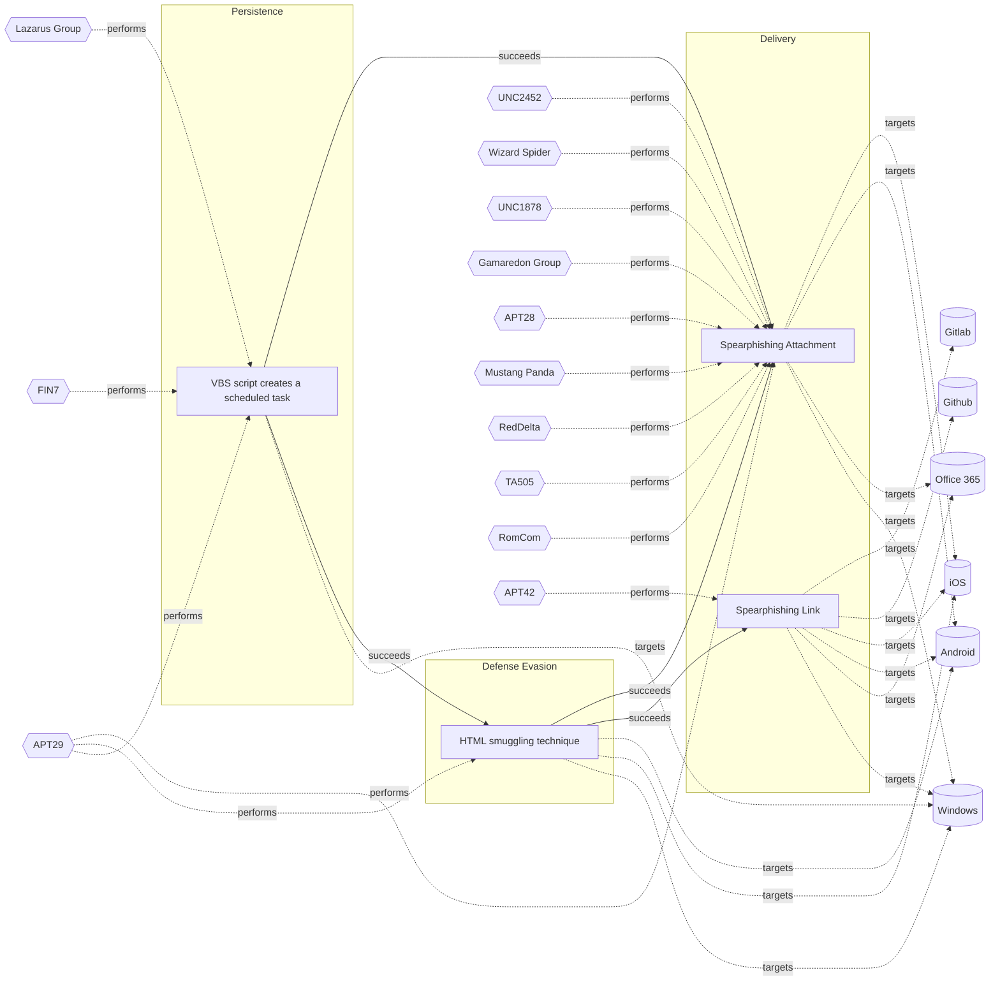

# ☣️ HTML smuggling technique

🔥 **Criticality:Medium** ❗ : A Medium priority incident may affect public health or safety, national security, economic security, foreign relations, civil liberties, or public confidence. 

🚦 **TLP:CLEAR** ⚪ : Recipients can spread this to the world, there is no limit on disclosure.


🗡️ **ATT&CK Techniques** [T1190 : Exploit Public-Facing Application](https://attack.mitre.org/techniques/T1190 'Adversaries may attempt to exploit a weakness in an Internet-facing host or system to initially access a network The weakness in the system can be a s'), [T1189 : Drive-by Compromise](https://attack.mitre.org/techniques/T1189 'Adversaries may gain access to a system through a user visiting a website over the normal course of browsing Multiple ways of delivering exploit code '), [T1204 : User Execution](https://attack.mitre.org/techniques/T1204 'An adversary may rely upon specific actions by a user in order to gain execution Users may be subjected to social engineering to get them to execute m'), [T1027.006 : Obfuscated Files or Information: HTML Smuggling](https://attack.mitre.org/techniques/T1027/006 'Adversaries may smuggle data and files past content filters by hiding malicious payloads inside of seemingly benign HTML files HTML documents can stor')


---

`🔑 UUID : c7ed4fad-a58f-47da-9938-4a673526b3f4` **|** `🏷️ Version : 1` **|** `🗓️ Creation Date : 2025-06-30` **|** `🗓️ Last Modification : 2025-07-01` **|** `Sharing Organisation : {'uuid': '56b0a0f0-b0bc-47d9-bb46-02f80ae2065a', 'name': 'EC DIGIT CSOC'}` **|** `🧱 Schema Identifier : tvm::2.1`


## 👁️ Description

> HTML smuggling is a technique used by attackers to embed a malicious
> code within HTML files, which are then smuggled past security controls,
> such as firewalls, intrusion detection systems, and web application
> firewalls. This is achieved by exploiting the way HTML files are
> processed by web browsers.
> 
> ### How HTML smuggling works?
> 
> HTML smuggling uses legitimate features of HTML5 and JavaScript,
> which are both supported by all modern browsers, to generate malicious
> files behind the firewall. Specifically, HTML smuggling leverages the
> HTML5 “download” attribute for anchor tags, as well as the creation
> and use of a JavaScript Blob to put together the payload downloaded
> into an affected device.
> 
> In HTML5, when a user clicks a link, the “download” attribute lets
> an HTML file automatically download a file referenced in the “href”
> tag. For example, the code below instructs the browser to download
> a malicious document from its location and save it into an own
> device (save “malicious.docx” to “safe.docx”) ref [1].  
> 
> ```html
> <a href="/malware/malicious.docx" download="safe.docx">Click</a>
> ```
> 
> In some of the reports and analysis is mentioned that a threat actor
> can create an HTML file that contains malicious code, such as JavaScript,
> executable files or other type of malicious payload, encoded in a way
> that evades detection by security controls. The HTML file is then sent
> to the victim's web browser, which processes the file and executes the 
> malicious code. The code can be used to download and install malware,
> steal sensitive information (PII or other data of interest, belongings
> to an organisation or a company), or in some cases to fully take control
> of the victim's system ref [2],[3].    
> 
> HTML smuggling can be used for malware delivery, for example in an email
> to the end user when after execution can deploy a Trojan, RAT, a backdoor
> or other type of malware depends on the attacker's goal ref [1]. 
> 
> ### Different types of HTML smuggling
> 
> There are several types of HTML smuggling techniques, for example:
> 
> - CSS smuggling - this involves using Cascading Style Sheets (CSS) to
> embed malicious code within an HTML file.
> - JavaScript smuggling - this involves using JavaScript to embed malicious
> code within an HTML file.
> - HTML5 smuggling - this involves using HTML5 features, such as the
> <canvas> element, to embed malicious code within an HTML file.  
> 


## 🖥️ Terrain 

 > A threat actor uses a legitimate and native features of
> web page scripting languages as HTML, CSS, JavaScript
> and others. This vulnerability in the page can lead
> to an initial access to a targeted system. 
> 

---

## 🕸️ Relations


### 🐲 Actors sightings 

| Actor              | Description                                                                                                                                                                                                                                                                                                                                                                                                                                                                                                                                                                                                                                                                                                                                                                                                                                                                                                                                                                                                                                                                                                                                                                                                                                                                                                                                                                                                                                                                                                                                                                                                                                                                                                                                                                                                                                                                                                                                                                                                                                                                                                                                                                                                                                                                                                        | Aliases                                                                                                                                                                           | Source                     | Sighting                                                                                                                                  | Reference                                                                                                                                                             |
|:-------------------|:-------------------------------------------------------------------------------------------------------------------------------------------------------------------------------------------------------------------------------------------------------------------------------------------------------------------------------------------------------------------------------------------------------------------------------------------------------------------------------------------------------------------------------------------------------------------------------------------------------------------------------------------------------------------------------------------------------------------------------------------------------------------------------------------------------------------------------------------------------------------------------------------------------------------------------------------------------------------------------------------------------------------------------------------------------------------------------------------------------------------------------------------------------------------------------------------------------------------------------------------------------------------------------------------------------------------------------------------------------------------------------------------------------------------------------------------------------------------------------------------------------------------------------------------------------------------------------------------------------------------------------------------------------------------------------------------------------------------------------------------------------------------------------------------------------------------------------------------------------------------------------------------------------------------------------------------------------------------------------------------------------------------------------------------------------------------------------------------------------------------------------------------------------------------------------------------------------------------------------------------------------------------------------------------------------------------|:----------------------------------------------------------------------------------------------------------------------------------------------------------------------------------|:---------------------------|:------------------------------------------------------------------------------------------------------------------------------------------|:----------------------------------------------------------------------------------------------------------------------------------------------------------------------|
| [Enterprise] APT29 | [APT29](https://attack.mitre.org/groups/G0016) is threat group that has been attributed to Russia's Foreign Intelligence Service (SVR).(Citation: White House Imposing Costs RU Gov April 2021)(Citation: UK Gov Malign RIS Activity April 2021) They have operated since at least 2008, often targeting government networks in Europe and NATO member countries, research institutes, and think tanks. [APT29](https://attack.mitre.org/groups/G0016) reportedly compromised the Democratic National Committee starting in the summer of 2015.(Citation: F-Secure The Dukes)(Citation: GRIZZLY STEPPE JAR)(Citation: Crowdstrike DNC June 2016)(Citation: UK Gov UK Exposes Russia SolarWinds April 2021)In April 2021, the US and UK governments attributed the [SolarWinds Compromise](https://attack.mitre.org/campaigns/C0024) to the SVR; public statements included citations to [APT29](https://attack.mitre.org/groups/G0016), Cozy Bear, and The Dukes.(Citation: NSA Joint Advisory SVR SolarWinds April 2021)(Citation: UK NSCS Russia SolarWinds April 2021) Industry reporting also referred to the actors involved in this campaign as UNC2452, NOBELIUM, StellarParticle, Dark Halo, and SolarStorm.(Citation: FireEye SUNBURST Backdoor December 2020)(Citation: MSTIC NOBELIUM Mar 2021)(Citation: CrowdStrike SUNSPOT Implant January 2021)(Citation: Volexity SolarWinds)(Citation: Cybersecurity Advisory SVR TTP May 2021)(Citation: Unit 42 SolarStorm December 2020)                                                                                                                                                                                                                                                                                                                                                                                                                                                                                                                                                                                                                                                                                                                                                                                                                       | Blue Kitsune, Cozy Bear, CozyDuke, Dark Halo, IRON HEMLOCK, IRON RITUAL, Midnight Blizzard, NOBELIUM, NobleBaron, SolarStorm, The Dukes, UNC2452, UNC3524, YTTRIUM                | 🗡️ MITRE ATT&CK Groups     | No documented sighting                                                                                                                    | No documented references                                                                                                                                              |
| APT29              | A 2015 report by F-Secure describe APT29 as: 'The Dukes are a well-resourced, highly dedicated and organized cyberespionage group that we believe has been working for the Russian Federation since at least 2008 to collect intelligence in support of foreign and security policy decision-making. The Dukes show unusual confidence in their ability to continue successfully compromising their targets, as well as in their ability to operate with impunity. The Dukes primarily target Western governments and related organizations, such as government ministries and agencies, political think tanks, and governmental subcontractors. Their targets have also included the governments of members of the Commonwealth of Independent States;Asian, African, and Middle Eastern governments;organizations associated with Chechen extremism;and Russian speakers engaged in the illicit trade of controlled substances and drugs. The Dukes are known to employ a vast arsenal of malware toolsets, which we identify as MiniDuke, CosmicDuke, OnionDuke, CozyDuke, CloudDuke, SeaDuke, HammerDuke, PinchDuke, and GeminiDuke. In recent years, the Dukes have engaged in apparently biannual large - scale spear - phishing campaigns against hundreds or even thousands of recipients associated with governmental institutions and affiliated organizations. These campaigns utilize a smash - and - grab approach involving a fast but noisy breakin followed by the rapid collection and exfiltration of as much data as possible.If the compromised target is discovered to be of value, the Dukes will quickly switch the toolset used and move to using stealthier tactics focused on persistent compromise and long - term intelligence gathering. This threat actor targets government ministries and agencies in the West, Central Asia, East Africa, and the Middle East; Chechen extremist groups; Russian organized crime; and think tanks. It is suspected to be behind the 2015 compromise of unclassified networks at the White House, Department of State, Pentagon, and the Joint Chiefs of Staff. The threat actor includes all of the Dukes tool sets, including MiniDuke, CosmicDuke, OnionDuke, CozyDuke, SeaDuke, CloudDuke (aka MiniDionis), and HammerDuke (aka Hammertoss). ' | Group 100, COZY BEAR, The Dukes, Minidionis, SeaDuke, YTTRIUM, IRON HEMLOCK, Grizzly Steppe, G0016, ATK7, Cloaked Ursa, TA421, Blue Kitsune, ITG11, BlueBravo, Nobelium, UAC-0029 | 🌌 MISP Threat Actor Galaxy | Notably, HTML smuggling was observed in a spear-phishing campaignfrom the threat actor NOBELIUM used in a Trojan banking malwarecampaign. | https://www.microsoft.com/en-us/security/blog/2021/11/11/html-smuggling-surges-highly-evasive-loader-technique-increasingly-used-in-banking-malware-targeted-attacks/ |

### 🌊 OpenTide Objects
🚫 No related OpenTide objects indexed.


 --- 

### ⛓️ Threat Chaining




<details>
<summary>Expand chaining data</summary>

| ☣️ Vector                                                                                                                                                                                                                                                                    | ⛓️ Link              | 🎯 Target                                                                                                                                                                                                                                         | ⛰️ Terrain                                                                                                                                                                                                                                                                                                                                                                                                                                                                                                                                                                                                                                                                                                                                                                                                                                                | 🗡️ ATT&CK                                                                                                                                                                                                                                                                                                                                                                                                                                                                                                                                                                                                                                                                                                                                                                                                                                                                                                                                                                               |
|:-----------------------------------------------------------------------------------------------------------------------------------------------------------------------------------------------------------------------------------------------------------------------------|:---------------------|:-------------------------------------------------------------------------------------------------------------------------------------------------------------------------------------------------------------------------------------------------|:----------------------------------------------------------------------------------------------------------------------------------------------------------------------------------------------------------------------------------------------------------------------------------------------------------------------------------------------------------------------------------------------------------------------------------------------------------------------------------------------------------------------------------------------------------------------------------------------------------------------------------------------------------------------------------------------------------------------------------------------------------------------------------------------------------------------------------------------------------|:----------------------------------------------------------------------------------------------------------------------------------------------------------------------------------------------------------------------------------------------------------------------------------------------------------------------------------------------------------------------------------------------------------------------------------------------------------------------------------------------------------------------------------------------------------------------------------------------------------------------------------------------------------------------------------------------------------------------------------------------------------------------------------------------------------------------------------------------------------------------------------------------------------------------------------------------------------------------------------------|
| [VBS script creates a scheduled task](../Threat%20Vectors/☣️%20VBS%20script%20creates%20a%20scheduled%20task.md 'Threat actors often use Visual Basic Scripting VBS to create scheduledtasks on compromised Windows systems VBS is a built-in scripting languageon Wind...') | `sequence::succeeds` | [HTML smuggling technique](../Threat%20Vectors/☣️%20HTML%20smuggling%20technique.md 'HTML smuggling is a technique used by attackers to embed a maliciouscode within HTML files, which are then smuggled past security controls,such as fir...') | A threat actor uses a legitimate and native features of web page scripting languages as HTML, CSS, JavaScript and others. This vulnerability in the page can lead to an initial access to a targeted system.                                                                                                                                                                                                                                                                                                                                                                                                                                                                                                                                                                                                                                              | [T1190 : Exploit Public-Facing Application](https://attack.mitre.org/techniques/T1190 'Adversaries may attempt to exploit a weakness in an Internet-facing host or system to initially access a network The weakness in the system can be a s'), [T1189 : Drive-by Compromise](https://attack.mitre.org/techniques/T1189 'Adversaries may gain access to a system through a user visiting a website over the normal course of browsing Multiple ways of delivering exploit code '), [T1204 : User Execution](https://attack.mitre.org/techniques/T1204 'An adversary may rely upon specific actions by a user in order to gain execution Users may be subjected to social engineering to get them to execute m'), [T1027.006 : Obfuscated Files or Information: HTML Smuggling](https://attack.mitre.org/techniques/T1027/006 'Adversaries may smuggle data and files past content filters by hiding malicious payloads inside of seemingly benign HTML files HTML documents can stor') |
| [VBS script creates a scheduled task](../Threat%20Vectors/☣️%20VBS%20script%20creates%20a%20scheduled%20task.md 'Threat actors often use Visual Basic Scripting VBS to create scheduledtasks on compromised Windows systems VBS is a built-in scripting languageon Wind...') | `sequence::succeeds` | [Spearphishing Attachment](../Threat%20Vectors/☣️%20Spearphishing%20Attachment.md 'Spearphishing messages are often crafted using pernicious social engineeringtechniquesIn Spearphishing Attachment attacks, recipients receive emails t...')   | Spear phishing requires more preparation and time to achieve success  than a phishing attack. That is because spear-phishing attackers attempt to obtain vast amounts of personal information about their victims.   Attackers can get the personal information they need using different ways:   - to compromise an email or messaging system trough other means, - to use OSINT, sourcing Social Media or glean personal information from the user's online presence. They want to craft emails that look as legitimate and attractive as possible  to increase the chances of fooling their targets, for instance sending a malicious  attachment where the filename references a topic the recipient is interested in. The highly personalized nature of spear-phishing attacks makes it more  difficult to identity than widescale phishing attacks. | [T1566.001 : Phishing: Spearphishing Attachment](https://attack.mitre.org/techniques/T1566/001 'Adversaries may send spearphishing emails with a malicious attachment in an attempt to gain access to victim systems Spearphishing attachment is a spe')                                                                                                                                                                                                                                                                                                                                                                                                                                                                                                                                                                                                                                                                                                                                |
| [HTML smuggling technique](../Threat%20Vectors/☣️%20HTML%20smuggling%20technique.md 'HTML smuggling is a technique used by attackers to embed a maliciouscode within HTML files, which are then smuggled past security controls,such as fir...')                             | `sequence::succeeds` | [Spearphishing Link](../Threat%20Vectors/☣️%20Spearphishing%20Link.md 'Adversaries may send spearphishing emails with a malicious link in anattempt to gain access to victim systems This sub-technique employsthe use of lin...')               | Spear phishing requires more preparation and time to achieve success than a phishing attack. That is because spear-phishing attackers attempt to obtain vast amounts of personal information about their victims,   the entities their work for, or their areas of interest.    Attackers can get the personal information they need using different ways: to compromise an email or messaging system trough other means, to use OSINT, scouring Social Media or glean personal information from the user's online presence.                                                                                                                                                                                                                                                                                                                              | [T1566.002 : Phishing: Spearphishing Link](https://attack.mitre.org/techniques/T1566/002 'Adversaries may send spearphishing emails with a malicious link in an attempt to gain access to victim systems Spearphishing with a link is a specific'), [T1036 : Masquerading](https://attack.mitre.org/techniques/T1036 'Adversaries may attempt to manipulate features of their artifacts to make them appear legitimate or benign to users andor security tools Masquerading '), [T1656 : Impersonation](https://attack.mitre.org/techniques/T1656 'Adversaries may impersonate a trusted person or organization in order to persuade and trick a target into performing some action on their behalf For e')                                                                                                                                                                                                                                                                             |
| [HTML smuggling technique](../Threat%20Vectors/☣️%20HTML%20smuggling%20technique.md 'HTML smuggling is a technique used by attackers to embed a maliciouscode within HTML files, which are then smuggled past security controls,such as fir...')                             | `sequence::succeeds` | [Spearphishing Attachment](../Threat%20Vectors/☣️%20Spearphishing%20Attachment.md 'Spearphishing messages are often crafted using pernicious social engineeringtechniquesIn Spearphishing Attachment attacks, recipients receive emails t...')   | Spear phishing requires more preparation and time to achieve success  than a phishing attack. That is because spear-phishing attackers attempt to obtain vast amounts of personal information about their victims.   Attackers can get the personal information they need using different ways:   - to compromise an email or messaging system trough other means, - to use OSINT, sourcing Social Media or glean personal information from the user's online presence. They want to craft emails that look as legitimate and attractive as possible  to increase the chances of fooling their targets, for instance sending a malicious  attachment where the filename references a topic the recipient is interested in. The highly personalized nature of spear-phishing attacks makes it more  difficult to identity than widescale phishing attacks. | [T1566.001 : Phishing: Spearphishing Attachment](https://attack.mitre.org/techniques/T1566/001 'Adversaries may send spearphishing emails with a malicious attachment in an attempt to gain access to victim systems Spearphishing attachment is a spe')                                                                                                                                                                                                                                                                                                                                                                                                                                                                                                                                                                                                                                                                                                                                |

</details>
&nbsp; 


---

## Model Data

#### **⛓️ Cyber Kill Chain**

 > Cyber attacks are typically phased progressions towards strategic objectives. The Unified Kill Chains provides insight into the tactics that hackers employ to attain these objectives. This provides a solid basis to develop (or realign) defensive strategies to raise cyber resilience.

 [`🏃🏽 Defense Evasion`](https://www.unifiedkillchain.com/assets/The-Unified-Kill-Chain.pdf) : Techniques an attacker may specifically use for evading detection or avoiding other defenses.

---

#### **🛰️ Domains**

 > Infrastructure technologies domain of interest to attackers.

  - `🏢 Enterprise` : Generic databases, applications, machines and systems that are usually on premises or on Cloud traditional VMs.
 - `📱 Mobile` : Smartphones, tablets and applications running these devices.

---

#### **🎯 Targets**

 > Granular delimited technical entities holding a value to the organization, that are targeted by adversaries. They might be also involved in the detection coverage as the target of log collection. Partially inspired by Veris.

  - [`👤 Customer`](http://veriscommunity.net/enums.html#section-asset) : People - Customer
 - [`👤 End-user`](http://veriscommunity.net/enums.html#section-asset) : People - End-user
 - [`🖥️ Workstations`](http://veriscommunity.net/enums.html#section-asset) : Placeholder
 - [`💻 Laptop`](http://veriscommunity.net/enums.html#section-asset) : User Device - Laptop
 - [`🖥️ Web Application Servers`](http://veriscommunity.net/enums.html#section-asset) : Placeholder
 - [`🖥️ Public-Facing Servers`](http://veriscommunity.net/enums.html#section-asset) : Placeholder
 - [`🪪 Personal Information`](http://veriscommunity.net/enums.html#section-asset) : Placeholder
 - [`🕹️ Remote access`](http://veriscommunity.net/enums.html#section-asset) : Server - Remote access

---

#### **💿 Platforms concerned**

 > Actual technologies used by the organization that will be exploited by adversaries during a successful attack, and eventually of relevance for detection. Are named by commercial designation.

  - ` Windows` : Placeholder
 - ` iOS` : Placeholder
 - ` Android` : Placeholder

---

#### **💣 Severity**

 > The severity summarizes the overall danger of incident the vector will provoke, and is to be derived (WIP) from impact, leverage, and difficulty to execute.

 [`🔫 Localised incident`](https://www.ncsc.gov.uk/news/new-cyber-attack-categorisation-system-improve-uk-response-incidents) : A cyber attack on an individual, or preliminary indications of cyber activity against a small or medium-sized organisation.

---

#### **🪄 Leverage acquisition**

 > Technical aftermath of the attack from the target perspective, differentiated from impact as it does not consider the value of the consequence, only what increased control the vector execution provides to the adversary.

  - [`💅 Elevation of privilege`](https://owasp.org/www-community/Threat_Modeling_Process#stride) : Capacity to augment leverage over the target system by upgrading the compromised access rights
 - [`👁️‍🗨️ Information Disclosure`](https://owasp.org/www-community/Threat_Modeling_Process#stride) : Threat action intending to read a file that one was not granted access to, or to read data in transit.
 - [`💀 Infrastructure Compromise`](https://owasp.org/www-community/Threat_Modeling_Process#stride) : The compromised target is likely to be used to further expand the sphere of influence of the attacker and allow more potent vectors to be executed.
 - [`🐒 Tampering`](https://owasp.org/www-community/Threat_Modeling_Process#stride) : Threat action intending to maliciously change or modify persistent data, such as records in a database, and the alteration of data in transit between two computers over an open network, such as the Internet.

---

#### **💥 Impact**

 > Analysis of the threat vector from the organizational perspective, in non technical term. This aims at putting a clear denomination on what the attacker will actually be able to act upon if the threat vector is realized.

  - [`🥸 Identity Theft`](http://veriscommunity.net/enums.html#section-impact) : Acquisition of sufficient information and privileges to profess as a given individual, for the purpose of abusing and deceiving human trust relationships.
 - [`🩼 Impairement`](http://veriscommunity.net/enums.html#section-impact) : Incapacitation of a particular key system that will cause disruptions in day-to-day operations, and eventually service delivery.
 - [`🔓 Data Breach`](http://veriscommunity.net/enums.html#section-impact) : Non-public information has been accessed from the outside, and successfully extracted.
 - [`🤬 Lose Capabilities`](http://veriscommunity.net/enums.html#section-impact) : Vector execution will remove key functions to the organization, which will not be easily circumvented. Most day-to-day is heavily impaired, but processes can reorganize at a loss.
 - [`🛑 Business disruption`](http://veriscommunity.net/enums.html#section-impact) : Business disruption

---

#### **🎲 Vector Viability**

 > Described with estimative language (likelyhood probability), describes how likely the analyst believes the vector to actually be realized on the organization infrastructure. Estimative language describes quality and credibility of underlying sources, data, and methodologies based Intelligence Community Directive 203 (ICD 203) and JP 2-0, Joint Intelligence.

 [`🧐 Likely`](https://www.dni.gov/files/documents/ICD/ICD%20203%20Analytic%20Standards.pdf) : Probable (probably) - 55-80%

---


### 🔗 References


**🕊️ Publicly available resources**

- [_1_] https://www.microsoft.com/en-us/security/blog/2021/11/11/html-smuggling-surges-highly-evasive-loader-technique-increasingly-used-in-banking-malware-targeted-attacks
- [_2_] https://www.insecure.in/blog/html-smuggling
- [_3_] https://www.outflank.nl/blog/2018/08/14/html-smuggling-explained
- [_4_] https://www.xorlab.com/en/blog/html-smuggling-how-malicious-actors-use-javascript-and-html-to-fly-under-the-radar
- [_5_] https://www.forcepoint.com/blog/insights/what-is-html-smuggling

[1]: https://www.microsoft.com/en-us/security/blog/2021/11/11/html-smuggling-surges-highly-evasive-loader-technique-increasingly-used-in-banking-malware-targeted-attacks
[2]: https://www.insecure.in/blog/html-smuggling
[3]: https://www.outflank.nl/blog/2018/08/14/html-smuggling-explained
[4]: https://www.xorlab.com/en/blog/html-smuggling-how-malicious-actors-use-javascript-and-html-to-fly-under-the-radar
[5]: https://www.forcepoint.com/blog/insights/what-is-html-smuggling

---

#### 🏷️ Tags

#-, #-, #-, #
, #
, ##, ##, ##, ##, # , #🏷, #️, # , #T, #a, #g, #s, #
, #


