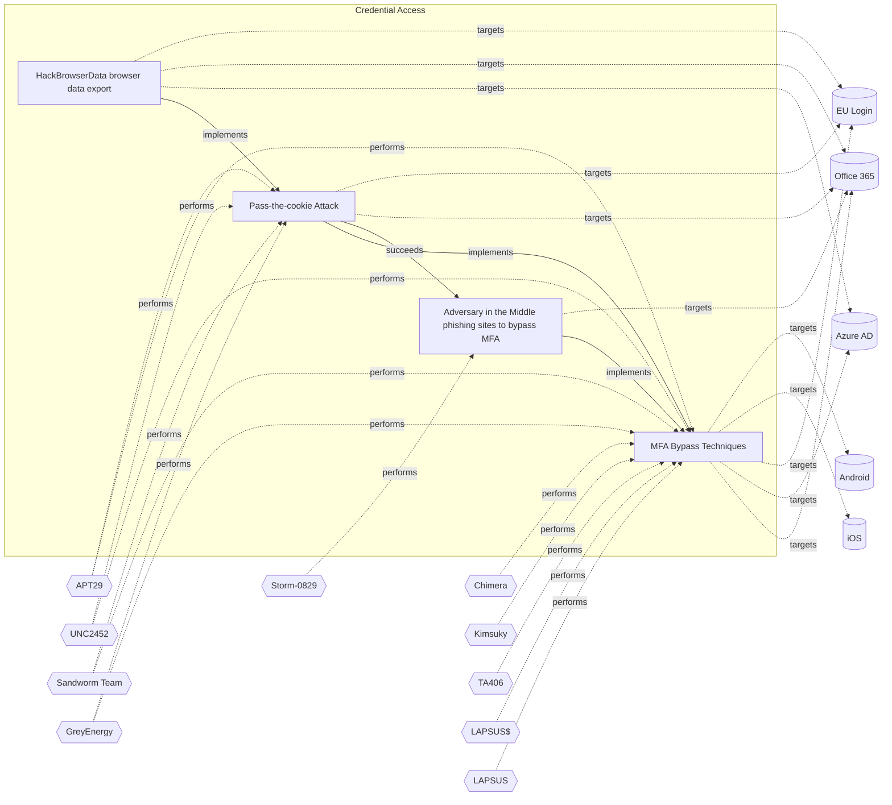

# ☣️ HackBrowserData browser data export

🔥 **Criticality:High** ⚠️ : A High priority incident is likely to result in a demonstrable impact to public health or safety, national security, economic security, foreign relations, civil liberties, or public confidence. 

🚦 **TLP:CLEAR** ⚪ : Recipients can spread this to the world, there is no limit on disclosure.

🗡️ **ATT&CK Techniques** [T1111 : Multi-Factor Authentication Interception](https://attack.mitre.org/techniques/T1111 'Adversaries may target multi-factor authentication MFA mechanisms, ie, smart cards, token generators, etc to gain access to credentials that can be us')

---

`🔑 UUID : ba88c4a0-bf3b-46cb-b022-050ae22abce8` **|** `🏷️ Version : 1` **|** `🗓️ Creation Date : 2024-11-05` **|** `🗓️ Last Modification : 2024-11-05` **|** `Sharing Organisation : {'uuid': '56b0a0f0-b0bc-47d9-bb46-02f80ae2065a', 'name': 'EC DIGIT CSOC'}` **|** `🧱 Schema Identifier : tvm::2.0`

## 👁️ Description

> HackBrowserData is a command-line tool for decrypting and exporting data
> (passwords, history, cookies, bookmarks, credit cards, download history,
> localStorage and extensions) from the browser. 
> 
> It supports the most popular browsers on the market and runs on Windows, macOS and Linux.
> 
> Usage examples:
> 
> ## Automatic scan of the browser on the current computer, 
>    outputting the decryption results in JSON format and compressing as zip.
> 
> PS C:\Users\JohnDoe\Desktop> .\hack-browser-data.exe -b all -f json --dir results --zip
> 
> PS C:\Users\JohnDoe\Desktop> ls -l .\results\
>     Directory: C:\Users\JohnDoe\Desktop\results
> 
> ## Run with custom browser profile folder, using the -p parameter to specify the
>    path of the browser profile folder.
>   
> PS C:\Users\JohnDoe\Desktop> .\hack-browser-data.exe -b chrome -p "C:\Users\User\AppData\Local\Microsoft\Edge\User Data\Default"
> 
> [NOTICE] [browsingdata.go:59,Output] output to file results/chrome_creditcard.csv success  
> [NOTICE] [browsingdata.go:59,Output] output to file results/chrome_bookmark.csv success  
> [NOTICE] [browsingdata.go:59,Output] output to file results/chrome_cookie.csv success  
> [NOTICE] [browsingdata.go:59,Output] output to file results/chrome_history.csv success  
> [NOTICE] [browsingdata.go:59,Output] output to file results/chrome_download.csv success  
> [NOTICE] [browsingdata.go:59,Output] output to file results/chrome_password.csv success  
> 

## 🖥️ Terrain 

 > Attacker must compromise a user endpoint and exfiltrate the browser cookies.
> Cookies can be found on disk, in the process memory of the browser, and in
> network traffic to remote systems.
> 

---

## 🕸️ Relations

### 🌊 OpenTide Objects
🚫 No related OpenTide objects indexed.

 --- 

### ⛓️ Threat Chaining

Expand chaining data

| ☣️ Vector                                                                                                                                                                                                                                                                                                            | ⛓️ Link                 | 🎯 Target                                                                                                                                                                                                                                                                                                             | ⛰️ Terrain                                                                                                                                                                                                                                                                                                                                                         | 🗡️ ATT&CK                                                                                                                                                                                                                                                                                                                                                                                                                                                                                                                                                                                                                                                                                                                                                                                                                                                                                                                                                                                                                                                                               |
|:---------------------------------------------------------------------------------------------------------------------------------------------------------------------------------------------------------------------------------------------------------------------------------------------------------------------|:------------------------|:---------------------------------------------------------------------------------------------------------------------------------------------------------------------------------------------------------------------------------------------------------------------------------------------------------------------|:-------------------------------------------------------------------------------------------------------------------------------------------------------------------------------------------------------------------------------------------------------------------------------------------------------------------------------------------------------------------|:----------------------------------------------------------------------------------------------------------------------------------------------------------------------------------------------------------------------------------------------------------------------------------------------------------------------------------------------------------------------------------------------------------------------------------------------------------------------------------------------------------------------------------------------------------------------------------------------------------------------------------------------------------------------------------------------------------------------------------------------------------------------------------------------------------------------------------------------------------------------------------------------------------------------------------------------------------------------------------------------------------------------------------------------------------------------------------------|
| [HackBrowserData browser data export](../Threat%20Vectors/☣️%20HackBrowserData%20browser%20data%20export.md 'HackBrowserData is a command-line tool for decrypting and exporting datapasswords, history, cookies, bookmarks, credit cards, download history,localSt...')                                             | `atomicity::implements` | [Pass-the-cookie Attack](../Threat%20Vectors/☣️%20Pass-the-cookie%20Attack.md 'Pass-The-Cookie PTC, also known as token compromise, is a common attack techniqueemployed by threat actors in SaaS environments A PTC is a type of att...')                                                                           | Attacker must compromise a user endpoint and exfiltrate the browser cookies. Cookies can be found on disk, in the process memory of the browser, and in network traffic to remote systems.  Additionally, other applications on the user endpoint machine might store sensitive authentication cookies in memory (e.g. apps which authenticate to cloud services). | [T1111 : Multi-Factor Authentication Interception](https://attack.mitre.org/techniques/T1111 'Adversaries may target multi-factor authentication MFA mechanisms, ie, smart cards, token generators, etc to gain access to credentials that can be us')                                                                                                                                                                                                                                                                                                                                                                                                                                                                                                                                                                                                                                                                                                                                                                                                                                  |
| [Pass-the-cookie Attack](../Threat%20Vectors/☣️%20Pass-the-cookie%20Attack.md 'Pass-The-Cookie PTC, also known as token compromise, is a common attack techniqueemployed by threat actors in SaaS environments A PTC is a type of att...')                                                                           | `sequence::succeeds`    | [Adversary in the Middle phishing sites to bypass MFA](../Threat%20Vectors/☣️%20Adversary%20in%20the%20Middle%20phishing%20sites%20to%20bypass%20MFA.md 'Threat actors use malicious attachments to send the users to redirection site, which hosts a fake MFA login pageThe MitM page completes the authentica...') | An adversary needs to target companies and contacts  to distribute the malware, it's used a massive distrigution  technique on a random principle.                                                                                                                                                                                                                 | [T1566.002](https://attack.mitre.org/techniques/T1566/002 'Adversaries may send spearphishing emails with a malicious link in an attempt to gain access to victim systems Spearphishing with a link is a specific'), [T1557](https://attack.mitre.org/techniques/T1557 'Adversaries may attempt to position themselves between two or more networked devices using an adversary-in-the-middle AiTM technique to support follow'), [T1539](https://attack.mitre.org/techniques/T1539 'An adversary may steal web application or service session cookies and use them to gain access to web applications or Internet services as an authentic'), [T1556](https://attack.mitre.org/techniques/T1556 'Adversaries may modify authentication mechanisms and processes to access user credentials or enable otherwise unwarranted access to accounts The authe'), [T1078.004](https://attack.mitre.org/techniques/T1078/004 'Valid accounts in cloud environments may allow adversaries to perform actions to achieve Initial Access, Persistence, Privilege Escalation, or Defense')         |
| [Pass-the-cookie Attack](../Threat%20Vectors/☣️%20Pass-the-cookie%20Attack.md 'Pass-The-Cookie PTC, also known as token compromise, is a common attack techniqueemployed by threat actors in SaaS environments A PTC is a type of att...')                                                                           | `atomicity::implements` | [MFA Bypass Techniques](../Threat%20Vectors/☣️%20MFA%20Bypass%20Techniques.md 'MFA is a technique that requires more than one piece of evidence to authorize the user to access a resource If two pieces of evidence are needed to ve...')                                                                           | Sufficient reconnaissance to identify a target account and MFA technologies being used.                                                                                                                                                                                                                                                                            | [T1111](https://attack.mitre.org/techniques/T1111 'Adversaries may target multi-factor authentication MFA mechanisms, ie, smart cards, token generators, etc to gain access to credentials that can be us'), [T1621](https://attack.mitre.org/techniques/T1621 'Adversaries may attempt to bypass multi-factor authentication MFA mechanisms and gain access to accounts by generating MFA requests sent to usersAdver'), [T1566.001](https://attack.mitre.org/techniques/T1566/001 'Adversaries may send spearphishing emails with a malicious attachment in an attempt to gain access to victim systems Spearphishing attachment is a spe'), [T1566.002](https://attack.mitre.org/techniques/T1566/002 'Adversaries may send spearphishing emails with a malicious link in an attempt to gain access to victim systems Spearphishing with a link is a specific'), [T1566.004](https://attack.mitre.org/techniques/T1566/004 'Adversaries may use voice communications to ultimately gain access to victim systems Spearphishing voice is a specific variant of spearphishing It is ') |
| [Adversary in the Middle phishing sites to bypass MFA](../Threat%20Vectors/☣️%20Adversary%20in%20the%20Middle%20phishing%20sites%20to%20bypass%20MFA.md 'Threat actors use malicious attachments to send the users to redirection site, which hosts a fake MFA login pageThe MitM page completes the authentica...') | `atomicity::implements` | [MFA Bypass Techniques](../Threat%20Vectors/☣️%20MFA%20Bypass%20Techniques.md 'MFA is a technique that requires more than one piece of evidence to authorize the user to access a resource If two pieces of evidence are needed to ve...')                                                                           | Sufficient reconnaissance to identify a target account and MFA technologies being used.                                                                                                                                                                                                                                                                            | [T1111](https://attack.mitre.org/techniques/T1111 'Adversaries may target multi-factor authentication MFA mechanisms, ie, smart cards, token generators, etc to gain access to credentials that can be us'), [T1621](https://attack.mitre.org/techniques/T1621 'Adversaries may attempt to bypass multi-factor authentication MFA mechanisms and gain access to accounts by generating MFA requests sent to usersAdver'), [T1566.001](https://attack.mitre.org/techniques/T1566/001 'Adversaries may send spearphishing emails with a malicious attachment in an attempt to gain access to victim systems Spearphishing attachment is a spe'), [T1566.002](https://attack.mitre.org/techniques/T1566/002 'Adversaries may send spearphishing emails with a malicious link in an attempt to gain access to victim systems Spearphishing with a link is a specific'), [T1566.004](https://attack.mitre.org/techniques/T1566/004 'Adversaries may use voice communications to ultimately gain access to victim systems Spearphishing voice is a specific variant of spearphishing It is ') |

&nbsp; 

---

## Model Data

#### **⛓️ Cyber Kill Chain**

 > Cyber attacks are typically phased progressions towards strategic objectives. The Unified Kill Chains provides insight into the tactics that hackers employ to attain these objectives. This provides a solid basis to develop (or realign) defensive strategies to raise cyber resilience.

 [`🔑 Credential Access`](https://www.unifiedkillchain.com/assets/The-Unified-Kill-Chain.pdf) : Techniques resulting in the access of, or control over, system, service or domain credentials.

---

#### **🛰️ Domains**

 > Infrastructure technologies domain of interest to attackers.

  - `🏢 Enterprise` : Generic databases, applications, machines and systems that are usually on premises or on Cloud traditional VMs.
 - `☁️ Public Cloud` : Infrastructure handled by a commercial cloud provider. Managed mostly on a service level, and connected over the internet.
 - `☁️ Private Cloud` : Infrastructure hosted at a third party, but based on custom specification and managed on a platform level.
 - `🕸️ SaaS` : Subscription based access to software.

---

#### **🎯 Targets**

 > Granular delimited technical entities holding a value to the organization, that are targeted by adversaries. They might be also involved in the detection coverage as the target of log collection. Partially inspired by Veris.

  - [`🔐 Auth token`](http://veriscommunity.net/enums.html#section-asset) : User Device - Authentication token or device
 - [`☁️ Cloud Portal`](http://veriscommunity.net/enums.html#section-asset) : Placeholder
 - [`👤 End-user`](http://veriscommunity.net/enums.html#section-asset) : People - End-user
 - [`👤 Identity Services`](http://veriscommunity.net/enums.html#section-asset) : Placeholder

---

#### **💿 Platforms concerned**

 > Actual technologies used by the organization that will be exploited by adversaries during a successful attack, and eventually of relevance for detection. Are named by commercial designation.

  - ` EU Login` : Placeholder
 - ` Office 365` : Placeholder
 - ` Azure AD` : Placeholder

---

#### **💣 Severity**

 > The severity summarizes the overall danger of incident the vector will provoke, and is to be derived (WIP) from impact, leverage, and difficulty to execute.

 [`🧨 Moderate incident`](https://www.ncsc.gov.uk/news/new-cyber-attack-categorisation-system-improve-uk-response-incidents) : A cyber attack on a small organisation, or which poses a considerable risk to a medium-sized organisation, or preliminary indications of cyber activity against a large organisation or the government.

---

#### **🪄 Leverage acquisition**

 > Technical aftermath of the attack from the target perspective, differentiated from impact as it does not consider the value of the consequence, only what increased control the vector execution provides to the adversary.

  - [`💅 Elevation of privilege`](https://owasp.org/www-community/Threat_Modeling_Process#stride) : Capacity to augment leverage over the target system by upgrading the compromised access rights
 - [`👻 Spoofing`](https://owasp.org/www-community/Threat_Modeling_Process#stride) : Threat action aimed at accessing and use of another user’s credentials, such as username and password.

---

#### **💥 Impact**

 > Analysis of the threat vector from the organizational perspective, in non technical term. This aims at putting a clear denomination on what the attacker will actually be able to act upon if the threat vector is realized.

  - [`🥸 Identity Theft`](http://veriscommunity.net/enums.html#section-impact) : Acquisition of sufficient information and privileges to profess as a given individual, for the purpose of abusing and deceiving human trust relationships.
 - [`🩼 Impairement`](http://veriscommunity.net/enums.html#section-impact) : Incapacitation of a particular key system that will cause disruptions in day-to-day operations, and eventually service delivery.

---

#### **🎲 Vector Viability**

 > Described with estimative language (likelyhood probability), describes how likely the analyst believes the vector to actually be realized on the organization infrastructure. Estimative language describes quality and credibility of underlying sources, data, and methodologies based Intelligence Community Directive 203 (ICD 203) and JP 2-0, Joint Intelligence.

 [`♻️ Environment dependent`](https://www.dni.gov/files/documents/ICD/ICD%20203%20Analytic%20Standards.pdf) : Depends

---

### 🔗 References

**🕊️ Publicly available resources**

- [_1_] https://github.com/moonD4rk/HackBrowserData

[1]: https://github.com/moonD4rk/HackBrowserData

---

#### 🏷️ Tags

#-, #-, #-, #
, #
, ##, ##, ##, ##, # , #🏷, #️, # , #T, #a, #g, #s, #
, #

